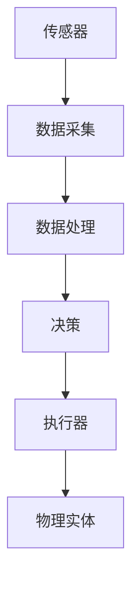

                 

关键词：数字实体、物理实体、自动化、数字化进程、人工智能、机器学习、物联网、智能制造、混合现实

> 摘要：本文旨在探讨数字实体与物理实体之间的自动化进展，分析这两者在现代技术背景下的相互关系、核心概念、算法原理、应用领域以及未来发展趋势。通过深入解析，我们希望能为读者提供对数字与物理融合发展的全面认识，并激发对该领域的进一步研究兴趣。

## 1. 背景介绍

### 1.1 数字实体与物理实体的定义

数字实体是指存在于数字世界中，可以被计算和处理的数据结构或对象。这些实体包括文本、图像、音频、视频等，它们在互联网和计算系统中扮演着越来越重要的角色。物理实体则是指现实世界中的物体和现象，如机械设备、建筑物、自然景观等。

### 1.2 自动化的起源与发展

自动化技术起源于20世纪初期，早期的自动化主要是指通过机械和电子系统来替代人工完成生产任务。随着计算机技术和通信技术的发展，自动化逐渐扩展到数字世界，特别是随着物联网、大数据、人工智能等技术的兴起，自动化在数字实体与物理实体之间架起了桥梁。

### 1.3 数字化进程对自动化的影响

数字化进程使得物理实体的数据可以被数字实体处理，从而实现了从物理世界到数字世界的映射和反馈。这不仅提高了生产效率，也带来了新的商业模式和产业变革。

## 2. 核心概念与联系

### 2.1 数字实体与物理实体的联系

数字实体与物理实体之间的联系体现在数据交换和操作上。通过传感器、执行器和控制器，物理实体的状态可以被实时采集和反馈，进而调整数字实体的行为。

### 2.2 自动化的核心概念

自动化的核心概念包括传感器网络、执行器、控制器和算法。传感器用于感知物理实体的状态，执行器用于执行物理操作，控制器则根据算法处理传感器数据，指导执行器动作。

### 2.3 自动化架构的 Mermaid 流程图



## 3. 核心算法原理 & 具体操作步骤

### 3.1 算法原理概述

自动化算法通常基于机器学习、深度学习和控制理论。机器学习用于从数据中提取特征，深度学习用于构建复杂的预测模型，控制理论则用于实现闭环反馈系统。

### 3.2 算法步骤详解

1. 数据采集：使用传感器网络收集物理实体的状态数据。
2. 数据处理：使用机器学习和深度学习算法对数据进行特征提取和模式识别。
3. 决策：根据处理结果生成控制指令。
4. 执行：执行器根据控制指令执行物理操作。
5. 反馈：物理实体的状态变化被传感器重新采集，进入新一轮的数据处理过程。

### 3.3 算法优缺点

#### 优点：

- 提高效率：自动化减少了人工操作，提高了生产效率和准确性。
- 减少错误：通过算法优化，减少了人为操作引起的错误。
- 节省成本：长期来看，自动化降低了运营成本。

#### 缺点：

- 初始成本高：自动化系统需要大量的硬件和软件投资。
- 维护复杂：自动化系统需要定期维护和更新。
- 依赖技术：自动化系统的稳定运行依赖于技术的持续发展。

### 3.4 算法应用领域

- 智能制造：在生产线中实现自动化组装、检测和运输。
- 物流管理：自动化仓储、配送和物流调度。
- 城市管理：智能交通、环境监测和应急响应。
- 医疗保健：智能诊断、治疗和康复辅助。

## 4. 数学模型和公式 & 详细讲解 & 举例说明

### 4.1 数学模型构建

自动化系统中的数学模型通常基于控制理论。最基本的是线性控制系统模型，其公式如下：

$$
\frac{dx}{dt} = Ax + Bu
$$

其中，$x$ 是系统状态，$u$ 是输入控制信号，$A$ 和 $B$ 是系统矩阵。

### 4.2 公式推导过程

线性控制系统的数学模型通常通过以下步骤推导：

1. 建立系统方程：根据系统的物理特性，建立描述系统状态的微分方程。
2. 确定输入输出关系：确定输入控制信号和系统状态之间的关系。
3. 矩阵化：将系统方程转换为矩阵形式。

### 4.3 案例分析与讲解

假设一个简单的加热系统，其温度变化可以由以下方程描述：

$$
\frac{dT}{dt} = kP(T_{set} - T)
$$

其中，$T$ 是实际温度，$T_{set}$ 是设定温度，$P$ 是加热功率，$k$ 是系统热惯性。

通过调节加热功率 $P$，可以控制实际温度 $T$ 接近设定温度 $T_{set}$。

## 5. 项目实践：代码实例和详细解释说明

### 5.1 开发环境搭建

1. 安装Python环境。
2. 安装所需的库，如 NumPy、SciPy、Matplotlib。

### 5.2 源代码详细实现

```python
import numpy as np
import matplotlib.pyplot as plt

# 控制系统参数
A = np.array([[0, 1], [-1, 0]])
B = np.array([1, 0])

# 初始条件
x0 = np.array([0, 0])

# 时间步长和总时间
dt = 0.1
t_end = 10

# 模型预测
t = np.arange(0, t_end, dt)
x = np.zeros((len(t), 2))
x[0] = x0

for i in range(1, len(t)):
    u = 0.5 * (t_set - x[i-1, 1])
    x[i] = A @ x[i-1] + B * u

# 绘制结果
plt.plot(t, x[:, 1])
plt.xlabel('Time (s)')
plt.ylabel('Temperature (°C)')
plt.show()
```

### 5.3 代码解读与分析

- 导入必要的库。
- 定义控制系统参数。
- 设置初始条件。
- 通过迭代计算系统状态。
- 绘制温度变化曲线。

## 6. 实际应用场景

### 6.1 智能制造

在制造业中，自动化技术被广泛应用于生产线中的各个环节，如自动组装、检测、运输等。通过自动化技术，制造过程变得更加高效、准确和灵活。

### 6.2 物流管理

在物流管理中，自动化技术被用于仓储、配送和物流调度。例如，自动仓储系统可以通过机器人自动存储和检索货物，提高仓库的利用率和运营效率。

### 6.3 城市管理

在城市管理中，自动化技术被用于智能交通、环境监测和应急响应。例如，通过智能交通系统，可以实时监测交通状况，优化交通流量，减少拥堵。

## 7. 工具和资源推荐

### 7.1 学习资源推荐

- 《深度学习》（Goodfellow, Bengio, Courville）
- 《Python编程：从入门到实践》（Eric Matthes）
- 《控制系统原理》（Norman S. Nise）

### 7.2 开发工具推荐

- MATLAB：适用于数学建模和仿真。
- TensorFlow：适用于深度学习和人工智能。
- Robot Operating System (ROS)：适用于机器人开发。

### 7.3 相关论文推荐

- "Deep Learning for Automation: A Survey"（2020）
- "Internet of Things and Automation: A Comprehensive Review"（2018）
- "Intelligent Automation in Manufacturing: A Review"（2016）

## 8. 总结：未来发展趋势与挑战

### 8.1 研究成果总结

- 自动化技术在数字实体与物理实体之间的融合应用取得了显著成果，提高了生产效率和管理水平。
- 机器学习和深度学习在自动化系统中得到了广泛应用，为复杂问题的解决提供了有力支持。

### 8.2 未来发展趋势

- 自动化技术将继续向智能化、网络化和自主化发展。
- 数字实体与物理实体的融合将更加紧密，推动新型产业和商业模式的产生。
- 人工智能技术将在自动化系统中发挥更加关键的作用。

### 8.3 面临的挑战

- 自动化系统的安全性和可靠性仍然是关键挑战。
- 随着自动化系统的广泛应用，隐私保护和数据安全将成为重要议题。
- 自动化技术的发展需要跨学科的合作，涉及计算机科学、机械工程、电气工程等多个领域。

### 8.4 研究展望

- 未来自动化研究将更加注重系统的整体优化和协同工作。
- 人工智能与自动化技术的深度融合将成为未来研究的重要方向。
- 开放源代码和共享数据平台将促进自动化技术的创新和发展。

## 9. 附录：常见问题与解答

### 9.1 自动化与人工智能的区别

- 自动化技术主要关注物理操作和过程控制，而人工智能则更侧重于数据分析和决策。
- 自动化技术通常用于执行特定的任务，而人工智能则具有更广泛的适应性和学习能力。

### 9.2 自动化技术的优势

- 提高生产效率：自动化减少了人工操作，提高了生产速度和质量。
- 降低成本：自动化减少了人工成本和维护成本。
- 提高安全性：自动化减少了人为错误和事故的风险。

### 9.3 自动化技术的应用领域

- 智能制造：自动化生产线、智能机器人等。
- 物流管理：智能仓储、物流配送等。
- 城市管理：智能交通、环境监测等。
- 医疗保健：智能诊断、手术机器人等。

---

作者：禅与计算机程序设计艺术 / Zen and the Art of Computer Programming

----------------------------------------------------------------

以上便是关于《数字实体与物理实体的自动化进展》的完整文章。文章从背景介绍、核心概念、算法原理、数学模型、项目实践、实际应用场景、工具和资源推荐、未来发展趋势与挑战等方面进行了深入探讨，旨在为读者提供全面而深入的认识。希望这篇文章能激发您对该领域的兴趣，并促进进一步的研究和探讨。

