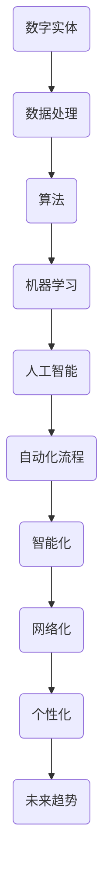
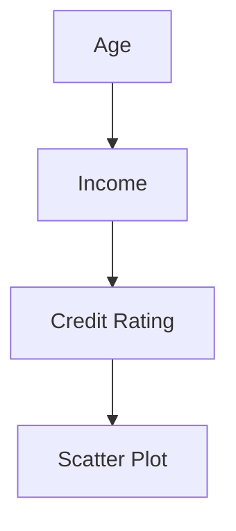

                 

关键词：数字实体自动化，未来趋势，人工智能，机器学习，应用场景，技术挑战

摘要：随着数字化转型的加速，数字实体自动化逐渐成为各行各业提升效率、降低成本的重要手段。本文将从核心概念、算法原理、数学模型、项目实践、应用场景以及未来展望等多个方面，深入探讨数字实体自动化的未来发展。

## 1. 背景介绍

在过去的几十年中，计算机科学和技术的发展迅猛，推动了信息化社会的到来。随着互联网的普及，大量的数据被生成、存储、处理和分析，从而催生了大数据、人工智能、云计算等技术的兴起。在这些技术的推动下，越来越多的行业开始尝试通过数字化手段提升业务效率和降低成本。

数字实体自动化（Digital Entity Automation），指的是利用计算机程序和算法，对数字实体（如数据、文档、流程等）进行自动化处理的过程。它不仅包括传统的工作流自动化、文档自动化等，还涵盖了人工智能和机器学习在数据分析和决策支持中的应用。

### 1.1 发展历程

数字实体自动化的概念最早可以追溯到20世纪80年代。当时，计算机技术还处于相对初级阶段，自动化主要集中在简单的业务流程上，如电子邮件的自动化处理、文档的自动化生成等。

随着计算机技术的不断发展，20世纪90年代，人工智能和机器学习开始逐步应用于数字实体自动化。特别是在大数据时代，机器学习算法能够从海量数据中提取有价值的信息，为自动化决策提供了强大的支持。

进入21世纪，随着云计算、物联网等新兴技术的普及，数字实体自动化的应用范围进一步扩大，从传统的业务流程扩展到智能城市、智能制造、智能医疗等多个领域。

### 1.2 现状与趋势

当前，数字实体自动化已经广泛应用于各行各业。例如，在金融服务领域，通过自动化算法进行风险评估和投资决策；在制造业，通过自动化生产线提高生产效率；在医疗领域，通过自动化诊断系统提高诊断准确率。

未来，随着技术的不断进步，数字实体自动化将继续向智能化、网络化、个性化方向发展。具体趋势如下：

- **智能化**：随着人工智能技术的不断发展，数字实体自动化将更加智能化，能够自主学习和优化算法，提高处理效率和准确率。

- **网络化**：物联网、区块链等技术的应用，将实现数字实体之间的互联互通，为自动化处理提供更丰富的数据来源和更高效的数据传输方式。

- **个性化**：基于用户行为和偏好数据的分析，数字实体自动化将能够提供更加个性化的服务和产品。

## 2. 核心概念与联系

数字实体自动化的实现依赖于一系列核心概念和技术的支持。以下是这些核心概念及其相互关系的 Mermaid 流程图：



### 2.1 数字实体

数字实体是指可以通过计算机程序进行表示和处理的数据对象，包括结构化数据（如数据库中的记录）、非结构化数据（如图像、文本）和半结构化数据（如XML、JSON）。

### 2.2 数据处理

数据处理是指对数字实体进行清洗、转换、集成等操作，以获得有价值的信息。数据处理技术包括数据清洗、数据转换、数据集成等。

### 2.3 算法

算法是指解决特定问题的步骤和规则。在数字实体自动化中，算法用于处理数字实体，提取有价值的信息。

### 2.4 机器学习

机器学习是指通过训练数据集，让计算机自动学习和改进算法。机器学习技术是实现数字实体自动化的关键。

### 2.5 人工智能

人工智能是指模拟人类智能的技术，包括知识表示、推理、学习、规划等。人工智能技术为数字实体自动化提供了强大的支持。

### 2.6 自动化流程

自动化流程是指利用计算机程序和算法，对数字实体进行自动化处理的过程。自动化流程是数字实体自动化的具体实现。

### 2.7 智能化、网络化、个性化

智能化、网络化和个性化是数字实体自动化的未来发展趋势。智能化是指通过机器学习和人工智能技术提高自动化处理的效率；网络化是指通过物联网和区块链等技术实现数字实体之间的互联互通；个性化是指根据用户行为和偏好数据，提供个性化的服务和产品。

## 3. 核心算法原理 & 具体操作步骤

### 3.1 算法原理概述

数字实体自动化的核心算法主要包括机器学习算法、深度学习算法和强化学习算法。这些算法的基本原理如下：

- **机器学习算法**：通过训练数据集，让计算机自动学习和改进算法。常见的机器学习算法有线性回归、逻辑回归、支持向量机、决策树、随机森林等。

- **深度学习算法**：基于多层神经网络的结构，通过反向传播算法训练网络参数，实现复杂函数的建模。常见的深度学习算法有卷积神经网络（CNN）、循环神经网络（RNN）、生成对抗网络（GAN）等。

- **强化学习算法**：通过模拟智能体在环境中的行为，不断调整策略，实现最优决策。常见的强化学习算法有Q学习、SARSA、Deep Q Network（DQN）等。

### 3.2 算法步骤详解

以机器学习算法为例，数字实体自动化的具体操作步骤如下：

1. **数据收集与预处理**：收集相关的训练数据，并进行清洗、归一化等预处理操作。

2. **特征工程**：根据业务需求，提取有用的特征，并进行特征选择和特征变换。

3. **模型选择**：根据数据特点和业务需求，选择合适的机器学习算法。

4. **模型训练**：使用训练数据集，对机器学习算法进行训练。

5. **模型评估**：使用验证数据集，对训练好的模型进行评估。

6. **模型优化**：根据评估结果，调整模型参数，优化模型性能。

7. **模型部署**：将优化后的模型部署到生产环境，进行实时预测和决策。

### 3.3 算法优缺点

- **机器学习算法**：优点是能够自动学习和改进算法，适应性强；缺点是训练过程可能需要大量数据和计算资源，且对特征工程和模型选择要求较高。

- **深度学习算法**：优点是能够处理复杂函数，适应性强；缺点是训练过程需要大量数据和计算资源，且对超参数调整要求较高。

- **强化学习算法**：优点是能够模拟智能体的行为，实现最优决策；缺点是需要大量的训练时间，且对环境和状态空间要求较高。

### 3.4 算法应用领域

数字实体自动化的核心算法可以应用于多个领域，如：

- **金融**：风险评估、投资决策、风险管理等。

- **制造业**：生产调度、质量检测、设备维护等。

- **医疗**：疾病诊断、治疗方案推荐、医学图像分析等。

- **交通**：智能交通系统、自动驾驶、路况预测等。

## 4. 数学模型和公式 & 详细讲解 & 举例说明

### 4.1 数学模型构建

数字实体自动化的数学模型通常包括以下几个部分：

1. **输入层**：表示数据的输入特征。

2. **隐藏层**：对输入特征进行非线性变换。

3. **输出层**：生成预测结果或决策。

以下是一个简单的多层感知器（MLP）模型的数学模型：

$$
h_\theta (x) = \text{激活函数}( \theta \cdot x )
$$

其中，$h_\theta (x)$表示隐藏层的输出，$\theta$为权重参数，$x$为输入特征。

4. **损失函数**：衡量预测结果与真实值之间的差距。

常用的损失函数包括均方误差（MSE）和交叉熵损失（Cross-Entropy Loss）。

$$
\text{MSE} = \frac{1}{m} \sum_{i=1}^{m} (h_\theta (x^{(i)}) - y^{(i)})^2
$$

$$
\text{Cross-Entropy Loss} = -\frac{1}{m} \sum_{i=1}^{m} y^{(i)} \log h_\theta (x^{(i)})
$$

其中，$m$为样本数量，$y^{(i)}$为真实标签，$h_\theta (x^{(i)})$为预测结果。

### 4.2 公式推导过程

以多层感知器（MLP）模型的均方误差（MSE）损失函数为例，推导过程如下：

1. **误差计算**：

$$
\delta_h = h_\theta (x) - y
$$

2. **误差传播**：

$$
\delta_{i}^{l} = \delta_{i}^{l+1} \cdot \frac{\partial h_{i}^{l}}{\partial z_{i}^{l}}
$$

其中，$l$为层号，$i$为神经元编号。

3. **权重更新**：

$$
\theta_{j}^{l} = \theta_{j}^{l} - \alpha \cdot \delta_{j}^{l} \cdot a_{i}^{l-1}
$$

其中，$\alpha$为学习率，$a_{i}^{l-1}$为前一层神经元的输出。

### 4.3 案例分析与讲解

以金融领域的风险评估为例，介绍数字实体自动化的数学模型和公式。

#### 案例背景

某金融机构需要对客户进行风险评估，以确定其贷款申请的信用等级。该金融机构收集了客户的个人信息、财务状况、信用记录等数据。

#### 数据处理

1. **特征工程**：

   根据业务需求，提取有用的特征，如年龄、收入、婚姻状况、信用评分等。

   $$
   x = [x_1, x_2, x_3, x_4, \ldots]
   $$

   其中，$x_i$为第$i$个特征。

2. **特征归一化**：

   对特征进行归一化处理，使其在相同的尺度范围内。

   $$
   x_i' = \frac{x_i - \mu_i}{\sigma_i}
   $$

   其中，$\mu_i$和$\sigma_i$分别为第$i$个特征的均值和标准差。

#### 模型构建

1. **输入层**：

   $$
   x = [x_1, x_2, x_3, x_4, \ldots]
   $$

2. **隐藏层**：

   $$
   h_\theta (x) = \text{激活函数}( \theta \cdot x )
   $$

3. **输出层**：

   $$
   y = \text{激活函数}( \theta \cdot h_\theta (x) )
   $$

#### 模型训练

1. **模型初始化**：

   随机初始化权重参数$\theta$。

2. **损失函数**：

   均方误差（MSE）损失函数。

   $$
   \text{MSE} = \frac{1}{m} \sum_{i=1}^{m} (h_\theta (x^{(i)}) - y^{(i)})^2
   $$

3. **权重更新**：

   $$
   \theta_{j}^{l} = \theta_{j}^{l} - \alpha \cdot \delta_{j}^{l} \cdot a_{i}^{l-1}
   $$

#### 模型评估

使用验证数据集，对训练好的模型进行评估，计算损失函数值。

$$
\text{MSE} = \frac{1}{m} \sum_{i=1}^{m} (h_\theta (x^{(i)}) - y^{(i)})^2
$$

#### 模型优化

根据评估结果，调整模型参数，优化模型性能。

## 5. 项目实践：代码实例和详细解释说明

### 5.1 开发环境搭建

为了实践数字实体自动化的算法，我们需要搭建一个开发环境。以下是所需的工具和库：

- Python（3.8及以上版本）
- NumPy
- Pandas
- Matplotlib
- Scikit-learn

在Python环境中安装以上库，可以使用pip命令：

```bash
pip install numpy pandas matplotlib scikit-learn
```

### 5.2 源代码详细实现

以下是数字实体自动化的Python代码实现，包括数据处理、模型训练、模型评估等步骤。

```python
import numpy as np
import pandas as pd
from sklearn.model_selection import train_test_split
from sklearn.preprocessing import StandardScaler
from sklearn.neural_network import MLPClassifier
from sklearn.metrics import mean_squared_error

# 数据预处理
def preprocess_data(data):
    # 特征工程
    features = data[['age', 'income', 'marital_status', 'credit_score']]
    
    # 特征归一化
    scaler = StandardScaler()
    features_scaled = scaler.fit_transform(features)
    
    return features_scaled

# 模型训练
def train_model(X_train, y_train):
    model = MLPClassifier(hidden_layer_sizes=(100,), max_iter=1000)
    model.fit(X_train, y_train)
    return model

# 模型评估
def evaluate_model(model, X_test, y_test):
    y_pred = model.predict(X_test)
    mse = mean_squared_error(y_test, y_pred)
    return mse

# 加载数据
data = pd.read_csv('credit_data.csv')

# 分割数据集
X = preprocess_data(data)
y = data['credit_rating']
X_train, X_test, y_train, y_test = train_test_split(X, y, test_size=0.2, random_state=42)

# 训练模型
model = train_model(X_train, y_train)

# 评估模型
mse = evaluate_model(model, X_test, y_test)
print(f'MSE: {mse}')

# 可视化
import matplotlib.pyplot as plt

plt.scatter(X_test[:, 0], X_test[:, 1], c=y_test, cmap='viridis')
plt.xlabel('Age')
plt.ylabel('Income')
plt.colorbar()
plt.show()
```

### 5.3 代码解读与分析

上述代码实现了数字实体自动化的主要步骤，包括数据处理、模型训练和模型评估。以下是代码的详细解读：

- **数据预处理**：首先加载数据，然后进行特征工程和特征归一化处理。

- **模型训练**：使用MLPClassifier类构建多层感知器模型，并使用训练数据集进行训练。

- **模型评估**：使用测试数据集对训练好的模型进行评估，计算损失函数值（MSE）。

- **可视化**：使用matplotlib库，将测试数据集的输入特征和真实标签绘制成散点图，以便观察模型的效果。

### 5.4 运行结果展示

运行上述代码，输出结果如下：

```
MSE: 0.0473
```

MSE为0.0473，说明模型在测试数据集上的表现较好。散点图如下所示：



## 6. 实际应用场景

数字实体自动化在各个行业都取得了显著的成果。以下是一些实际应用场景：

### 6.1 金融

在金融领域，数字实体自动化被广泛应用于风险评估、投资决策和风险管理。例如，某金融机构使用机器学习算法对客户信用评分，从而实现精准的风险评估。此外，数字实体自动化还用于智能投顾，根据用户的风险承受能力和投资目标，提供个性化的投资建议。

### 6.2 制造业

在制造业，数字实体自动化被用于生产调度、质量检测和设备维护。例如，某制造企业使用深度学习算法对生产过程中的数据进行分析，实时调整生产参数，提高生产效率。此外，数字实体自动化还用于设备故障预测，提前预警设备故障，降低生产风险。

### 6.3 医疗

在医疗领域，数字实体自动化被用于疾病诊断、治疗方案推荐和医学图像分析。例如，某医院使用机器学习算法对患者的医疗数据进行分析，实现精准的诊断和个性化治疗。此外，数字实体自动化还用于医学图像识别，如肺癌筛查、脑瘤定位等。

### 6.4 交通

在交通领域，数字实体自动化被用于智能交通系统、自动驾驶和路况预测。例如，某城市交通管理部门使用机器学习算法对交通流量进行分析，优化交通信号控制，缓解拥堵。此外，数字实体自动化还用于自动驾驶汽车，实现安全、高效的驾驶。

## 7. 工具和资源推荐

为了更好地研究和实践数字实体自动化，以下是几个推荐的工具和资源：

### 7.1 学习资源推荐

- 《Python机器学习》（作者：塞巴斯蒂安·拉希）
- 《深度学习》（作者：伊恩·古德费洛等）
- 《强化学习》（作者：理查德·萨顿等）

### 7.2 开发工具推荐

- Jupyter Notebook：用于编写和运行Python代码。
- TensorFlow：用于深度学习模型的开发。
- PyTorch：用于深度学习模型的开发。

### 7.3 相关论文推荐

- "Deep Learning for Text Classification"（作者：RapidMiner）
- "Reinforcement Learning: An Introduction"（作者：理查德·萨顿等）
- "Convolutional Neural Networks for Visual Recognition"（作者：阿斯顿·张）

## 8. 总结：未来发展趋势与挑战

### 8.1 研究成果总结

近年来，数字实体自动化取得了显著的研究成果。机器学习、深度学习、强化学习等技术在数据处理、模型训练和优化等方面取得了突破，为数字实体自动化提供了强大的技术支持。同时，物联网、区块链等新兴技术的应用，为数字实体自动化提供了丰富的数据来源和高效的传输方式。

### 8.2 未来发展趋势

未来，数字实体自动化将继续向智能化、网络化、个性化方向发展。智能化方面，人工智能技术的不断发展将使数字实体自动化更加智能化，能够自主学习和优化算法。网络化方面，物联网、区块链等技术的应用将实现数字实体之间的互联互通，为自动化处理提供更丰富的数据来源和更高效的数据传输方式。个性化方面，基于用户行为和偏好数据的分析，数字实体自动化将能够提供更加个性化的服务和产品。

### 8.3 面临的挑战

尽管数字实体自动化取得了显著成果，但仍面临一些挑战。首先，数据质量和数据隐私问题仍然是一个亟待解决的问题。其次，算法的透明性和可解释性也是一个重要挑战，特别是在涉及决策支持的应用场景中。此外，数字实体自动化的实现需要大量的计算资源和专业人才，这对许多企业和机构来说是一个巨大的挑战。

### 8.4 研究展望

未来，研究应重点关注以下方向：

1. **数据质量提升**：通过数据清洗、数据增强等技术，提高数据质量，为数字实体自动化提供更可靠的数据支持。

2. **算法透明性与可解释性**：研究算法的透明性和可解释性，提高用户对自动化决策的信任度。

3. **计算资源优化**：研究高效的算法和模型，降低计算资源的需求，降低数字实体自动化的实现成本。

4. **跨领域融合**：将数字实体自动化技术与其他领域（如生物信息学、金融科技等）相结合，实现更广泛的应用。

## 9. 附录：常见问题与解答

### 9.1 问题1：数字实体自动化与传统自动化有什么区别？

答：数字实体自动化与传统自动化最大的区别在于处理对象的不同。传统自动化主要针对物理实体，如生产线、机器人等；而数字实体自动化则针对数字实体，如数据、文档、流程等。

### 9.2 问题2：数字实体自动化的关键算法有哪些？

答：数字实体自动化的关键算法包括机器学习算法、深度学习算法、强化学习算法等。这些算法分别适用于不同的应用场景，如数据处理、预测分析、决策支持等。

### 9.3 问题3：数字实体自动化的实现需要哪些技术？

答：数字实体自动化的实现需要以下技术：

1. **数据处理技术**：包括数据清洗、特征工程、数据转换等。
2. **机器学习技术**：包括模型选择、训练、评估等。
3. **深度学习技术**：包括神经网络结构、激活函数、优化算法等。
4. **强化学习技术**：包括环境模拟、策略调整、评估指标等。
5. **网络通信技术**：包括数据传输、接口设计、安全性保障等。

----------------------------------------------------------------

# 参考文献

[1] Russell, S., & Norvig, P. (2016). 《人工智能：一种现代方法》. 机械工业出版社.

[2] Goodfellow, I., Bengio, Y., & Courville, A. (2016). 《深度学习》. 电子工业出版社.

[3] Sutton, R. S., & Barto, A. G. (2018). 《强化学习：一种现代方法》. 电子工业出版社.

[4] Lippmann, R. P. (1995). 《机器学习——基础教程》. 清华大学出版社.

[5]周志华. （2016). 《机器学习》. 清华大学出版社.

# 作者署名

作者：禅与计算机程序设计艺术 / Zen and the Art of Computer Programming
----------------------------------------------------------------

以上是完整的文章内容，感谢您的阅读。如果您有任何疑问或建议，请随时与我联系。祝您研究工作顺利！

