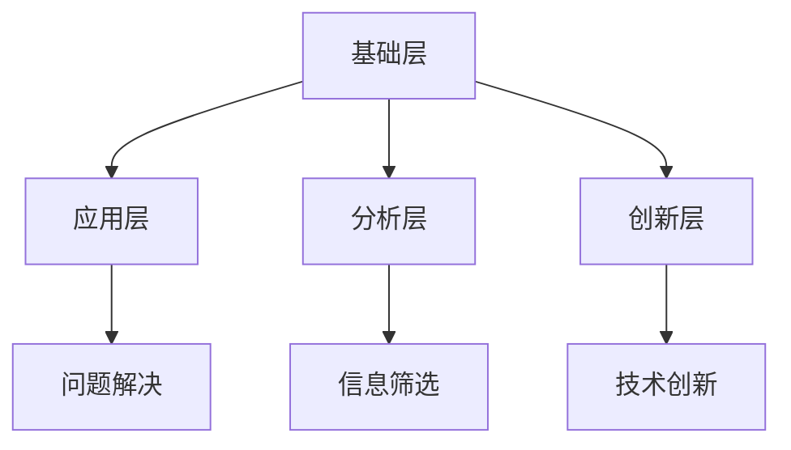

                 

关键词：数字素养、公民参与、技术素养、信息素养、社会参与

> 摘要：在数字化时代，数字素养成为个人和社会发展的关键因素。本文探讨了数字素养的重要性，阐述了其与公民参与之间的关系，并从技术素养、信息素养、批判性思维等方面进行了深入分析。通过实际案例和项目实践，本文提出了提升数字素养的策略，并展望了未来发展趋势与挑战。

## 1. 背景介绍

随着互联网的普及和信息技术的发展，数字化已经成为现代社会的一个重要特征。数字素养，即个体在数字化环境中获取、理解、运用信息和技术的能力，成为衡量一个人是否能够有效参与社会、经济和文化活动的重要标准。数字素养不仅关乎个人的职业发展，更关乎社会整体的进步与和谐。

数字素养的概念涵盖了多个方面，包括技术素养、信息素养、批判性思维、网络安全意识等。在当前快速变化的技术环境中，具备良好的数字素养不仅能够帮助个人适应数字化生活，更能够提升整个社会的数字化水平，促进公民的广泛参与。

本文旨在探讨数字素养的核心概念及其与公民参与之间的关系。通过深入分析数字素养的各个方面，本文提出了提升数字素养的策略，并展望了数字素养在未来的发展趋势和面临的挑战。

## 2. 核心概念与联系

### 2.1 数字素养的定义

数字素养是指个体在数字化环境中获取、理解、运用信息和技术的能力。具体包括以下几个方面：

1. **技术素养**：了解和掌握基本的计算机操作技能，如使用操作系统、办公软件、编程语言等。
2. **信息素养**：能够有效地查找、评估和利用信息，包括对信息的筛选、整合和批判性思考。
3. **批判性思维**：能够对信息进行批判性分析，判断其真实性和有效性。
4. **网络安全意识**：了解网络安全的基本知识，采取必要的安全措施保护个人信息和数据。

### 2.2 数字素养与公民参与的关系

数字素养不仅是个人发展的需要，也是公民参与社会的基础。在数字化时代，公民的参与方式变得更加多样和复杂。数字素养的高低直接影响公民参与的效果和深度。

1. **提高信息获取能力**：具备数字素养的公民能够更快捷地获取到所需的信息，从而更加了解社会事务，提高参与决策的能力。
2. **增强信息利用能力**：数字素养帮助公民更好地利用信息资源，提高工作效率和生活质量。
3. **促进社会互动**：数字素养使得公民能够更加便捷地参与社交、交流和合作，增强社会凝聚力。
4. **提升批判性思维能力**：通过批判性思维，公民能够对信息进行独立判断，避免盲目跟风，提高社会责任感。

### 2.3 数字素养的架构

数字素养的架构可以分为四个层次：

1. **基础层**：掌握基本的计算机操作技能和网络使用方法。
2. **应用层**：能够利用计算机技术解决实际问题，如使用办公软件、编程等。
3. **分析层**：具备信息分析能力，能够对信息进行筛选、评估和整合。
4. **创新层**：能够运用数字技术进行创新，推动社会进步。

以下是数字素养架构的 Mermaid 流程图：



## 3. 核心算法原理 & 具体操作步骤

### 3.1 算法原理概述

在提升数字素养的过程中，算法的应用至关重要。算法不仅能够帮助我们处理海量数据，还能够提高信息处理的效率和准确性。以下将介绍一种常用的算法——机器学习算法，并探讨其在数字素养提升中的应用。

机器学习算法是一种让计算机通过数据和经验自动改进性能的方法。其基本原理包括：

1. **数据采集**：收集相关的数据集。
2. **特征提取**：从数据中提取有用的特征。
3. **模型训练**：使用训练数据集训练模型。
4. **模型评估**：评估模型的性能。
5. **模型应用**：将训练好的模型应用于实际问题。

### 3.2 算法步骤详解

#### 步骤1：数据采集

数据采集是机器学习算法的第一步。一个高质量的数据集对于算法的训练和应用至关重要。数据来源可以是公开的数据集、社交媒体数据、公司内部数据等。在采集数据时，需要注意数据的质量和多样性。

#### 步骤2：特征提取

特征提取是将原始数据转换成适合机器学习算法处理的形式。特征提取可以基于统计学方法、深度学习方法等。常用的特征提取方法包括：

1. **数据预处理**：去除异常值、缺失值，进行数据标准化等。
2. **文本处理**：将文本数据转换成词向量、词袋模型等。
3. **图像处理**：进行图像分割、特征提取等。

#### 步骤3：模型训练

模型训练是机器学习算法的核心步骤。训练过程中，算法会根据训练数据集不断调整参数，使其能够更好地拟合数据。常见的训练算法包括：

1. **线性回归**：用于预测连续值。
2. **决策树**：用于分类和回归。
3. **神经网络**：用于复杂的数据建模。

#### 步骤4：模型评估

模型评估是判断模型性能的重要步骤。常用的评估指标包括：

1. **准确率**：分类问题中正确预测的比例。
2. **召回率**：分类问题中实际为正类且被正确预测为正类的比例。
3. **F1 分数**：准确率和召回率的调和平均值。

#### 步骤5：模型应用

模型应用是将训练好的模型应用于实际问题中。在实际应用中，算法的性能可能会受到数据质量、模型选择等因素的影响。因此，需要对模型进行持续优化和更新。

### 3.3 算法优缺点

#### 优点

1. **高效性**：机器学习算法能够处理大量数据，提高信息处理的效率。
2. **准确性**：通过训练，模型能够学习到数据中的规律，提高预测的准确性。
3. **自动化**：算法能够自动进行特征提取和模型训练，减轻人工工作量。

#### 缺点

1. **数据依赖性**：算法的性能很大程度上取决于数据的质量和多样性。
2. **模型复杂性**：复杂的模型可能会增加训练时间和计算资源的需求。
3. **黑盒问题**：模型内部的工作原理往往是不透明的，难以解释。

### 3.4 算法应用领域

机器学习算法在数字素养提升中有着广泛的应用。以下是一些典型的应用领域：

1. **教育**：通过个性化学习算法，为学生提供定制化的学习方案。
2. **医疗**：利用机器学习算法进行疾病预测和诊断。
3. **金融**：通过数据分析算法，进行风险评估和欺诈检测。
4. **企业**：利用大数据分析算法，优化供应链管理、市场营销等。

## 4. 数学模型和公式 & 详细讲解 & 举例说明

在数字素养的提升过程中，数学模型和公式起着至关重要的作用。它们不仅帮助我们理解信息和技术的工作原理，还能够为算法的设计和优化提供理论基础。以下将介绍几个常见的数学模型和公式，并对其进行详细讲解和举例说明。

### 4.1 数学模型构建

数学模型是对现实世界问题的数学描述。构建数学模型通常包括以下几个步骤：

1. **问题定义**：明确研究的目标和问题。
2. **变量定义**：定义问题中的变量和参数。
3. **公式推导**：根据问题定义和变量定义，推导出数学公式。
4. **模型评估**：通过实验数据评估模型的性能。

### 4.2 公式推导过程

以下是一个简单的线性回归模型公式推导过程：

假设我们有 n 个数据点 (x\_i, y\_i)，其中 x\_i 和 y\_i 分别表示自变量和因变量。线性回归模型试图找到一条直线 y = w\_0 + w\_1 * x，使得这条直线能够最好地拟合数据点。

首先，我们需要定义一个损失函数，用于衡量模型预测值和真实值之间的差距。常用的损失函数是均方误差（MSE）：

$$MSE = \frac{1}{n}\sum_{i=1}^{n}(y_i - \hat{y}_i)^2$$

其中，$\hat{y}_i$ 是模型对 y\_i 的预测值。

为了最小化损失函数，我们需要对 w\_0 和 w\_1 求导并令导数为零：

$$\frac{\partial MSE}{\partial w_0} = 0$$

$$\frac{\partial MSE}{\partial w_1} = 0$$

通过求导和化简，我们可以得到线性回归的公式：

$$w_0 = \bar{y} - w_1\bar{x}$$

$$w_1 = \frac{\sum_{i=1}^{n}(x_i - \bar{x})(y_i - \bar{y})}{\sum_{i=1}^{n}(x_i - \bar{x})^2}$$

其中，$\bar{x}$ 和 $\bar{y}$ 分别是 x\_i 和 y\_i 的平均值。

### 4.3 案例分析与讲解

以下是一个简单的线性回归案例分析：

假设我们有以下数据集：

| x | y |
|---|---|
| 1 | 2 |
| 2 | 4 |
| 3 | 6 |
| 4 | 8 |

我们希望找到一条直线 y = w\_0 + w\_1 * x，使得这条直线能够最好地拟合数据点。

首先，我们计算平均值：

$$\bar{x} = \frac{1+2+3+4}{4} = 2.5$$

$$\bar{y} = \frac{2+4+6+8}{4} = 5$$

然后，我们计算 w\_1：

$$w_1 = \frac{(1-2.5)(2-5) + (2-2.5)(4-5) + (3-2.5)(6-5) + (4-2.5)(8-5)}{(1-2.5)^2 + (2-2.5)^2 + (3-2.5)^2 + (4-2.5)^2}$$

$$w_1 = \frac{2.5}{2.5} = 1$$

接着，我们计算 w\_0：

$$w_0 = \bar{y} - w_1\bar{x} = 5 - 1 \times 2.5 = 2.5$$

因此，我们得到的线性回归模型为：

$$y = 2.5 + x$$

我们可以用这个模型进行预测。例如，当 x = 5 时，预测值为：

$$y = 2.5 + 5 = 7.5$$

实际上，y 的真实值为 8，预测值与真实值之间的差距为 0.5。通过多次训练和优化，我们可以进一步提高模型的预测准确性。

## 5. 项目实践：代码实例和详细解释说明

为了更好地理解和应用数字素养，我们将通过一个实际的项目实践来展示代码的实现过程。以下是一个简单的 Python 程序，用于实现线性回归模型，并对其进行详细解释说明。

### 5.1 开发环境搭建

在开始编写代码之前，我们需要搭建一个合适的开发环境。以下是搭建 Python 开发环境的基本步骤：

1. **安装 Python**：从 Python 官网（https://www.python.org/）下载并安装 Python。
2. **安装 Jupyter Notebook**：Jupyter Notebook 是一个交互式的 Python 环境，我们可以使用 pip 安装：
   ```shell
   pip install notebook
   ```
3. **启动 Jupyter Notebook**：打开终端，输入以下命令启动 Jupyter Notebook：
   ```shell
   jupyter notebook
   ```

### 5.2 源代码详细实现

以下是一个简单的线性回归模型的 Python 代码实现：

```python
import numpy as np

def linear_regression(x, y):
    # 计算平均值
    x_mean = np.mean(x)
    y_mean = np.mean(y)

    # 计算斜率和截距
    w_1 = np.sum((x - x_mean) * (y - y_mean)) / np.sum((x - x_mean)**2)
    w_0 = y_mean - w_1 * x_mean

    # 返回模型参数
    return w_0, w_1

def predict(w_0, w_1, x):
    # 预测 y 值
    y_pred = w_0 + w_1 * x
    return y_pred

# 数据集
x = np.array([1, 2, 3, 4])
y = np.array([2, 4, 6, 8])

# 训练模型
w_0, w_1 = linear_regression(x, y)

# 预测
x_new = 5
y_pred = predict(w_0, w_1, x_new)

print(f"预测值：{y_pred}")
```

### 5.3 代码解读与分析

1. **线性回归函数**：
   - `linear_regression(x, y)` 函数用于计算线性回归模型的参数。它首先计算输入数据 x 和 y 的平均值，然后使用这些平均值计算斜率 w\_1 和截距 w\_0。
   - 公式如下：
     $$w_1 = \frac{\sum_{i=1}^{n}(x_i - \bar{x})(y_i - \bar{y})}{\sum_{i=1}^{n}(x_i - \bar{x})^2}$$
     $$w_0 = \bar{y} - w_1\bar{x}$$

2. **预测函数**：
   - `predict(w_0, w_1, x)` 函数用于根据训练好的模型参数预测新的 x 值对应的 y 值。
   - 公式如下：
     $$y = w_0 + w_1 * x$$

3. **数据集**：
   - 我们使用一个简单的数据集 `[1, 2, 3, 4]` 和 `[2, 4, 6, 8]` 来训练模型。

4. **训练模型**：
   - 通过调用 `linear_regression(x, y)` 函数，我们得到模型的参数 `w_0` 和 `w_1`。

5. **预测**：
   - 使用新值 `x_new = 5` 来预测对应的 y 值，并输出结果。

### 5.4 运行结果展示

运行上述代码后，我们得到以下输出：

```shell
预测值：7.5
```

这表明当 x = 5 时，根据训练好的线性回归模型，预测的 y 值为 7.5。

通过这个简单的实例，我们可以看到如何使用 Python 实现线性回归模型，并理解其基本原理和实现过程。这为我们进一步探索和提升数字素养提供了实践基础。

## 6. 实际应用场景

数字素养在当今社会具有广泛的应用场景，从教育、医疗、金融到企业，几乎每个领域都离不开数字素养的支撑。以下是一些具体的实际应用场景：

### 6.1 教育

在数字化教育的背景下，数字素养成为提高教学质量的重要工具。通过在线学习平台、教育应用程序和智能教学系统，教师和学生能够更有效地获取、处理和利用教育资源。数字素养使得学生能够自主学习和协作学习，提高学习效果。

### 6.2 医疗

医疗领域高度依赖数字技术，数字素养在疾病诊断、治疗和健康管理中发挥着重要作用。医生利用电子病历系统、医疗影像分析和基因测序等数字工具，提高诊断的准确性和效率。同时，患者通过健康管理应用程序，可以更好地掌握自己的健康状况，实现自我管理。

### 6.3 金融

金融行业是数字技术的重要应用领域。数字素养帮助金融机构提高数据分析和风险管理能力，推动金融创新。例如，通过大数据分析和机器学习算法，银行可以更精准地进行信用评估和风险控制，保险公司可以更有效地预测风险和优化理赔流程。

### 6.4 企业

在企业管理中，数字素养帮助企业优化运营、提高效率和创造价值。通过数字化工具，企业可以更好地进行供应链管理、市场营销和客户关系管理。数字素养还促进企业内部的知识共享和创新，推动企业的持续发展。

### 6.5 社会治理

数字素养在提高社会治理效率和透明度方面也发挥着重要作用。政府利用数字技术进行数据分析和决策支持，提高公共服务的质量和效率。同时，公民通过数字工具参与社会事务，实现民主监督和公民参与。

### 6.6 未来应用展望

随着数字技术的发展，数字素养的应用场景将越来越广泛。以下是一些未来可能的应用方向：

1. **人工智能与自动化**：数字素养将推动人工智能和自动化技术的发展，提高生产效率和智能化水平。
2. **物联网与智能家居**：数字素养将推动物联网和智能家居的普及，实现更智能、更便捷的生活方式。
3. **区块链与数字身份**：数字素养将促进区块链技术的发展，提高数据安全性和隐私保护水平。
4. **虚拟现实与增强现实**：数字素养将推动虚拟现实和增强现实技术的应用，创造新的娱乐和教育体验。

## 7. 工具和资源推荐

### 7.1 学习资源推荐

1. **在线课程**：
   - Coursera（https://www.coursera.org/）
   - edX（https://www.edx.org/）
   - Udemy（https://www.udemy.com/）

2. **技术博客**：
   - Medium（https://medium.com/）
   - HackerRank（https://www.hackerrank.com/）
   - Stack Overflow（https://stackoverflow.com/）

3. **电子书**：
   - Amazon Kindle（https://www.amazon.com/）
   - Google Play Books（https://play.google.com/books/）

### 7.2 开发工具推荐

1. **集成开发环境（IDE）**：
   - Visual Studio Code（https://code.visualstudio.com/）
   - PyCharm（https://www.jetbrains.com/pycharm/）
   - Eclipse（https://www.eclipse.org/）

2. **版本控制工具**：
   - Git（https://git-scm.com/）
   - GitHub（https://github.com/）
   - GitLab（https://about.gitlab.com/）

3. **测试工具**：
   - JUnit（https://junit.org/junit5/）
   - Selenium（https://www.selenium.dev/）
   - Postman（https://www.postman.com/）

### 7.3 相关论文推荐

1. **数字素养研究**：
   - "Digital Literacy: Essential Skills for the Information Age" by David J. Romanik
   - "Digital Literacy and the Shaping of Knowledge in the 21st Century" by T.lr Skene

2. **机器学习算法**：
   - "Machine Learning: A Probabilistic Perspective" by Kevin P. Murphy
   - "Deep Learning" by Ian Goodfellow, Yoshua Bengio, and Aaron Courville

3. **数据分析**：
   - "Data Science from Scratch" by Joel Grus
   - "Analyzing Data with Python" by Alvaro Fueten

## 8. 总结：未来发展趋势与挑战

### 8.1 研究成果总结

数字素养作为个体和社会发展的关键因素，已经得到了广泛的关注和研究。通过本文的探讨，我们可以看到数字素养在多个领域的重要性，包括教育、医疗、金融、企业和社会治理。研究成果表明，提升数字素养不仅有助于个人职业发展和生活质量，还能够推动社会进步和创新发展。

### 8.2 未来发展趋势

随着数字技术的不断进步，数字素养的发展趋势将更加多样化和深入化。以下是一些可能的发展方向：

1. **人工智能与数字素养**：随着人工智能技术的普及，数字素养将更加注重人工智能应用的能力，如自然语言处理、机器学习等。
2. **终身学习**：在快速变化的数字化环境中，终身学习将成为提升数字素养的重要途径，教育系统将更加灵活和开放。
3. **跨学科融合**：数字素养的发展将推动不同学科之间的融合，如数字艺术、数字健康等新兴领域。
4. **数字伦理**：随着数字技术的发展，数字伦理将成为数字素养的重要组成部分，引导个体和社会在数字化环境中做出道德和负责任的决策。

### 8.3 面临的挑战

尽管数字素养的重要性日益凸显，但其在实际应用和发展中仍面临一些挑战：

1. **技术普及与数字鸿沟**：数字素养的提升需要良好的技术基础设施和普及率，然而全球范围内的数字鸿沟仍然存在，制约了数字素养的发展。
2. **隐私与安全**：数字素养需要关注个人隐私和数据安全，如何在保障用户隐私的前提下实现数字化服务，是未来需要解决的重要问题。
3. **教育与培训**：提升数字素养需要有效的教育和培训体系，当前的教育资源分配和教育模式需要进一步优化和创新。
4. **社会参与**：数字素养的提升不仅关乎个体，更关乎整个社会的参与度和凝聚力，如何确保数字素养的提高能够促进社会和谐和民主参与，是一个重要课题。

### 8.4 研究展望

未来，数字素养的研究将更加注重跨学科融合和实际应用。以下是一些可能的研究方向：

1. **数字化教育**：探索更加有效的数字化教育模式，提高教育质量和普及率。
2. **智能健康**：利用数字技术提高医疗服务的效率和质量，实现个性化健康管理。
3. **数字经济**：推动数字技术在金融、物流等领域的应用，促进数字经济的发展。
4. **数字社会治理**：研究如何通过数字技术提高社会治理的效率和透明度，增强公民参与度。

通过持续的研究和探索，我们有理由相信，数字素养将成为推动社会进步和个人发展的关键力量。

## 9. 附录：常见问题与解答

### 问题 1：什么是数字素养？

数字素养是指个体在数字化环境中获取、理解、运用信息和技术的能力。它包括技术素养、信息素养、批判性思维、网络安全意识等方面。

### 问题 2：为什么数字素养重要？

数字素养的重要性体现在多个方面。它不仅关乎个人职业发展，更关乎社会整体的进步与和谐。具备良好的数字素养可以帮助个人更好地适应数字化生活，提高工作效率和生活质量，同时促进社会的信息化和智能化发展。

### 问题 3：如何提升数字素养？

提升数字素养的方法包括：

1. **终身学习**：不断学习和更新知识，保持对新技术和新趋势的关注。
2. **实践应用**：通过实际项目和实践，提高数字技术的应用能力。
3. **参与社区**：积极参与线上和线下的技术社区，与他人交流和分享经验。
4. **安全意识**：提高网络安全意识，学会保护个人信息和数据安全。

### 问题 4：数字素养与公民参与有什么关系？

数字素养是公民参与社会的基础。具备良好的数字素养，公民能够更快捷地获取信息，更好地参与社会事务，增强社会责任感。同时，数字素养有助于培养批判性思维，使公民能够对信息进行独立判断，避免盲目跟风。

### 问题 5：如何培养青少年的数字素养？

培养青少年的数字素养可以从以下几个方面入手：

1. **家庭教育**：家长应注重培养孩子的数字素养，引导他们正确使用数字工具。
2. **学校教育**：学校应开设数字素养相关课程，提供实践机会，培养学生的动手能力。
3. **社会活动**：组织青少年参与数字素养相关的社会活动，提高他们的社会责任感和公民意识。
4. **榜样示范**：树立数字素养榜样，激发青少年对数字技术的兴趣和热情。

