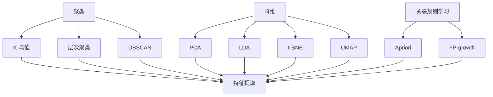

                 

关键词：无监督学习、数据标注、软件2.0、数据丰富性、自动化、机器学习、人工智能

> 摘要：随着数据量的爆炸性增长，如何高效利用这些数据成为了一个亟待解决的问题。传统的监督学习模型需要大量的标注数据进行训练，而标注数据不仅成本高昂，而且难以获取。本文将探讨无监督学习在这一背景下的重要性，以及它如何成为软件2.0时代的关键技术。

## 1. 背景介绍

在过去的几十年中，随着互联网和物联网的快速发展，数据已经成为企业和组织最重要的资产之一。这些数据的丰富性为机器学习和人工智能技术的应用提供了前所未有的可能性。然而，如何有效地利用这些数据，仍然是一个巨大的挑战。

监督学习模型在传统的机器学习应用中占据主导地位。这种模型依赖于大量的标注数据进行训练，以学习数据的特征和模式。然而，标注数据的获取通常需要大量的时间和人力成本，特别是在大规模的数据集中。此外，某些领域的标注数据可能非常稀少，甚至无法获取，这就限制了监督学习模型在这些领域的应用。

为了解决这一问题，无监督学习逐渐受到了更多的关注。无监督学习模型通过分析未标注的数据来发现数据中的隐藏结构和模式。这种模型不需要依赖于标注数据，因此可以处理大量未标注的数据，从而在数据丰富但标注贵的问题上提供了一种可行的解决方案。

## 2. 核心概念与联系

### 2.1 无监督学习的核心概念

无监督学习的核心概念包括聚类、降维和关联规则学习等。以下是这些概念的基本原理和它们在无监督学习中的具体应用：

#### 聚类（Clustering）

聚类是将数据集分成多个类或簇的过程，其中每个簇内部的成员之间相似度较高，而不同簇之间的成员相似度较低。常见的聚类算法包括K-均值聚类、层次聚类和DBSCAN等。

- **K-均值聚类**：基于距离度量的方法，将数据点分配到K个簇，并迭代更新簇的中心，直到达到收敛。
- **层次聚类**：通过逐步合并或分裂已有的簇来构建一个层次结构，从而实现数据的聚类。
- **DBSCAN**：基于密度的聚类方法，通过识别数据点的高密度区域来形成簇。

#### 降维（Dimensionality Reduction）

降维是将高维数据映射到低维空间的过程，以减少数据的维度，提高计算效率和数据可视性。常见的降维方法包括主成分分析（PCA）、线性判别分析（LDA）和非线性降维技术如t-SNE和UMAP。

- **主成分分析（PCA）**：通过正交变换将高维数据投影到新的坐标系中，提取最重要的特征。
- **线性判别分析（LDA）**：通过最大化不同类别的分离度来降维，适用于分类问题。
- **t-SNE和UMAP**：通过非线性变换将高维数据映射到二维或三维空间中，以实现数据的可视化和分析。

#### 关联规则学习（Association Rule Learning）

关联规则学习是一种用于发现数据中频繁出现的关联关系的方法。它通过支持度和置信度来度量关联规则的强度。常见的算法包括Apriori算法和FP-growth算法。

- **Apriori算法**：通过逐层递归地生成频繁项集来发现关联规则。
- **FP-growth算法**：通过创建频繁模式树来发现频繁项集，具有较高的效率和可扩展性。

### 2.2 无监督学习与其他技术的联系

无监督学习不仅本身具有广泛的应用价值，还可以与其他机器学习技术相结合，以实现更复杂的任务。以下是一些常见的结合方式：

- **与监督学习的结合**：无监督学习可以用于特征提取和降维，为监督学习提供更好的特征表示，从而提高模型的性能。
- **与强化学习的结合**：无监督学习可以用于探索环境，为强化学习提供初始的策略，从而加速学习过程。
- **与深度学习的结合**：无监督学习可以用于预训练深度网络，从而提高深度学习模型的泛化能力。

### 2.3 Mermaid 流程图

以下是一个简单的Mermaid流程图，展示了无监督学习的一些核心算法和它们之间的联系：



## 3. 核心算法原理 & 具体操作步骤

### 3.1 算法原理概述

无监督学习算法的设计目标是发现数据中的隐藏结构和模式，而不需要依赖于外部标注。以下是几种常见的无监督学习算法的原理概述：

#### K-均值聚类

K-均值聚类是一种基于距离度量的聚类方法。其基本原理是将数据点分配到K个簇中，使得每个簇的内部距离最小化。具体步骤如下：

1. 随机选择K个数据点作为初始聚类中心。
2. 对于每个数据点，将其分配到最近的聚类中心所代表的簇。
3. 更新聚类中心，计算每个簇的均值。
4. 重复步骤2和3，直到聚类中心不再发生变化或者达到预设的迭代次数。

#### 主成分分析（PCA）

主成分分析是一种降维方法，通过将高维数据投影到新的坐标系中，提取最重要的特征。其基本原理是找到数据的主要成分，即方差最大的方向，并将数据沿着这些方向进行投影。具体步骤如下：

1. 计算数据矩阵的协方差矩阵。
2. 计算协方差矩阵的特征值和特征向量。
3. 将特征向量按特征值从大到小排序，并选取前p个特征向量。
4. 构造投影矩阵，将数据投影到新坐标系中。

#### Apriori算法

Apriori算法是一种用于发现数据中频繁出现的关联规则的方法。其基本原理是逐层递归地生成频繁项集，并通过支持度和置信度来度量关联规则的强度。具体步骤如下：

1. 构建初始候选集，包含所有单个项。
2. 对于每个候选集，计算其支持度，筛选出频繁项集。
3. 递归地合并频繁项集的子集，生成更高层次的候选集，并计算其支持度。
4. 重复步骤2和3，直到没有新的频繁项集生成。

### 3.2 算法步骤详解

#### K-均值聚类

以下是K-均值聚类的具体步骤：

1. **初始化**：随机选择K个数据点作为初始聚类中心。
2. **分配数据点**：对于每个数据点，计算其到各个聚类中心的距离，并将其分配到最近的聚类中心所代表的簇。
3. **更新聚类中心**：计算每个簇的均值，作为新的聚类中心。
4. **迭代**：重复步骤2和3，直到聚类中心不再发生变化或者达到预设的迭代次数。

#### 主成分分析（PCA）

以下是主成分分析的具体步骤：

1. **计算协方差矩阵**：计算数据矩阵的协方差矩阵。
2. **计算特征值和特征向量**：计算协方差矩阵的特征值和特征向量。
3. **排序特征值和特征向量**：将特征向量按特征值从大到小排序，并选取前p个特征向量。
4. **构造投影矩阵**：构造投影矩阵，将数据投影到新坐标系中。

#### Apriori算法

以下是Apriori算法的具体步骤：

1. **构建初始候选集**：包含所有单个项。
2. **计算支持度**：计算每个候选集的支持度，筛选出频繁项集。
3. **递归生成候选集**：递归地合并频繁项集的子集，生成更高层次的候选集。
4. **计算支持度**：计算每个候选集的支持度，筛选出频繁项集。
5. **重复步骤2-4**：重复步骤2-4，直到没有新的频繁项集生成。

### 3.3 算法优缺点

#### K-均值聚类

- **优点**：
  - 简单易懂，易于实现和解释。
  - 可以处理大规模数据集，计算效率较高。

- **缺点**：
  - 对初始聚类中心敏感，容易陷入局部最优解。
  - 不适用于聚类数量事先未知的情况。

#### 主成分分析（PCA）

- **优点**：
  - 可以有效地降维，提高数据可视性和计算效率。
  - 可以提取数据的主要成分，帮助理解数据的结构和特征。

- **缺点**：
  - 对噪声敏感，可能导致降维后的数据丢失信息。
  - 不适用于分类任务，需要其他方法进行分类。

#### Apriori算法

- **优点**：
  - 可以高效地发现数据中的频繁项集，适用于大规模数据集。
  - 可以发现数据中的关联关系，帮助理解和分析数据。

- **缺点**：
  - 计算复杂度高，特别是对于大规模数据集。
  - 需要预先设定支持度和置信度阈值，可能影响结果。

### 3.4 算法应用领域

无监督学习算法在许多领域都有广泛的应用。以下是几个典型的应用领域：

- **推荐系统**：通过无监督学习算法，可以发现用户之间的相似性和偏好，从而实现个性化推荐。
- **图像处理**：无监督学习算法可以用于图像聚类、降维和去噪等任务，提高图像处理的效果。
- **自然语言处理**：无监督学习算法可以用于文本聚类、主题建模和情感分析等任务，帮助理解和分析文本数据。
- **生物信息学**：无监督学习算法可以用于基因表达数据分析、蛋白质结构预测和药物发现等任务，为生物医学研究提供支持。

## 4. 数学模型和公式 & 详细讲解 & 举例说明

### 4.1 数学模型构建

无监督学习算法通常涉及一系列的数学模型和公式，用于描述数据点之间的相似性、聚类中心和降维过程。以下是几个核心的数学模型和公式的详细讲解：

#### K-均值聚类

1. **目标函数**：

   K-均值聚类的目标是最小化每个簇内数据点的平方误差和，即：

   $$J = \sum_{i=1}^{n}\sum_{j=1}^{k}(x_{ij} - \mu_{j})^2$$

   其中，$x_{ij}$表示第i个数据点在第j个簇中的隶属度，$\mu_{j}$表示第j个簇的中心。

2. **更新规则**：

   在每次迭代中，对于每个数据点$x_i$，计算其到各个聚类中心的距离，并将其分配到最近的聚类中心所代表的簇。然后，根据新的簇分配结果更新聚类中心：

   $$\mu_{j} = \frac{1}{N_j}\sum_{i=1}^{n}x_{ij}x_i$$

   其中，$N_j$表示簇j中的数据点数量。

#### 主成分分析（PCA）

1. **特征值和特征向量**：

   PCA的目标是找到数据的主要成分，即方差最大的方向。这可以通过求解以下特征值和特征向量问题实现：

   $$\Sigma v = \lambda v$$

   其中，$\Sigma$是数据矩阵的协方差矩阵，$v$是特征向量，$\lambda$是特征值。

2. **投影矩阵**：

   构造投影矩阵$P$，将数据从原始空间投影到新的坐标系中，即：

   $$z = Px$$

   其中，$z$是投影后的数据，$x$是原始数据。

#### Apriori算法

1. **支持度**：

   支持度表示一个项集在所有事务中出现的频率。对于项集$X$，其支持度为：

   $$support(X) = \frac{count(X)}{total\ transactions}$$

   其中，$count(X)$表示事务中包含项集$X$的数量，$total\ transactions$表示事务的总数。

2. **置信度**：

   置信度表示一个关联规则的强度，定义为：

   $$confidence(A \rightarrow B) = \frac{support(A \cup B)}{support(A)}$$

   其中，$A$和$B$是关联规则的左右项集。

### 4.2 公式推导过程

#### K-均值聚类

1. **目标函数的最小化**：

   目标函数$J$是关于聚类中心$\mu_{j}$的二次函数。为了最小化$J$，需要对每个$\mu_{j}$求偏导数并令其等于0：

   $$\frac{\partial J}{\partial \mu_{j}} = -2\sum_{i=1}^{n}x_{ij}(x_{ij} - \mu_{j})x_i = 0$$

   简化后得到：

   $$\mu_{j} = \frac{1}{N_j}\sum_{i=1}^{n}x_{ij}x_i$$

   这就是聚类中心的更新规则。

#### 主成分分析（PCA）

1. **特征值和特征向量的求解**：

   特征值和特征向量问题可以通过求解协方差矩阵$\Sigma$的特征值分解得到：

   $$\Sigma = P\Lambda P^T$$

   其中，$P$是特征向量组成的矩阵，$\Lambda$是对角矩阵，对角线上的元素是特征值。

   特征向量$v$可以通过解特征方程$\Sigma v = \lambda v$得到。对于最大的特征值$\lambda_{1}$，对应的特征向量$v_{1}$就是数据的主要成分。

#### Apriori算法

1. **支持度的计算**：

   支持度的计算可以通过遍历所有事务，统计包含特定项集的事务数量实现。具体步骤如下：

   - 遍历所有事务，对于每个事务，统计包含项集$X$的事务数量。
   - 计算支持度$suppo

## 5. 项目实践：代码实例和详细解释说明

### 5.1 开发环境搭建

为了实践无监督学习算法，我们需要搭建一个合适的开发环境。以下是推荐的步骤：

1. **安装Python环境**：确保Python（3.8及以上版本）已安装在您的计算机上。可以通过访问 [Python官网](https://www.python.org/) 进行下载和安装。
2. **安装必要的库**：使用以下命令安装所需的库：
   ```bash
   pip install numpy scipy matplotlib scikit-learn
   ```
   - **numpy**：提供高性能的数学计算库。
   - **scipy**：提供科学计算相关的模块。
   - **matplotlib**：提供数据可视化工具。
   - **scikit-learn**：提供无监督学习算法的实现。

3. **配置Jupyter Notebook**：Jupyter Notebook 是一个交互式的开发环境，方便编写和运行代码。可以通过以下命令安装 Jupyter Notebook：
   ```bash
   pip install notebook
   ```
   启动 Jupyter Notebook 服务器：
   ```bash
   jupyter notebook
   ```

### 5.2 源代码详细实现

以下是使用 Python 实现无监督学习算法的源代码示例。这个示例将使用 K-均值聚类和主成分分析（PCA）进行数据降维。

```python
import numpy as np
import matplotlib.pyplot as plt
from sklearn.cluster import KMeans
from sklearn.decomposition import PCA

# 生成模拟数据
X = np.random.rand(100, 2)

# K-均值聚类
kmeans = KMeans(n_clusters=3, random_state=0)
kmeans.fit(X)
labels = kmeans.predict(X)

# 主成分分析
pca = PCA(n_components=2)
X_pca = pca.fit_transform(X)

# 绘制聚类结果和降维后的数据
plt.figure(figsize=(10, 5))
plt.subplot(121)
plt.scatter(X[:, 0], X[:, 1], c=labels, cmap='viridis')
plt.title('K-Means Clustering')
plt.xlabel('Feature 1')
plt.ylabel('Feature 2')

plt.subplot(122)
plt.scatter(X_pca[:, 0], X_pca[:, 1], c=labels, cmap='viridis')
plt.title('PCA-Dimensional Data')
plt.xlabel('Principal Component 1')
plt.ylabel('Principal Component 2')

plt.tight_layout()
plt.show()
```

### 5.3 代码解读与分析

这段代码首先导入了必要的库，包括 numpy、matplotlib、sklearn 中的 KMeans 和 PCA。然后，我们生成了一组模拟数据，这些数据将用于演示无监督学习算法。

#### K-均值聚类

我们使用 KMeans 类从 sklearn 中创建了一个 K-均值聚类对象。在 fit 方法中，我们传入数据 X，并指定了聚类数量为3（可以通过肘部法则选择更合适的聚类数量）。predict 方法用于对数据进行聚类，返回每个数据点的簇标签。

#### 主成分分析

接下来，我们使用 PCA 类从 sklearn 中创建了一个主成分分析对象。fit_transform 方法用于将数据 X 进行降维，提取前两个主要成分。

#### 数据可视化

最后，我们使用 matplotlib 库绘制了两个子图。第一个子图展示了原始数据经过 K-均值聚类后的结果，第二个子图展示了经过 PCA 降维后的数据，并使用聚类标签进行着色。这有助于我们直观地理解无监督学习算法的作用和效果。

### 5.4 运行结果展示

运行上述代码后，我们将在一个包含两个子图的图表中看到以下结果：

- **K-均值聚类结果**：原始数据被分成三个簇，每个簇在二维空间中以不同的颜色显示。
- **PCA降维结果**：数据经过降维后，散点图变得更加紧凑，聚类效果更加明显。

这些结果展示了无监督学习算法在数据降维和聚类任务中的有效性和实用性。

## 6. 实际应用场景

### 6.1 推荐系统

在推荐系统中，无监督学习算法被广泛应用于用户行为分析和项目推荐。例如，电商平台可以使用无监督学习算法分析用户的购物习惯，将相似用户划分为同一簇，从而实现个性化推荐。

### 6.2 自然语言处理

在自然语言处理领域，无监督学习算法被用于文本聚类和情感分析。例如，社交媒体平台可以使用文本聚类算法对用户生成的帖子进行分类，以便更好地组织和管理内容。

### 6.3 图像识别

在图像识别领域，无监督学习算法被用于图像降维和特征提取。例如，可以通过聚类算法将图像划分为不同类别，从而实现图像分类。

### 6.4 生物信息学

在生物信息学中，无监督学习算法被用于基因表达数据分析。例如，通过聚类算法可以识别出不同细胞类型的特征，从而帮助科学家理解细胞间的相互作用。

## 7. 未来应用展望

### 7.1 多模态数据的处理

随着传感器技术和数据采集能力的提升，多模态数据（如文本、图像、音频等）的融合处理将成为无监督学习的一个重要研究方向。如何有效地从多模态数据中提取有用信息，实现跨模态的关联和预测，是一个具有挑战性的课题。

### 7.2 端到端的无监督学习模型

传统的无监督学习模型通常需要人工设定参数，而端到端的无监督学习模型将尝试自动调整模型参数，以获得更好的性能。这将为无监督学习在工业界和学术界带来更多应用。

### 7.3 隐私保护和无监督学习

在数据隐私保护日益重要的背景下，研究如何在保证数据隐私的同时进行无监督学习具有重要意义。这可能需要新的隐私保护算法和技术，以实现数据的安全共享和利用。

### 7.4 自动化标注和无监督学习

自动化标注是提高无监督学习模型应用价值的关键。未来，随着深度学习和强化学习的发展，自动化标注技术将变得更加成熟，为无监督学习提供更加丰富的标注数据。

## 8. 总结：未来发展趋势与挑战

### 8.1 研究成果总结

无监督学习在数据丰富但标注贵的问题上展示了巨大的潜力。通过无监督学习，我们可以从大量的未标注数据中提取有用信息，为各种应用领域提供支持。K-均值聚类、主成分分析（PCA）和Apriori算法等无监督学习算法在不同的场景中发挥了重要作用。

### 8.2 未来发展趋势

未来，无监督学习将继续在多模态数据处理、端到端模型、隐私保护和自动化标注等领域取得突破。这些发展趋势将为无监督学习在工业界和学术界的广泛应用奠定基础。

### 8.3 面临的挑战

尽管无监督学习具有广泛的应用前景，但同时也面临着一些挑战。这些挑战包括如何处理多模态数据、提高模型的鲁棒性和可解释性，以及如何保证数据隐私和安全。

### 8.4 研究展望

未来，无监督学习的研究将继续深入，探索新的算法和技术，以应对这些挑战。我们有望看到无监督学习在更多领域得到应用，并成为人工智能和机器学习领域的重要组成部分。

## 9. 附录：常见问题与解答

### 9.1 什么是无监督学习？

无监督学习是一种机器学习方法，它通过分析未标注的数据来发现数据中的隐藏结构和模式，而不需要依赖于外部标注。

### 9.2 无监督学习有哪些常见的算法？

常见的无监督学习算法包括聚类（如K-均值、层次聚类和DBSCAN）、降维（如主成分分析PCA和t-SNE）、关联规则学习（如Apriori算法）等。

### 9.3 无监督学习有哪些实际应用场景？

无监督学习在推荐系统、自然语言处理、图像识别和生物信息学等领域都有广泛应用。例如，在推荐系统中，无监督学习可以用于用户行为分析；在自然语言处理中，它可以用于文本聚类和情感分析。

### 9.4 无监督学习和监督学习有什么区别？

无监督学习不需要依赖外部标注数据，而是通过分析未标注的数据来发现数据中的模式。而监督学习则需要依赖标注数据进行训练，从而学习数据中的特征和模式。

### 9.5 无监督学习的优点是什么？

无监督学习的优点包括：
- 不需要依赖标注数据，因此可以处理大量未标注的数据。
- 可以发现数据中的隐藏结构和模式，为各种应用领域提供支持。
- 可以减少人工标注的工作量，提高数据处理的效率。

### 9.6 无监督学习的缺点是什么？

无监督学习的缺点包括：
- 部分算法对初始参数和初始聚类中心敏感，容易陷入局部最优解。
- 在某些任务中，无监督学习可能无法获得与监督学习相同的效果。

### 9.7 如何选择适合的无监督学习算法？

选择适合的无监督学习算法通常取决于以下因素：
- 数据类型和特征：例如，对于高维数据，降维算法可能更有效。
- 应用场景和任务目标：例如，在图像识别中，聚类算法可能不适合，而在文本聚类中，关联规则学习可能更有用。
- 数据量和计算资源：某些算法可能需要更长的计算时间和更多的计算资源。

### 9.8 无监督学习在未来的发展方向是什么？

无监督学习在未来的发展方向包括：
- 多模态数据的处理：探索如何从多模态数据中提取有用信息。
- 端到端的无监督学习模型：研究如何自动调整模型参数，提高模型性能。
- 隐私保护和无监督学习：如何在保证数据隐私的同时进行无监督学习。
- 自动化标注和无监督学习：探索如何自动化标注数据，提高无监督学习的应用价值。

### 9.9 无监督学习与深度学习的关系是什么？

无监督学习与深度学习密切相关。深度学习通常需要大量的标注数据进行训练，而无监督学习可以用于特征提取和降维，为深度学习提供更好的特征表示。此外，无监督学习还可以与深度学习相结合，实现更复杂的任务。例如，在生成对抗网络（GAN）中，无监督学习被用于生成高质量的数据，从而提高深度学习的性能。


作者：禅与计算机程序设计艺术 / Zen and the Art of Computer Programming

---

本文从无监督学习的基本概念出发，详细探讨了其在各个领域的应用，并通过实例展示了如何在实际项目中实现无监督学习算法。文章总结了无监督学习的优势与挑战，并对其未来发展进行了展望。希望本文能够为读者在无监督学习领域的探索提供一些有价值的参考。

