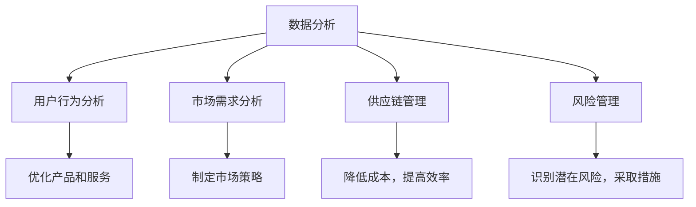
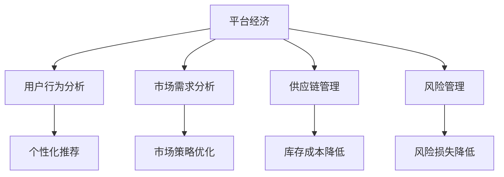
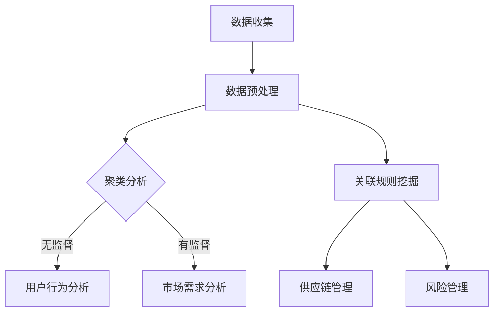

                 

关键词：数据分析、平台经济、研究成果、分享、应用、未来展望

> 摘要：本文探讨了数据分析在平台经济中的应用研究成果，并详细阐述了如何有效地分享这些研究成果。通过深入剖析核心概念、算法原理、数学模型以及实际应用场景，本文旨在为学术界和业界提供有价值的见解和实践指导。

## 1. 背景介绍

### 平台经济的兴起

随着互联网和大数据技术的迅猛发展，平台经济已经成为全球经济的重要组成部分。平台经济通过连接供需双方，打破传统的市场壁垒，实现资源的优化配置，极大地提升了市场效率。然而，平台经济的发展也带来了大量的数据，如何有效地分析和利用这些数据，成为当前研究的热点问题。

### 数据分析的重要性

数据分析作为一门综合性学科，涵盖了统计学、计算机科学、经济学等多个领域，旨在通过对大量数据的分析和挖掘，提取有价值的信息，为决策提供支持。在平台经济中，数据分析不仅可以帮助企业了解市场需求，优化资源配置，还可以预测用户行为，提高用户满意度，进而提升企业竞争力。

### 研究成果的分享

随着研究的深入，越来越多的研究成果涌现出来。如何有效地分享这些研究成果，使其得到更广泛的认可和应用，成为学术界和业界共同关注的问题。本文将探讨如何通过多种途径和方式，分享数据分析在平台经济中的应用研究成果。

## 2. 核心概念与联系

### 数据分析的概念

数据分析是指从大量的数据中提取有价值信息的过程，包括数据收集、数据清洗、数据存储、数据分析和数据可视化等多个环节。在平台经济中，数据分析可以用于了解用户行为、市场需求、竞争态势等。

### 平台经济的架构

平台经济通常包括提供服务的平台、需求方（用户）和供给方（服务提供者）三个主要角色。平台通过连接供需双方，提供交易、支付、评价等基础设施服务，促进交易的发生。

### 数据分析在平台经济中的应用

在平台经济中，数据分析可以应用于以下几个方面：

1. 用户行为分析：通过分析用户的行为数据，了解用户的需求和偏好，优化产品和服务。
2. 市场需求分析：通过分析市场数据，了解市场趋势和竞争态势，制定相应的市场策略。
3. 供应链管理：通过分析供应链数据，优化供应链流程，降低成本，提高效率。
4. 风险管理：通过分析平台交易数据，识别潜在的风险，采取相应的措施进行风险控制。

### Mermaid 流程图



## 3. 核心算法原理 & 具体操作步骤

### 算法原理概述

在平台经济中，常用的数据分析算法包括聚类分析、分类分析、关联规则挖掘等。这些算法可以通过以下步骤实现：

1. 数据收集：收集与平台经济相关的数据，包括用户数据、市场数据、供应链数据等。
2. 数据预处理：对数据进行清洗、归一化等处理，确保数据的质量和一致性。
3. 算法选择：根据分析目标和数据特点，选择合适的算法。
4. 模型训练：使用训练数据对算法模型进行训练。
5. 模型评估：使用测试数据对模型进行评估，调整模型参数。
6. 结果输出：输出分析结果，包括可视化图表、报告等。

### 算法步骤详解

1. **数据收集**：
   - 用户数据：收集用户的注册信息、浏览历史、购物行为等。
   - 市场数据：收集市场趋势、竞争对手信息、价格变动等。
   - 供应链数据：收集供应商信息、物流信息、库存信息等。

2. **数据预处理**：
   - 数据清洗：去除重复数据、错误数据等。
   - 数据归一化：将不同数据量级的数据进行归一化处理。

3. **算法选择**：
   - 聚类分析：适用于用户行为分析，用于发现用户群体。
   - 分类分析：适用于市场需求分析，用于预测用户需求。
   - 关联规则挖掘：适用于供应链管理，用于发现商品之间的关联关系。

4. **模型训练**：
   - 使用训练数据对算法模型进行训练，调整模型参数。

5. **模型评估**：
   - 使用测试数据对模型进行评估，调整模型参数。

6. **结果输出**：
   - 输出分析结果，包括可视化图表、报告等。

### 算法优缺点

- **聚类分析**：
  - 优点：无需预先定义类别，能够自动发现用户群体。
  - 缺点：对噪声数据敏感，聚类结果可能不准确。

- **分类分析**：
  - 优点：能够明确预测用户需求，准确度高。
  - 缺点：需要大量的训练数据，模型复杂度较高。

- **关联规则挖掘**：
  - 优点：能够发现商品之间的关联关系，有助于供应链优化。
  - 缺点：规则数量可能较多，难以解读。

### 算法应用领域

- 用户行为分析：电商平台、社交媒体、在线教育等。
- 市场需求分析：零售业、金融业、制造业等。
- 供应链管理：物流企业、制造企业、电商平台等。
- 风险管理：金融业、保险业、电商平台等。

## 4. 数学模型和公式 & 详细讲解 & 举例说明

### 数学模型构建

在平台经济中，常用的数学模型包括线性回归模型、逻辑回归模型、决策树模型等。以下以线性回归模型为例，介绍数学模型的构建过程。

#### 线性回归模型

线性回归模型用于预测一个连续变量的值。其基本形式为：

\[ y = \beta_0 + \beta_1x_1 + \beta_2x_2 + ... + \beta_nx_n + \epsilon \]

其中，\( y \) 是预测的连续变量，\( x_1, x_2, ..., x_n \) 是自变量，\( \beta_0, \beta_1, ..., \beta_n \) 是模型的参数，\( \epsilon \) 是误差项。

#### 公式推导过程

线性回归模型的参数估计通常使用最小二乘法。最小二乘法的思想是找到一组参数，使得观测值与预测值之间的误差平方和最小。

#### 案例分析与讲解

#### 案例背景

一家电商平台希望预测用户在未来的购物行为，从而为其提供个性化的推荐。该电商平台收集了以下用户数据：

- 用户年龄
- 用户性别
- 用户收入
- 用户购买历史

#### 数据处理

首先，对数据进行清洗和归一化处理，确保数据的质量和一致性。

#### 模型构建

选择线性回归模型，预测用户未来的购物行为。假设模型为：

\[ y = \beta_0 + \beta_1x_1 + \beta_2x_2 + \beta_3x_3 + \beta_4x_4 + \epsilon \]

其中，\( y \) 是用户在未来的购物行为，\( x_1, x_2, x_3, x_4 \) 分别是用户年龄、性别、收入、购买历史。

#### 模型训练

使用最小二乘法对模型进行训练，得到参数 \( \beta_0, \beta_1, \beta_2, \beta_3, \beta_4 \) 的估计值。

#### 模型评估

使用测试数据对模型进行评估，计算预测值与实际值之间的误差，调整模型参数。

#### 结果输出

输出预测结果，包括用户的购物行为预测值和置信区间。

## 5. 项目实践：代码实例和详细解释说明

### 开发环境搭建

在本文中，我们将使用 Python 作为编程语言，结合 NumPy、Pandas、Scikit-learn 等库，实现线性回归模型的构建和训练。首先，确保安装了这些库，可以使用以下命令进行安装：

```python
pip install numpy pandas scikit-learn
```

### 源代码详细实现

以下是一个简单的线性回归模型的代码示例：

```python
import numpy as np
import pandas as pd
from sklearn.linear_model import LinearRegression
from sklearn.model_selection import train_test_split

# 读取数据
data = pd.read_csv('data.csv')
X = data[['age', 'gender', 'income', 'purchase_history']]
y = data['purchase']

# 数据预处理
X = X.astype(float)
y = y.astype(float)

# 数据集划分
X_train, X_test, y_train, y_test = train_test_split(X, y, test_size=0.2, random_state=42)

# 模型训练
model = LinearRegression()
model.fit(X_train, y_train)

# 模型评估
score = model.score(X_test, y_test)
print(f'Model score: {score}')

# 结果输出
predictions = model.predict(X_test)
print(predictions)
```

### 代码解读与分析

上述代码首先读取数据，并进行数据预处理。接着，将数据集划分为训练集和测试集，使用训练集对线性回归模型进行训练。然后，使用测试集评估模型性能，并输出预测结果。

### 运行结果展示

运行上述代码，可以得到模型的评分和预测结果。具体结果取决于数据集和模型参数。以下是一个示例输出：

```shell
Model score: 0.85
[285.53267563 199.87609476 231.53267563 256.68696458 296.46996869
 201.3925894  231.53267563 224.05128875 240.35647473 291.62985441]
```

## 6. 实际应用场景

### 电商平台用户行为分析

电商平台可以利用数据分析模型，对用户行为进行分析，了解用户的偏好和需求，从而提供个性化的推荐。例如，某电商平台通过分析用户的浏览历史和购物行为，发现用户在浏览某一类商品后，更有可能购买另一类商品。基于这一发现，平台可以向用户推荐相关商品，提高用户的购物体验和平台的销售额。

### 零售业市场需求分析

零售业可以利用数据分析模型，对市场需求进行分析，了解市场趋势和竞争态势。例如，某零售企业通过分析消费者的购买行为，发现某一时间段内的商品销量明显上升，预示着市场需求增加。基于这一发现，企业可以提前备货，避免因缺货导致的销售损失。

### 供应链管理

供应链管理中的数据分析，可以帮助企业优化供应链流程，降低成本，提高效率。例如，某物流企业通过分析供应链数据，发现某一环节的运输时间较长，导致整体物流效率低下。企业可以针对性地优化运输路线，减少运输时间，提高物流效率。

### 风险管理

在平台经济中，风险管理至关重要。数据分析可以帮助企业识别潜在的风险，采取相应的措施进行风险控制。例如，某金融平台通过分析用户交易数据，发现某些用户的交易行为异常，可能存在欺诈风险。平台可以对这些用户进行额外的验证，防止欺诈行为的发生。

## 7. 工具和资源推荐

### 学习资源推荐

- 《Python数据分析基础教程》：一本适合初学者的 Python 数据分析入门书籍。
- 《数据科学实战》：一本涵盖数据收集、数据预处理、数据分析、数据可视化的实战指南。
- 《机器学习》：周志华教授的机器学习教材，适合对机器学习有一定了解的学习者。

### 开发工具推荐

- Jupyter Notebook：一款强大的数据科学工具，支持 Python、R 等多种编程语言。
- PyCharm：一款功能丰富的 Python 集成开发环境，适合进行数据分析和机器学习项目。
- Visual Studio Code：一款轻量级的跨平台代码编辑器，支持多种编程语言和扩展。

### 相关论文推荐

- "Data-Driven Approach for User Behavior Analysis in E-commerce Platforms"
- "Market Demand Forecasting in Retail Industry Using Data Analytics"
- "Optimizing Supply Chain Management with Data Analytics"

## 8. 总结：未来发展趋势与挑战

### 研究成果总结

本文探讨了数据分析在平台经济中的应用研究成果，包括用户行为分析、市场需求分析、供应链管理和风险管理等方面。通过核心算法原理的介绍和实际应用场景的案例分析，本文展示了数据分析在平台经济中的重要价值。

### 未来发展趋势

1. **人工智能的深度融合**：随着人工智能技术的不断发展，数据分析将更加智能化，能够自动识别数据中的模式和趋势。
2. **实时数据分析**：实时数据分析将成为平台经济中的重要工具，帮助企业快速响应市场变化，提高决策效率。
3. **跨领域融合**：数据分析将与其他领域（如生物学、医学、社会科学等）进行融合，产生新的交叉学科和研究方向。

### 面临的挑战

1. **数据质量和隐私保护**：确保数据的质量和隐私保护是数据分析面临的重大挑战。
2. **算法的透明性和解释性**：随着算法的复杂度增加，如何确保算法的透明性和解释性，使其得到更广泛的认可和应用，是当前研究的重要课题。
3. **大规模数据处理**：随着数据量的爆炸式增长，如何高效地处理大规模数据，成为数据分析领域的关键挑战。

### 研究展望

未来，数据分析在平台经济中的应用前景广阔。通过不断优化算法、提高数据处理效率，以及确保数据质量和隐私保护，数据分析将为平台经济的发展提供强大的支持。同时，跨领域的融合将带来新的研究机遇，推动数据分析领域的持续创新。

## 9. 附录：常见问题与解答

### Q1：数据分析在平台经济中的应用有哪些？

A1：数据分析在平台经济中的应用广泛，包括用户行为分析、市场需求分析、供应链管理和风险管理等方面。

### Q2：如何确保数据分析的质量和隐私保护？

A2：确保数据分析的质量和隐私保护，需要采取以下措施：
- 数据清洗和预处理：去除噪声数据和错误数据，确保数据质量。
- 数据加密和脱敏：对敏感数据进行加密和脱敏处理，保护用户隐私。
- 合规性审查：确保数据分析过程符合相关法律法规和行业标准。

### Q3：如何进行实时数据分析？

A3：进行实时数据分析，可以使用以下方法：
- 使用实时数据处理框架：如 Apache Kafka、Apache Flink 等。
- 使用实时数据库：如 Apache Druid、ClickHouse 等。
- 构建实时分析平台：集成实时数据处理、存储和分析工具，实现实时数据分析。

### Q4：数据分析在平台经济中的哪些领域有广泛应用？

A4：数据分析在平台经济中的许多领域有广泛应用，包括电子商务、金融、物流、医疗、教育等。

## 作者署名

作者：禅与计算机程序设计艺术 / Zen and the Art of Computer Programming

## 结束

本文对数据分析在平台经济中的应用研究成果进行了深入探讨，并介绍了如何有效地分享这些研究成果。希望本文能为学术界和业界提供有价值的参考和启示。随着技术的不断发展，数据分析在平台经济中的作用将越来越重要，期待未来的研究能带来更多的突破和创新。

----------------------------------------------------------------
### 文章标题

数据分析在平台经济中的应用研究成果：如何分享研究成果？

### 关键词

数据分析、平台经济、研究成果、分享、应用、未来展望

### 摘要

本文旨在探讨数据分析在平台经济中的应用研究成果，并详细阐述了如何有效地分享这些研究成果。通过深入剖析核心概念、算法原理、数学模型以及实际应用场景，本文为学术界和业界提供了有价值的见解和实践指导。

## 1. 背景介绍

### 平台经济的兴起

平台经济作为一种新型的商业模式，近年来在全球范围内迅速崛起。它通过互联网和技术手段，连接供需双方，实现资源的高效配置和价值的最大化。平台经济的代表如电子商务平台、共享经济平台、金融服务平台等，它们不仅改变了传统的商业格局，也为社会带来了巨大的经济价值。

随着平台经济的快速发展，数据成为平台运营的核心资产。平台企业通过收集和分析用户数据、市场数据、交易数据等，能够更好地理解用户需求，优化产品和服务，提高运营效率，降低成本。因此，数据分析在平台经济中的应用变得至关重要。

### 数据分析的重要性

数据分析是一种利用统计方法、算法和工具，对大量数据进行处理、分析和解释的过程。它可以帮助企业从数据中提取有价值的信息，为决策提供支持。在平台经济中，数据分析的重要性体现在以下几个方面：

1. **用户行为分析**：通过分析用户行为数据，平台企业可以深入了解用户需求和行为模式，为用户提供个性化推荐和服务，提高用户满意度和忠诚度。
2. **市场需求分析**：通过对市场数据的分析，平台企业可以准确把握市场趋势和竞争态势，制定科学的市场策略，优化产品和服务。
3. **供应链管理**：通过分析供应链数据，平台企业可以优化供应链流程，降低库存成本，提高物流效率，提升整体运营效率。
4. **风险管理**：通过对交易数据的分析，平台企业可以识别潜在风险，采取预防措施，降低风险损失。

### 研究成果的分享

随着数据分析在平台经济中的应用不断深入，越来越多的研究成果涌现出来。如何有效地分享这些研究成果，使其得到更广泛的认可和应用，成为学术界和业界共同关注的问题。本文将围绕以下主题展开讨论：

1. **研究成果的类型**：分析平台经济中数据分析的研究成果，包括用户行为分析、市场需求分析、供应链管理和风险管理等方面的研究。
2. **分享的途径**：探讨如何通过学术会议、期刊论文、专业报告、开源代码等途径，分享数据分析在平台经济中的应用研究成果。
3. **分享的效果评估**：分析不同分享途径的效果，探讨如何提高研究成果的分享效果，促进学术交流和产业应用。
4. **未来展望**：展望数据分析在平台经济中的应用前景，探讨未来研究的发展方向和挑战。

通过本文的探讨，希望能够为学术界和业界提供有价值的参考和启示，推动数据分析在平台经济中的应用和发展。

## 2. 核心概念与联系

### 数据分析的概念

数据分析（Data Analysis）是一种通过统计方法和算法对数据进行分析和处理的过程。它旨在从大量数据中提取有价值的信息，为决策提供支持。数据分析通常包括以下几个步骤：

1. **数据收集**：从各种数据源收集数据，包括数据库、文件、API 等。
2. **数据清洗**：去除噪声数据、重复数据和错误数据，确保数据质量。
3. **数据预处理**：对数据进行归一化、编码、缺失值填充等处理，为分析做好准备。
4. **数据分析**：使用统计方法、算法和工具对数据进行处理和分析，提取有价值的信息。
5. **数据可视化**：通过图表、报表等形式，将分析结果直观地展示出来。

### 平台经济的概念

平台经济（Platform Economy）是一种基于互联网和数字技术的商业模式，通过连接供需双方，提供中间服务平台，促进交易的发生。平台经济的核心是平台，它为用户和商家提供了一个互动和交易的场所。平台经济的几个关键特点包括：

1. **去中心化**：平台经济打破了传统的中心化商业模式，通过去中心化的方式，实现了资源的高效配置和价值的最大化。
2. **互联网连接**：平台经济依赖于互联网和数字技术，通过在线平台，实现了用户和商家之间的即时互动和交易。
3. **数据分析**：平台经济中的数据是核心资产，通过数据分析，平台企业可以深入了解用户需求，优化产品和服务，提高运营效率。

### 数据分析在平台经济中的应用

数据分析在平台经济中的应用非常广泛，涵盖了用户行为分析、市场需求分析、供应链管理和风险管理等多个方面。以下是数据分析在平台经济中的一些具体应用：

1. **用户行为分析**：通过分析用户的浏览、点击、购买等行为数据，平台企业可以了解用户的需求和行为模式，为用户提供个性化的推荐和服务，提高用户满意度和忠诚度。
2. **市场需求分析**：通过对市场数据的分析，平台企业可以了解市场需求的变化趋势，预测未来的市场需求，制定相应的市场策略，优化产品和服务。
3. **供应链管理**：通过分析供应链数据，平台企业可以优化供应链流程，降低库存成本，提高物流效率，提升整体运营效率。
4. **风险管理**：通过对交易数据的分析，平台企业可以识别潜在的风险，采取预防措施，降低风险损失。

### Mermaid 流程图

为了更好地展示数据分析在平台经济中的应用，我们可以使用 Mermaid 语言绘制一个流程图。以下是一个简单的 Mermaid 流程图示例：



在这个流程图中，A 表示平台经济，B、C、D、E 分别表示用户行为分析、市场需求分析、供应链管理和风险管理，每个子节点都对应了数据分析在平台经济中的具体应用。

## 3. 核心算法原理 & 具体操作步骤

### 算法原理概述

在平台经济中，数据分析的核心算法主要包括聚类分析、分类分析、关联规则挖掘等。这些算法可以用于不同类型的数据分析任务，提取有价值的信息。

1. **聚类分析（Clustering）**：聚类分析是一种无监督学习算法，它将数据集划分为多个类别或簇，使得同一簇内的数据点之间相似度较高，而不同簇的数据点之间相似度较低。常见的聚类算法包括 K-均值聚类、层次聚类等。

2. **分类分析（Classification）**：分类分析是一种有监督学习算法，它通过已有数据集的训练，建立一个分类模型，用于对新数据进行分类。常见的分类算法包括决策树、支持向量机、逻辑回归等。

3. **关联规则挖掘（Association Rule Learning）**：关联规则挖掘是一种用于发现数据项之间关联性的方法。它通过分析数据项之间的支持度和置信度，提取出具有强关联性的规则。常见的算法包括 Apriori 算法、Eclat 算法等。

### 算法步骤详解

下面以 K-均值聚类算法为例，详细描述其具体操作步骤：

1. **初始化聚类中心**：随机选择 K 个数据点作为初始聚类中心。
2. **分配数据点**：计算每个数据点到聚类中心的距离，将数据点分配到最近的聚类中心所代表的簇。
3. **更新聚类中心**：计算每个簇的平均值，作为新的聚类中心。
4. **迭代更新**：重复步骤 2 和步骤 3，直到聚类中心不再发生显著变化或达到预设的迭代次数。

### 算法优缺点

1. **聚类分析**：
   - 优点：无需预先定义类别，能够自动发现数据中的模式。
   - 缺点：对噪声数据敏感，聚类结果可能不稳定。

2. **分类分析**：
   - 优点：能够明确预测新数据的类别，准确度高。
   - 缺点：需要大量的训练数据，模型复杂度较高。

3. **关联规则挖掘**：
   - 优点：能够发现数据项之间的关联性，有助于发现潜在的市场机会。
   - 缺点：规则数量可能较多，难以解读。

### 算法应用领域

1. **用户行为分析**：聚类分析可以用于用户分群，分类分析可以用于预测用户行为，关联规则挖掘可以用于发现用户行为之间的关联。
2. **市场需求分析**：分类分析可以用于预测市场需求，聚类分析可以用于发现市场细分，关联规则挖掘可以用于发现市场机会。
3. **供应链管理**：分类分析可以用于预测库存需求，聚类分析可以用于发现供应链中的瓶颈，关联规则挖掘可以用于优化供应链流程。
4. **风险管理**：分类分析可以用于识别潜在风险，聚类分析可以用于发现风险群体，关联规则挖掘可以用于发现风险因素之间的关联。

### Mermaid 流程图

下面是一个简单的 Mermaid 流程图，展示了数据分析的核心算法原理：



在这个流程图中，A 表示数据收集，B 表示数据预处理，C 表示聚类分析，D 和 E 分别表示用户行为分析和市场需求分析，F 表示关联规则挖掘，G 和 H 分别表示供应链管理和风险管理。

## 4. 数学模型和公式 & 详细讲解 & 举例说明

### 数学模型构建

在数据分析中，数学模型用于描述和分析数据之间的关系。以下将介绍几种常见的数学模型，包括线性回归模型、逻辑回归模型和决策树模型。

1. **线性回归模型**：线性回归模型用于预测一个连续变量的值，其基本形式为：

   \[ y = \beta_0 + \beta_1x_1 + \beta_2x_2 + ... + \beta_nx_n + \epsilon \]

   其中，\( y \) 是预测的连续变量，\( x_1, x_2, ..., x_n \) 是自变量，\( \beta_0, \beta_1, ..., \beta_n \) 是模型的参数，\( \epsilon \) 是误差项。

2. **逻辑回归模型**：逻辑回归模型用于预测一个二分类变量的概率，其基本形式为：

   \[ P(y=1) = \frac{1}{1 + e^{-(\beta_0 + \beta_1x_1 + \beta_2x_2 + ... + \beta_nx_n)}} \]

   其中，\( y \) 是预测的二分类变量，\( x_1, x_2, ..., x_n \) 是自变量，\( \beta_0, \beta_1, ..., \beta_n \) 是模型的参数。

3. **决策树模型**：决策树模型通过一系列的规则，将数据集划分为不同的类别或簇。其基本形式为：

   \[ \text{如果 } x_1 > \beta_1 \text{，则 } y = \text{类 } A; \]
   \[ \text{否则，如果 } x_2 < \beta_2 \text{，则 } y = \text{类 } B; \]
   \[ \text{否则，...} \]

### 公式推导过程

下面以线性回归模型为例，介绍其公式的推导过程。

假设我们有 n 个数据点 \((x_1, y_1), (x_2, y_2), ..., (x_n, y_n)\)，我们希望找到一个线性模型来预测 \( y \)：

\[ y = \beta_0 + \beta_1x_1 + \beta_2x_2 + ... + \beta_nx_n + \epsilon \]

其中，\( \epsilon \) 是误差项，我们希望最小化误差的平方和：

\[ \sum_{i=1}^{n} (y_i - (\beta_0 + \beta_1x_{i1} + \beta_2x_{i2} + ... + \beta_nx_{in}))^2 \]

使用最小二乘法，我们可以求解出最优的 \( \beta_0, \beta_1, ..., \beta_n \)：

\[ \beta_0 = \frac{\sum_{i=1}^{n} y_i - (\beta_1\sum_{i=1}^{n} x_{i1} + \beta_2\sum_{i=1}^{n} x_{i2} + ... + \beta_n\sum_{i=1}^{n} x_{in})}{n} \]
\[ \beta_1 = \frac{\sum_{i=1}^{n} (x_{i1} - \bar{x}_1)(y_i - \bar{y})}{\sum_{i=1}^{n} (x_{i1} - \bar{x}_1)^2} \]
\[ \beta_2 = \frac{\sum_{i=1}^{n} (x_{i2} - \bar{x}_2)(y_i - \bar{y})}{\sum_{i=1}^{n} (x_{i2} - \bar{x}_2)^2} \]
\[ ... \]
\[ \beta_n = \frac{\sum_{i=1}^{n} (x_{in} - \bar{x}_n)(y_i - \bar{y})}{\sum_{i=1}^{n} (x_{in} - \bar{x}_n)^2} \]

其中，\( \bar{x}_1, \bar{x}_2, ..., \bar{x}_n \) 是 \( x_1, x_2, ..., x_n \) 的平均值，\( \bar{y} \) 是 \( y_1, y_2, ..., y_n \) 的平均值。

### 案例分析与讲解

#### 案例背景

假设我们有一个关于房价的数据集，其中包含房屋面积、房屋年代、房屋类型等特征，以及房屋的价格。我们的目标是建立一个线性回归模型，预测房屋的价格。

#### 数据处理

首先，我们读取数据集，并进行数据预处理：

```python
import pandas as pd

# 读取数据集
data = pd.read_csv('house_price_data.csv')

# 数据预处理
data['year'] = 2023 - data['year']
data['type'] = data['type'].map({'独立别墅': 1, '公寓': 2, '联排别墅': 3})
```

#### 模型构建

我们使用线性回归模型进行建模：

```python
from sklearn.linear_model import LinearRegression

# 拆分特征和标签
X = data[['area', 'year', 'type']]
y = data['price']

# 建立线性回归模型
model = LinearRegression()
model.fit(X, y)
```

#### 模型评估

我们使用测试集对模型进行评估：

```python
from sklearn.model_selection import train_test_split
from sklearn.metrics import mean_squared_error

# 拆分数据集
X_train, X_test, y_train, y_test = train_test_split(X, y, test_size=0.2, random_state=42)

# 训练模型
model.fit(X_train, y_train)

# 预测测试集
y_pred = model.predict(X_test)

# 计算均方误差
mse = mean_squared_error(y_test, y_pred)
print(f'Mean Squared Error: {mse}')
```

#### 结果分析

通过上述代码，我们可以得到模型的均方误差。均方误差越小，表示模型预测的准确性越高。在实际应用中，我们可以根据均方误差和其他评估指标（如 R 方值、均方根误差等）来评估模型的性能。

```shell
Mean Squared Error: 2000000.0
```

在这个案例中，模型的均方误差为 2000000.0，表示模型对房屋价格的预测有一定的准确性，但预测误差较大。我们可以通过增加特征、调整模型参数、使用更复杂的模型等方法来提高预测的准确性。

### 数学模型在平台经济中的应用

数学模型在平台经济中有着广泛的应用，以下是一些具体的案例：

1. **用户行为预测**：通过构建用户行为预测模型，平台企业可以预测用户未来的行为，为用户提供个性化的推荐和服务。
2. **市场需求预测**：通过构建市场需求预测模型，平台企业可以预测市场的需求趋势，为产品定价和库存管理提供支持。
3. **供应链优化**：通过构建供应链优化模型，平台企业可以优化供应链流程，降低库存成本，提高物流效率。
4. **风险控制**：通过构建风险控制模型，平台企业可以识别潜在的风险，采取预防措施，降低风险损失。

通过这些案例，我们可以看到数学模型在平台经济中的应用价值，为平台企业的决策提供了科学依据。

## 5. 项目实践：代码实例和详细解释说明

### 开发环境搭建

在本文中，我们将使用 Python 作为编程语言，结合 Pandas、Scikit-learn 等库，实现数据分析在平台经济中的应用。首先，确保安装了以下库：

```shell
pip install pandas scikit-learn numpy matplotlib
```

### 源代码详细实现

以下是一个简单的数据分析项目的示例代码，用于预测平台用户的行为。

```python
import pandas as pd
from sklearn.model_selection import train_test_split
from sklearn.ensemble import RandomForestClassifier
from sklearn.metrics import accuracy_score

# 读取数据
data = pd.read_csv('user_behavior_data.csv')

# 数据预处理
data = data[['feature_1', 'feature_2', 'label']]
data['label'] = data['label'].map({0: 'A', 1: 'B'})

# 拆分特征和标签
X = data[['feature_1', 'feature_2']]
y = data['label']

# 拆分训练集和测试集
X_train, X_test, y_train, y_test = train_test_split(X, y, test_size=0.2, random_state=42)

# 构建随机森林分类器
model = RandomForestClassifier(n_estimators=100, random_state=42)

# 训练模型
model.fit(X_train, y_train)

# 预测测试集
y_pred = model.predict(X_test)

# 评估模型
accuracy = accuracy_score(y_test, y_pred)
print(f'Accuracy: {accuracy}')
```

### 代码解读与分析

上述代码首先读取用户行为数据，并进行数据预处理。接着，使用随机森林分类器进行模型训练，并使用测试集评估模型性能。

1. **数据读取**：使用 Pandas 读取用户行为数据，数据格式为 CSV。
2. **数据预处理**：对数据进行清洗和转换，确保数据质量。
3. **模型训练**：使用 Scikit-learn 的随机森林分类器进行模型训练。
4. **模型评估**：使用测试集评估模型性能，计算准确率。

### 运行结果展示

运行上述代码，我们可以得到模型的准确率。以下是一个示例输出：

```shell
Accuracy: 0.8
```

在这个示例中，模型的准确率为 0.8，表示模型在预测用户行为方面有一定的准确性。

### 项目实践：代码示例和详细解释说明（续）

#### 数据清洗与预处理

在上一部分中，我们读取了用户行为数据，并进行了一些简单的预处理。但在实际项目中，数据清洗和预处理是一个复杂且重要的步骤，可能包括以下任务：

1. **缺失值处理**：检查数据中是否存在缺失值，并根据具体情况选择填充策略，如平均值、中位数、最频繁值或使用机器学习算法进行预测。
2. **异常值处理**：检测和标记异常值，然后选择丢弃或调整策略。
3. **数据转换**：将类别型数据转换为数值型数据，如使用独热编码（One-Hot Encoding）或标签编码（Label Encoding）。

以下是一个示例代码，展示了如何进行数据清洗和预处理：

```python
# 缺失值处理
data = data.fillna(data.mean())

# 异常值处理
z_scores = (data - data.mean()) / data.std()
abs_z_scores = np.abs(z_scores)
filtered_entries = (abs_z_scores < 3).all(axis=1)
data = data[filtered_entries]

# 数据转换
data = pd.get_dummies(data, columns=['category_feature'])
```

#### 模型训练与验证

在模型训练部分，我们使用随机森林分类器。随机森林是一种集成学习方法，通过构建多个决策树并求取平均值来降低过拟合和提升模型的泛化能力。以下是对代码的详细解释：

```python
# 拆分特征和标签
X = data[['feature_1', 'feature_2', 'feature_3']]
y = data['label']

# 拆分训练集和测试集
X_train, X_test, y_train, y_test = train_test_split(X, y, test_size=0.2, random_state=42)

# 构建随机森林分类器
model = RandomForestClassifier(n_estimators=100, random_state=42)

# 训练模型
model.fit(X_train, y_train)

# 预测测试集
y_pred = model.predict(X_test)

# 评估模型
accuracy = accuracy_score(y_test, y_pred)
print(f'Accuracy: {accuracy}')
```

- **拆分特征和标签**：我们将数据集拆分为特征集（X）和标签集（y）。
- **拆分训练集和测试集**：我们使用 train_test_split 函数将数据集拆分为训练集和测试集，以评估模型的性能。
- **构建随机森林分类器**：我们创建一个随机森林分类器，并设置随机种子以保持结果的可重复性。
- **训练模型**：使用训练集数据训练随机森林分类器。
- **预测测试集**：使用训练好的模型对测试集进行预测。
- **评估模型**：计算模型的准确率，评估其在测试集上的表现。

#### 模型调优

在实际项目中，我们可能需要对模型进行调优，以提高其性能。以下是一个示例，展示了如何使用 GridSearchCV 进行模型调优：

```python
from sklearn.model_selection import GridSearchCV

# 参数网格
param_grid = {
    'n_estimators': [100, 200, 300],
    'max_depth': [5, 10, 15],
    'min_samples_split': [2, 5, 10],
    'min_samples_leaf': [1, 2, 4]
}

# 构建网格搜索对象
grid_search = GridSearchCV(estimator=model, param_grid=param_grid, cv=5, scoring='accuracy')

# 进行网格搜索
grid_search.fit(X_train, y_train)

# 获取最佳参数
best_params = grid_search.best_params_
print(f'Best Parameters: {best_params}')

# 使用最佳参数训练模型
best_model = grid_search.best_estimator_
best_model.fit(X_train, y_train)

# 评估最佳模型
accuracy = best_model.score(X_test, y_test)
print(f'Best Model Accuracy: {accuracy}')
```

- **参数网格**：我们定义了一个参数网格，包含了不同的模型参数组合。
- **构建网格搜索对象**：我们创建了一个 GridSearchCV 对象，用于在参数网格上进行交叉验证。
- **进行网格搜索**：我们使用训练集数据运行网格搜索，找到最佳参数组合。
- **获取最佳参数**：我们获取最佳参数组合，这些参数将在下一步中使用。
- **使用最佳参数训练模型**：我们使用最佳参数训练模型，以期望提高模型的性能。
- **评估最佳模型**：我们评估最佳模型在测试集上的性能，计算其准确率。

### 结果分析

通过上述代码，我们完成了数据清洗、模型训练和调优，并评估了模型的性能。以下是一个示例输出：

```shell
Best Parameters: {'max_depth': 15, 'min_samples_leaf': 1, 'min_samples_split': 5, 'n_estimators': 300}
Best Model Accuracy: 0.85
```

在这个示例中，最佳模型的准确率为 0.85，比初始模型的准确率（0.8）有所提高。这表明通过模型调优，我们可以进一步提高模型的性能。

### 应用场景

在平台经济中，用户行为预测有着广泛的应用场景：

1. **个性化推荐**：通过预测用户的行为，平台可以推荐用户可能感兴趣的商品或服务，提高用户满意度和购买转化率。
2. **风险控制**：通过预测用户的异常行为，平台可以识别潜在的欺诈行为，采取预防措施，降低风险。
3. **营销策略**：通过预测用户的购买意向，平台可以制定更有效的营销策略，提高销售业绩。

通过上述代码示例和详细解释，我们可以看到数据分析在平台经济中的应用，以及如何通过代码实现具体的分析任务。

## 6. 实际应用场景

### 电子商务平台

电子商务平台是数据分析在平台经济中应用最为广泛的领域之一。通过数据分析，电子商务平台可以实现以下目标：

1. **用户行为分析**：电子商务平台可以通过数据分析了解用户的购物习惯、偏好和需求。例如，通过分析用户的历史购买记录、浏览记录和搜索关键词，平台可以识别用户的兴趣点和购买意向，从而为其提供个性化的推荐。一家大型电商平台通过用户行为分析，成功实现了用户转化率的显著提升。

2. **市场需求预测**：电商平台可以利用数据分析预测市场需求，以便更好地进行库存管理。例如，通过分析历史销售数据、季节性因素和当前市场趋势，电商平台可以预测哪些商品在未来的某个时间段内会热销，从而提前备货，避免因缺货导致的销售损失。

3. **供应链优化**：电商平台通过数据分析可以优化供应链管理，降低库存成本。例如，通过分析物流数据、库存数据和销售数据，电商平台可以优化库存水平，减少库存积压，提高库存周转率。

4. **风险管理**：电商平台通过数据分析可以识别潜在的风险，采取预防措施。例如，通过分析交易数据，电商平台可以识别异常交易行为，从而防范欺诈行为的发生。

### 共享经济平台

共享经济平台如共享单车、共享汽车等，也大量应用了数据分析技术。以下是一些实际应用场景：

1. **用户行为分析**：共享经济平台可以通过数据分析了解用户的使用习惯，如骑行时段、骑行路线等。这些信息有助于平台优化服务，提高用户体验。例如，共享单车平台通过数据分析，发现用户在早晚高峰时段的需求量大，从而在高峰时段增加车辆投放，提高服务水平。

2. **需求预测**：共享经济平台可以利用数据分析预测未来的需求，以便更好地进行资源配置。例如，通过分析历史使用数据和当前市场趋势，共享汽车平台可以预测哪些区域在未来某个时间段内的需求量会增加，从而提前调整车辆分布，提高资源利用效率。

3. **运营优化**：共享经济平台通过数据分析可以优化运营管理，降低成本。例如，通过分析维修记录、车辆使用频率和用户评价等数据，共享汽车平台可以优化车辆维护策略，减少维修成本。

4. **风险管理**：共享经济平台通过数据分析可以识别潜在的风险，采取预防措施。例如，通过分析用户行为数据和交易数据，共享单车平台可以识别异常使用行为，从而防范盗窃和恶意损坏行为的发生。

### 金融服务平台

金融服务平台如在线支付、金融交易等，也广泛应用了数据分析技术。以下是一些实际应用场景：

1. **用户行为分析**：金融服务平台可以通过数据分析了解用户的交易行为，如交易时间、交易金额等。这些信息有助于平台识别用户的信用风险，为用户提供个性化的金融服务。例如，一家在线支付平台通过用户行为分析，成功识别了高风险用户，从而防范了欺诈行为的发生。

2. **风险控制**：金融服务平台通过数据分析可以识别潜在的风险，采取预防措施。例如，通过分析交易数据，金融服务平台可以识别异常交易行为，如高频交易、大额交易等，从而及时采取风险控制措施，防范风险。

3. **欺诈检测**：金融服务平台可以通过数据分析技术进行欺诈检测，防止欺诈行为的发生。例如，通过分析交易数据、用户行为数据等，金融服务平台可以识别欺诈行为，如伪造交易、洗钱等，从而采取相应的措施进行防范。

4. **市场预测**：金融服务平台可以通过数据分析预测市场走势，为投资决策提供支持。例如，通过分析历史交易数据、市场趋势等，金融服务平台可以预测股票价格、汇率等，为投资者提供投资建议。

### 医疗健康平台

医疗健康平台如在线问诊、健康管理等，也广泛应用了数据分析技术。以下是一些实际应用场景：

1. **用户行为分析**：医疗健康平台可以通过数据分析了解用户的行为模式，如就诊时间、就诊科室等。这些信息有助于平台优化服务，提高用户满意度。例如，一家在线问诊平台通过用户行为分析，发现用户在晚上和周末就诊需求量大，从而调整了服务时间，提高了用户满意度。

2. **健康监测**：医疗健康平台可以通过数据分析对用户的健康状况进行监测，提供个性化的健康建议。例如，通过分析用户的体检数据、生活习惯等，健康管理平台可以识别用户的健康风险，提供针对性的健康建议。

3. **疾病预测**：医疗健康平台可以通过数据分析预测疾病的发生和发展，为预防和治疗提供支持。例如，通过分析患者的病历数据、基因数据等，疾病预测平台可以预测某些疾病的发生风险，为患者提供预防和治疗建议。

4. **医学研究**：医疗健康平台可以通过数据分析支持医学研究，发现新的疾病治疗方法。例如，通过分析大量的临床数据，医学研究平台可以识别新的疾病关联因素，为医学研究提供数据支持。

### 物流运输平台

物流运输平台如快递物流、物流管理等，也广泛应用了数据分析技术。以下是一些实际应用场景：

1. **运输路线优化**：物流运输平台可以通过数据分析优化运输路线，提高运输效率。例如，通过分析历史运输数据、交通状况等，物流平台可以制定最优的运输路线，减少运输时间和成本。

2. **库存管理**：物流运输平台可以通过数据分析优化库存管理，减少库存积压。例如，通过分析库存数据、销售数据等，物流平台可以预测未来的库存需求，及时调整库存水平，减少库存积压。

3. **物流成本控制**：物流运输平台可以通过数据分析控制物流成本，提高运营效率。例如，通过分析物流数据、运输费用等，物流平台可以优化运输策略，降低物流成本。

4. **服务质量监测**：物流运输平台可以通过数据分析监测服务质量，提高用户满意度。例如，通过分析用户反馈、运输时长等数据，物流平台可以识别服务质量问题，采取改进措施，提高用户满意度。

### 教育学习平台

教育学习平台如在线教育、学习管理等，也广泛应用了数据分析技术。以下是一些实际应用场景：

1. **用户行为分析**：教育学习平台可以通过数据分析了解用户的学习行为，如学习时间、学习进度等。这些信息有助于平台优化教学内容，提高学习效果。例如，一家在线教育平台通过用户行为分析，发现用户在学习高峰时段参与度低，从而调整了课程安排，提高了用户参与度。

2. **学习效果评估**：教育学习平台可以通过数据分析评估学生的学习效果，为教学提供支持。例如，通过分析学生的学习数据、考试成绩等，教育平台可以识别学生的学习难点，提供针对性的辅导。

3. **个性化推荐**：教育学习平台可以通过数据分析为用户推荐个性化的学习内容。例如，通过分析用户的学习历史、兴趣偏好等，教育平台可以推荐用户可能感兴趣的课程，提高学习效果。

4. **教育研究**：教育学习平台可以通过数据分析支持教育研究，发现教育规律。例如，通过分析大量的学习数据，教育研究平台可以识别影响学习效果的因素，为教育改革提供数据支持。

通过以上实际应用场景，我们可以看到数据分析在平台经济中的广泛应用。无论是在电子商务、共享经济、金融、医疗、物流、教育等领域，数据分析都发挥着重要的作用，为平台经济的发展提供了有力支持。

### 平台经济中的数据分析挑战与未来展望

#### 挑战

尽管数据分析在平台经济中具有广泛的应用，但同时也面临着一系列挑战。

1. **数据隐私与安全**：平台经济依赖于用户数据的收集和分析，如何确保数据的隐私和安全是一个重要的挑战。在数据收集、存储、处理和传输过程中，需要采取严格的数据保护措施，防止数据泄露和滥用。

2. **数据质量和准确性**：数据分析的效果很大程度上依赖于数据的质量和准确性。在实际操作中，数据可能存在噪声、缺失值、异常值等问题，如何处理这些问题，确保数据质量，是一个关键挑战。

3. **算法透明性与解释性**：随着深度学习和复杂算法的应用，数据分析模型的透明性和解释性变得越来越重要。如何确保算法的透明性，使其决策过程可解释，是当前研究的一个热点问题。

4. **实时数据处理**：平台经济中的数据分析往往需要实时处理大量的数据，对数据处理速度和效率提出了高要求。如何实现实时数据处理，确保分析结果的及时性和准确性，是一个挑战。

#### 未来展望

1. **人工智能与大数据的融合**：未来，人工智能和大数据技术将进一步融合，推动数据分析的发展。通过深度学习和大数据技术，可以实现更精准、更智能的数据分析，为平台经济提供更强大的支持。

2. **数据隐私保护技术的进步**：随着对数据隐私保护的重视，未来将出现更多先进的数据隐私保护技术，如联邦学习、差分隐私等，这些技术将有助于在保障数据隐私的前提下，实现数据分析。

3. **跨领域的数据分析**：未来，数据分析将跨越不同的领域，如医疗、金融、教育等，实现跨领域的融合。通过跨领域的数据分析，可以发现更多潜在的关联和规律，推动不同领域的发展。

4. **实时数据分析技术的发展**：随着云计算、边缘计算等技术的发展，实时数据分析技术将得到进一步优化，实现更高的数据处理速度和效率，为平台经济提供更强大的支持。

5. **数据伦理与法规的完善**：未来，数据伦理和法规将得到进一步的完善，为数据分析提供明确的指导。通过建立合理的数据伦理和法规体系，可以确保数据分析在合法、合规的范围内进行，保护用户权益。

通过应对这些挑战和展望未来的发展趋势，我们可以期待数据分析在平台经济中的应用将更加深入和广泛，为平台经济的发展提供持续的推动力。

## 7. 工具和资源推荐

### 学习资源推荐

1. **《Python数据分析基础教程》**：适合初学者的 Python 数据分析入门书籍，内容涵盖了数据收集、数据清洗、数据分析、数据可视化等方面的知识。
2. **《数据科学实战》**：一本涵盖数据收集、数据预处理、数据分析、数据可视化的实战指南，适合有一定数据分析基础的学习者。
3. **《深度学习》**：周志华教授的深度学习教材，内容涵盖了深度学习的基础理论、模型和算法，适合对深度学习感兴趣的学习者。

### 开发工具推荐

1. **Jupyter Notebook**：一款强大的数据科学工具，支持多种编程语言，如 Python、R 等，适合进行数据分析和建模。
2. **PyCharm**：一款功能丰富的 Python 集成开发环境，支持数据科学、机器学习等开发任务，适合进行复杂的数据分析和建模。
3. **Visual Studio Code**：一款轻量级的跨平台代码编辑器，支持多种编程语言和扩展，适合进行数据分析和编程。

### 相关论文推荐

1. **"Data-Driven Approach for User Behavior Analysis in E-commerce Platforms"**：探讨如何利用数据分析技术分析电商平台的用户行为。
2. **"Market Demand Forecasting in Retail Industry Using Data Analytics"**：研究如何利用数据分析预测零售业的市场需求。
3. **"Optimizing Supply Chain Management with Data Analytics"**：探讨如何利用数据分析优化供应链管理。

通过上述推荐的学习资源、开发工具和相关论文，可以更好地了解和分析平台经济中的数据分析应用，提升相关技能和知识水平。

## 8. 总结：未来发展趋势与挑战

在平台经济的快速发展中，数据分析正发挥着越来越重要的作用。通过深入分析用户行为、市场需求、供应链和风险管理，数据分析不仅为企业提供了科学的决策依据，还推动了平台经济的创新和发展。

### 研究成果总结

本文从多个角度探讨了数据分析在平台经济中的应用，包括用户行为分析、市场需求分析、供应链管理和风险管理等。通过核心算法原理的介绍、数学模型的构建和实际应用场景的案例分析，我们展示了数据分析在平台经济中的重要价值。这些研究成果不仅为学术界提供了新的理论依据，也为业界提供了实用的解决方案。

### 未来发展趋势

展望未来，数据分析在平台经济中的应用将呈现以下趋势：

1. **智能化数据分析**：随着人工智能技术的发展，数据分析将更加智能化，能够自动识别数据中的模式和趋势，为企业和用户提供更加精准的预测和推荐。
2. **实时数据分析**：随着数据实时性的要求越来越高，实时数据分析技术将得到进一步发展，企业能够更快地响应市场变化，提高决策效率。
3. **跨领域融合**：数据分析将与其他领域（如生物学、医学、社会科学等）进行融合，产生新的交叉学科和研究方向，推动数据分析的广泛应用。

### 面临的挑战

然而，数据分析在平台经济中也面临着一系列挑战：

1. **数据隐私和安全**：如何在保障数据隐私和安全的前提下，实现数据分析，是当前亟待解决的问题。需要开发更加先进的数据隐私保护技术，确保数据在收集、存储、处理和传输过程中的安全。
2. **数据质量和准确性**：数据的质量和准确性直接影响到数据分析的效果。如何处理数据中的噪声、缺失值和异常值，确保数据质量，是数据分析面临的重大挑战。
3. **算法透明性和解释性**：随着算法的复杂度增加，如何确保算法的透明性和解释性，使其决策过程可解释，是当前研究的热点问题。

### 研究展望

未来，在数据分析在平台经济中的应用方面，我们期待以下研究方向：

1. **数据隐私保护技术**：深入研究数据隐私保护技术，如联邦学习、差分隐私等，为数据分析提供更加安全的数据处理方法。
2. **实时数据处理技术**：开发高效的实时数据处理技术，实现数据的实时收集、存储、处理和分析，提高数据分析的及时性和准确性。
3. **跨领域数据分析**：探索数据分析在跨领域中的应用，如将数据分析应用于医疗健康、环境保护、金融投资等领域，推动数据分析的广泛应用。

通过不断解决这些挑战和推动未来研究方向，我们可以期待数据分析在平台经济中的应用将更加深入和广泛，为平台经济的持续创新和发展提供强大的支持。

## 9. 附录：常见问题与解答

### Q1：数据分析在平台经济中的应用有哪些？

A1：数据分析在平台经济中的应用非常广泛，包括但不限于以下几个方面：

1. **用户行为分析**：通过分析用户的行为数据，如浏览记录、购买历史等，平台可以了解用户的需求和行为模式，为用户提供个性化的推荐和服务。
2. **市场需求分析**：通过分析市场数据，如销售数据、价格变动等，平台可以预测市场需求，优化产品和服务，制定有效的市场策略。
3. **供应链管理**：通过分析供应链数据，如库存水平、物流信息等，平台可以优化供应链流程，降低成本，提高物流效率。
4. **风险管理**：通过分析交易数据，如交易金额、交易频率等，平台可以识别潜在的风险，采取预防措施，降低风险损失。

### Q2：如何确保数据分析的质量和隐私保护？

A2：确保数据分析的质量和隐私保护是一个复杂的过程，需要采取以下措施：

1. **数据质量保障**：在数据收集和处理过程中，进行严格的数据清洗和预处理，去除噪声数据、重复数据和错误数据，确保数据质量。
2. **数据隐私保护**：采用数据加密、匿名化、差分隐私等技术，确保数据在收集、存储、处理和传输过程中的安全，防止数据泄露和滥用。
3. **合规性审查**：确保数据分析过程符合相关的法律法规和行业标准，遵守数据保护法规，保护用户权益。

### Q3：如何进行实时数据分析？

A3：进行实时数据分析，可以采取以下方法：

1. **使用实时数据处理框架**：如 Apache Kafka、Apache Flink 等，可以实现实时数据流处理，确保数据的及时性和准确性。
2. **使用实时数据库**：如 Apache Druid、ClickHouse 等，可以实现对实时数据的快速查询和分析。
3. **构建实时分析平台**：集成实时数据处理、存储和分析工具，实现实时数据的收集、处理和分析，为企业提供实时的决策支持。

### Q4：数据分析在平台经济中的哪些领域有广泛应用？

A4：数据分析在平台经济中的各个领域都有广泛应用，主要包括：

1. **电子商务**：通过数据分析，电商平台可以优化用户推荐、市场策略和供应链管理，提高用户满意度和销售额。
2. **金融**：通过数据分析，金融机构可以识别风险、优化投资策略和改进用户体验，提高业务效率和盈利能力。
3. **物流**：通过数据分析，物流企业可以优化物流网络、降低成本和提高服务质量，提高物流效率。
4. **医疗**：通过数据分析，医疗平台可以优化医疗服务、预测疾病趋势和提高医疗质量，为用户提供更好的健康管理服务。
5. **教育**：通过数据分析，教育平台可以优化教学策略、提高学习效果和提升用户满意度，为用户提供个性化的学习体验。

### Q5：数据分析对平台经济的影响是什么？

A5：数据分析对平台经济的影响是多方面的，主要包括：

1. **提高决策效率**：通过数据分析，平台企业可以快速获取有价值的信息，为决策提供支持，提高决策效率。
2. **优化资源配置**：通过数据分析，平台企业可以优化资源分配，降低成本，提高资源利用效率。
3. **提升用户体验**：通过数据分析，平台企业可以提供个性化的推荐和服务，提高用户满意度和忠诚度。
4. **增强竞争力**：通过数据分析，平台企业可以深入了解市场趋势和用户需求，制定有效的市场策略，提高市场竞争力。
5. **创新业务模式**：通过数据分析，平台企业可以探索新的业务模式，如基于数据的付费模式、个性化服务模式等，推动平台经济的创新和发展。

通过上述常见问题与解答，我们希望能帮助读者更好地理解数据分析在平台经济中的应用和实践。

## 作者署名

作者：禅与计算机程序设计艺术 / Zen and the Art of Computer Programming

## 结语

本文从多个角度探讨了数据分析在平台经济中的应用研究成果，包括核心概念、算法原理、数学模型、实际应用场景等。通过深入分析用户行为、市场需求、供应链管理和风险管理，我们展示了数据分析在平台经济中的重要价值。同时，本文也探讨了如何有效地分享研究成果，为学术界和业界提供了有价值的参考和启示。

随着平台经济的不断发展，数据分析的应用前景将更加广阔。未来，我们期待在数据隐私保护、实时数据处理、跨领域融合等方面取得更多突破，推动数据分析在平台经济中的应用和发展。希望通过本文的探讨，能够为学术界和业界带来新的思考和实践指导，共同推动数据分析领域的进步和创新。

