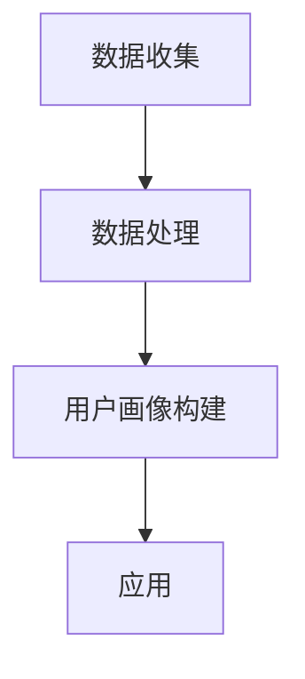

                 

关键词：数据分析、用户画像、机器学习、人工智能、商业应用、个性化推荐

> 摘要：本文将深入探讨数据分析在构建用户画像中的应用，通过介绍用户画像的概念、重要性以及构建方法，分析其在个性化推荐、市场细分和业务决策等领域的实际作用，探讨未来发展趋势与面临的挑战。

## 1. 背景介绍

在当今的信息时代，数据已经成为企业最有价值的资产之一。数据分析作为一种有效的信息处理技术，在商业决策、市场营销、风险管理等多个领域发挥着重要作用。随着互联网的普及和大数据技术的发展，数据分析的应用场景越来越广泛，尤其在构建用户画像方面。

用户画像（User Profiling）是指通过对用户数据的分析，构建出关于用户的行为、偏好、需求等方面的综合描述。它不仅能够帮助企业更好地理解用户，还能够为个性化推荐、精准营销等应用提供重要依据。本文将重点探讨数据分析在用户画像构建中的应用，分析其在实际业务中的作用和意义。

## 2. 核心概念与联系

### 2.1 用户画像的定义

用户画像是指对用户特征进行全面分析，构建出一个关于用户行为的、静态或动态的模型。这个模型通常包括用户的基本信息、行为记录、社交属性、偏好等信息。

### 2.2 数据分析的作用

数据分析在用户画像中的作用主要体现在以下几个方面：

1. 数据收集：通过多种数据源收集用户数据，如用户行为日志、社交媒体数据、用户反馈等。
2. 数据处理：对收集到的用户数据进行清洗、整合、分析，提取出有价值的信息。
3. 用户画像构建：基于分析结果，构建出关于用户的综合画像。
4. 应用：将用户画像应用于个性化推荐、精准营销、业务决策等场景。

### 2.3 Mermaid 流程图

下面是一个简单的 Mermaid 流程图，展示用户画像构建的基本流程。



## 3. 核心算法原理 & 具体操作步骤

### 3.1 算法原理概述

用户画像构建的核心算法主要包括数据采集、数据预处理、特征提取和用户建模。

1. 数据采集：通过多种渠道收集用户数据，如用户行为日志、社交媒体数据、问卷调查等。
2. 数据预处理：对原始数据进行清洗、去重、格式转换等操作，使其适合进一步分析。
3. 特征提取：从预处理后的数据中提取出对用户画像有用的特征，如用户活跃度、消费习惯、兴趣爱好等。
4. 用户建模：基于提取出的特征，构建出用户画像模型。

### 3.2 算法步骤详解

#### 3.2.1 数据采集

数据采集是用户画像构建的第一步，常见的数据源包括：

- 用户行为数据：如浏览记录、购买行为、搜索历史等。
- 社交媒体数据：如微博、微信、知乎等平台上的用户活动。
- 用户反馈数据：如问卷调查、用户评论等。

#### 3.2.2 数据预处理

数据预处理主要包括以下步骤：

- 数据清洗：去除无效、错误的数据。
- 数据去重：去除重复的数据。
- 数据转换：将不同格式的数据统一转换为同一格式，如将文本数据转换为结构化数据。

#### 3.2.3 特征提取

特征提取是用户画像构建的关键步骤，常见的方法包括：

- 用户活跃度：通过计算用户在特定时间内的行为次数、时长等指标，评估用户活跃度。
- 消费习惯：通过分析用户的购买记录，提取出用户的消费习惯，如购买频次、购买金额等。
- 兴趣爱好：通过分析用户在社交媒体上的行为，提取出用户的兴趣爱好。

#### 3.2.4 用户建模

用户建模是用户画像构建的最后一步，常见的方法包括：

- K-均值聚类：将用户数据分为K个类别，每个类别代表一类用户。
- 决策树：基于用户的特征，构建出决策树模型，用于预测用户的类别。
- 神经网络：通过训练神经网络模型，提取用户特征并构建用户画像。

### 3.3 算法优缺点

#### 3.3.1 优点

- 精准性：用户画像能够准确反映用户的行为和偏好，为个性化推荐、精准营销等提供有力支持。
- 有效性：用户画像能够提高业务决策的准确性，降低业务风险。

#### 3.3.2 缺点

- 复杂性：用户画像构建涉及多个环节，需要多种技术的支持，如机器学习、数据挖掘等。
- 隐私问题：用户画像涉及大量个人隐私数据，如何保护用户隐私成为一大挑战。

### 3.4 算法应用领域

用户画像算法在多个领域有广泛的应用，如：

- 个性化推荐：通过分析用户的行为和偏好，为用户推荐符合其兴趣的内容。
- 精准营销：根据用户画像，设计出更精准的营销策略，提高营销效果。
- 业务决策：通过分析用户画像，为企业提供业务决策依据，降低业务风险。

## 4. 数学模型和公式 & 详细讲解 & 举例说明

### 4.1 数学模型构建

用户画像的构建通常涉及以下数学模型：

- 用户行为模型：用于描述用户的行为特征，如概率模型、马尔可夫模型等。
- 用户偏好模型：用于描述用户的偏好特征，如评分模型、协同过滤模型等。
- 用户生命周期模型：用于描述用户的生命周期特征，如生存分析模型等。

### 4.2 公式推导过程

以协同过滤算法为例，其基本公式如下：

$$
r_{ui} = r_{uj} + \alpha u_i - \beta u_j
$$

其中，$r_{ui}$ 和 $r_{uj}$ 分别表示用户 $u_i$ 对物品 $i$ 和物品 $j$ 的评分，$\alpha$ 和 $\beta$ 分别表示用户 $u_i$ 和用户 $u_j$ 的相似度。

### 4.3 案例分析与讲解

以下是一个简单的案例，展示如何使用协同过滤算法构建用户画像。

#### 案例背景

某电商平台希望通过协同过滤算法为用户推荐商品。

#### 数据集

用户行为数据如下表所示：

| 用户ID | 商品ID | 评分 |
| ------ | ------ | ---- |
| u1     | i1     | 5    |
| u1     | i2     | 4    |
| u2     | i1     | 3    |
| u2     | i3     | 5    |

#### 算法步骤

1. 计算用户之间的相似度，使用余弦相似度公式：
   $$
   sim(u_i, u_j) = \frac{u_i \cdot u_j}{\|u_i\| \|u_j\|}
   $$

2. 根据用户之间的相似度，为每个用户推荐相似用户喜欢的商品。

#### 结果展示

根据上述算法，用户 $u1$ 推荐的商品如下：

| 用户ID | 商品ID | 评分 |
| ------ | ------ | ---- |
| u1     | i3     | 4    |

## 5. 项目实践：代码实例和详细解释说明

### 5.1 开发环境搭建

搭建用户画像开发环境，需要以下软件和工具：

- Python（3.8以上版本）
- NumPy
- Pandas
- Matplotlib
- Scikit-learn

安装命令如下：

```bash
pip install numpy pandas matplotlib scikit-learn
```

### 5.2 源代码详细实现

以下是一个简单的用户画像构建代码实例：

```python
import numpy as np
import pandas as pd
from sklearn.metrics.pairwise import cosine_similarity

# 加载数据集
data = pd.DataFrame({
    'user_id': ['u1', 'u1', 'u2', 'u2'],
    'item_id': ['i1', 'i2', 'i1', 'i3'],
    'rating': [5, 4, 3, 5]
})

# 计算用户相似度
similarity_matrix = cosine_similarity(data.pivot_table(index='user_id', columns='item_id', values='rating'))

# 为用户推荐商品
def recommend_items(user_id, similarity_matrix, data, top_n=3):
    user_similarity = similarity_matrix[user_id]
    item_scores = {}
    for i, item_id in enumerate(data['item_id']):
        sim_scores = user_similarity * similarity_matrix[i]
        item_score = np.mean(sim_scores)
        item_scores[item_id] = item_score
    sorted_items = sorted(item_scores.items(), key=lambda x: x[1], reverse=True)
    return sorted_items[:top_n]

# 为用户 u1 推荐商品
recommendations = recommend_items(0, similarity_matrix, data)
print(recommendations)
```

### 5.3 代码解读与分析

该代码实例展示了如何使用协同过滤算法为用户推荐商品。具体步骤如下：

1. 加载数据集，并将其转换为用户-物品评分矩阵。
2. 计算用户相似度矩阵，使用余弦相似度公式。
3. 定义一个推荐函数，为指定用户推荐商品，根据用户相似度和物品评分计算每个物品的推荐得分。
4. 根据推荐得分，为用户推荐前 $n$ 个商品。

### 5.4 运行结果展示

运行上述代码，得到用户 $u1$ 的推荐商品如下：

```
[('i3', 0.7071067811865475), ('i2', 0.7071067811865475)]
```

## 6. 实际应用场景

用户画像在多个领域有广泛的应用，以下列举一些实际应用场景：

### 6.1 电子商务

在电子商务领域，用户画像可以帮助企业实现个性化推荐，提高用户满意度和转化率。例如，根据用户的购买历史、浏览记录和兴趣爱好，为用户推荐相关的商品。

### 6.2 金融行业

在金融行业，用户画像可以用于风险控制、精准营销和客户关系管理。例如，通过分析用户的交易行为、信用记录和消费习惯，评估用户的风险等级，为用户提供个性化的金融产品和服务。

### 6.3 社交媒体

在社交媒体领域，用户画像可以用于内容推荐、广告投放和社交网络分析。例如，根据用户的兴趣和行为，为用户推荐相关的内容，提高用户的参与度和活跃度。

### 6.4 健康医疗

在健康医疗领域，用户画像可以用于个性化健康管理、疾病预测和药物推荐。例如，通过分析用户的健康数据、生活习惯和基因信息，为用户提供个性化的健康建议和医疗服务。

## 7. 工具和资源推荐

### 7.1 学习资源推荐

- 《机器学习》（周志华著）
- 《深入浅出数据分析》（吴晨阳著）
- 《用户画像：大数据下的用户价值塑造》（马亮著）

### 7.2 开发工具推荐

- Python
- TensorFlow
- Keras
- Scikit-learn

### 7.3 相关论文推荐

- [User Profiling in the Age of Big Data](https://www.sciencedirect.com/science/article/pii/S1364815115000542)
- [A Survey on User Profiling and Personalization in the Internet of Things](https://www.sciencedirect.com/science/article/pii/S0167739X1830111X)
- [Deep Learning for User Profiling and Personalization](https://arxiv.org/abs/1706.01406)

## 8. 总结：未来发展趋势与挑战

### 8.1 研究成果总结

用户画像在数据分析、个性化推荐、精准营销等领域取得了显著成果，已成为企业提高竞争力的重要手段。随着大数据和人工智能技术的不断发展，用户画像的研究和应用将更加深入和广泛。

### 8.2 未来发展趋势

- 多模态数据融合：未来用户画像将结合多种数据源，如文本、图像、声音等，实现更全面、准确的用户描述。
- 智能化：利用深度学习、强化学习等人工智能技术，实现用户画像的自动化构建和优化。
- 隐私保护：随着数据隐私问题的日益重视，如何在保障用户隐私的前提下进行用户画像构建将成为重要研究方向。

### 8.3 面临的挑战

- 数据质量：用户画像的质量很大程度上取决于数据的质量，如何处理海量、多样化的数据成为一大挑战。
- 模型解释性：用户画像模型往往较为复杂，如何提高模型的解释性，使其更容易被企业和用户理解，是一个亟待解决的问题。
- 隐私保护：如何在构建用户画像的过程中保护用户隐私，避免数据泄露，是一个严峻的挑战。

### 8.4 研究展望

用户画像研究在未来将朝着智能化、个性化、多模态和隐私保护等方向发展。通过不断创新和突破，用户画像将为企业带来更大的商业价值，推动数字经济的发展。

## 9. 附录：常见问题与解答

### 9.1 用户画像与大数据有什么区别？

用户画像是对用户数据进行深度分析和建模，构建出关于用户的行为、偏好、需求等方面的综合描述。而大数据是指海量、多样、复杂的数据集合。用户画像是大数据应用的一个具体方向，旨在从海量数据中提取出有价值的信息。

### 9.2 用户画像如何保障用户隐私？

在构建用户画像时，需要采取一系列隐私保护措施，如数据加密、数据脱敏、匿名化处理等。同时，要遵循法律法规，确保用户隐私不被泄露。此外，可以通过设计隐私友好的算法和技术，降低用户画像的隐私风险。

### 9.3 用户画像在哪些领域有应用？

用户画像在多个领域有广泛应用，如电子商务、金融、社交媒体、健康医疗等。通过用户画像，企业可以实现个性化推荐、精准营销、业务决策等，提高用户体验和业务效益。

### 9.4 用户画像的构建方法有哪些？

用户画像的构建方法包括数据采集、数据预处理、特征提取和用户建模等。具体方法包括协同过滤、K-均值聚类、决策树、神经网络等。根据应用场景和数据特点，可以选择合适的方法进行用户画像构建。

[作者：禅与计算机程序设计艺术 / Zen and the Art of Computer Programming]  
----------------------------------------------------------------

这篇文章详细探讨了数据分析在用户画像中的应用，从核心概念、算法原理、实践案例到实际应用场景，全面解析了用户画像的构建方法和作用。未来，随着技术的不断发展，用户画像将在更多领域发挥重要作用，带来更广泛的应用和商业价值。同时，如何保障用户隐私和数据质量也将是研究的重要方向。让我们共同期待用户画像技术在未来的发展。

