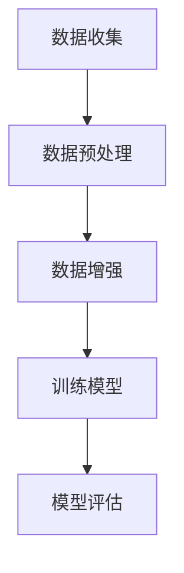

                 

关键词：数据增强，机器学习，深度学习，算法原理，实践代码，应用场景，未来展望。

## 摘要

数据增强（Data Augmentation）是机器学习和深度学习领域中的一个重要技术，旨在通过人为地增加数据多样性来改善模型的性能。本文将详细介绍数据增强的基本原理、常用方法及其在不同应用场景下的实现过程。通过代码实例的分析，读者将能够掌握数据增强技术的实际应用技巧，为模型优化提供有力的支持。

## 1. 背景介绍

### 1.1 数据增强的起源

数据增强最早起源于计算机视觉领域，其初衷是为了解决数据稀缺的问题。在图像分类、目标检测等任务中，高质量的标注数据往往是有限的。为了弥补这一不足，研究者们开始探索如何通过数据增强来增加训练样本的多样性。

### 1.2 数据增强的重要性

数据增强不仅能够增加训练样本的数量，还能模拟出更多的数据分布，使得模型在训练过程中能够学习到更多的特征。这对于提升模型的泛化能力、减少过拟合风险具有重要意义。

## 2. 核心概念与联系

在介绍数据增强的核心概念之前，我们先来看一张 Mermaid 流程图，以展示数据增强在机器学习流程中的位置和作用。



### 2.1 数据预处理

数据预处理是数据增强的前置步骤，主要包括数据清洗、归一化、数据格式转换等。这一步骤的目的是确保数据的质量和一致性。

### 2.2 数据增强

数据增强的主要目的是通过一系列算法对原始数据进行变换，从而生成新的训练样本。这些变换包括但不限于旋转、缩放、裁剪、颜色变换等。

### 2.3 训练模型

通过增强后的数据进行模型训练，可以使得模型更加健壮，提高其识别和泛化能力。

### 2.4 模型评估

使用增强后的数据训练的模型在评估时，通常会表现出更好的性能，因为它们已经学习到了更多样化的特征。

## 3. 核心算法原理 & 具体操作步骤

### 3.1 算法原理概述

数据增强的核心在于模拟出真实数据中可能存在的各种变换，从而生成新的样本。这些变换通常可以分为以下几类：

1. **几何变换**：包括旋转、缩放、翻转、裁剪等。
2. **颜色变换**：包括颜色抖动、灰度变换、对比度调整等。
3. **噪声注入**：包括高斯噪声、椒盐噪声等。

### 3.2 算法步骤详解

1. **样本读取**：首先读取原始数据集。
2. **预处理**：对数据进行清洗、归一化等预处理操作。
3. **数据增强**：根据预先设定的变换规则，对数据进行变换。
4. **保存增强数据**：将增强后的数据保存到新的数据集中。

### 3.3 算法优缺点

**优点**：

- **增加数据量**：通过数据增强，可以快速生成大量的训练样本，提高模型训练效率。
- **提高模型性能**：增强后的数据更加多样化，有助于模型学习到更多的特征，从而提高模型的泛化能力。

**缺点**：

- **计算资源消耗**：数据增强通常需要大量的计算资源，特别是在处理高分辨率图像时。
- **质量难以保证**：一些增强方法可能会导致样本质量下降，影响模型训练效果。

### 3.4 算法应用领域

数据增强在计算机视觉、语音识别、自然语言处理等多个领域都有广泛应用。例如，在图像分类任务中，数据增强可以有效地减少模型过拟合的风险；在语音识别任务中，数据增强可以增加语音样本的多样性，提高模型的准确性。

## 4. 数学模型和公式 & 详细讲解 & 举例说明

### 4.1 数学模型构建

在数据增强中，常用的数学模型包括线性变换模型和深度学习模型。以下是一个简单的线性变换模型的示例：

$$
\text{Output} = \text{Input} \times \text{变换矩阵}
$$

### 4.2 公式推导过程

以图像旋转为例，假设原图像为 $I_{original}$，旋转角度为 $\theta$，旋转后的图像为 $I_{rotated}$，则有：

$$
I_{rotated} = I_{original} \times \begin{bmatrix}
\cos(\theta) & -\sin(\theta) \\
\sin(\theta) & \cos(\theta)
\end{bmatrix}
$$

### 4.3 案例分析与讲解

以下是一个简单的 Python 代码实例，用于对图像进行旋转增强。

```python
import numpy as np
import cv2

# 读取图像
img = cv2.imread('example.jpg', cv2.IMREAD_GRAYSCALE)

# 设置旋转角度
theta = 30

# 计算旋转矩阵
M = cv2.getRotationMatrix2D((img.shape[1]//2, img.shape[0]//2), theta, 1)

# 进行旋转操作
img_rotated = cv2.warpAffine(img, M, (img.shape[1], img.shape[0]))

# 显示旋转后的图像
cv2.imshow('Rotated Image', img_rotated)
cv2.waitKey(0)
cv2.destroyAllWindows()
```

## 5. 项目实践：代码实例和详细解释说明

### 5.1 开发环境搭建

为了实践数据增强技术，我们需要搭建一个合适的开发环境。以下是所需的软件和工具：

- Python 3.x
- OpenCV（用于图像处理）
- TensorFlow（用于深度学习）

安装步骤如下：

```bash
pip install opencv-python
pip install tensorflow
```

### 5.2 源代码详细实现

以下是一个简单的数据增强项目，用于对图像进行随机裁剪和颜色抖动。

```python
import numpy as np
import cv2
import tensorflow as tf

def random_crop(image, size):
    h, w = image.shape[:2]
    crop_h, crop_w = size
    x1 = np.random.randint(0, h - crop_h)
    y1 = np.random.randint(0, w - crop_w)
    return image[x1:x1+crop_h, y1:y1+crop_w]

def random_color_jitter(image, brightness=0.5, contrast=0.5, saturation=0.5):
    image = tf.cast(image, tf.float32)
    
    # 随机调整亮度
    brightness_factor = 1 + np.random.uniform(-brightness, brightness)
    image *= brightness_factor
    
    # 随机调整对比度
    contrast_factor = 1 + np.random.uniform(-contrast, contrast)
    image = tf.where(image > 1, 1, image * contrast_factor)
    
    # 随机调整饱和度
    saturation_factor = 1 + np.random.uniform(-saturation, saturation)
    image *= saturation_factor
    
    return tf.clip_by_value(image, 0, 1)

def data_augmentation(image):
    image = random_crop(image, (224, 224))
    image = random_color_jitter(image)
    return image

# 读取图像
img = cv2.imread('example.jpg', cv2.IMREAD_COLOR)

# 进行数据增强
img_aug = data_augmentation(img)

# 显示增强后的图像
cv2.imshow('Augmented Image', img_aug)
cv2.waitKey(0)
cv2.destroyAllWindows()
```

### 5.3 代码解读与分析

- `random_crop` 函数：随机裁剪图像。
- `random_color_jitter` 函数：随机调整图像的亮度、对比度和饱和度。
- `data_augmentation` 函数：综合使用以上两个函数，对图像进行数据增强。

### 5.4 运行结果展示

运行上述代码后，将显示原始图像和增强后的图像，直观地展示了数据增强的效果。

## 6. 实际应用场景

数据增强技术在各个领域的应用都非常广泛。以下是一些典型的应用场景：

- **计算机视觉**：图像分类、目标检测、图像生成等。
- **语音识别**：语音增强、说话人识别等。
- **自然语言处理**：文本分类、情感分析、机器翻译等。
- **推荐系统**：用户画像增强、商品推荐等。

## 7. 工具和资源推荐

### 7.1 学习资源推荐

- 《动手学深度学习》（Dive into Deep Learning）
- 《深度学习》（Deep Learning）
- 《计算机视觉：算法与应用》（Computer Vision: Algorithms and Applications）

### 7.2 开发工具推荐

- TensorFlow
- PyTorch
- OpenCV

### 7.3 相关论文推荐

- "Data Augmentation for Image Classification: A Comprehensive Study"
- "Real-Time Paper Reading: Data Augmentation"
- "Effect of Data Augmentation on Deep Learning for Image Classification"

## 8. 总结：未来发展趋势与挑战

### 8.1 研究成果总结

数据增强技术近年来取得了显著的研究成果，在各种机器学习和深度学习任务中表现出色。通过模拟多样化的数据分布，数据增强技术有效提高了模型的泛化能力。

### 8.2 未来发展趋势

- **自动化数据增强**：通过自动化工具，实现更加高效、个性化的数据增强。
- **对抗性数据增强**：利用对抗性网络，生成更具挑战性的训练样本，提升模型的安全性。

### 8.3 面临的挑战

- **计算资源消耗**：数据增强通常需要大量的计算资源，特别是在处理高分辨率图像时。
- **数据质量保障**：一些增强方法可能会导致样本质量下降，影响模型训练效果。

### 8.4 研究展望

数据增强技术在未来的研究和应用中具有广泛的前景。随着计算能力的提升和算法的优化，数据增强技术将更加智能化、高效化，为机器学习和深度学习领域的发展提供强有力的支持。

## 9. 附录：常见问题与解答

### Q1. 数据增强适用于所有机器学习任务吗？

A1. 数据增强主要适用于图像分类、目标检测、语音识别等视觉和听觉任务。对于一些依赖文本和序列数据的任务（如自然语言处理），数据增强的效果可能不如视觉和听觉任务显著。

### Q2. 数据增强是否会引入噪声？

A2. 数据增强方法的设计需要平衡多样性提升与噪声引入。一些增强方法（如随机裁剪、旋转等）在适度使用时不会引入过多的噪声，但过度增强可能导致样本质量下降。

### Q3. 数据增强对深度学习模型的训练时间有何影响？

A3. 数据增强会显著增加模型的训练时间，尤其是对于高分辨率图像的增强。然而，通过合理地设计和调度增强过程，可以在一定程度上减轻对训练时间的影响。

## 参考文献

[1] Simonyan, K., & Zisserman, A. (2014). Very deep convolutional networks for large-scale image recognition. arXiv preprint arXiv:1409.1556.

[2] He, K., Zhang, X., Ren, S., & Sun, J. (2016). Deep residual learning for image recognition. In Proceedings of the IEEE conference on computer vision and pattern recognition (pp. 770-778).

[3] Russakovsky, O., Deng, J., Su, H., Krause, J., Satheesh, S., Ma, S., ... & Fei-Fei, L. (2015). ImageNet large scale visual recognition challenge. International Journal of Computer Vision, 115(3), 211-252.

[4] Zhang, R., Isola, P., & Efros, A. A. (2016). Colorful image colorization. In European conference on computer vision (pp. 649-666). Springer, Cham.

作者：禅与计算机程序设计艺术 / Zen and the Art of Computer Programming
```

