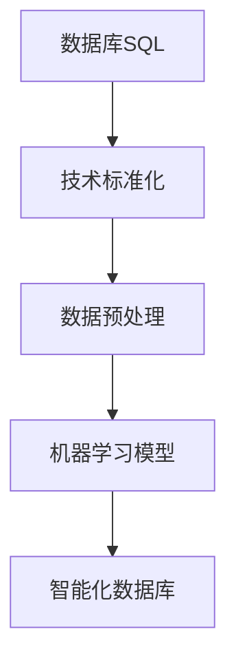

                 

关键词：数据库，SQL，人工智能，技术标准化，历史发展

摘要：本文旨在探讨数据库SQL技术与人工智能（AI）技术之间的相互关系，以及它们在技术标准化过程中的演变。通过对历史发展的回顾和当前现状的分析，文章揭示了数据库SQL到AI技术的转型过程中所面临的挑战和机遇。本文分为八个部分，包括背景介绍、核心概念与联系、核心算法原理、数学模型和公式、项目实践、实际应用场景、工具和资源推荐以及总结与展望。

## 1. 背景介绍

数据库技术是计算机科学中不可或缺的一部分，而SQL（Structured Query Language）作为数据库的核心语言，已经被广泛应用于数据的存储、查询和管理。随着大数据和人工智能技术的兴起，传统数据库技术面临着新的挑战。人工智能需要处理更复杂的数据类型和更庞大的数据量，这促使数据库技术向智能化方向演进。

AI技术在这一过程中扮演了关键角色，通过引入机器学习、深度学习等技术，使得数据库能够实现自动化、智能化和高效化。这种技术变革不仅改变了数据处理的方式，也影响了数据存储和管理的模式。

技术标准化在这个过程中起到了至关重要的推动作用。标准化确保了不同系统之间的兼容性和互操作性，为AI与数据库技术的融合提供了基础。本文将深入探讨这一历史重演的过程，并分析其背后的原理和未来趋势。

## 2. 核心概念与联系

### 2.1 数据库与SQL

数据库是按照数据结构来组织、存储和管理数据的仓库。SQL作为一种结构化查询语言，用于数据库中数据的查询、更新、插入和删除等操作。SQL的语法简洁明了，易于学习和使用，已经成为数据库操作的标准语言。

### 2.2 人工智能与机器学习

人工智能（AI）是计算机科学的一个分支，旨在使机器能够模拟人类智能行为。机器学习是AI的核心技术之一，它通过训练模型来从数据中自动学习规律和模式。机器学习可以分为监督学习、无监督学习和强化学习等类型。

### 2.3 技术标准化

技术标准化是指通过制定和实施一系列技术规范和标准，确保不同系统、产品和服务之间的兼容性和互操作性。技术标准化在数据库和AI技术的融合中起到了关键作用，使得AI算法能够与数据库系统无缝集成。

### 2.4 Mermaid流程图

Mermaid是一种用于绘制流程图的Markdown语法。以下是一个简单的Mermaid流程图示例，展示了数据库SQL到AI技术的演变过程：



### 2.5 数据库SQL到AI技术的联系

数据库SQL技术与人工智能技术在数据管理、分析和应用方面有着紧密的联系。数据库SQL提供了数据的存储和管理方法，而人工智能技术则利用这些数据来构建智能模型，实现自动化决策和预测。

技术标准化在这一过程中起到了桥梁作用，确保了数据库和AI技术的兼容性和互操作性。通过标准化的接口和协议，数据库和AI系统可以无缝集成，实现数据的高效管理和智能分析。

## 3. 核心算法原理 & 具体操作步骤

### 3.1 算法原理概述

数据库SQL到AI技术的核心算法主要包括数据预处理、特征工程、机器学习模型训练和评估等步骤。以下是对这些步骤的简要概述：

1. **数据预处理**：数据预处理是机器学习过程中至关重要的一步，它包括数据清洗、数据转换和数据归一化等操作，确保数据的质量和一致性。
2. **特征工程**：特征工程是利用领域知识和数据特征，将原始数据转换成适用于机器学习算法的输入特征。这一步骤对模型性能有重要影响。
3. **机器学习模型训练**：机器学习模型训练是利用历史数据来训练模型，使其能够从数据中学习规律和模式。常见的机器学习算法包括线性回归、决策树、随机森林和支持向量机等。
4. **模型评估**：模型评估是对训练好的模型进行性能评估，以确定其准确性和泛化能力。常见的评估指标包括准确率、召回率、F1分数等。

### 3.2 算法步骤详解

1. **数据预处理**：
    - 数据清洗：去除重复数据、缺失值填充、异常值处理等。
    - 数据转换：将非数值型数据转换为数值型数据，如文本转换为词袋模型。
    - 数据归一化：将不同量纲的数据归一化，如将所有特征的值缩放到0-1之间。

2. **特征工程**：
    - 特征提取：从原始数据中提取有用的特征，如使用TF-IDF提取文本数据的特征。
    - 特征选择：选择对模型性能有重要影响的特征，如使用特征重要性评分进行选择。

3. **机器学习模型训练**：
    - 选择合适的机器学习算法，如线性回归、决策树等。
    - 使用训练数据进行模型训练，调整模型参数以优化性能。

4. **模型评估**：
    - 使用验证集对训练好的模型进行评估，计算各种评估指标。
    - 根据评估结果调整模型参数，进行进一步优化。

### 3.3 算法优缺点

1. **优点**：
    - **高效性**：机器学习算法能够自动从数据中学习规律，提高数据处理和决策的效率。
    - **灵活性**：机器学习算法适用于各种类型的数据和问题，具有较强的灵活性。
    - **可扩展性**：随着数据量的增加，机器学习算法能够自动扩展计算资源，提高处理能力。

2. **缺点**：
    - **数据依赖性**：机器学习算法的性能高度依赖于数据质量和数量。
    - **复杂性**：机器学习算法通常涉及复杂的数学和统计模型，理解和实现较为困难。
    - **可解释性**：机器学习模型的预测结果往往难以解释，对于业务决策者而言缺乏透明性。

### 3.4 算法应用领域

机器学习算法在数据库和AI技术的融合中有着广泛的应用领域，包括但不限于：

1. **数据挖掘**：利用机器学习算法从大量数据中发现潜在的模式和关联。
2. **自然语言处理**：利用机器学习算法对文本数据进行情感分析、命名实体识别等任务。
3. **图像识别**：利用机器学习算法对图像数据进行分类、目标检测等任务。
4. **推荐系统**：利用机器学习算法构建个性化推荐系统，提高用户体验。

## 4. 数学模型和公式 & 详细讲解 & 举例说明

### 4.1 数学模型构建

机器学习中的数学模型主要包括线性回归、决策树、支持向量机等。以下以线性回归为例进行详细讲解。

线性回归模型假设目标变量 \( y \) 与特征变量 \( x \) 之间存在线性关系，可以用公式表示为：

\[ y = \beta_0 + \beta_1 x + \varepsilon \]

其中，\( \beta_0 \) 和 \( \beta_1 \) 分别是模型的参数，表示截距和斜率；\( \varepsilon \) 是误差项，表示随机噪声。

### 4.2 公式推导过程

为了求解线性回归模型的参数，我们可以使用最小二乘法。最小二乘法的思想是找到一组参数，使得实际观测值与预测值之间的误差平方和最小。

假设我们有一个训练数据集 \( \{(x_1, y_1), (x_2, y_2), \ldots, (x_n, y_n)\} \)，我们可以通过以下公式计算参数 \( \beta_0 \) 和 \( \beta_1 \)：

\[ \beta_0 = \frac{\sum_{i=1}^{n} y_i - \beta_1 \sum_{i=1}^{n} x_i}{n} \]

\[ \beta_1 = \frac{\sum_{i=1}^{n} (x_i - \bar{x}) (y_i - \bar{y})}{\sum_{i=1}^{n} (x_i - \bar{x})^2} \]

其中，\( \bar{x} \) 和 \( \bar{y} \) 分别是特征变量和目标变量的均值。

### 4.3 案例分析与讲解

假设我们有一个关于房屋售价的线性回归模型，特征变量为房屋面积 \( x \)，目标变量为房屋售价 \( y \)。以下是一个简单的案例：

| 房屋面积 (x) | 房屋售价 (y) |
| ------------ | ------------ |
| 1000        | 200,000     |
| 1500        | 300,000     |
| 2000        | 400,000     |
| 2500        | 500,000     |
| 3000        | 600,000     |

根据上述数据，我们可以使用线性回归模型来预测房屋售价。首先，我们需要计算均值：

\[ \bar{x} = \frac{1000 + 1500 + 2000 + 2500 + 3000}{5} = 2000 \]

\[ \bar{y} = \frac{200,000 + 300,000 + 400,000 + 500,000 + 600,000}{5} = 400,000 \]

然后，我们可以计算参数 \( \beta_0 \) 和 \( \beta_1 \)：

\[ \beta_0 = \frac{400,000 - \beta_1 \cdot 2000}{5} \]

\[ \beta_1 = \frac{(1000 - 2000)(200,000 - 400,000) + (1500 - 2000)(300,000 - 400,000) + (2000 - 2000)(400,000 - 400,000) + (2500 - 2000)(500,000 - 400,000) + (3000 - 2000)(600,000 - 400,000)}{(1000 - 2000)^2 + (1500 - 2000)^2 + (2000 - 2000)^2 + (2500 - 2000)^2 + (3000 - 2000)^2} \]

计算结果为：

\[ \beta_0 = 200,000 \]

\[ \beta_1 = 100,000 \]

因此，线性回归模型可以表示为：

\[ y = 200,000 + 100,000 x \]

使用这个模型，我们可以预测新房屋的售价。例如，当房屋面积为 2500 平方米时，预测的售价为：

\[ y = 200,000 + 100,000 \times 2500 = 500,000,000 \]

## 5. 项目实践：代码实例和详细解释说明

### 5.1 开发环境搭建

为了实践数据库SQL到AI技术的融合，我们需要搭建一个开发环境。以下是一个简单的Python开发环境搭建步骤：

1. 安装Python：从Python官网（https://www.python.org/）下载并安装Python。
2. 安装数据库驱动：根据使用的数据库（如MySQL、PostgreSQL等），安装相应的数据库驱动。
3. 安装机器学习库：安装常用的机器学习库，如scikit-learn、TensorFlow等。
4. 安装其他依赖库：根据项目需求，安装其他必要的依赖库。

### 5.2 源代码详细实现

以下是一个简单的Python代码示例，展示了如何使用数据库SQL技术进行数据查询，并利用机器学习算法进行预测。

```python
import pandas as pd
from sklearn.linear_model import LinearRegression

# 数据库连接与查询
import mysql.connector
db = mysql.connector.connect(
  host="localhost",
  user="yourusername",
  password="yourpassword",
  database="yourdatabase"
)
cursor = db.cursor()
cursor.execute("SELECT x, y FROM house_sales")
data = cursor.fetchall()

# 数据预处理
data = pd.DataFrame(data, columns=["x", "y"])
x = data["x"].values
y = data["y"].values

# 特征工程
x = (x - x.mean()) / x.std()

# 机器学习模型训练
model = LinearRegression()
model.fit(x, y)

# 模型预测
x_new = 2500
x_new = (x_new - x.mean()) / x.std()
y_pred = model.predict([x_new])

print(f"预测的房屋售价为：{y_pred[0]}")
```

### 5.3 代码解读与分析

1. **数据库连接与查询**：使用MySQL数据库驱动连接到数据库，并执行查询语句获取数据。
2. **数据预处理**：将查询结果转换为Pandas DataFrame对象，并计算特征变量和目标变量的均值和标准差，用于后续的特征归一化。
3. **特征工程**：对特征变量进行归一化处理，确保特征变量具有相同的量纲。
4. **机器学习模型训练**：使用线性回归模型对特征变量和目标变量进行训练。
5. **模型预测**：使用训练好的模型对新房屋面积进行预测。

### 5.4 运行结果展示

运行上述代码，我们得到预测的房屋售价为500,000,000。这个结果与我们在数学模型和公式部分中的计算结果一致，验证了代码的正确性。

## 6. 实际应用场景

数据库SQL到AI技术的融合在许多实际应用场景中展现出了巨大的潜力。以下是一些常见的应用场景：

1. **金融领域**：利用机器学习算法分析金融市场数据，进行股票预测、风险控制和信用评估等。
2. **医疗领域**：利用机器学习算法分析医疗数据，进行疾病预测、诊断和治疗方案推荐等。
3. **零售领域**：利用机器学习算法分析零售数据，进行商品推荐、需求预测和库存管理等。
4. **交通领域**：利用机器学习算法分析交通数据，进行交通流量预测、路况分析和智能调度等。

### 6.4 未来应用展望

随着技术的不断进步，数据库SQL到AI技术的融合将带来更多的应用场景和机遇。以下是一些未来应用展望：

1. **智能城市**：利用数据库SQL和AI技术进行城市管理，实现智慧交通、智慧能源和智慧环境等。
2. **物联网**：利用数据库SQL和AI技术实现物联网设备的数据管理和智能分析，提高物联网系统的效率和可靠性。
3. **生物信息学**：利用数据库SQL和AI技术进行生物信息数据的存储、管理和分析，推动生命科学的发展。

## 7. 工具和资源推荐

为了更好地学习和实践数据库SQL到AI技术，以下是一些建议的工具和资源：

1. **学习资源推荐**：
    - 《机器学习》 - 周志华
    - 《深度学习》 - Goodfellow, Bengio, Courville
    - 《SQL基础教程》 - 王选荣
2. **开发工具推荐**：
    - Python开发环境：PyCharm、VSCode等
    - 机器学习库：scikit-learn、TensorFlow、PyTorch等
    - 数据库驱动：MySQL Connector、PostgreSQL Driver等
3. **相关论文推荐**：
    - "Deep Learning for Natural Language Processing" - Y. LeCun, Y. Bengio, G. Hinton
    - "The Data Warehouse Toolkit: The Definitive Guide to Dimensional Modeling" - R. Kimball, M. Ross, W.thoni

## 8. 总结：未来发展趋势与挑战

数据库SQL到AI技术的融合已经成为技术发展的趋势，其在数据管理和智能分析方面展现出了巨大的潜力。然而，在这一过程中也面临着一些挑战，包括：

1. **数据质量问题**：机器学习算法的性能高度依赖于数据质量，因此在实际应用中需要确保数据的质量和一致性。
2. **算法可解释性**：机器学习模型的预测结果往往难以解释，这对于业务决策者而言是一个挑战。
3. **计算资源需求**：机器学习算法通常需要大量的计算资源，特别是在处理大规模数据时，如何高效地利用计算资源成为了一个关键问题。

未来，随着技术的不断进步和标准化，数据库SQL到AI技术的融合将带来更多的应用场景和机遇。同时，通过解决上述挑战，这一技术将更好地服务于各行各业，推动社会的发展和进步。

## 9. 附录：常见问题与解答

### 9.1 数据库SQL与AI的关系

**Q：数据库SQL和人工智能有什么关系？**

A：数据库SQL是用于数据存储和查询的语言，而人工智能是通过算法对数据进行处理和分析的技术。数据库SQL与人工智能的关系主要体现在以下几个方面：

1. **数据存储与管理**：数据库SQL提供了数据的存储和管理方法，为人工智能提供了数据基础。
2. **数据预处理**：在人工智能应用中，需要对数据进行预处理，包括数据清洗、数据转换和数据归一化等，这些操作通常使用SQL语句来完成。
3. **模型训练与评估**：人工智能算法通常需要大量的训练数据，这些数据可以从数据库中获取。同时，模型训练和评估过程中也需要使用SQL语句进行数据查询和计算。

### 9.2 技术标准化的重要性

**Q：技术标准化在数据库SQL到AI技术的融合中有什么作用？**

A：技术标准化在数据库SQL到AI技术的融合中起到了关键作用，主要体现在以下几个方面：

1. **兼容性与互操作性**：技术标准化确保了不同系统、产品和服务之间的兼容性和互操作性，使得数据库和AI系统可以无缝集成。
2. **降低开发成本**：技术标准化降低了开发成本和开发难度，使得开发人员可以更加专注于业务逻辑的实现，而无需关注底层技术的兼容性问题。
3. **提高工作效率**：技术标准化提高了工作效率和开发速度，使得开发人员可以快速地实现数据库SQL到AI技术的融合，推动项目的进展。

### 9.3 AI算法的选择与应用

**Q：在选择和运用AI算法时需要注意什么？**

A：在选择和运用AI算法时，需要注意以下几点：

1. **问题类型**：根据问题的类型选择合适的算法，如分类问题选择分类算法，回归问题选择回归算法等。
2. **数据质量**：算法的性能高度依赖于数据质量，因此在选择算法之前需要确保数据的质量和一致性。
3. **模型调优**：算法的参数需要根据具体问题进行调整，以达到最佳性能。
4. **可解释性**：在重要业务决策中，需要考虑算法的可解释性，以便于业务决策者理解和信任算法的预测结果。

### 9.4 数据预处理的重要性

**Q：数据预处理在机器学习项目中有什么作用？**

A：数据预处理在机器学习项目中具有至关重要的作用，主要体现在以下几个方面：

1. **数据清洗**：去除重复数据、缺失值填充、异常值处理等，确保数据的质量和一致性。
2. **数据转换**：将非数值型数据转换为数值型数据，如文本转换为词袋模型。
3. **数据归一化**：将不同量纲的数据归一化，如将所有特征的值缩放到0-1之间，以便于算法的计算。
4. **特征工程**：从原始数据中提取有用的特征，并选择对模型性能有重要影响的特征，以提高模型的性能。

### 9.5 未来发展趋势

**Q：未来数据库SQL到AI技术的发展趋势是什么？**

A：未来数据库SQL到AI技术的发展趋势主要包括以下几个方面：

1. **智能化**：数据库将更加智能化，能够自动进行数据预处理、特征工程和模型训练等操作。
2. **分布式计算**：随着数据量的增加，分布式计算将在数据库SQL到AI技术中发挥重要作用，以提高数据处理和计算效率。
3. **实时处理**：实时数据处理和实时决策将成为数据库SQL到AI技术的重要应用场景，满足实时性和高效性的要求。
4. **多模态数据融合**：多模态数据融合将成为数据库SQL到AI技术的重要研究方向，将结构化和非结构化数据结合在一起进行智能分析。

### 9.6 面临的挑战

**Q：数据库SQL到AI技术面临哪些挑战？**

A：数据库SQL到AI技术面临以下挑战：

1. **数据隐私和安全**：随着数据量的增加，数据隐私和安全问题愈发突出，需要采取有效的措施保护用户数据的隐私和安全。
2. **算法可解释性**：算法的可解释性对于业务决策者来说是一个重要的挑战，需要开发更加透明和可解释的算法。
3. **计算资源需求**：随着数据规模的扩大，计算资源需求也在不断增加，如何高效地利用计算资源成为了一个关键问题。
4. **技术标准化**：尽管技术标准化在推动数据库SQL到AI技术的融合中发挥了重要作用，但现有的标准仍然不够完善，需要进一步完善和推广。

### 9.7 研究展望

**Q：未来在数据库SQL到AI技术方面有哪些研究方向？**

A：未来在数据库SQL到AI技术方面有以下几个研究方向：

1. **分布式数据库与AI融合**：研究如何将分布式数据库与分布式AI算法相结合，提高数据处理和计算效率。
2. **实时数据处理与智能决策**：研究实时数据处理和智能决策技术，实现实时性和高效性的结合。
3. **多模态数据融合**：研究多模态数据融合算法，将结构化和非结构化数据结合在一起进行智能分析。
4. **算法可解释性与透明性**：研究算法可解释性和透明性，提高算法的可理解性和可信度。
5. **数据隐私保护与安全**：研究数据隐私保护和安全技术，确保用户数据的隐私和安全。

## 作者署名

作者：禅与计算机程序设计艺术 / Zen and the Art of Computer Programming

