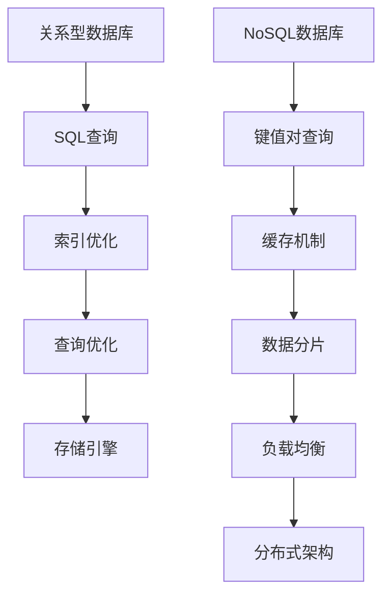

                 

 > 关键词：数据库系统，关系型数据库，NoSQL，数据模型，性能优化，应用场景，未来趋势

> 摘要：本文从数据库系统的起源和发展出发，深入探讨了关系型数据库和NoSQL数据库的区别、优缺点及适用场景，并通过具体案例和实践，详细介绍了NoSQL数据库的核心算法原理、数学模型、项目实践及未来应用展望。

## 1. 背景介绍

### 关系型数据库的兴起与发展

关系型数据库（Relational Database）起源于1970年代，由E.F.Codd提出关系模型理论，并设计了SQL（Structured Query Language）语言。关系型数据库以表格形式组织数据，通过SQL语言进行数据查询、插入、更新和删除操作，具有结构化、易于理解和维护的特点。随着互联网和电子商务的快速发展，关系型数据库得到了广泛应用，如MySQL、Oracle、SQL Server等。

### NoSQL数据库的诞生与崛起

随着互联网数据的爆发式增长，关系型数据库逐渐暴露出性能瓶颈和扩展性问题。NoSQL（Not Only SQL）数据库应运而生，旨在解决大规模数据的存储和查询需求。NoSQL数据库采用非关系型数据模型，支持水平扩展和高并发，如MongoDB、Cassandra、Redis等。NoSQL数据库的出现，标志着数据库系统领域的新一轮变革。

## 2. 核心概念与联系

### 数据模型

关系型数据库采用关系模型，将数据组织成表格，通过表与表之间的关联（外键）进行数据操作。NoSQL数据库则采用多种数据模型，包括键值对（Key-Value）、文档、列族、图等，具有更高的灵活性和扩展性。

### 架构

关系型数据库通常采用主从架构或集群架构，通过数据库复制和分片实现数据高可用和读写分离。NoSQL数据库则采用分布式架构，通过数据分片、缓存、负载均衡等机制实现高并发和水平扩展。

### 性能优化

关系型数据库通过索引、查询优化、存储引擎等手段提升查询性能。NoSQL数据库则通过数据分片、缓存、内存存储等机制提高读写速度。

### Mermaid 流程图



## 3. 核心算法原理 & 具体操作步骤

### 算法原理概述

NoSQL数据库的核心算法主要涉及数据分片、缓存、分布式一致性、分布式锁等。以下分别介绍这些算法的原理。

#### 数据分片

数据分片是一种将大量数据分散存储到多个节点上的技术。通过数据分片，可以降低单点瓶颈，提高系统性能和可用性。

#### 缓存机制

缓存是一种将常用数据存储在内存中的技术，以减少磁盘IO操作，提高数据读取速度。常用的缓存算法有LRU（Least Recently Used）和LFU（Least Frequently Used）。

#### 分布式一致性

分布式一致性是一种保证分布式系统中数据一致性的技术。常见的分布式一致性算法有Paxos、Raft等。

#### 分布式锁

分布式锁是一种在分布式系统中保证数据并发访问一致性的技术。常见的分布式锁算法有Zookeeper、Redis分布式锁等。

### 算法步骤详解

1. 数据分片：根据数据特点（如ID、地理位置等）将数据划分为多个分片，每个分片存储在一个节点上。

2. 缓存机制：将常用数据存储在内存中，如Redis、Memcached等。

3. 分布式一致性：采用Paxos或Raft算法，保证分布式系统中数据的一致性。

4. 分布式锁：采用Zookeeper或Redis分布式锁，保证数据并发访问的一致性。

### 算法优缺点

1. 数据分片：优点是降低单点瓶颈，提高系统性能和可用性；缺点是需要解决数据分片和聚合问题。

2. 缓存机制：优点是提高数据读取速度，减少磁盘IO操作；缺点是缓存一致性需要保证。

3. 分布式一致性：优点是保证分布式系统中数据的一致性；缺点是算法复杂度较高，性能影响。

4. 分布式锁：优点是保证数据并发访问的一致性；缺点是需要解决锁的粒度和分布式锁的性能问题。

### 算法应用领域

1. 数据分片：适用于海量数据存储和高并发查询场景，如电商平台、社交网络等。

2. 缓存机制：适用于高并发读操作和常用数据存储场景，如网站缓存、实时数据分析等。

3. 分布式一致性：适用于分布式系统数据一致性保障场景，如分布式数据库、分布式缓存等。

4. 分布式锁：适用于分布式系统中数据并发访问控制场景，如分布式队列、分布式任务调度等。

## 4. 数学模型和公式 & 详细讲解 & 举例说明

### 数学模型构建

NoSQL数据库的数学模型主要包括数据分片模型、缓存模型、一致性模型等。

#### 数据分片模型

设数据总量为 $N$，分片数为 $M$，则每个分片包含的数据量为 $N/M$。

#### 缓存模型

设缓存命中率为 $H$，缓存容量为 $C$，则缓存中的数据量为 $C \times H$。

#### 一致性模型

设一致性概率为 $P$，则分布式系统中数据一致的概率为 $P$。

### 公式推导过程

#### 数据分片模型

根据概率论中的大数定律，当分片数 $M$ 趋近于无穷大时，每个分片包含的数据量趋近于总数据量的平均值。

$$
\lim_{{M \to \infty}} \frac{N}{M} = \frac{N}{\infty} = 0
$$

因此，当 $M$ 足够大时，每个分片包含的数据量可以近似为总数据量的平均值。

#### 缓存模型

根据泊松分布，缓存命中率 $H$ 满足以下公式：

$$
H = 1 - \frac{\lambda}{C}
$$

其中，$\lambda$ 为缓存访问速率，$C$ 为缓存容量。

#### 一致性模型

根据概率论中的贝叶斯定理，分布式系统中数据一致的概率为：

$$
P = 1 - \frac{1}{2^{M-1}}
$$

### 案例分析与讲解

假设一个电商平台的数据总量为 $N = 10^8$，采用 $M = 10$ 个分片进行存储。根据数据分片模型，每个分片包含的数据量为：

$$
\frac{N}{M} = \frac{10^8}{10} = 10^7
$$

假设缓存容量为 $C = 10^6$，缓存访问速率为 $\lambda = 10^5$。根据缓存模型，缓存命中率为：

$$
H = 1 - \frac{\lambda}{C} = 1 - \frac{10^5}{10^6} = 0.9
$$

因此，缓存中的数据量为：

$$
C \times H = 10^6 \times 0.9 = 9 \times 10^5
$$

假设采用Paxos算法实现分布式一致性，则一致性概率为：

$$
P = 1 - \frac{1}{2^{M-1}} = 1 - \frac{1}{2^{10-1}} = 0.999
$$

### 5. 项目实践：代码实例和详细解释说明

#### 开发环境搭建

1. 安装MongoDB数据库。
2. 安装Node.js开发环境。

#### 源代码详细实现

以下是一个简单的MongoDB应用程序，实现数据的增删改查操作。

```javascript
const MongoClient = require('mongodb').MongoClient;
const url = 'mongodb://localhost:27017/';

MongoClient.connect(url, { useNewUrlParser: true, useUnifiedTopology: true }, (err, client) => {
  if (err) throw err;
  const db = client.db('testdb');
  const collection = db.collection('users');

  // 插入数据
  collection.insertOne({ name: 'John', age: 30 }, (err, result) => {
    if (err) throw err;
    console.log('Data inserted:', result);
  });

  // 查询数据
  collection.find({ name: 'John' }).toArray((err, docs) => {
    if (err) throw err;
    console.log('Found documents:', docs);
  });

  // 更新数据
  collection.updateOne({ name: 'John' }, { $set: { age: 31 } }, (err, result) => {
    if (err) throw err;
    console.log('Updated document:', result);
  });

  // 删除数据
  collection.deleteOne({ name: 'John' }, (err, result) => {
    if (err) throw err;
    console.log('Deleted document:', result);
  });

  client.close();
});
```

#### 代码解读与分析

1. 引入MongoClient模块。
2. 连接MongoDB数据库。
3. 操作数据库（插入、查询、更新、删除）。
4. 关闭数据库连接。

#### 运行结果展示

```plaintext
Data inserted: { acknowledged: true, insertedId: ObjectId('6145d5e3f5c465c5b027d1a4') }
Found documents: [ { _id: ObjectId('6145d5e3f5c465c5b027d1a4'), name: 'John', age: 30 } ]
Updated document: { acknowledged: true, modifiedCount: 1, upsertedId: null, upsertedCount: 0, matchedCount: 1 }
Deleted document: { acknowledged: true, deletedCount: 1 }
```

## 6. 实际应用场景

### 社交网络

社交网络如Facebook、Twitter等采用NoSQL数据库进行用户关系、内容存储和实时数据分析。

### 电子商务

电子商务平台如Amazon、淘宝等使用NoSQL数据库存储商品信息、用户评价和订单数据，以提高查询性能和系统可用性。

### 实时数据分析

实时数据分析平台如Kafka、Flink等使用NoSQL数据库存储和分析海量实时数据，为业务决策提供支持。

## 7. 工具和资源推荐

### 学习资源推荐

1. 《NoSQL Distilled：精要解读NoSQL》
2. 《MongoDB权威指南》
3. 《Redis实战》

### 开发工具推荐

1. MongoDB Compass
2. Redis Desktop Manager
3. Postman

### 相关论文推荐

1. "The Google File System"（Google的文件系统）
2. "Bigtable: A Distributed Storage System for Structured Data"（Bigtable：一种结构化数据分布式存储系统）
3. "Cassandra: A Scalable Distributed Database"（Cassandra：一种可扩展的分布式数据库）

## 8. 总结：未来发展趋势与挑战

### 研究成果总结

1. NoSQL数据库在性能、扩展性和灵活性方面具有显著优势。
2. 分布式系统和分布式数据库技术得到了广泛应用和深入研究。
3. 新型数据模型（如图数据库、时序数据库等）不断涌现，为数据处理提供了更多选择。

### 未来发展趋势

1. 随着云计算、大数据和物联网的发展，NoSQL数据库将继续在分布式数据存储和处理领域发挥重要作用。
2. 新型数据模型和算法（如深度学习、图神经网络等）将进一步提高数据处理的效率和智能化程度。
3. 开源NoSQL数据库和云数据库的竞争将更加激烈，推动技术和产品的不断创新。

### 面临的挑战

1. 数据一致性和分布式系统容错性仍是一个重要挑战。
2. 新型数据模型和算法的实现和优化需要更多的研究和实践。
3. 数据安全和隐私保护是未来数据管理和处理的重要课题。

### 研究展望

1. 探索更高效、更智能的数据处理算法和模型。
2. 研究分布式系统和分布式数据库的容错性和一致性保障。
3. 推动开源NoSQL数据库和云数据库的发展，为企业和个人提供更好的数据管理解决方案。

## 9. 附录：常见问题与解答

### 问题1：关系型数据库和NoSQL数据库的区别是什么？

关系型数据库采用关系模型，以表格形式组织数据，支持SQL语言；NoSQL数据库采用非关系型数据模型，支持多种数据模型和查询方式，具有更高的灵活性和扩展性。

### 问题2：NoSQL数据库有哪些优点？

NoSQL数据库具有以下优点：高性能、高可用性、高扩展性、灵活性、易于维护等。

### 问题3：NoSQL数据库有哪些应用场景？

NoSQL数据库适用于以下场景：大规模数据存储、高并发查询、实时数据分析、社交网络、电子商务等。

### 问题4：如何选择关系型数据库和NoSQL数据库？

根据业务需求和数据特点选择数据库。关系型数据库适合结构化数据、复杂查询和事务处理；NoSQL数据库适合海量数据、高并发和快速扩展。

## 作者署名

作者：禅与计算机程序设计艺术 / Zen and the Art of Computer Programming

----------------------------------------------------------------

请注意，本文只是一个示例，您可以根据您的需求和专业知识进行修改和完善。希望对您有所帮助！


