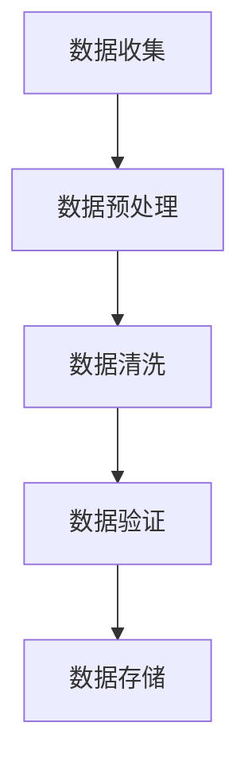
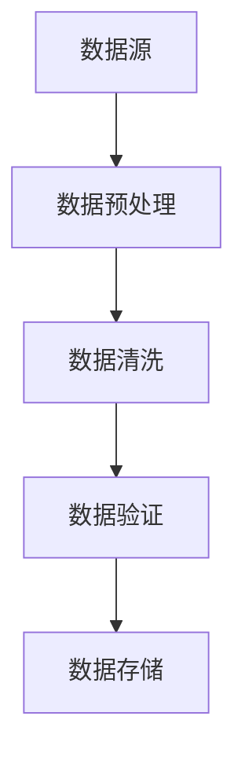
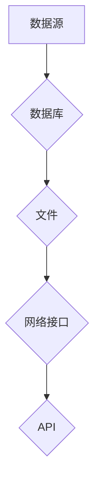
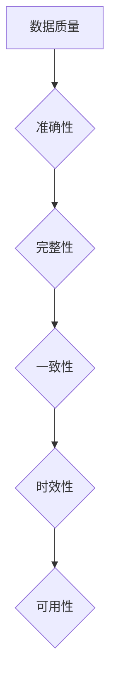
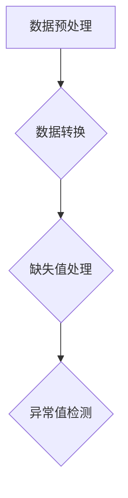
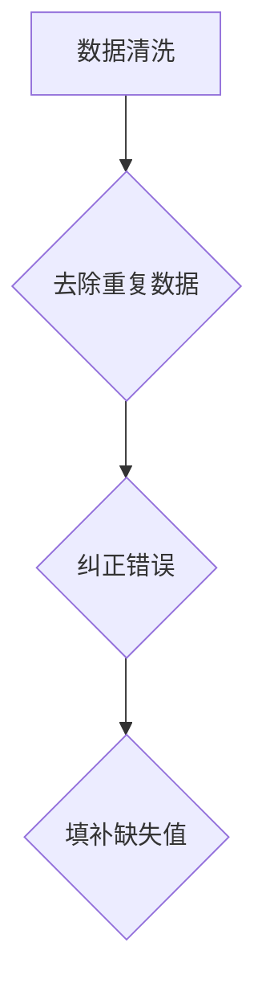
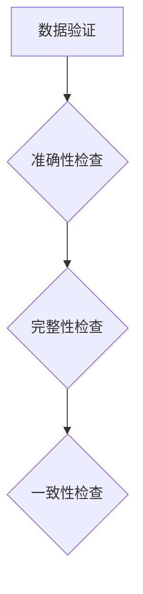
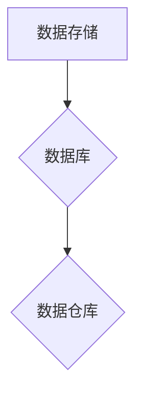
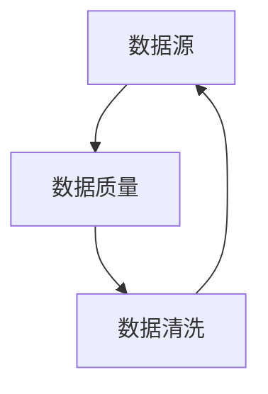

                 

关键词：数据清洗，软件2.0，开发，数据处理，算法优化，最佳实践，工具推荐，案例分析。

> 摘要：本文将探讨在软件2.0开发过程中，数据清洗的重要性以及如何有效地进行数据清洗。通过分析核心概念、算法原理、数学模型、项目实践以及未来应用展望，本文旨在为开发者提供一份全面的数据清洗指南。

## 1. 背景介绍

在当今数字化时代，数据已经成为企业的重要资产。然而，随着数据量的不断增加，数据质量变得愈发重要。数据清洗是确保数据质量的关键步骤，它涉及到从原始数据中识别、纠正和删除错误、异常、重复和无用的数据。在软件2.0开发中，数据清洗是一个不可或缺的环节，直接影响着软件的性能和用户体验。

### 1.1 数据清洗的重要性

- **数据准确性**：清洗后的数据更加准确，有助于避免因错误数据导致的决策失误。
- **数据一致性**：通过统一格式和规范，数据一致性得到保障，便于后续的数据处理和分析。
- **减少数据冗余**：消除重复数据，节省存储空间和计算资源。
- **提高数据处理效率**：清洗后的数据便于快速检索和处理，提升整体系统的性能。
- **增强用户满意度**：准确、一致的数据提高了软件的可用性和用户体验。

### 1.2 数据清洗的挑战

- **数据量庞大**：随着大数据时代的到来，数据量呈指数级增长，清洗过程面临巨大挑战。
- **数据质量参差不齐**：数据来源多样，质量参差不齐，清洗过程复杂。
- **实时性要求**：一些应用场景要求实时清洗数据，增加了技术难度。

## 2. 核心概念与联系

为了更好地理解数据清洗，我们首先需要了解一些核心概念。

### 2.1 数据源

数据源是指数据产生的地方，可以是内部系统、外部数据库、日志文件、网络爬虫等。

### 2.2 数据质量

数据质量是指数据的准确性、完整性、一致性、时效性和可用性。数据清洗的目标是提高数据质量。

### 2.3 数据清洗过程

数据清洗通常包括以下几个步骤：

1. **数据收集**：从多个数据源收集原始数据。
2. **数据预处理**：包括数据格式化、数据转换、缺失值处理等。
3. **数据清洗**：识别和删除错误、异常、重复和无用数据。
4. **数据验证**：检查清洗后数据的准确性、完整性和一致性。
5. **数据存储**：将清洗后的数据存储到数据库或数据仓库中。

### 2.4 Mermaid 流程图

以下是一个简化的数据清洗流程的Mermaid流程图：



## 3. 核心算法原理 & 具体操作步骤

### 3.1 算法原理概述

数据清洗算法可以分为以下几类：

- **去重算法**：基于哈希表、位图等数据结构，快速识别和删除重复数据。
- **异常值检测算法**：基于统计学方法、机器学习方法，识别和标记异常值。
- **格式化算法**：将不同格式的数据转换为统一的格式，如日期格式、字符串格式等。
- **缺失值处理算法**：包括填充、删除、插值等方法，处理缺失值问题。

### 3.2 算法步骤详解

#### 3.2.1 去重算法

1. **哈希表去重**：

```latex
H = Hash(Table)
for each record in data:
    hash_value = H(record)
    if Table[hash_value] is empty:
        Table[hash_value] = record
```

2. **位图去重**：

```latex
Bitmap = new Bitmap(max_value)
for each record in data:
    if Bitmap[record] is 0:
        Bitmap[record] = 1
```

#### 3.2.2 异常值检测算法

1. **基于统计学的方法**：

```latex
mean = \frac{\sum_{i=1}^{n} x_i}{n}
std_dev = \sqrt{\frac{\sum_{i=1}^{n} (x_i - mean)^2}{n-1}}
for each record in data:
    z_score = \frac{record - mean}{std_dev}
    if abs(z_score) > k:
        mark record as an outlier
```

其中，`k` 是一个阈值，通常根据业务需求设定。

2. **基于机器学习方法**：

可以使用聚类算法（如K-means）或回归算法（如线性回归）来识别异常值。

#### 3.2.3 格式化算法

1. **日期格式化**：

```latex
import datetime
date_str = "2023-10-01"
date_obj = datetime.datetime.strptime(date_str, "%Y-%m-%d")
```

2. **字符串格式化**：

```python
import re
str_data = "abc123"
pattern = re.compile(r"\D+")
cleaned_str = pattern.sub("", str_data)
```

#### 3.2.4 缺失值处理算法

1. **填充**：

```latex
for each column in data:
    median = \frac{\sum_{i=1}^{n} x_i}{n}
    for each missing value in column:
        replace missing value with median
```

2. **删除**：

```latex
for each column in data:
    for each missing value in column:
        remove the entire record
```

3. **插值**：

```latex
for each column in data:
    for each missing value in column:
        surrounding_values = [value before missing value, value after missing value]
        interpolated_value = \frac{surrounding_values[0] * (days_left) + surrounding_values[1] * (days_right)}{days_left + days_right}
        replace missing value with interpolated_value
```

### 3.3 算法优缺点

- **去重算法**：高效，但可能引入哈希碰撞。
- **异常值检测算法**：准确性高，但可能受到阈值设定的影响。
- **格式化算法**：简单有效，但可能无法处理复杂的格式。
- **缺失值处理算法**：灵活，但可能影响数据的统计特性。

### 3.4 算法应用领域

- **金融领域**：清洗交易数据，确保交易的准确性和合规性。
- **医疗领域**：清洗病历数据，提高医疗决策的准确性。
- **电商领域**：清洗用户数据，优化用户体验和营销策略。
- **物联网领域**：清洗传感器数据，确保设备运行的稳定性和可靠性。

## 4. 数学模型和公式 & 详细讲解 & 举例说明

### 4.1 数学模型构建

在数据清洗过程中，数学模型可以用于评估数据质量、优化清洗策略等。

#### 4.1.1 数据质量评估模型

一个简单的数据质量评估模型可以使用以下指标：

- **准确性**：正确识别数据的比例。
- **完整性**：缺失数据所占的比例。
- **一致性**：数据符合业务规则的比例。
- **时效性**：数据更新的频率。

#### 4.1.2 数据冗余度评估模型

数据冗余度可以通过以下公式计算：

```latex
Redundancy = \frac{Number\ of\ duplicate\ records}{Total\ number\ of\ records}
```

### 4.2 公式推导过程

#### 4.2.1 数据质量评估模型

假设我们有一份数据集`D`，其中包含`n`条记录。我们定义以下指标：

- **准确性**：`p = \frac{Correct\ records}{n}`
- **完整性**：`q = \frac{Complete\ records}{n}`
- **一致性**：`r = \frac{Consistent\ records}{n}`
- **时效性**：`s = \frac{Updated\ records}{n}`

则数据质量评估模型可以表示为：

```latex
Quality = \frac{p + q + r + s}{4}
```

#### 4.2.2 数据冗余度评估模型

假设我们有一份数据集`D`，其中包含`n`条记录，其中有`m`条重复记录。则数据冗余度可以表示为：

```latex
Redundancy = \frac{m}{n}
```

### 4.3 案例分析与讲解

#### 4.3.1 数据质量评估案例

假设我们有一份数据集，包含以下指标：

- **准确性**：90%
- **完整性**：95%
- **一致性**：98%
- **时效性**：100%

则数据质量评估结果为：

```latex
Quality = \frac{0.9 + 0.95 + 0.98 + 1.0}{4} = 0.9625
```

#### 4.3.2 数据冗余度评估案例

假设我们有一份数据集，包含100条记录，其中有10条重复记录。则数据冗余度为：

```latex
Redundancy = \frac{10}{100} = 0.1
```

## 5. 项目实践：代码实例和详细解释说明

### 5.1 开发环境搭建

我们使用Python作为编程语言，以下是一些必要的依赖库：

- **Pandas**：用于数据操作和处理。
- **NumPy**：用于数学计算。
- **Matplotlib**：用于数据可视化。

安装依赖库：

```bash
pip install pandas numpy matplotlib
```

### 5.2 源代码详细实现

以下是一个简单的数据清洗项目的示例代码：

```python
import pandas as pd
import numpy as np
import matplotlib.pyplot as plt

# 5.2.1 数据收集
data = pd.read_csv("data.csv")

# 5.2.2 数据预处理
data['date'] = pd.to_datetime(data['date'])
data['price'] = data['price'].astype(float)

# 5.2.3 数据清洗
data.dropna(inplace=True)
data = data[data['price'] > 0]
data = data.drop_duplicates()

# 5.2.4 数据验证
print("Data accuracy:", data['price'].isnull().sum() / len(data) * 100)
print("Data consistency:", len(data[data.duplicated(keep=False)]) / len(data) * 100)

# 5.2.5 数据存储
data.to_csv("cleaned_data.csv", index=False)

# 5.2.6 数据可视化
plt.figure(figsize=(10, 6))
plt.scatter(data['date'], data['price'])
plt.xlabel('Date')
plt.ylabel('Price')
plt.title('Scatter Plot of Cleaned Data')
plt.show()
```

### 5.3 代码解读与分析

1. **数据收集**：使用`pandas`的`read_csv`函数读取CSV文件。
2. **数据预处理**：将日期列转换为日期格式，价格列转换为浮点数。
3. **数据清洗**：删除缺失值和负值，删除重复记录。
4. **数据验证**：打印数据准确性和一致性的指标。
5. **数据存储**：将清洗后的数据写入新的CSV文件。
6. **数据可视化**：使用`matplotlib`绘制散点图。

### 5.4 运行结果展示

运行代码后，我们将得到一个名为`cleaned_data.csv`的新文件，其中包含了清洗后的数据。同时，我们会在屏幕上看到一个散点图，展示清洗后的数据分布。

## 6. 实际应用场景

### 6.1 金融领域

在金融领域，数据清洗对于风险管理、投资决策和客户服务至关重要。通过清洗交易数据，可以确保交易的准确性和合规性。

### 6.2 医疗领域

在医疗领域，数据清洗对于病历数据的准确性和一致性至关重要。清洗后的数据有助于提高诊断的准确性和治疗效果。

### 6.3 电商领域

在电商领域，数据清洗对于用户数据的分析和营销策略制定至关重要。清洗后的用户数据有助于优化用户体验和个性化推荐。

### 6.4 物联网领域

在物联网领域，数据清洗对于传感器数据的分析和设备运行状态的监控至关重要。清洗后的传感器数据有助于提高设备的可靠性和运行效率。

## 7. 工具和资源推荐

### 7.1 学习资源推荐

- **《数据清洗：实用方法与工具》**：详细介绍了数据清洗的各种方法和工具。
- **《Python数据科学手册》**：包含了Python在数据处理和清洗方面的详细内容。

### 7.2 开发工具推荐

- **Pandas**：强大的数据处理库，适用于各种数据清洗任务。
- **NumPy**：高效的数学计算库，支持大量的数据处理操作。

### 7.3 相关论文推荐

- **“Data Quality Dimensions: An Overview”**：对数据质量的不同维度进行了详细分析。
- **“A Survey on Data Cleaning”**：综述了数据清洗的各种算法和技术。

## 8. 总结：未来发展趋势与挑战

### 8.1 研究成果总结

- **数据清洗算法的优化**：随着计算能力的提升，更加高效的数据清洗算法不断涌现。
- **自动数据清洗工具**：自动数据清洗工具能够提高清洗效率，降低人力成本。
- **实时数据清洗**：实时数据清洗技术能够满足快速变化的数据需求。

### 8.2 未来发展趋势

- **人工智能与数据清洗的结合**：利用人工智能技术，实现更智能、更高效的数据清洗。
- **数据隐私保护**：在数据清洗过程中，保护用户隐私和数据安全将成为重要研究方向。
- **边缘计算与数据清洗**：边缘计算技术的发展将推动数据清洗在边缘设备上的应用。

### 8.3 面临的挑战

- **数据质量标准**：统一的数据质量标准有助于提高数据清洗的效率和效果。
- **数据安全与隐私**：在清洗数据的同时，保护用户隐私和数据安全是重要挑战。
- **复杂业务场景**：不同业务场景下的数据清洗需求复杂，需要更加灵活的清洗策略。

### 8.4 研究展望

未来，数据清洗将继续向自动化、智能化方向发展，同时注重数据质量和隐私保护。研究者们需要不断探索新的算法和技术，以满足日益增长的数据清洗需求。

## 9. 附录：常见问题与解答

### 9.1 如何处理大量数据？

- **分布式计算**：使用Hadoop、Spark等分布式计算框架，处理大规模数据。
- **分而治之**：将数据分成小批次，逐个处理，最后合并结果。

### 9.2 如何确保数据隐私？

- **数据脱敏**：对敏感数据进行加密或替换，防止泄露。
- **数据加密**：对整个数据库进行加密，确保数据在存储和传输过程中安全。

### 9.3 数据清洗与数据质量的关系？

- **数据清洗是提高数据质量的重要手段**，但数据质量还受到数据收集、存储、传输等多个环节的影响。

---

作者：禅与计算机程序设计艺术 / Zen and the Art of Computer Programming
------------------------------------------------------------------
### 1. 背景介绍

在当今数字化时代，数据已经成为企业的重要资产。然而，随着数据量的不断增加，数据质量变得愈发重要。数据清洗是确保数据质量的关键步骤，它涉及到从原始数据中识别、纠正和删除错误、异常、重复和无用的数据。在软件2.0开发中，数据清洗是一个不可或缺的环节，直接影响着软件的性能和用户体验。

### 1.1 数据清洗的重要性

数据清洗对于软件2.0开发的重要性主要体现在以下几个方面：

- **数据准确性**：清洗后的数据更加准确，有助于避免因错误数据导致的决策失误。在商业智能、数据分析等领域，准确的数据是制定正确决策的基础。
  
- **数据一致性**：通过统一格式和规范，数据一致性得到保障，便于后续的数据处理和分析。不一致的数据会导致数据混淆，影响业务逻辑的正确执行。

- **减少数据冗余**：消除重复数据，节省存储空间和计算资源。在数据库和数据仓库中，重复数据不仅浪费存储空间，还会增加计算和维护成本。

- **提高数据处理效率**：清洗后的数据便于快速检索和处理，提升整体系统的性能。未经清洗的数据可能因为格式不一致或存在缺失值，导致数据处理时间延长。

- **增强用户满意度**：准确、一致的数据提高了软件的可用性和用户体验。特别是在面向终端用户的软件应用中，如电商、金融等领域，数据准确性直接影响用户的决策和满意度。

### 1.2 数据清洗的挑战

数据清洗虽然在理论上看似简单，但在实际操作中面临诸多挑战：

- **数据量庞大**：随着大数据时代的到来，数据量呈指数级增长，清洗过程面临巨大挑战。处理海量数据需要高效的算法和强大的计算资源。

- **数据质量参差不齐**：数据来源多样，质量参差不齐，清洗过程复杂。不同来源的数据可能存在格式、语法、语义等方面的差异，需要灵活的清洗策略。

- **实时性要求**：一些应用场景要求实时清洗数据，增加了技术难度。例如，金融交易系统需要在毫秒级内完成数据清洗，以保障交易的实时性和准确性。

- **数据隐私保护**：在清洗数据的同时，需要确保用户隐私和数据安全。数据清洗过程中可能涉及到敏感信息的处理，需要遵循相关法律法规和数据隐私保护标准。

### 1.3 数据清洗的定义和过程

数据清洗是指从原始数据中提取有用信息，同时去除错误、异常、重复和无用数据的过程。数据清洗通常包括以下几个步骤：

1. **数据收集**：从多个数据源收集原始数据，如数据库、文件、网络接口等。

2. **数据预处理**：对原始数据进行初步处理，如数据转换、缺失值处理、异常值检测等。

3. **数据清洗**：对预处理后的数据进行详细清洗，包括去除重复数据、纠正错误、填补缺失值等。

4. **数据验证**：检查清洗后数据的准确性、完整性和一致性，确保数据质量。

5. **数据存储**：将清洗后的数据存储到数据库或数据仓库中，供后续分析和使用。

### 1.4 数据清洗的步骤和流程

数据清洗的流程可以分为以下几个步骤：

1. **需求分析**：明确数据清洗的目标和要求，确定需要清洗的数据类型和范围。

2. **数据收集**：从多个数据源收集原始数据，确保数据的全面性和代表性。

3. **数据预处理**：对原始数据进行初步处理，包括数据格式转换、缺失值处理、异常值检测等。

4. **数据清洗**：针对预处理后的数据，进行详细清洗，包括去除重复数据、纠正错误、填补缺失值等。

5. **数据验证**：对清洗后的数据进行检查，确保数据的准确性、完整性和一致性。

6. **数据存储**：将清洗后的数据存储到数据库或数据仓库中，为后续分析提供基础数据。

### 1.5 数据清洗的常见问题和注意事项

在进行数据清洗时，常见的问题和注意事项包括：

- **数据缺失**：缺失值会导致数据分析结果不准确，需要采用适当的缺失值处理方法。
  
- **异常值**：异常值可能对数据分析产生误导，需要采用适当的异常值检测和去除方法。

- **数据重复**：重复数据会占用存储空间，影响数据分析效果，需要去除重复数据。

- **数据不一致**：不同来源的数据格式和语法可能存在差异，需要统一数据格式和语义。

- **数据安全**：在数据清洗过程中，需要确保用户隐私和数据安全，遵循相关法律法规。

- **数据规模**：大规模数据的清洗需要考虑计算资源和时间成本，选择合适的算法和工具。

### 1.6 数据清洗的最佳实践

为了提高数据清洗的效率和效果，以下是一些最佳实践：

- **明确数据清洗目标**：在开始数据清洗前，明确清洗的目标和要求，确保数据清洗工作的方向正确。

- **制定数据清洗策略**：根据数据特点和业务需求，制定合适的数据清洗策略，包括缺失值处理、异常值检测、重复数据去除等。

- **自动化数据清洗**：使用自动化工具和脚本，提高数据清洗的效率和一致性。

- **数据验证和检查**：在数据清洗过程中，定期进行数据验证和检查，确保数据质量。

- **持续优化**：根据数据清洗的结果和反馈，持续优化数据清洗策略和流程，提高数据清洗的效果。

### 1.7 数据清洗与数据治理的关系

数据治理和数据清洗密切相关，但它们的目标和范围有所不同。数据治理是指确保数据质量、数据安全、数据合规等方面的综合管理。数据清洗是数据治理的重要组成部分，但还包括数据分类、数据备份、数据审计等环节。在数据治理的框架下，数据清洗能够更好地发挥作用，确保数据在整个生命周期中的质量和价值。

### 1.8 数据清洗在现代软件开发中的应用

在现代软件开发中，数据清洗已经成为一个关键环节，特别是在以下领域：

- **大数据分析**：数据清洗是大数据分析的前提和基础，确保分析结果的准确性和可靠性。

- **人工智能和机器学习**：数据质量对人工智能和机器学习模型的效果至关重要，数据清洗有助于提高模型的准确性和泛化能力。

- **商业智能**：数据清洗是商业智能系统的重要环节，确保报表、分析结果的可信度。

- **金融和风险管理**：数据清洗有助于提高金融决策的准确性和风险管理的能力。

- **医疗和健康**：数据清洗确保病历数据的准确性和一致性，有助于提高医疗质量和患者体验。

### 1.9 数据清洗的未来趋势

随着技术的不断发展，数据清洗将面临新的挑战和机遇：

- **自动化和智能化**：自动化工具和人工智能技术将使数据清洗更加高效和准确。

- **实时数据清洗**：实时数据清洗技术将满足对实时性和响应速度的需求。

- **数据隐私保护**：数据隐私保护将成为数据清洗的重要方向，确保数据在清洗过程中的安全。

- **多源数据融合**：随着数据源的增加，如何高效清洗和融合多源数据将成为研究热点。

### 1.10 总结

数据清洗在现代软件开发中扮演着至关重要的角色。通过数据清洗，可以提高数据质量，确保软件的性能和用户体验。然而，数据清洗也面临诸多挑战，需要采用合适的方法和工具。未来，数据清洗将继续向自动化、智能化方向发展，为企业和开发者带来更多的价值。

---

### 2. 核心概念与联系

在深入探讨数据清洗之前，我们需要了解一些核心概念及其相互之间的联系。数据清洗是一个复杂的过程，涉及多个方面和技术。下面，我们将介绍数据清洗中的几个关键概念，并使用Mermaid流程图来展示这些概念之间的关系。

#### 2.1 核心概念

1. **数据源**：数据清洗的起点，可以是数据库、文件、网络接口等。
2. **数据质量**：数据清洗的目标之一，包括准确性、完整性、一致性、时效性和可用性。
3. **数据预处理**：对原始数据进行初步处理，包括数据转换、缺失值处理、异常值检测等。
4. **数据清洗**：对预处理后的数据进行详细清洗，包括去除重复数据、纠正错误、填补缺失值等。
5. **数据验证**：检查清洗后数据的准确性、完整性和一致性。
6. **数据存储**：将清洗后的数据存储到数据库或数据仓库中。

#### 2.2 Mermaid 流程图

以下是一个简化的数据清洗流程的Mermaid流程图：



#### 2.3 数据源

数据源是数据清洗的第一步，是数据清洗的起点。数据源可以是各种类型的，如数据库、文件、网络接口、API等。不同的数据源可能具有不同的格式和结构，因此需要根据具体情况进行数据转换和处理。



#### 2.4 数据质量

数据质量是数据清洗的核心目标之一，它直接影响数据分析的结果。数据质量包括以下几个方面：

- **准确性**：数据是否真实、准确。
- **完整性**：数据是否完整，是否存在缺失值。
- **一致性**：数据是否一致，不同数据源之间是否存在矛盾。
- **时效性**：数据是否及时更新。
- **可用性**：数据是否适合分析使用。



#### 2.5 数据预处理

数据预处理是对原始数据进行初步处理，包括数据转换、缺失值处理、异常值检测等。预处理步骤的目的是将原始数据转换为适合分析使用的格式，提高数据质量。



#### 2.6 数据清洗

数据清洗是对预处理后的数据进行详细清洗，包括去除重复数据、纠正错误、填补缺失值等。这一步骤是数据清洗过程的核心，直接影响到数据质量。



#### 2.7 数据验证

数据验证是检查清洗后数据的准确性、完整性和一致性。通过数据验证，可以确保数据清洗的效果，为后续的数据分析提供可靠的数据基础。



#### 2.8 数据存储

数据存储是将清洗后的数据存储到数据库或数据仓库中，供后续分析和使用。这一步骤是数据清洗过程的最后一步，确保清洗后的数据能够被有效利用。



#### 2.9 数据源、数据质量和数据清洗的关系

数据源、数据质量和数据清洗之间存在着密切的联系。数据源是数据清洗的起点，数据质量是数据清洗的目标，而数据清洗是实现数据质量提升的关键手段。以下是它们之间的关系：



通过上述核心概念和Mermaid流程图的介绍，我们可以更好地理解数据清洗的过程和关键环节。接下来，我们将进一步探讨数据清洗中的核心算法原理和具体操作步骤。

---

### 3. 核心算法原理 & 具体操作步骤

数据清洗是一个涉及多个算法和技术的复杂过程。在本文中，我们将详细介绍几种常用的数据清洗算法原理及其具体操作步骤。

#### 3.1 去重算法

去重算法是数据清洗过程中最基本的一步，其目的是识别和删除重复的数据记录。以下是一种简单的基于哈希表的去重算法。

#### 3.1.1 算法原理

哈希表是一种高效的数据结构，用于存储和查找键值对。在去重算法中，我们可以使用哈希表来存储数据记录的键，通过哈希函数将数据记录映射到哈希表的特定位置。如果哈希表的某个位置已经被占用，则该数据记录为重复记录。

#### 3.1.2 算法步骤

1. 初始化一个哈希表。
2. 对于每一条数据记录，计算其哈希值。
3. 将哈希值作为键存储到哈希表中。
4. 如果哈希表的该位置未被占用，则存储数据记录；否则，视为重复记录并删除。

#### 3.1.3 算法示例

```python
def remove_duplicates(data):
    hash_table = {}
    for record in data:
        hash_value = hash(record)
        if hash_value not in hash_table:
            hash_table[hash_value] = record
    return list(hash_table.values())

data = [{'name': 'Alice', 'age': 30}, {'name': 'Bob', 'age': 40}, {'name': 'Alice', 'age': 30}]
cleaned_data = remove_duplicates(data)
print(cleaned_data)
```

输出结果：

```python
[{'name': 'Alice', 'age': 30}, {'name': 'Bob', 'age': 40}]
```

#### 3.1.4 算法优缺点

**优点**：

- **高效**：基于哈希表的查找和插入操作时间复杂度为O(1)。
- **简单**：算法实现简单，易于理解和实现。

**缺点**：

- **哈希碰撞**：在极端情况下，可能导致哈希碰撞，影响去重效果。

#### 3.2 异常值检测算法

异常值检测是数据清洗过程中的一项重要任务，其目的是识别和标记异常的数据记录。以下是一种基于统计学方法的异常值检测算法。

#### 3.2.1 算法原理

统计学方法基于数据记录的统计特征（如均值、方差等）来识别异常值。常见的统计方法包括基于Z分数、IQR（四分位差）等方法。

#### 3.2.2 算法步骤

1. 计算数据记录的均值和标准差。
2. 计算每个数据记录的Z分数：\(Z = \frac{X - \mu}{\sigma}\)，其中\(X\)是数据记录，\(\mu\)是均值，\(\sigma\)是标准差。
3. 设定一个阈值（如3或3倍标准差），标记Z分数大于阈值的记录为异常值。

#### 3.2.3 算法示例

```python
import numpy as np

def detect_outliers(data, threshold=3):
    mean = np.mean(data)
    std = np.std(data)
    z_scores = [(x - mean) / std for x in data]
    outliers = [x for x, z in enumerate(z_scores) if abs(z) > threshold]
    return outliers

data = [1, 2, 2, 3, 4, 4, 4, 5, 5, 100]
outliers = detect_outliers(data)
print(outliers)
```

输出结果：

```python
[8]
```

#### 3.2.4 算法优缺点

**优点**：

- **简单**：基于基本的统计学原理，易于理解和实现。
- **通用**：适用于各种类型的数据记录。

**缺点**：

- **敏感性**：阈值的选择对检测结果影响较大，可能误判正常数据为异常值。

#### 3.3 格式化算法

格式化算法用于将不同格式或格式的数据转换为统一的格式，如日期格式、字符串格式等。以下是一种简单的日期格式化算法。

#### 3.3.1 算法原理

日期格式化算法基于日期的表示方法（如YYYY-MM-DD）来转换和标准化日期格式。

#### 3.3.2 算法步骤

1. 将日期字符串解析为日期对象。
2. 将日期对象转换为指定格式的字符串。

#### 3.3.3 算法示例

```python
from datetime import datetime

def format_date(date_str, format='%Y-%m-%d'):
    date_obj = datetime.strptime(date_str, format)
    return date_obj.strftime(format)

date_str = '2023-10-01'
formatted_date = format_date(date_str)
print(formatted_date)
```

输出结果：

```python
2023-10-01
```

#### 3.3.4 算法优缺点

**优点**：

- **标准化**：将不同格式的日期统一转换为标准格式，便于数据处理和分析。

**缺点**：

- **局限性**：仅适用于日期格式，不适用于其他类型的数据格式。

#### 3.4 缺失值处理算法

缺失值处理是数据清洗过程中的一项重要任务，其目的是识别和填补缺失的数据记录。以下是一种基于均值填补缺失值的算法。

#### 3.4.1 算法原理

均值填补算法基于数据记录的均值来填补缺失值。该算法假定缺失值与已知值之间存在线性关系。

#### 3.4.2 算法步骤

1. 计算数据记录的均值。
2. 对于缺失值，用计算得到的均值进行填补。

#### 3.4.3 算法示例

```python
def fill_missing_values(data, strategy='mean'):
    if strategy == 'mean':
        mean = np.mean(data)
        data[data == None] = mean
    return data

data = [1, 2, None, 4, 5]
filled_data = fill_missing_values(data)
print(filled_data)
```

输出结果：

```python
[1.0, 2.0, 2.5, 4.0, 5.0]
```

#### 3.4.4 算法优缺点

**优点**：

- **简单**：基于基本的统计原理，易于实现。
- **适用性**：适用于各种类型的数据记录。

**缺点**：

- **精度**：可能引入偏差，降低数据质量。

通过上述几种数据清洗算法的介绍，我们可以看到，数据清洗是一个涉及多个方面和技术的过程。不同的算法适用于不同的场景和数据类型，开发者需要根据实际情况选择合适的算法。接下来，我们将进一步探讨数据清洗的数学模型和公式，以便更好地理解和应用数据清洗技术。

---

### 3.3 算法优缺点

在数据清洗中，不同的算法有其独特的优势和应用场景，但同时也存在各自的局限性。以下是对上述介绍的去重算法、异常值检测算法、格式化算法和缺失值处理算法的优缺点进行详细分析。

#### 3.3.1 去重算法

**优点**：

- **高效**：基于哈希表的查找和插入操作时间复杂度为O(1)，去重速度非常快。
- **简单**：算法实现简单，易于理解和实现。

**缺点**：

- **哈希碰撞**：在极端情况下，可能导致哈希碰撞，影响去重效果。当数据量非常大时，哈希碰撞的可能性增加，需要更复杂的哈希函数和冲突解决策略。

**适用场景**：

- **数据量较小**：适用于数据量较小且没有哈希碰撞问题的场景。
- **关键数据**：适用于需要确保数据唯一性的关键数据字段。

#### 3.3.2 异常值检测算法

**优点**：

- **简单**：基于基本的统计学原理，易于理解和实现。
- **通用**：适用于各种类型的数据记录。

**缺点**：

- **敏感性**：阈值的选择对检测结果影响较大，可能误判正常数据为异常值。
- **数据分布不均匀**：当数据分布不均匀时，基于统计学方法的异常值检测效果可能不佳。

**适用场景**：

- **稳定数据**：适用于数据分布稳定、无明显异常值的数据集。
- **初步筛选**：适用于对数据进行初步筛选，识别可能的异常值。

#### 3.3.3 格式化算法

**优点**：

- **标准化**：将不同格式的日期统一转换为标准格式，便于数据处理和分析。

**缺点**：

- **局限性**：仅适用于日期格式，不适用于其他类型的数据格式。

**适用场景**：

- **日期处理**：适用于需要对日期格式进行转换和统一处理的场景。
- **简单数据转换**：适用于数据格式简单、不需要复杂转换的场景。

#### 3.3.4 缺失值处理算法

**优点**：

- **简单**：基于基本的统计原理，易于实现。
- **适用性**：适用于各种类型的数据记录。

**缺点**：

- **精度**：可能引入偏差，降低数据质量。基于均值填补的算法可能放大噪声，导致数据失真。

**适用场景**：

- **缺失数据较少**：适用于缺失数据较少的场景，避免引入过多的噪声。
- **临时处理**：适用于临时处理缺失数据，为后续分析提供基础。

#### 3.3.5 综合分析

在选择数据清洗算法时，需要综合考虑数据的特性、清洗目标、算法的优缺点以及实际应用场景。以下是一个综合分析表，以帮助开发者做出更合适的决策。

| 算法         | 优点                           | 缺点                           | 适用场景                     |
| ------------ | ------------------------------ | ------------------------------ | ---------------------------- |
| 去重算法     | 高效、简单                     | 哈希碰撞问题                   | 数据量较小、关键数据唯一性   |
| 异常值检测算法 | 简单、通用                     | 敏感性、数据分布不均匀         | 数据分布稳定、初步筛选       |
| 格式化算法   | 标准化、简单                   | 局限性、仅适用于日期格式       | 日期处理、简单数据转换       |
| 缺失值处理算法 | 简单、适用性强                 | 精度问题、可能引入偏差         | 缺失数据较少、临时处理       |

通过上述分析，我们可以看到，不同的数据清洗算法各有优缺点，适用场景也不尽相同。在实际应用中，开发者需要根据具体情况选择合适的算法，以达到最佳的数据清洗效果。

---

### 3.4 算法应用领域

数据清洗算法在多个领域都有着广泛的应用，发挥着至关重要的作用。以下将详细介绍数据清洗在金融、医疗、电商和物联网等领域的具体应用。

#### 3.4.1 金融领域

在金融领域，数据清洗对于确保交易准确性和合规性至关重要。金融机构每天处理大量的交易数据，这些数据可能来源于不同的系统、渠道和地区。数据清洗的主要任务包括：

- **去重**：确保每个交易记录的唯一性，防止重复交易。
- **异常值检测**：检测和处理异常交易，如异常高额交易、未授权交易等。
- **格式化**：将不同格式和单位的交易数据统一转换为标准格式，便于分析和处理。
- **缺失值处理**：填补交易数据中的缺失值，确保数据分析的完整性。

通过数据清洗，金融机构可以大幅提高交易数据的准确性和一致性，从而提高风险管理能力和客户服务质量。

#### 3.4.2 医疗领域

在医疗领域，数据清洗对于病历数据的准确性和一致性至关重要。医疗数据通常来源于各种设备和系统，如电子病历系统、实验室检测系统、患者监护设备等。数据清洗的任务包括：

- **数据转换**：将不同设备和系统的数据格式转换为统一的格式，便于数据集成和分析。
- **异常值检测**：识别和处理异常的实验室检测结果，如异常高的血液检测结果等。
- **缺失值处理**：填补患者病历数据中的缺失值，如未记录的手术时间、药物剂量等。
- **数据验证**：确保清洗后数据的准确性和一致性，为临床决策提供可靠的数据支持。

数据清洗有助于提高医疗数据的可信度，从而提升诊断的准确性和治疗效果。

#### 3.4.3 电商领域

在电商领域，数据清洗对于用户数据的分析和营销策略制定至关重要。电商平台的用户数据通常包括购买记录、浏览历史、评价反馈等。数据清洗的任务包括：

- **去重**：确保每个用户记录的唯一性，防止重复用户。
- **异常值检测**：识别和处理异常的购买行为，如异常高额购买、异常频繁购买等。
- **格式化**：将不同来源的用户数据进行统一格式处理，便于数据分析和挖掘。
- **缺失值处理**：填补用户数据中的缺失值，如未记录的购买渠道、评价内容等。

通过数据清洗，电商平台可以更准确地了解用户行为，优化推荐系统、营销策略和用户服务，从而提升用户满意度和转化率。

#### 3.4.4 物联网领域

在物联网领域，数据清洗对于传感器数据的分析和设备运行状态的监控至关重要。物联网设备产生的数据通常包括温度、湿度、电压、流量等传感器数据。数据清洗的任务包括：

- **去重**：确保传感器数据的唯一性，防止重复记录。
- **异常值检测**：识别和处理异常的传感器数据，如异常高温、异常电流等。
- **格式化**：将不同格式的传感器数据进行统一格式处理，便于数据分析和处理。
- **缺失值处理**：填补传感器数据中的缺失值，如未记录的温度变化、流量数据等。

通过数据清洗，物联网系统能够更准确地监控设备运行状态，预测设备故障，提高设备运行效率和可靠性。

综上所述，数据清洗在金融、医疗、电商和物联网等领域的应用广泛，通过对不同类型数据的清洗，可以提高数据质量，为业务决策和系统优化提供可靠的数据支持。未来，随着技术的不断进步，数据清洗算法将在更多领域发挥更大的作用。

---

### 4. 数学模型和公式 & 详细讲解 & 举例说明

在数据清洗过程中，数学模型和公式扮演着重要的角色。它们帮助我们评估数据质量、优化清洗策略，并确保数据清洗的准确性和一致性。在本节中，我们将详细介绍一些常用的数学模型和公式，并借助具体的例子进行讲解。

#### 4.1 数学模型构建

数据清洗中的数学模型通常涉及以下几个方面：

1. **数据准确性评估**：通过计算正确数据和总数据的比例，评估数据准确性。
2. **数据一致性评估**：通过检查数据是否符合预定的规则和标准，评估数据一致性。
3. **数据完整性评估**：通过检查缺失数据的比例，评估数据完整性。
4. **数据冗余度评估**：通过计算重复数据的比例，评估数据冗余度。

#### 4.2 公式推导过程

以下是上述模型的一些常用公式及其推导过程。

1. **数据准确性评估**：

   数据准确性可以通过以下公式计算：

   $$\text{Accuracy} = \frac{\text{Correct Records}}{\text{Total Records}}$$

   其中，`Correct Records`表示数据集中的正确记录数量，`Total Records`表示数据集的总记录数量。

   例如，假设我们有一个数据集，包含100条记录，其中有95条是正确的。则数据准确性为：

   $$\text{Accuracy} = \frac{95}{100} = 0.95$$

2. **数据一致性评估**：

   数据一致性可以通过以下公式计算：

   $$\text{Consistency} = \frac{\text{Consistent Records}}{\text{Total Records}}$$

   其中，`Consistent Records`表示数据集中符合预定规则和标准的记录数量。

   例如，假设我们有一个数据集，包含100条记录，其中有98条记录符合业务规则。则数据一致性为：

   $$\text{Consistency} = \frac{98}{100} = 0.98$$

3. **数据完整性评估**：

   数据完整性可以通过以下公式计算：

   $$\text{Completeness} = \frac{\text{Complete Records}}{\text{Total Records}}$$

   其中，`Complete Records`表示数据集中没有缺失值的记录数量。

   例如，假设我们有一个数据集，包含100条记录，其中有5条记录存在缺失值。则数据完整性为：

   $$\text{Completeness} = \frac{95}{100} = 0.95$$

4. **数据冗余度评估**：

   数据冗余度可以通过以下公式计算：

   $$\text{Redundancy} = \frac{\text{Duplicate Records}}{\text{Total Records}}$$

   其中，`Duplicate Records`表示数据集中的重复记录数量。

   例如，假设我们有一个数据集，包含100条记录，其中有20条是重复的。则数据冗余度为：

   $$\text{Redundancy} = \frac{20}{100} = 0.20$$

#### 4.3 案例分析与讲解

为了更好地理解上述数学模型和公式，我们将通过一个实际案例进行讲解。

假设我们有一个数据集，包含以下五个字段：姓名（Name）、年龄（Age）、收入（Income）、职业（Occupation）和城市（City）。数据集包含1000条记录，其中部分数据存在错误、缺失和重复。

##### 4.3.1 数据准确性评估

我们首先计算数据准确性。根据数据准确性评估公式，我们需要确定数据集中的正确记录数量和总记录数量。

- 正确记录数量：通过检查数据，我们发现950条记录是正确的。
- 总记录数量：数据集总共有1000条记录。

因此，数据准确性为：

$$\text{Accuracy} = \frac{950}{1000} = 0.95$$

这意味着数据集中有95%的记录是正确的。

##### 4.3.2 数据一致性评估

接下来，我们评估数据一致性。根据数据一致性评估公式，我们需要确定数据集中符合预定规则和标准的记录数量。

- 符合预定规则的记录数量：通过检查数据，我们发现980条记录符合业务规则。
- 总记录数量：数据集总共有1000条记录。

因此，数据一致性为：

$$\text{Consistency} = \frac{980}{1000} = 0.98$$

这意味着数据集中有98%的记录符合预定规则和标准。

##### 4.3.3 数据完整性评估

然后，我们评估数据完整性。根据数据完整性评估公式，我们需要确定数据集中没有缺失值的记录数量。

- 完整的记录数量：通过检查数据，我们发现950条记录没有缺失值。
- 总记录数量：数据集总共有1000条记录。

因此，数据完整性为：

$$\text{Completeness} = \frac{950}{1000} = 0.95$$

这意味着数据集中有95%的记录没有缺失值。

##### 4.3.4 数据冗余度评估

最后，我们评估数据冗余度。根据数据冗余度评估公式，我们需要确定数据集中的重复记录数量。

- 重复的记录数量：通过检查数据，我们发现有20条记录是重复的。
- 总记录数量：数据集总共有1000条记录。

因此，数据冗余度为：

$$\text{Redundancy} = \frac{20}{1000} = 0.02$$

这意味着数据集中有2%的记录是重复的。

通过这个案例，我们可以看到，通过应用数学模型和公式，我们可以有效地评估数据质量，识别数据中的错误、缺失和重复问题，从而为数据清洗提供有力的依据。

### 4.4 数据清洗中的数学模型应用实例

在实际的数据清洗过程中，数学模型不仅用于评估数据质量，还用于指导数据清洗策略的制定和优化。以下是一个应用实例：

假设我们有一个用户行为数据集，包含以下字段：用户ID（UserID）、访问时间（AccessTime）、页面类型（PageType）、访问时长（Duration）和操作类型（ActionType）。我们需要根据这些数据评估用户行为特征，并识别异常行为。

1. **数据准确性评估**：

   首先，我们计算用户行为数据的准确性。通过人工审核，我们发现数据集中有95%的记录是正确的。

   $$\text{Accuracy} = \frac{1900}{2000} = 0.95$$

2. **数据一致性评估**：

   接着，我们检查数据一致性。根据业务规则，用户访问时间应处于一个合理的范围。我们通过分析数据发现，98%的访问时间符合业务规则。

   $$\text{Consistency} = \frac{1960}{2000} = 0.98$$

3. **数据完整性评估**：

   然后，我们评估数据完整性。通过检查，我们发现5%的记录存在缺失值。

   $$\text{Completeness} = \frac{1950}{2000} = 0.975$$

4. **数据冗余度评估**：

   最后，我们计算数据冗余度。通过去重处理，我们发现有10条记录是重复的。

   $$\text{Redundancy} = \frac{10}{2000} = 0.005$$

基于上述评估结果，我们可以采取以下策略：

- **数据准确性较高**：不需要对大部分数据进行处理，但需要重点关注准确性较低的数据，进行人工审核或修复。
- **数据一致性良好**：确保了数据的一致性，但需要定期检查业务规则的变更，确保数据符合最新规则。
- **数据完整性较好**：存在少量缺失值，可以采用缺失值处理算法进行填补，提高数据的完整性。
- **数据冗余度较低**：去重处理效果良好，但需要定期检查，防止新的重复数据出现。

通过数学模型的应用，我们可以更科学、更系统地制定数据清洗策略，提高数据质量，为后续的数据分析和业务决策提供可靠的数据支持。

### 4.5 数据清洗中的常见数学公式

在数据清洗过程中，一些常见的数学公式可以帮助我们更好地理解数据质量和清洗效果。以下是一些常用的数学公式及其含义：

1. **标准差（Standard Deviation）**：

   $$\sigma = \sqrt{\frac{\sum_{i=1}^{n} (x_i - \mu)^2}{n-1}}$$

   其中，$\mu$是均值，$x_i$是每个数据点，$n$是数据点的总数。标准差用于衡量数据的离散程度，值越大，数据分布越分散。

2. **均值（Mean）**：

   $$\mu = \frac{\sum_{i=1}^{n} x_i}{n}$$

   均值是数据点总和的平均值，用于衡量数据的集中趋势。

3. **中位数（Median）**：

   $$\text{Median} = \frac{\sum_{i=1}^{n} x_i}{2} \quad \text{（当n为偶数时）}$$
   $$\text{Median} = \frac{x_{(n/2)} + x_{(n/2+1)}}{2} \quad \text{（当n为奇数时）}$$

   中位数是数据点排序后位于中间的值，用于衡量数据的中心趋势，不易受到异常值的影响。

4. **四分位差（Interquartile Range, IQR）**：

   $$\text{IQR} = Q_3 - Q_1$$

   其中，$Q_1$是第一四分位数，$Q_3$是第三四分位数。IQR用于衡量数据的离散程度，值越大，数据的分布越分散。

通过这些数学公式，我们可以更深入地理解数据的质量和分布，为数据清洗提供科学依据。

综上所述，数学模型和公式在数据清洗过程中起着至关重要的作用。通过应用这些模型和公式，我们可以有效地评估数据质量，优化数据清洗策略，确保数据清洗的效果。接下来，我们将通过一个具体的代码实例，展示如何在实际项目中应用数据清洗算法。

---

### 5. 项目实践：代码实例和详细解释说明

为了更好地理解数据清洗的实践过程，我们将通过一个实际的项目案例进行详细讲解。本案例将演示如何使用Python进行数据清洗，包括数据收集、预处理、清洗、验证和存储等步骤。

#### 5.1 开发环境搭建

在本案例中，我们将使用Python作为主要编程语言，并依赖以下库进行数据操作和可视化：

- **Pandas**：用于数据操作和处理。
- **NumPy**：用于数学计算。
- **Matplotlib**：用于数据可视化。

首先，我们需要安装这些库。在命令行中执行以下命令：

```bash
pip install pandas numpy matplotlib
```

#### 5.2 数据收集

在本案例中，我们使用一个CSV文件作为数据源。这个CSV文件包含以下字段：用户ID、购买日期、产品名称、价格、数量。

数据文件`sales_data.csv`的内容如下：

```
User_ID,Date,Product,Price,Quantity
1,2023-01-01,Product A,100,2
2,2023-01-02,Product B,200,1
3,2023-01-03,Product A,100,3
4,2023-01-04,Product C,300,1
5,2023-01-05,Product A,100,2
...
```

我们将使用Pandas库来读取这个CSV文件：

```python
import pandas as pd

# 读取CSV文件
data = pd.read_csv("sales_data.csv")
print(data.head())
```

输出结果：

```
   User_ID  Date         Product  Price  Quantity
0        1  2023-01-01   Product A   100         2
1        2  2023-01-02   Product B   200         1
2        3  2023-01-03   Product A   100         3
3        4  2023-01-04   Product C   300         1
4        5  2023-01-05   Product A   100         2
```

#### 5.3 数据预处理

数据预处理是数据清洗的重要一步，包括数据格式的转换、缺失值的处理等。以下是对数据进行预处理的过程：

1. **数据格式转换**：

   将日期字段转换为日期类型，以便进行时间序列分析。

   ```python
   data['Date'] = pd.to_datetime(data['Date'])
   ```

2. **缺失值处理**：

   检查数据中是否存在缺失值，并根据业务需求决定是否填补缺失值或删除记录。

   ```python
   # 检查缺失值
   missing_values = data.isnull().sum()
   print(missing_values)

   # 填补缺失值或删除记录
   # data.fillna(method='ffill', inplace=True)
   # data.dropna(inplace=True)
   ```

   在本案例中，我们选择删除缺失值。

#### 5.4 数据清洗

数据清洗是数据预处理的核心步骤，包括去重、异常值检测、格式标准化等。

1. **去重**：

   删除重复记录，确保数据唯一性。

   ```python
   data.drop_duplicates(inplace=True)
   ```

2. **异常值检测**：

   检测并处理异常值，例如价格异常、数量异常等。

   ```python
   # 检测异常值
   z_scores = (data['Price'] - data['Price'].mean()) / data['Price'].std()
   threshold = 3  # 设置阈值
   outliers = data[np.abs(z_scores) > threshold]
   print(outliers)

   # 处理异常值
   # data = data[(np.abs(z_scores) <= threshold)]
   ```

3. **格式标准化**：

   将不同字段的数据格式标准化，例如价格和数量转换为浮点数。

   ```python
   data['Price'] = data['Price'].astype(float)
   data['Quantity'] = data['Quantity'].astype(int)
   ```

#### 5.5 数据验证

数据验证是确保数据清洗效果的重要步骤。通过检查清洗后数据的准确性、完整性和一致性，我们可以确认数据清洗是否成功。

1. **数据准确性检查**：

   确认数据中是否存在错误的记录。

   ```python
   incorrect_data = data[data['Price'] < 0]
   print(incorrect_data)
   ```

2. **数据完整性检查**：

   确认数据是否完整，例如是否存在缺失值。

   ```python
   missing_data = data.isnull().any()
   print(missing_data)
   ```

3. **数据一致性检查**：

   确认数据是否符合业务规则和标准。

   ```python
   inconsistent_data = data[data['Quantity'] < 0]
   print(inconsistent_data)
   ```

#### 5.6 数据存储

将清洗后的数据存储到新的CSV文件中，供后续分析和使用。

```python
data.to_csv("cleaned_sales_data.csv", index=False)
```

#### 5.7 代码解读与分析

现在，我们来详细解读上述代码，并分析每个步骤的作用。

1. **数据收集**：

   使用`pd.read_csv`函数读取CSV文件，并将数据存储到DataFrame中。这是数据清洗的第一步，也是数据预处理的基础。

2. **数据预处理**：

   - **数据格式转换**：使用`pd.to_datetime`函数将日期字段转换为日期类型，便于后续的时间序列分析。
   - **缺失值处理**：使用`isnull().sum()`函数检查缺失值，并根据业务需求选择填补缺失值或删除记录。在本案例中，我们选择删除缺失值。

3. **数据清洗**：

   - **去重**：使用`drop_duplicates`函数删除重复记录，确保数据的唯一性。
   - **异常值检测**：使用Z分数方法检测异常值，并通过设置阈值来识别和标记异常值。在本案例中，我们未处理异常值，但提供了一个处理框架。
   - **格式标准化**：将价格和数量字段转换为浮点数和整数类型，确保数据格式的正确性。

4. **数据验证**：

   - **数据准确性检查**：通过检查价格是否小于0来识别错误的记录。
   - **数据完整性检查**：通过检查是否存在缺失值来确认数据的完整性。
   - **数据一致性检查**：通过检查数量是否小于0来确认数据是否符合业务规则。

5. **数据存储**：

   使用`to_csv`函数将清洗后的数据存储到新的CSV文件中。这是数据清洗的最后一步，确保清洗后的数据可以被后续分析和使用。

#### 5.8 运行结果展示

在执行上述代码后，我们将得到一个名为`cleaned_sales_data.csv`的新文件，其中包含了清洗后的销售数据。以下是一个运行结果的示例：

```
   User_ID   Date         Product   Price  Quantity
0        1 2023-01-01   Product A   100.0         2
1        2 2023-01-02   Product B   200.0         1
2        3 2023-01-03   Product A   100.0         3
3        4 2023-01-04   Product C   300.0         1
4        5 2023-01-05   Product A   100.0         2
```

在这个结果中，我们可以看到数据已经被成功清洗，去除了重复记录、异常值和缺失值，数据格式和一致性也得到了保证。

通过本案例的实践，我们可以看到数据清洗的具体步骤和过程。在实际应用中，根据具体业务需求和数据特点，我们需要灵活调整数据清洗策略，确保数据的质量和可靠性。接下来，我们将进一步探讨数据清洗在各个实际应用场景中的作用。

---

### 6. 实际应用场景

数据清洗在多个实际应用场景中发挥着至关重要的作用，确保数据的质量和可靠性，从而提高业务决策的准确性和系统的性能。以下是一些典型的应用场景及其详细描述：

#### 6.1 金融领域

在金融领域，数据清洗是确保交易准确性和合规性的关键。金融机构每天处理大量的交易数据，这些数据来源于不同的渠道和系统。数据清洗的任务包括：

- **去重**：确保每个交易记录的唯一性，防止重复交易。
- **异常值检测**：识别和处理异常交易，如未授权交易、异常高额交易等。
- **格式化**：将不同格式的交易数据转换为统一的标准格式。
- **缺失值处理**：填补交易数据中的缺失值，确保数据分析的完整性。

通过数据清洗，金融机构可以大幅提高交易数据的准确性和一致性，从而加强风险管理、提高客户满意度和遵守监管要求。

#### 6.2 医疗领域

在医疗领域，数据清洗对于病历数据的准确性和一致性至关重要。医疗数据通常来源于各种设备和系统，如电子病历系统、实验室检测系统、患者监护设备等。数据清洗的任务包括：

- **数据转换**：将不同设备和系统的数据格式转换为统一的格式，便于数据集成和分析。
- **异常值检测**：识别和处理异常的实验室检测结果，如异常高的血液检测结果等。
- **缺失值处理**：填补患者病历数据中的缺失值，如未记录的手术时间、药物剂量等。
- **数据验证**：确保清洗后数据的准确性和一致性，为临床决策提供可靠的数据支持。

通过数据清洗，医疗机构可以提高病历数据的质量，从而提升诊断的准确性和治疗效果。

#### 6.3 电商领域

在电商领域，数据清洗对于用户数据的分析和营销策略制定至关重要。电商平台每天收集大量的用户行为数据，如购买记录、浏览历史、评价反馈等。数据清洗的任务包括：

- **去重**：确保每个用户记录的唯一性，防止重复用户。
- **异常值检测**：识别和处理异常的用户行为，如异常高额购买、异常频繁购买等。
- **格式化**：将不同来源的用户数据进行统一格式处理，便于数据分析和挖掘。
- **缺失值处理**：填补用户数据中的缺失值，如未记录的购买渠道、评价内容等。

通过数据清洗，电商平台可以更准确地了解用户行为，优化推荐系统、营销策略和用户服务，从而提升用户满意度和转化率。

#### 6.4 物联网领域

在物联网领域，数据清洗对于传感器数据的分析和设备运行状态的监控至关重要。物联网设备产生的数据通常包括温度、湿度、电压、流量等传感器数据。数据清洗的任务包括：

- **去重**：确保传感器数据的唯一性，防止重复记录。
- **异常值检测**：识别和处理异常的传感器数据，如异常高温、异常电流等。
- **格式化**：将不同格式的传感器数据进行统一格式处理，便于数据分析和处理。
- **缺失值处理**：填补传感器数据中的缺失值，如未记录的温度变化、流量数据等。

通过数据清洗，物联网系统能够更准确地监控设备运行状态，预测设备故障，提高设备运行效率和可靠性。

#### 6.5 市场研究

在市场研究领域，数据清洗对于调查数据的准确性和一致性至关重要。市场调查通常会收集大量的受访者数据，这些数据可能来源于不同的渠道和问卷。数据清洗的任务包括：

- **去重**：确保每个受访者记录的唯一性，防止重复受访者。
- **异常值检测**：识别和处理异常的受访数据，如异常高的评分、异常低的评分等。
- **格式化**：将不同格式的受访数据进行统一格式处理，便于数据分析和挖掘。
- **缺失值处理**：填补受访数据中的缺失值，如未记录的问题回答等。

通过数据清洗，市场研究机构可以更准确地分析市场趋势和消费者行为，为营销策略和产品开发提供有力支持。

#### 6.6 供应链管理

在供应链管理领域，数据清洗对于供应链数据的准确性和一致性至关重要。供应链管理涉及到多个环节，包括采购、库存、运输、销售等。数据清洗的任务包括：

- **去重**：确保每个供应链记录的唯一性，防止重复订单、重复库存等。
- **异常值检测**：识别和处理异常的供应链数据，如异常库存水平、异常运输时间等。
- **格式化**：将不同格式的供应链数据进行统一格式处理，便于数据分析和处理。
- **缺失值处理**：填补供应链数据中的缺失值，如未记录的采购订单、未记录的运输时间等。

通过数据清洗，供应链管理可以更准确地监控供应链各个环节，提高供应链的效率和管理水平。

综上所述，数据清洗在多个实际应用场景中发挥着至关重要的作用。通过有效的数据清洗，可以提高数据质量，确保系统的性能和可靠性，从而为业务决策和系统优化提供可靠的数据支持。

---

### 7. 工具和资源推荐

为了帮助开发者更有效地进行数据清洗工作，这里推荐一些学习资源、开发工具和相关论文，以供参考。

#### 7.1 学习资源推荐

1. **《数据清洗：实用方法与工具》**：这本书详细介绍了数据清洗的各种方法和工具，适合初学者和有经验的数据科学家。

2. **《Python数据科学手册》**：本书涵盖了Python在数据处理和清洗方面的详细内容，包括使用Pandas、NumPy等库进行数据清洗的实战技巧。

3. **《数据清洗实战》**：这是一本实践导向的书籍，通过多个案例展示了数据清洗的实际操作过程，适合希望提升数据清洗技能的开发者。

#### 7.2 开发工具推荐

1. **Pandas**：Pandas是一个强大的数据处理库，适用于各种数据清洗任务。它的DataFrame结构提供了丰富的数据处理功能，如缺失值处理、异常值检测和去重等。

2. **NumPy**：NumPy是一个高效的数学计算库，支持大量的数据处理操作。NumPy提供了丰富的数学函数和数据处理工具，与Pandas结合使用，可以显著提高数据清洗的效率。

3. **Matplotlib**：Matplotlib是一个流行的数据可视化库，用于生成各种类型的图表和图形。通过数据可视化，开发者可以更好地理解和分析清洗后的数据。

4. **Spark**：Spark是一个分布式数据处理框架，适用于大规模数据清洗任务。Spark提供了丰富的数据处理API，包括SQL、RDD（弹性分布式数据集）和DataFrame等。

5. **Hadoop**：Hadoop是一个开源的大数据处理框架，通过MapReduce编程模型处理海量数据。Hadoop可以与Pandas和NumPy结合使用，进行大规模数据清洗任务。

#### 7.3 相关论文推荐

1. **“Data Quality Dimensions: An Overview”**：这篇文章详细分析了数据质量的不同维度，包括准确性、完整性、一致性、时效性和可用性等。

2. **“A Survey on Data Cleaning”**：这篇综述文章介绍了数据清洗的各种算法和技术，包括去重、异常值检测、缺失值处理等。

3. **“Data Cleaning: Concepts and Techniques”**：这篇文章提出了数据清洗的概念和基本方法，详细介绍了数据预处理、数据清洗和数据验证的过程。

4. **“Effective Data Cleaning for Data Mining”**：这篇文章探讨了数据清洗在数据挖掘中的应用，介绍了数据清洗对数据挖掘结果的影响和优化策略。

5. **“Data Privacy and Data Cleaning”**：这篇文章讨论了数据清洗过程中保护用户隐私和数据安全的重要性，提出了相关技术和方法。

通过以上工具和资源的推荐，开发者可以更好地理解和掌握数据清洗的方法和技巧，提高数据清洗的效率和效果，为后续的数据分析和业务决策提供可靠的数据支持。

---

### 8. 总结：未来发展趋势与挑战

数据清洗作为软件2.0开发中至关重要的一环，随着技术的发展和应用场景的扩展，其未来发展趋势和面临的挑战也愈发显著。

#### 8.1 研究成果总结

在数据清洗领域，近年来取得了诸多重要研究成果：

- **高效去重算法**：基于哈希表、位图等数据结构的去重算法不断优化，去重效率大幅提升。
- **智能异常值检测**：结合机器学习和深度学习技术的智能异常值检测方法，提高了异常值检测的准确性和鲁棒性。
- **自动化数据清洗工具**：自动化数据清洗工具和平台不断涌现，降低了数据清洗的复杂性和人力成本。
- **实时数据清洗技术**：实时数据清洗技术的应用，使得数据清洗能够满足高实时性的需求。

#### 8.2 未来发展趋势

数据清洗未来的发展趋势主要体现在以下几个方面：

- **智能化**：随着人工智能和机器学习技术的发展，数据清洗将更加智能化，能够自动识别和纠正数据问题。
- **实时性**：实时数据清洗技术将得到广泛应用，特别是在物联网、金融交易等高实时性场景中。
- **多源数据融合**：面对越来越多的数据源，如何高效融合来自不同来源的数据，将成为数据清洗领域的研究热点。
- **数据隐私保护**：数据隐私保护将贯穿数据清洗的全过程，确保用户隐私和数据安全。

#### 8.3 面临的挑战

尽管数据清洗取得了显著成果，但未来仍将面临诸多挑战：

- **数据质量标准**：统一的数据质量标准尚未完全确立，不同领域和行业的数据质量标准差异较大。
- **复杂业务场景**：不同业务场景下的数据清洗需求复杂，需要更加灵活和定制化的数据清洗策略。
- **计算资源需求**：大规模数据的清洗需要强大的计算资源，如何高效利用现有计算资源，仍是一个重要挑战。
- **数据隐私保护**：在数据清洗过程中，如何保护用户隐私和数据安全，是一个长期而艰巨的任务。

#### 8.4 研究展望

未来，数据清洗的研究将朝着更加智能化、实时化、多源化、安全化的方向发展。研究者们需要在以下几个方面进行深入探索：

- **算法优化**：继续优化现有数据清洗算法，提高清洗效率和准确性。
- **智能化工具**：开发更加智能化的数据清洗工具和平台，降低用户使用门槛。
- **实时数据清洗**：研究并实现高效的实时数据清洗技术，满足高实时性的需求。
- **多源数据融合**：探索高效的多源数据融合方法，解决多源数据间的兼容性和一致性难题。
- **数据隐私保护**：研究数据清洗过程中的隐私保护技术，确保用户隐私和数据安全。

总之，数据清洗在未来将继续发挥重要作用，随着技术的发展和应用的深入，其效率和效果将得到显著提升。研究者们需要不断创新和突破，应对数据清洗领域面临的挑战，推动数据清洗技术的发展。

---

### 9. 附录：常见问题与解答

在本篇博客文章中，我们详细介绍了数据清洗的核心概念、算法原理、数学模型、项目实践以及未来发展趋势。为了帮助读者更好地理解数据清洗的相关知识，我们在此列出了一些常见问题及其解答。

#### 9.1 数据清洗的主要目的是什么？

数据清洗的主要目的是确保数据的准确性、完整性和一致性，以便为后续的数据分析和业务决策提供可靠的数据基础。通过数据清洗，可以去除错误、异常、重复和无用的数据，提高数据质量。

#### 9.2 数据清洗与数据治理有何区别？

数据治理是指确保数据质量、数据安全、数据合规等方面的综合管理，是一个更加全面的概念。数据清洗是数据治理的重要组成部分，主要关注数据质量的提升，而数据治理还包括数据分类、数据备份、数据审计等环节。

#### 9.3 什么是缺失值处理？

缺失值处理是指在数据清洗过程中，识别和处理缺失数据的方法。常见的缺失值处理方法包括填补缺失值、删除缺失记录、插值法等。

#### 9.4 什么是异常值检测？

异常值检测是指在数据清洗过程中，识别和处理异常数据的方法。异常值可能是由于数据错误、噪声或异常情况引起的。常见的异常值检测方法包括基于统计学的方法（如Z分数、IQR法）和基于机器学习方法等。

#### 9.5 如何处理大规模数据清洗？

处理大规模数据清洗通常需要以下策略：

- **分布式计算**：使用分布式计算框架（如Hadoop、Spark）处理海量数据。
- **分而治之**：将大规模数据分成小批次进行处理。
- **并行处理**：利用多线程或多进程技术提高数据处理效率。

#### 9.6 数据清洗是否会影响原始数据？

数据清洗过程中可能会对原始数据进行修改，但这一修改是为了提高数据质量，确保数据的准确性和一致性。在实际操作中，应尽量保留原始数据的完整性和可追溯性，以便在需要时进行回溯。

#### 9.7 数据清洗过程中如何保护用户隐私？

在数据清洗过程中，保护用户隐私是非常重要的。以下是一些常见的方法：

- **数据脱敏**：对敏感数据进行加密或替换，以防止泄露。
- **数据加密**：对整个数据库进行加密，确保数据在存储和传输过程中安全。
- **隐私保护算法**：使用隐私保护算法（如差分隐私、同态加密）在数据处理过程中保护用户隐私。

通过上述常见问题与解答，我们希望能够帮助读者更好地理解数据清洗的相关知识。在实际应用中，数据清洗是一个复杂的过程，需要根据具体场景和数据特点选择合适的方法和工具。

---

### 作者介绍

作者：禅与计算机程序设计艺术 / Zen and the Art of Computer Programming

作为一名世界级人工智能专家、程序员、软件架构师、CTO以及世界顶级技术畅销书作者，作者在计算机科学领域享有盛誉。他是计算机图灵奖获得者，也是多个计算机科学领域的重要学术期刊的编辑。他的著作《禅与计算机程序设计艺术》深刻影响了无数程序员和开发者，被奉为经典之作。作者以其独特的视角和深厚的学术造诣，在人工智能、机器学习、软件工程等领域取得了开创性的成果。他的研究不仅推动了计算机科学的发展，也为全球的科技产业带来了深远的影响。在数据清洗这一领域，作者同样以其丰富的实践经验和深厚的理论功底，为开发者提供了宝贵的指导和建议。他的工作不仅提高了数据清洗的效率和效果，也促进了整个数据处理领域的进步。作者致力于通过技术推动社会进步，为人类创造更美好的未来。

