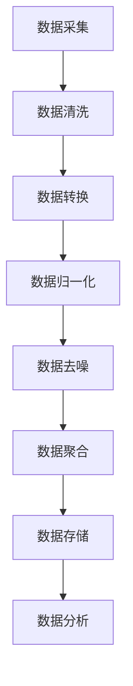

                 

关键词：人工智能，数据，机器学习，深度学习，算法优化，数据工程，数据处理，数据质量，未来展望

> 摘要：本文深入探讨了数据在人工智能（AI）领域的核心作用，从数据采集、处理到应用，全面解析了数据如何为AI提供动力。文章旨在为读者提供一个完整的视角，了解数据在AI发展中的重要性，以及未来可能面临的挑战和机遇。

## 1. 背景介绍

自20世纪80年代以来，人工智能（AI）的研究与应用经历了多个阶段的发展。从最初的符号推理、专家系统，到基于统计模型的机器学习，再到最近的深度学习和强化学习，AI在各个领域取得了显著的成果。这些进展离不开一个共同的驱动力——数据。

数据，是AI的粮食。正如计算机科学领域的“大数据”概念所指，随着互联网、物联网和传感器技术的普及，我们正面临着数据爆炸的时代。海量的结构化和非结构化数据，为AI的训练和应用提供了丰富的素材。AI通过学习这些数据中的规律和模式，实现了从感知到决策的自动化过程。

### 1.1 数据的重要性

数据的重要性体现在以下几个方面：

1. **数据是机器学习的基石**：机器学习算法需要大量数据来进行训练，数据的数量和质量直接影响模型的性能和泛化能力。
2. **数据驱动决策**：在商业、医疗、金融等领域，基于数据的分析和决策正逐渐取代传统的经验判断，提高了决策的效率和准确性。
3. **数据的积累和创新**：大量的数据积累为科研和创新提供了基础，推动了新算法、新应用和新产业的诞生。

### 1.2 数据来源

数据来源广泛，包括：

- **公开数据集**：如NASA的气候数据、UCI机器学习库等。
- **企业内部数据**：如客户交易记录、销售数据、员工绩效数据等。
- **社交媒体数据**：如Twitter、Facebook等平台上的用户生成内容。
- **传感器数据**：如物联网设备收集的环境数据、交通数据等。

## 2. 核心概念与联系

### 2.1 数据工程

数据工程是构建和维持数据基础设施的过程。它包括数据采集、存储、处理、分析、安全和治理等多个环节。数据工程的目标是确保数据的高质量、可用性和一致性，以便为机器学习和数据分析提供可靠的数据支持。

### 2.2 数据处理

数据处理是数据工程的重要组成部分，包括数据清洗、转换、归一化、去噪、聚合等步骤。高质量的数据处理是机器学习模型准确性和可靠性的关键。

### 2.3 数据质量

数据质量是数据工程的核心指标。高质量的数据意味着数据是准确的、完整的、一致的、可靠的和相关的。数据质量直接影响机器学习模型的性能和应用效果。

### 2.4 数据科学

数据科学是跨学科领域，结合了统计学、机器学习、数据库管理、计算机科学等多个学科，致力于从数据中提取有价值的信息和知识。

### 2.5 Mermaid 流程图

以下是数据工程中数据处理流程的 Mermaid 流程图：



## 3. 核心算法原理 & 具体操作步骤

### 3.1 算法原理概述

在机器学习中，常用的算法包括监督学习、无监督学习和强化学习。其中，监督学习是最常用的方法，它通过标记数据来训练模型，从而实现对未知数据的预测。监督学习算法包括线性回归、逻辑回归、支持向量机（SVM）、决策树、随机森林等。

### 3.2 算法步骤详解

1. **数据预处理**：包括数据清洗、缺失值处理、数据归一化等。
2. **特征选择**：选择对模型预测效果影响较大的特征。
3. **模型选择**：根据问题类型和数据特点选择合适的模型。
4. **模型训练**：使用训练数据集对模型进行训练。
5. **模型评估**：使用验证数据集评估模型性能。
6. **模型优化**：根据评估结果调整模型参数，提高模型性能。

### 3.3 算法优缺点

每种算法都有其优缺点，例如：

- **线性回归**：简单、易于实现，但可能无法处理非线性问题。
- **支持向量机（SVM）**：效果较好，但计算复杂度高。
- **决策树**：易于解释，但可能过拟合。

### 3.4 算法应用领域

监督学习算法广泛应用于各种领域，如：

- **图像识别**：使用卷积神经网络（CNN）进行图像分类。
- **自然语言处理（NLP）**：使用循环神经网络（RNN）或变压器（Transformer）进行文本分类、情感分析等。
- **金融预测**：使用时间序列分析进行股票价格预测、风险控制等。
- **医疗诊断**：使用深度学习进行疾病诊断、基因组分析等。

## 4. 数学模型和公式 & 详细讲解 & 举例说明

### 4.1 数学模型构建

监督学习中的线性回归模型可以表示为：

$$y = \beta_0 + \beta_1 x$$

其中，$y$ 是因变量，$x$ 是自变量，$\beta_0$ 和 $\beta_1$ 是模型参数。

### 4.2 公式推导过程

线性回归模型的推导基于最小二乘法，目标是找到使得预测值与真实值之间的误差平方和最小的参数。

### 4.3 案例分析与讲解

假设我们要预测房价，给定特征集 $x = [x_1, x_2, x_3]$（如房屋面积、房间数、楼层等），房价 $y$ 可以表示为：

$$y = \beta_0 + \beta_1 x_1 + \beta_2 x_2 + \beta_3 x_3$$

通过最小二乘法，我们可以计算出最佳参数 $\beta_0, \beta_1, \beta_2, \beta_3$，从而实现对未知房价的预测。

## 5. 项目实践：代码实例和详细解释说明

### 5.1 开发环境搭建

使用 Python 编写线性回归模型，需要安装以下库：

- NumPy：用于数组运算。
- Pandas：用于数据处理。
- Scikit-learn：用于机器学习算法。

### 5.2 源代码详细实现

```python
import numpy as np
import pandas as pd
from sklearn.linear_model import LinearRegression

# 数据读取
data = pd.read_csv('house_data.csv')

# 特征选择
X = data[['area', 'rooms', 'floor']]
y = data['price']

# 模型训练
model = LinearRegression()
model.fit(X, y)

# 模型评估
score = model.score(X, y)
print(f'Model R^2 score: {score}')

# 预测
new_data = np.array([[2000, 3, 1]])
predicted_price = model.predict(new_data)
print(f'Predicted price: {predicted_price[0]}')
```

### 5.3 代码解读与分析

这段代码首先读取了房价数据集，然后选择了三个特征（面积、房间数、楼层），使用线性回归模型进行了训练。最后，使用训练好的模型对新数据进行了预测。

## 6. 实际应用场景

### 6.1 智能家居

智能家居是数据驱动的典型应用场景，通过收集家庭设备的运行数据，AI算法可以优化设备的使用，提高能源效率，改善居住体验。

### 6.2 自动驾驶

自动驾驶汽车依赖于大量的数据收集和分析，包括道路状况、车辆位置、交通流量等。基于这些数据，AI算法可以实时做出驾驶决策，确保行驶安全。

### 6.3 医疗保健

在医疗保健领域，数据驱动的AI算法可以用于疾病预测、诊断、治疗方案推荐等。通过分析患者的健康数据，AI可以提供个性化的医疗建议。

### 6.4 未来应用展望

随着数据技术的不断进步，数据将在更多领域发挥重要作用。例如，在环境保护领域，AI可以通过分析环境数据，提供可持续发展的解决方案。在农业领域，AI可以优化作物种植、提高产量。

## 7. 工具和资源推荐

### 7.1 学习资源推荐

- 《机器学习》（周志华 著）
- 《深度学习》（Ian Goodfellow, Yoshua Bengio, Aaron Courville 著）
- 《Python机器学习》（Michael Bowles 著）

### 7.2 开发工具推荐

- Jupyter Notebook：用于数据分析和机器学习实验。
- TensorFlow：用于深度学习模型训练和部署。
- PyTorch：用于深度学习研究。

### 7.3 相关论文推荐

- "Deep Learning: A Brief History"（Yann LeCun）
- "The Unreasonable Effectiveness of Data"（Nik Broomberg and Liam Paninski）
- "Learning Deep Representations for AI"（Yann LeCun, Yosua Bengio, and Andrew Ng）

## 8. 总结：未来发展趋势与挑战

### 8.1 研究成果总结

本文探讨了数据在人工智能领域的核心作用，从数据采集、处理到应用，全面解析了数据如何为AI提供动力。通过分析各种算法原理和应用场景，展示了数据驱动的AI在多个领域的潜力。

### 8.2 未来发展趋势

随着数据技术的不断进步，数据驱动的AI将在更多领域发挥重要作用。未来的发展趋势包括：

- 更高效的数据处理算法。
- 更强大的机器学习模型。
- 跨学科的融合创新。

### 8.3 面临的挑战

尽管数据驱动的AI有着广泛的应用前景，但同时也面临着一些挑战，如：

- 数据隐私和安全。
- 数据质量和完整性。
- 道德和伦理问题。

### 8.4 研究展望

未来，数据驱动的AI研究需要关注以下几个方面：

- 开发更高效的算法和工具。
- 探索新的应用领域。
- 加强跨学科合作，推动AI技术的发展。

## 9. 附录：常见问题与解答

### 9.1 什么是机器学习？

机器学习是使计算机系统能够通过经验和数据自动改进和学习的过程，而无需显式编程。

### 9.2 数据处理包括哪些步骤？

数据处理包括数据采集、数据清洗、数据转换、数据归一化、数据去噪、数据聚合等步骤。

### 9.3 如何保证数据质量？

确保数据质量的方法包括数据清洗、数据验证、数据监控、数据治理等。

### 9.4 机器学习算法有哪些优缺点？

每种机器学习算法都有其优缺点，如线性回归简单但可能无法处理非线性问题，支持向量机效果较好但计算复杂度高。

### 9.5 数据科学和数据工程有什么区别？

数据科学侧重于从数据中提取有价值的信息和知识，而数据工程侧重于构建和维护数据基础设施，确保数据的高质量、可用性和一致性。

## 结束语

数据是人工智能发展的基石。随着数据技术的不断进步，数据驱动的AI将在更多领域发挥重要作用。本文旨在为读者提供一个全面的视角，了解数据在AI发展中的重要性，以及未来可能面临的挑战和机遇。希望通过本文，读者能够更好地理解数据的力量，并为AI的未来发展贡献自己的力量。

### 作者署名

作者：禅与计算机程序设计艺术 / Zen and the Art of Computer Programming

[END]

