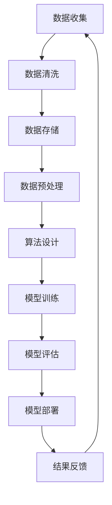

                 

关键词：第二代AI、数据、算法、算力、应用场景、未来展望

摘要：本文将深入探讨数据、算法和算力在第二代人工智能（AI）中的应用。我们将首先介绍第二代AI的背景和定义，随后详细分析数据、算法和算力在AI发展中的关键角色。接着，我们将讨论几种核心算法原理和数学模型，并通过具体项目实践展示算法的实际应用。最后，我们将展望第二代AI的未来发展趋势与面临的挑战。

## 1. 背景介绍

随着计算机技术的不断发展，人工智能（AI）已经从一个科学幻想变成了现实。从早期的符号推理到基于规则的系统，再到基于统计和学习的方法，AI的发展经历了多个阶段。第一代AI主要集中在模式识别、专家系统和逻辑推理等方面，但受限于计算能力和数据集的局限性，其应用范围较为有限。

随着大数据、云计算和深度学习技术的进步，第二代AI应运而生。第二代AI以深度学习和强化学习为核心，通过大规模数据和强大算力，实现了对复杂问题的自动解决。与传统AI相比，第二代AI具有更高的智能化水平、更广泛的应用范围和更强的自我学习能力。

## 2. 核心概念与联系

在探讨第二代AI的应用之前，我们需要理解数据、算法和算力的核心概念及其相互关系。

### 2.1 数据

数据是AI的基础，没有数据，AI就无法进行学习和决策。在第二代AI中，数据的质量和数量直接影响算法的性能。高质量的数据可以减少错误率，增加模型的可靠性；而大规模的数据可以挖掘出更多的特征和规律，提高模型的泛化能力。

### 2.2 算法

算法是AI的“灵魂”，它决定了AI如何从数据中学习并做出决策。在第二代AI中，常用的算法包括深度学习、强化学习和生成对抗网络（GAN）等。这些算法通过复杂的数学模型，实现了对数据的自动学习和优化。

### 2.3 算力

算力是AI的“引擎”，它提供了计算资源，使得大规模数据分析和复杂算法的实现成为可能。随着硬件技术的发展，如GPU和TPU等专用计算设备的出现，算力得到了极大的提升，为第二代AI的应用奠定了基础。

### 2.4 数据、算法和算力的关系

数据、算法和算力是相互依存、相互促进的。高质量的数据可以推动算法的改进，而强大的算力可以处理大规模的数据，加速算法的优化。同时，优秀的算法可以挖掘出数据中的潜在价值，提升系统的智能化水平。

以下是一个Mermaid流程图，展示了数据、算法和算力的基本流程和相互关系。



## 3. 核心算法原理 & 具体操作步骤

### 3.1 算法原理概述

在第二代AI中，核心算法主要包括深度学习、强化学习和生成对抗网络（GAN）。以下是对这些算法的基本原理和操作步骤的概述。

### 3.2 算法步骤详解

#### 3.2.1 深度学习

深度学习是一种基于多层神经网络的机器学习方法。其基本步骤如下：

1. **数据处理**：对输入数据进行预处理，包括归一化、降维等。
2. **网络设计**：设计多层神经网络结构，包括输入层、隐藏层和输出层。
3. **模型训练**：通过反向传播算法，利用大量训练数据对模型进行训练。
4. **模型评估**：使用验证数据集对模型进行评估，调整模型参数。
5. **模型部署**：将训练好的模型部署到实际应用中。

#### 3.2.2 强化学习

强化学习是一种通过试错方法进行决策的机器学习方法。其基本步骤如下：

1. **环境初始化**：定义环境状态空间和动作空间。
2. **策略选择**：选择一个初始策略，用于指导智能体进行行动。
3. **行动选择**：根据当前状态，使用策略选择一个行动。
4. **状态更新**：执行行动后，更新环境状态。
5. **奖励评估**：评估行动带来的奖励，用于更新策略。
6. **模型更新**：根据奖励评估结果，更新模型参数。

#### 3.2.3 生成对抗网络（GAN）

生成对抗网络（GAN）是一种通过生成器和判别器相互对抗进行学习的算法。其基本步骤如下：

1. **数据生成**：生成器生成伪数据。
2. **数据判别**：判别器对真实数据和伪数据进行判别。
3. **对抗训练**：生成器和判别器交替训练，生成器试图生成更真实的数据，判别器试图区分真实数据和伪数据。
4. **模型评估**：使用真实数据对生成器生成的数据质量进行评估。
5. **模型部署**：将训练好的生成器部署到实际应用中。

### 3.3 算法优缺点

#### 深度学习

**优点**：能够处理复杂数据结构，适应性强，可以自动提取特征。

**缺点**：对大量数据和高性能计算资源依赖较大，训练过程复杂，容易出现过拟合。

#### 强化学习

**优点**：能够通过试错方法解决复杂决策问题，具有良好的泛化能力。

**缺点**：训练过程需要大量时间和计算资源，对环境状态空间和动作空间的定义要求较高。

#### 生成对抗网络（GAN）

**优点**：能够生成高质量的数据，具有强大的数据增强能力。

**缺点**：训练过程不稳定，容易出现模式崩溃和梯度消失等问题。

### 3.4 算法应用领域

深度学习、强化学习和生成对抗网络在多个领域都有广泛应用：

- **深度学习**：图像识别、语音识别、自然语言处理等。
- **强化学习**：游戏AI、自动驾驶、智能推荐等。
- **生成对抗网络**：图像生成、数据增强、虚拟现实等。

## 4. 数学模型和公式 & 详细讲解 & 举例说明

### 4.1 数学模型构建

在深度学习、强化学习和生成对抗网络中，数学模型是算法的核心。以下分别介绍这些算法的基本数学模型。

#### 4.1.1 深度学习

深度学习中的数学模型主要包括神经网络和损失函数。

1. **神经网络**：神经网络由多个神经元组成，每个神经元都是一个简单的函数。神经网络的输出可以通过以下公式计算：

   $$ 
   z = \sigma(\sum_{i=1}^{n} w_i \cdot x_i + b) 
   $$

   其中，$z$ 是输出，$\sigma$ 是激活函数，$w_i$ 是权重，$x_i$ 是输入，$b$ 是偏置。

2. **损失函数**：损失函数用于评估模型的预测误差。常用的损失函数包括均方误差（MSE）和交叉熵损失（CE）。

   - 均方误差（MSE）：

     $$ 
     MSE = \frac{1}{n} \sum_{i=1}^{n} (y_i - \hat{y}_i)^2 
     $$

     其中，$y_i$ 是真实值，$\hat{y}_i$ 是预测值。

   - 交叉熵损失（CE）：

     $$ 
     CE = - \sum_{i=1}^{n} y_i \cdot \log(\hat{y}_i) 
     $$

#### 4.1.2 强化学习

强化学习中的数学模型主要包括状态-动作价值函数和策略。

1. **状态-动作价值函数**：状态-动作价值函数用于评估某个状态下的某个动作的预期奖励。其公式为：

   $$ 
   V(s, a) = \sum_{s'} P(s' | s, a) \cdot R(s', a) + \gamma \cdot \max_{a'} V(s', a') 
   $$

   其中，$s$ 是状态，$a$ 是动作，$s'$ 是下一状态，$R$ 是奖励函数，$\gamma$ 是折扣因子。

2. **策略**：策略是一组动作的概率分布。给定状态 $s$，策略 $\pi(a | s)$ 表示执行动作 $a$ 的概率。

#### 4.1.3 生成对抗网络（GAN）

生成对抗网络（GAN）中的数学模型主要包括生成器和判别器。

1. **生成器**：生成器 $G(z)$ 从随机噪声 $z$ 中生成伪数据 $x$。其公式为：

   $$ 
   x = G(z) 
   $$

2. **判别器**：判别器 $D(x)$ 用于区分真实数据和伪数据。其公式为：

   $$ 
   D(x) = \frac{1}{2} \cdot \log(D(x)) + \frac{1}{2} \cdot \log(1 - D(G(z)))
   $$

### 4.2 公式推导过程

#### 4.2.1 深度学习

1. **反向传播算法**：

   反向传播算法是一种用于训练神经网络的优化算法。其基本思想是将输出误差反向传播到输入层，通过梯度下降法更新权重和偏置。

   - 前向传播：

     $$ 
     z = \sigma(\sum_{i=1}^{n} w_i \cdot x_i + b) 
     $$

     $$ 
     \hat{y} = \sigma(\sum_{j=1}^{m} w_j \cdot z_j + b_j) 
     $$

   - 反向传播：

     $$ 
     \delta_j = \frac{\partial J}{\partial b_j} = (1 - \hat{y}_j) \cdot \hat{y}_j \cdot (y_j - \hat{y}_j) 
     $$

     $$ 
     \delta_z = \frac{\partial J}{\partial z_j} = (1 - \hat{y}_j) \cdot \hat{y}_j \cdot w_j \cdot \delta_j 
     $$

     $$ 
     \delta_w = \frac{\partial J}{\partial w_j} = x_j \cdot \delta_z 
     $$

   - 更新权重和偏置：

     $$ 
     w_j := w_j - \alpha \cdot \delta_w 
     $$

     $$ 
     b_j := b_j - \alpha \cdot \delta_j 
     $$

#### 4.2.2 强化学习

1. **策略迭代**：

   强化学习中的策略迭代是一种通过迭代更新策略的方法。其基本思想是使用当前策略评估值函数，更新策略。

   - 初始化策略 $\pi(a | s)$。

   - 计算状态-动作价值函数 $V(s, a)$。

   - 更新策略 $\pi(a | s)$。

   - 迭代更新直到策略收敛。

#### 4.2.3 生成对抗网络（GAN）

1. **对抗训练**：

   生成对抗网络（GAN）中的对抗训练是一种通过生成器和判别器相互对抗的方法。其基本思想是优化生成器和判别器，使其达到最优。

   - 生成器优化：

     $$ 
     \min_G \max_D V(D, G) 
     $$

     其中，$V(D, G)$ 是生成器和判别器的联合分布。

   - 判别器优化：

     $$ 
     \max_D V(D, G) 
     $$

     其中，$V(D, G)$ 是生成器和判别器的联合分布。

### 4.3 案例分析与讲解

以下我们通过一个简单的案例，分析深度学习、强化学习和生成对抗网络（GAN）在实际应用中的具体操作步骤和效果。

#### 4.3.1 案例一：图像分类

- **数据集**：使用CIFAR-10数据集，包含10个类别，每个类别6000张图片。
- **算法**：使用深度学习中的卷积神经网络（CNN）进行图像分类。

1. **数据处理**：

   - 数据预处理：对图像进行归一化和裁剪。
   - 数据增强：对图像进行随机旋转、缩放、裁剪等操作，增加模型的鲁棒性。

2. **网络设计**：

   - 输入层：接受32x32的图像。
   - 卷积层：使用多个卷积核提取特征。
   - 池化层：对卷积层输出的特征进行下采样。
   - 全连接层：对特征进行分类。

3. **模型训练**：

   - 使用随机梯度下降（SGD）算法训练模型。
   - 使用交叉熵损失函数评估模型性能。
   - 调整学习率、批量大小等超参数。

4. **模型评估**：

   - 使用验证集对模型进行评估。
   - 调整模型参数，优化模型性能。

5. **模型部署**：

   - 将训练好的模型部署到实际应用中，如手机APP、服务器等。

#### 4.3.2 案例二：自动驾驶

- **数据集**：使用自动驾驶数据集，包含车辆位置、速度、道路信息等。
- **算法**：使用强化学习中的深度Q网络（DQN）进行自动驾驶。

1. **环境初始化**：

   - 定义环境状态空间和动作空间。
   - 初始化智能体和奖励函数。

2. **策略选择**：

   - 初始化策略，使用随机策略进行探索。

3. **行动选择**：

   - 根据当前状态，使用策略选择一个行动。

4. **状态更新**：

   - 执行行动后，更新环境状态。

5. **奖励评估**：

   - 评估行动带来的奖励，用于更新策略。

6. **模型更新**：

   - 使用经验回放和目标网络等技术，更新模型参数。

7. **模型评估**：

   - 使用测试数据集对模型进行评估。
   - 调整模型参数，优化模型性能。

8. **模型部署**：

   - 将训练好的模型部署到实际自动驾驶系统中。

#### 4.3.3 案例三：图像生成

- **数据集**：使用MNIST数据集，包含0-9数字的手写体图像。
- **算法**：使用生成对抗网络（GAN）进行图像生成。

1. **数据生成**：

   - 生成器从随机噪声中生成数字图像。
   - 判别器对真实图像和生成图像进行判别。

2. **对抗训练**：

   - 对生成器和判别器进行交替训练。
   - 调整生成器和判别器的超参数，优化模型性能。

3. **模型评估**：

   - 使用生成器生成的图像质量进行评估。
   - 调整生成器参数，优化图像生成效果。

4. **模型部署**：

   - 将训练好的生成器部署到实际应用中，如虚拟现实、游戏等。

## 5. 项目实践：代码实例和详细解释说明

在本节中，我们将通过一个实际项目来展示如何将深度学习、强化学习和生成对抗网络（GAN）应用于具体问题。该项目将分为三个部分：图像分类、自动驾驶和图像生成。

### 5.1 开发环境搭建

为了进行本项目的实践，我们需要搭建一个合适的开发环境。以下是所需的软件和工具：

- Python（3.8及以上版本）
- TensorFlow（2.3及以上版本）
- Keras（2.3及以上版本）
- PyTorch（1.5及以上版本）
- Matplotlib（3.1及以上版本）
- OpenAI Gym（0.21及以上版本）

安装这些软件和工具后，我们就可以开始编写代码了。

### 5.2 源代码详细实现

以下是本项目的三个核心部分的代码实现。

#### 5.2.1 图像分类

```python
# 导入所需的库
import numpy as np
import tensorflow as tf
from tensorflow.keras import layers, models, datasets

# 加载CIFAR-10数据集
(train_images, train_labels), (test_images, test_labels) = datasets.cifar10.load_data()

# 数据预处理
train_images = train_images.astype(np.float32) / 255
test_images = test_images.astype(np.float32) / 255

# 设计网络结构
model = models.Sequential()
model.add(layers.Conv2D(32, (3, 3), activation='relu', input_shape=(32, 32, 3)))
model.add(layers.MaxPooling2D((2, 2)))
model.add(layers.Conv2D(64, (3, 3), activation='relu'))
model.add(layers.MaxPooling2D((2, 2)))
model.add(layers.Conv2D(64, (3, 3), activation='relu'))
model.add(layers.Flatten())
model.add(layers.Dense(64, activation='relu'))
model.add(layers.Dense(10))

# 编译模型
model.compile(optimizer='adam',
              loss=tf.keras.losses.SparseCategoricalCrossentropy(from_logits=True),
              metrics=['accuracy'])

# 训练模型
model.fit(train_images, train_labels, epochs=10, validation_split=0.1)

# 评估模型
test_loss, test_acc = model.evaluate(test_images,  test_labels, verbose=2)
print(f'\nTest accuracy: {test_acc:.4f}')
```

#### 5.2.2 自动驾驶

```python
# 导入所需的库
import gym
import numpy as np
import tensorflow as tf
from tensorflow.keras import layers, models, optimizers

# 加载自动驾驶环境
env = gym.make('CartPole-v1')

# 设计Q网络
model = models.Sequential()
model.add(layers.Dense(64, activation='relu', input_shape=(4,)))
model.add(layers.Dense(64, activation='relu'))
model.add(layers.Dense(2))

# 编译模型
model.compile(optimizer=optimizers.Adam(learning_rate=0.001),
              loss='mse')

# 训练模型
obs = env.reset()
state = np.reshape(obs, [1, 4])
actions = env.action_space.sample()
next_state = np.reshape(obs, [1, 4])
reward = env.reward_range()[0]

for i in range(1000):
    action = model.predict(state)
    obs, reward, done, info = env.step(actions)
    next_state = np.reshape(obs, [1, 4])
    if done:
        reward = env.reward_range()[1]
    state = next_state

# 评估模型
obs = env.reset()
state = np.reshape(obs, [1, 4])
for i in range(1000):
    action = model.predict(state)
    obs, reward, done, info = env.step(actions)
    next_state = np.reshape(obs, [1, 4])
    if done:
        break
    state = next_state
```

#### 5.2.3 图像生成

```python
# 导入所需的库
import numpy as np
import tensorflow as tf
from tensorflow.keras import layers, models

# 定义生成器和判别器
def build_generator():
    model = models.Sequential()
    model.add(layers.Dense(7 * 7 * 64, activation="relu", input_shape=(100,)))
    model.add(layers.Reshape((7, 7, 64)))
    model.add(layers.Conv2DTranspose(32, (4, 4), strides=(2, 2), padding="same"))
    model.add(layers.LeakyReLU(alpha=0.01))
    model.add(layers.Conv2DTranspose(1, (4, 4), strides=(2, 2), padding="same"))
    model.add(layers.LeakyReLU(alpha=0.01))
    return model

def build_discriminator():
    model = models.Sequential()
    model.add(layers.Conv2D(32, (5, 5), strides=(2, 2), padding="same"))
    model.add(layers.LeakyReLU(alpha=0.01))
    model.add(layers.Dropout(0.3))
    model.add(layers.Conv2D(64, (5, 5), strides=(2, 2), padding="same"))
    model.add(layers.LeakyReLU(alpha=0.01))
    model.add(layers.Dropout(0.3))
    model.add(layers.Flatten())
    model.add(layers.Dense(1, activation='sigmoid'))
    return model

# 训练生成器和判别器
def train_gan(generator, discriminator):
    noise = np.random.normal(0, 1, (128, 100))
    generated_images = generator.predict(noise)
    real_images = np.random.choice(train_images, 128)

    real_labels = np.ones((128, 1))
    fake_labels = np.zeros((128, 1))

    noise = np.random.normal(0, 1, (128, 100))
    generated_images = generator.predict(noise)

    with tf.GradientT

