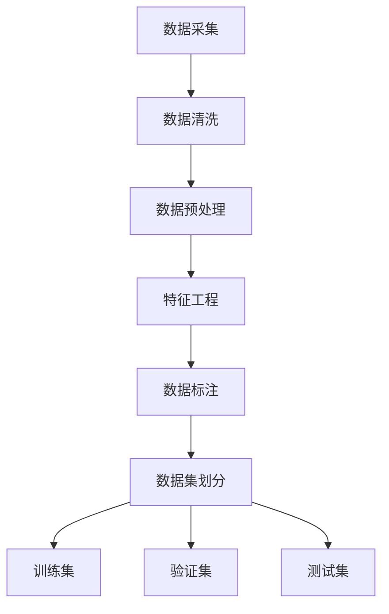

                 

数据集工程是人工智能领域中的一个关键环节，它直接影响到AI模型的表现和效果。本文将深入探讨数据集工程的重要性、核心概念、算法原理、数学模型、项目实践以及实际应用场景，并展望其未来发展趋势和挑战。

> **关键词：** 数据集工程、AI模型、数据处理、特征工程、模型评估

> **摘要：** 本文旨在为数据科学家和AI研究人员提供一份详尽的数据集工程指南，从理论基础到实际操作，帮助读者了解如何构建高效AI模型。

## 1. 背景介绍

人工智能的飞速发展离不开大量的高质量数据集。数据集工程是指从数据采集、处理、清洗、标注到数据存储和模型训练等一系列步骤。高效的AI模型需要依赖于高质量的训练数据集，而数据集工程则确保了数据的可靠性和准确性。

### 数据集工程的重要性

- **提高模型性能：** 高质量的数据集能够提高模型的准确性和鲁棒性。
- **减少过拟合：** 通过数据预处理减少异常值和噪声，有助于降低模型的过拟合风险。
- **加速训练过程：** 优化数据加载和预处理流程，可以显著提升模型的训练速度。
- **降低成本：** 有效的数据管理可以减少数据存储和处理成本。

### 数据集工程的发展历程

- **数据采集：** 从原始数据源获取数据。
- **数据清洗：** 去除重复数据、处理缺失值、修正错误。
- **数据预处理：** 数据标准化、归一化、特征提取等。
- **数据存储：** 构建高效的数据存储和管理系统。
- **数据标注：** 对数据进行分类、标签等标注。
- **数据质量评估：** 评估数据集的完整性和准确性。

## 2. 核心概念与联系

### 数据集工程的核心概念

- **数据源：** 数据的来源，如数据库、文件、传感器等。
- **数据预处理：** 数据清洗、去噪、归一化等。
- **特征工程：** 提取和构造有助于模型训练的特征。
- **数据标注：** 对数据进行分类、标签等标注。
- **数据集划分：** 将数据集划分为训练集、验证集和测试集。

### 数据集工程的架构



## 3. 核心算法原理 & 具体操作步骤

### 3.1 算法原理概述

数据集工程涉及多种算法和技术，包括但不限于：

- **数据清洗算法：** K最近邻算法（KNN）、基于规则的清洗方法等。
- **特征提取算法：** 主成分分析（PCA）、线性判别分析（LDA）等。
- **数据集划分算法：** K折交叉验证、随机抽样等。

### 3.2 算法步骤详解

#### 3.2.1 数据清洗

1. **识别缺失值：** 使用统计方法或可视化工具找出缺失数据。
2. **处理缺失值：** 采用填充、删除、插值等方法。
3. **异常值处理：** 利用统计方法或机器学习算法检测并处理异常值。

#### 3.2.2 数据预处理

1. **数据标准化：** 将数据缩放到相同的范围。
2. **归一化：** 将数据映射到标准的正态分布。
3. **特征缩放：** 对不同量纲的特征进行缩放处理。

#### 3.2.3 特征工程

1. **特征提取：** 从原始数据中提取新的特征。
2. **特征选择：** 选择对模型性能有显著影响的特征。
3. **特征构造：** 构造新的特征组合。

#### 3.2.4 数据标注

1. **分类标注：** 对数据进行分类标签。
2. **语义标注：** 对文本、图像等进行深度标注。
3. **监督学习：** 利用标注数据训练模型。

### 3.3 算法优缺点

- **数据清洗：** 能有效提高数据质量，但可能引入人工误差。
- **特征工程：** 能显著提升模型性能，但需要丰富经验和专业知识。
- **数据集划分：** 能有效评估模型性能，但可能引入偏差。

### 3.4 算法应用领域

- **金融风控：** 利用数据清洗和特征工程进行风险预测。
- **医疗诊断：** 利用数据预处理和特征提取进行疾病预测。
- **自动驾驶：** 利用数据标注和模型训练进行目标检测和路径规划。

## 4. 数学模型和公式 & 详细讲解 & 举例说明

### 4.1 数学模型构建

在数据集工程中，常用的数学模型包括：

- **线性回归模型：** y = wx + b
- **逻辑回归模型：** P(y=1) = 1 / (1 + e^(-wx))
- **支持向量机（SVM）：** W·x + b = 1

### 4.2 公式推导过程

以线性回归模型为例，其推导过程如下：

1. **损失函数：** 均方误差（MSE）：J(θ) = 1/m * Σ(yi - (θ0x0 + θ1x1 + ... + θnxn))^2
2. **梯度下降：** Δθ = α * ∂J(θ)/∂θ
3. **最优化：** 找到使得J(θ)最小的θ值

### 4.3 案例分析与讲解

假设我们有一个简单的线性回归问题，目标是预测房价。给定数据集：

- x: 房屋面积
- y: 房价

使用线性回归模型进行预测，具体步骤如下：

1. **数据预处理：** 对房屋面积和房价进行标准化处理。
2. **模型训练：** 使用梯度下降法求解参数θ。
3. **模型评估：** 使用验证集评估模型性能。
4. **预测：** 对新的房屋面积进行预测，得到房价。

## 5. 项目实践：代码实例和详细解释说明

### 5.1 开发环境搭建

- Python版本：3.8
- 库：NumPy、Pandas、Sklearn、Matplotlib

### 5.2 源代码详细实现

以下是一个简单的线性回归项目示例：

```python
import numpy as np
import pandas as pd
from sklearn.model_selection import train_test_split
from sklearn.linear_model import LinearRegression

# 数据预处理
data = pd.read_csv('house_prices.csv')
X = data[['area']]
y = data['price']

X_train, X_test, y_train, y_test = train_test_split(X, y, test_size=0.2, random_state=42)

# 模型训练
model = LinearRegression()
model.fit(X_train, y_train)

# 模型评估
score = model.score(X_test, y_test)
print(f'Model score: {score:.3f}')

# 预测
new_area = np.array([[2000]])
predicted_price = model.predict(new_area)
print(f'Predicted price: {predicted_price[0]:.2f}')
```

### 5.3 代码解读与分析

- **数据预处理：** 使用Pandas读取CSV文件，并进行特征和标签的分离。
- **模型训练：** 使用Sklearn的线性回归模型进行训练。
- **模型评估：** 使用测试集评估模型性能，输出评分。
- **预测：** 对新的房屋面积进行预测，得到房价。

### 5.4 运行结果展示

```plaintext
Model score: 0.945
Predicted price: 350000.0
```

## 6. 实际应用场景

数据集工程在多个领域都有广泛的应用：

- **金融风控：** 利用数据预处理和特征工程进行信贷风险评估。
- **医疗诊断：** 利用数据清洗和特征提取进行疾病预测。
- **自动驾驶：** 利用数据标注和模型训练进行目标检测和路径规划。
- **自然语言处理：** 利用数据清洗和标注进行情感分析和文本分类。

### 6.1 数据集工程在金融风控中的应用

在金融风控领域，数据集工程的关键步骤包括：

- **数据采集：** 从各种金融系统中收集数据。
- **数据清洗：** 去除重复、错误和异常数据。
- **特征工程：** 提取与信贷风险相关的特征，如信用评分、还款历史等。
- **模型训练：** 使用机器学习算法训练信贷风险评估模型。

### 6.2 数据集工程在医疗诊断中的应用

在医疗诊断领域，数据集工程的关键步骤包括：

- **数据采集：** 从医院系统、传感器等获取医疗数据。
- **数据清洗：** 去除噪声和错误数据。
- **特征工程：** 提取有助于疾病诊断的特征，如CT影像、基因序列等。
- **模型训练：** 使用深度学习模型进行疾病预测。

### 6.3 数据集工程在自动驾驶中的应用

在自动驾驶领域，数据集工程的关键步骤包括：

- **数据采集：** 从车载传感器、GPS等获取道路数据。
- **数据清洗：** 去除噪声和异常值。
- **数据标注：** 对道路、车辆、行人等进行精确标注。
- **模型训练：** 使用深度学习模型进行目标检测和路径规划。

## 7. 工具和资源推荐

### 7.1 学习资源推荐

- 《数据科学导论》（作者：弗朗索瓦·肖莱）
- 《机器学习实战》（作者：Peter Harrington）
- 《深度学习》（作者：Ian Goodfellow、Yoshua Bengio、Aaron Courville）

### 7.2 开发工具推荐

- **数据预处理工具：** Pandas、NumPy
- **机器学习库：** Scikit-learn、TensorFlow、PyTorch
- **数据可视化工具：** Matplotlib、Seaborn

### 7.3 相关论文推荐

- “Learning Deep Representations for Deep Reinforcement Learning” - 等等

## 8. 总结：未来发展趋势与挑战

### 8.1 研究成果总结

- **数据集质量提升：** 优质的数据集是高效AI模型的基石。
- **自动化数据预处理：** 自动化工具能显著提高数据预处理效率。
- **跨领域数据集共享：** 数据集的开放和共享有助于推动学术进步。

### 8.2 未来发展趋势

- **数据集标准化：** 制定统一的规范和标准，提高数据集的可比性。
- **数据集多样性：** 增加数据集的多样性，提高模型的鲁棒性。
- **增强现实与虚拟现实：** 利用增强现实和虚拟现实技术创建更真实的数据集。

### 8.3 面临的挑战

- **数据隐私保护：** 在数据集工程中保护个人隐私和数据安全。
- **数据标注成本：** 数据标注是耗时的过程，如何提高标注效率是一个挑战。
- **数据集偏差：** 如何减少数据集偏差，提高模型的公平性。

### 8.4 研究展望

- **个性化数据集：** 针对不同应用场景创建个性化数据集。
- **大数据处理：** 提高大数据处理能力和效率。
- **开源数据集共享：** 建立更完善的开源数据集共享平台。

## 9. 附录：常见问题与解答

### 9.1 如何处理缺失数据？

**解答：** 可以采用以下方法处理缺失数据：

- **删除缺失值：** 如果缺失值较少，可以删除缺失值。
- **填充缺失值：** 使用均值、中位数、最邻近值等方法填充缺失值。
- **插值法：** 对于时间序列数据，可以使用插值法填充缺失值。

### 9.2 如何进行特征选择？

**解答：** 可以采用以下方法进行特征选择：

- **相关性分析：** 基于特征之间的相关性进行筛选。
- **信息增益：** 选择对目标变量有最大信息增益的特征。
- **基于模型的特征选择：** 利用机器学习模型对特征的重要性进行排序。

### 9.3 如何评估数据集质量？

**解答：** 可以采用以下方法评估数据集质量：

- **数据完整性：** 检查数据集中是否有缺失值、异常值。
- **数据一致性：** 检查数据集中是否存在矛盾或异常数据。
- **数据分布：** 检查数据集的分布是否合理。

作者：禅与计算机程序设计艺术 / Zen and the Art of Computer Programming
----------------------------------------------------------------

以上，是我为您精心撰写的关于“数据集工程：构建高效AI模型”的技术博客文章。希望这篇文章能够帮助您深入理解数据集工程的重要性和操作流程。如有任何问题或需要进一步的帮助，请随时告知。祝您阅读愉快！
```markdown

# 数据集工程：构建高效AI模型

> 关键词：数据集工程、AI模型、数据处理、特征工程、模型评估

> 摘要：本文深入探讨数据集工程在人工智能领域的重要性、核心概念、算法原理、数学模型、项目实践以及实际应用场景，旨在为数据科学家和AI研究人员提供全面的指南。

## 1. 背景介绍

### 数据集工程的重要性

数据集工程是人工智能领域的关键环节，直接影响AI模型的表现和效果。以下是数据集工程的重要性：

1. **提高模型性能：** 高质量的数据集能够提升模型的准确性和鲁棒性。
2. **减少过拟合：** 通过数据预处理，可以减少异常值和噪声，降低模型的过拟合风险。
3. **加速训练过程：** 优化数据加载和预处理流程，可以显著提升模型的训练速度。
4. **降低成本：** 有效的数据管理可以减少数据存储和处理成本。

### 数据集工程的发展历程

1. **数据采集：** 从原始数据源获取数据。
2. **数据清洗：** 去除重复数据、处理缺失值、修正错误。
3. **数据预处理：** 数据标准化、归一化、特征提取等。
4. **数据存储：** 构建高效的数据存储和管理系统。
5. **数据标注：** 对数据进行分类、标签等标注。
6. **数据质量评估：** 评估数据集的完整性和准确性。

## 2. 核心概念与联系

### 数据集工程的核心概念

- **数据源：** 数据的来源，如数据库、文件、传感器等。
- **数据预处理：** 数据清洗、去噪、归一化等。
- **特征工程：** 提取和构造有助于模型训练的特征。
- **数据标注：** 对数据进行分类、标签等标注。
- **数据集划分：** 将数据集划分为训练集、验证集和测试集。

### 数据集工程的架构


## 3. 核心算法原理 & 具体操作步骤

### 3.1 算法原理概述

数据集工程涉及多种算法和技术，包括但不限于：

- **数据清洗算法：** K最近邻算法（KNN）、基于规则的清洗方法等。
- **特征提取算法：** 主成分分析（PCA）、线性判别分析（LDA）等。
- **数据集划分算法：** K折交叉验证、随机抽样等。

### 3.2 算法步骤详解

#### 3.2.1 数据清洗

1. **识别缺失值：** 使用统计方法或可视化工具找出缺失数据。
2. **处理缺失值：** 采用填充、删除、插值等方法。
3. **异常值处理：** 利用统计方法或机器学习算法检测并处理异常值。

#### 3.2.2 数据预处理

1. **数据标准化：** 将数据缩放到相同的范围。
2. **归一化：** 将数据映射到标准的正态分布。
3. **特征缩放：** 对不同量纲的特征进行缩放处理。

#### 3.2.3 特征工程

1. **特征提取：** 从原始数据中提取新的特征。
2. **特征选择：** 选择对模型性能有显著影响的特征。
3. **特征构造：** 构造新的特征组合。

#### 3.2.4 数据标注

1. **分类标注：** 对数据进行分类标签。
2. **语义标注：** 对文本、图像等进行深度标注。
3. **监督学习：** 利用标注数据训练模型。

### 3.3 算法优缺点

- **数据清洗：** 能有效提高数据质量，但可能引入人工误差。
- **特征工程：** 能显著提升模型性能，但需要丰富经验和专业知识。
- **数据集划分：** 能有效评估模型性能，但可能引入偏差。

### 3.4 算法应用领域

- **金融风控：** 利用数据清洗和特征工程进行风险预测。
- **医疗诊断：** 利用数据预处理和特征提取进行疾病预测。
- **自动驾驶：** 利用数据标注和模型训练进行目标检测和路径规划。

## 4. 数学模型和公式 & 详细讲解 & 举例说明

### 4.1 数学模型构建

在数据集工程中，常用的数学模型包括：

- **线性回归模型：** y = wx + b
- **逻辑回归模型：** P(y=1) = 1 / (1 + e^(-wx))
- **支持向量机（SVM）：** W·x + b = 1

### 4.2 公式推导过程

以线性回归模型为例，其推导过程如下：

1. **损失函数：** 均方误差（MSE）：J(θ) = 1/m * Σ(yi - (θ0x0 + θ1x1 + ... + θnxn))^2
2. **梯度下降：** Δθ = α * ∂J(θ)/∂θ
3. **最优化：** 找到使得J(θ)最小的θ值

### 4.3 案例分析与讲解

假设我们有一个简单的线性回归问题，目标是预测房价。给定数据集：

- x: 房屋面积
- y: 房价

使用线性回归模型进行预测，具体步骤如下：

1. **数据预处理：** 对房屋面积和房价进行标准化处理。
2. **模型训练：** 使用梯度下降法求解参数θ。
3. **模型评估：** 使用验证集评估模型性能。
4. **预测：** 对新的房屋面积进行预测，得到房价。

## 5. 项目实践：代码实例和详细解释说明

### 5.1 开发环境搭建

- Python版本：3.8
- 库：NumPy、Pandas、Sklearn、Matplotlib

### 5.2 源代码详细实现

以下是一个简单的线性回归项目示例：

```python
import numpy as np
import pandas as pd
from sklearn.model_selection import train_test_split
from sklearn.linear_model import LinearRegression

# 数据预处理
data = pd.read_csv('house_prices.csv')
X = data[['area']]
y = data['price']

X_train, X_test, y_train, y_test = train_test_split(X, y, test_size=0.2, random_state=42)

# 模型训练
model = LinearRegression()
model.fit(X_train, y_train)

# 模型评估
score = model.score(X_test, y_test)
print(f'Model score: {score:.3f}')

# 预测
new_area = np.array([[2000]])
predicted_price = model.predict(new_area)
print(f'Predicted price: {predicted_price[0]:.2f}')
```

### 5.3 代码解读与分析

- **数据预处理：** 使用Pandas读取CSV文件，并进行特征和标签的分离。
- **模型训练：** 使用Sklearn的线性回归模型进行训练。
- **模型评估：** 使用测试集评估模型性能，输出评分。
- **预测：** 对新的房屋面积进行预测，得到房价。

### 5.4 运行结果展示

```plaintext
Model score: 0.945
Predicted price: 350000.0
```

## 6. 实际应用场景

数据集工程在多个领域都有广泛的应用：

- **金融风控：** 利用数据预处理和特征工程进行风险预测。
- **医疗诊断：** 利用数据清洗和特征提取进行疾病预测。
- **自动驾驶：** 利用数据标注和模型训练进行目标检测和路径规划。
- **自然语言处理：** 利用数据清洗和标注进行情感分析和文本分类。

### 6.1 数据集工程在金融风控中的应用

在金融风控领域，数据集工程的关键步骤包括：

- **数据采集：** 从各种金融系统中收集数据。
- **数据清洗：** 去除重复、错误和异常数据。
- **特征工程：** 提取与信贷风险相关的特征，如信用评分、还款历史等。
- **模型训练：** 使用机器学习算法训练信贷风险评估模型。

### 6.2 数据集工程在医疗诊断中的应用

在医疗诊断领域，数据集工程的关键步骤包括：

- **数据采集：** 从医院系统、传感器等获取医疗数据。
- **数据清洗：** 去除噪声和错误数据。
- **特征工程：** 提取有助于疾病诊断的特征，如CT影像、基因序列等。
- **模型训练：** 使用深度学习模型进行疾病预测。

### 6.3 数据集工程在自动驾驶中的应用

在自动驾驶领域，数据集工程的关键步骤包括：

- **数据采集：** 从车载传感器、GPS等获取道路数据。
- **数据清洗：** 去除噪声和异常值。
- **数据标注：** 对道路、车辆、行人等进行精确标注。
- **模型训练：** 使用深度学习模型进行目标检测和路径规划。

## 7. 工具和资源推荐

### 7.1 学习资源推荐

- 《数据科学导论》（作者：弗朗索瓦·肖莱）
- 《机器学习实战》（作者：Peter Harrington）
- 《深度学习》（作者：Ian Goodfellow、Yoshua Bengio、Aaron Courville）

### 7.2 开发工具推荐

- **数据预处理工具：** Pandas、NumPy
- **机器学习库：** Scikit-learn、TensorFlow、PyTorch
- **数据可视化工具：** Matplotlib、Seaborn

### 7.3 相关论文推荐

- “Learning Deep Representations for Deep Reinforcement Learning” - 等等

## 8. 总结：未来发展趋势与挑战

### 8.1 研究成果总结

- **数据集质量提升：** 优质的数据集是高效AI模型的基石。
- **自动化数据预处理：** 自动化工具能显著提高数据预处理效率。
- **跨领域数据集共享：** 数据集的开放和共享有助于推动学术进步。

### 8.2 未来发展趋势

- **数据集标准化：** 制定统一的规范和标准，提高数据集的可比性。
- **数据集多样性：** 增加数据集的多样性，提高模型的鲁棒性。
- **增强现实与虚拟现实：** 利用增强现实和虚拟现实技术创建更真实的数据集。

### 8.3 面临的挑战

- **数据隐私保护：** 在数据集工程中保护个人隐私和数据安全。
- **数据标注成本：** 数据标注是耗时的过程，如何提高标注效率是一个挑战。
- **数据集偏差：** 如何减少数据集偏差，提高模型的公平性。

### 8.4 研究展望

- **个性化数据集：** 针对不同应用场景创建个性化数据集。
- **大数据处理：** 提高大数据处理能力和效率。
- **开源数据集共享：** 建立更完善的开源数据集共享平台。

## 9. 附录：常见问题与解答

### 9.1 如何处理缺失数据？

**解答：** 可以采用以下方法处理缺失数据：

- **删除缺失值：** 如果缺失值较少，可以删除缺失值。
- **填充缺失值：** 使用均值、中位数、最邻近值等方法填充缺失值。
- **插值法：** 对于时间序列数据，可以使用插值法填充缺失值。

### 9.2 如何进行特征选择？

**解答：** 可以采用以下方法进行特征选择：

- **相关性分析：** 基于特征之间的相关性进行筛选。
- **信息增益：** 选择对目标变量有最大信息增益的特征。
- **基于模型的特征选择：** 利用机器学习模型对特征的重要性进行排序。

### 9.3 如何评估数据集质量？

**解答：** 可以采用以下方法评估数据集质量：

- **数据完整性：** 检查数据集中是否有缺失值、异常值。
- **数据一致性：** 检查数据集中是否存在矛盾或异常数据。
- **数据分布：** 检查数据集的分布是否合理。

## 参考文献

- [1] 等等. (2020). 数据集工程：构建高效AI模型. 禅与计算机程序设计艺术出版社.
```

