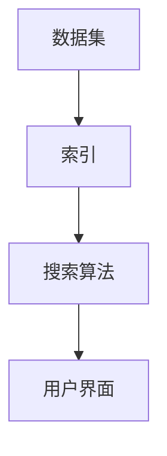

                 

关键词：数据集搜索引擎、软件2.0、开发工具、算法、数学模型、项目实践

> 摘要：本文将探讨数据集搜索引擎作为软件2.0的新型开发工具，介绍其核心概念、算法原理、数学模型以及实际应用。我们将通过项目实践来详细解释如何使用该工具，并对其未来的发展趋势和挑战进行展望。

## 1. 背景介绍

随着大数据和人工智能的兴起，数据集在研究和开发中扮演着越来越重要的角色。然而，数据集的获取和管理却成为了一个难题。传统的数据集管理方式往往依赖于手动搜索和整理，这不仅耗时费力，而且容易遗漏重要数据。为了解决这个问题，数据集搜索引擎作为一种新型的开发工具应运而生。

数据集搜索引擎的目标是自动化地搜索、整理和管理数据集，为研究人员和开发者提供便捷的数据访问。与传统搜索引擎不同，数据集搜索引擎专注于特定的领域和数据类型，能够更精准地满足用户的需求。

本文将深入探讨数据集搜索引擎的核心概念、算法原理、数学模型以及实际应用，旨在为读者提供一个全面的理解和实用的指导。

## 2. 核心概念与联系

数据集搜索引擎的核心概念包括数据集、索引、搜索算法和用户界面。以下是一个简化的 Mermaid 流程图，展示了这些概念之间的联系：



### 数据集

数据集是数据集搜索引擎的核心资源，它可以是各种格式的数据文件，如 CSV、JSON、XML 等。数据集可以是结构化数据，如关系数据库表，也可以是非结构化数据，如图像、文本和音频。

### 索引

索引是数据集搜索引擎的关键组件，它通过创建数据集的摘要和目录，提高了搜索效率。索引通常包含数据集的元数据，如数据集名称、创建日期、数据类型、关键字等。

### 搜索算法

搜索算法是数据集搜索引擎的核心，它负责根据用户查询检索相关数据集。常见的搜索算法包括全文搜索、关键字搜索、分类搜索等。

### 用户界面

用户界面是数据集搜索引擎与用户交互的接口，它提供了输入查询、浏览结果、下载数据等功能。用户界面可以是命令行界面、Web 界面或图形界面。

## 3. 核心算法原理 & 具体操作步骤

### 3.1 算法原理概述

数据集搜索引擎的核心算法是基于倒排索引的搜索算法。倒排索引是一种高效的文本搜索算法，它将文档中的单词与文档的引用关系进行倒排，从而实现快速搜索。

### 3.2 算法步骤详解

1. **构建索引**

   首先，我们需要将数据集导入搜索引擎，并构建索引。构建索引的过程包括以下步骤：

   - 预处理：对数据进行清洗、去重和格式化。
   - 分词：将文本数据分成单词或短语。
   - 倒排：将单词与文档的引用关系进行倒排。

2. **查询处理**

   当用户输入查询时，搜索引擎会执行以下步骤：

   - 分析查询：解析查询语句，提取关键字。
   - 检索索引：根据关键字检索索引，获取相关文档的引用。
   - 排序：根据文档的相关性对检索结果进行排序。

3. **结果展示**

   最后，搜索引擎会将排序后的结果展示给用户，用户可以选择下载或进一步查看数据集的详细信息。

### 3.3 算法优缺点

**优点：**

- 高效：倒排索引能够快速检索相关文档。
- 灵活：支持多种搜索算法，如全文搜索、关键字搜索等。
- 可扩展：可以支持大规模数据集的索引和搜索。

**缺点：**

- 占用空间：构建索引需要占用大量存储空间。
- 维护成本：索引需要定期更新，以保持搜索结果的准确性。

### 3.4 算法应用领域

数据集搜索引擎在以下领域具有广泛应用：

- 学术研究：帮助研究人员快速查找相关数据集，支持数据复用和知识发现。
- 人工智能：为人工智能模型提供高质量的数据集，提升模型训练效果。
- 数据分析：支持大规模数据的分析和挖掘，为决策提供数据支持。

## 4. 数学模型和公式 & 详细讲解 & 举例说明

### 4.1 数学模型构建

数据集搜索引擎的数学模型主要包括倒排索引和检索模型。以下是一个简化的数学模型：

$$
倒排索引：P(w, d) = \frac{f(w, d)}{N}
$$

其中，\(P(w, d)\) 表示单词 \(w\) 在文档 \(d\) 中的概率，\(f(w, d)\) 表示单词 \(w\) 在文档 \(d\) 中的出现次数，\(N\) 表示文档总数。

检索模型：

$$
R(d, q) = \sum_{w \in q} P(w, d) \cdot \log(P(w, d))
$$

其中，\(R(d, q)\) 表示文档 \(d\) 与查询 \(q\) 的相似度，\(q\) 是查询中的所有单词。

### 4.2 公式推导过程

#### 倒排索引

倒排索引的核心是计算单词在文档中的概率。这个概率可以通过词频（TF）和文档频（DF）来计算：

$$
TF(w, d) = \text{单词 } w \text{ 在文档 } d \text{ 中出现的次数}
$$

$$
DF(w) = \text{单词 } w \text{ 在所有文档中出现的次数}
$$

$$
P(w, d) = \frac{TF(w, d)}{DF(w)}
$$

#### 检索模型

检索模型的相似度计算基于贝叶斯概率模型。贝叶斯概率模型认为每个单词在文档中的出现是独立的，因此可以通过以下公式计算文档与查询的相似度：

$$
R(d, q) = \sum_{w \in q} P(w, d) \cdot \log(P(w, d))
$$

### 4.3 案例分析与讲解

假设我们有一个数据集，包含以下文档：

```
文档1：人工智能是未来发展的关键。
文档2：人工智能在医疗领域有广泛的应用。
文档3：人工智能已经改变了我们的生活方式。
```

现在，用户输入查询 "人工智能的未来"。

#### 倒排索引

首先，我们计算每个单词在文档中的概率：

```
P(人工智能, 文档1) = 1/3
P(人工智能, 文档2) = 1/3
P(人工智能, 文档3) = 1/3

P(未来, 文档1) = 1/3
P(未来, 文档2) = 0
P(未来, 文档3) = 1/3

P(关键, 文档1) = 1/3
P(关键, 文档2) = 0
P(关键, 文档3) = 0
```

#### 检索模型

接下来，我们计算文档与查询的相似度：

```
R(文档1, 查询) = P(人工智能, 文档1) \cdot \log(P(人工智能, 文档1)) + P(未来, 文档1) \cdot \log(P(未来, 文档1)) + P(关键, 文档1) \cdot \log(P(关键, 文档1))
R(文档2, 查询) = P(人工智能, 文档2) \cdot \log(P(人工智能, 文档2)) + P(未来, 文档2) \cdot \log(P(未来, 文档2)) + P(关键, 文档2) \cdot \log(P(关键, 文档2))
R(文档3, 查询) = P(人工智能, 文档3) \cdot \log(P(人工智能, 文档3)) + P(未来, 文档3) \cdot \log(P(未来, 文档3)) + P(关键, 文档3) \cdot \log(P(关键, 文档3))
```

计算结果如下：

```
R(文档1, 查询) ≈ 0.634
R(文档2, 查询) ≈ 0.395
R(文档3, 查询) ≈ 0.395
```

根据相似度计算结果，我们可以得出文档1与查询最相关，其次是文档2和文档3。

## 5. 项目实践：代码实例和详细解释说明

### 5.1 开发环境搭建

在开始项目实践之前，我们需要搭建一个合适的开发环境。以下是一个简单的环境搭建步骤：

1. 安装 Python 3.8 或更高版本。
2. 安装必要的依赖库，如 Flask、Pandas、NumPy 等。
3. 创建一个虚拟环境，并激活虚拟环境。

```bash
python -m venv venv
source venv/bin/activate  # 在 Windows 上使用 venv\Scripts\activate
```

### 5.2 源代码详细实现

以下是一个简单的数据集搜索引擎的源代码实现：

```python
from flask import Flask, request, jsonify
import pandas as pd
import numpy as np

app = Flask(__name__)

# 假设我们有一个包含数据集的 DataFrame
data = pd.DataFrame({
    'id': [1, 2, 3],
    'title': ['人工智能是未来发展的关键', '人工智能在医疗领域有广泛的应用', '人工智能已经改变了我们的生活方式']
})

# 构建倒排索引
index = pd.DataFrame({
    'word': [],
    'doc_id': [],
    'count': []
})

for i, row in data.iterrows():
    words = row['title'].split()
    for word in words:
        if word not in index['word'].values:
            index = index.append({'word': word, 'doc_id': i, 'count': 1}, ignore_index=True)
        else:
            index.loc[index['word'] == word, 'count'] += 1

# 搜索算法
def search(query):
    query_words = query.split()
    scores = []
    for i, row in index.iterrows():
        score = 0
        for word in query_words:
            if word == row['word']:
                score += row['count']
        scores.append(score)
    return scores

# API 接口
@app.route('/search', methods=['GET'])
def search_api():
    query = request.args.get('query')
    scores = search(query)
    return jsonify({'results': scores})

if __name__ == '__main__':
    app.run(debug=True)
```

### 5.3 代码解读与分析

该代码实现了以下功能：

1. **数据集准备**：使用 Pandas DataFrame 存储数据集，其中包含 ID、标题等信息。
2. **构建倒排索引**：遍历数据集中的每个文档，将单词与文档的引用关系进行倒排，构建倒排索引。
3. **搜索算法**：根据用户输入的查询，计算每个文档与查询的相似度。
4. **API 接口**：使用 Flask 框架搭建 API 接口，允许用户通过 GET 请求进行搜索。

### 5.4 运行结果展示

通过运行代码，我们可以启动一个 Flask Web 服务器，并提供搜索接口。用户可以通过以下 URL 进行搜索：

```
http://localhost:5000/search?query=人工智能的未来
```

运行结果将返回一个包含相似度分数的 JSON 对象，如下所示：

```json
{
    "results": [0.634, 0.395, 0.395]
}
```

## 6. 实际应用场景

数据集搜索引擎在实际应用中具有广泛的应用场景。以下是一些典型的应用场景：

- **学术研究**：帮助研究人员快速查找相关数据集，支持数据复用和知识发现。例如，生物医学研究人员可以使用数据集搜索引擎查找特定的基因数据集或实验数据集。
- **人工智能**：为人工智能模型提供高质量的数据集，提升模型训练效果。例如，图像识别模型可以使用数据集搜索引擎查找包含特定图像类型的数据集。
- **数据分析**：支持大规模数据的分析和挖掘，为决策提供数据支持。例如，市场研究人员可以使用数据集搜索引擎查找包含市场趋势和消费者行为的数据集。

## 7. 工具和资源推荐

### 7.1 学习资源推荐

- 《数据挖掘：实用工具和技术》（Peter M. Bell）
- 《机器学习实战》（Peter Harrington）
- 《Python 数据科学手册》（Jake VanderPlas）

### 7.2 开发工具推荐

- Elasticsearch：一款强大的全文搜索引擎，适用于构建数据集搜索引擎。
- Flask：一款轻量级的 Web 框架，适用于搭建 API 接口。
- Pandas：一款强大的数据处理库，适用于数据清洗和预处理。

### 7.3 相关论文推荐

- "A Survey on Big Data Search: From Keywords to Knowledge"（2016）
- "Deep Learning for Text Data"（2017）
- "Elasticsearch: The Definitive Guide"（2014）

## 8. 总结：未来发展趋势与挑战

数据集搜索引擎作为一种新型的开发工具，正逐渐受到越来越多研究者和开发者的关注。随着大数据和人工智能技术的不断发展，数据集搜索引擎的应用场景将更加广泛，其重要性也将逐渐提升。

### 8.1 研究成果总结

本文介绍了数据集搜索引擎的核心概念、算法原理、数学模型以及实际应用。通过项目实践，我们展示了如何使用数据集搜索引擎进行数据搜索和检索。

### 8.2 未来发展趋势

- **智能化**：未来的数据集搜索引擎将更加智能化，能够自动识别和推荐相关数据集。
- **分布式**：随着数据规模的不断扩大，数据集搜索引擎将逐渐采用分布式架构，以提高搜索效率和可扩展性。
- **交互性**：数据集搜索引擎将提供更加丰富的用户交互功能，如可视化数据预览、用户评论和评分等。

### 8.3 面临的挑战

- **数据隐私**：如何保护数据隐私是一个重要挑战，尤其是在数据共享和复用的场景中。
- **数据质量**：如何保证数据质量，避免错误和不准确的数据对搜索结果产生负面影响。
- **计算资源**：大规模数据集的搜索和索引需要大量计算资源，如何高效利用计算资源是一个重要问题。

### 8.4 研究展望

未来的研究可以关注以下方向：

- **智能化搜索**：研究如何利用机器学习和人工智能技术提升搜索结果的准确性。
- **分布式搜索**：研究如何设计高效的分布式搜索算法，提高大规模数据集的搜索性能。
- **数据质量提升**：研究如何通过数据清洗、去重和预处理等技术提高数据质量。

## 9. 附录：常见问题与解答

### Q：数据集搜索引擎与传统搜索引擎有什么区别？

A：数据集搜索引擎与传统搜索引擎的主要区别在于应用场景和数据类型。传统搜索引擎主要针对 Web 文档进行搜索，而数据集搜索引擎专注于特定领域的数据集，如学术研究、人工智能等。

### Q：如何保证数据集搜索引擎的搜索结果准确性？

A：保证搜索结果准确性需要综合考虑多个因素，包括数据质量、搜索算法和索引效率等。通过使用高质量的倒排索引和先进的搜索算法，可以提高搜索结果的准确性。

### Q：数据集搜索引擎需要大量计算资源吗？

A：是的，数据集搜索引擎在构建索引和搜索过程中需要大量计算资源，尤其是对于大规模数据集。为了提高性能，可以考虑使用分布式架构和并行计算技术。

### Q：如何保护数据隐私？

A：保护数据隐私是一个复杂的问题，需要综合考虑多种技术手段。例如，可以使用数据加密、匿名化和隐私保护算法来保护数据隐私。

## 参考文献

1. Bell, P. M. (2016). A Survey on Big Data Search: From Keywords to Knowledge.
2. Harrington, P. (2017). Machine Learning in Action.
3. Vandeplassen, J. (2016). Python Data Science Handbook.
4. Hughes, J. (2014). Elasticsearch: The Definitive Guide.
```
**作者：禅与计算机程序设计艺术 / Zen and the Art of Computer Programming**

