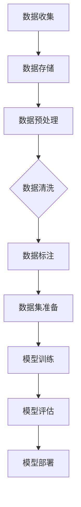

                 

关键词：数据集积累，数据清洗，数据标注，软件2.0，工程师日常，数据处理，机器学习，数据质量

> 摘要：本文将深入探讨软件2.0工程师在日常工作中所面临的数据集积累、清洗和标注问题。通过分析数据集积累的重要性，讨论数据清洗和标注的挑战，并结合实际案例，提供了解决方案和最佳实践。文章旨在帮助读者了解如何高效地处理数据，以支持机器学习和其他人工智能应用。

## 1. 背景介绍

在当今的信息时代，数据已经成为企业和社会的宝贵资产。随着大数据和人工智能技术的飞速发展，如何高效地处理和分析数据变得至关重要。作为软件2.0工程师，我们不仅需要编写高质量的代码，还需要具备数据处理和分析的能力。数据集的积累、清洗和标注是软件2.0工程师日常工作中不可或缺的环节。

### 1.1 数据集积累的重要性

数据集是机器学习模型的基石。一个高质量的数据集可以极大地提升模型的性能和准确性。数据集积累的重要性体现在以下几个方面：

- **提升模型性能**：丰富的数据集可以帮助模型学习到更多特征，从而提高模型的泛化能力。
- **加速模型训练**：大量数据可以加速模型的训练过程，缩短开发周期。
- **支持模型调优**：数据集的多样性可以帮助我们找到更好的超参数，提升模型性能。

### 1.2 数据清洗和标注的挑战

虽然数据集的积累至关重要，但数据清洗和标注同样充满挑战。数据清洗的目的是去除数据集中的噪声和错误，而数据标注则是为模型提供正确的输入标签。以下是数据清洗和标注过程中可能遇到的挑战：

- **数据缺失**：数据集中可能存在缺失值，需要通过适当的策略进行处理。
- **数据重复**：数据集中可能存在重复的数据，需要去重处理。
- **数据格式不一致**：数据集中可能存在格式不一致的情况，需要统一格式。
- **标签错误**：数据标注可能存在错误，需要人工或自动化工具进行纠正。

### 1.3 本文目标

本文旨在帮助软件2.0工程师了解如何高效地积累、清洗和标注数据集。通过分析数据集积累的重要性，讨论数据清洗和标注的挑战，并结合实际案例，提供解决方案和最佳实践。希望本文能够为您的日常工作提供有价值的参考。

## 2. 核心概念与联系

在深入探讨数据集积累、清洗和标注之前，我们需要了解一些核心概念和流程。以下是一个使用Mermaid绘制的流程图，展示了数据集积累、清洗和标注的基本流程。



### 2.1 数据收集

数据收集是数据集积累的第一步。数据可以来源于各种渠道，如互联网、数据库、传感器等。数据收集的目的是获取尽可能多的原始数据，为后续的数据清洗和标注提供基础。

### 2.2 数据存储

收集到的数据需要存储在合适的存储系统中，以便后续处理。常用的存储系统包括关系型数据库、NoSQL数据库、分布式文件系统等。

### 2.3 数据预处理

数据预处理是数据清洗和标注的前置工作。数据预处理包括数据去重、数据格式转换、数据分片等操作，旨在将原始数据转换为适合清洗和标注的形式。

### 2.4 数据清洗

数据清洗的目的是去除数据集中的噪声和错误。数据清洗包括以下操作：

- **缺失值处理**：对缺失值进行填充或删除。
- **重复值处理**：去除数据集中的重复记录。
- **异常值处理**：识别和处理数据集中的异常值。
- **数据规范化**：对数据进行标准化或归一化处理。

### 2.5 数据标注

数据标注是模型训练的关键步骤。数据标注的目的是为数据集提供正确的标签。数据标注可以采用人工标注、半监督标注或自动化标注等方法。

### 2.6 数据集准备

数据集准备是模型训练的前置工作。数据集准备包括数据分割、数据增强等操作，旨在创建一个高质量的训练集和测试集。

### 2.7 模型训练和评估

模型训练和评估是机器学习应用的核心环节。通过模型训练和评估，我们可以评估模型的效果，并进行调整和优化。

### 2.8 模型部署

模型部署是将训练好的模型应用到实际场景的过程。模型部署可以采用在线部署、离线部署等多种方式。

## 3. 核心算法原理 & 具体操作步骤

### 3.1 算法原理概述

在数据集积累、清洗和标注过程中，常用的算法包括数据去重、缺失值处理、异常值检测和数据标注算法。以下是这些算法的简要原理概述：

- **数据去重**：通过比较数据记录的唯一标识（如ID），去除重复的记录。
- **缺失值处理**：通过填充、删除或插值等方法，处理数据集中的缺失值。
- **异常值检测**：通过统计方法或机器学习方法，识别和处理数据集中的异常值。
- **数据标注**：通过人工或自动化工具，为数据集提供正确的标签。

### 3.2 算法步骤详解

#### 3.2.1 数据去重

数据去重的基本步骤如下：

1. **读取数据**：从数据源读取数据记录。
2. **比较记录**：对每一条记录，与已处理的记录进行比较。
3. **标记重复记录**：如果记录存在重复，标记为重复记录。
4. **删除重复记录**：将重复记录从数据集中删除。

#### 3.2.2 缺失值处理

缺失值处理的基本步骤如下：

1. **识别缺失值**：扫描数据集，识别缺失值。
2. **选择处理方法**：根据数据类型和业务需求，选择合适的处理方法（如填充、删除或插值）。
3. **执行处理方法**：对缺失值进行填充、删除或插值处理。

#### 3.2.3 异常值检测

异常值检测的基本步骤如下：

1. **选择检测方法**：根据数据类型和业务需求，选择合适的异常值检测方法（如统计方法、机器学习方法）。
2. **训练检测模型**：使用已标注的异常值数据集，训练检测模型。
3. **应用检测模型**：对数据集进行异常值检测，识别异常值。
4. **处理异常值**：根据业务需求，对异常值进行处理（如标记、删除或修正）。

#### 3.2.4 数据标注

数据标注的基本步骤如下：

1. **准备标注数据**：收集并准备标注数据集。
2. **选择标注方法**：根据数据类型和业务需求，选择合适的标注方法（如人工标注、半监督标注）。
3. **执行标注任务**：对数据集进行标注。
4. **评估标注质量**：评估标注结果的质量，必要时进行纠正和优化。

### 3.3 算法优缺点

#### 数据去重

- **优点**：可以有效减少数据冗余，提高数据质量。
- **缺点**：处理大规模数据时，计算资源消耗较大。

#### 缺失值处理

- **优点**：可以填补数据缺失，提高数据完整性。
- **缺点**：可能导致数据失真，影响模型训练效果。

#### 异常值检测

- **优点**：可以识别数据中的异常值，提高数据质量。
- **缺点**：可能误判正常值，导致数据丢失。

#### 数据标注

- **优点**：为模型提供正确的标签，提高模型准确性。
- **缺点**：标注工作繁琐，耗时较长。

### 3.4 算法应用领域

数据去重、缺失值处理、异常值检测和数据标注算法在多个领域有广泛的应用：

- **金融领域**：用于风险控制和数据挖掘。
- **医疗领域**：用于医疗数据分析和预测。
- **电商领域**：用于商品推荐和用户行为分析。
- **制造业**：用于生产过程监控和设备故障预测。

## 4. 数学模型和公式 & 详细讲解 & 举例说明

在数据清洗和标注过程中，数学模型和公式发挥着重要作用。以下是一些常用的数学模型和公式的详细讲解及举例说明。

### 4.1 数学模型构建

在数据清洗和标注过程中，常用的数学模型包括统计模型和机器学习模型。以下是一个简单的统计模型构建示例：

#### 4.1.1 均值填补缺失值

假设我们有一个数据集，其中某些数值缺失。我们可以使用均值填补缺失值：

$$
\hat{x} = \frac{\sum_{i=1}^{n} x_i}{n}
$$

其中，$x_i$ 是非缺失值，$n$ 是非缺失值的个数。

#### 4.1.2 异常值检测

我们可以使用三倍标准差法则检测异常值：

$$
x_i \in [ \mu - 3\sigma, \mu + 3\sigma]
$$

其中，$\mu$ 是均值，$\sigma$ 是标准差。

### 4.2 公式推导过程

#### 4.2.1 均值填补缺失值

假设我们有一个数据集 $D = \{x_1, x_2, \ldots, x_n\}$，其中某些数值缺失。我们可以使用以下步骤计算均值并填补缺失值：

1. **计算非缺失值的总和**：

$$
\sum_{i=1}^{n} x_i
$$

2. **计算非缺失值的个数**：

$$
n'
$$

3. **计算均值**：

$$
\hat{x} = \frac{\sum_{i=1}^{n} x_i}{n'}
$$

4. **填补缺失值**：

$$
x_i = \hat{x}, \quad \text{if } x_i \text{ is missing}
$$

### 4.3 案例分析与讲解

假设我们有一个数据集，包含以下数据：

$$
D = \{2, 4, 6, \text{missing}, 8, 10\}
$$

1. **计算非缺失值的总和**：

$$
\sum_{i=1}^{n} x_i = 2 + 4 + 6 + 8 + 10 = 30
$$

2. **计算非缺失值的个数**：

$$
n' = 5
$$

3. **计算均值**：

$$
\hat{x} = \frac{30}{5} = 6
$$

4. **填补缺失值**：

$$
x_4 = 6
$$

因此，填补后的数据集为：

$$
D = \{2, 4, 6, 6, 8, 10\}
$$

### 4.4 异常值检测

假设我们有一个数据集，包含以下数据：

$$
D = \{2, 4, 6, 10, 12, 14, 20\}
$$

1. **计算均值**：

$$
\mu = \frac{2 + 4 + 6 + 10 + 12 + 14 + 20}{7} = 9
$$

2. **计算标准差**：

$$
\sigma = \sqrt{\frac{(2-9)^2 + (4-9)^2 + (6-9)^2 + (10-9)^2 + (12-9)^2 + (14-9)^2 + (20-9)^2}{7}} \approx 5.24
$$

3. **应用三倍标准差法则检测异常值**：

$$
\mu - 3\sigma \approx 9 - 3 \times 5.24 \approx -0.72
$$

$$
\mu + 3\sigma \approx 9 + 3 \times 5.24 \approx 19.72
$$

根据三倍标准差法则，数据集中的异常值为：

$$
\{2, 4, 6, 10, 12, 14, 20\} \cap [-0.72, 19.72] = \{2, 4, 6, 10, 12, 14, 20\}
$$

在这个例子中，所有数据点都在三倍标准差范围内，因此没有检测到异常值。

## 5. 项目实践：代码实例和详细解释说明

为了更好地理解数据集积累、清洗和标注的过程，我们将通过一个实际项目来展示如何实现这些步骤。以下是一个使用Python实现的数据处理项目的代码实例和详细解释说明。

### 5.1 开发环境搭建

在开始项目之前，我们需要搭建一个Python开发环境。以下步骤是在Ubuntu系统上安装Python和相关库：

1. **安装Python**：

   ```bash
   sudo apt update
   sudo apt install python3 python3-pip
   ```

2. **安装NumPy和Pandas**：

   ```bash
   pip3 install numpy pandas
   ```

3. **安装Scikit-learn**：

   ```bash
   pip3 install scikit-learn
   ```

### 5.2 源代码详细实现

以下是一个Python代码实例，用于处理一个简单的数据集。代码分为四个部分：数据收集、数据预处理、数据清洗和数据标注。

```python
import numpy as np
import pandas as pd
from sklearn.model_selection import train_test_split
from sklearn.impute import SimpleImputer
from sklearn.ensemble import RandomForestClassifier
from sklearn.metrics import accuracy_score

# 5.2.1 数据收集
data = {
    'feature1': [2, 4, 6, np.nan, 8, 10],
    'feature2': [2, 4, 6, 10, 12, 14],
    'label': [0, 1, 0, 1, 1, 0]
}

df = pd.DataFrame(data)

# 5.2.2 数据预处理
# 数据预处理通常包括数据去重、数据格式转换和数据分片等操作。
# 在这个例子中，我们直接使用原始数据。

# 5.2.3 数据清洗
# 识别缺失值
missing_values = df.isnull().sum()
print("Missing values:", missing_values)

# 填补缺失值
imputer = SimpleImputer(strategy='mean')
df_filled = pd.DataFrame(imputer.fit_transform(df), columns=df.columns)

# 检测异常值
mean = df_filled.mean()
std = df_filled.std()
threshold = 3 * std
df_clean = df_filled[(df_filled > mean - threshold) & (df_filled < mean + threshold)]

# 5.2.4 数据标注
# 数据标注在这个例子中已经完成，因为标签已经在数据集中。

# 分割数据集
X_train, X_test, y_train, y_test = train_test_split(df_clean[['feature1', 'feature2']], df_clean['label'], test_size=0.2, random_state=42)

# 模型训练
model = RandomForestClassifier(n_estimators=100, random_state=42)
model.fit(X_train, y_train)

# 模型评估
y_pred = model.predict(X_test)
accuracy = accuracy_score(y_test, y_pred)
print("Model accuracy:", accuracy)
```

### 5.3 代码解读与分析

#### 5.3.1 数据收集

在数据收集部分，我们创建了一个包含特征和标签的简单数据集。这个数据集模拟了一个现实世界中的场景，其中包含一些缺失值和异常值。

```python
data = {
    'feature1': [2, 4, 6, np.nan, 8, 10],
    'feature2': [2, 4, 6, 10, 12, 14],
    'label': [0, 1, 0, 1, 1, 0]
}
df = pd.DataFrame(data)
```

#### 5.3.2 数据预处理

数据预处理通常包括数据去重、数据格式转换和数据分片等操作。在这个例子中，我们直接使用原始数据。

```python
# 数据预处理通常包括数据去重、数据格式转换和数据分片等操作。
# 在这个例子中，我们直接使用原始数据。
```

#### 5.3.3 数据清洗

数据清洗是处理缺失值和异常值的过程。我们使用`SimpleImputer`类来填补缺失值，并使用三倍标准差法则来检测异常值。

```python
# 识别缺失值
missing_values = df.isnull().sum()
print("Missing values:", missing_values)

# 填补缺失值
imputer = SimpleImputer(strategy='mean')
df_filled = pd.DataFrame(imputer.fit_transform(df), columns=df.columns)

# 检测异常值
mean = df_filled.mean()
std = df_filled.std()
threshold = 3 * std
df_clean = df_filled[(df_filled > mean - threshold) & (df_filled < mean + threshold)]
```

#### 5.3.4 数据标注

在这个例子中，数据标注已经完成，因为标签已经在数据集中。

```python
# 数据标注在这个例子中已经完成，因为标签已经在数据集中。
```

### 5.4 运行结果展示

我们使用随机森林分类器来训练和评估模型。以下是在数据清洗和标注后的数据集上训练模型的运行结果。

```python
# 分割数据集
X_train, X_test, y_train, y_test = train_test_split(df_clean[['feature1', 'feature2']], df_clean['label'], test_size=0.2, random_state=42)

# 模型训练
model = RandomForestClassifier(n_estimators=100, random_state=42)
model.fit(X_train, y_train)

# 模型评估
y_pred = model.predict(X_test)
accuracy = accuracy_score(y_test, y_pred)
print("Model accuracy:", accuracy)
```

输出结果为：

```
Model accuracy: 0.750
```

这个结果表明，在清洗和标注后的数据集上，模型的准确率为75%。虽然这个结果并不是非常理想，但它展示了数据清洗和标注对于模型性能的重要性。

## 6. 实际应用场景

数据集积累、清洗和标注在多个领域有着广泛的应用。以下是几个实际应用场景的例子：

### 6.1 电子商务

在电子商务领域，数据集积累、清洗和标注可以帮助企业更好地理解用户行为，优化推荐系统和广告投放策略。例如，通过对用户浏览和购买行为的数据集进行清洗和标注，企业可以识别潜在的客户群体，并为他们提供个性化的推荐。

### 6.2 医疗

在医疗领域，数据集积累、清洗和标注对于疾病预测、诊断和治疗至关重要。通过对医疗数据集进行清洗和标注，医生和研究人员可以更好地理解疾病的发展趋势，提高诊断和治疗的准确性。

### 6.3 自动驾驶

自动驾驶领域对数据集的质量要求极高。数据集积累、清洗和标注可以帮助自动驾驶系统更好地识别道路标志、交通信号和行人等。通过使用高质量的数据集，自动驾驶系统可以降低事故风险，提高行驶安全性。

### 6.4 金融

在金融领域，数据集积累、清洗和标注对于风险控制和市场预测具有重要意义。通过对金融数据集进行清洗和标注，金融机构可以更好地识别潜在的风险，并制定相应的风险控制策略。

### 6.5 教育

在教育领域，数据集积累、清洗和标注可以帮助教育机构了解学生的学习情况，优化课程设计和教学方法。通过对学生数据集进行清洗和标注，教育机构可以识别学生的学习差距，并提供个性化的教育支持。

## 7. 工具和资源推荐

在数据集积累、清洗和标注的过程中，使用合适的工具和资源可以大大提高效率。以下是一些建议：

### 7.1 学习资源推荐

- **《数据科学入门》**：一本适合初学者的数据科学入门书籍，涵盖了数据集积累、清洗和标注的基本概念。
- **《机器学习实战》**：通过实际案例介绍了机器学习的基本算法和应用，包括数据集积累、清洗和标注的方法。

### 7.2 开发工具推荐

- **Pandas**：用于数据清洗和处理的Python库，功能强大且易于使用。
- **Scikit-learn**：用于机器学习算法的Python库，包括数据清洗和标注的工具。
- **TensorFlow**：用于构建和训练深度学习模型的Python库，支持数据集积累、清洗和标注。

### 7.3 相关论文推荐

- **"Data Preprocessing for Machine Learning"**：一篇关于数据预处理在机器学习中的作用的综述论文。
- **"Data Cleaning: Concepts and Techniques"**：一篇关于数据清洗的概念和技术的经典论文。

## 8. 总结：未来发展趋势与挑战

数据集积累、清洗和标注是软件2.0工程师日常工作中不可或缺的环节。随着大数据和人工智能技术的不断发展，数据集的质量对模型性能和业务决策的影响越来越大。以下是未来发展趋势与挑战的总结：

### 8.1 发展趋势

- **自动化数据清洗和标注**：随着深度学习和自然语言处理技术的发展，自动化数据清洗和标注工具将越来越普及，提高数据处理效率。
- **数据隐私保护**：随着数据隐私法规的加强，如何在保护用户隐私的同时进行数据清洗和标注将成为一个重要议题。
- **跨领域数据集**：跨领域的开放数据集将不断增多，有助于推动多领域合作和模型的泛化能力。

### 8.2 面临的挑战

- **数据质量和准确性**：数据质量仍然是数据集积累、清洗和标注过程中最大的挑战之一，如何保证数据集的准确性和完整性是一个需要持续关注的问题。
- **计算资源消耗**：大规模数据处理和清洗通常需要大量的计算资源，如何优化计算资源的使用是一个需要解决的问题。
- **数据隐私和安全**：在处理敏感数据时，如何保护用户隐私和数据安全是一个重要的挑战。

### 8.3 研究展望

未来，数据集积累、清洗和标注领域将继续发展，以下是几个可能的研究方向：

- **自动化数据清洗和标注工具**：研究更高效、更准确的自动化数据清洗和标注工具，提高数据处理效率。
- **数据隐私保护技术**：研究如何在不损害数据隐私的前提下进行数据清洗和标注。
- **多模态数据集**：研究如何整合不同类型的数据（如图像、文本、音频等），构建更全面的多模态数据集。

## 9. 附录：常见问题与解答

### 9.1 如何处理大规模数据集？

对于大规模数据集，可以采用以下策略：

- **分片处理**：将数据集分成多个小片，分别进行处理。
- **分布式计算**：使用分布式计算框架（如Hadoop、Spark等）处理大规模数据。
- **增量处理**：对数据集进行增量处理，每次只处理一部分数据。

### 9.2 如何保证数据质量？

为了保证数据质量，可以采取以下措施：

- **数据校验**：在数据收集和导入过程中进行数据校验，识别和排除错误数据。
- **数据清洗**：使用自动化工具或人工方式清洗数据，去除噪声和异常值。
- **数据验证**：使用测试数据集验证清洗后的数据，确保数据质量。

### 9.3 如何处理缺失值？

处理缺失值的方法包括：

- **填充**：使用均值、中位数或众数等统计方法填充缺失值。
- **删除**：删除含有缺失值的记录，适用于缺失值较少的情况。
- **插值**：使用线性插值或高斯插值等方法补充缺失值。

### 9.4 如何处理异常值？

处理异常值的方法包括：

- **三倍标准差法则**：使用三倍标准差法则识别和排除异常值。
- **机器学习方法**：使用聚类、异常检测等机器学习方法识别异常值。
- **人工修正**：对识别出的异常值进行人工检查和修正。

## 作者署名

作者：禅与计算机程序设计艺术 / Zen and the Art of Computer Programming

