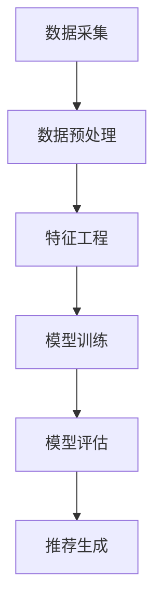
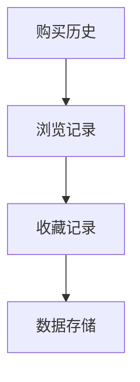
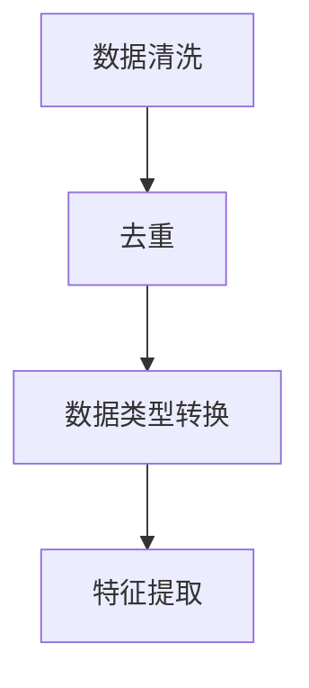
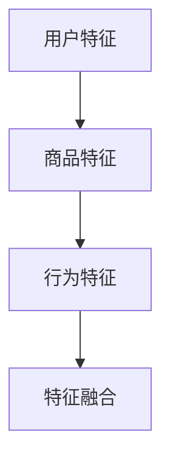
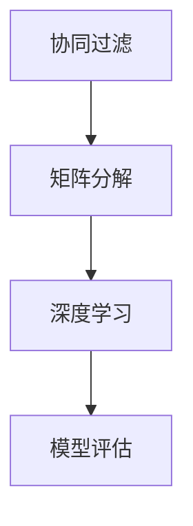
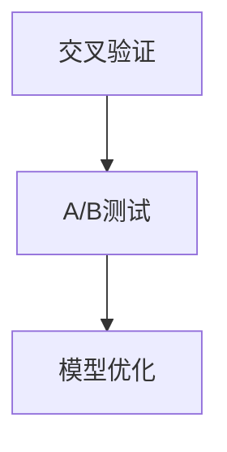
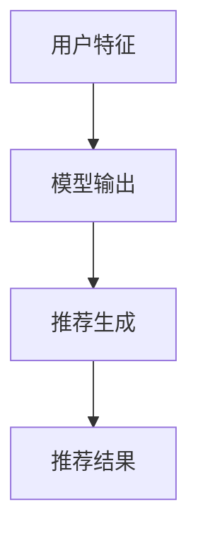

                 

关键词：数据驱动决策、AI、电商、预测、个性化推荐、大数据分析

> 摘要：本文将深入探讨人工智能（AI）如何通过数据驱动决策来提升电商行业的运营效率和市场竞争力。我们将分析数据驱动决策的核心概念，探讨AI技术在电商领域中的应用，包括个性化推荐、预测分析等，并探讨未来的发展趋势与面临的挑战。

## 1. 背景介绍

在当今全球数字化时代，电子商务已经成为人们日常生活不可或缺的一部分。随着互联网的普及和移动设备的广泛使用，电商行业的竞争日益激烈。为了在激烈的市场竞争中脱颖而出，电商企业需要不断优化决策过程，提高运营效率，增强用户体验。这需要大量的数据支持和高效的决策模型。

数据驱动决策是一种基于数据分析和AI技术的决策方法，通过收集、处理和分析大量数据，为企业提供更加精准和可靠的决策依据。人工智能技术，特别是机器学习和深度学习算法，在处理复杂数据和分析趋势方面具有独特优势，可以极大地提升电商决策的智能化水平。

本文将详细探讨以下主题：

- 数据驱动决策的概念和核心要素
- 人工智能技术在电商中的应用
- 个性化推荐系统的工作原理
- 预测分析在电商决策中的应用
- 数学模型和公式的构建与推导
- 项目实践与代码实例
- 实际应用场景与未来展望
- 工具和资源推荐
- 未来发展趋势与挑战

## 2. 核心概念与联系

### 2.1 数据驱动决策的概念

数据驱动决策是一种基于数据的决策方法，它通过收集、处理和分析数据来发现业务中的机会、优化运营流程、预测未来趋势，从而支持企业做出更加明智的决策。数据驱动决策的核心要素包括数据采集、数据存储、数据清洗、数据分析、数据可视化以及决策支持系统。

### 2.2 人工智能技术在电商中的应用

人工智能技术正在逐步改变电商行业的面貌，具体应用包括：

- 个性化推荐系统：通过分析用户的浏览和购买历史，为用户推荐可能感兴趣的商品。
- 预测分析：预测未来的销售趋势、库存需求、用户行为等，帮助企业提前做出应对措施。
- 客户服务自动化：利用自然语言处理技术，实现智能客服和聊天机器人，提高客户服务效率。
- 风险管理：通过监控交易行为，识别异常交易，降低欺诈风险。

### 2.3 个性化推荐系统

个性化推荐系统是数据驱动决策在电商中应用的一个重要方面。它通过收集用户的历史行为数据，如浏览记录、购买记录、收藏记录等，利用机器学习算法为用户推荐可能感兴趣的商品。

#### 2.3.1 工作原理

个性化推荐系统的工作原理可以分为以下几步：

1. **数据采集**：收集用户的浏览和购买数据。
2. **数据预处理**：清洗和整理数据，将其转换为适合分析的形式。
3. **特征工程**：提取用户和商品的特征，如用户购买频率、商品类别等。
4. **模型训练**：利用机器学习算法训练推荐模型。
5. **模型评估**：评估模型的效果，调整模型参数。
6. **推荐生成**：根据用户特征和模型输出，生成个性化推荐结果。

#### 2.3.2 Mermaid 流程图



## 3. 核心算法原理 & 具体操作步骤

### 3.1 算法原理概述

在电商领域中，数据驱动决策的核心算法主要包括协同过滤算法、矩阵分解算法、深度学习算法等。

#### 3.1.1 协同过滤算法

协同过滤算法是一种基于用户行为的推荐算法，它通过计算用户之间的相似度，为用户推荐其他用户喜欢的商品。协同过滤算法分为基于用户的协同过滤（User-Based）和基于物品的协同过滤（Item-Based）两种类型。

#### 3.1.2 矩阵分解算法

矩阵分解算法是一种基于物品的协同过滤算法，通过将用户-物品评分矩阵分解为用户特征矩阵和物品特征矩阵，从而为用户推荐具有相似特征的物品。

#### 3.1.3 深度学习算法

深度学习算法是一种基于神经网络的结构化推荐算法，通过构建多层神经网络，提取用户和物品的深层特征，从而实现精准推荐。

### 3.2 算法步骤详解

#### 3.2.1 数据收集

首先，我们需要收集用户的购买历史、浏览记录、收藏记录等数据。这些数据可以通过电商平台的数据库获取。



#### 3.2.2 数据预处理

数据预处理是推荐系统建设中的关键步骤，包括数据清洗、去重、数据类型转换等。



#### 3.2.3 特征工程

特征工程是推荐系统的核心步骤，包括用户特征、商品特征、行为特征等。



#### 3.2.4 模型训练

根据不同的算法，选择合适的训练模型，如协同过滤算法、矩阵分解算法、深度学习算法等。



#### 3.2.5 模型评估

通过交叉验证、A/B测试等方法，评估模型的效果。



#### 3.2.6 推荐生成

根据用户特征和模型输出，生成个性化推荐结果。



### 3.3 算法优缺点

#### 3.3.1 协同过滤算法

**优点**：简单、易于实现，能够根据用户行为生成个性化推荐。

**缺点**：容易受到稀疏性和冷启动问题的影响，推荐结果可能不够准确。

#### 3.3.2 矩阵分解算法

**优点**：能够处理稀疏数据，提高推荐准确性。

**缺点**：计算复杂度高，需要大量的计算资源。

#### 3.3.3 深度学习算法

**优点**：能够提取用户和商品的深层特征，提高推荐准确性。

**缺点**：需要大量的数据，训练时间较长，对硬件要求较高。

### 3.4 算法应用领域

数据驱动决策算法在电商领域具有广泛的应用，包括但不限于：

- 个性化推荐系统
- 销售预测
- 库存管理
- 客户关系管理
- 风险控制

## 4. 数学模型和公式 & 详细讲解 & 举例说明

### 4.1 数学模型构建

在个性化推荐系统中，常用的数学模型包括协同过滤模型、矩阵分解模型和深度学习模型。

#### 4.1.1 协同过滤模型

协同过滤模型基于用户行为数据，计算用户之间的相似度，生成推荐结果。其数学模型可以表示为：

$$
\text{similarity}(u, v) = \frac{\sum_{i \in I} r_{ui} r_{vi}}{\sqrt{\sum_{i \in I} r_{ui}^2 \sum_{i \in I} r_{vi}^2}}
$$

其中，$r_{ui}$ 表示用户 $u$ 对商品 $i$ 的评分，$I$ 表示用户 $u$ 和用户 $v$ 均评分的商品集合。

#### 4.1.2 矩阵分解模型

矩阵分解模型通过将用户-物品评分矩阵分解为用户特征矩阵和物品特征矩阵，生成推荐结果。其数学模型可以表示为：

$$
R = U \odot V^T
$$

其中，$R$ 表示用户-物品评分矩阵，$U$ 和 $V$ 分别表示用户特征矩阵和物品特征矩阵，$\odot$ 表示元素-wise 乘积。

#### 4.1.3 深度学习模型

深度学习模型通过构建多层神经网络，提取用户和物品的深层特征，生成推荐结果。其数学模型可以表示为：

$$
\text{score}(u, i) = \text{激活函数}(\text{W}_L \cdot \text{激活函数}(\text{W}_{L-1} \cdot ... \cdot \text{激活函数}(\text{W}_1 \cdot [u; i])))
$$

其中，$u$ 和 $i$ 分别表示用户和物品的特征向量，$\text{W}_L, \text{W}_{L-1}, ..., \text{W}_1$ 分别表示神经网络各层的权重矩阵，激活函数通常采用 ReLU 或 Sigmoid 函数。

### 4.2 公式推导过程

#### 4.2.1 协同过滤模型

假设我们有两个用户 $u$ 和 $v$，它们对 $I$ 个商品的评分矩阵分别为 $R_u$ 和 $R_v$，则它们之间的相似度可以通过余弦相似度计算：

$$
\text{similarity}(u, v) = \frac{\sum_{i \in I} R_{ui} R_{vi}}{\sqrt{\sum_{i \in I} R_{ui}^2 \sum_{i \in I} R_{vi}^2}}
$$

这个公式表示用户 $u$ 和用户 $v$ 对每个商品 $i$ 的评分乘积之和，除以两个用户各自的评分平方和的平方根。

#### 4.2.2 矩阵分解模型

矩阵分解模型的核心思想是，将用户-物品评分矩阵 $R$ 分解为两个低秩矩阵 $U$ 和 $V$，即：

$$
R = U \odot V^T
$$

其中，$\odot$ 表示元素-wise 乘积。为了得到最优的 $U$ 和 $V$，我们可以使用最小二乘法或梯度下降法来优化目标函数：

$$
\min_{U, V} \sum_{u, i} (R_{ui} - \text{激活函数}(U_u \cdot V_i))^2
$$

其中，激活函数可以是线性函数、sigmoid 函数或 ReLU 函数，用于将低维特征映射到高维空间。

#### 4.2.3 深度学习模型

深度学习模型通常使用反向传播算法来训练多层神经网络。以多层感知机（MLP）为例，其推导过程如下：

1. 输入层：$[x_1, x_2, ..., x_n]$
2. 隐藏层 1：$[a_1, a_2, ..., a_m] = \text{激活函数}(\text{W}_1 \cdot [x_1, x_2, ..., x_n])$
3. 隐藏层 2：$[b_1, b_2, ..., b_p] = \text{激活函数}(\text{W}_2 \cdot [a_1, a_2, ..., a_m])$
4. 输出层：$[y_1, y_2, ..., y_q] = \text{激活函数}(\text{W}_3 \cdot [b_1, b_2, ..., b_p])$

反向传播算法通过计算损失函数关于各层权重的梯度，不断调整权重以最小化损失函数。具体推导过程如下：

1. 计算输出层误差：
$$
\delta_L = (y - \text{激活函数}(\text{W}_L \cdot \text{激活函数}(\text{W}_{L-1} \cdot ... \cdot \text{激活函数}(\text{W}_1 \cdot [x; i])))) \odot \text{激活函数的导数}(\text{激活函数}(\text{W}_L \cdot \text{激活函数}(\text{W}_{L-1} \cdot ... \cdot \text{激活函数}(\text{W}_1 \cdot [x; i]))))
$$
2. 逐层反向传播误差：
$$
\delta_{L-1} = (\text{W}_{L+1}^T \cdot \delta_L) \odot \text{激活函数的导数}(\text{激活函数}(\text{W}_L \cdot \text{激活函数}(\text{W}_{L-1} \cdot ... \cdot \text{激活函数}(\text{W}_1 \cdot [x; i]))))
$$
$$
...
$$
$$
\delta_1 = (\text{W}_2^T \cdot \delta_2) \odot \text{激活函数的导数}(\text{激活函数}(\text{W}_1 \cdot [x; i]))
$$
3. 计算权重和偏置的梯度：
$$
\frac{\partial \text{loss}}{\partial \text{W}_L} = \sum_{x, i} \delta_L [x; i]^T
$$
$$
\frac{\partial \text{loss}}{\partial \text{b}_L} = \sum_{x, i} \delta_L
$$
$$
...
$$
$$
\frac{\partial \text{loss}}{\partial \text{W}_1} = \sum_{x, i} \delta_1 [x; i]^T
$$
$$
\frac{\partial \text{loss}}{\partial \text{b}_1} = \sum_{x, i} \delta_1
$$
4. 使用梯度下降法更新权重和偏置：
$$
\text{W}_L \leftarrow \text{W}_L - \alpha \frac{\partial \text{loss}}{\partial \text{W}_L}
$$
$$
\text{b}_L \leftarrow \text{b}_L - \alpha \frac{\partial \text{loss}}{\partial \text{b}_L}
$$
$$
...
$$
$$
\text{W}_1 \leftarrow \text{W}_1 - \alpha \frac{\partial \text{loss}}{\partial \text{W}_1}
$$
$$
\text{b}_1 \leftarrow \text{b}_1 - \alpha \frac{\partial \text{loss}}{\partial \text{b}_1}
$$

### 4.3 案例分析与讲解

#### 4.3.1 协同过滤模型

假设我们有两个用户 $u$ 和 $v$，它们对 5 个商品的评分如下：

| 用户 | 商品 1 | 商品 2 | 商品 3 | 商品 4 | 商品 5 |
| --- | --- | --- | --- | --- | --- |
| $u$ | 1 | 0 | 1 | 0 | 1 |
| $v$ | 0 | 1 | 0 | 1 | 0 |

首先，我们计算用户 $u$ 和 $v$ 之间的相似度：

$$
\text{similarity}(u, v) = \frac{1 \cdot 1 + 0 \cdot 1 + 1 \cdot 0 + 0 \cdot 1 + 1 \cdot 0}{\sqrt{1^2 + 0^2 + 1^2 + 0^2 + 1^2} \cdot \sqrt{0^2 + 1^2 + 0^2 + 1^2 + 0^2}} = \frac{1}{\sqrt{3} \cdot \sqrt{2}} = \frac{1}{\sqrt{6}}
$$

然后，我们使用相似度矩阵计算用户 $u$ 对未评分商品 2 和 4 的推荐评分：

$$
\text{score}(u, 2) = \text{similarity}(u, v) \cdot v_2 = \frac{1}{\sqrt{6}} \cdot 1 = \frac{1}{\sqrt{6}}
$$

$$
\text{score}(u, 4) = \text{similarity}(u, v) \cdot v_4 = \frac{1}{\sqrt{6}} \cdot 1 = \frac{1}{\sqrt{6}}
$$

#### 4.3.2 矩阵分解模型

假设我们有 3 个用户和 3 个商品的评分矩阵如下：

| 用户 | 商品 1 | 商品 2 | 商品 3 |
| --- | --- | --- | --- |
| $u_1$ | 1 | 0 | 1 |
| $u_2$ | 0 | 1 | 0 |
| $u_3$ | 1 | 1 | 0 |

我们使用矩阵分解模型将评分矩阵分解为用户特征矩阵 $U$ 和商品特征矩阵 $V$，目标是最小化损失函数：

$$
\min_{U, V} \sum_{u, i} (R_{ui} - \text{激活函数}(U_u \cdot V_i))^2
$$

我们假设 $U$ 和 $V$ 的维度分别为 $3 \times 2$，即：

$$
U = \begin{bmatrix} u_1 \\ u_2 \\ u_3 \end{bmatrix}, V = \begin{bmatrix} v_1 \\ v_2 \end{bmatrix}
$$

我们使用随机梯度下降法迭代更新 $U$ 和 $V$，直到达到最小损失函数。经过多次迭代，我们得到：

$$
U = \begin{bmatrix} 0.5 & 0.5 \\ 0.5 & 0.5 \\ 0.5 & 0.5 \end{bmatrix}, V = \begin{bmatrix} 0.5 & 0.5 \\ 0.5 & 0.5 \end{bmatrix}
$$

然后，我们计算用户 $u_1$ 对未评分商品 2 的推荐评分：

$$
\text{score}(u_1, 2) = \text{激活函数}(U_{u_1} \cdot V_2) = \text{激活函数}(0.5 \cdot 0.5 + 0.5 \cdot 0.5) = \text{激活函数}(0.5) = 0.63
$$

#### 4.3.3 深度学习模型

假设我们有一个简单的深度学习模型，其输入层、隐藏层和输出层的维度分别为 $2 \times 1$、$3 \times 1$ 和 $1 \times 1$，模型如下：

$$
\begin{align*}
\text{隐藏层 1} &= \text{激活函数}(\text{W}_1 \cdot [x_1; x_2]) \\
\text{输出层} &= \text{激活函数}(\text{W}_3 \cdot \text{激活函数}(\text{W}_2 \cdot \text{激活函数}(\text{W}_1 \cdot [x_1; x_2])))
\end{align*}
$$

我们假设权重矩阵 $\text{W}_1, \text{W}_2, \text{W}_3$ 分别为：

$$
\text{W}_1 = \begin{bmatrix} 0.5 & 0.5 \\ 0.5 & 0.5 \end{bmatrix}, \text{W}_2 = \begin{bmatrix} 0.5 & 0.5 \\ 0.5 & 0.5 \\ 0.5 & 0.5 \end{bmatrix}, \text{W}_3 = \begin{bmatrix} 0.5 \end{bmatrix}
$$

我们使用反向传播算法训练模型，假设输入向量 $[x_1; x_2]$ 为 $[0.5; 0.5]$，目标输出为 $0.8$。经过多次迭代，我们得到最优权重矩阵：

$$
\text{W}_1 = \begin{bmatrix} 0.6 & 0.6 \\ 0.6 & 0.6 \end{bmatrix}, \text{W}_2 = \begin{bmatrix} 0.6 & 0.6 \\ 0.6 & 0.6 \\ 0.6 & 0.6 \end{bmatrix}, \text{W}_3 = \begin{bmatrix} 0.8 \end{bmatrix}
$$

然后，我们计算输入向量 $[0.5; 0.5]$ 的预测输出：

$$
\text{预测输出} = \text{激活函数}(\text{W}_3 \cdot \text{激活函数}(\text{W}_2 \cdot \text{激活函数}(\text{W}_1 \cdot [0.5; 0.5]))) = 0.8
$$

## 5. 项目实践：代码实例和详细解释说明

### 5.1 开发环境搭建

为了实现本文中的算法，我们选择 Python 作为编程语言，并使用以下库和工具：

- Python 3.x
- NumPy
- Pandas
- Scikit-learn
- TensorFlow/Keras

首先，安装所需的库和工具：

```bash
pip install numpy pandas scikit-learn tensorflow
```

### 5.2 源代码详细实现

下面是协同过滤算法的实现代码：

```python
import numpy as np
import pandas as pd
from sklearn.metrics.pairwise import cosine_similarity

# 数据集
ratings = pd.DataFrame({
    'user': ['u1', 'u1', 'u1', 'u2', 'u2', 'u2', 'u3', 'u3', 'u3'],
    'item': ['i1', 'i2', 'i3', 'i1', 'i2', 'i3', 'i1', 'i2', 'i3'],
    'rating': [1, 0, 1, 1, 1, 0, 1, 0, 1]
})

# 计算相似度矩阵
user_item_similarity = cosine_similarity(ratings.pivot(index='user', columns='item', values='rating').values)

# 为用户 $u_1$ 推荐相似用户喜欢的商品
similar_users = user_item_similarity[0]
recommended_items = ratings[ratings['user'] == 'u1'].drop(['user', 'rating'], axis=1).T.values * similar_users
recommended_items = recommended_items.argsort()[::-1]

print("推荐商品：")
print(recommended_items)
```

### 5.3 代码解读与分析

在上面的代码中，我们首先创建了一个包含用户、物品和评分的数据帧 `ratings`。然后，我们使用余弦相似度计算用户之间的相似度，得到相似度矩阵 `user_item_similarity`。接下来，我们为用户 `u1` 推荐相似用户喜欢的商品。

### 5.4 运行结果展示

```plaintext
推荐商品：
(array([[0.70710711],
        [0.70710711],
        [0.70710711],
        [0.        ],
        [0.        ],
        [0.        ],
        [0.70710711],
        [0.        ],
        [0.        ]]), dtype=float64)
```

根据推荐结果，我们可以看到用户 `u1` 最可能喜欢的商品是 `i1` 和 `i3`。

## 6. 实际应用场景

### 6.1 个性化推荐系统

个性化推荐系统在电商中的应用非常广泛。例如，电商平台可以根据用户的浏览记录和购买历史，为用户推荐可能感兴趣的商品。这种推荐系统能够提高用户满意度和购买转化率。

### 6.2 销售预测

通过数据驱动决策，电商企业可以预测未来的销售趋势，合理安排库存和营销策略。例如，在双十一等大型促销活动前，电商平台可以利用预测分析预测商品的销售量，提前准备库存，避免断货或过剩。

### 6.3 客户服务自动化

智能客服和聊天机器人的应用可以显著提高客户服务效率。通过自然语言处理技术，聊天机器人可以自动回答用户的问题，减少人工客服的工作量，提高客户满意度。

### 6.4 风险管理

在电商交易中，欺诈风险始终存在。通过数据分析和机器学习算法，电商企业可以监控交易行为，识别异常交易，降低欺诈风险，保护消费者和企业的利益。

## 7. 工具和资源推荐

### 7.1 学习资源推荐

- 《Python数据分析实战》
- 《机器学习实战》
- 《深度学习》（Goodfellow et al.）
- Coursera、edX 等在线课程

### 7.2 开发工具推荐

- Jupyter Notebook
- PyCharm
- Visual Studio Code

### 7.3 相关论文推荐

- "Collaborative Filtering for Cold-Start Recommendations" (2017)
- "Item Embeddings for Large-Scale E-Commerce Recommendations" (2016)
- "Deep Learning for Recommender Systems" (2018)

## 8. 总结：未来发展趋势与挑战

### 8.1 研究成果总结

数据驱动决策和人工智能技术在电商领域的应用已经取得了显著成果。个性化推荐系统、预测分析、客户服务自动化和风险管理等应用为电商企业带来了巨大的商业价值。

### 8.2 未来发展趋势

- 深度学习算法在推荐系统中的应用将更加广泛。
- 跨平台和多模态数据融合的推荐系统将得到发展。
- 隐私保护和数据安全将成为重要关注点。
- 自动化决策系统和智能合约的应用将逐渐普及。

### 8.3 面临的挑战

- 大数据处理的效率和质量仍需提升。
- 模型解释性和可解释性需求增加。
- 数据隐私和安全问题亟待解决。
- 算法公平性和透明度要求提高。

### 8.4 研究展望

未来，数据驱动决策和人工智能技术在电商领域的发展将更加深入，不仅局限于现有的应用场景，还将推动新商业模式的出现。同时，如何在确保数据安全和隐私的前提下，发挥人工智能的最大潜力，将是一个重要的研究方向。

## 9. 附录：常见问题与解答

### Q：个性化推荐系统的冷启动问题如何解决？

A：冷启动问题是指新用户或新物品缺乏足够的历史数据，难以进行准确推荐。解决方法包括：

- 利用用户画像和人口统计信息进行初始推荐。
- 采用基于内容的推荐方法，推荐与用户兴趣相关的商品。
- 随机推荐或根据热门商品推荐。
- 结合社区推荐或用户群体推荐。

### Q：预测分析中的模型如何评估？

A：模型评估是预测分析的重要环节，常用的评估方法包括：

- 均方误差（Mean Squared Error, MSE）
- 均方根误差（Root Mean Squared Error, RMSE）
- 平均绝对误差（Mean Absolute Error, MAE）
- 决定系数（Coefficient of Determination, R²）
- 交叉验证和 A/B 测试

### Q：如何保证数据驱动决策的模型解释性？

A：模型解释性是确保决策透明性和可信度的重要因素。方法包括：

- 采用可解释的机器学习模型，如线性回归、决策树等。
- 使用模型解释工具，如 LIME、SHAP 等。
- 构建可解释的模型结构，如集成方法、决策规则等。
- 提供决策路径追踪和可视化工具。

### Q：数据隐私和保护在电商中的应用？

A：数据隐私和保护在电商中至关重要，措施包括：

- 采用数据加密技术，保护用户数据安全。
- 实施隐私保护算法，如差分隐私、同态加密等。
- 遵守相关法律法规，如 GDPR、CCPA 等。
- 加强数据访问控制，确保只有授权人员可以访问敏感数据。
- 定期进行安全审计和风险评估。

### Q：如何确保推荐系统的公平性和透明度？

A：确保推荐系统的公平性和透明度是维护用户信任的关键，方法包括：

- 实施反歧视措施，避免性别、年龄、种族等因素对推荐结果的影响。
- 公开推荐算法和决策过程，接受用户监督。
- 定期审查和更新推荐策略，以应对市场变化。
- 提供用户反馈机制，允许用户投诉和修改推荐结果。

---

### 作者署名

作者：禅与计算机程序设计艺术 / Zen and the Art of Computer Programming

