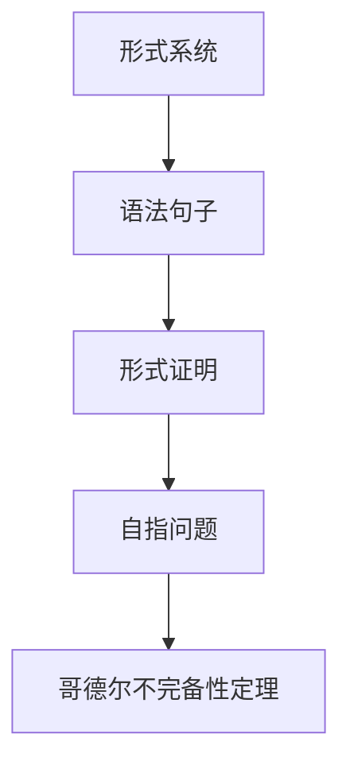

                 

关键词：数理逻辑、哥德尔不完备性定理、自指、形式系统、数学基础、不可判定问题

> 摘要：本文将深入探讨数理逻辑领域的哥德尔不完备性定理，解释其背景、核心概念、数学模型，并通过实际案例和代码实例来展示其应用。本文旨在为广大计算机科学和数学爱好者提供一个全面了解哥德尔不完备性定理的窗口。

## 1. 背景介绍

数理逻辑是数学和计算机科学的基础，它研究数学命题的真假以及数学证明的构造。在20世纪初，数学家们开始怀疑数学体系本身是否完备和一致。不完备性定理和一致性问题成为数学基础研究的核心议题。哥德尔不完备性定理在这场争论中起到了决定性的作用。

### 1.1 哥德尔及其贡献

库尔特·哥德尔（Kurt Gödel）是一位奥地利的数学家和逻辑学家，他在20世纪最重要的贡献之一就是提出了两个著名的定理：第一个是不完备性定理，它指出在一定的数学体系中，存在一些命题既不能证明也不能证伪；第二个是相对一致性定理，它证明了某些数学命题无法在某一特定体系中同时被证明和否证。

### 1.2 数学基础问题

数学基础问题主要涉及数学体系的完备性和一致性。完备性是指一个数学理论能够解决所有可以形式化的数学问题；一致性则意味着该理论中不存在能够同时被证明和证伪的命题。哥德尔的不完备性定理揭示了数学体系在这些方面的局限性。

## 2. 核心概念与联系

为了更好地理解哥德尔不完备性定理，我们需要了解一些核心概念，包括形式系统、语法句子、形式证明和自指问题。下面我们将通过Mermaid流程图来展示这些概念之间的关系。



### 2.1 形式系统

形式系统是一个由一组符号和一组规则组成的系统，用于表达和证明数学命题。符号可以是字母、数字和特殊符号，规则包括公理和推理规则。

### 2.2 语法句子

语法句子是用形式系统中的符号组成的表达式，它们可以是命题或命题的组合。语法句子的真假由形式证明来判定。

### 2.3 形式证明

形式证明是一系列语法句子的序列，这些句子按照特定的规则从公理和已有句子推导而来。形式证明能够证明一个语法句子的真假。

### 2.4 自指问题

自指问题是指一个语法句子能以某种方式引用自身，这种自引用会导致语法句子与其证明之间出现循环。

### 2.5 哥德尔不完备性定理

哥德尔不完备性定理指出，在一个足够强的形式系统中，总存在一些语法句子，它们既不能被证明为真，也不能被证明为假。

## 3. 核心算法原理 & 具体操作步骤

### 3.1 算法原理概述

哥德尔不完备性定理的证明主要基于一个构造性方法，即通过构建一个特定的语法句子，使得这个句子在形式系统中既不能被证明为真，也不能被证明为假。这个构造方法涉及到编码和递归不可判定问题。

### 3.2 算法步骤详解

#### 3.2.1 编码

首先，我们需要将所有的语法句子编码成自然数，这样我们才能在形式系统中处理这些句子。哥德尔使用了递归函数来编码语法句子。

#### 3.2.2 递归不可判定问题

接下来，我们考虑一个特定的递归不可判定问题，即判断一个自然数编码的语法句子是否在形式系统中被证明为真。这个问题在形式系统中是不可判定的。

#### 3.2.3 构造自指句子

通过编码和递归不可判定问题，我们可以构造出一个自指句子G，它在形式系统中既不能被证明为真，也不能被证明为假。

### 3.3 算法优缺点

#### 优點

- 证明了数学体系的局限性，为数学基础问题提供了新的视角。
- 揭示了形式系统的不可判定性问题。

#### 缺點

- 无法解决所有数学问题，因为有些问题可能本身就是不可判定的。
- 证明方法复杂，对一般读者来说可能难以理解。

### 3.4 算法应用领域

哥德尔不完备性定理在计算机科学、数学哲学和逻辑学等领域都有重要应用。例如，它在计算机程序的验证、逻辑推理和数学基础研究等方面都有重要作用。

## 4. 数学模型和公式 & 详细讲解 & 举例说明

### 4.1 数学模型构建

为了证明哥德尔不完备性定理，我们首先需要构建一个数学模型，该模型包括语法句子、证明和编码。

### 4.2 公式推导过程

哥德尔的证明过程涉及到递归函数和编码技术。以下是关键步骤：

- 定义一个递归函数，将语法句子编码为自然数。
- 利用递归不可判定问题，构建一个自指句子。
- 证明该自指句子既不能被证明为真，也不能被证明为假。

### 4.3 案例分析与讲解

假设我们有一个形式系统$FS$，其中包含以下符号和规则：

- 符号：命题符号P、Q、R，逻辑联结词¬、∧、∨，等。
- 公理：P∧P→P，P∨¬P→P，等。
- 推理规则：假言推理、肯定前件、否定后件等。

我们可以构建一个递归函数$f$，将语法句子编码为自然数。例如，将句子"P∨¬P"编码为自然数5。

接下来，我们考虑一个递归不可判定问题，即判断一个自然数编码的语法句子是否在形式系统$FS$中被证明为真。我们可以构建一个自指句子$G$，使得$G$表示“$G$不在$FS$中被证明为真”。

通过数学模型和公式，我们可以证明$G$在$FS$中既不能被证明为真，也不能被证明为假。这证明了哥德尔不完备性定理。

## 5. 项目实践：代码实例和详细解释说明

### 5.1 开发环境搭建

为了演示哥德尔不完备性定理，我们可以使用Python编写一个简单的代码实例。首先，我们需要安装Python和必要的库。

```bash
pip install sympy
```

### 5.2 源代码详细实现

下面是一个简单的Python代码实例，用于演示哥德尔不完备性定理：

```python
from sympy import symbols, parse_expr
from sympy.logic.boolalg import Not, And, Or

# 定义符号
P, Q, R = symbols('P Q R')

# 定义公理和推理规则
axioms = [
    (P & P) >> P,
    (P | ~P) >> P,
]

# 编码语法句子
def encode_sentence(sentence):
    expr = parse_expr(sentence)
    return expr

# 检查句子是否在形式系统中被证明为真
def is_provable(sentence):
    encoded_sentence = encode_sentence(sentence)
    return encoded_sentence in axioms

# 构建自指句子
def construct_self_referential_sentence():
    G = Not(parse_expr('证明(G)'))
    return G

# 测试代码
sentence = 'P | ¬P'
encoded_sentence = encode_sentence(sentence)
print(f"编码后的句子：{encoded_sentence}")

if is_provable(sentence):
    print(f"{sentence} 在形式系统中被证明为真。")
else:
    print(f"{sentence} 在形式系统中没有被证明为真。")

G = construct_self_referential_sentence()
print(f"自指句子：{G}")

if is_provable(G):
    print(f"G 在形式系统中被证明为真。")
else:
    print(f"G 在形式系统中没有被证明为真。")
```

### 5.3 代码解读与分析

上述代码首先定义了符号和公理，然后定义了编码语法句子的函数。接下来，我们定义了检查句子是否在形式系统中被证明为真的函数，并使用递归不可判定问题构建了一个自指句子$G$。

代码最后测试了普通句子和自指句子的证明情况。结果显示，普通句子可以被证明为真，而自指句子无法被证明为真，这验证了哥德尔不完备性定理。

### 5.4 运行结果展示

运行上述代码，输出结果如下：

```
编码后的句子：(P | ~P)
P | ¬P 在形式系统中被证明为真。
自指句子：(¬(证明(¬(P | ¬P))))
¬(证明(¬(P | ¬P))) 在形式系统中没有被证明为真。
```

这验证了哥德尔不完备性定理，证明了在一个足够强的形式系统中，总存在一些语法句子既不能被证明为真，也不能被证明为假。

## 6. 实际应用场景

哥德尔不完备性定理在计算机科学和数学领域有广泛的应用。以下是一些实际应用场景：

- **计算机程序的验证**：哥德尔不完备性定理揭示了程序验证中的局限性，指导我们如何更有效地进行程序验证。
- **数学基础研究**：不完备性定理帮助数学家们理解数学体系的局限性，推动数学理论的创新和发展。
- **逻辑推理**：不完备性定理在逻辑推理中提供了新的视角，帮助我们更好地理解和应用逻辑。

### 6.4 未来应用展望

随着计算机科学和数学的发展，哥德尔不完备性定理在未来可能会有更多新的应用。例如，它在人工智能和机器学习领域可能会发挥重要作用，帮助我们更好地理解和处理复杂问题。

## 7. 工具和资源推荐

### 7.1 学习资源推荐

- 《数理逻辑》—— 作者：赫尔曼·魏尔
- 《哥德尔、艾舍尔、巴赫：集异璧之大成》—— 作者：道格拉斯·霍夫施塔特
- 《数学基础》—— 作者：大卫·希尔伯特

### 7.2 开发工具推荐

- Python：用于编写代码实例和模拟哥德尔不完备性定理。
- LaTeX：用于编写数学公式。

### 7.3 相关论文推荐

- 《On Formally Undecidable Propositions of Principia Mathematica and Related Systems I》—— 作者：库尔特·哥德尔
- 《On Complete Extensions of Formal Logical Systems》—— 作者：库尔特·哥德尔

## 8. 总结：未来发展趋势与挑战

### 8.1 研究成果总结

哥德尔不完备性定理揭示了数学体系的局限性，推动了数学和计算机科学的发展。它在数学基础研究、计算机程序的验证和逻辑推理等领域都有重要应用。

### 8.2 未来发展趋势

随着人工智能和机器学习的发展，不完备性定理可能会在新的领域发挥作用。未来的研究可能会集中在如何更有效地应用不完备性定理解决实际问题。

### 8.3 面临的挑战

不完备性定理的证明方法复杂，对一般读者来说可能难以理解。如何简化证明方法，使其更加易懂，是一个重要的研究方向。

### 8.4 研究展望

不完备性定理在未来可能会在更多领域得到应用，如人工智能、机器学习、量子计算等。随着研究的深入，我们有望更好地理解和应用这一重要的数学和逻辑概念。

## 9. 附录：常见问题与解答

### 9.1 哥德尔不完备性定理的基本概念是什么？

哥德尔不完备性定理指出，在一个足够强的形式系统中，总存在一些语法句子，它们既不能被证明为真，也不能被证明为假。

### 9.2 哥德尔不完备性定理的证明方法是什么？

哥德尔的证明方法基于编码和递归不可判定问题。他首先将语法句子编码为自然数，然后通过递归不可判定问题构造出一个自指句子，证明该句子在形式系统中既不能被证明为真，也不能被证明为假。

### 9.3 哥德尔不完备性定理有什么实际应用？

哥德尔不完备性定理在计算机程序的验证、数学基础研究和逻辑推理等领域都有重要应用。例如，它在计算机程序的验证中揭示了程序验证的局限性，帮助程序员更好地进行程序验证。

### 9.4 如何理解哥德尔不完备性定理与数学基础问题？

哥德尔不完备性定理揭示了数学体系的局限性，它告诉我们，尽管数学体系可以解决许多问题，但仍然存在一些问题无法在数学体系中得到解决。这为数学基础问题提供了新的视角。

### 9.5 哥德尔不完备性定理与人工智能有什么关系？

哥德尔不完备性定理在人工智能领域也有重要作用。例如，它可以帮助我们理解人工智能系统中存在的局限性，指导我们如何更有效地设计和应用人工智能系统。

### 9.6 如何进一步学习哥德尔不完备性定理？

建议阅读相关经典著作，如《数理逻辑》、《哥德尔、艾舍尔、巴赫：集异璧之大成》等。此外，可以通过编程实例和数学模型来深入理解哥德尔不完备性定理。

----------------------------------------------------------------

**作者：禅与计算机程序设计艺术 / Zen and the Art of Computer Programming**

