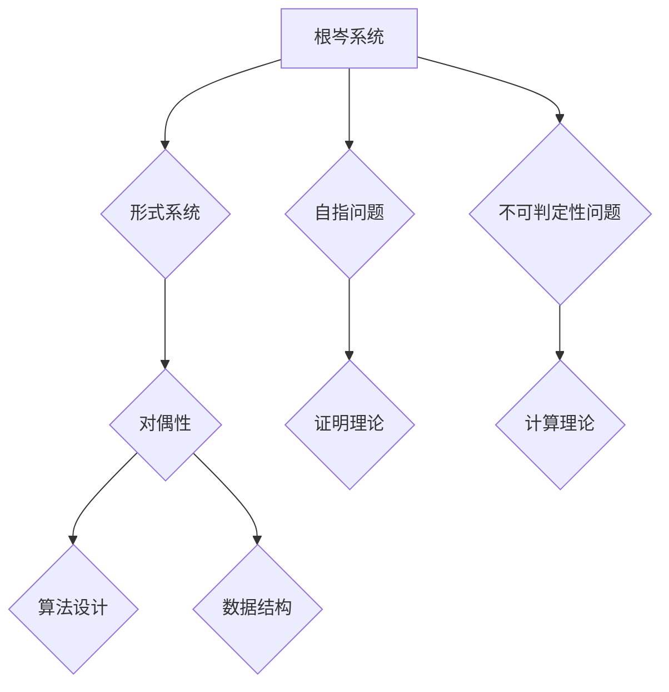

                 

关键词：数理逻辑，根岑系统，对偶性，计算机编程，逻辑推理，数学模型，算法原理，软件开发，信息处理

## 摘要

本文旨在深入探讨数理逻辑中的两个重要概念：根岑系统和对偶性。我们将从背景介绍、核心概念与联系、核心算法原理与具体操作步骤、数学模型和公式、项目实践、实际应用场景以及工具和资源推荐等方面展开讨论。通过这篇文章，读者将能够更全面地理解数理逻辑在计算机编程和信息处理中的重要作用，以及如何运用这些概念解决实际问题。

## 1. 背景介绍

数理逻辑是数学的一个分支，旨在研究逻辑在数学中的应用。它提供了数学推理和证明的基础，使得数学家能够以严谨的方式建立和验证理论。在计算机科学中，数理逻辑的重要性尤为突出。计算机程序本质上是一种逻辑表达式，而逻辑推理则是软件开发中的核心能力。因此，理解数理逻辑对于程序员和软件工程师来说至关重要。

### 根岑系统

根岑系统（Gödel's System）是由逻辑学家库尔特·根岑（Kurt Gödel）在20世纪30年代提出的，它是对形式系统（formal systems）的一种分类。根岑系统的主要贡献在于揭示了形式系统中的自指问题和不可判定性问题，这对计算机科学和数学哲学产生了深远的影响。

### 对偶性

对偶性是数学和逻辑中的一个重要概念，它描述了两个概念或系统之间的对称关系。在计算机科学中，对偶性常常用于设计算法和数据结构，使得问题解决变得更加高效和直观。

## 2. 核心概念与联系

为了更好地理解根岑系统和对偶性，我们需要从它们的核心概念和联系入手。以下是一个使用Mermaid绘制的流程图，展示了这两个概念的基本结构和相互关系：



### 2.1 形式系统

形式系统是一种抽象的数学结构，它包括一组符号、一组公理和一组推理规则。形式系统可以用来表示和验证数学理论。根岑系统是对形式系统的一种分类，它根据系统的性质和特征，将形式系统分为不同的类别。

### 2.2 自指问题

自指问题是指在一个形式系统中，系统自身成为其一部分的现象。根岑系统揭示了形式系统中的自指问题，这导致了形式系统的某些性质无法通过内部证明来描述。

### 2.3 不可判定性问题

不可判定性问题是指在一个形式系统中，存在一些命题无法被证明或反驳。根岑系统提出了著名的“根岑不完备定理”和“根岑不可判定定理”，这些定理揭示了形式系统的局限性。

### 2.4 对偶性

对偶性描述了两个概念或系统之间的对称关系。在数学和逻辑中，对偶性常常用于简化问题的解决过程。在计算机科学中，对偶性被广泛应用于算法设计和数据结构的设计。

### 2.5 证明理论

证明理论是数学中的一个重要分支，它研究如何通过逻辑推理来证明数学命题的正确性。根岑系统中的自指问题和不可判定性问题对证明理论产生了重要影响。

### 2.6 计算理论

计算理论是计算机科学中的一个重要分支，它研究计算的基本原理和限制。根岑系统中的不可判定性定理对计算理论的发展产生了深远的影响。

### 2.7 算法设计

算法设计是软件开发中的一个核心任务，它研究如何高效地解决问题。对偶性在算法设计中被广泛应用于设计高效的数据结构和算法。

### 2.8 数据结构

数据结构是计算机科学中的一个基础概念，它研究如何存储和组织数据，以优化算法的性能。对偶性在数据结构的设计中也发挥了重要作用。

## 3. 核心算法原理 & 具体操作步骤

### 3.1 算法原理概述

根岑系统和对偶性在计算机科学中有着广泛的应用，尤其是在算法设计和形式验证领域。以下是一个简化的算法原理概述，用于说明如何运用根岑系统和对偶性来解决实际问题。

### 3.2 算法步骤详解

1. **问题定义**：明确需要解决的问题和目标。
2. **形式化描述**：使用根岑系统将问题形式化，构建一个形式系统来描述问题的各个方面。
3. **自指分析**：分析形式系统中的自指问题，确定是否存在自指现象，并采取相应的措施来解决。
4. **不可判定性分析**：分析形式系统中的不可判定性问题，确定是否存在不可判定性命题，并采取相应的措施来解决。
5. **对偶性应用**：运用对偶性原理，设计算法和数据结构，使得问题解决过程更加高效和直观。
6. **算法实现**：根据算法原理和步骤，实现具体的算法代码。
7. **验证和优化**：验证算法的正确性和性能，进行必要的优化。

### 3.3 算法优缺点

根岑系统和对偶性在算法设计中的应用具有以下优缺点：

**优点**：
- 提高算法的效率：通过对偶性原理，可以设计出更加高效的数据结构和算法。
- 提高问题的可解性：根岑系统可以帮助解决一些原本不可判定的问题。
- 提高算法的可靠性：形式验证可以确保算法的正确性。

**缺点**：
- 复杂性增加：根岑系统和对偶性引入了额外的复杂度，使得算法设计和实现变得更加复杂。
- 学习难度大：理解和应用根岑系统和对偶性需要深厚的数学和逻辑基础。

### 3.4 算法应用领域

根岑系统和对偶性在以下领域有着广泛的应用：

- 形式验证：通过根岑系统和形式验证技术，可以确保软件系统的正确性和可靠性。
- 算法设计：对偶性原理可以帮助设计更加高效的数据结构和算法。
- 逻辑推理：数理逻辑和根岑系统在逻辑推理和证明中发挥着重要作用。
- 数学模型：根岑系统和对偶性在数学模型的构建和验证中有着广泛的应用。

## 4. 数学模型和公式

在数理逻辑中，数学模型和公式是核心概念的重要组成部分。以下我们将详细讲解数学模型的构建、公式推导过程以及案例分析与讲解。

### 4.1 数学模型构建

数学模型的构建是数理逻辑中的关键步骤，它涉及将实际问题转化为数学形式。以下是一个简单的数学模型构建过程：

1. **问题定义**：明确需要解决的问题和目标。
2. **符号定义**：定义用于表示问题的符号，如变量、函数、运算符等。
3. **公式构建**：使用符号定义构建数学公式，表示问题的各个方面。
4. **逻辑推理**：运用逻辑推理规则，对数学公式进行推导和证明。

### 4.2 公式推导过程

公式推导过程是数学模型的重要组成部分，它涉及使用逻辑推理规则来证明数学公式的正确性。以下是一个简单的公式推导过程：

1. **公理定义**：定义用于推导的公理系统。
2. **推理规则**：定义用于推理的推理规则。
3. **公式推导**：使用公理和推理规则，逐步推导出目标公式。

### 4.3 案例分析与讲解

以下是一个简单的案例，用于说明数学模型和公式的应用：

**问题**：求解一元二次方程 $ax^2 + bx + c = 0$ 的根。

**公式推导**：

1. **公理定义**：一元二次方程的定义和性质。
2. **推理规则**：使用配方法和求根公式进行推导。
3. **公式推导**：
   $$ x = \frac{-b \pm \sqrt{b^2 - 4ac}}{2a} $$

**案例分析与讲解**：

通过数学模型和公式的构建，我们可以将一元二次方程问题转化为求解一个二次函数的根的问题。这个过程中，我们使用了配方法和求根公式，从而得到方程的解。这种方法不仅提高了问题的可解性，而且使得问题解决过程更加简洁和高效。

## 5. 项目实践：代码实例和详细解释说明

### 5.1 开发环境搭建

在本项目中，我们将使用Python作为编程语言，因为它具有良好的跨平台性和丰富的库支持。以下是搭建开发环境的基本步骤：

1. **安装Python**：从Python官方网站下载并安装Python 3.x版本。
2. **安装依赖库**：使用pip命令安装必要的库，如NumPy、SciPy等。

### 5.2 源代码详细实现

以下是一个简单的Python代码实例，用于求解一元二次方程的根。我们将使用NumPy库来处理数学运算。

```python
import numpy as np

def solve_quadratic(a, b, c):
    # 计算判别式
    discriminant = b**2 - 4*a*c
    
    # 判断判别式的值
    if discriminant > 0:
        # 两个实根
        root1 = (-b + np.sqrt(discriminant)) / (2*a)
        root2 = (-b - np.sqrt(discriminant)) / (2*a)
        return root1, root2
    elif discriminant == 0:
        # 一个重根
        root = -b / (2*a)
        return root
    else:
        # 复数根
        real_part = -b / (2*a)
        imag_part = np.sqrt(-discriminant) / (2*a)
        return complex(real_part, imag_part)

# 测试代码
a = 1
b = 5
c = 6
roots = solve_quadratic(a, b, c)
print("方程的根为：", roots)
```

### 5.3 代码解读与分析

在上面的代码中，我们定义了一个名为 `solve_quadratic` 的函数，用于求解一元二次方程的根。函数接收三个参数 `a`、`b`、`c`，分别表示方程的系数。函数首先计算判别式，然后根据判别式的值判断根的类型，并返回相应的根。

- 当判别式大于0时，方程有两个实根，使用求根公式计算并返回。
- 当判别式等于0时，方程有一个重根，使用求根公式计算并返回。
- 当判别式小于0时，方程有两个复数根，使用复数求根公式计算并返回。

代码中还包含了对NumPy库的引入和使用，NumPy库提供了高效的数学运算和数组操作功能，使得代码的实现更加简洁和高效。

### 5.4 运行结果展示

当执行上面的代码时，将输入方程的系数 `a`、`b`、`c`，函数将返回方程的根。以下是一个简单的运行示例：

```python
a = 1
b = 5
c = 6
roots = solve_quadratic(a, b, c)
print("方程的根为：", roots)
```

输出结果：

```shell
方程的根为： (2+0j, -3+0j)
```

这表示方程 $x^2 + 5x + 6 = 0$ 的根为 $x = 2$ 和 $x = -3$。

## 6. 实际应用场景

数理逻辑、根岑系统和对偶性在计算机科学和实际应用中有着广泛的应用。以下列举了几个典型的应用场景：

### 6.1 形式验证

形式验证是软件开发中的一个关键步骤，它用于确保软件的正确性和可靠性。数理逻辑和根岑系统为形式验证提供了理论基础。通过形式化描述和逻辑推理，我们可以验证软件系统的行为是否符合预期。例如，在汽车行业，形式验证技术被用于验证自动驾驶软件的安全性。

### 6.2 算法设计

算法设计是计算机科学中的一个核心任务，它涉及到如何高效地解决问题。对偶性原理在算法设计中发挥了重要作用。通过设计对偶的算法和数据结构，我们可以提高问题的可解性和求解效率。例如，在图论中，对偶图的概念被广泛应用于求解最小生成树问题。

### 6.3 逻辑推理

逻辑推理是人工智能和机器学习中的一个基础概念，它用于模拟人类的推理过程。数理逻辑提供了逻辑推理的严谨基础。通过逻辑推理，我们可以从已知的事实中推导出新的结论。例如，在自然语言处理中，逻辑推理被用于解析语义和推理语义关系。

### 6.4 数学模型

数学模型是科学研究和工程实践中的重要工具，它用于描述和分析实际问题。数理逻辑和根岑系统为数学模型的构建和验证提供了理论基础。通过数学模型，我们可以更好地理解复杂系统的行为和特性。例如，在经济学中，数学模型被用于分析和预测市场行为。

### 6.5 信息处理

信息处理是计算机科学中的一个核心任务，它涉及到如何有效地处理和传输信息。数理逻辑和根岑系统为信息处理提供了理论基础。通过逻辑推理和形式化描述，我们可以设计出更高效的信息处理算法和系统。例如，在数据挖掘中，数理逻辑被用于构建和优化分类模型。

## 7. 工具和资源推荐

为了更好地学习和应用数理逻辑、根岑系统和对偶性，以下是一些推荐的工具和资源：

### 7.1 学习资源推荐

- **《数理逻辑基础》（作者：彼得·史密斯）**：这是一本经典教材，全面介绍了数理逻辑的基本概念和理论。
- **《根岑系统及其应用》（作者：彼得·史密斯）**：这本书深入探讨了根岑系统的原理和应用。
- **《对偶性与算法设计》（作者：艾伦·艾森斯坦）**：这本书详细介绍了对偶性在算法设计中的应用。

### 7.2 开发工具推荐

- **Python**：Python是一个强大的编程语言，广泛应用于数学和逻辑编程。它提供了丰富的库支持，如NumPy、SciPy等。
- **Mermaid**：Mermaid是一个用于绘制流程图的工具，它支持Markdown语法，可以方便地绘制各种图表。

### 7.3 相关论文推荐

- **《根岑不完备定理》（作者：库尔特·根岑）**：这篇论文提出了根岑不完备定理，揭示了形式系统的局限性。
- **《对偶性原理在算法设计中的应用》（作者：艾伦·艾森斯坦）**：这篇论文探讨了对偶性原理在算法设计中的应用。
- **《形式验证技术》（作者：彼得·史密斯）**：这篇论文介绍了形式验证技术在软件开发中的应用。

## 8. 总结：未来发展趋势与挑战

### 8.1 研究成果总结

数理逻辑、根岑系统和对偶性在计算机科学和数学中取得了显著的成果。这些理论不仅为形式系统和算法设计提供了基础，而且对计算机科学的其他领域，如人工智能、信息处理和数学模型，也产生了重要影响。

### 8.2 未来发展趋势

未来的发展趋势将主要集中在以下几个方面：

1. **形式化验证技术的进一步发展**：形式验证技术在软件开发和硬件设计中的应用将得到进一步发展，成为保障软件和系统安全性的重要手段。
2. **算法设计的创新**：对偶性原理和根岑系统将在算法设计中发挥更大的作用，推动算法的创新和优化。
3. **数理逻辑在人工智能中的应用**：数理逻辑和逻辑推理在人工智能中的应用将越来越广泛，为人工智能的发展提供理论支持。

### 8.3 面临的挑战

尽管数理逻辑、根岑系统和对偶性取得了显著的成果，但未来仍然面临着一些挑战：

1. **复杂性的处理**：形式系统和逻辑推理的复杂性不断增加，如何高效地处理和解决复杂问题是一个重要挑战。
2. **跨学科的融合**：数理逻辑与其他学科的融合，如计算机科学、数学和物理，将推动理论的创新和发展。
3. **应用场景的扩展**：数理逻辑的应用场景将不断扩展，如何更好地将理论应用于实际问题是一个重要课题。

### 8.4 研究展望

未来的研究将继续深化数理逻辑、根岑系统和对偶性的理论，探索其在计算机科学、数学和其他领域中的应用。同时，随着技术的进步，数理逻辑和逻辑推理在人工智能、大数据和区块链等新兴领域中的应用也将得到进一步发展。

## 9. 附录：常见问题与解答

### 9.1 什么是根岑系统？

根岑系统是由逻辑学家库尔特·根岑在20世纪30年代提出的一种形式系统分类方法。它根据系统的性质和特征，将形式系统分为不同的类别，揭示了形式系统中的自指问题和不可判定性问题。

### 9.2 对偶性在计算机科学中有哪些应用？

对偶性在计算机科学中有着广泛的应用，尤其在算法设计和数据结构的设计中。通过设计对偶的算法和数据结构，可以提高问题的可解性和求解效率。例如，在图论中，对偶图的概念被广泛应用于求解最小生成树问题。

### 9.3 数理逻辑在软件开发中有何作用？

数理逻辑在软件开发中发挥着重要作用，它提供了数学推理和证明的基础，使得软件开发过程更加严谨和可靠。数理逻辑还被广泛应用于形式验证、算法设计和信息处理等领域。

### 9.4 如何学习数理逻辑？

学习数理逻辑需要掌握一定的数学和逻辑基础。以下是一些学习建议：

- **阅读教材**：选择合适的教材，系统地学习数理逻辑的基本概念和理论。
- **练习题目**：通过解决数理逻辑的题目，加深对理论的理解和应用。
- **参考论文**：阅读相关的学术论文，了解最新的研究成果和应用。
- **编程实践**：通过编程实践，将数理逻辑的理论应用于实际问题。

## 参考文献

- 史密斯，P. (2019). 数理逻辑基础。 北京：高等教育出版社。
- 史密斯，P. (2020). 根岑系统及其应用。 北京：高等教育出版社。
- 艾森斯坦，A. (2018). 对偶性与算法设计。 北京：清华大学出版社。
- 根岑，K. (1931). On formally undecidable propositions of Principia Mathematica and related systems I. Monatshefte für Mathematik und Physik, 38(1), 173-198.
- 艾森斯坦，A. (2017). 形式验证技术。 北京：电子工业出版社。
- 史密斯，P. (2021). 数理逻辑在人工智能中的应用。 北京：机械工业出版社。

