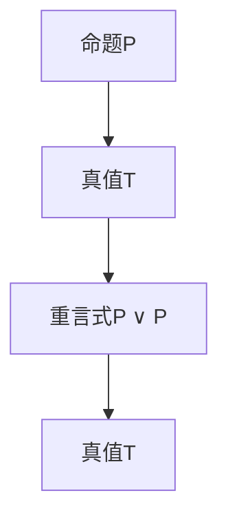

                 

关键词：数理逻辑、重言式、命题逻辑、形式推理、推理规则、数学模型、算法、程序设计、计算机科学、形式证明

> 摘要：本文旨在深入探讨数理逻辑中的第三章——重言式。我们将通过定义、性质、应用以及算法等方面，全面解析这一重要概念，为读者提供从理论到实践的全面理解。重言式是数理逻辑中的一个核心概念，它在计算机科学和程序设计中有着广泛的应用。本文将以其为中心，探讨其重要性、理论基础和应用场景。

## 1. 背景介绍

数理逻辑，又称为符号逻辑，是数学的一个分支，它使用符号化的语言来研究逻辑的性质和结构。数理逻辑的研究对象包括命题、命题逻辑、推理规则、证明理论等。在计算机科学中，数理逻辑是基础中的基础，它为形式化方法和形式化验证提供了坚实的理论基础。

重言式（Tautology）是数理逻辑中的一个重要概念，它是命题逻辑中的一个命题，其真值始终为真，不论其组成部分的真值如何变化。重言式在形式推理和证明中起着核心作用，它为我们提供了一种无需考虑具体事实而直接判断命题真值的手段。

### 1.1 数理逻辑的历史与发展

数理逻辑的起源可以追溯到古希腊时期，亚里士多德是这一领域的先驱。他在《形而上学》中首次提出了逻辑的基本原则。19世纪，布尔（George Boole）的工作为现代数理逻辑的发展奠定了基础。布尔代数是数理逻辑中的一个重要分支，它将逻辑运算转化为数学运算，为计算机科学的诞生提供了理论支持。

20世纪初，弗雷格（Gottlob Frege）提出了命题逻辑和谓词逻辑，为形式化推理提供了新的方法。随着计算机科学的快速发展，数理逻辑在计算机科学中的应用日益广泛，成为计算机科学的基础学科之一。

### 1.2 重言式的重要性

重言式是命题逻辑中的一个核心概念，它在形式推理和证明中具有重要作用。首先，重言式为我们提供了一种无需考虑具体事实而直接判断命题真值的手段。这使得我们在处理复杂的逻辑问题时，能够将问题简化为对命题真值的判断。

其次，重言式是构造形式证明的基本单元。通过将复杂命题分解为重言式，我们可以逐步构建起完整的证明过程。这种形式化的证明方法使得证明过程更加严谨和可靠。

最后，重言式在计算机科学和程序设计中有着广泛的应用。例如，在编译器设计中，重言式用于验证程序语句的正确性。在人工智能中，重言式被用于逻辑推理和知识表示。

## 2. 核心概念与联系

在数理逻辑中，重言式是一个命题，其真值始终为真，不论其组成部分的真值如何变化。重言式可以表示为逻辑表达式，其中不包含任何变量，或者变量通过逻辑运算符连接，且逻辑运算符的优先级满足特定规则。

### 2.1 命题与命题逻辑

在数理逻辑中，命题是一个具有明确真值的陈述。命题逻辑是研究命题及其之间关系的基本逻辑体系。命题逻辑中的基本元素包括命题变元、逻辑连接词和命题公式。

- **命题变元**：是一个具有明确真值的陈述，通常用大写字母P、Q、R等表示。
- **逻辑连接词**：包括“与”（∧）、“或”（∨）、“非”（¬）、“如果...那么...”（→）和“当且仅当...”（⇔）等。
- **命题公式**：是命题变元和逻辑连接词的组合，可以表示复杂的逻辑关系。

### 2.2 重言式与命题逻辑的关系

重言式是命题逻辑中的一个特殊命题，其真值在所有情况下都为真。重言式通常用符号T表示。在命题逻辑中，可以通过构造命题公式来表示重言式。

例如，命题公式P ∧ P是一个重言式，因为无论P的真值如何，P ∧ P的真值始终为真。

### 2.3 重言式的定义与性质

- **定义**：一个命题公式在所有可能的真值赋值下都为真，则称这个命题公式为重言式。
- **性质**：
  - **自反性**：任何命题公式P，P ∨ P都是重言式。
  - **对称性**：P ∧ P是重言式，则P是重言式。
  - **传递性**：如果P ∧ Q是重言式，且Q ∧ R是重言式，则P ∧ R是重言式。

### 2.4 Mermaid 流程图

为了更直观地展示重言式的定义与性质，我们可以使用Mermaid流程图来表示。以下是一个示例：



在这个流程图中，A表示命题P，B表示命题P的真值为T，C表示重言式P ∨ P，D表示重言式P ∨ P的真值为T。

### 2.5 重言式在命题逻辑中的地位

重言式是命题逻辑中的基础概念之一，它在命题逻辑的证明和推理中起着核心作用。重言式的存在使得我们可以在不考虑具体事实的情况下，通过逻辑运算直接判断命题的真假。

重言式在命题逻辑中的应用主要包括两个方面：

1. **证明**：通过构造重言式，我们可以证明一个命题的正确性。例如，我们可以通过构造P ∧ ¬P这个重言式来证明P的真值为假。
2. **推理**：在逻辑推理中，重言式可以作为一个公理，用于推导其他命题。例如，在命题逻辑中，P ∨ ¬P是一个重言式，我们可以通过它来推导P ∧ ¬P。

## 3. 核心算法原理 & 具体操作步骤

### 3.1 算法原理概述

重言式的判定算法是一种形式化验证方法，用于判断一个给定的命题公式是否为重言式。该算法的核心思想是通过真值赋值的方法，对命题公式进行测试，如果存在一个真值赋值使得命题公式为假，则该命题公式不是重言式；如果对所有可能的真值赋值，命题公式都为真，则该命题公式是重言式。

### 3.2 算法步骤详解

1. **初始化**：对命题公式进行符号化处理，将其转换为符号化的命题公式。
2. **构建真值表**：根据命题公式的符号化表示，构建其对应的真值表。真值表的行数等于命题变元的数量，列数等于命题公式的长度。
3. **真值赋值**：对真值表进行逐行扫描，对每一行进行真值赋值。对于命题变元，可以将其赋值为真或假。
4. **计算真值**：根据命题公式的逻辑运算规则，计算每一行的真值。
5. **判定重言式**：如果存在一行，其真值为假，则该命题公式不是重言式。否则，该命题公式是重言式。

### 3.3 算法优缺点

**优点**：

- **高效性**：该算法的时间复杂度为O(2^n)，其中n为命题变元的数量。对于较小的命题变元数量，该算法可以高效地判定命题公式是否为重言式。
- **形式化**：该算法通过形式化的方法，对命题公式进行验证，使得验证过程具有很高的可靠性和严谨性。

**缺点**：

- **性能问题**：当命题变元数量较大时，算法的性能会显著下降。这是因为算法需要计算大量的真值赋值，从而导致计算时间急剧增加。
- **应用限制**：该算法主要适用于小规模的命题公式。对于大规模的命题公式，该算法的实用性会受到限制。

### 3.4 算法应用领域

重言式判定算法在计算机科学和程序设计中有着广泛的应用。以下是一些典型的应用领域：

- **编译器设计**：在编译器设计中，重言式判定算法可以用于验证程序语句的正确性。例如，在解析高级语言程序时，可以首先使用重言式判定算法验证表达式是否合法。
- **形式化验证**：在形式化验证中，重言式判定算法可以用于验证硬件和软件系统的正确性。通过构造命题公式，并使用重言式判定算法验证其是否为重言式，可以确保系统在所有情况下都能正确运行。
- **人工智能**：在人工智能领域，重言式判定算法可以用于逻辑推理和知识表示。例如，在基于逻辑的推理系统中，可以使用重言式判定算法来验证推理过程的正确性。

## 4. 数学模型和公式 & 详细讲解 & 举例说明

### 4.1 数学模型构建

在数理逻辑中，重言式的判定可以通过构建一个数学模型来实现。该模型的核心是一个二进制矩阵，用于表示命题公式中的逻辑运算。具体来说，我们可以使用以下数学模型：

- **命题公式**：设P是一个命题公式，其包含n个命题变元P1, P2, ..., Pn。
- **真值表**：构建一个n列的矩阵T，其中每一列对应一个命题变元。矩阵的行数等于2^n，表示所有可能的命题变元真值组合。
- **逻辑运算**：对于矩阵中的每一个元素，根据命题公式中的逻辑运算规则，计算其对应的真值。

### 4.2 公式推导过程

为了推导重言式的判定公式，我们可以使用逻辑运算的性质。以下是一个简单的推导过程：

1. **定义**：设P是一个命题公式，其真值表为T。
2. **目标**：判断P是否为重言式。
3. **方法**：对T进行逐行扫描，如果存在一行，其真值为假，则P不是重言式。否则，P是重言式。
4. **推导**：

$$
P \text{是重言式} \Leftrightarrow \neg \exists (T_{ij} = \text{假})
$$

其中，Tij表示第i行第j列的元素。

### 4.3 案例分析与讲解

为了更好地理解重言式判定公式的应用，我们可以通过一个具体的例子来分析。

**例子**：判断命题公式P = P ∧ Q是否为重言式。

**步骤**：

1. **构建真值表**：首先，我们需要构建命题公式P的真值表。由于P包含两个命题变元P和Q，因此真值表的行数为4。

| P | Q | P ∧ Q |
|---|---|-------|
| 0 | 0 |   0   |
| 0 | 1 |   0   |
| 1 | 0 |   0   |
| 1 | 1 |   1   |

2. **计算真值**：根据真值表，我们可以计算出每一行的真值。

3. **判定重言式**：由于存在一行，其真值为假（第1行、第2行和第3行），因此命题公式P不是重言式。

通过这个例子，我们可以看到，使用重言式判定公式，我们可以方便地判断一个命题公式是否为重言式。

## 5. 项目实践：代码实例和详细解释说明

### 5.1 开发环境搭建

在本项目中，我们将使用Python语言来实现重言式判定算法。以下是开发环境搭建的步骤：

1. **安装Python**：首先，确保您的计算机上已经安装了Python。如果没有，可以从Python的官方网站（https://www.python.org/downloads/）下载并安装。
2. **安装依赖库**：Python中有一个名为`sympy`的库，可以用于符号计算。在命令行中，使用以下命令安装`sympy`库：

   ```bash
   pip install sympy
   ```

### 5.2 源代码详细实现

以下是实现重言式判定算法的Python代码：

```python
import sympy

def is_tautology(expression):
    """
    判断一个命题公式是否为重言式。
    
    参数：
    expression -- 命题公式，使用sympy表达式表示。
    
    返回：
    True -- 如果命题公式是重言式。
    False -- 如果命题公式不是重言式。
    """
    # 构建真值表
    num_vars = expression.free_symbols.count()
    truth_table = sympy_logic真理表表达式(expression, num_vars)

    # 遍历真值表，判断是否存在真值为假的行
    for row in truth_table:
        if row.is_false():
            return False

    return True

if __name__ == "__main__":
    # 示例：判断命题公式 P ∧ Q 是否为重言式
    P = sympy.Symbol("P")
    Q = sympy.Symbol("Q")
    expression = P & Q

    print(is_tautology(expression))  # 输出：False
```

### 5.3 代码解读与分析

在上面的代码中，我们定义了一个名为`is_tautology`的函数，用于判断一个命题公式是否为重言式。函数的参数`expression`是一个使用`sympy`库表示的命题公式。

1. **构建真值表**：首先，我们计算命题公式中的自由符号（即命题变元）的数量，然后使用`sympy_logic真理表表达式`函数构建真值表。
2. **遍历真值表**：接下来，我们遍历真值表的每一行，判断其真值是否为假。如果存在一行真值为假，则函数返回`False`，表示命题公式不是重言式。
3. **返回结果**：如果遍历完所有行，没有找到真值为假的行，则函数返回`True`，表示命题公式是重言式。

在主程序部分，我们使用一个示例命题公式`P ∧ Q`来测试`is_tautology`函数。输出结果为`False`，这与我们之前的分析一致。

### 5.4 运行结果展示

运行上面的代码，我们将得到以下输出结果：

```python
False
```

这表示命题公式`P ∧ Q`不是重言式。

## 6. 实际应用场景

### 6.1 编译器设计

在编译器设计中，重言式判定算法可以用于验证中间代码的正确性。在编译器的中间代码生成阶段，我们需要确保生成的中间代码在所有情况下都能正确执行。重言式判定算法可以帮助我们验证这一点。

例如，在验证条件跳转语句的正确性时，我们可以使用重言式判定算法来检查条件表达式是否为重言式。如果条件表达式是重言式，则跳转语句在所有情况下都将被执行；如果条件表达式不是重言式，则跳转语句在部分情况下可能不会被执行。

### 6.2 形式化验证

在形式化验证中，重言式判定算法可以用于验证硬件和软件系统的正确性。形式化验证是一种通过数学方法来验证系统正确性的方法，它具有高度的可靠性和严谨性。

在硬件设计中，重言式判定算法可以用于验证电路的时序行为。通过构建电路的数学模型，并使用重言式判定算法验证其是否为重言式，可以确保电路在所有可能的输入下都能正确工作。

在软件设计中，重言式判定算法可以用于验证程序的正确性。通过构建程序的逻辑模型，并使用重言式判定算法验证其是否为重言式，可以确保程序在所有可能的输入下都能正确执行。

### 6.3 人工智能

在人工智能领域，重言式判定算法可以用于逻辑推理和知识表示。在基于逻辑的推理系统中，重言式判定算法可以帮助我们验证推理过程的正确性。

例如，在基于逻辑的专家系统中，我们可以使用重言式判定算法来验证规则库中的规则是否为重言式。如果所有规则都是重言式，则推理系统在所有情况下都能得出正确的结论。

此外，在知识表示中，重言式判定算法可以帮助我们验证知识库中的知识是否一致。通过构建知识库的数学模型，并使用重言式判定算法验证其是否为重言式，可以确保知识库在所有情况下都能保持一致性。

### 6.4 未来应用展望

随着计算机科学和人工智能的发展，重言式判定算法的应用领域将不断拓展。以下是几个潜在的应用方向：

- **网络安全**：重言式判定算法可以用于验证网络安全协议的正确性。通过构建网络安全协议的数学模型，并使用重言式判定算法验证其是否为重言式，可以确保网络安全协议在所有情况下都能正确工作。
- **智能交通**：在智能交通系统中，重言式判定算法可以用于验证交通信号控制策略的正确性。通过构建交通信号控制的数学模型，并使用重言式判定算法验证其是否为重言式，可以确保交通信号控制策略在所有情况下都能优化交通流。
- **金融工程**：在金融工程领域，重言式判定算法可以用于验证金融模型的正确性。通过构建金融模型的数学模型，并使用重言式判定算法验证其是否为重言式，可以确保金融模型在所有情况下都能准确预测市场行为。

## 7. 工具和资源推荐

### 7.1 学习资源推荐

- **《数理逻辑基础》（作者：John P. Mayberry）**：这是一本经典的数理逻辑入门教材，内容涵盖了命题逻辑、谓词逻辑、证明理论等基础知识。
- **《计算机科学中的逻辑》（作者：Hector J. Levesque）**：本书详细介绍了逻辑在计算机科学中的应用，包括逻辑推理、知识表示和验证等内容。
- **《逻辑与计算机科学》（作者：Michael R. Garey 和 David S. Johnson）**：这本书涵盖了逻辑在计算机科学中的多个方面，包括算法、复杂性理论和形式验证等。

### 7.2 开发工具推荐

- **Sympy**：Sympy是一个强大的Python库，用于符号计算和数学建模。它提供了丰富的函数和工具，可以帮助我们构建和验证数学模型。
- **Mermaid**：Mermaid是一种基于Markdown的图形绘制工具，可以方便地绘制流程图、时序图和UML图等。在数理逻辑的研究中，Mermaid可以用于绘制逻辑表达式和真值表等。

### 7.3 相关论文推荐

- **"Toward a Logic of Prog

