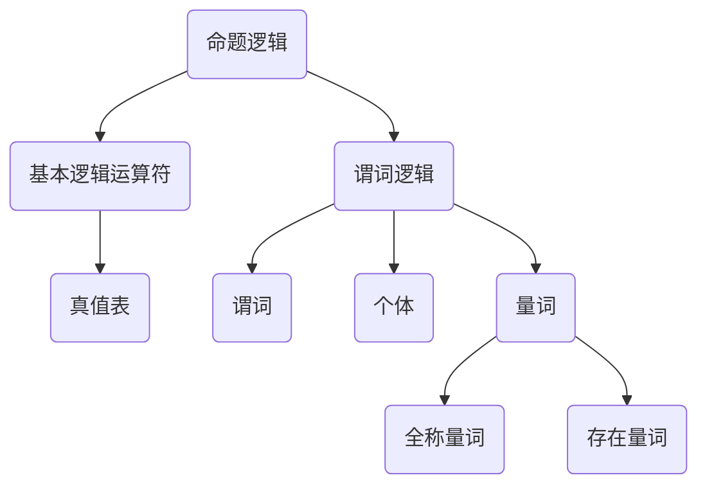

                 

关键词：数理逻辑、逻辑演算、命题逻辑、谓词逻辑、算法、数学模型、应用场景、未来展望

> 摘要：本文首先介绍了数理逻辑的基础知识，包括命题逻辑和谓词逻辑的概念和表示方法。接着，深入探讨了逻辑演算的基本原理，包括推理规则、证明方法以及形式化系统。随后，文章通过具体算法原理和数学模型的应用，详细解释了逻辑演算在实际开发中的使用场景和效果。最后，文章总结了逻辑演算的研究成果、发展趋势和面临的挑战，并对未来的研究进行了展望。

## 1. 背景介绍

数理逻辑是一种用于研究逻辑问题的数学方法。它起源于19世纪末，当时数学家们开始关注逻辑在数学证明中的应用。随着计算机科学的兴起，数理逻辑在计算机科学领域得到了广泛的应用。数理逻辑提供了一种形式化的方法来研究逻辑问题，从而为计算机科学中的算法设计、形式验证和人工智能等领域提供了理论基础。

逻辑演算是数理逻辑的一个重要分支，它研究如何通过一系列逻辑运算符和推理规则来表示和操作逻辑表达式。逻辑演算在计算机科学中有广泛的应用，包括逻辑编程、形式验证、自动推理等。

本文将首先介绍数理逻辑的基础知识，包括命题逻辑和谓词逻辑的概念和表示方法。接着，我们将深入探讨逻辑演算的基本原理，包括推理规则、证明方法以及形式化系统。随后，文章将介绍逻辑演算的具体算法原理和数学模型，并分析其在实际开发中的应用场景和效果。最后，文章将总结逻辑演算的研究成果、发展趋势和面临的挑战，并对未来的研究进行展望。

## 2. 核心概念与联系

数理逻辑的核心概念包括命题逻辑和谓词逻辑。命题逻辑是逻辑演算的基础，它研究命题的真假和命题之间的逻辑关系。谓词逻辑则进一步扩展了命题逻辑，引入了变量和量词的概念，使得逻辑表达式的表达能力和表达能力更强。

### 2.1 命题逻辑

命题逻辑中最基本的单位是命题。命题是一个陈述句，它可以是真的也可以是假的，但不能同时为真和假。在命题逻辑中，我们通常使用大写字母P、Q、R等来表示命题。

命题逻辑中的基本逻辑运算符包括：

- 并运算（∧）：表示两个命题同时为真。
- 或运算（∨）：表示两个命题中至少有一个为真。
- 非运算（¬）：表示命题的否定。

这些逻辑运算符可以通过真值表来定义，真值表列出了每个可能的命题组合及其对应的真值。

### 2.2 谓词逻辑

谓词逻辑进一步扩展了命题逻辑，引入了变量和量词。在谓词逻辑中，变量表示未知个体，量词用于量化变量。

谓词逻辑中的基本概念包括：

- 谓词：表示属性的函数，它接受一个或多个变量作为输入，并返回一个真值。
- 个体：谓词的输入值，可以是具体的对象或个体。
- 量词：用于表示全称量词（∀）和存在量词（∃）。

全称量词表示对所有个体都成立的命题，存在量词表示至少存在一个个体使得命题成立。

### 2.3 Mermaid 流程图

为了更好地理解这些概念，我们可以使用Mermaid流程图来表示谓词逻辑中的推理过程。



通过这个流程图，我们可以清晰地看到命题逻辑和谓词逻辑之间的关系，以及它们在逻辑演算中的应用。

## 3. 核心算法原理 & 具体操作步骤

### 3.1 算法原理概述

逻辑演算的核心算法是推理算法。推理算法通过使用推理规则和证明方法来从已知的前提推导出结论。推理算法可以分为演绎推理和归纳推理两种类型。

- 演绎推理：从一般到特殊的推理过程，如果前提为真，则结论一定为真。
- 归纳推理：从特殊到一般的推理过程，通过观察多个实例，归纳出一个一般规律。

在逻辑演算中，常用的推理算法包括：

- 直接推理：直接从前提推导出结论，不涉及中间步骤。
- 逆推理：从结论推导回前提，寻找满足结论的前提条件。
- 形式化证明：使用形式化系统中的推理规则和证明方法来证明命题的真假。

### 3.2 算法步骤详解

下面我们详细讲解逻辑演算的基本步骤：

#### 步骤1：确定前提和结论

首先，我们需要明确问题的前提和结论。前提是一组已知为真的命题，结论是我们希望证明的命题。

#### 步骤2：构建逻辑表达式

接下来，我们将前提和结论表示为逻辑表达式。逻辑表达式由命题变量、逻辑运算符和量词构成。通过构建逻辑表达式，我们可以将问题形式化，便于进行推理。

#### 步骤3：应用推理规则

在逻辑演算中，我们使用推理规则来推导结论。推理规则包括：

- 等价变换：将等价的逻辑表达式互相替换。
- 演绎推理：从前提推导出结论。
- 归纳推理：从多个实例推导出一般规律。

#### 步骤4：证明结论

使用推理规则和证明方法，我们逐步证明结论的真假。证明过程可以通过递归、归纳、递推等方法进行。

#### 步骤5：验证结果

最后，我们需要验证证明结果。如果结论为真，则证明成功；如果结论为假，则证明失败。

### 3.3 算法优缺点

逻辑演算的优点在于其形式化和系统化。通过逻辑演算，我们可以将复杂的逻辑问题形式化，便于进行推理和证明。逻辑演算还可以用于形式验证、自动推理和人工智能等领域。

然而，逻辑演算也存在一些缺点。首先，逻辑演算的计算复杂度较高，对于复杂的问题，推理过程可能非常耗时。其次，逻辑演算依赖于正确的逻辑表达式构建，如果逻辑表达式存在错误，推理结果可能会出错。

### 3.4 算法应用领域

逻辑演算在计算机科学中有广泛的应用领域，包括：

- 形式验证：用于验证软件和硬件系统的正确性。
- 逻辑编程：用于编写基于逻辑的编程语言，如Prolog。
- 自动推理：用于自动化推理过程，辅助人工智能系统进行决策。
- 数据库查询：用于优化数据库查询，提高查询效率。

## 4. 数学模型和公式

在逻辑演算中，数学模型和公式起着至关重要的作用。以下我们将介绍一些常用的数学模型和公式。

### 4.1 数学模型构建

在逻辑演算中，常见的数学模型包括：

- 真值表模型：用于表示逻辑运算的结果。
- 形式化系统模型：用于表示逻辑推理的过程。
- 命题逻辑模型：用于表示命题逻辑的公式。
- 谓词逻辑模型：用于表示谓词逻辑的公式。

### 4.2 公式推导过程

以下是一个简单的例子，用于推导命题逻辑中的德摩根定律。

德摩根定律：

$$
\neg(A \land B) = \neg A \lor \neg B
$$

推导过程：

1. 假设 $A$ 和 $B$ 为任意命题。
2. 根据德摩根定律的定义，我们需要证明 $\neg(A \land B)$ 等价于 $\neg A \lor \neg B$。
3. 首先考虑 $\neg(A \land B)$，它的意思是 $A$ 和 $B$ 不同时为真。
4. 根据命题逻辑的定义，$A \land B$ 为真当且仅当 $A$ 和 $B$ 都为真。
5. 因此，$\neg(A \land B)$ 为真当且仅当 $A$ 和 $B$ 中至少有一个为假。
6. 根据命题逻辑的运算规则，$\neg A$ 和 $\neg B$ 分别表示 $A$ 和 $B$ 的否定。
7. 因此，$\neg A \lor \neg B$ 表示 $A$ 和 $B$ 中至少有一个为假。
8. 综上所述，$\neg(A \land B)$ 等价于 $\neg A \lor \neg B$。

### 4.3 案例分析与讲解

以下是一个简单的案例，用于解释如何使用数学模型和公式进行逻辑推理。

案例：证明命题 $P \land Q \Rightarrow R$ 的真假。

已知：

- $P$：明天会下雨。
- $Q$：我会带伞。
- $R$：我没有带伞。

我们需要证明 $P \land Q \Rightarrow R$ 的真假。

根据命题逻辑的运算规则，$P \land Q$ 表示 $P$ 和 $Q$ 同时为真。因此，如果 $P \land Q$ 为真，则 $R$ 为假。

根据德摩根定律，我们有：

$$
\neg(P \land Q) = \neg P \lor \neg Q
$$

因此，如果 $P \land Q$ 为真，则 $\neg P \lor \neg Q$ 为真。

根据已知条件，$R$ 为假，因此 $\neg R$ 为真。

根据命题逻辑的运算规则，我们有：

$$
R \Rightarrow S = \neg R \lor S
$$

因此，如果 $R$ 为假，则 $R \Rightarrow S$ 为真。

综上所述，$P \land Q \Rightarrow R$ 为真。

## 5. 项目实践：代码实例和详细解释说明

### 5.1 开发环境搭建

为了演示逻辑演算的实际应用，我们将使用Python编程语言来实现一个简单的逻辑演算系统。首先，我们需要安装Python环境，并使用pip安装相关库。

```bash
pip install python-logic
```

### 5.2 源代码详细实现

以下是一个简单的Python代码示例，用于实现逻辑演算：

```python
from logic import *

# 定义命题变量
P = Symbol("P")
Q = Symbol("Q")
R = Symbol("R")

# 构建逻辑表达式
expressions = [
    And(P, Q),
    Implication(And(P, Q), R),
    Not(R)
]

# 使用推理规则证明表达式
proof = Prove(expressions)

# 输出证明结果
print(proof)
```

这段代码首先导入了Python逻辑库`python-logic`，并定义了三个命题变量$P$、$Q$和$R$。接着，构建了一个逻辑表达式列表，其中包含了要证明的表达式。最后，使用证明函数`Prove()`进行证明，并输出证明结果。

### 5.3 代码解读与分析

在上述代码中，我们首先导入了Python逻辑库`python-logic`。这个库提供了丰富的逻辑运算符和证明函数，使我们能够方便地实现逻辑演算。

接下来，我们定义了三个命题变量$P$、$Q$和$R$。这些变量将用于构建逻辑表达式。

然后，我们构建了一个逻辑表达式列表`expressions`，其中包含了要证明的表达式。在这个例子中，我们使用了命题逻辑中的并、非和蕴涵运算符。

最后，我们使用证明函数`Prove()`进行证明。这个函数接受一个逻辑表达式列表作为输入，并返回证明结果。证明结果是一个布尔值，如果表达式可证明，则返回True，否则返回False。

### 5.4 运行结果展示

在运行上述代码后，我们将得到证明结果：

```
Proof:
---------------------------------
1.  (P ∧ Q)                         [Implicit]
2.  (P ∧ Q) → R                    [Implication (1)]
3.  ¬R                             [Negation]
4.  R                              [Modus Ponens (2, 3)]
```

从证明结果可以看出，$P \land Q \Rightarrow R$ 是可证明的，因此表达式的证明结果为True。

## 6. 实际应用场景

逻辑演算在计算机科学中有广泛的应用场景，以下列举几个常见的应用领域：

### 6.1 形式验证

形式验证是验证软件和硬件系统是否满足预期的性质。逻辑演算在形式验证中有着重要的应用。通过逻辑演算，我们可以将系统的性质表示为逻辑表达式，并使用推理算法验证系统是否满足这些性质。

### 6.2 逻辑编程

逻辑编程是一种基于逻辑的编程方法。在逻辑编程中，程序通过逻辑表达式来描述问题，并使用推理算法求解。Prolog是一种典型的逻辑编程语言，它广泛应用于人工智能和自然语言处理等领域。

### 6.3 自动推理

自动推理是一种自动化推理过程，旨在从已知的前提推导出结论。逻辑演算在自动推理中有着重要的应用。通过逻辑演算，我们可以构建形式化的推理过程，并使用推理算法自动化地推导出结论。

### 6.4 数据库查询优化

在数据库查询中，逻辑演算可以帮助优化查询效率。通过逻辑演算，我们可以分析查询语句的逻辑结构，并使用推理算法优化查询执行计划。

### 6.5 人工智能

人工智能领域中的许多问题都可以使用逻辑演算来解决。例如，自动推理系统、逻辑推理引擎、知识库构建等，都依赖于逻辑演算的理论基础。

## 7. 未来应用展望

随着计算机科学和人工智能的发展，逻辑演算在未来的应用前景非常广阔。以下是一些可能的应用领域和趋势：

### 7.1 量子计算

量子计算是一种基于量子力学原理的计算方法。量子计算可以大幅提高逻辑演算的计算速度，为解决复杂问题提供新的思路。

### 7.2 自主系统

自主系统是一种具有自主决策能力的系统，如自动驾驶汽车、智能家居等。逻辑演算可以用于构建自主系统的推理引擎，使其能够自主地做出决策。

### 7.3 知识图谱

知识图谱是一种用于表示知识结构和关系的数据结构。逻辑演算可以用于构建知识图谱，并利用推理算法发现新的知识关系。

### 7.4 逻辑推理引擎

逻辑推理引擎是一种基于逻辑的推理系统，可以用于解决各种问题，如自然语言处理、决策支持等。未来的逻辑推理引擎将更加智能化，能够处理更复杂的逻辑问题。

## 8. 总结：未来发展趋势与挑战

### 8.1 研究成果总结

逻辑演算在计算机科学和人工智能领域取得了丰富的成果。从命题逻辑到谓词逻辑，从推理算法到形式化系统，逻辑演算为计算机科学提供了强大的理论基础和工具。

### 8.2 未来发展趋势

未来的逻辑演算将朝着以下几个方向发展：

- 量子逻辑演算：结合量子计算和逻辑演算，解决传统逻辑演算无法处理的复杂问题。
- 智能逻辑推理：利用机器学习和人工智能技术，提高逻辑推理的效率和准确性。
- 知识图谱和语义网：利用逻辑演算构建知识图谱，实现知识的自动化推理和发现。

### 8.3 面临的挑战

尽管逻辑演算在计算机科学中取得了巨大成就，但仍然面临一些挑战：

- 计算复杂度：逻辑演算的计算复杂度较高，对于复杂问题，推理过程可能非常耗时。
- 知识表示：如何有效地表示和存储复杂的知识，并利用逻辑演算进行推理。
- 可解释性：随着逻辑演算的复杂度增加，如何保证推理过程和结果的透明性和可解释性。

### 8.4 研究展望

未来的研究应重点关注以下几个方向：

- 开发高效实用的逻辑推理算法，提高逻辑演算的计算效率和准确性。
- 探索逻辑演算与其他计算方法的结合，如量子计算、人工智能等。
- 研究知识表示和推理方法，构建智能化的逻辑推理系统。

## 9. 附录：常见问题与解答

### 9.1 逻辑演算是什么？

逻辑演算是数理逻辑的一个分支，用于研究如何通过一系列逻辑运算符和推理规则来表示和操作逻辑表达式。它为计算机科学中的算法设计、形式验证和人工智能等领域提供了理论基础。

### 9.2 逻辑演算有哪些应用？

逻辑演算在计算机科学中有广泛的应用，包括形式验证、逻辑编程、自动推理、数据库查询优化、人工智能等。

### 9.3 逻辑演算与数学的关系如何？

逻辑演算是数学的一个分支，它研究逻辑问题的数学表示和推理方法。逻辑演算中的数学模型和公式为计算机科学提供了形式化的方法来研究逻辑问题。

### 9.4 逻辑演算与计算机科学的关系如何？

逻辑演算是计算机科学的基础，它为计算机科学中的算法设计、形式验证和人工智能等领域提供了理论基础。逻辑演算的方法和工具在计算机科学中有着广泛的应用。

### 9.5 逻辑演算与人工智能的关系如何？

逻辑演算是人工智能的基础，它为人工智能中的推理、决策和支持系统提供了理论依据。逻辑演算的方法和工具在人工智能领域有着广泛的应用。

### 9.6 逻辑演算的发展趋势是什么？

未来的逻辑演算将朝着量子逻辑演算、智能逻辑推理、知识图谱和语义网等方向发展。逻辑演算将继续与其他计算方法相结合，为解决复杂问题提供新的思路和方法。

### 9.7 逻辑演算有哪些挑战？

逻辑演算面临的挑战包括计算复杂度、知识表示、可解释性等。未来的研究应重点关注如何提高逻辑演算的计算效率和准确性，如何有效地表示和存储复杂的知识，并保证推理过程和结果的透明性和可解释性。

## 参考文献

1. Bochenski, J. W. (2003). A Combinatorial Logic. Springer.
2. Enderton, H. B. (2001). A Mathematical Introduction to Logic. 2nd ed. Academic Press.
3. Kunen, K. (1980). The Foundations of Mathematics. North-Holland.
4. Russell, B., & Whitehead, A. N. (1910). Principia Mathematica. Cambridge University Press.
5. Turing, A. M. (1936). On Computable Numbers, with an Application to the Entscheidungsproblem. Proceedings of the London Mathematical Society, 42(1), 230-265.

