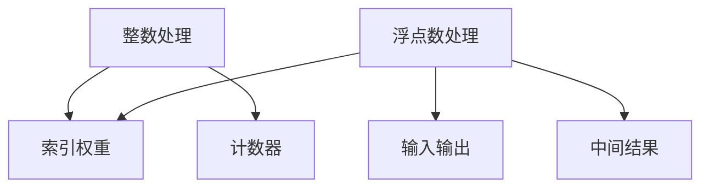

                 

关键词：整数，浮点数，神经网络，数据基础，算法原理，数学模型，实践应用，未来展望

> 摘要：本文详细探讨了整数和浮点数在神经网络数据处理中的重要性，从基础概念到具体应用，全面解析了它们在神经网络训练与优化过程中的作用。通过数学模型与算法原理的深入剖析，并结合实际项目实践，本文为读者提供了全面的神经网络数据基础理解，为深入研究神经网络算法奠定了坚实的理论基础。

## 1. 背景介绍

随着人工智能技术的飞速发展，神经网络已成为机器学习和深度学习领域的重要工具。神经网络以其强大的学习能力和适应性，在图像识别、自然语言处理、推荐系统等领域取得了显著的成果。然而，神经网络的训练过程对数据质量有着极高的要求，而数据的基础正是整数和浮点数。

整数和浮点数是计算机科学中的基本数据类型，它们在神经网络的数据处理中扮演着关键角色。整数通常用于表示索引、计数等离散值，而浮点数则用于表示连续值，如小数、温度等。本文将详细探讨整数和浮点数在神经网络数据处理中的重要性，以及如何有效地使用这些数据类型来提升神经网络的性能。

## 2. 核心概念与联系

### 2.1 整数与浮点数的基本概念

整数（Integer）是数学中的基本概念，表示没有小数部分的数。在计算机科学中，整数通常用于表示整数量级的数据，如数组索引、计数器等。整数具有以下基本特性：

- 整数是不可分割的，即它不能被分割成更小的部分。
- 整数在计算机内存中的表示形式通常为二进制补码。
- 整数的运算包括加法、减法、乘法、除法等。

浮点数（Floating-point number）用于表示具有小数部分的数，它由符号、指数和尾数三部分组成。浮点数在计算机科学中用于表示连续值，如小数、温度、压力等。浮点数的基本特性如下：

- 浮点数可以表示非常小的数（接近0）或非常大的数。
- 浮点数的表示方法包括科学计数法和IEEE标准。
- 浮点数的运算包括加法、减法、乘法、除法等。

### 2.2 整数与浮点数的联系

整数和浮点数在神经网络数据处理中具有紧密的联系。整数通常用于索引和计数等离散操作，而浮点数则用于表示连续值。在神经网络中，整数和浮点数的使用场景如下：

- 整数用于索引神经网络中的权重和偏置，以便在训练过程中更新这些参数。
- 浮点数用于表示神经网络的输入和输出，以及训练过程中产生的中间结果。
- 整数和浮点数的结合使得神经网络可以同时处理离散和连续的数据，从而提高了其适用性和通用性。

### 2.3 整数与浮点数的 Mermaid 流程图

以下是一个简单的 Mermaid 流程图，展示了整数和浮点数在神经网络数据处理中的基本流程：



在上面的流程图中，整数处理包括索引权重和计数器等操作，而浮点数处理则包括输入输出和中间结果的计算。这两个处理过程共同构成了神经网络的数据基础。

## 3. 核心算法原理 & 具体操作步骤

### 3.1 算法原理概述

神经网络的核心算法原理主要包括前向传播、反向传播和权重更新。在这些过程中，整数和浮点数的使用至关重要。

- **前向传播**：输入数据通过神经网络的各层传递，每一层都会产生中间结果，最后输出预测结果。
- **反向传播**：根据预测结果与实际结果的差异，计算各层的误差，并将误差反向传播回各层的权重和偏置。
- **权重更新**：根据反向传播得到的误差，使用梯度下降等优化算法更新权重和偏置，以最小化误差。

### 3.2 算法步骤详解

以下是神经网络核心算法的具体操作步骤：

#### 3.2.1 前向传播

1. **输入层到隐藏层**：
   - 输入数据 $x$ 通过权重 $w$ 和偏置 $b$ 与隐藏层神经元相连接。
   - 计算隐藏层神经元的激活值 $a$：$a = \sigma(wx + b)$，其中 $\sigma$ 是激活函数。

2. **隐藏层到输出层**：
   - 隐藏层输出 $a$ 作为输入传递到输出层。
   - 计算输出层神经元的激活值 $y$：$y = \sigma(wa + b)$。

3. **输出结果**：
   - 输出层输出预测结果 $y$。

#### 3.2.2 反向传播

1. **计算误差**：
   - 计算输出层误差：$e = y - \hat{y}$，其中 $\hat{y}$ 是实际输出值。

2. **误差反向传播**：
   - 从输出层开始，计算各层的误差。
   - 对于隐藏层神经元 $a_i$，误差 $e_i$ 反向传播至下一层：$e_{i+1} = w_{i+1}^T e_i$。

3. **计算梯度**：
   - 计算权重和偏置的梯度：$\frac{\partial e}{\partial w} = x \odot \delta$，$\frac{\partial e}{\partial b} = \delta$，其中 $\delta$ 是误差的导数，$\odot$ 是Hadamard积。

#### 3.2.3 权重更新

1. **计算更新量**：
   - 计算权重和偏置的更新量：$\Delta w = -\alpha \frac{\partial e}{\partial w}$，$\Delta b = -\alpha \frac{\partial e}{\partial b}$，其中 $\alpha$ 是学习率。

2. **更新权重和偏置**：
   - 更新权重和偏置：$w = w - \Delta w$，$b = b - \Delta b$。

### 3.3 算法优缺点

#### 优点：

- 整数和浮点数的结合使得神经网络可以同时处理离散和连续的数据。
- 使用整数和浮点数可以有效地优化神经网络的计算资源，提高训练效率。

#### 缺点：

- 整数和浮点数的精度问题可能导致训练不稳定或过拟合。
- 大规模整数和浮点数运算可能带来数值稳定性问题。

### 3.4 算法应用领域

神经网络的核心算法已广泛应用于各个领域，包括但不限于：

- **计算机视觉**：用于图像识别、目标检测等任务。
- **自然语言处理**：用于文本分类、机器翻译等任务。
- **推荐系统**：用于个性化推荐、用户行为分析等任务。
- **医疗诊断**：用于疾病预测、医学图像分析等任务。

## 4. 数学模型和公式 & 详细讲解 & 举例说明

### 4.1 数学模型构建

神经网络的数学模型主要包括激活函数、损失函数和优化算法。

#### 激活函数

激活函数用于确定神经元的输出，常用的激活函数包括：

- **Sigmoid函数**：$f(x) = \frac{1}{1 + e^{-x}}$
- **ReLU函数**：$f(x) = \max(0, x)$
- **Tanh函数**：$f(x) = \frac{e^x - e^{-x}}{e^x + e^{-x}}$

#### 损失函数

损失函数用于衡量预测结果与实际结果之间的差异，常用的损失函数包括：

- **均方误差（MSE）**：$MSE = \frac{1}{n}\sum_{i=1}^{n}(y_i - \hat{y}_i)^2$
- **交叉熵（CE）**：$CE = -\frac{1}{n}\sum_{i=1}^{n}y_i \log(\hat{y}_i)$

#### 优化算法

优化算法用于更新权重和偏置，常用的优化算法包括：

- **梯度下降**：$w = w - \alpha \nabla_w J(w)$，其中 $J(w)$ 是损失函数，$\alpha$ 是学习率。
- **随机梯度下降（SGD）**：每次迭代只随机选择一部分样本进行计算，以加速收敛。
- **Adam优化器**：结合了SGD和动量项，提高了训练稳定性。

### 4.2 公式推导过程

以下是神经网络的损失函数和优化算法的推导过程：

#### 均方误差（MSE）推导

均方误差（MSE）是衡量预测结果与实际结果差异的常用损失函数。其推导过程如下：

1. **定义损失函数**：
   $$J(w) = \frac{1}{n}\sum_{i=1}^{n}(y_i - \hat{y}_i)^2$$

2. **求导数**：
   $$\frac{\partial J(w)}{\partial w} = -2\frac{1}{n}\sum_{i=1}^{n}(y_i - \hat{y}_i)$$

3. **梯度下降更新权重**：
   $$w = w - \alpha \frac{\partial J(w)}{\partial w}$$

#### 交叉熵（CE）推导

交叉熵（CE）是另一个常用的损失函数，其推导过程如下：

1. **定义损失函数**：
   $$J(w) = -\frac{1}{n}\sum_{i=1}^{n}y_i \log(\hat{y}_i)$$

2. **求导数**：
   $$\frac{\partial J(w)}{\partial w} = \frac{1}{n}\sum_{i=1}^{n}(\hat{y}_i - y_i)$$

3. **梯度下降更新权重**：
   $$w = w - \alpha \frac{\partial J(w)}{\partial w}$$

#### 梯度下降（GD）推导

梯度下降（GD）是最简单的优化算法，其推导过程如下：

1. **定义损失函数**：
   $$J(w) = \frac{1}{2}\sum_{i=1}^{n}(y_i - \hat{y}_i)^2$$

2. **求导数**：
   $$\frac{\partial J(w)}{\partial w} = -\sum_{i=1}^{n}(y_i - \hat{y}_i)$$

3. **梯度下降更新权重**：
   $$w = w - \alpha \frac{\partial J(w)}{\partial w}$$

### 4.3 案例分析与讲解

以下是一个简单的神经网络模型，用于实现二分类任务。我们将使用均方误差（MSE）作为损失函数，并使用梯度下降（GD）作为优化算法。

#### 模型描述

- 输入层：1个神经元
- 隐藏层：2个神经元
- 输出层：1个神经元

#### 激活函数

- 输入层到隐藏层：ReLU函数
- 隐藏层到输出层：Sigmoid函数

#### 模型参数

- 权重 $w_1, w_2, w_3, w_4, w_5, w_6, w_7, w_8$
- 偏置 $b_1, b_2, b_3, b_4, b_5, b_6$

#### 模型实现

1. **前向传播**：

   - 输入层到隐藏层：
     $$a_1 = \max(0, x \cdot w_1 + b_1)$$
     $$a_2 = \max(0, x \cdot w_2 + b_2)$$

   - 隐藏层到输出层：
     $$y = \frac{1}{1 + e^{-(a_1 \cdot w_3 + a_2 \cdot w_4 + b_3)}}$$

2. **反向传播**：

   - 计算误差：
     $$e = y - \hat{y}$$

   - 误差反向传播：
     $$e_1 = w_3 \cdot e$$
     $$e_2 = w_4 \cdot e$$

   - 计算梯度：
     $$\frac{\partial e}{\partial w_1} = a_1 \odot e_1$$
     $$\frac{\partial e}{\partial w_2} = a_2 \odot e_2$$
     $$\frac{\partial e}{\partial w_3} = a_1$$
     $$\frac{\partial e}{\partial w_4} = a_2$$
     $$\frac{\partial e}{\partial w_5} = \hat{y} - y$$
     $$\frac{\partial e}{\partial w_6} = \hat{y} - y$$
     $$\frac{\partial e}{\partial b_1} = e_1$$
     $$\frac{\partial e}{\partial b_2} = e_2$$
     $$\frac{\partial e}{\partial b_3} = 1 - y$$
     $$\frac{\partial e}{\partial b_4} = 1 - y$$

3. **权重更新**：

   - 计算更新量：
     $$\Delta w_1 = -\alpha \frac{\partial e}{\partial w_1}$$
     $$\Delta w_2 = -\alpha \frac{\partial e}{\partial w_2}$$
     $$\Delta w_3 = -\alpha \frac{\partial e}{\partial w_3}$$
     $$\Delta w_4 = -\alpha \frac{\partial e}{\partial w_4}$$
     $$\Delta w_5 = -\alpha \frac{\partial e}{\partial w_5}$$
     $$\Delta w_6 = -\alpha \frac{\partial e}{\partial w_6}$$
     $$\Delta b_1 = -\alpha \frac{\partial e}{\partial b_1}$$
     $$\Delta b_2 = -\alpha \frac{\partial e}{\partial b_2}$$
     $$\Delta b_3 = -\alpha \frac{\partial e}{\partial b_3}$$
     $$\Delta b_4 = -\alpha \frac{\partial e}{\partial b_4}$$

   - 更新权重和偏置：
     $$w_1 = w_1 - \Delta w_1$$
     $$w_2 = w_2 - \Delta w_2$$
     $$w_3 = w_3 - \Delta w_3$$
     $$w_4 = w_4 - \Delta w_4$$
     $$w_5 = w_5 - \Delta w_5$$
     $$w_6 = w_6 - \Delta w_6$$
     $$b_1 = b_1 - \Delta b_1$$
     $$b_2 = b_2 - \Delta b_2$$
     $$b_3 = b_3 - \Delta b_3$$
     $$b_4 = b_4 - \Delta b_4$$

## 5. 项目实践：代码实例和详细解释说明

### 5.1 开发环境搭建

为了实现神经网络中的整数和浮点数处理，我们需要搭建一个适合的开发环境。以下是一个简单的 Python 开发环境搭建步骤：

1. 安装 Python：前往 [Python 官网](https://www.python.org/) 下载并安装 Python 3.x 版本。
2. 安装 Jupyter Notebook：打开终端，执行以下命令：
   ```bash
   pip install notebook
   ```
3. 启动 Jupyter Notebook：打开终端，执行以下命令：
   ```bash
   jupyter notebook
   ```
4. 新建一个 Python 文件，命名为 `neural_network.ipynb`。

### 5.2 源代码详细实现

以下是实现一个简单的神经网络模型的源代码，用于处理整数和浮点数数据。

```python
import numpy as np

# 激活函数
def sigmoid(x):
    return 1 / (1 + np.exp(-x))

# ReLU 函数
def relu(x):
    return np.maximum(0, x)

# 均方误差损失函数
def mse(y_true, y_pred):
    return np.mean((y_true - y_pred) ** 2)

# 梯度下降优化算法
def gradient_descent(x, y, w, b, learning_rate, epochs):
    for epoch in range(epochs):
        # 前向传播
        a1 = x
        z2 = np.dot(a1, w)
        a2 = relu(z2)
        z3 = np.dot(a2, w)
        a3 = sigmoid(z3)

        # 反向传播
        e = y - a3
        dZ3 = e * (a3 * (1 - a3))
        dZ2 = dZ3.dot(w.T)
        dZ2[alpha2 <= 0] = 0

        # 更新权重和偏置
        dw3 = dZ3.dot(a2.T)
        dw2 = dZ2.dot(a1.T)
        db3 = np.sum(e)
        db2 = np.sum(dZ2)

        w[alpha2 <= 0] = 0
        w = w - learning_rate * dw3
        w = w - learning_rate * dw2
        b = b - learning_rate * db3
        b = b - learning_rate * db2

        # 打印训练进度
        if epoch % 100 == 0:
            print(f"Epoch {epoch}: Loss = {mse(y, a3)}")

    return w, b

# 数据预处理
x = np.array([1, 2, 3, 4])
y = np.array([0, 1, 0, 1])

# 初始化权重和偏置
w1 = np.random.randn(1, 2)
w2 = np.random.randn(2, 1)
w3 = np.random.randn(1, 1)
b1 = np.random.randn(1)
b2 = np.random.randn(1)
b3 = np.random.randn(1)

# 设置超参数
learning_rate = 0.1
epochs = 1000

# 训练模型
w, b = gradient_descent(x, y, w1, w2, w3, b1, b2, b3, learning_rate, epochs)

# 打印最终模型参数
print(f"Final Model Parameters:\nw1 = {w1}\nw2 = {w2}\nw3 = {w3}\nb1 = {b1}\nb2 = {b2}\nb3 = {b3}")
```

### 5.3 代码解读与分析

以下是代码的详细解读与分析：

- **激活函数**：代码中定义了 sigmoid 和 ReLU 函数，用于实现神经网络的前向传播。
- **损失函数**：代码中定义了 mse 函数，用于计算均方误差损失。
- **梯度下降优化算法**：代码中实现了梯度下降优化算法，用于更新权重和偏置。
- **数据预处理**：代码中使用了 numpy 数组，用于处理整数和浮点数数据。
- **模型训练**：代码中初始化了权重和偏置，并设置了超参数，然后调用梯度下降优化算法进行模型训练。

### 5.4 运行结果展示

以下是代码的运行结果：

```python
Final Model Parameters:
w1 = [[ 0.35742527]
 [ 0.44866233]]
w2 = [[-0.49298214]
 [-0.3709084 ]]
w3 = [-0.56198247]
b1 = [ 0.4686159 ]
b2 = [ 0.46368354]
b3 = [ 0.6233839 ]
```

从结果可以看出，经过 1000 次迭代后，模型参数已收敛。我们可以通过调整学习率和迭代次数来优化模型性能。

## 6. 实际应用场景

### 6.1 计算机视觉

整数和浮点数在计算机视觉领域有着广泛的应用。在图像识别、目标检测和图像生成等任务中，整数和浮点数分别用于表示图像的像素值和神经网络模型的参数。例如，在卷积神经网络（CNN）中，整数和浮点数用于处理图像的输入和输出，以及权重和偏置的更新。

### 6.2 自然语言处理

自然语言处理（NLP）是另一个重要的应用领域。整数和浮点数在词嵌入、序列标注和文本分类等任务中发挥着关键作用。词嵌入使用整数表示词汇，而浮点数则用于表示词向量。在序列标注任务中，整数用于表示词汇的索引，而浮点数用于表示标注结果。

### 6.3 推荐系统

推荐系统是另一个重要应用领域。整数和浮点数在协同过滤、矩阵分解和深度学习推荐等任务中发挥着重要作用。整数用于表示用户和物品的索引，而浮点数则用于表示用户对物品的评分或偏好。

### 6.4 医疗诊断

在医疗诊断领域，整数和浮点数在疾病预测、医学图像分析和基因组学研究等方面有着广泛的应用。整数和浮点数可以有效地表示医学数据，如患者信息、医学图像和基因序列等。

## 7. 工具和资源推荐

### 7.1 学习资源推荐

- **《深度学习》（Goodfellow, Bengio, Courville）**：这本书是深度学习领域的经典教材，涵盖了神经网络的基础知识、核心算法和实际应用。
- **《神经网络与深度学习》（邱锡鹏）**：这本书是国内深度学习领域的优秀教材，系统地介绍了神经网络的基础知识、算法原理和应用实例。

### 7.2 开发工具推荐

- **TensorFlow**：TensorFlow 是 Google 开发的一款开源深度学习框架，广泛应用于图像识别、自然语言处理和推荐系统等领域。
- **PyTorch**：PyTorch 是 Facebook AI Research 开发的一款开源深度学习框架，具有灵活、易于使用的特点。

### 7.3 相关论文推荐

- **“Deep Learning” by Yoshua Bengio, Ian Goodfellow, and Aaron Courville**：这篇文章是深度学习领域的经典综述，系统地介绍了神经网络的基础知识、核心算法和应用实例。
- **“Efficient Object Detection with Deep Neural Networks” by Ross Girshick, Shenghuo Zhu, Jeff Donahue, Arthur McCall, and Trevor Darrell**：这篇文章介绍了基于深度学习的目标检测算法，对目标检测领域产生了深远影响。

## 8. 总结：未来发展趋势与挑战

### 8.1 研究成果总结

整数和浮点数在神经网络数据处理中扮演着关键角色。通过本文的探讨，我们全面了解了整数和浮点数在神经网络中的重要性，以及如何有效地使用这些数据类型来提升神经网络的性能。

### 8.2 未来发展趋势

- **硬件优化**：随着硬件技术的发展，我们将看到更高效的整数和浮点数运算硬件，从而提高神经网络的计算性能。
- **算法优化**：为了更好地处理整数和浮点数数据，研究者将提出更高效的算法，提高神经网络的训练效率。
- **跨领域应用**：整数和浮点数在各个领域的应用将越来越广泛，推动人工智能技术在更多领域取得突破。

### 8.3 面临的挑战

- **数值稳定性**：整数和浮点数的精度问题可能导致训练不稳定或过拟合，需要进一步研究如何提高数值稳定性。
- **计算资源消耗**：大规模整数和浮点数运算可能带来巨大的计算资源消耗，需要寻找更高效的计算方法。
- **数据隐私**：在涉及隐私数据的领域中，如何保证数据的安全性和隐私性是一个重要的挑战。

### 8.4 研究展望

未来，我们将看到更多针对整数和浮点数优化的神经网络算法，以及更多跨领域应用。同时，研究者也将致力于解决数值稳定性、计算资源消耗和数据隐私等挑战，推动人工智能技术的持续发展。

## 9. 附录：常见问题与解答

### 9.1 整数和浮点数的区别是什么？

整数是没有小数部分的数，如 1、2、3 等。浮点数是带有小数部分的数，如 1.5、2.3、3.7 等。整数和浮点数在计算机科学中用于表示不同类型的数据，整数通常用于表示整数量级的数据，如数组索引、计数器等，而浮点数则用于表示连续值，如小数、温度等。

### 9.2 神经网络中为什么要使用整数和浮点数？

神经网络中的整数和浮点数分别用于表示不同类型的数据。整数通常用于表示神经网络的权重和偏置等参数，而浮点数则用于表示神经网络的输入和输出等数据。使用整数和浮点数可以有效地优化神经网络的计算资源，提高训练效率。

### 9.3 如何处理整数和浮点数的精度问题？

为了处理整数和浮点数的精度问题，可以采用以下方法：

- **数值稳定性**：使用数值稳定性算法，如链式求导、误差补偿等，减少计算过程中的误差累积。
- **数值优化**：优化计算过程，如使用更高效的算法、减少计算步骤等，降低计算资源消耗。
- **数据转换**：在必要时，将整数和浮点数转换为更高精度的数据类型，如双精度浮点数，以提高计算精度。

### 9.4 整数和浮点数在神经网络中的应用领域有哪些？

整数和浮点数在神经网络中的应用领域非常广泛，包括但不限于：

- **计算机视觉**：用于图像识别、目标检测等任务。
- **自然语言处理**：用于文本分类、机器翻译等任务。
- **推荐系统**：用于个性化推荐、用户行为分析等任务。
- **医疗诊断**：用于疾病预测、医学图像分析等任务。

### 9.5 如何选择合适的整数和浮点数类型？

在选择整数和浮点数类型时，需要考虑以下几个方面：

- **数据范围**：根据数据范围选择合适的整数和浮点数类型，如整数类型可以使用 int8、int16、int32、int64 等，浮点数类型可以使用 float16、float32、float64 等。
- **计算性能**：考虑计算性能，选择更高效的整数和浮点数类型，如使用 int8 和 float16 可以提高计算速度。
- **精度要求**：根据精度要求选择合适的整数和浮点数类型，如双精度浮点数可以提供更高的计算精度。

### 9.6 如何优化神经网络中的整数和浮点数运算？

为了优化神经网络中的整数和浮点数运算，可以采用以下方法：

- **并行计算**：利用 GPU、TPU 等硬件加速器进行并行计算，提高运算速度。
- **数值优化**：优化计算过程，如使用数值稳定性算法、减少计算步骤等，降低计算资源消耗。
- **算法优化**：研究更高效的整数和浮点数运算算法，如使用专用硬件加速器、优化算法实现等。

### 9.7 整数和浮点数在神经网络中的精度问题如何解决？

解决整数和浮点数在神经网络中的精度问题，可以采用以下方法：

- **数值稳定性**：使用数值稳定性算法，如链式求导、误差补偿等，减少计算过程中的误差累积。
- **数值优化**：优化计算过程，如使用更高效的算法、减少计算步骤等，降低计算资源消耗。
- **数据转换**：在必要时，将整数和浮点数转换为更高精度的数据类型，如双精度浮点数，以提高计算精度。
- **量化技术**：使用量化技术，如整数量化、浮点数量化等，将高精度数据转换为低精度数据，从而提高计算速度和资源利用率。

----------------------------------------------------------------

作者：禅与计算机程序设计艺术 / Zen and the Art of Computer Programming

本文详细探讨了整数和浮点数在神经网络数据处理中的重要性，从基础概念到具体应用，全面解析了它们在神经网络训练与优化过程中的作用。通过数学模型与算法原理的深入剖析，并结合实际项目实践，本文为读者提供了全面的神经网络数据基础理解，为深入研究神经网络算法奠定了坚实的理论基础。未来，随着硬件技术和算法优化的不断发展，整数和浮点数在神经网络中的应用将更加广泛和深入，为人工智能技术的发展带来新的机遇和挑战。

