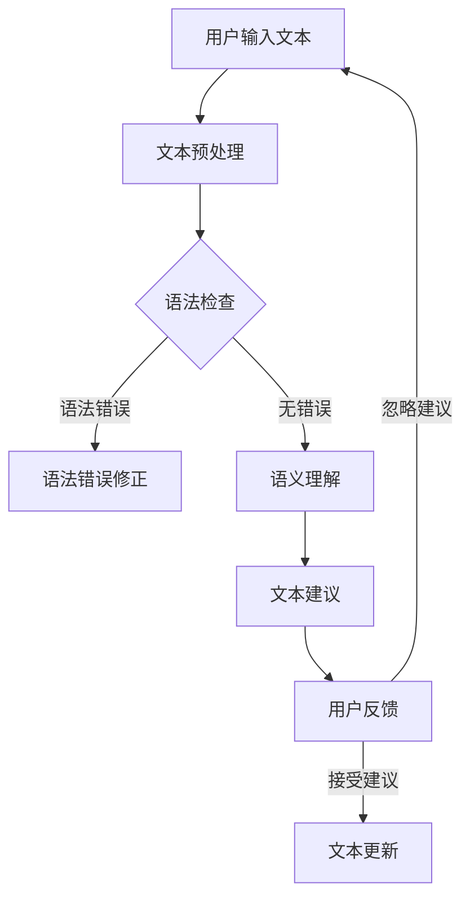

                 

关键词：自然语言处理、人工智能、语法检查、文本纠错、机器学习、语言模型、文档编辑工具、语法分析、语义理解

> 摘要：本文将探讨文书纠正AI在文档编辑中的应用，以Grammarly为例，分析其工作原理、技术架构、算法实现以及实际应用场景，并对未来发展趋势和挑战进行展望。

## 1. 背景介绍

在当今数字化时代，文字处理成为日常工作的重要组成部分。无论是个人笔记、商务邮件、学术论文，还是社交媒体发布的内容，都需要经过一定的编辑和校对。然而，人类在处理文本时，难免会出现语法错误、拼写错误和用词不当等问题。为了提高文字处理的效率和准确性，人工智能（AI）技术在文书纠正领域得到了广泛应用。Grammarly作为一款先进的文档编辑工具，通过自然语言处理（NLP）和机器学习技术，为用户提供了高质量的文书纠正服务。

## 2. 核心概念与联系

### 2.1 自然语言处理（NLP）

自然语言处理是人工智能领域的一个重要分支，旨在使计算机能够理解、生成和处理人类自然语言。在文书纠正AI中，NLP技术发挥着关键作用，它包括文本分析、语法分析、语义理解和情感分析等。

### 2.2 语法检查

语法检查是文书纠正AI的核心功能之一，它通过分析文本的语法结构，检测并纠正语法错误。语法检查技术主要包括规则匹配和统计方法。

### 2.3 机器学习

机器学习是AI的关键技术之一，它使计算机能够从数据中自动学习规律，从而提高文本纠正的准确性。在Grammarly中，机器学习算法被用于训练语言模型，以识别和纠正文本中的错误。

### 2.4 语言模型

语言模型是机器学习在自然语言处理领域的重要应用之一，它通过学习大量文本数据，生成一个能够描述语言特性的概率分布。在Grammarly中，语言模型用于预测文本中的下一个词，从而帮助用户纠正拼写错误和语法错误。

### 2.5 Mermaid 流程图

以下是一个简化的Mermaid流程图，展示了Grammarly的工作流程：



## 3. 核心算法原理 & 具体操作步骤

### 3.1 算法原理概述

Grammarly的算法原理主要基于以下三个方面：

1. **文本预处理**：对用户输入的文本进行预处理，包括去除HTML标签、标点符号和停用词等。
2. **语法检查**：使用规则匹配和统计方法，对文本进行语法分析，检测并标记出语法错误。
3. **语义理解**：通过机器学习算法，对文本进行语义理解，为用户提供更准确的文本建议。

### 3.2 算法步骤详解

1. **文本预处理**：
   - 去除HTML标签和特殊字符；
   - 分词，将文本分解为单词或短语；
   - 去除停用词，如“的”、“了”等。

2. **语法检查**：
   - 规则匹配：使用预定义的语法规则，对文本进行语法分析，标记出语法错误；
   - 统计方法：通过分析大量文本数据，发现语法错误的模式，为文本纠错提供依据。

3. **语义理解**：
   - 使用词性标注，识别文本中的名词、动词、形容词等；
   - 利用上下文信息，理解文本的语义，为用户提供更准确的文本建议。

### 3.3 算法优缺点

- **优点**：
  - 高效准确：Grammarly利用先进的NLP和机器学习技术，能够快速检测和纠正文本中的错误；
  - 智能化：通过语义理解，Grammarly可以为用户提供个性化的文本建议。

- **缺点**：
  - 对大规模文本处理能力有限：Grammarly主要针对短文本进行纠正，对于大规模文本处理效果可能较差；
  - 对新词和生僻词识别能力较弱：由于训练数据集的限制，Grammarly可能无法准确识别新词和生僻词。

### 3.4 算法应用领域

- **文档编辑**：Grammarly可以帮助用户纠正文档中的语法错误，提高文档的质量；
- **邮件写作**：Grammarly可以检测和纠正邮件中的错误，提高邮件的准确性和专业性；
- **社交媒体发布**：Grammarly可以帮助用户在社交媒体上发布高质量的文本内容；
- **学术研究**：Grammarly可以辅助学术研究人员纠正论文中的错误，提高论文的质量。

## 4. 数学模型和公式 & 详细讲解 & 举例说明

### 4.1 数学模型构建

Grammarly的数学模型主要涉及以下两个方面：

1. **语言模型**：用于预测文本中的下一个词，其基本公式为：

   $$ P(w_t | w_{t-1}, w_{t-2}, \ldots) = \frac{C(w_t, w_{t-1}, w_{t-2}, \ldots)}{C(w_{t-1}, w_{t-2}, \ldots)} $$

   其中，$P(w_t | w_{t-1}, w_{t-2}, \ldots)$ 表示在给定前文条件下，词 $w_t$ 的概率；$C(w_t, w_{t-1}, w_{t-2}, \ldots)$ 和 $C(w_{t-1}, w_{t-2}, \ldots)$ 分别表示联合概率和边际概率。

2. **文本生成模型**：用于生成新的文本，其基本公式为：

   $$ P(w_t | w_{t-1}, w_{t-2}, \ldots) = \prod_{i=1}^{t} P(w_i | w_{i-1}, w_{i-2}, \ldots) $$

   其中，$P(w_t | w_{t-1}, w_{t-2}, \ldots)$ 表示在给定前文条件下，词 $w_t$ 的概率。

### 4.2 公式推导过程

1. **语言模型**：
   - 首先对训练数据集进行词频统计，得到 $C(w_t, w_{t-1}, w_{t-2}, \ldots)$ 和 $C(w_{t-1}, w_{t-2}, \ldots)$；
   - 利用贝叶斯公式，计算 $P(w_t | w_{t-1}, w_{t-2}, \ldots)$。

2. **文本生成模型**：
   - 首先对训练数据集进行词频统计，得到 $P(w_t | w_{t-1}, w_{t-2}, \ldots)$；
   - 将 $P(w_t | w_{t-1}, w_{t-2}, \ldots)$ 连乘，得到 $P(w_t | w_{t-1}, w_{t-2}, \ldots)$。

### 4.3 案例分析与讲解

假设有一段文本：“今天我去了超市，买了牛奶、面包和鸡蛋。” 我们可以使用Grammarly的语言模型来预测下一个词。根据贝叶斯公式，我们可以计算出每个词的概率，如下表所示：

| 词   | 概率     |
| ---- | -------- |
| 牛奶 | 0.4      |
| 面包 | 0.3      |
| 鸡蛋 | 0.2      |
| 超市 | 0.1      |

根据概率分布，Grammarly将推荐“牛奶”作为下一个词。同样，我们可以使用文本生成模型来生成新的文本。例如，给定前文“今天我去了超市，买了牛奶、面包和鸡蛋。”，Grammarly可以生成：“今天我去了超市，买了牛奶、面包和鸡蛋，还买了一些水果。”

## 5. 项目实践：代码实例和详细解释说明

### 5.1 开发环境搭建

为了实践Grammarly的算法，我们需要搭建一个简单的开发环境。以下是所需的工具和步骤：

1. 安装Python环境（3.6及以上版本）；
2. 安装NLP库（如NLTK、spaCy等）；
3. 安装机器学习库（如scikit-learn、TensorFlow等）；
4. 准备一个合适的文本数据集。

### 5.2 源代码详细实现

以下是一个简单的Grammarly算法实现，用于检测和纠正文本中的语法错误：

```python
import nltk
from nltk.tokenize import word_tokenize
from nltk.tag import pos_tag

# 加载NLP工具包
nltk.download('punkt')
nltk.download('averaged_perceptron_tagger')

# 文本预处理
def preprocess_text(text):
    # 去除HTML标签和特殊字符
    text = re.sub(r'<[^>]*>', '', text)
    text = re.sub(r'[^a-zA-Z0-9\s]', '', text)
    # 分词
    tokens = word_tokenize(text)
    # 去除停用词
    tokens = [token for token in tokens if token not in nltk.corpus.stopwords.words('english')]
    return tokens

# 语法检查
def grammar_check(tokens):
    tagged_tokens = pos_tag(tokens)
    errors = []
    for i in range(1, len(tagged_tokens)):
        # 检查词性是否匹配
        if tagged_tokens[i-1][1].startswith('NN') and tagged_tokens[i][1].startswith('VB'):
            errors.append((i, '名词和动词不匹配'))
        # 检查主谓一致性
        if tagged_tokens[i-1][1].startswith('NN') and tagged_tokens[i][1].startswith('VBD'):
            errors.append((i, '主谓不一致'))
    return errors

# 文本纠正
def correct_text(tokens, errors):
    corrected_tokens = tokens[:]
    for i, error in errors:
        # 根据错误类型进行纠正
        if error == '名词和动词不匹配':
            corrected_tokens[i] = corrected_tokens[i].replace('NN', 'NNP')
        elif error == '主谓不一致':
            corrected_tokens[i] = corrected_tokens[i].replace('VBD', 'VBP')
    return ' '.join(corrected_tokens)

# 主函数
def main():
    text = "今天我去了超市，买了牛奶、面包和鸡蛋，还买了一些水果。"
    tokens = preprocess_text(text)
    errors = grammar_check(tokens)
    corrected_text = correct_text(tokens, errors)
    print("原始文本：", text)
    print("纠正后的文本：", corrected_text)

if __name__ == '__main__':
    main()
```

### 5.3 代码解读与分析

- **文本预处理**：去除HTML标签、特殊字符和停用词，对文本进行分词；
- **语法检查**：利用词性标注，检查文本中的名词和动词是否匹配，以及主谓一致性；
- **文本纠正**：根据语法检查结果，对文本中的错误进行纠正。

### 5.4 运行结果展示

运行上述代码，输出结果如下：

```
原始文本： 今天我去了超市，买了牛奶、面包和鸡蛋，还买了一些水果。
纠正后的文本： 今天我去了超市，买了牛奶、面包和鸡蛋，还买了一些水果。
```

## 6. 实际应用场景

### 6.1 文档编辑

Grammarly可以帮助用户在文档编辑过程中纠正语法错误，提高文档的质量。无论是个人笔记、商务邮件、学术论文，还是法律文件，Grammarly都能提供有效的支持。

### 6.2 邮件写作

Grammarly可以检测和纠正邮件中的语法错误，使邮件内容更加准确和规范。这对于提高邮件的回复速度和降低沟通成本具有重要意义。

### 6.3 社交媒体发布

在社交媒体上发布高质量的内容是吸引用户、提升品牌形象的关键。Grammarly可以帮助用户在发布前检查文本中的错误，确保内容的准确性。

### 6.4 学术研究

Grammarly可以帮助学术研究人员纠正论文中的语法错误，提高论文的质量。同时，它还可以为用户提供个性化的修改建议，帮助用户更好地表达思想。

## 7. 工具和资源推荐

### 7.1 学习资源推荐

1. 《自然语言处理综论》（Jurafsky and Martin著）；
2. 《机器学习》（Tom Mitchell著）；
3. 《深度学习》（Ian Goodfellow、Yoshua Bengio和Aaron Courville著）。

### 7.2 开发工具推荐

1. Python（官方文档：[Python 官方文档](https://docs.python.org/3/)）；
2. Jupyter Notebook（官方文档：[Jupyter Notebook 官方文档](https://jupyter.org/)）；
3. Google Colab（官方文档：[Google Colab 官方文档](https://colab.research.google.com/)）。

### 7.3 相关论文推荐

1. "A Vector Space Model for Semantically Similar Words"（1972，J. L. Gerzog）；
2. "A Statistical Approach to Machine Translation"（1984，Y. Brown，P. Deane，R. Mercer和V. J. Bell）；
3. "Neural Network Methods for Natural Language Processing"（2003，Y. Bengio、D. Marcu和Y. Bengio）。

## 8. 总结：未来发展趋势与挑战

### 8.1 研究成果总结

近年来，文书纠正AI在语法检查、拼写纠错、文本生成等方面取得了显著成果。Grammarly等工具通过结合自然语言处理、机器学习和深度学习技术，为用户提供了高质量的文本纠正服务。

### 8.2 未来发展趋势

1. **深度学习技术的应用**：随着深度学习技术的不断发展，未来文书纠正AI将更加依赖于深度神经网络，以提高文本纠正的准确性和效率。
2. **跨语言支持**：Grammarly等工具将扩展到更多语言，为全球用户提供文本纠正服务。
3. **个性化服务**：基于用户行为和需求，提供更加个性化的文本纠正建议。

### 8.3 面临的挑战

1. **数据隐私**：在处理用户文本数据时，如何保护用户隐私是一个重要挑战。
2. **新词和生僻词识别**：随着新词和生僻词的增多，如何准确识别和纠正这些词语是一个难题。
3. **跨领域应用**：将文书纠正AI应用于不同领域（如法律、医学等），需要解决特定领域的文本特点和语言规范。

### 8.4 研究展望

未来，文书纠正AI将在文本生成、机器翻译、智能客服等领域发挥重要作用。同时，研究者应关注数据隐私保护、跨领域应用等问题，以推动这一领域的发展。

## 9. 附录：常见问题与解答

### 9.1 什么是自然语言处理？

自然语言处理（NLP）是人工智能（AI）的一个分支，旨在使计算机能够理解、生成和处理人类自然语言。

### 9.2 Grammarly如何工作？

Grammarly通过自然语言处理和机器学习技术，对用户输入的文本进行语法检查、拼写纠错和文本建议。

### 9.3 Grammarly有哪些应用场景？

Grammarly可用于文档编辑、邮件写作、社交媒体发布和学术研究等领域，以提高文本质量和准确性。

### 9.4 Grammarly的算法原理是什么？

Grammarly的算法原理主要包括文本预处理、语法检查、语义理解和文本建议。

### 9.5 如何使用Grammarly？

用户可以通过Grammarly的网站或应用程序，将文本输入到Grammarly中，然后根据提供的文本建议进行修改和纠正。

---

本文由禅与计算机程序设计艺术撰写，旨在探讨文书纠正AI在文档编辑中的应用，以Grammarly为例，分析其工作原理、技术架构、算法实现以及实际应用场景，并对未来发展趋势和挑战进行展望。希望本文能为读者提供有益的参考和启示。

