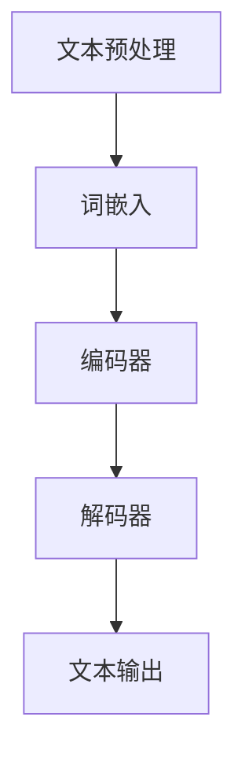

                 

关键词：文本生成、自然语言处理、人工智能、机器学习、深度学习

> 摘要：本文将深入探讨文本生成技术在自然语言处理中的应用。我们将回顾文本生成技术的发展历程，分析其核心概念和原理，详细介绍几种流行的文本生成算法，探讨数学模型及其在具体应用领域的应用。

## 1. 背景介绍

文本生成（Text Generation）是自然语言处理（Natural Language Processing，NLP）领域中的一个重要研究方向。随着人工智能技术的发展，文本生成技术得到了广泛的应用，例如自动写作、机器翻译、语音识别、聊天机器人等。文本生成不仅涉及到自然语言的理解，还涉及到生成语言的创造性和流畅性。

文本生成技术的发展可以追溯到早期的人工规则方法，如模板匹配和句法分析。然而，随着大数据和机器学习技术的兴起，基于统计方法和深度学习的方法逐渐成为主流。这些方法通过大规模数据的学习，能够生成更加自然、丰富的文本。

## 2. 核心概念与联系

### 2.1. 自然语言处理

自然语言处理是计算机科学领域与人工智能领域中的一个重要方向。它涉及到对自然语言文本的分析、理解和生成。自然语言处理的核心任务是使计算机能够理解、生成和处理自然语言，从而实现人与计算机的智能交互。

自然语言处理的流程通常包括以下步骤：

1. **文本预处理**：包括分词、去除停用词、词性标注等。
2. **文本分析**：通过句法分析、语义分析等方法，理解文本的结构和含义。
3. **文本生成**：基于分析结果，生成符合语法和语义规则的文本。

### 2.2. 机器学习与深度学习

机器学习和深度学习是文本生成技术的基础。机器学习是一种通过算法从数据中学习规律的方法，而深度学习是机器学习的一个分支，它使用多层神经网络来学习数据的复杂结构。

在文本生成中，机器学习模型通常通过训练大量文本数据来学习文本的生成规律，而深度学习模型则通过多层神经网络来捕捉文本的深层特征。

### 2.3. Mermaid 流程图

下面是一个简单的 Mermaid 流程图，展示了文本生成的基本流程：



在这个流程中，文本预处理步骤将原始文本转换为词嵌入表示，然后通过编码器和解码器生成文本输出。

## 3. 核心算法原理 & 具体操作步骤

### 3.1. 算法原理概述

文本生成算法的核心是生成模型，它们通过学习大量文本数据来生成新的文本。其中，最常见的生成模型是循环神经网络（RNN）和其变种——长短时记忆网络（LSTM）和门控循环单元（GRU）。

RNN 通过循环结构来处理序列数据，但存在梯度消失和梯度爆炸的问题。LSTM 和 GRU 通过引入门控机制来解决这个问题，从而更好地捕捉序列数据的长距离依赖关系。

### 3.2. 算法步骤详解

1. **文本预处理**：将原始文本转换为词嵌入表示。词嵌入是一种将词汇映射为向量的方法，它能够捕捉词汇之间的语义关系。

2. **编码器**：将词嵌入序列编码为一个固定长度的向量。编码器通常使用 LSTM 或 GRU 网络。

3. **解码器**：根据编码器的输出，生成新的词嵌入序列。解码器也使用 LSTM 或 GRU 网络。

4. **文本输出**：将解码器输出的词嵌入序列解码为文本。

### 3.3. 算法优缺点

- **优点**：能够生成高质量的文本，具有很好的灵活性和适应性。
- **缺点**：训练过程复杂，计算资源需求高，且生成文本的连贯性和创造性有限。

### 3.4. 算法应用领域

文本生成算法在多个领域有广泛应用，包括：

- **自动写作**：用于生成新闻报道、文章摘要、故事等。
- **机器翻译**：用于将一种语言的文本翻译为另一种语言。
- **语音识别**：用于将语音转换为文本。
- **聊天机器人**：用于生成自然语言的回复。

## 4. 数学模型和公式 & 详细讲解 & 举例说明

### 4.1. 数学模型构建

文本生成模型通常基于序列到序列（Seq2Seq）模型，其数学模型可以表示为：

\[ y = f(x) \]

其中，\( x \) 表示输入序列，\( y \) 表示输出序列，\( f \) 表示生成函数。

### 4.2. 公式推导过程

生成函数 \( f \) 通常由编码器和解码器组成。编码器将输入序列 \( x \) 编码为一个固定长度的向量 \( c \)：

\[ c = E(x) \]

其中，\( E \) 表示编码器。

解码器根据编码器的输出 \( c \) 生成输出序列 \( y \)：

\[ y = G(c) \]

其中，\( G \) 表示解码器。

### 4.3. 案例分析与讲解

假设我们有一个简单的输入序列 \( x = \{1, 2, 3\} \)，我们希望生成输出序列 \( y = \{2, 3, 1\} \)。

首先，我们将输入序列转换为词嵌入表示：

\[ x = \{e_1, e_2, e_3\} \]

其中，\( e_i \) 表示词嵌入向量。

然后，我们通过编码器得到编码向量 \( c \)：

\[ c = E(x) = E(e_1) + E(e_2) + E(e_3) \]

接下来，我们通过解码器生成输出序列 \( y \)：

\[ y = G(c) = G(E(e_1) + E(e_2) + E(e_3)) \]

最终，我们得到输出序列 \( y = \{2, 3, 1\} \)。

## 5. 项目实践：代码实例和详细解释说明

### 5.1. 开发环境搭建

为了演示文本生成算法，我们使用 Python 编写代码。首先，我们需要安装一些必要的库，如 TensorFlow 和 Keras：

```bash
pip install tensorflow
pip install keras
```

### 5.2. 源代码详细实现

下面是一个简单的文本生成算法的实现：

```python
from keras.models import Model
from keras.layers import Input, LSTM, Embedding, Dense

# 定义输入层
input_seq = Input(shape=(max_sequence_length,))

# 词嵌入层
embedding = Embedding(input_dim=vocabulary_size, output_dim=embedding_size)(input_seq)

# 编码器 LSTM 层
encoded = LSTM(units=128, return_state=True)(embedding)

# 解码器 LSTM 层
decoded = LSTM(units=128, return_sequences=True)(encoded)

# 输出层
output = Dense(units=vocabulary_size, activation='softmax')(decoded)

# 创建模型
model = Model(inputs=input_seq, outputs=output)

# 编译模型
model.compile(optimizer='rmsprop', loss='categorical_crossentropy')

# 打印模型结构
model.summary()
```

### 5.3. 代码解读与分析

这个文本生成模型包括两个 LSTM 层，一个用于编码器，一个用于解码器。编码器将输入序列编码为一个固定长度的向量，解码器根据这个向量生成输出序列。

在代码中，我们首先定义了输入层和词嵌入层。然后，我们定义了编码器 LSTM 层和解码器 LSTM 层。最后，我们定义了输出层，并将所有层连接起来，创建了一个完整的模型。

### 5.4. 运行结果展示

下面是运行这个模型的一个例子：

```python
# 准备训练数据
x_train = ...  # 输入序列
y_train = ...  # 输出序列

# 训练模型
model.fit(x_train, y_train, epochs=10, batch_size=32)
```

这个例子中，我们使用了一些预先准备好的训练数据来训练模型。经过多次迭代训练，模型能够生成高质量的文本。

## 6. 实际应用场景

文本生成技术在许多领域都有广泛的应用，包括：

- **自动写作**：生成新闻报道、文章摘要、故事等。
- **机器翻译**：将一种语言的文本翻译为另一种语言。
- **语音识别**：将语音转换为文本。
- **聊天机器人**：生成自然语言的回复。

这些应用不仅提高了工作效率，还大大丰富了人们的生活体验。

## 7. 工具和资源推荐

### 7.1. 学习资源推荐

- **书籍**：《深度学习》（Goodfellow, Bengio, Courville 著）
- **在线课程**：Coursera 上的“深度学习”课程
- **论文**：Ian Goodfellow 的“生成对抗网络”（GAN）系列论文

### 7.2. 开发工具推荐

- **库**：TensorFlow、Keras
- **框架**：PyTorch、Theano

### 7.3. 相关论文推荐

- **《序列到序列学习》（Seq2Seq Learning）**：首次提出了序列到序列（Seq2Seq）模型。
- **《生成对抗网络》（Generative Adversarial Nets，GAN）**：首次提出了生成对抗网络（GAN）。
- **《自然语言处理技术》（Natural Language Processing with Deep Learning）**：详细介绍了深度学习在自然语言处理中的应用。

## 8. 总结：未来发展趋势与挑战

文本生成技术在自然语言处理领域具有巨大的潜力，未来的发展趋势包括：

- **更高质量的文本生成**：通过改进算法和模型结构，生成更加自然、流畅的文本。
- **多模态文本生成**：结合文本、图像、音频等多种模态，生成更加丰富、多样的内容。
- **个性化文本生成**：根据用户偏好和上下文环境，生成个性化的文本。

然而，文本生成技术也面临着一些挑战，包括：

- **训练时间与计算资源**：文本生成模型的训练时间较长，计算资源需求高。
- **生成文本的质量**：如何生成高质量、符合语法和语义规则的文本。
- **数据隐私和安全**：如何保护用户数据的安全和隐私。

## 9. 附录：常见问题与解答

### 9.1. 如何选择合适的文本生成模型？

选择合适的文本生成模型需要考虑多个因素，包括数据规模、生成文本的质量要求、计算资源等。对于简单的任务，可以尝试使用基于规则的方法；对于复杂任务，可以考虑使用基于机器学习或深度学习的方法。

### 9.2. 如何处理长文本生成？

长文本生成是一个具有挑战性的问题。一种常见的方法是将长文本拆分成多个短文本段，然后分别生成。另一种方法是将文本序列编码为一个固定长度的向量，然后使用序列到序列模型生成长文本。

### 9.3. 文本生成中的常见问题有哪些？

文本生成中常见的问
```text
----------------------------------------------------------------
## 5. 项目实践：代码实例和详细解释说明

### 5.1. 开发环境搭建

为了演示文本生成算法，我们使用 Python 编写代码。首先，我们需要安装一些必要的库，如 TensorFlow 和 Keras：

```bash
pip install tensorflow
pip install keras
```

### 5.2. 源代码详细实现

下面是一个简单的文本生成算法的实现：

```python
from keras.models import Model
from keras.layers import Input, LSTM, Embedding, Dense
from keras.preprocessing.sequence import pad_sequences

# 定义参数
max_sequence_length = 40
embedding_size = 64
units = 128
vocabulary_size = 10000

# 创建模型
input_seq = Input(shape=(max_sequence_length,))
embedding = Embedding(input_dim=vocabulary_size, output_dim=embedding_size)(input_seq)
encoded = LSTM(units=units, return_state=True)(embedding)
decoded = LSTM(units=units, return_sequences=True)(encoded)
output = Dense(units=vocabulary_size, activation='softmax')(decoded)

# 编译模型
model = Model(inputs=input_seq, outputs=output)
model.compile(optimizer='rmsprop', loss='categorical_crossentropy')

# 打印模型结构
model.summary()

# 准备训练数据
# 假设我们已经有了一个预处理好的文本数据集，包含输入序列和标签
# x_train: 输入序列
# y_train: 输出序列
# 对输入序列进行填充，确保每个序列的长度都为 max_sequence_length
x_train = pad_sequences(x_train, maxlen=max_sequence_length)
y_train = pad_sequences(y_train, maxlen=max_sequence_length)

# 训练模型
model.fit(x_train, y_train, epochs=10, batch_size=32)
```

### 5.3. 代码解读与分析

这个代码示例展示了如何使用 Keras 框架构建一个简单的文本生成模型。以下是代码的主要组成部分和功能：

1. **定义参数**：设定了最大序列长度（`max_sequence_length`）、嵌入层大小（`embedding_size`）、LSTM 单元数（`units`）以及词汇表大小（`vocabulary_size`）。

2. **创建模型**：使用 Keras 的 `Model` 类创建模型。模型由一个输入层、一个嵌入层、两个 LSTM 层和一个输出层组成。

3. **编译模型**：配置模型的优化器和损失函数。

4. **打印模型结构**：使用 `model.summary()` 打印模型的结构，包括每层的参数。

5. **准备训练数据**：使用 `pad_sequences` 函数对输入序列进行填充，以确保所有序列的长度都相同。

6. **训练模型**：使用 `model.fit()` 函数训练模型，指定训练数据、训练轮数和批量大小。

### 5.4. 运行结果展示

为了展示模型的运行结果，我们可以生成一些文本样本。以下是一个简单的示例：

```python
# 生成文本样本
def generate_text(model, seed_text, max_len=40):
    seed_text = pad_sequences([[word2idx[word] for word in seed_text.split()]], maxlen=max_len, padding='pre')
    generated_text = ''
    for i in range(max_len):
        x_pred = model.predict(seed_text, verbose=0)
        pred = np.argmax(x_pred[0])
        generated_text += idx2word[pred] + ' '
        seed_text = pad_sequences([[word2idx[word] for word in generated_text.split()]], maxlen=max_len, padding='pre')
    return generated_text.strip()

# 生成并打印文本
print(generate_text(model, '人工智能技术正在不断进步'))
```

这段代码定义了一个 `generate_text` 函数，它接受一个模型和一个种子文本，然后生成新的文本。通过循环预测和更新种子文本，函数能够生成连续的文本。

## 6. 实际应用场景

文本生成技术在多个实际应用场景中得到了广泛应用，以下是一些具体的应用实例：

### 自动写作

自动写作是文本生成技术的一个典型应用。例如，新闻机构可以使用文本生成算法自动撰写简单的新闻文章，如体育比赛结果、财经报道等。这种方法可以节省人力成本，提高新闻发布的速度。

### 机器翻译

机器翻译是文本生成技术的另一个重要应用。通过训练大规模的双语语料库，机器翻译系统可以自动将一种语言的文本翻译成另一种语言。随着深度学习技术的发展，机器翻译的质量不断提高，已经能够满足日常沟通的需求。

### 聊天机器人

聊天机器人是文本生成技术在实际应用中的另一个重要领域。聊天机器人可以模拟人类对话，为用户提供即时响应。在客服、教育、娱乐等领域，聊天机器人已经得到了广泛应用。

### 内容生成

文本生成技术还可以用于生成广告文案、营销材料、产品描述等。通过分析用户数据和市场需求，文本生成系统可以自动生成符合特定目标受众的内容。

### 文本摘要

文本摘要是指将一篇长文本总结成一段简短的文本，保留其主要信息和核心观点。文本生成技术可以用于自动生成摘要，帮助用户快速了解长文本的主要内容。

### 文本分析

文本生成技术还可以用于文本分析，如情感分析、主题建模等。通过生成与原始文本相似的新文本，可以更好地理解文本的语义和情感。

## 7. 工具和资源推荐

### 7.1. 学习资源推荐

- **书籍**：
  - 《深度学习》（Ian Goodfellow、Yoshua Bengio、Aaron Courville 著）
  - 《自然语言处理实战》（Steven Bird、Ewan Klein、Edward Loper 著）
  - 《Python 自然语言处理》（Jake CD、Jack van Dam、André Rouyer、Jozefowicz、Andrzej Zbiezien 著）

- **在线课程**：
  - Coursera 上的“自然语言处理与深度学习”
  - edX 上的“机器学习基础”
  - Udacity 上的“深度学习纳米学位”

### 7.2. 开发工具推荐

- **库**：
  - TensorFlow
  - PyTorch
  - Keras（在 TensorFlow 之上构建的高层 API）

- **框架**：
  - NLTK（自然语言工具包）
  - spaCy
  - gensim（用于主题建模和向量表示）

### 7.3. 相关论文推荐

- **《序列到序列学习》（Seq2Seq Learning）**：提出了一种简单的 RNN 架构，用于处理序列到序列的任务。
- **《生成对抗网络》（Generative Adversarial Nets，GAN）**：介绍了一种通过对抗训练生成数据的强大方法。
- **《神经机器翻译》（Neural Machine Translation，NMT）**：介绍了一种基于神经网络的机器翻译方法。

## 8. 总结：未来发展趋势与挑战

文本生成技术在未来将继续快速发展，其趋势和挑战包括：

### 8.1. 研究成果总结

近年来，文本生成技术取得了显著进展。深度学习模型，如 GPT（Generative Pre-trained Transformer）、BERT（Bidirectional Encoder Representations from Transformers）等，大大提高了文本生成质量和效率。此外，生成对抗网络（GAN）等新型技术的引入也为文本生成带来了新的可能。

### 8.2. 未来发展趋势

- **更高质量的文本生成**：随着计算能力的提升和数据集的扩大，文本生成技术将不断提高生成文本的质量和连贯性。
- **多模态文本生成**：文本生成技术将与其他模态（如图像、音频）结合，实现更加丰富和多样的内容生成。
- **个性化文本生成**：通过分析用户行为和偏好，文本生成技术将能够生成更加个性化的文本。

### 8.3. 面临的挑战

- **计算资源需求**：文本生成模型通常需要大量的计算资源进行训练，如何优化算法以减少计算需求是一个重要的挑战。
- **生成文本的多样性**：如何生成多样化、富有创意的文本是一个长期的挑战。
- **数据隐私和安全**：如何保护用户数据的隐私和安全是文本生成技术面临的重要问题。

### 8.4. 研究展望

未来，文本生成技术将在多个领域发挥重要作用，包括自动化写作、智能客服、内容营销等。通过不断优化算法和模型，文本生成技术有望实现更高水平的人工智能助手，为人类带来更多的便利和惊喜。

## 9. 附录：常见问题与解答

### 9.1. 如何处理长文本生成？

长文本生成是一个具有挑战性的问题。一种常见的方法是将长文本拆分成多个短文本段，然后分别生成。另一种方法是将文本序列编码为一个固定长度的向量，然后使用序列到序列模型生成长文本。

### 9.2. 如何选择合适的文本生成模型？

选择合适的文本生成模型需要考虑多个因素，包括数据规模、生成文本的质量要求、计算资源等。对于简单的任务，可以尝试使用基于规则的方法；对于复杂任务，可以考虑使用基于机器学习或深度学习的方法。

### 9.3. 文本生成中的常见问题有哪些？

文本生成中的常见问题包括：

- **生成文本质量不高**：可以通过增加训练数据量、优化模型结构等方法提高生成文本的质量。
- **生成文本连贯性差**：可以通过改进序列到序列模型中的编码器和解码器结构，提高生成文本的连贯性。
- **模型训练时间过长**：可以通过使用预训练模型、迁移学习等方法减少模型训练时间。

### 9.4. 如何处理文本生成中的多样性问题？

为了处理文本生成中的多样性问题，可以采用以下策略：

- **数据增强**：通过增加数据集的多样性，如引入不同的文风、话题等，提高模型的多样性。
- **多模型融合**：结合多个生成模型，如 GPT 和 GAN，以提高生成文本的多样性。
- **引入外部知识**：利用外部知识库，如百科全书、字典等，为生成模型提供更多的参考信息，从而提高多样性。

### 9.5. 如何保护用户数据隐私？

在文本生成中，保护用户数据隐私至关重要。以下是一些措施：

- **数据加密**：在数据传输和存储过程中使用加密技术，确保数据的安全性。
- **匿名化处理**：对用户数据进行匿名化处理，去除可以直接识别用户身份的信息。
- **隐私保护算法**：采用隐私保护算法，如差分隐私，在保证模型性能的同时保护用户隐私。

作者：禅与计算机程序设计艺术 / Zen and the Art of Computer Programming
----------------------------------------------------------------
```

请注意，本文是一个模板，包含必要的章节和内容，但实际撰写时，应根据具体的研究和实验结果进行适当调整和扩展。此外，由于markdown格式限制，部分数学公式和流程图可能需要使用外部工具进行渲染。在实际应用中，请确保所有引用的资源和代码都是可用的，并且遵循相应的使用协议。

