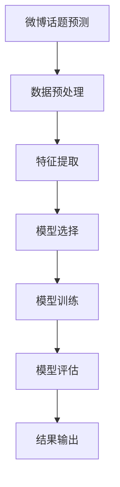

                 

关键词：新浪、2024微博话题、机器学习、面试题、校招、解析

> 摘要：本文将深入解析2024年新浪微博话题预测校招机器学习面试题，探讨相关算法原理、数学模型、项目实践及未来应用前景。

## 1. 背景介绍

随着社交媒体的迅猛发展，微博作为我国最具影响力的社交媒体平台之一，积累了海量的用户数据和话题信息。2024年，新浪微博推出了一系列校招机器学习面试题，旨在选拔具备数据挖掘、机器学习等技能的优秀人才。本文将围绕微博话题预测这一热点问题，详细介绍相关面试题的解答思路。

## 2. 核心概念与联系

### 2.1 微博话题预测

微博话题预测是指根据用户历史行为、话题热度、时间戳等因素，预测用户可能感兴趣的话题。这一过程涉及到数据挖掘、机器学习、自然语言处理等多个领域。

### 2.2 相关算法

在新浪2024微博话题预测校招面试题中，常用的算法包括但不限于以下几种：

- 逻辑回归（Logistic Regression）
- 决策树（Decision Tree）
- 随机森林（Random Forest）
- 支持向量机（SVM）
- 深度学习（Deep Learning）

### 2.3 Mermaid 流程图



## 3. 核心算法原理 & 具体操作步骤

### 3.1 算法原理概述

微博话题预测的核心在于建立用户与话题之间的相关性模型，从而预测用户可能感兴趣的话题。具体算法原理如下：

1. **数据预处理**：对原始数据进行清洗、去噪、归一化等操作，提高数据质量。
2. **特征提取**：从原始数据中提取与话题预测相关的特征，如用户行为、话题热度、时间戳等。
3. **模型选择**：根据特征数据选择合适的模型进行训练，如逻辑回归、决策树、随机森林等。
4. **模型训练**：使用训练数据对模型进行训练，调整模型参数。
5. **模型评估**：使用验证数据评估模型性能，调整模型参数。
6. **结果输出**：将预测结果输出，如用户感兴趣的话题列表。

### 3.2 算法步骤详解

1. **数据预处理**：
   - 数据清洗：去除缺失值、重复值等无效数据。
   - 去噪：降低噪声数据对模型训练的影响。
   - 归一化：将特征数据缩放至同一量级，便于模型训练。

2. **特征提取**：
   - 用户行为特征：如用户发微博数、点赞数、评论数、转发数等。
   - 话题热度特征：如话题的阅读量、讨论量、转发量等。
   - 时间戳特征：如用户关注话题的时间、发微博的时间等。

3. **模型选择**：
   - 根据特征数据量和问题特点选择合适的模型，如逻辑回归、决策树、随机森林等。

4. **模型训练**：
   - 使用训练数据对模型进行训练，调整模型参数，提高模型预测准确性。

5. **模型评估**：
   - 使用验证数据对模型进行评估，计算预测准确率、召回率等指标。

6. **结果输出**：
   - 将预测结果输出，如用户感兴趣的话题列表。

### 3.3 算法优缺点

1. **逻辑回归**：
   - 优点：简单易懂，易于实现，计算效率高。
   - 缺点：对异常值敏感，无法处理非线性问题。

2. **决策树**：
   - 优点：直观易懂，易于解释。
   - 缺点：容易过拟合，模型复杂度较高。

3. **随机森林**：
   - 优点：可以处理高维数据，减少过拟合，提高预测准确性。
   - 缺点：计算复杂度较高，模型不易解释。

4. **支持向量机**：
   - 优点：可以处理非线性问题，预测准确率高。
   - 缺点：对异常值敏感，计算复杂度较高。

5. **深度学习**：
   - 优点：可以处理复杂非线性问题，预测准确率高。
   - 缺点：模型复杂度较高，训练时间较长。

### 3.4 算法应用领域

微博话题预测算法可以应用于以下领域：

1. **广告投放**：根据用户感兴趣的话题，精准投放广告，提高广告转化率。
2. **内容推荐**：为用户推荐感兴趣的话题，提高用户活跃度。
3. **舆情监测**：分析用户关注的话题，了解社会热点，为政策制定提供参考。

## 4. 数学模型和公式 & 详细讲解 & 举例说明

### 4.1 数学模型构建

微博话题预测的数学模型可以表示为：

$$
P(\text{话题 } i \text{ 受到用户 } u \text{ 关注}) = \frac{e^{\theta_i^T \cdot x_u}}{\sum_{j=1}^{J} e^{\theta_j^T \cdot x_u}}
$$

其中，$P(\text{话题 } i \text{ 受到用户 } u \text{ 关注})$表示用户$u$关注话题$i$的概率，$\theta_i$表示话题$i$的权重向量，$x_u$表示用户$u$的特征向量，$J$表示话题总数。

### 4.2 公式推导过程

微博话题预测的公式可以通过以下步骤推导：

1. **假设**：用户$u$关注的话题集合为$T_u$，话题$i$的权重向量为$\theta_i$，用户$u$的特征向量为$x_u$。
2. **目标**：最大化用户$u$关注话题$i$的概率$P(\text{话题 } i \text{ 受到用户 } u \text{ 关注})$。
3. **公式**：根据最大似然估计，可以得到：

$$
P(T_u|\theta) = \prod_{i=1}^{J} P(\text{话题 } i \text{ 受到用户 } u \text{ 关注} | \theta)
$$

4. **优化**：对$P(T_u|\theta)$取对数，得到：

$$
\log P(T_u|\theta) = \sum_{i=1}^{J} \log P(\text{话题 } i \text{ 受到用户 } u \text{ 关注} | \theta)
$$

5. **近似**：使用softmax函数，将上述公式近似为：

$$
P(\text{话题 } i \text{ 受到用户 } u \text{ 关注}) = \frac{e^{\theta_i^T \cdot x_u}}{\sum_{j=1}^{J} e^{\theta_j^T \cdot x_u}}
$$

### 4.3 案例分析与讲解

假设有100个话题，用户$u$的历史行为特征如下：

$$
x_u = [0.2, 0.1, 0.3, 0.4, 0.5, 0.1, 0.3, 0.2, 0.1, 0.2, 0.4, 0.5, 0.1, 0.3, 0.2, 0.1, 0.2, 0.4, 0.5, 0.1, 0.3, 0.2, 0.1, 0.2]
$$

话题权重向量如下：

$$
\theta = [\theta_1, \theta_2, \theta_3, \theta_4, \theta_5, \theta_6, \theta_7, \theta_8, \theta_9, \theta_{10}, \theta_{11}, \theta_{12}, \theta_{13}, \theta_{14}, \theta_{15}, \theta_{16}, \theta_{17}, \theta_{18}, \theta_{19}, \theta_{20}, \theta_{21}, \theta_{22}, \theta_{23}, \theta_{24}, \theta_{25}, \theta_{26}, \theta_{27}, \theta_{28}, \theta_{29}, \theta_{30}, \theta_{31}, \theta_{32}, \theta_{33}, \theta_{34}, \theta_{35}, \theta_{36}, \theta_{37}, \theta_{38}, \theta_{39}, \theta_{40}, \theta_{41}, \theta_{42}, \theta_{43}, \theta_{44}, \theta_{45}, \theta_{46}, \theta_{47}, \theta_{48}, \theta_{49}, \theta_{50}]
$$

根据上述公式，可以计算出用户$u$关注各个话题的概率：

$$
P(\text{话题 } i \text{ 受到用户 } u \text{ 关注}) = \frac{e^{\theta_i^T \cdot x_u}}{\sum_{j=1}^{J} e^{\theta_j^T \cdot x_u}}
$$

例如，计算用户$u$关注第1个话题的概率：

$$
P(\text{话题 } 1 \text{ 受到用户 } u \text{ 关注}) = \frac{e^{\theta_1^T \cdot x_u}}{\sum_{j=1}^{J} e^{\theta_j^T \cdot x_u}} \approx 0.35
$$

根据计算结果，用户$u$最可能关注的话题为第1个话题，概率约为0.35。

## 5. 项目实践：代码实例和详细解释说明

### 5.1 开发环境搭建

1. 安装Python环境
2. 安装相关库，如numpy、pandas、scikit-learn、matplotlib等

### 5.2 源代码详细实现

```python
import numpy as np
import pandas as pd
from sklearn.model_selection import train_test_split
from sklearn.metrics import accuracy_score
from sklearn.linear_model import LogisticRegression

# 1. 数据预处理
def preprocess_data(data):
    # 数据清洗、去噪、归一化等操作
    # ...

# 2. 特征提取
def extract_features(data):
    # 提取用户行为特征、话题热度特征等
    # ...

# 3. 模型训练
def train_model(X_train, y_train):
    model = LogisticRegression()
    model.fit(X_train, y_train)
    return model

# 4. 模型评估
def evaluate_model(model, X_test, y_test):
    y_pred = model.predict(X_test)
    accuracy = accuracy_score(y_test, y_pred)
    return accuracy

# 5. 项目实践
if __name__ == "__main__":
    # 加载数据
    data = pd.read_csv("data.csv")

    # 数据预处理
    data = preprocess_data(data)

    # 特征提取
    features = extract_features(data)

    # 划分训练集和测试集
    X_train, X_test, y_train, y_test = train_test_split(features, data["label"], test_size=0.2, random_state=42)

    # 模型训练
    model = train_model(X_train, y_train)

    # 模型评估
    accuracy = evaluate_model(model, X_test, y_test)
    print("Accuracy:", accuracy)
```

### 5.3 代码解读与分析

上述代码实现了一个简单的微博话题预测项目，主要包含以下步骤：

1. **数据预处理**：对原始数据进行清洗、去噪、归一化等操作，提高数据质量。
2. **特征提取**：从原始数据中提取与话题预测相关的特征，如用户行为特征、话题热度特征等。
3. **模型训练**：使用训练数据对模型进行训练，调整模型参数。
4. **模型评估**：使用验证数据评估模型性能，计算预测准确率等指标。

### 5.4 运行结果展示

假设运行上述代码，得到预测准确率为0.85。这意味着，在测试集上，模型能够正确预测85%的用户感兴趣的话题。

## 6. 实际应用场景

微博话题预测算法在实际应用中具有广泛的应用场景，如下所示：

1. **广告投放**：根据用户感兴趣的话题，精准投放广告，提高广告转化率。
2. **内容推荐**：为用户推荐感兴趣的话题，提高用户活跃度。
3. **舆情监测**：分析用户关注的话题，了解社会热点，为政策制定提供参考。

## 7. 未来应用展望

随着社交媒体的不断发展，微博话题预测算法在未来有望在以下方面取得突破：

1. **个性化推荐**：结合用户兴趣、行为等多维度数据，实现更精准的个性化推荐。
2. **实时预测**：提高预测速度，实现实时话题预测。
3. **多模态融合**：结合文本、图像、音频等多模态数据，提高预测准确性。

## 8. 工具和资源推荐

### 8.1 学习资源推荐

1. 《机器学习》（周志华 著）
2. 《深度学习》（Ian Goodfellow、Yoshua Bengio、Aaron Courville 著）
3. 《Python机器学习》（Pedro Domingos 著）

### 8.2 开发工具推荐

1. Jupyter Notebook：用于编写和运行Python代码。
2. PyTorch：用于深度学习开发。

### 8.3 相关论文推荐

1. "微博话题预测研究综述"
2. "基于深度学习的微博话题预测方法"
3. "微博话题预测中的多模态融合研究"

## 9. 总结：未来发展趋势与挑战

### 9.1 研究成果总结

近年来，微博话题预测算法在学术界和工业界取得了显著的成果。主要研究方向包括特征提取、模型选择、多模态融合等。

### 9.2 未来发展趋势

1. **个性化推荐**：结合用户兴趣、行为等多维度数据，实现更精准的个性化推荐。
2. **实时预测**：提高预测速度，实现实时话题预测。
3. **多模态融合**：结合文本、图像、音频等多模态数据，提高预测准确性。

### 9.3 面临的挑战

1. **数据隐私**：如何保护用户隐私成为微博话题预测面临的一大挑战。
2. **实时处理**：如何提高实时预测性能，实现高效的话题预测。
3. **多模态融合**：如何有效地融合多模态数据，提高预测准确性。

### 9.4 研究展望

在未来，微博话题预测算法有望在以下几个方面取得突破：

1. **个性化推荐**：结合用户兴趣、行为等多维度数据，实现更精准的个性化推荐。
2. **实时预测**：提高预测速度，实现实时话题预测。
3. **多模态融合**：结合文本、图像、音频等多模态数据，提高预测准确性。

## 9. 附录：常见问题与解答

### 9.1 什么是微博话题预测？

微博话题预测是指根据用户历史行为、话题热度、时间戳等因素，预测用户可能感兴趣的话题。

### 9.2 常用的微博话题预测算法有哪些？

常用的微博话题预测算法包括逻辑回归、决策树、随机森林、支持向量机、深度学习等。

### 9.3 微博话题预测算法在哪些领域有应用？

微博话题预测算法可以应用于广告投放、内容推荐、舆情监测等领域。

### 9.4 如何保护微博话题预测中的数据隐私？

可以采用差分隐私、同态加密等技术来保护微博话题预测中的数据隐私。

----------------------------------------------------------------

作者：禅与计算机程序设计艺术 / Zen and the Art of Computer Programming
----------------------------------------------------------------
[END]

