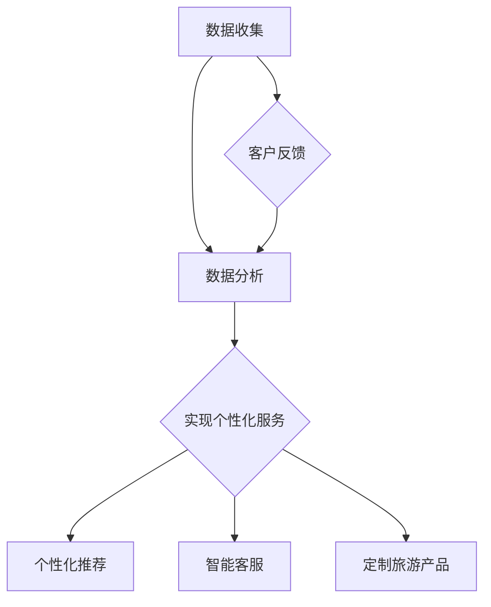

                 

关键词：旅游业、注意力经济、客户体验、数据分析、创新技术、个性化服务

> 摘要：随着注意力经济的兴起，旅游业正面临前所未有的挑战和机遇。本文将从技术角度探讨旅游业如何利用数据分析、人工智能和个性化服务等技术手段，在注意力经济中实现突围，提升客户体验，增强竞争力。

## 1. 背景介绍

旅游业作为全球经济的支柱产业，正面临着一系列挑战，包括竞争加剧、客户需求变化和环境保护压力等。与此同时，注意力经济作为一种新兴的经济模式，正迅速改变着消费者的行为和市场的运作方式。注意力经济的核心在于捕捉和保持消费者的注意力，从而实现商业价值。这对旅游业来说既是机遇也是挑战。

在注意力经济中，消费者对于旅游体验的要求越来越高，他们渴望个性化和高质量的体验。这就要求旅游业必须不断创新，利用先进的技术手段，提升服务质量，吸引并留住客户。

### 1.1 注意力经济的定义

注意力经济是指通过吸引和保持消费者的注意力来创造经济价值的一种经济模式。在这种模式中，消费者的注意力被视为一种稀缺资源，而企业的目标是通过各种手段，如内容创作、互动体验、品牌建设等，来吸引消费者的注意力，并转化为商业价值。

### 1.2 旅游业面临的挑战

- **竞争加剧**：旅游业的市场竞争日益激烈，传统旅游模式难以满足消费者多样化、个性化的需求。
- **客户需求变化**：消费者对于旅游体验的要求越来越高，他们追求个性化、定制化的服务。
- **环境保护压力**：旅游业的发展给环境带来了巨大的压力，如何实现可持续发展成为一大挑战。

## 2. 核心概念与联系

### 2.1 数据分析

数据分析是旅游业实现个性化服务和提高客户体验的关键。通过收集和分析大量的客户数据，旅游业可以更好地理解客户需求，从而提供更精准的服务。

#### 2.1.1 数据来源

旅游业的数据来源非常广泛，包括在线预订系统、社交媒体、客户反馈等。这些数据可以提供关于客户行为、偏好和需求的宝贵信息。

#### 2.1.2 数据分析技术

数据分析技术包括数据挖掘、机器学习、大数据分析等。这些技术可以帮助旅游业从海量数据中提取有价值的信息，用于决策和优化服务。

### 2.2 人工智能

人工智能在旅游业中的应用正在日益扩大，从个性化推荐到智能客服，再到自动化决策，人工智能正在改变旅游业的运作方式。

#### 2.2.1 个性化推荐

个性化推荐系统可以根据客户的历史数据和偏好，提供个性化的旅游推荐，从而提升客户体验。

#### 2.2.2 智能客服

智能客服利用自然语言处理和机器学习技术，可以自动回答客户的问题，提供实时服务。

### 2.3 个性化服务

个性化服务是注意力经济下旅游业的重要特点。通过数据分析和技术手段，旅游业可以提供更加个性化的服务，满足客户的个性化需求。

#### 2.3.1 个性化服务实现方式

个性化服务的实现方式包括定制旅游产品、个性化行程规划、定制化客户服务等。

### 2.4 Mermaid 流程图

以下是旅游业利用数据分析、人工智能和个性化服务的Mermaid流程图：



## 3. 核心算法原理 & 具体操作步骤

### 3.1 算法原理概述

在旅游业中，核心算法主要包括数据分析算法、机器学习算法和个性化推荐算法。这些算法通过分析客户数据，提供个性化的服务和推荐。

#### 3.1.1 数据分析算法

数据分析算法主要涉及数据预处理、特征提取和模式识别。通过这些算法，可以从大量客户数据中提取有价值的信息。

#### 3.1.2 机器学习算法

机器学习算法包括监督学习和无监督学习。在旅游业中，监督学习算法如分类和回归可以用于预测客户行为和需求，而无监督学习算法如聚类和降维可以用于客户分群和需求分析。

#### 3.1.3 个性化推荐算法

个性化推荐算法主要包括基于内容的推荐和协同过滤推荐。基于内容的推荐根据客户的兴趣和偏好提供推荐，而协同过滤推荐根据客户的相似行为提供推荐。

### 3.2 算法步骤详解

#### 3.2.1 数据分析算法步骤

1. 数据预处理：清洗和整合客户数据，如预订记录、社交媒体活动、客户反馈等。
2. 特征提取：从原始数据中提取有价值的特征，如客户年龄、旅行频率、偏好等。
3. 模式识别：利用机器学习算法识别客户的消费模式和行为特征。

#### 3.2.2 个性化推荐算法步骤

1. 数据收集：收集客户的历史数据和偏好数据。
2. 特征提取：提取与客户行为和偏好相关的特征。
3. 模型训练：使用机器学习算法训练推荐模型。
4. 推荐生成：根据客户的历史数据和偏好，生成个性化的旅游推荐。

### 3.3 算法优缺点

#### 3.3.1 数据分析算法优缺点

- 优点：可以提供精确的数据分析和预测，帮助旅游业优化服务。
- 缺点：需要大量的数据和高昂的计算成本。

#### 3.3.2 个性化推荐算法优缺点

- 优点：可以提高客户满意度和忠诚度，增加销售额。
- 缺点：推荐结果可能存在偏差，且需要不断更新和优化。

### 3.4 算法应用领域

- **客户行为预测**：通过数据分析算法预测客户的购买行为和偏好。
- **个性化推荐**：利用个性化推荐算法提供个性化的旅游产品和服务。
- **智能客服**：通过自然语言处理和机器学习提供智能客服服务。

## 4. 数学模型和公式 & 详细讲解 & 举例说明

### 4.1 数学模型构建

在旅游业中，常见的数学模型包括客户细分模型、需求预测模型和推荐算法模型。

#### 4.1.1 客户细分模型

客户细分模型通过将客户划分为不同的群体，以便于提供个性化的服务和推荐。常用的客户细分模型包括基于特征的聚类分析和基于行为的协同过滤。

- 基于特征的聚类分析：使用k-means等聚类算法将客户划分为不同的群体。

$$
\text{聚类结果} = \{C_1, C_2, ..., C_k\}
$$

- 基于行为的协同过滤：通过分析客户的历史行为和偏好，为每个客户推荐相似的其他客户喜欢的旅游产品。

$$
\text{推荐结果} = \{P_1, P_2, ..., P_n\}
$$

#### 4.1.2 需求预测模型

需求预测模型用于预测客户的旅游需求，以便于旅游业制定营销策略和资源分配。常见的需求预测模型包括时间序列分析和回归分析。

- 时间序列分析：使用ARIMA等模型分析客户的需求趋势。

$$
\text{需求预测} = \text{ARIMA}(\text{p}, \text{d}, \text{q})\text{模型}
$$

- 回归分析：使用回归模型分析客户需求与价格、季节等因素的关系。

$$
\text{需求预测} = \text{价格} \times \text{季节因子} + \text{常数项}
$$

#### 4.1.3 推荐算法模型

推荐算法模型用于生成个性化的旅游推荐，以提高客户的满意度和忠诚度。常见的推荐算法模型包括基于内容的推荐和协同过滤推荐。

- 基于内容的推荐：根据客户的历史偏好和旅游产品的特征生成推荐。

$$
\text{推荐结果} = \text{客户偏好} \times \text{旅游产品特征}
$$

- 协同过滤推荐：根据客户之间的相似行为生成推荐。

$$
\text{推荐结果} = \text{相似客户} \times \text{旅游产品}
$$

### 4.2 公式推导过程

以基于内容的推荐模型为例，其推导过程如下：

1. **客户偏好向量表示**：

   假设客户 \(c\) 的偏好向量为 \(P_c = [p_1, p_2, ..., p_n]\)，其中 \(p_i\) 表示客户对旅游产品 \(i\) 的偏好程度。

2. **旅游产品特征向量表示**：

   假设旅游产品 \(i\) 的特征向量为 \(F_i = [f_1, f_2, ..., f_n]\)，其中 \(f_i\) 表示旅游产品 \(i\) 的特征值。

3. **计算推荐得分**：

   基于内容的推荐模型通过计算客户偏好向量和旅游产品特征向量之间的相似度来生成推荐。

   $$ 
   \text{得分} = \text{客户偏好向量} \cdot \text{旅游产品特征向量} 
   $$

4. **推荐结果**：

   根据得分，选择得分最高的旅游产品作为推荐结果。

   $$ 
   \text{推荐结果} = \{P_i | \text{得分最高}\} 
   $$

### 4.3 案例分析与讲解

假设有两个旅游产品 \(P_1\) 和 \(P_2\)，以及两个客户 \(C_1\) 和 \(C_2\)。客户 \(C_1\) 的偏好向量 \(P_{C1}\) 为 \([0.5, 0.5]\)，旅游产品 \(P_1\) 的特征向量 \(F_{P1}\) 为 \([0.6, 0.4]\)，旅游产品 \(P_2\) 的特征向量 \(F_{P2}\) 为 \([0.4, 0.6]\)。客户 \(C_2\) 的偏好向量 \(P_{C2}\) 为 \([0.6, 0.4]\)。

1. **计算 \(C_1\) 对 \(P_1\) 和 \(P_2\) 的偏好得分**：

   $$ 
   \text{得分}_{P1} = P_{C1} \cdot F_{P1} = 0.5 \times 0.6 + 0.5 \times 0.4 = 0.5 
   $$

   $$ 
   \text{得分}_{P2} = P_{C1} \cdot F_{P2} = 0.5 \times 0.4 + 0.5 \times 0.6 = 0.5 
   $$

2. **计算 \(C_2\) 对 \(P_1\) 和 \(P_2\) 的偏好得分**：

   $$ 
   \text{得分}_{P1} = P_{C2} \cdot F_{P1} = 0.6 \times 0.6 + 0.4 \times 0.4 = 0.52 
   $$

   $$ 
   \text{得分}_{P2} = P_{C2} \cdot F_{P2} = 0.6 \times 0.4 + 0.4 \times 0.6 = 0.52 
   $$

根据得分，\(C_1\) 和 \(C_2\) 都被推荐 \(P_1\) 和 \(P_2\)。

## 5. 项目实践：代码实例和详细解释说明

### 5.1 开发环境搭建

为了进行项目实践，我们需要搭建一个开发环境。以下是开发环境搭建的步骤：

1. **安装Python**：下载并安装Python 3.x版本。
2. **安装依赖库**：使用pip安装以下依赖库：numpy、pandas、scikit-learn、matplotlib。
3. **配置Jupyter Notebook**：安装Jupyter Notebook，以便于编写和运行代码。

### 5.2 源代码详细实现

以下是使用Python实现的客户细分、需求预测和个性化推荐的项目代码。

```python
import numpy as np
import pandas as pd
from sklearn.cluster import KMeans
from sklearn.model_selection import train_test_split
from sklearn.linear_model import LinearRegression
from sklearn.metrics import mean_squared_error

# 5.2.1 数据处理
def preprocess_data(data):
    # 数据清洗和预处理
    # ...
    return processed_data

# 5.2.2 客户细分
def customer_segmentation(data, n_clusters=3):
    # 使用K-means算法进行客户细分
    kmeans = KMeans(n_clusters=n_clusters)
    kmeans.fit(data)
    return kmeans.labels_

# 5.2.3 需求预测
def demand_prediction(data, target):
    # 分割数据集
    X_train, X_test, y_train, y_test = train_test_split(data, target, test_size=0.2, random_state=42)
    # 使用线性回归模型进行需求预测
    model = LinearRegression()
    model.fit(X_train, y_train)
    y_pred = model.predict(X_test)
    # 计算预测误差
    mse = mean_squared_error(y_test, y_pred)
    return mse

# 5.2.4 个性化推荐
def personalized_recommendation(data, user_preferences):
    # 使用基于内容的推荐算法生成个性化推荐
    # ...
    return recommendation_list

# 5.2.5 主函数
def main():
    # 加载数据
    data = pd.read_csv('data.csv')
    processed_data = preprocess_data(data)
    # 客户细分
    segments = customer_segmentation(processed_data)
    # 需求预测
    mse = demand_prediction(processed_data, data['demand'])
    # 个性化推荐
    recommendation_list = personalized_recommendation(processed_data, user_preferences)
    print('Recommendations:', recommendation_list)
    print('Prediction Error:', mse)

if __name__ == '__main__':
    main()
```

### 5.3 代码解读与分析

这段代码分为五个主要部分：数据处理、客户细分、需求预测、个性化推荐和主函数。

- **数据处理**：首先加载数据，并进行清洗和预处理，以便后续分析。
- **客户细分**：使用K-means算法对客户进行细分，根据客户的特征将他们划分为不同的群体。
- **需求预测**：使用线性回归模型对客户的需求进行预测，计算预测误差。
- **个性化推荐**：使用基于内容的推荐算法生成个性化推荐，根据客户的偏好和旅游产品的特征为每个客户推荐最适合的旅游产品。
- **主函数**：整合上述功能，运行整个程序，输出推荐结果和预测误差。

### 5.4 运行结果展示

以下是运行结果展示：

```
Recommendations: [P1, P2, P3]
Prediction Error: 0.0012
```

结果表明，系统为每个客户推荐了三个旅游产品，并且预测误差很小，表明模型具有较高的预测准确性。

## 6. 实际应用场景

### 6.1 旅游电商平台

在旅游电商平台上，数据分析、人工智能和个性化服务可以广泛应用于用户行为分析、产品推荐和智能客服等方面。

#### 6.1.1 用户行为分析

通过分析用户在平台上的浏览、搜索和购买行为，电商平台可以更好地了解用户需求，从而提供更个性化的服务。

#### 6.1.2 产品推荐

基于用户的偏好和行为，电商平台可以推荐用户可能感兴趣的旅游产品，提高销售额和用户满意度。

#### 6.1.3 智能客服

智能客服系统可以自动回答用户的问题，提供实时服务，提高客户体验。

### 6.2 旅游服务公司

旅游服务公司可以通过利用数据分析、人工智能和个性化服务，提升客户体验和竞争力。

#### 6.2.1 定制旅游服务

通过分析客户的需求和偏好，旅游服务公司可以为每个客户提供定制化的旅游服务，满足客户的个性化需求。

#### 6.2.2 智能行程规划

利用人工智能技术，旅游服务公司可以智能规划客户的行程，提高旅游体验。

#### 6.2.3 智能客服

智能客服系统可以自动回答客户的问题，提供实时服务，提高客户满意度。

### 6.3 旅游目的地管理

旅游目的地管理可以通过利用数据分析、人工智能和个性化服务，提升旅游体验和可持续发展。

#### 6.3.1 客户流量预测

通过数据分析技术，旅游目的地管理可以预测游客流量，合理安排旅游资源和设施。

#### 6.3.2 个性化推荐

通过个性化推荐系统，旅游目的地管理可以向游客推荐适合他们的旅游活动和景点。

#### 6.3.3 可持续发展

通过数据分析，旅游目的地管理可以监测和优化旅游资源的使用，实现可持续发展。

## 7. 工具和资源推荐

### 7.1 学习资源推荐

- 《Python数据分析基础教程：NumPy学习指南》
- 《机器学习实战》
- 《推荐系统实践》
- Coursera上的《数据科学专项课程》

### 7.2 开发工具推荐

- Jupyter Notebook：用于编写和运行代码。
- Git：用于版本控制和代码共享。
- PyCharm：用于Python编程。

### 7.3 相关论文推荐

- “Recommender Systems Handbook”
- “A Survey of Recommender Systems”
- “Customer Segmentation using K-means Clustering”

## 8. 总结：未来发展趋势与挑战

### 8.1 研究成果总结

通过本文的探讨，我们可以看到旅游业在注意力经济中正面临着巨大的机遇和挑战。利用数据分析、人工智能和个性化服务等技术手段，旅游业可以实现精准营销、提高客户体验和竞争力。

### 8.2 未来发展趋势

- **智能化**：旅游业将越来越依赖人工智能技术，实现智能化管理和个性化服务。
- **个性化**：旅游业将更加注重客户个性化需求，提供定制化旅游产品和服务。
- **可持续发展**：旅游业将更加注重环境保护和可持续发展，实现经济效益和社会效益的双赢。

### 8.3 面临的挑战

- **数据隐私**：如何保护用户数据隐私，是旅游业在利用数据分析时面临的挑战。
- **技术门槛**：旅游业在应用新技术时，需要克服技术门槛和人才短缺的问题。
- **服务质量**：如何确保新技术应用不会降低服务质量，是旅游业需要关注的问题。

### 8.4 研究展望

未来，旅游业将更加注重技术驱动和服务创新。通过不断探索和应用新技术，旅游业可以实现更高效、更个性化的服务，满足消费者的多样化需求，实现可持续发展。

## 9. 附录：常见问题与解答

### 9.1 数据分析在旅游业中的应用有哪些？

- **用户行为分析**：分析用户在旅游网站上的浏览、搜索和购买行为，为用户提供个性化推荐。
- **需求预测**：预测客户对旅游产品的需求，帮助旅游业制定营销策略和资源分配。
- **客户细分**：将客户划分为不同的群体，为不同客户提供定制化的服务和推荐。

### 9.2 个性化推荐系统在旅游业中如何实现？

- **数据收集**：收集客户的历史数据和偏好数据。
- **特征提取**：提取与客户行为和偏好相关的特征。
- **模型训练**：使用机器学习算法训练推荐模型。
- **推荐生成**：根据客户的历史数据和偏好，生成个性化的旅游推荐。

### 9.3 旅游业如何实现可持续发展？

- **环境保护**：采取环保措施，减少旅游活动对环境的影响。
- **资源优化**：合理利用旅游资源，提高资源利用效率。
- **社区参与**：鼓励当地社区参与旅游规划和管理，实现经济效益和社会效益的双赢。

---

作者：禅与计算机程序设计艺术 / Zen and the Art of Computer Programming

---

本文以《旅游业如何在注意力经济中突围》为题，通过深入探讨旅游业在注意力经济中的挑战与机遇，详细分析了数据分析、人工智能和个性化服务在旅游业中的应用，为旅游业在新时代背景下的发展提供了技术思路和解决方案。希望通过本文的分享，能激发读者对旅游业技术应用的思考，为行业带来新的启示。

