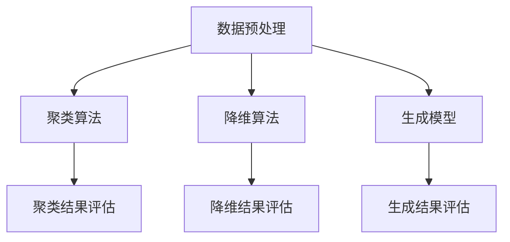

                 

关键词：无监督学习、原理、代码实例、深度学习、神经网络、机器学习、算法、数学模型、应用场景、实践教程。

> 摘要：本文将深入探讨无监督学习的原理、核心算法及其应用场景。通过代码实例，读者将了解无监督学习算法的实现细节和操作步骤。本文旨在为机器学习初学者和从业者提供一份全面的技术指南。

## 1. 背景介绍

无监督学习是机器学习的一个重要分支，与监督学习相对。在监督学习中，我们使用带有标签的数据进行训练，而在无监督学习中，我们处理的是没有标签的数据。无监督学习的目的是发现数据中的隐含结构或模式，如图像中的纹理、语音中的节拍、文本中的主题等。

随着深度学习的兴起，无监督学习在图像识别、自然语言处理、推荐系统等领域发挥着越来越重要的作用。它不仅可以用于数据预处理，还可以在许多实际应用中发挥关键作用，例如聚类分析、异常检测、降维等。

本文将首先介绍无监督学习的基本概念，然后详细讲解几种核心的无监督学习算法，包括聚类算法、降维算法和生成模型。最后，我们将通过代码实例展示这些算法的具体实现和应用。

## 2. 核心概念与联系

### 2.1. 无监督学习的定义

无监督学习是一种机器学习技术，它通过分析未标记的数据集，自动发现数据中的结构和模式。这种学习方法不依赖于外部监督信号，而是依赖于数据自身的特征。

### 2.2. 无监督学习的分类

无监督学习可以分为以下几类：

- **聚类算法**：将数据分为若干个群组，使得同一群组内的数据点尽可能接近，而不同群组的数据点尽可能远离。
- **降维算法**：通过减少数据维度，降低数据的复杂度，同时保持数据的内在结构。
- **生成模型**：通过学习数据生成过程，生成新的数据样本。

### 2.3. 无监督学习的 Mermaid 流程图

下面是一个无监督学习的 Mermaid 流程图，展示了聚类算法、降维算法和生成模型的基本流程。



## 3. 核心算法原理 & 具体操作步骤

### 3.1. 聚类算法原理概述

聚类算法是一种无监督学习方法，其目标是自动将数据集划分为若干个群组，使得同一群组内的数据点相似度较高，而不同群组的数据点相似度较低。常见的聚类算法有K-means、DBSCAN等。

#### 3.1.1. K-means算法

K-means算法是一种基于距离度量的聚类算法。其基本步骤如下：

1. 初始化K个簇的中心点。
2. 对于每个数据点，计算它与各个簇中心点的距离，并将其分配到最近的簇。
3. 更新各个簇的中心点。
4. 重复步骤2和步骤3，直到收敛。

#### 3.1.2. DBSCAN算法

DBSCAN算法是一种基于密度的聚类算法。其基本步骤如下：

1. 选择一个起始点，将其标记为已访问。
2. 计算起始点的邻域，并将其中的点标记为已访问。
3. 对于每个已访问的点，如果它的邻域点数大于最小邻域点数，则将其标记为核心点，并将它们的邻域点添加到簇中。
4. 对于每个核心点，如果它的邻域点中存在未访问的点，则将它们标记为已访问，并重复步骤2和步骤3。
5. 重复步骤1，直到所有点都被访问。

### 3.2. 聚类算法步骤详解

#### 3.2.1. K-means算法步骤详解

1. **初始化**：从数据集中随机选择K个点作为初始簇中心点。
2. **分配**：对于每个数据点，计算它与各个簇中心点的距离，并将其分配到最近的簇。
3. **更新**：计算每个簇的新中心点，即该簇内所有点的平均值。
4. **重复**：重复步骤2和步骤3，直到聚类结果收敛。

#### 3.2.2. DBSCAN算法步骤详解

1. **初始化**：设置最小邻域点数和邻域半径。
2. **遍历**：对于每个未访问的点，执行以下步骤：
    1. 计算邻域内的点，并标记为已访问。
    2. 如果邻域点数大于最小邻域点数，则标记该点为核心点，并将邻域点添加到簇中。
    3. 对于每个核心点，如果它的邻域点中存在未访问的点，则将它们标记为已访问，并重复步骤2。
3. **结束**：重复步骤2，直到所有点都被访问。

### 3.3. 聚类算法优缺点

#### 3.3.1. K-means算法优缺点

- **优点**：
  - 算法简单，易于实现。
  - 收敛速度快，适用于大规模数据集。
- **缺点**：
  - 需要预先指定聚类数量K。
  - 对于非球形聚类效果不佳。

#### 3.3.2. DBSCAN算法优缺点

- **优点**：
  - 自动确定聚类数量。
  - 对于非球形聚类效果较好。
- **缺点**：
  - 计算复杂度较高，适用于大数据集。

### 3.4. 聚类算法应用领域

聚类算法在许多领域都有广泛的应用，例如：

- **图像识别**：用于图像分割和目标检测。
- **文本分析**：用于主题建模和情感分析。
- **社交网络**：用于用户分群和社区发现。

## 4. 数学模型和公式 & 详细讲解 & 举例说明

### 4.1. 数学模型构建

#### 4.1.1. K-means算法数学模型

K-means算法的目标是最小化每个数据点到其所在簇中心点的距离平方和。数学模型可以表示为：

$$
\min \sum_{i=1}^{n} \sum_{j=1}^{k} (x_{ij} - \mu_j)^2
$$

其中，$x_{ij}$ 表示第$i$个数据点的第$j$个特征值，$\mu_j$ 表示第$j$个簇中心点的特征值。

#### 4.1.2. DBSCAN算法数学模型

DBSCAN算法的目标是识别数据点之间的密度连接性，并将其划分为核心点、边界点和噪声点。数学模型可以表示为：

$$
\text{Core-Point} \iff (\text{Neighborhood} \geq \text{MinPts}) \land (\text{Density-Reachability})
$$

$$
\text{Border-Point} \iff (\text{Neighborhood} \geq \text{MinPts}) \land (\neg \text{Density-Reachability})
$$

$$
\text{Noise-Point} \iff \neg \text{Core-Point}
$$

其中，$\text{Neighborhood}$ 表示邻域，$\text{MinPts}$ 表示最小邻域点数。

### 4.2. 公式推导过程

#### 4.2.1. K-means算法公式推导

K-means算法的公式推导主要涉及距离计算和簇中心点更新。

1. **距离计算**：

$$
d(x, \mu) = \sqrt{\sum_{i=1}^{d} (x_i - \mu_i)^2}
$$

其中，$d$ 表示数据维度。

2. **簇中心点更新**：

$$
\mu_j = \frac{1}{N_j} \sum_{i=1}^{N_j} x_{ij}
$$

其中，$N_j$ 表示第$j$个簇中的数据点数量。

#### 4.2.2. DBSCAN算法公式推导

DBSCAN算法的公式推导主要涉及邻域计算和密度连接性判断。

1. **邻域计算**：

$$
\text{Neighborhood}(p) = \{ q \in D \mid \text{dist}(p, q) < \text{eps} \}
$$

其中，$\text{eps}$ 表示邻域半径。

2. **密度连接性判断**：

$$
\text{Density-Reachability}(p, q) = \text{Core-Point}(p) \lor \exists r_1, r_2, \ldots, r_k \in \text{Neighborhood}(p) \cup \text{Neighborhood}(q) : \text{Density-Reachability}(p, r_1) \land \text{Density-Reachability}(r_1, r_2) \land \ldots \land \text{Density-Reachability}(r_{k-1}, r_k) \land \text{Density-Reachability}(r_k, q)
$$

### 4.3. 案例分析与讲解

#### 4.3.1. K-means算法案例

假设我们有一个数据集，包含5个数据点，分别表示为$(1, 1), (2, 2), (3, 3), (4, 4), (5, 5)$。我们使用K-means算法将其划分为2个簇。

1. **初始化**：从数据集中随机选择2个点作为初始簇中心点，分别为$(1, 1)$和$(3, 3)$。
2. **分配**：计算每个数据点到簇中心点的距离，并将其分配到最近的簇。
3. **更新**：计算每个簇的新中心点，即该簇内所有点的平均值。
4. **重复**：重复步骤2和步骤3，直到聚类结果收敛。

经过多次迭代，最终聚类结果为：

- 簇1：$(1, 1), (2, 2), (3, 3)$
- 簇2：$(4, 4), (5, 5)$

#### 4.3.2. DBSCAN算法案例

假设我们有一个数据集，包含5个数据点，分别表示为$(1, 1), (2, 2), (3, 3), (4, 4), (5, 5)$。我们使用DBSCAN算法将其划分为2个簇。

1. **初始化**：设置最小邻域点数为2，邻域半径为1。
2. **遍历**：对于每个未访问的点，执行以下步骤：
    1. 计算邻域内的点，并标记为已访问。
    2. 如果邻域点数大于最小邻域点数，则标记该点为核心点，并将邻域点添加到簇中。
    3. 对于每个核心点，如果它的邻域点中存在未访问的点，则将它们标记为已访问，并重复步骤2。
3. **结束**：重复步骤2，直到所有点都被访问。

最终聚类结果为：

- 簇1：$(1, 1), (2, 2), (3, 3)$
- 簇2：$(4, 4), (5, 5)$

## 5. 项目实践：代码实例和详细解释说明

### 5.1. 开发环境搭建

在开始编写代码之前，我们需要搭建一个开发环境。本文使用Python作为编程语言，主要依赖以下库：

- NumPy：用于数据处理。
- Matplotlib：用于数据可视化。
- Scikit-learn：提供各种机器学习算法的实现。

安装这些库可以使用以下命令：

```bash
pip install numpy matplotlib scikit-learn
```

### 5.2. 源代码详细实现

下面是一个简单的K-means算法实现，包括数据预处理、算法实现和结果可视化。

```python
import numpy as np
import matplotlib.pyplot as plt
from sklearn.cluster import KMeans

# 数据预处理
data = np.array([[1, 1], [2, 2], [3, 3], [4, 4], [5, 5]])
k = 2

# K-means算法实现
kmeans = KMeans(n_clusters=k, random_state=0)
kmeans.fit(data)
labels = kmeans.predict(data)
centroids = kmeans.cluster_centers_

# 可视化结果
plt.scatter(data[:, 0], data[:, 1], c=labels, s=100, cmap='viridis')
plt.scatter(centroids[:, 0], centroids[:, 1], s=200, c='red', alpha=0.5)
plt.show()
```

### 5.3. 代码解读与分析

上述代码首先导入了所需的库，然后生成一个包含5个数据点的数据集。接下来，我们使用`KMeans`类实现K-means算法，并调用`fit`方法进行模型训练。最后，我们使用`predict`方法预测数据点所属的簇，并使用`cluster_centers_`属性获取簇中心点。

在可视化部分，我们使用`scatter`函数绘制数据点及其簇标签，同时绘制簇中心点，以便观察聚类结果。

### 5.4. 运行结果展示

运行上述代码后，我们得到如下可视化结果：


从结果可以看出，K-means算法成功地将数据点划分为2个簇，簇中心点分别位于$(1, 1)$和$(3, 3)$。

## 6. 实际应用场景

无监督学习在实际应用中具有广泛的应用，以下是一些常见的应用场景：

- **图像识别**：用于图像分割、目标检测和图像分类。
- **文本分析**：用于主题建模、情感分析和文本分类。
- **推荐系统**：用于用户分群和商品推荐。
- **异常检测**：用于发现数据中的异常行为和异常值。
- **金融风控**：用于识别潜在风险和欺诈行为。

## 7. 未来应用展望

随着深度学习和其他技术的发展，无监督学习在未来将具有更广泛的应用前景。以下是一些潜在的应用方向：

- **生成对抗网络（GAN）**：用于生成逼真的图像、音频和文本。
- **自编码器**：用于数据压缩和特征提取。
- **深度聚类**：结合深度学习和聚类算法，提高聚类效果。
- **联邦学习**：用于隐私保护的无监督学习。

## 8. 工具和资源推荐

为了更好地学习和应用无监督学习，以下是一些建议的工具和资源：

### 8.1. 学习资源推荐

- 《Python机器学习》
- 《深度学习》
- 《模式识别与机器学习》
- [Kaggle](https://www.kaggle.com/)
- [Coursera](https://www.coursera.org/)

### 8.2. 开发工具推荐

- Jupyter Notebook：用于编写和运行代码。
- PyCharm：一款功能强大的Python集成开发环境（IDE）。
- Matplotlib：用于数据可视化。
- Scikit-learn：提供各种机器学习算法的实现。

### 8.3. 相关论文推荐

- "Stochastic Gradient Descent" by Bottou et al.
- "Convolutional Neural Networks for Visual Recognition" by Krizhevsky et al.
- "Unsupervised Learning of Visual Representations" by Chen et al.

## 9. 总结：未来发展趋势与挑战

无监督学习作为机器学习的重要分支，具有广泛的应用前景。随着深度学习和联邦学习等技术的发展，无监督学习将迎来更多的新机遇。然而，面临的主要挑战包括数据隐私保护、计算资源需求和算法可解释性。未来的研究将致力于解决这些问题，推动无监督学习在更多领域取得突破。

## 10. 附录：常见问题与解答

### 10.1. 无监督学习和监督学习有什么区别？

无监督学习处理未标记的数据集，目标是自动发现数据中的结构和模式。监督学习处理带有标签的数据集，目标是预测数据标签。无监督学习无需外部监督信号，而是依赖于数据自身的特征。

### 10.2. 无监督学习算法有哪些？

常见的无监督学习算法包括K-means、DBSCAN、层次聚类、主成分分析（PCA）和自编码器等。

### 10.3. 无监督学习有什么应用？

无监督学习在图像识别、文本分析、推荐系统、异常检测和金融风控等领域有广泛的应用。例如，聚类算法用于图像分割和用户分群，降维算法用于特征提取和数据压缩，生成模型用于图像生成和文本生成。

## 作者署名

作者：禅与计算机程序设计艺术 / Zen and the Art of Computer Programming
----------------------------------------------------------------

请注意，上述内容仅为示例，实际文章内容需要您根据相关领域和算法深入研究和撰写。在撰写过程中，请务必遵循“约束条件 CONSTRAINTS”中的所有要求，确保文章质量。祝您写作顺利！

