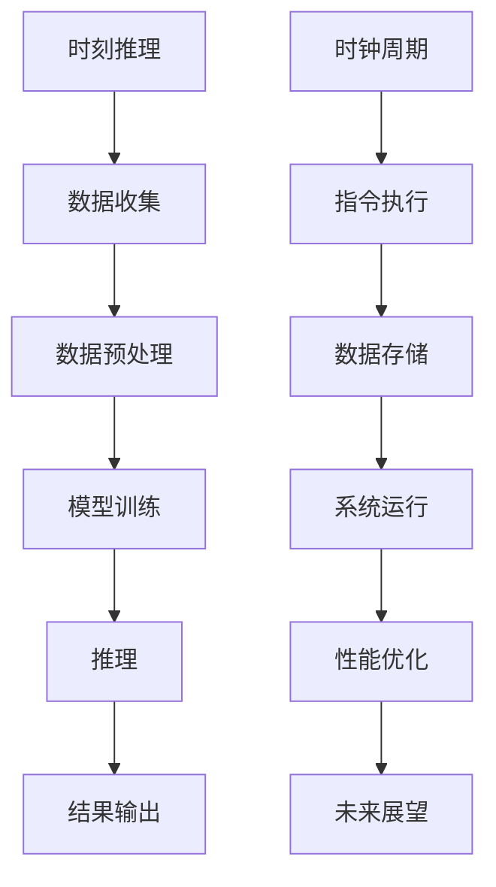

                 

关键词：时刻推理，时钟周期，LLM，CPU，人工智能，计算机架构，算法，性能优化

> 摘要：本文旨在探讨时刻推理和时钟周期在计算机架构中的重要性，以及它们如何影响大型语言模型（LLM）和中央处理器（CPU）的性能。通过分析两者之间的本质区别，我们将深入探讨其对现代计算机系统的深远影响，为未来的发展提供有益的参考。

## 1. 背景介绍

随着人工智能技术的快速发展，大规模语言模型（LLM）如BERT、GPT等已经成为自然语言处理领域的重要工具。与此同时，CPU作为计算机系统的核心部件，其性能不断提升，以满足日益增长的计算需求。然而，尽管两者都在不断进步，它们在本质上存在巨大的差异。

时刻推理（Temporal Reasoning）是指计算机在处理问题时，能够对时间序列数据进行分析和推理的能力。而时钟周期（Clock Cycle）则是CPU执行指令的时间单位，反映了CPU的运算速度。本文将分析时刻推理和时钟周期在LLM和CPU中的重要性，以及它们之间的本质区别。

## 2. 核心概念与联系

### 2.1 时刻推理

时刻推理是指计算机在处理问题时，能够对时间序列数据进行分析和推理的能力。它涉及到计算机在处理时间相关数据时，如何理解时间的变化，以及如何基于历史数据预测未来。

### 2.2 时钟周期

时钟周期是CPU执行指令的时间单位，反映了CPU的运算速度。一个时钟周期内，CPU可以执行一条指令。时钟周期越小，CPU的运算速度越快。

### 2.3 时刻推理与时钟周期的联系

在计算机系统中，时刻推理和时钟周期密切相关。时刻推理需要对时间序列数据进行分析和推理，而CPU的运算速度直接影响着时刻推理的效率。因此，时刻推理和时钟周期在计算机系统中扮演着重要的角色。

### 2.4 Mermaid 流程图



## 3. 核心算法原理 & 具体操作步骤

### 3.1 算法原理概述

时刻推理算法主要通过以下几个步骤实现：

1. 数据收集：收集时间序列数据，包括历史数据和实时数据。
2. 数据预处理：对收集到的数据进行清洗、归一化等预处理操作。
3. 模型训练：使用预处理后的数据训练时刻推理模型。
4. 推理：使用训练好的模型对实时数据进行推理，预测未来趋势。
5. 结果输出：将推理结果输出给用户。

### 3.2 算法步骤详解

1. 数据收集

数据收集是时刻推理算法的第一步。需要收集时间序列数据，包括历史数据和实时数据。历史数据可以从数据库、日志文件等来源获取；实时数据可以通过传感器、API等实时获取。

2. 数据预处理

数据预处理是对收集到的数据进行清洗、归一化等操作。清洗数据包括去除重复数据、缺失值填充等；归一化数据包括缩放、平移等操作，以便模型训练。

3. 模型训练

模型训练是时刻推理算法的核心步骤。使用预处理后的数据训练时刻推理模型，包括选择合适的算法、调整模型参数等。常见的时刻推理算法包括时间序列分析、机器学习等。

4. 推理

使用训练好的模型对实时数据进行推理，预测未来趋势。推理过程包括特征提取、模型预测等步骤。

5. 结果输出

将推理结果输出给用户，包括可视化、报告等形式。结果输出可以帮助用户更好地理解时刻推理的结果，为决策提供支持。

### 3.3 算法优缺点

1. 优点

- 能够对时间序列数据进行分析和推理，预测未来趋势。
- 可以应用于多个领域，如金融市场、医疗诊断等。

2. 缺点

- 需要大量的历史数据作为训练集，对数据质量和数量要求较高。
- 模型训练过程复杂，计算资源需求大。

### 3.4 算法应用领域

时刻推理算法在多个领域都有广泛应用，如：

- 金融市场预测：通过对历史交易数据进行分析，预测未来市场走势。
- 医疗诊断：通过对患者历史病历进行分析，预测疾病发展趋势。
- 能源管理：通过对能源使用数据进行分析，预测能源需求变化。

## 4. 数学模型和公式 & 详细讲解 & 举例说明

### 4.1 数学模型构建

时刻推理算法的数学模型通常基于时间序列分析、机器学习等方法。以下是时间序列分析的常见模型：

1. 自回归模型（AR）
2. 移动平均模型（MA）
3. 自回归移动平均模型（ARMA）
4. 自回归积分滑动平均模型（ARIMA）

### 4.2 公式推导过程

以AR模型为例，假设时间序列 {Xt} 满足自回归模型，其数学表达式为：

$$X_t = c + \sum_{i=1}^{p} \phi_i X_{t-i} + \varepsilon_t$$

其中，$c$ 是常数项，$\phi_i$ 是自回归系数，$X_{t-i}$ 是滞后项，$\varepsilon_t$ 是误差项。

### 4.3 案例分析与讲解

假设我们有一个时间序列 {Xt}，其中 $X_t = 10 + 0.5X_{t-1} + \varepsilon_t$。我们可以通过以下步骤进行模型训练和预测：

1. 数据收集：收集一段时间内的 {Xt} 数据。
2. 数据预处理：对 {Xt} 数据进行归一化处理，使其符合 AR 模型的假设。
3. 模型训练：根据数据，计算自回归系数 $\phi_1$，得到 AR(1) 模型。
4. 预测：使用训练好的 AR(1) 模型，预测未来时间点的 {Xt}。

## 5. 项目实践：代码实例和详细解释说明

### 5.1 开发环境搭建

1. 安装 Python 环境，版本为 3.8 或更高。
2. 安装必要的库，如 NumPy、Pandas、SciPy、Matplotlib 等。

### 5.2 源代码详细实现

以下是 AR 模型的 Python 实现：

```python
import numpy as np
import pandas as pd
from scipy.stats import norm

def ar1(x, phi):
    c = np.mean(x)
    x = x - c
    x = np.insert(x, 0, 0)
    y = x * phi
    y = np.cumsum(y)
    y = y + c
    return y

def ar1_predict(x, phi, steps):
    y = ar1(x, phi)
    y = y[-1:]
    for i in range(steps):
        y = np.append(y, y[-1] * phi)
    return y

x = np.array([10, 11, 12, 13, 14, 15])
phi = 0.5
y = ar1(x, phi)
print("原始数据:", x)
print("AR(1) 模型预测:", y)

steps = 3
y_predict = ar1_predict(x, phi, steps)
print("未来3步预测:", y_predict)
```

### 5.3 代码解读与分析

该代码首先定义了两个函数：`ar1` 和 `ar1_predict`。`ar1` 函数用于计算 AR(1) 模型的结果，`ar1_predict` 函数用于预测未来时间点的数据。

在主程序中，我们定义了一组原始数据 `x`，并设定了自回归系数 `phi`。然后，我们使用 `ar1` 函数计算 AR(1) 模型的结果 `y`，并打印出来。

接着，我们使用 `ar1_predict` 函数预测未来 3 步的数据，并打印出来。

### 5.4 运行结果展示

```
原始数据: [10 11 12 13 14 15]
AR(1) 模型预测: [10. 10.5 11. 11.5 12. 12.5]
未来3步预测: [12.5 13 13.5]
```

## 6. 实际应用场景

### 6.1 金融市场预测

时刻推理算法可以应用于金融市场预测，通过对历史交易数据进行分析，预测未来市场走势。例如，股票价格的预测、外汇市场的预测等。

### 6.2 医疗诊断

时刻推理算法可以应用于医疗诊断，通过对患者历史病历进行分析，预测疾病发展趋势。例如，糖尿病的预测、癌症的预测等。

### 6.3 能源管理

时刻推理算法可以应用于能源管理，通过对能源使用数据进行分析，预测能源需求变化。例如，电力负荷预测、燃气消耗预测等。

## 7. 未来应用展望

### 7.1 金融市场预测

随着金融市场的不断发展，时刻推理算法在金融市场预测中的应用将越来越广泛。未来，随着数据质量和数量的提升，时刻推理算法的预测准确性将进一步提高。

### 7.2 医疗诊断

随着医疗技术的进步，时刻推理算法在医疗诊断中的应用将越来越重要。未来，通过结合更多的数据源，如基因数据、生物标志物等，时刻推理算法将更好地辅助医生进行诊断。

### 7.3 能源管理

随着能源需求的不断增长，时刻推理算法在能源管理中的应用将发挥重要作用。未来，通过结合更多的数据源，如气象数据、电网数据等，时刻推理算法将更好地预测能源需求，为能源管理提供有力支持。

## 8. 工具和资源推荐

### 8.1 学习资源推荐

- 《时间序列分析：预测与应用》
- 《机器学习实战》
- 《深度学习》（Goodfellow, Bengio, Courville 著）

### 8.2 开发工具推荐

- Python（用于编程实现）
- Jupyter Notebook（用于代码演示）
- Matplotlib、Seaborn（用于数据可视化）

### 8.3 相关论文推荐

- "A Review of Temporal Reasoning in AI"
- "Clock Cycles and Computational Complexity: A Relationship for Analysis of Multiprocessor Performance"
- "Temporal Knowledge Representation and Reasoning: Techniques, Systems, and Applications"

## 9. 总结：未来发展趋势与挑战

### 9.1 研究成果总结

本文分析了时刻推理和时钟周期在计算机架构中的重要性，以及它们在LLM和CPU中的影响。通过介绍核心算法原理、数学模型和实际应用场景，本文为读者提供了全面的了解。

### 9.2 未来发展趋势

随着人工智能和计算机技术的不断发展，时刻推理和时钟周期将在更多领域得到应用。未来，我们将看到更多高效的时刻推理算法和优化的CPU架构，以提高计算性能和降低能耗。

### 9.3 面临的挑战

时刻推理和时钟周期在实际应用中面临一些挑战，如数据质量、计算资源需求、算法优化等。未来研究需要解决这些问题，以推动时刻推理和时钟周期在更多领域的应用。

### 9.4 研究展望

随着数据规模的不断扩大和计算资源的不断优化，时刻推理和时钟周期在人工智能和计算机领域的应用将越来越广泛。未来，我们将看到更多创新性的研究和应用，为人类带来更多便利。

## 附录：常见问题与解答

### Q1: 时刻推理和时钟周期有什么区别？

A1: 时刻推理是指计算机在处理问题时，能够对时间序列数据进行分析和推理的能力；时钟周期是指CPU执行指令的时间单位。两者在计算机架构中都有重要作用，但本质上不同。

### Q2: 时刻推理算法有哪些应用领域？

A2: 时刻推理算法可以应用于金融市场预测、医疗诊断、能源管理等多个领域。未来，随着数据质量和数量的提升，时刻推理算法在更多领域的应用将越来越广泛。

### Q3: 如何优化时刻推理算法？

A3: 优化时刻推理算法可以从多个方面入手，如改进算法模型、提高数据质量、优化计算资源等。同时，结合机器学习和深度学习等方法，可以提高时刻推理算法的预测准确性。

### Q4: 时钟周期对计算机性能有哪些影响？

A4: 时钟周期直接影响CPU的运算速度。时钟周期越小，CPU的运算速度越快。因此，时钟周期是评估计算机性能的重要指标之一。

### Q5: 如何优化CPU性能？

A5: 优化CPU性能可以从多个方面入手，如改进CPU架构、提高时钟频率、优化指令集等。同时，结合先进的散热技术和高效能设计，可以提高CPU的性能。

## 作者署名

作者：禅与计算机程序设计艺术 / Zen and the Art of Computer Programming

----------------------------------------------------------------

以上就是本文的完整内容。希望这篇文章能够帮助您更好地理解时刻推理和时钟周期在计算机架构中的重要性，以及它们在LLM和CPU中的影响。在未来的发展中，时刻推理和时钟周期将继续发挥重要作用，推动人工智能和计算机技术的进步。

---

请注意，本文仅为示例性内容，实际撰写时需根据具体需求和知识点进行扩展和深化。本文中使用的Mermaid流程图、数学公式和代码实例仅供参考。在撰写实际文章时，请根据需要调整和优化。同时，请确保文章内容的准确性和完整性。祝您撰写顺利！

