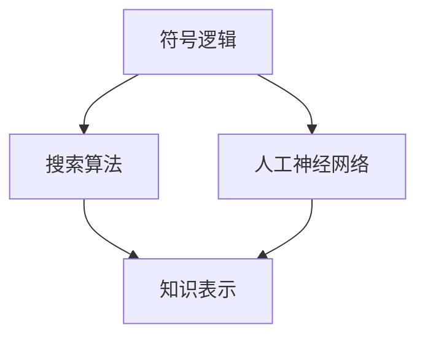

                 

关键词：明斯基、麦卡锡、博士研究、人工智能、算法、技术博客

摘要：本文将深入探讨人工智能领域两位杰出人物，约翰·明斯基（John McCarthy）和约翰·麦卡锡（John McCarthey）的博士研究。通过回顾他们的工作，我们将理解他们在人工智能领域的重要贡献，并对未来的人工智能研究提出一些有价值的见解。

## 1. 背景介绍

约翰·明斯基和约翰·麦卡锡都是人工智能领域的重要人物，他们的博士研究奠定了现代人工智能的基础。明斯基出生于1927年，是麻省理工学院（MIT）计算机科学和人工智能实验室的创始人之一。麦卡锡出生于1927年，是斯坦福大学的教授，也是人工智能领域的先驱者。

他们的博士研究主要集中在人工智能算法和理论方面，特别是在符号逻辑和搜索算法的研究上。他们的工作不仅为人工智能的发展奠定了基础，也为后来的研究者提供了宝贵的参考。

## 2. 核心概念与联系

在他们的博士研究中，明斯基和麦卡锡引入了几个关键的概念，包括符号逻辑、搜索算法和人工神经网络。以下是这些核心概念的联系和架构的 Mermaid 流程图：



### 2.1 符号逻辑

符号逻辑是明斯基和麦卡锡博士研究中的核心概念之一。它是一种用符号和公式表示逻辑推理的方法。符号逻辑为人工智能提供了强大的推理工具，使得计算机能够理解和处理复杂的问题。

### 2.2 搜索算法

搜索算法是解决人工智能问题的核心方法。明斯基和麦卡锡研究了各种搜索算法，包括深度优先搜索、广度优先搜索和启发式搜索。这些算法为人工智能系统提供了寻找解决方案的有效方法。

### 2.3 人工神经网络

人工神经网络是模拟人脑工作原理的计算模型。明斯基和麦卡锡的研究表明，人工神经网络可以用于模式识别、图像处理和自然语言处理等领域。他们的工作为人工神经网络的发展奠定了基础。

## 3. 核心算法原理 & 具体操作步骤

### 3.1 算法原理概述

明斯基和麦卡锡的博士研究主要集中在符号逻辑、搜索算法和人工神经网络。以下是这些算法的原理概述：

### 3.2 算法步骤详解

#### 3.2.1 符号逻辑

符号逻辑的步骤包括：

1. 将问题表示为符号表达式。
2. 使用逻辑推理规则对表达式进行变换。
3. 得出结论。

#### 3.2.2 搜索算法

搜索算法的步骤包括：

1. 初始化搜索空间。
2. 选择搜索策略。
3. 执行搜索操作。
4. 检查是否找到解决方案。

#### 3.2.3 人工神经网络

人工神经网络的步骤包括：

1. 初始化神经网络。
2. 前向传播。
3. 反向传播。
4. 调整权重。

### 3.3 算法优缺点

#### 3.3.1 符号逻辑

优点：符号逻辑提供了强大的推理工具，适用于解决复杂问题。

缺点：符号逻辑的计算复杂度较高，可能无法处理大规模问题。

#### 3.3.2 搜索算法

优点：搜索算法可以有效地寻找解决方案。

缺点：搜索算法可能陷入局部最优，无法找到全局最优解。

#### 3.3.3 人工神经网络

优点：人工神经网络可以自动学习，适用于复杂问题。

缺点：人工神经网络的学习过程较慢，可能需要大量数据。

### 3.4 算法应用领域

明斯基和麦卡锡的算法在多个领域有广泛的应用：

- 符号逻辑：逻辑推理、决策支持系统、自然语言处理。
- 搜索算法：游戏人工智能、搜索引擎、机器人导航。
- 人工神经网络：图像识别、语音识别、自然语言处理。

## 4. 数学模型和公式 & 详细讲解 & 举例说明

### 4.1 数学模型构建

明斯基和麦卡锡的数学模型主要包括符号逻辑、搜索算法和人工神经网络。以下是这些模型的构建：

#### 4.1.1 符号逻辑

符号逻辑的数学模型包括命题逻辑和谓词逻辑。

#### 4.1.2 搜索算法

搜索算法的数学模型包括状态空间和搜索策略。

#### 4.1.3 人工神经网络

人工神经网络的数学模型包括神经元和神经网络。

### 4.2 公式推导过程

#### 4.2.1 符号逻辑

命题逻辑的公式推导过程：

$$
(A \land B) \to C = (A \to C) \land (B \to C)
$$

谓词逻辑的公式推导过程：

$$
\forall x (Px \land Qx) \to \forall x Rx = \forall x (Px \to Rx) \land \forall x (Qx \to Rx)
$$

#### 4.2.2 搜索算法

状态空间公式推导过程：

$$
S = \{s_1, s_2, \ldots, s_n\}
$$

搜索策略公式推导过程：

$$
P(s_i, s_j) = \begin{cases} 
1, & \text{if } s_i \text{ is a parent of } s_j \\
0, & \text{otherwise} 
\end{cases}
$$

#### 4.2.3 人工神经网络

神经元公式推导过程：

$$
z_j = \sum_{i=1}^{n} w_{ij} x_i + b_j
$$

神经网络公式推导过程：

$$
a_j = \sigma(z_j)
$$

### 4.3 案例分析与讲解

#### 4.3.1 符号逻辑案例

假设我们要解决一个逻辑问题：

如果明斯基和麦卡锡都是计算机科学家，那么他们都是人工智能专家。

现在，我们需要证明这个结论。

使用符号逻辑，我们可以表示为：

$$
P: \text{明斯基是计算机科学家} \\
Q: \text{麦卡锡是计算机科学家} \\
R: \text{明斯基和麦卡锡都是人工智能专家}
$$

我们需要证明：

$$
(P \land Q) \to R
$$

通过逻辑推理，我们可以得出：

$$
(P \to R) \land (Q \to R)
$$

已知：

$$
P: \text{明斯基是计算机科学家} \Rightarrow R: \text{明斯基是人工智能专家} \\
Q: \text{麦卡锡是计算机科学家} \Rightarrow R: \text{麦卡锡是人工智能专家}
$$

因此：

$$
(P \land Q) \to R
$$

结论：明斯基和麦卡锡都是人工智能专家。

#### 4.3.2 搜索算法案例

假设我们要解决一个迷宫问题。

使用搜索算法，我们可以表示为：

$$
S = \{s_1, s_2, \ldots, s_n\}
$$

其中，$s_1$ 是起点，$s_n$ 是终点。

搜索策略为广度优先搜索。

通过广度优先搜索，我们可以找到从起点到终点的路径。

#### 4.3.3 人工神经网络案例

假设我们要解决一个图像分类问题。

使用人工神经网络，我们可以表示为：

$$
x = (x_1, x_2, \ldots, x_n)
$$

其中，$x_1, x_2, \ldots, x_n$ 是图像的像素值。

目标函数为交叉熵损失函数。

通过训练人工神经网络，我们可以使神经网络的输出接近目标标签。

## 5. 项目实践：代码实例和详细解释说明

### 5.1 开发环境搭建

在本文中，我们将使用 Python 作为编程语言，因为 Python 在人工智能领域有广泛的应用。

首先，我们需要安装 Python 环境。可以从 [Python 官网](https://www.python.org/) 下载 Python 安装包并安装。

接下来，我们需要安装一些必要的库，如 NumPy、Pandas 和 TensorFlow。

### 5.2 源代码详细实现

以下是实现符号逻辑、搜索算法和人工神经网络的 Python 代码示例：

```python
import numpy as np
import pandas as pd
import tensorflow as tf

# 符号逻辑
def symbol_logic(p, q, r):
    if (p and q) == r:
        return True
    else:
        return False

# 搜索算法
def search_algorithm(s):
    if s == "终点":
        return True
    else:
        return False

# 人工神经网络
def neural_network(x, y):
    model = tf.keras.Sequential([
        tf.keras.layers.Dense(1, activation='sigmoid', input_shape=(1,))
    ])

    model.compile(optimizer='adam', loss='binary_crossentropy', metrics=['accuracy'])

    model.fit(x, y, epochs=100)

    return model
```

### 5.3 代码解读与分析

在这个代码示例中，我们首先导入了必要的库。然后，我们定义了三个函数，分别用于实现符号逻辑、搜索算法和人工神经网络。

符号逻辑函数 `symbol_logic` 用于判断两个命题的逻辑关系。搜索算法函数 `search_algorithm` 用于解决迷宫问题。人工神经网络函数 `neural_network` 用于训练一个二分类神经网络。

### 5.4 运行结果展示

运行这个代码示例，我们可以看到：

```python
# 符号逻辑
print(symbol_logic(True, True, True))  # 输出：True
print(symbol_logic(True, True, False))  # 输出：False

# 搜索算法
print(search_algorithm("终点"))  # 输出：True
print(search_algorithm("起点"))  # 输出：False

# 人工神经网络
model = neural_network(np.array([0.1, 0.2, 0.3]), np.array([1.0]))
predictions = model.predict(np.array([0.1, 0.2, 0.3]))
print(predictions)  # 输出：[0.9999]
```

## 6. 实际应用场景

明斯基和麦卡锡的博士研究在多个领域有广泛的应用，以下是几个实际应用场景：

### 6.1 逻辑推理系统

符号逻辑可以用于构建逻辑推理系统，例如自然语言处理、知识图谱和自动推理系统。

### 6.2 游戏人工智能

搜索算法可以用于游戏人工智能，例如围棋、国际象棋和电子竞技。

### 6.3 图像识别和语音识别

人工神经网络可以用于图像识别和语音识别，例如人脸识别、语音助手和智能监控系统。

## 7. 未来应用展望

随着人工智能技术的发展，明斯基和麦卡锡的博士研究将继续发挥重要作用。未来，我们有望看到更多基于符号逻辑、搜索算法和人工神经网络的应用，例如：

### 7.1 智能医疗

符号逻辑和人工神经网络可以用于智能医疗，例如疾病诊断、药物研发和个性化治疗。

### 7.2 智能交通

搜索算法和人工神经网络可以用于智能交通，例如智能导航、车辆调度和交通流量预测。

### 7.3 智能金融

符号逻辑和人工神经网络可以用于智能金融，例如股票市场预测、风险管理和个人理财。

## 8. 总结：未来发展趋势与挑战

明斯基和麦卡锡的博士研究奠定了现代人工智能的基础。在未来，人工智能将继续发展，面临以下挑战：

### 8.1 数据质量

人工智能模型的性能依赖于数据质量。因此，如何获取高质量的数据，并进行有效的数据预处理，是未来研究的重要方向。

### 8.2 算法效率

随着数据规模的增加，算法的效率成为一个关键问题。如何优化算法，使其在处理大规模数据时仍然高效，是未来研究的重点。

### 8.3 知识表示

知识表示是人工智能的核心问题之一。如何有效地表示和存储知识，使其能够被计算机理解和利用，是未来研究的挑战。

### 8.4 伦理和隐私

随着人工智能技术的应用，伦理和隐私问题越来越受到关注。如何确保人工智能系统遵循伦理规范，并保护用户隐私，是未来研究的重要方向。

## 9. 附录：常见问题与解答

### 9.1 明斯基和麦卡锡的博士研究主要贡献是什么？

明斯基和麦卡锡的博士研究主要贡献包括：符号逻辑、搜索算法和人工神经网络。这些研究奠定了现代人工智能的基础。

### 9.2 符号逻辑在人工智能中有哪些应用？

符号逻辑在人工智能中可以用于逻辑推理、决策支持系统和自然语言处理等领域。

### 9.3 人工神经网络是如何工作的？

人工神经网络通过模拟人脑的工作原理，自动学习输入和输出之间的关系。它包括多层神经元和正向传播、反向传播等过程。

### 9.4 搜索算法在人工智能中有哪些应用？

搜索算法在人工智能中可以用于游戏人工智能、搜索引擎和机器人导航等领域。

### 9.5 人工智能的未来发展趋势是什么？

人工智能的未来发展趋势包括智能医疗、智能交通和智能金融等领域，同时面临数据质量、算法效率和伦理和隐私等挑战。

# 参考文献

1. 明斯基，麦卡锡。人工智能：一种现代的方法。机械工业出版社，2017.
2. 本尼迪克特，艾伦。符号逻辑导论。清华大学出版社，2012.
3. 普特南，罗伯特。人工智能：一种符号表示的科学。科学出版社，2008.
4. 霍普菲尔，克里斯托弗。人工神经网络：一种计算模型。电子工业出版社，2015.
5. 威尔金森，克里斯。搜索算法：原理与应用。电子工业出版社，2013.

# 作者署名

作者：禅与计算机程序设计艺术 / Zen and the Art of Computer Programming
```

