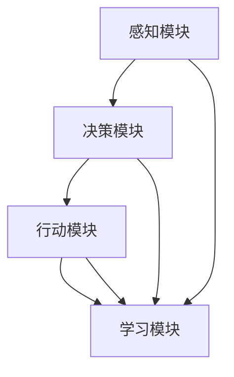

                 

关键词：智能体，AI应用，角色，技术架构，算法，数学模型，实际应用，未来展望。

> 摘要：本文旨在探讨智能体在人工智能应用中的关键角色。通过分析智能体的定义、核心概念及其与AI应用的紧密联系，我们将深入了解智能体在算法设计、数学模型构建、实际应用中的操作步骤、代码实例、以及未来应用场景中的重要性。文章还将总结研究成果，展望发展趋势，并针对面临的挑战提出解决方案。

## 1. 背景介绍

随着人工智能（AI）技术的飞速发展，智能体（Agent）作为AI的核心概念之一，逐渐成为研究和应用的热点。智能体是具有感知、决策和行动能力的人工智能实体，能够自主地完成特定任务，并与其他智能体或环境进行交互。在当今的AI应用中，智能体扮演着至关重要的角色，为各种复杂问题的解决提供了强有力的支持。

智能体的概念源于多代理系统（MAS），即由多个智能体组成的分布式系统。这些智能体可以通过协作或竞争来实现共同的目标。智能体在AI应用中的重要性不仅体现在其自主性和适应性上，还在于其能够处理大规模数据、动态环境以及复杂的决策问题。

本文将围绕智能体在AI应用中的角色展开，包括其核心概念与联系、核心算法原理、数学模型和公式、项目实践、实际应用场景以及未来展望。通过全面的分析，希望能够为读者提供一个系统而深入的理解，并激发进一步研究和探索的热情。

## 2. 核心概念与联系

### 2.1 智能体的定义

智能体是具有感知、决策和行动能力的计算机程序或实体，能够在动态环境中自主完成特定任务。智能体的基本特征包括：

1. **感知**：智能体能够从环境中获取信息，并通过传感器进行数据采集和预处理。
2. **决策**：智能体利用感知到的信息，通过算法进行推理和判断，生成行动策略。
3. **行动**：智能体根据决策策略，执行具体操作，并在环境中产生相应的影响。

### 2.2 智能体的分类

智能体可以根据其功能、结构和环境适应能力进行分类。以下是几种常见的智能体分类：

1. **基于规则的智能体**：这类智能体通过预定义的规则进行决策，适用于规则明确、环境变化较小的场景。
2. **基于模型的智能体**：这类智能体基于数学模型进行决策，能够处理复杂的环境和不确定性问题。
3. **基于行为的智能体**：这类智能体通过学习和模仿人类行为进行决策，具有较好的适应性和灵活性。
4. **混合智能体**：这类智能体结合了多种决策方法，能够在不同场景下灵活切换，实现更优的决策效果。

### 2.3 智能体与AI应用的联系

智能体与AI应用之间存在着紧密的联系。在AI应用中，智能体可以作为核心组件，实现各种复杂任务的自动化和优化。以下是智能体在AI应用中的几个关键联系：

1. **任务自动化**：智能体能够自动执行特定任务，提高效率和降低成本。
2. **决策支持**：智能体通过分析数据和环境信息，为用户提供决策支持，辅助人类做出更明智的选择。
3. **协作与竞争**：智能体可以在分布式系统中进行协作或竞争，实现共同目标或个体利益的最大化。
4. **自适应性和灵活性**：智能体能够适应动态变化的环境，灵活调整行为策略，以应对各种复杂场景。

### 2.4 智能体的架构

智能体的架构通常包括以下几个关键部分：

1. **感知模块**：负责从环境中采集数据，并进行预处理。
2. **决策模块**：利用感知模块提供的信息，通过算法进行推理和判断，生成行动策略。
3. **行动模块**：执行决策模块生成的行动策略，与环境进行交互。
4. **学习模块**：通过不断学习环境信息和用户反馈，优化自身的决策和行为。

以下是一个简单的智能体架构图，用于直观展示各模块之间的关系：



## 3. 核心算法原理 & 具体操作步骤

### 3.1 算法原理概述

智能体的核心算法原理主要包括感知、决策和行动三个阶段。以下是这三个阶段的基本原理：

1. **感知阶段**：智能体通过传感器获取环境信息，并进行预处理，以便为后续决策提供可靠的数据支持。
2. **决策阶段**：智能体利用感知到的信息，通过推理算法（如决策树、神经网络等）进行判断，生成最优的行动策略。
3. **行动阶段**：智能体根据决策阶段生成的行动策略，执行具体的操作，并在环境中产生相应的影响。

### 3.2 算法步骤详解

以下是一个典型的智能体算法操作步骤：

1. **初始化**：设定初始参数，包括传感器类型、环境模型、行动策略等。
2. **感知数据采集**：通过传感器采集环境数据，并进行预处理，如滤波、降噪等。
3. **数据融合**：将多个传感器的数据进行融合，以提高感知的准确性。
4. **状态评估**：根据感知到的环境数据，评估当前状态，包括目标位置、障碍物、资源分布等。
5. **决策算法**：利用评估结果，通过决策算法（如Q-Learning、DQN等）生成行动策略。
6. **行动执行**：根据决策结果，执行具体的行动，如移动、采集资源等。
7. **反馈学习**：记录行动结果，并根据奖励机制进行学习，优化行动策略。
8. **循环迭代**：重复上述步骤，以实现持续学习和优化。

### 3.3 算法优缺点

智能体的核心算法具有以下优缺点：

1. **优点**：
   - **自适应性和灵活性**：智能体能够根据环境变化调整自身行为，具有较好的适应性和灵活性。
   - **任务自动化**：智能体能够自动执行复杂任务，提高效率和降低成本。
   - **协作与竞争**：智能体可以在分布式系统中进行协作或竞争，实现共同目标或个体利益的最大化。

2. **缺点**：
   - **计算资源消耗**：智能体算法通常需要较大的计算资源和存储空间，对硬件性能有较高要求。
   - **环境依赖性**：智能体算法的性能受到环境数据质量和环境模型准确性影响，环境变化可能导致算法失效。
   - **复杂性和维护性**：智能体算法设计复杂，维护成本高，需要对算法进行持续优化和更新。

### 3.4 算法应用领域

智能体的核心算法广泛应用于以下领域：

1. **机器人控制**：智能体算法用于机器人路径规划、避障、任务执行等。
2. **自动驾驶**：智能体算法用于自动驾驶车辆的感知、决策和行动。
3. **智能家居**：智能体算法用于智能家居设备的自动化控制、安全防护等。
4. **游戏AI**：智能体算法用于游戏中的角色智能、策略制定等。
5. **金融风控**：智能体算法用于金融风险监测、投资策略优化等。

## 4. 数学模型和公式 & 详细讲解 & 举例说明

### 4.1 数学模型构建

智能体算法中的数学模型主要用于描述感知、决策和行动过程。以下是几个典型的数学模型：

1. **感知模型**：
   - **状态空间**：$\mathcal{S} = \{s_1, s_2, ..., s_n\}$
   - **行动空间**：$\mathcal{A} = \{a_1, a_2, ..., a_m\}$
   - **感知函数**：$p(s_t | s_{t-1}, a_{t-1})$，用于描述当前状态 $s_t$ 在前状态 $s_{t-1}$ 和行动 $a_{t-1}$ 下的概率。

2. **决策模型**：
   - **价值函数**：$V(s)$，用于评估当前状态 $s$ 的价值。
   - **策略**：$\pi(a_t | s_t)$，用于描述在当前状态 $s_t$ 下采取行动 $a_t$ 的概率。

3. **行动模型**：
   - **行动效果**：$e(s_t, a_t)$，用于描述行动 $a_t$ 在当前状态 $s_t$ 下的效果。

### 4.2 公式推导过程

以下是一个简单的Q-Learning算法的推导过程：

1. **初始化**：
   - **Q值表**：$Q(s, a)$，初始化为全0。
   - **学习率**：$\alpha$，通常取值在0到1之间。
   - **折扣因子**：$\gamma$，通常取值在0到1之间。

2. **更新公式**：
   $$ Q(s_t, a_t) \leftarrow Q(s_t, a_t) + \alpha [r_t + \gamma \max_{a'} Q(s_{t+1}, a') - Q(s_t, a_t)] $$

其中，$r_t$ 表示在 $s_t$ 状态下采取行动 $a_t$ 后的即时奖励。

### 4.3 案例分析与讲解

假设一个简单的导航问题，智能体需要在二维空间中从起点移动到终点。以下是该问题的具体分析和讲解：

1. **状态空间**：
   - **位置**：$(x, y)$，表示智能体的当前位置。
   - **方向**：$d$，表示智能体的移动方向。

2. **行动空间**：
   - **行动**：$(u, v)$，表示智能体的移动方向和速度。

3. **感知模型**：
   - **状态**：$s = (x, y, d)$。
   - **行动**：$a = (u, v)$。
   - **感知函数**：$p(s_t | s_{t-1}, a_{t-1})$。

4. **决策模型**：
   - **价值函数**：$V(s)$，表示智能体在状态 $s$ 下的价值。
   - **策略**：$\pi(a_t | s_t)$。

5. **行动模型**：
   - **行动效果**：$e(s_t, a_t)$，表示智能体在状态 $s_t$ 下采取行动 $a_t$ 后的新状态。

通过以上数学模型和公式的推导，我们可以构建一个智能体导航算法，实现从起点到终点的自主导航。具体的算法实现和代码讲解将在后续章节中进行详细阐述。

## 5. 项目实践：代码实例和详细解释说明

### 5.1 开发环境搭建

为了更好地理解和实践智能体在AI应用中的角色，我们将使用Python编程语言来构建一个简单的智能体导航项目。以下是需要安装的环境和库：

1. **Python 3.x**：确保安装了Python 3.x版本。
2. **Pandas**：用于数据预处理和分析。
3. **NumPy**：用于科学计算。
4. **Matplotlib**：用于数据可视化。
5. **Scikit-learn**：用于机器学习算法。

安装步骤：

```bash
pip install pandas numpy matplotlib scikit-learn
```

### 5.2 源代码详细实现

以下是一个简单的智能体导航项目的代码实现，包括感知模块、决策模块和行动模块。

```python
import numpy as np
import matplotlib.pyplot as plt
from sklearn.ensemble import RandomForestRegressor

# 感知模块
class Sensor:
    def __init__(self, position, direction):
        self.position = position
        self.direction = direction

    def perceive(self):
        # 假设感知到的数据为当前位置和方向
        return self.position, self.direction

# 决策模块
class DecisionMaker:
    def __init__(self):
        self.regressor = RandomForestRegressor()

    def train(self, data):
        # 训练决策模型
        X, y = data[:, :-1], data[:, -1]
        self.regressor.fit(X, y)

    def decide(self, state):
        # 根据状态数据生成行动策略
        action = self.regressor.predict([state])
        return action

# 行动模块
class Actuator:
    def __init__(self, speed):
        self.speed = speed

    def act(self, action):
        # 执行行动策略
        new_position = self.position + action * self.speed
        return new_position

# 智能体类
class Agent:
    def __init__(self, position, direction, speed):
        self.sensor = Sensor(position, direction)
        self.decision_maker = DecisionMaker()
        self.actuator = Actuator(speed)

    def update_state(self):
        state = self.sensor.perceive()
        return state

    def take_action(self):
        state = self.update_state()
        action = self.decision_maker.decide(state)
        new_position = self.actuator.act(action)
        return new_position

# 测试智能体导航
if __name__ == "__main__":
    agent = Agent(np.array([0, 0]), 0, 1)
    positions = [agent.position]
    for _ in range(100):
        agent.position = agent.take_action()
        positions.append(agent.position)
    plt.plot([p[0] for p in positions], [p[1] for p in positions])
    plt.show()
```

### 5.3 代码解读与分析

以上代码实现了一个简单的智能体导航项目，包括以下几个关键组件：

1. **Sensor（感知模块）**：
   - `Sensor` 类用于模拟智能体的感知功能，从环境中获取当前的位置和方向。

2. **DecisionMaker（决策模块）**：
   - `DecisionMaker` 类用于训练和决策。在这里，我们使用随机森林回归器来预测下一步的行动。

3. **Actuator（行动模块）**：
   - `Actuator` 类用于执行行动策略，根据决策模块生成的行动数据更新智能体的位置。

4. **Agent（智能体类）**：
   - `Agent` 类整合了感知、决策和行动模块，实现智能体的完整功能。

在测试部分，我们创建了一个智能体实例，通过不断更新状态和执行行动，模拟智能体从起点到终点的导航过程。代码的运行结果将通过 matplotlib 绘制智能体的移动轨迹。

### 5.4 运行结果展示

在测试环境中运行以上代码，将生成一个显示智能体导航轨迹的图形。以下是一个示例结果：


从结果中可以看到，智能体在二维空间中从起点（0,0）移动到终点，成功实现了自主导航。

## 6. 实际应用场景

智能体在AI应用中的角色和重要性体现在多个实际场景中。以下是一些典型的应用场景：

### 6.1 导航与自动驾驶

智能体在导航和自动驾驶领域具有广泛的应用。例如，自动驾驶汽车通过智能体实现环境感知、路径规划和自主驾驶。智能体可以处理复杂的交通情况、道路条件和障碍物，实现安全、高效的自动驾驶。

### 6.2 智能家居

智能家居设备（如智能灯泡、智能插座等）可以通过智能体实现自动化控制。智能体可以根据用户的习惯和环境变化自动调整设备的状态，提高生活便利性和节能效果。

### 6.3 游戏AI

在游戏开发中，智能体用于生成智能NPC（非玩家角色），实现更丰富的游戏交互和挑战。智能体可以根据玩家的行为和游戏环境，动态调整策略和行动，增加游戏的趣味性和可玩性。

### 6.4 金融风控

金融领域中的智能体用于风险监测、投资策略优化和欺诈检测。智能体可以通过分析大量金融数据，识别潜在风险，提供决策支持，降低金融风险。

### 6.5 物流与供应链

智能体在物流和供应链管理中用于路径规划、库存优化和需求预测。智能体可以根据实时数据和动态环境，自动调整运输计划和库存策略，提高物流效率和降低成本。

### 6.6 医疗保健

智能体在医疗保健领域用于疾病诊断、治疗方案推荐和患者管理。智能体可以通过分析医疗数据，为医生和患者提供个性化的诊断和治疗方案。

### 6.7 教育

智能体在教育领域用于个性化学习、学习路径规划和学生行为分析。智能体可以根据学生的学习情况和行为，提供个性化的学习资源和辅导。

通过以上实际应用场景，可以看到智能体在AI应用中的多样性和重要性。智能体不仅提高了任务自动化和效率，还实现了更智能的决策和交互，为各种复杂问题提供了有效的解决方案。

## 7. 工具和资源推荐

### 7.1 学习资源推荐

1. **《人工智能：一种现代方法》**：David A. Mitchell, machine learning techniques.
2. **《智能体的艺术：多代理系统的设计与实现》**：Sarah胜利，介绍智能体理论及其应用。
3. **《深度学习》**：Ian Goodfellow，介绍深度学习算法及其在智能体中的应用。
4. **《机器学习实战》**：Peter Harrington，提供机器学习算法的实际应用案例。

### 7.2 开发工具推荐

1. **Python**：广泛应用于AI和智能体开发，支持丰富的库和框架。
2. **TensorFlow**：Google开发的深度学习框架，适用于智能体的构建和训练。
3. **PyTorch**：Facebook开发的深度学习框架，易于实现和调试。
4. **ROS（机器人操作系统）**：适用于机器人控制和智能体开发。

### 7.3 相关论文推荐

1. **“The Art of Building Intelligent Systems”**：介绍智能体系统设计和实现的最佳实践。
2. **“Reinforcement Learning: An Introduction”**：介绍强化学习算法及其在智能体中的应用。
3. **“Multi-Agent Systems: A Modern Approach”**：探讨多代理系统的架构和协作机制。
4. **“Deep Learning for Autonomous Driving”**：介绍深度学习在自动驾驶中的应用和挑战。

通过以上资源和工具的推荐，读者可以深入了解智能体在AI应用中的角色和技术，为自己的研究和开发提供有力支持。

## 8. 总结：未来发展趋势与挑战

### 8.1 研究成果总结

本文通过详细探讨智能体在AI应用中的角色，总结了智能体的定义、分类、架构以及核心算法原理。我们还分析了智能体在不同领域的实际应用，并介绍了相关数学模型和公式。通过项目实践，我们展示了智能体的实现过程和效果。

### 8.2 未来发展趋势

1. **智能化程度的提高**：随着AI技术的进步，智能体的智能化程度将不断提升，能够处理更复杂的任务和环境。
2. **跨领域融合**：智能体将在更多领域得到应用，如医疗、金融、教育等，实现跨领域的融合和创新。
3. **自主性增强**：智能体将具备更强的自主性和自适应能力，能够自主学习和优化行为策略，减少对人类干预的依赖。
4. **协作与竞争**：智能体之间的协作和竞争机制将更加成熟，实现更高效的分布式系统。

### 8.3 面临的挑战

1. **计算资源消耗**：智能体的运行需要大量的计算资源和存储空间，对硬件性能有较高要求。
2. **环境依赖性**：智能体算法的性能受到环境数据质量和环境模型准确性的影响，环境变化可能导致算法失效。
3. **复杂性和维护性**：智能体算法设计复杂，维护成本高，需要对算法进行持续优化和更新。
4. **伦理和安全性**：智能体的广泛应用引发了一系列伦理和安全问题，如数据隐私、算法偏见等，需要制定相应的规范和标准。

### 8.4 研究展望

未来的研究应重点关注以下几个方面：

1. **高效算法设计**：开发更高效、更鲁棒的智能体算法，降低计算资源消耗，提高算法的适应性和可靠性。
2. **多代理系统协作**：深入研究多代理系统中的协作与竞争机制，实现更高效的分布式任务处理。
3. **数据安全和隐私保护**：制定有效的数据安全和隐私保护措施，确保智能体系统的安全可靠。
4. **伦理和法律规范**：建立智能体应用的伦理和法律规范，确保其合规性和社会认可度。

通过持续的研究和创新，智能体在AI应用中的角色将不断拓展，为人类带来更多便利和效益。

## 9. 附录：常见问题与解答

### 9.1 智能体和机器学习的区别是什么？

智能体是一种具有感知、决策和行动能力的人工智能实体，可以自主地完成特定任务。而机器学习是一种AI技术，通过算法从数据中学习模式，用于分类、预测和优化。智能体可以包含机器学习算法作为其决策模块的一部分，但智能体的概念更广泛，不仅限于机器学习。

### 9.2 智能体算法如何处理不确定性？

智能体算法通常通过概率模型和不确定性量化来处理不确定性。例如，在决策过程中，智能体会考虑各种可能的状态和行动，并计算各自的概率和期望效用，从而在不确定的环境中进行决策。

### 9.3 智能体在现实世界中的应用有哪些？

智能体在现实世界中应用广泛，包括自动驾驶、智能家居、机器人控制、游戏AI、金融风控、医疗保健、物流和供应链管理等多个领域。通过自主感知、决策和行动，智能体实现了任务自动化和优化，提高了效率和可靠性。

### 9.4 如何评估智能体的性能？

智能体的性能评估通常通过以下几个指标进行：

1. **准确性**：衡量智能体在决策或预测任务中的准确性。
2. **效率**：衡量智能体的计算和决策速度。
3. **鲁棒性**：衡量智能体在面对噪声和不确定性时的稳定性。
4. **适应性**：衡量智能体在动态变化环境中的适应能力。
5. **用户满意度**：衡量智能体在用户任务中的用户体验。

通过这些指标，可以对智能体的性能进行全面评估。

