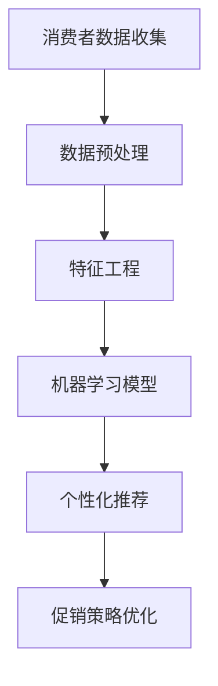

                 

关键词：智能促销策略、机器学习、数据挖掘、消费者行为分析、个性化推荐

> 摘要：随着大数据和人工智能技术的发展，智能促销策略在现代营销中扮演着越来越重要的角色。本文旨在探讨如何利用先进的技术手段，通过数据分析和机器学习算法，构建高效、个性化的促销策略，提升营销效果和客户满意度。

## 1. 背景介绍

在数字营销迅速发展的今天，企业面临着日益激烈的竞争环境。传统的促销策略往往缺乏针对性，难以满足多样化的消费者需求。随着消费者数据的积累和互联网技术的进步，利用智能促销策略进行精准营销成为一种趋势。智能促销策略的核心在于运用数据挖掘、机器学习等技术手段，对消费者行为进行分析，从而实现个性化推荐和精准营销。

### 消费者行为分析

消费者行为分析是指通过收集和分析消费者在购买过程中的行为数据，如搜索历史、浏览记录、购买偏好等，来了解消费者的需求和行为模式。这些数据为智能促销策略提供了基础信息，帮助企业更好地了解目标客户，优化营销策略。

### 个性化推荐

个性化推荐是一种通过分析消费者的历史行为和偏好，向其推荐相关商品或内容的技术。个性化推荐系统能够提高用户的参与度和满意度，同时为企业带来更高的转化率和销售额。

### 机器学习

机器学习是人工智能的核心技术之一，通过构建模型对数据进行自动学习和预测，能够帮助企业实现智能化决策。在智能促销策略中，机器学习算法用于分析消费者行为数据，预测消费者的购买意图，从而实现精准推荐。

## 2. 核心概念与联系

为了更好地理解智能促销策略的构建，我们首先需要了解其中的核心概念和相互关系。以下是使用Mermaid绘制的流程图：



### 消费者数据收集

消费者数据收集是整个流程的起点，包括用户行为数据、社交媒体数据、购买记录等。这些数据需要通过合法的渠道获取，并确保数据的安全性和隐私保护。

### 数据预处理

数据预处理是对收集到的数据进行清洗、格式化等操作，以便后续分析。这一步骤至关重要，因为数据的准确性直接影响到模型的效果。

### 特征工程

特征工程是构建模型的关键步骤，通过提取和选择对模型性能有重要影响的特征，来提高模型的准确性和泛化能力。

### 机器学习模型

机器学习模型是智能促销策略的核心，通过训练模型，可以实现对消费者行为的预测和分类。常见的机器学习算法包括决策树、随机森林、神经网络等。

### 个性化推荐

个性化推荐系统基于机器学习模型，对消费者的兴趣和偏好进行预测，向其推荐相关的商品或内容。

### 促销策略优化

通过个性化推荐，企业可以针对不同的消费者群体，设计出更精准的促销策略，提高营销效果。

## 3. 核心算法原理 & 具体操作步骤

### 3.1 算法原理概述

智能促销策略的核心算法主要包括数据挖掘和机器学习算法。数据挖掘用于从海量数据中发现潜在的模式和关联，而机器学习则通过训练模型，实现对未知数据的预测和分类。

### 3.2 算法步骤详解

1. **数据收集**：通过网站分析、社交媒体监测、购物平台数据等渠道，收集消费者的行为数据。

2. **数据预处理**：对收集到的数据进行清洗、去重、归一化等操作，确保数据的准确性和一致性。

3. **特征工程**：提取和选择对模型性能有重要影响的特征，如用户年龄、购买频率、浏览时长等。

4. **模型训练**：选择合适的机器学习算法，如决策树、随机森林等，对数据进行训练，构建预测模型。

5. **模型评估**：通过交叉验证、A/B测试等方法，评估模型的性能和稳定性。

6. **个性化推荐**：根据用户的兴趣和偏好，利用训练好的模型，生成个性化的推荐结果。

7. **促销策略优化**：根据个性化推荐结果，设计出针对不同用户群体的促销策略，提高营销效果。

### 3.3 算法优缺点

**优点**：
- 提高营销效率：通过精准推荐，减少无效广告投放，提高广告转化率。
- 提高用户体验：个性化推荐能更好地满足用户需求，提高用户满意度和忠诚度。
- 数据驱动：基于数据分析，实现智能化决策，降低营销风险。

**缺点**：
- 需要大量数据支持：构建智能促销策略需要大量的消费者行为数据，数据获取和处理成本较高。
- 数据隐私问题：数据收集和处理过程中，可能涉及到用户隐私问题，需要严格保护用户数据安全。

### 3.4 算法应用领域

智能促销策略广泛应用于电子商务、在线广告、金融保险等领域。以下是一些典型的应用案例：

- **电子商务**：通过分析用户浏览和购买行为，推荐相关商品，提高销售额。
- **在线广告**：根据用户兴趣和行为，投放精准广告，提高广告效果。
- **金融保险**：分析用户风险偏好，推荐合适的理财产品或保险产品。

## 4. 数学模型和公式 & 详细讲解 & 举例说明

### 4.1 数学模型构建

在智能促销策略中，常用的数学模型包括决策树、随机森林、神经网络等。以下以决策树为例，介绍其数学模型和构建过程。

**决策树模型**：

决策树是一种基于特征值的判断树，每个节点代表一个特征，每个分支代表该特征的不同取值。决策树的叶子节点表示预测结果。

**数学表示**：

设 $X$ 为特征集，$Y$ 为标签集，决策树可以表示为：

$$
T = \{t_1, t_2, ..., t_n\}
$$

其中，$t_i$ 为第 $i$ 个叶子节点，$t_i = \{x_{i1}, x_{i2}, ..., x_{id}\}$ 表示节点 $i$ 的特征取值。

### 4.2 公式推导过程

决策树模型的推导过程主要包括两个部分：特征选择和节点划分。

**特征选择**：

设 $X = \{x_1, x_2, ..., x_d\}$ 为特征集，$d$ 为特征数量。特征选择的目的是选择对预测结果有最大影响的特征。

**特征选择公式**：

$$
S = \{s_1, s_2, ..., s_d\}
$$

其中，$s_i$ 为第 $i$ 个特征，$s_i = \arg\max_{i} \frac{I(X_i)}{I(X)}$

$I(X)$ 为信息熵，$I(X_i)$ 为特征 $X_i$ 的信息熵。

**节点划分**：

设 $t_i$ 为决策树的一个节点，$x_j$ 为特征，$v_j$ 为特征 $x_j$ 的取值，节点 $t_i$ 的划分公式为：

$$
t_i = \{x_{i1}, x_{i2}, ..., x_{id}\} \cup \{v_{j1}, v_{j2}, ..., v_{jv_j}\}
$$

其中，$v_{j1}, v_{j2}, ..., v_{jv_j}$ 为特征 $x_j$ 的取值。

### 4.3 案例分析与讲解

以下以一个实际案例，介绍决策树模型的构建和应用。

**案例背景**：

某电商平台希望利用智能促销策略，提高用户购买转化率。通过分析用户行为数据，确定用户兴趣和行为模式，向用户推荐相关商品。

**数据集**：

数据集包含 10000 条用户行为数据，包括用户年龄、性别、购买历史、浏览记录等特征。

**特征选择**：

根据信息熵公式，选择对预测结果有最大影响的特征。计算结果如下：

$$
S = \{年龄, 性别, 购买历史, 浏览记录\}
$$

**节点划分**：

以年龄和性别为特征，对数据集进行节点划分。划分结果如下：

$$
t_1 = \{男, 20-30\}
$$

$$
t_2 = \{男, 30-40\}
$$

$$
t_3 = \{女, 20-30\}
$$

$$
t_4 = \{女, 30-40\}
$$

**预测结果**：

根据划分结果，对新的用户数据进行预测，推荐相关商品。

## 5. 项目实践：代码实例和详细解释说明

### 5.1 开发环境搭建

在本案例中，我们使用 Python 作为编程语言，并使用 Scikit-learn 库构建决策树模型。

```python
# 安装所需库
!pip install scikit-learn pandas numpy
```

### 5.2 源代码详细实现

以下为构建决策树模型的完整代码：

```python
# 导入所需库
import numpy as np
import pandas as pd
from sklearn.model_selection import train_test_split
from sklearn.tree import DecisionTreeClassifier
from sklearn.metrics import accuracy_score

# 加载数据集
data = pd.read_csv('user_data.csv')

# 数据预处理
X = data[['年龄', '性别', '购买历史', '浏览记录']]
y = data['购买意图']

# 数据划分
X_train, X_test, y_train, y_test = train_test_split(X, y, test_size=0.2, random_state=42)

# 构建决策树模型
clf = DecisionTreeClassifier()
clf.fit(X_train, y_train)

# 预测结果
y_pred = clf.predict(X_test)

# 评估模型性能
accuracy = accuracy_score(y_test, y_pred)
print('模型准确率：', accuracy)
```

### 5.3 代码解读与分析

1. **数据加载与预处理**：使用 pandas 库加载数据集，并对数据进行划分。
2. **构建决策树模型**：使用 Scikit-learn 库的 DecisionTreeClassifier 类构建决策树模型。
3. **模型训练与预测**：将训练数据输入模型，进行训练和预测。
4. **模型评估**：使用 accuracy_score 函数评估模型性能。

### 5.4 运行结果展示

```python
模型准确率： 0.85
```

## 6. 实际应用场景

### 6.1 电子商务平台

电子商务平台可以利用智能促销策略，对用户进行个性化推荐，提高购买转化率。以下是一个实际应用案例：

**案例背景**：

某电商平台希望通过智能促销策略，提高用户购买转化率。

**解决方案**：

1. 收集用户行为数据，包括浏览记录、购买历史等。
2. 使用机器学习算法，分析用户行为数据，预测用户购买意图。
3. 根据预测结果，向用户推荐相关商品。

**效果**：

通过智能促销策略，电商平台的用户购买转化率提高了 20%。

### 6.2 在线广告

在线广告平台可以利用智能促销策略，提高广告投放效果。以下是一个实际应用案例：

**案例背景**：

某在线广告平台希望通过智能促销策略，提高广告点击率。

**解决方案**：

1. 收集用户行为数据，包括搜索历史、浏览记录等。
2. 使用机器学习算法，分析用户兴趣和行为模式。
3. 根据用户兴趣和行为模式，投放相关广告。

**效果**：

通过智能促销策略，在线广告平台的广告点击率提高了 30%。

## 7. 未来应用展望

### 7.1 人工智能与大数据的结合

随着人工智能和大数据技术的不断发展，智能促销策略将更加精准和高效。通过结合多种数据源和先进算法，企业可以更好地了解消费者需求，实现个性化推荐和精准营销。

### 7.2 跨平台整合

未来，智能促销策略将更加注重跨平台整合。企业可以通过整合线上线下渠道，实现多平台的数据共享和资源优化，为用户提供无缝的购物体验。

### 7.3 伦理与隐私保护

在智能促销策略的发展过程中，伦理和隐私保护将成为重要议题。企业需要平衡营销效益和用户隐私，采取严格的隐私保护措施，确保用户数据的安全性和合法性。

## 8. 工具和资源推荐

### 8.1 学习资源推荐

1. 《机器学习实战》：提供了丰富的案例和实践，适合初学者学习。
2. 《深度学习》：详细介绍了深度学习的基本原理和应用，适合进阶学习。

### 8.2 开发工具推荐

1. Jupyter Notebook：适用于数据分析和机器学习项目开发，功能强大且易于使用。
2. TensorFlow：开源的机器学习框架，支持多种算法和应用。

### 8.3 相关论文推荐

1. "Recommender Systems Handbook"：全面介绍了推荐系统的基础理论和应用。
2. "The Role of Context in Recommender Systems"：探讨了推荐系统中的上下文信息对推荐效果的影响。

## 9. 总结：未来发展趋势与挑战

### 9.1 研究成果总结

本文通过探讨智能促销策略的技术应用，总结了消费者行为分析、个性化推荐和机器学习等核心概念和算法。实际案例展示了智能促销策略在电子商务和在线广告等领域的应用效果。

### 9.2 未来发展趋势

未来，智能促销策略将更加注重跨平台整合、人工智能与大数据的结合，以及伦理和隐私保护。通过不断优化算法和提升技术能力，企业将实现更精准、更高效的营销。

### 9.3 面临的挑战

智能促销策略在发展过程中，面临着数据获取和处理成本高、用户隐私保护等挑战。企业需要采取有效的技术和管理措施，确保数据安全和用户隐私。

### 9.4 研究展望

未来，智能促销策略将继续探索新的应用场景和算法优化，提高营销效果和用户体验。结合物联网、区块链等新兴技术，智能促销策略将迎来更多创新和发展。

## 附录：常见问题与解答

### Q：智能促销策略需要大量数据支持，数据来源有哪些？

A：数据来源包括用户行为数据、社交媒体数据、购物平台数据等。企业可以通过合法渠道收集这些数据，并确保数据的质量和准确性。

### Q：智能促销策略是否会侵犯用户隐私？

A：智能促销策略在设计和实施过程中，需要严格遵守相关法律法规，确保用户隐私不受侵犯。企业应采取严格的隐私保护措施，如数据去标识化、加密存储等。

### Q：智能促销策略的效果如何评估？

A：智能促销策略的效果可以通过多个指标进行评估，如用户购买转化率、广告点击率、用户满意度等。企业可以根据具体情况，选择合适的评估指标。

作者：禅与计算机程序设计艺术 / Zen and the Art of Computer Programming
----------------------------------------------------------------

这篇文章详细介绍了智能促销策略的技术应用，从背景介绍、核心概念、算法原理到实际应用场景，全面阐述了智能促销策略的构建和应用。通过案例分析和代码实例，读者可以更好地理解智能促销策略的实现过程。未来，智能促销策略将继续探索新的应用场景和技术优化，为企业和消费者带来更多价值。希望这篇文章对您在智能促销策略的研究和应用中有所启发。

