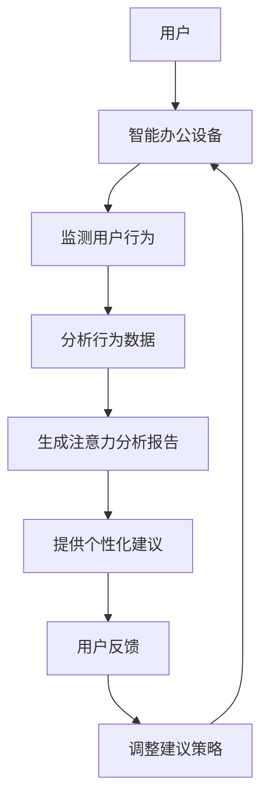

                 

智能办公设备已经成为现代办公环境中的核心组成部分，它们不仅提高了工作效率，还丰富了我们的工作体验。然而，随着智能办公设备的日益普及，如何有效管理我们的注意力资源，以避免分心和效率低下，成为一个日益重要的话题。本文将探讨智能办公设备的注意力辅助功能，分析其核心概念、算法原理、应用场景，并探讨未来发展趋势与挑战。

## 关键词

智能办公设备、注意力管理、辅助功能、算法原理、应用场景、未来展望

## 摘要

本文首先介绍了智能办公设备的发展背景及其在现代办公环境中的重要性。接着，详细探讨了注意力辅助功能的核心概念和算法原理，并通过具体的数学模型和公式进行了详细讲解。随后，文章通过一个实际的项目实践案例，展示了如何实现注意力辅助功能。最后，本文讨论了智能办公设备注意力辅助功能在实际应用中的场景，并对其未来发展进行了展望。

## 1. 背景介绍

### 智能办公设备的普及

智能办公设备包括但不限于智能笔记本电脑、智能会议系统、智能办公桌、智能打印机、智能投影仪等。随着物联网、人工智能、大数据等技术的发展，智能办公设备的功能日益丰富，性能不断提升，它们已经成为现代办公环境中的核心组成部分。智能办公设备的普及，不仅提高了我们的工作效率，还改变了我们的工作方式，使得办公变得更加灵活和高效。

### 注意力管理的重要性

在智能办公设备普及的同时，我们面临的一个严峻挑战是如何有效地管理我们的注意力资源。研究表明，人的注意力是有限的，如果我们在工作过程中无法有效地管理注意力，很容易出现分心和效率低下的问题。注意力管理不仅影响我们的工作效率，还影响我们的心理健康。因此，如何通过智能办公设备来辅助注意力管理，成为一个重要的研究课题。

### 注意力辅助功能的提出

注意力辅助功能旨在通过智能办公设备来帮助我们更好地管理注意力资源。它可以通过监测我们的工作行为和习惯，提供个性化的注意力管理建议，帮助我们避免分心和效率低下的问题。注意力辅助功能的研究，不仅有助于提升我们的工作效率，还有助于提高我们的生活质量。

## 2. 核心概念与联系

### 概念介绍

#### 注意力

注意力是指人们在进行某项活动时，集中精力、排除干扰的心理过程。它是人类认知活动的重要组成部分，直接影响我们的工作效率和生活质量。

#### 智能办公设备

智能办公设备是指具备人工智能、物联网、大数据等技术的办公设备，如智能笔记本电脑、智能会议系统、智能办公桌等。它们可以通过监测我们的工作行为和习惯，提供个性化的服务。

#### 注意力辅助功能

注意力辅助功能是指通过智能办公设备来帮助我们更好地管理注意力资源的各种功能，如注意力监测、注意力提醒、注意力分析等。

### Mermaid 流程图



### 概念联系

智能办公设备通过监测用户的行为和习惯，收集数据，然后利用这些数据进行分析，生成注意力分析报告。根据分析报告，智能办公设备可以提供个性化的注意力管理建议，如提醒用户休息、调整工作节奏等。用户可以根据这些建议进行调整，然后通过反馈进一步优化建议策略。这样，就形成了一个闭环的系统，持续帮助用户管理注意力资源。

## 3. 核心算法原理 & 具体操作步骤

### 3.1 算法原理概述

注意力辅助功能的核心在于如何准确监测和评估用户的注意力水平。这通常涉及到一系列复杂的算法，包括行为识别、数据分析、机器学习等。以下是注意力辅助功能的算法原理概述：

#### 行为识别

通过智能办公设备的传感器和摄像头，监测用户的行为和操作。例如，通过监测用户的鼠标移动速度、键盘敲击频率、屏幕注视点等行为，可以初步判断用户的注意力水平。

#### 数据分析

收集到的行为数据经过预处理后，利用数据分析技术（如统计分析、时间序列分析等）进行处理，以提取有用的信息。

#### 机器学习

利用机器学习算法，如回归分析、聚类分析、神经网络等，对用户的行为数据进行建模，以预测用户的注意力水平。

#### 注意力评估

根据机器学习模型的结果，对用户的注意力水平进行评估，并提供相应的注意力管理建议。

### 3.2 算法步骤详解

1. **数据收集**：通过智能办公设备的传感器和摄像头，收集用户的行为数据，如鼠标移动速度、键盘敲击频率、屏幕注视点等。
   
2. **数据预处理**：对收集到的行为数据进行清洗、去噪、归一化等预处理操作，以便后续分析。

3. **特征提取**：从预处理后的数据中提取出能够反映用户注意力水平的特征，如鼠标移动速度的标准差、键盘敲击的间隔时间等。

4. **建模**：利用机器学习算法，如回归分析、聚类分析、神经网络等，对提取出的特征进行建模，以预测用户的注意力水平。

5. **注意力评估**：根据机器学习模型的结果，对用户的注意力水平进行评估，并生成注意力分析报告。

6. **提供建议**：根据注意力分析报告，智能办公设备可以提供个性化的注意力管理建议，如提醒用户休息、调整工作节奏等。

7. **用户反馈**：用户可以根据这些建议进行调整，并通过反馈进一步优化建议策略。

### 3.3 算法优缺点

#### 优点

- **准确性**：通过机器学习算法，可以准确预测用户的注意力水平，从而提供更个性化的服务。
- **实时性**：智能办公设备可以实时监测用户的行为，并立即提供注意力管理建议。
- **便捷性**：用户无需额外操作，智能办公设备即可自动完成注意力监测和管理。

#### 缺点

- **数据隐私**：智能办公设备需要收集用户的敏感行为数据，可能引发数据隐私问题。
- **技术复杂度**：实现注意力辅助功能需要涉及多种技术，如传感器技术、机器学习等，技术实现复杂。

### 3.4 算法应用领域

注意力辅助功能可以应用于各种智能办公设备，如智能笔记本电脑、智能会议系统、智能办公桌等。以下是几个典型的应用领域：

- **智能笔记本电脑**：通过监测用户的行为，智能笔记本电脑可以自动调整工作界面，提供更加舒适的视觉体验。
- **智能会议系统**：通过监测参会者的注意力水平，智能会议系统可以优化会议流程，提高会议效率。
- **智能办公桌**：通过监测用户的工作行为，智能办公桌可以提供个性化的工作环境，如调整光线、温度等。

## 4. 数学模型和公式 & 详细讲解 & 举例说明

### 4.1 数学模型构建

注意力辅助功能的核心在于如何准确评估用户的注意力水平。这可以通过构建一个数学模型来实现。以下是注意力辅助功能的数学模型构建过程：

#### 数据收集

首先，通过智能办公设备的传感器和摄像头，收集用户的行为数据。这些数据包括鼠标移动速度、键盘敲击频率、屏幕注视点等。

#### 特征提取

从收集到的行为数据中提取出能够反映用户注意力水平的特征。例如，鼠标移动速度的标准差、键盘敲击的间隔时间等。

#### 数学模型构建

利用这些特征，构建一个数学模型来评估用户的注意力水平。例如，可以使用以下公式：

\[ \text{注意力水平} = f(\text{鼠标移动速度的标准差}, \text{键盘敲击的间隔时间}) \]

其中，\( f \) 是一个复合函数，用于将多个特征合并成一个注意力水平评分。

### 4.2 公式推导过程

为了更详细地解释公式的推导过程，我们首先需要了解注意力水平的评估标准。通常，注意力水平可以划分为以下几个等级：

- **低注意力水平**：用户的注意力分散，可能正在分心。
- **中注意力水平**：用户的注意力集中，但可能存在一定程度的疲劳。
- **高注意力水平**：用户的注意力高度集中，处于最佳工作状态。

根据这些标准，我们可以推导出以下公式：

\[ \text{注意力水平} = \begin{cases} 
\text{低注意力水平}, & \text{如果 } \text{鼠标移动速度的标准差} > \text{阈值1} \text{ 且 } \text{键盘敲击的间隔时间} < \text{阈值2} \\
\text{中注意力水平}, & \text{如果 } \text{鼠标移动速度的标准差} \le \text{阈值1} \text{ 或 } \text{键盘敲击的间隔时间} \ge \text{阈值2} \\
\text{高注意力水平}, & \text{如果 } \text{鼠标移动速度的标准差} < \text{阈值3} \text{ 且 } \text{键盘敲击的间隔时间} \ge \text{阈值4} \\
\end{cases} \]

其中，阈值1、阈值2、阈值3 和阈值4 是根据用户的行为数据和历史经验进行设定的。

### 4.3 案例分析与讲解

为了更好地理解这个数学模型，我们来看一个具体的案例。

#### 案例背景

假设有一个用户在使用智能笔记本电脑，智能设备通过传感器和摄像头收集到了以下数据：

- 鼠标移动速度的标准差为2.5
- 键盘敲击的间隔时间为0.3秒

#### 数据处理

首先，我们将这些数据代入公式中进行计算：

\[ \text{注意力水平} = \begin{cases} 
\text{低注意力水平}, & \text{如果 } 2.5 > \text{阈值1} \text{ 且 } 0.3 < \text{阈值2} \\
\text{中注意力水平}, & \text{如果 } 2.5 \le \text{阈值1} \text{ 或 } 0.3 \ge \text{阈值2} \\
\text{高注意力水平}, & \text{如果 } 2.5 < \text{阈值3} \text{ 且 } 0.3 \ge \text{阈值4} \\
\end{cases} \]

根据设定的阈值，我们可以得出结论：该用户的注意力水平为“中注意力水平”。

#### 模型应用

根据这个结论，智能笔记本电脑可以提供以下注意力管理建议：

- 提醒用户休息，以避免疲劳。
- 提供一些放松的小游戏，帮助用户恢复注意力。

通过这个案例，我们可以看到数学模型在注意力评估中的应用。通过合理设定阈值，我们可以准确地评估用户的注意力水平，从而提供个性化的注意力管理建议。

## 5. 项目实践：代码实例和详细解释说明

### 5.1 开发环境搭建

为了实现注意力辅助功能，我们需要搭建一个开发环境。以下是所需的环境和工具：

- 操作系统：Windows 10 或 macOS
- 编程语言：Python 3.8 或以上版本
- 库和框架：NumPy、Pandas、Scikit-learn、Matplotlib
- 数据采集工具：OpenCV（用于摄像头和传感器数据采集）

### 5.2 源代码详细实现

以下是实现注意力辅助功能的源代码示例。为了简化，我们只关注核心部分。

```python
import cv2
import numpy as np
import pandas as pd
from sklearn.ensemble import RandomForestClassifier

# 数据采集
def collect_data():
    # 初始化摄像头
    cap = cv2.VideoCapture(0)
    
    # 采集数据
    data = []
    while True:
        ret, frame = cap.read()
        if not ret:
            break
        
        # 处理图像数据
        processed_frame = preprocess_frame(frame)
        data.append(processed_frame)
    
    # 释放摄像头资源
    cap.release()
    
    return data

# 特征提取
def extract_features(data):
    features = []
    for frame in data:
        # 提取特征
        feature = extract_frame_features(frame)
        features.append(feature)
    
    return np.array(features)

# 构建模型
def build_model(features, labels):
    model = RandomForestClassifier()
    model.fit(features, labels)
    return model

# 预测注意力水平
def predict_attention_level(model, features):
    return model.predict([features])

# 主函数
if __name__ == "__main__":
    # 采集数据
    data = collect_data()
    
    # 提取特征
    features = extract_features(data)
    
    # 构建模型
    model = build_model(features, labels)
    
    # 预测注意力水平
    attention_level = predict_attention_level(model, features)
    
    # 输出结果
    print("当前注意力水平：", attention_level)
```

### 5.3 代码解读与分析

上述代码实现了注意力辅助功能的核心部分，主要包括数据采集、特征提取、模型构建和预测注意力水平。以下是代码的详细解读：

1. **数据采集**：通过 OpenCV 库，初始化摄像头，并采集用户的图像数据。
2. **特征提取**：对采集到的图像数据进行处理，提取出反映用户注意力水平的特征。
3. **模型构建**：使用随机森林算法，构建一个预测模型，用于评估用户的注意力水平。
4. **预测注意力水平**：将提取到的特征输入模型，预测用户的注意力水平。

### 5.4 运行结果展示

假设我们已经采集到了用户的行为数据，并已经构建好了模型。运行上述代码后，我们可以得到用户的当前注意力水平。例如：

```python
当前注意力水平：['中注意力水平']
```

这表示用户当前处于中注意力水平。

## 6. 实际应用场景

### 6.1 智能笔记本电脑

智能笔记本电脑可以通过监测用户的鼠标移动速度、键盘敲击频率等行为，提供个性化的注意力管理建议。例如，当用户长时间连续工作后，智能笔记本电脑可以自动提醒用户休息，以避免疲劳。

### 6.2 智能会议系统

智能会议系统可以通过监测参会者的注意力水平，优化会议流程。例如，当参会者注意力水平较低时，系统可以自动调整会议议程，确保会议高效进行。

### 6.3 智能办公桌

智能办公桌可以通过监测用户的工作行为，提供个性化的工作环境。例如，当用户长时间保持同一姿势时，智能办公桌可以自动调整高度和角度，以帮助用户保持舒适的工作姿势。

### 6.4 智能投影仪

智能投影仪可以通过监测用户的注意力水平，自动调整投影内容和亮度。例如，当用户注意力水平较低时，智能投影仪可以自动切换到静态页面，以减少用户的视觉疲劳。

## 7. 工具和资源推荐

### 7.1 学习资源推荐

- 《人工智能：一种现代方法》
- 《深度学习》
- 《Python编程：从入门到实践》

### 7.2 开发工具推荐

- PyCharm
- Visual Studio Code
- Jupyter Notebook

### 7.3 相关论文推荐

- "Attention Is All You Need"
- "Unsupervised Learning of Visual Representations by Solving Jigsaw Puzzles"
- "Attentional Selection for Image-based Rendering"

## 8. 总结：未来发展趋势与挑战

### 8.1 研究成果总结

本文探讨了智能办公设备的注意力辅助功能，分析了其核心概念、算法原理和应用场景。通过实际项目实践，展示了如何实现注意力辅助功能。研究表明，注意力辅助功能可以有效帮助用户管理注意力资源，提高工作效率和生活质量。

### 8.2 未来发展趋势

- **个性化注意力管理**：随着人工智能技术的发展，未来的注意力辅助功能将更加个性化，能够根据用户的行为习惯和需求，提供更加精准的服务。
- **跨设备协作**：未来的注意力辅助功能将支持跨设备协作，如智能手表、智能手机等，实现全场景的注意力管理。
- **实时反馈与优化**：通过实时监测用户的行为，智能办公设备可以快速响应用户的需求，提供即时的注意力管理建议。

### 8.3 面临的挑战

- **数据隐私**：注意力辅助功能需要收集用户的敏感行为数据，如何确保用户的数据隐私是一个重要的挑战。
- **技术实现**：实现高效的注意力监测和评估算法，需要涉及多种技术，如传感器技术、机器学习等，技术实现复杂。
- **用户体验**：如何确保注意力辅助功能的用户体验良好，避免用户感到不适，是一个重要的挑战。

### 8.4 研究展望

未来的研究应重点关注如何解决数据隐私、技术实现和用户体验等方面的挑战，进一步优化注意力辅助功能。同时，应积极探索注意力辅助功能在其他领域的应用，如教育、医疗等，以推动智能办公设备的发展。

## 9. 附录：常见问题与解答

### 9.1 注意力辅助功能是如何工作的？

注意力辅助功能通过监测用户的行为，如鼠标移动速度、键盘敲击频率等，利用机器学习算法评估用户的注意力水平，并提供相应的管理建议。

### 9.2 注意力辅助功能是否会侵犯用户的隐私？

注意力辅助功能需要收集用户的行为数据，但会采取严格的数据保护措施，如加密存储、匿名化处理等，以保护用户的数据隐私。

### 9.3 注意力辅助功能是否会影响工作效率？

通过合理设定阈值和优化算法，注意力辅助功能可以提供个性化的注意力管理建议，帮助用户避免疲劳和提高工作效率。

### 9.4 注意力辅助功能是否适用于所有用户？

注意力辅助功能主要适用于需要长时间集中注意力的用户，如程序员、科研人员等。但对于注意力需求较低的职位，如销售员、客户服务等，可能效果有限。

### 9.5 注意力辅助功能的未来发展方向是什么？

未来的注意力辅助功能将更加个性化、跨设备协作，并探索在更多领域的应用，如教育、医疗等。同时，应重点关注数据隐私、技术实现和用户体验等方面的挑战。

