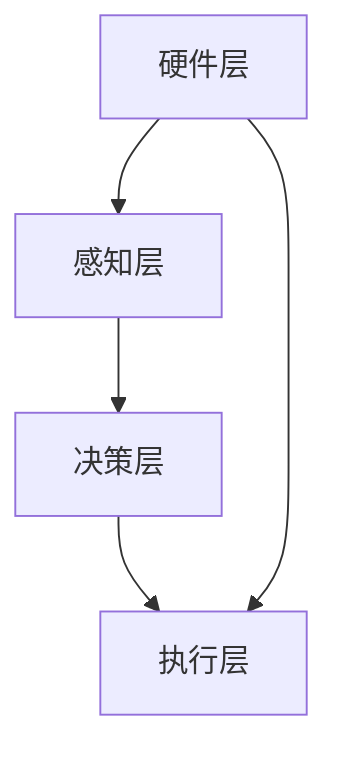

                 

智能园艺机器人是现代农业自动化技术的前沿代表，其通过集成传感器、物联网(IoT)技术和人工智能算法，实现对植物生长环境的实时监控和自动调整，从而极大地提高了园艺生产的效率和质量。本文将探讨智能园艺机器人创业的可能性，以及其在自动化园艺维护中的应用。

## 关键词

- 智能园艺
- 机器人技术
- 自动化维护
- 物联网
- 人工智能

## 摘要

本文首先介绍了智能园艺机器人创业的背景和意义，随后详细阐述了智能园艺机器人的核心概念、算法原理、数学模型以及项目实践。通过具体的案例分析和代码实例，展示了智能园艺机器人在实际应用中的优势和挑战。最后，本文对智能园艺机器人的未来应用场景和工具资源进行了展望，并总结了未来发展的趋势和面临的挑战。

## 1. 背景介绍

### 1.1 智能园艺机器人概述

智能园艺机器人是指利用现代信息技术和自动化技术，对园艺作物进行精准管理和维护的设备或系统。这些机器人可以包括自动化浇水系统、智能修剪机、土壤监测传感器等，通过集成传感器和物联网技术，实现远程监控和自动控制。

### 1.2 智能园艺机器人创业的意义

随着全球人口的不断增长和对食品安全的日益重视，现代农业生产的效率和可持续性变得尤为重要。智能园艺机器人的出现，不仅可以提高作物产量和质量，还可以减少劳动力成本和对环境的负面影响。因此，智能园艺机器人创业具有巨大的市场潜力和社会价值。

## 2. 核心概念与联系

### 2.1 智能园艺机器人架构

智能园艺机器人的架构通常包括硬件层、感知层、决策层和执行层。

#### 2.1.1 硬件层

硬件层包括传感器、执行器、机器人本体等。传感器用于感知环境信息，如土壤湿度、温度、光照强度等；执行器包括水泵、电机等，用于执行具体的园艺操作。

#### 2.1.2 感知层

感知层负责接收传感器数据，并进行初步处理，如数据滤波、特征提取等。

#### 2.1.3 决策层

决策层是智能园艺机器人的核心，通过分析感知层的数据，利用人工智能算法，如机器学习、深度学习等，进行决策，如调整浇水时间、修剪植物等。

#### 2.1.4 执行层

执行层根据决策层的指令，执行具体的园艺操作，如启动水泵、控制电机等。

### 2.2 Mermaid 流程图



## 3. 核心算法原理 & 具体操作步骤

### 3.1 算法原理概述

智能园艺机器人的核心算法主要包括传感器数据预处理、环境建模、决策算法和执行算法。

### 3.2 算法步骤详解

1. **传感器数据预处理**：对传感器数据进行滤波、去噪和特征提取。
2. **环境建模**：利用预处理后的数据，构建植物生长环境的数学模型。
3. **决策算法**：基于环境模型，利用机器学习或深度学习算法，进行决策，如浇水时间、修剪策略等。
4. **执行算法**：根据决策结果，控制执行器进行具体的园艺操作。

### 3.3 算法优缺点

**优点**：
- 提高园艺生产效率
- 减少劳动力成本
- 提高作物品质

**缺点**：
- 算法复杂度较高
- 需要大量的数据支持
- 硬件成本较高

### 3.4 算法应用领域

智能园艺算法可以应用于温室栽培、户外园艺、植物育种等多个领域。

## 4. 数学模型和公式 & 详细讲解 & 举例说明

### 4.1 数学模型构建

智能园艺机器人的数学模型主要包括土壤湿度模型、温度模型和光照强度模型。

### 4.2 公式推导过程

土壤湿度模型：

$$
h(t) = \frac{1}{1 + e^{-k(T - t)}}
$$

其中，$h(t)$ 是土壤湿度，$T$ 是植物根系温度，$t$ 是环境温度，$k$ 是模型参数。

温度模型：

$$
T(t) = T_0 + Qe^{-kt}
$$

其中，$T(t)$ 是植物根系温度，$T_0$ 是初始温度，$Q$ 是温度变化量，$k$ 是模型参数。

光照强度模型：

$$
I(t) = I_0 + \alpha e^{-kt}
$$

其中，$I(t)$ 是光照强度，$I_0$ 是初始光照强度，$\alpha$ 是光照衰减系数，$k$ 是模型参数。

### 4.3 案例分析与讲解

以温室栽培为例，假设温室内的植物需要维持土壤湿度在60%以上，温度在20-25°C之间，光照强度在300-500勒克斯之间。通过智能园艺机器人的环境建模和决策算法，可以实时调整浇水、供暖和遮阳等操作，确保植物生长环境的稳定。

## 5. 项目实践：代码实例和详细解释说明

### 5.1 开发环境搭建

智能园艺机器人项目的开发环境需要包括Python、MATLAB等编程工具，以及Raspberry Pi、Arduino等硬件平台。

### 5.2 源代码详细实现

以下是智能园艺机器人的核心代码示例：

```python
# 传感器数据读取
def read_sensors():
    # 读取土壤湿度传感器数据
    soil_humidity = read_soil_humidity_sensor()
    # 读取温度传感器数据
    temperature = read_temperature_sensor()
    # 读取光照强度传感器数据
    light_intensity = read_light_intensity_sensor()
    return soil_humidity, temperature, light_intensity

# 决策算法
def make_decision(soil_humidity, temperature, light_intensity):
    if soil_humidity < 60:
        # 调整浇水时间
        adjust_watering_time()
    elif temperature < 20 or temperature > 25:
        # 调整供暖时间
        adjust_heating_time()
    elif light_intensity < 300 or light_intensity > 500:
        # 调整遮阳时间
        adjust_shading_time()

# 执行算法
def execute_decision():
    # 根据决策结果，执行具体的园艺操作
    execute_watering()
    execute_heating()
    execute_shading()

# 主程序
def main():
    while True:
        # 读取传感器数据
        soil_humidity, temperature, light_intensity = read_sensors()
        # 基于传感器数据进行决策
        make_decision(soil_humidity, temperature, light_intensity)
        # 执行决策结果
        execute_decision()
        # 等待一段时间后，再次进行传感器读取和决策
        time.sleep(60)

if __name__ == "__main__":
    main()
```

### 5.3 代码解读与分析

代码首先定义了读取传感器数据的函数`read_sensors()`，然后是决策算法函数`make_decision()`，最后是执行算法函数`execute_decision()`。主程序`main()`通过不断循环读取传感器数据，进行决策和执行，从而实现对园艺环境的自动调整。

## 6. 实际应用场景

### 6.1 温室栽培

智能园艺机器人可以应用于温室栽培，通过实时监控和自动调整，确保植物生长环境的稳定性。

### 6.2 户外园艺

智能园艺机器人可以应用于户外园艺，如花园、农田等，通过自动化维护，提高园艺生产的效率。

### 6.3 植物育种

智能园艺机器人可以用于植物育种，通过精准控制生长环境，加快育种进程。

## 7. 未来应用展望

随着人工智能和物联网技术的不断发展，智能园艺机器人将在未来农业中发挥越来越重要的作用。未来，智能园艺机器人将更加智能化、自主化，不仅能够实现自动化维护，还可以进行自主学习和决策，从而实现真正的智慧农业。

## 8. 工具和资源推荐

### 8.1 学习资源推荐

- 《智能园艺机器人技术》
- 《物联网与智能家居》
- 《深度学习》

### 8.2 开发工具推荐

- Python
- MATLAB
- Raspberry Pi
- Arduino

### 8.3 相关论文推荐

- "Smart Farming with Internet of Things: A Review"
- "Automated Gardening Using IoT and Deep Learning"
- "Intelligent Garden Robots: A Survey"

## 9. 总结：未来发展趋势与挑战

智能园艺机器人作为现代农业自动化技术的重要应用，具有广阔的发展前景。未来，随着人工智能和物联网技术的进一步发展，智能园艺机器人将在农业生产中发挥越来越重要的作用。然而，智能园艺机器人也面临着算法复杂度、数据依赖性、硬件成本等挑战。为了实现智能园艺机器人的广泛应用，我们需要进一步加强技术研发和产业链合作。

## 10. 附录：常见问题与解答

### 10.1 智能园艺机器人需要哪些硬件？

智能园艺机器人通常需要包括传感器（如土壤湿度传感器、温度传感器、光照强度传感器）、执行器（如水泵、电机）、控制器（如Raspberry Pi、Arduino）等硬件。

### 10.2 智能园艺机器人的算法复杂度如何？

智能园艺机器人的算法复杂度较高，通常涉及机器学习、深度学习等技术，需要大量的计算资源和数据支持。

### 10.3 智能园艺机器人是否会影响农作物品质？

智能园艺机器人通过精准控制生长环境，可以提高农作物品质，但需要根据实际需求进行合理设置。

---

作者：禅与计算机程序设计艺术 / Zen and the Art of Computer Programming
```

