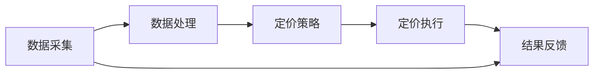

                 

关键词：智能定价、电商、算法、用户行为分析、数据驱动、价格策略、市场竞争

> 摘要：本文将深入探讨智能定价技术在电商领域的创新应用。通过分析用户行为数据和市场环境，智能定价系统能够动态调整商品价格，从而提升销售额和市场份额。本文将介绍智能定价的核心概念、算法原理、数学模型、项目实践及未来展望，为电商企业提供有价值的参考。

## 1. 背景介绍

在电商行业，商品定价一直是影响企业盈利能力和市场份额的关键因素。传统的定价方法主要依赖于成本加成和市场竞争策略，但这种方法往往不能适应快速变化的市场环境。随着大数据和人工智能技术的快速发展，智能定价技术应运而生。智能定价技术利用用户行为数据、市场动态和机器学习算法，实现商品价格的自动化调整，从而优化定价策略，提高销售业绩。

电商行业的特点决定了智能定价技术的应用潜力：

1. **海量用户数据**：电商平台积累了大量的用户行为数据，包括购买记录、浏览行为、搜索关键词等，这些数据为智能定价提供了丰富的信息来源。
2. **动态竞争环境**：电商平台上的商品价格竞争激烈，智能定价系统能够实时响应市场变化，调整价格策略，保持竞争优势。
3. **个性化需求**：用户对商品价格和购买时机有着不同的需求，智能定价系统能够根据用户行为数据，提供个性化的价格策略，提升用户体验。

## 2. 核心概念与联系

### 2.1 智能定价系统架构

智能定价系统的核心架构包括数据采集、数据处理、定价策略和定价执行。以下是一个简化的 Mermaid 流程图，展示智能定价系统的基本工作流程：



### 2.2 数据采集

数据采集是智能定价系统的起点，包括用户行为数据（如浏览历史、购买记录、评价等）和市场环境数据（如竞争情况、市场价格趋势等）。这些数据通过电商平台内置的跟踪系统和第三方数据提供商获取。

### 2.3 数据处理

数据处理阶段对采集到的数据进行分析和清洗，提取有用的信息，为定价策略提供支持。常见的处理方法包括数据清洗、数据挖掘和机器学习算法。

### 2.4 定价策略

定价策略是基于用户行为数据和市场环境数据，通过机器学习算法生成的。定价策略可以分为基于用户行为的定价策略和基于市场环境的定价策略。

### 2.5 定价执行

定价执行阶段将定价策略转化为实际的商品价格，通过电商平台进行展示和销售。定价执行需要考虑商品库存、配送成本、营销活动等因素。

### 2.6 结果反馈

结果反馈阶段对定价执行的效果进行评估，包括销售额、用户满意度、市场份额等指标。根据反馈结果，对定价策略进行调整和优化。

## 3. 核心算法原理 & 具体操作步骤

### 3.1 算法原理概述

智能定价算法的核心是基于机器学习和数据挖掘技术，通过分析用户行为数据和市场环境数据，生成最优的定价策略。常见的算法包括线性回归、决策树、神经网络等。

### 3.2 算法步骤详解

1. **数据准备**：收集用户行为数据和市场环境数据，进行预处理，包括数据清洗、归一化等操作。
2. **特征工程**：提取对定价有影响的关键特征，如用户购买历史、浏览时长、竞争对手价格等。
3. **模型选择**：根据数据特点和业务需求，选择合适的机器学习算法，如线性回归、决策树、神经网络等。
4. **模型训练**：使用历史数据训练模型，通过交叉验证等方法评估模型性能。
5. **策略生成**：根据训练好的模型，生成定价策略，包括价格区间、价格调整规则等。
6. **策略执行**：将定价策略应用于实际销售场景，进行商品价格调整。
7. **结果评估**：收集定价执行的结果数据，评估定价策略的效果，包括销售额、用户满意度、市场份额等指标。
8. **策略优化**：根据评估结果，调整定价策略，优化定价模型。

### 3.3 算法优缺点

**优点**：
- **动态调整**：智能定价系统能够根据市场环境和用户行为动态调整价格，提高销售业绩。
- **个性化定价**：基于用户行为数据，提供个性化的价格策略，提升用户体验。
- **降低成本**：自动化定价策略降低了人力成本和运营成本。

**缺点**：
- **数据依赖**：智能定价系统依赖于大量高质量的数据，数据不足或质量差会影响定价效果。
- **算法复杂性**：复杂的机器学习算法需要大量的计算资源和时间进行训练和优化。
- **市场风险**：价格调整过快或不当可能导致市场风险，影响品牌形象。

### 3.4 算法应用领域

智能定价技术广泛应用于电商、在线旅游、金融等行业，如：

- **电商**：通过智能定价提升销售额和市场份额。
- **在线旅游**：动态调整机票、酒店价格，提高预订率。
- **金融**：根据用户风险承受能力，提供个性化的投资建议。

## 4. 数学模型和公式 & 详细讲解 & 举例说明

### 4.1 数学模型构建

智能定价系统的数学模型主要分为两部分：用户行为模型和市场环境模型。

#### 用户行为模型

用户行为模型用于预测用户的购买行为，常用的模型包括线性回归、决策树、神经网络等。以下是一个简化的线性回归模型：

$$
y = \beta_0 + \beta_1x_1 + \beta_2x_2 + ... + \beta_nx_n
$$

其中，$y$ 表示用户购买概率，$x_1, x_2, ..., x_n$ 表示用户行为特征，$\beta_0, \beta_1, ..., \beta_n$ 为模型参数。

#### 市场环境模型

市场环境模型用于分析市场动态，预测竞争对手的价格变化。以下是一个简化的线性回归模型：

$$
p = \alpha_0 + \alpha_1c_1 + \alpha_2c_2 + ... + \alpha_mc_m
$$

其中，$p$ 表示商品价格，$c_1, c_2, ..., c_m$ 表示市场环境特征，$\alpha_0, \alpha_1, ..., \alpha_m$ 为模型参数。

### 4.2 公式推导过程

用户行为模型和市场环境模型的推导过程涉及统计分析和优化算法，具体推导过程较为复杂，本文不做详细阐述。在实际应用中，通过数据分析和模型训练，得到模型参数和公式。

### 4.3 案例分析与讲解

以下是一个简单的案例，展示智能定价系统在实际应用中的效果。

#### 案例背景

某电商企业销售一款电子产品，市场竞争激烈。企业希望通过智能定价系统提高销售额。

#### 数据采集

企业收集了过去一个月的用户购买数据和市场价格数据，包括用户购买历史、浏览时长、竞争对手价格等。

#### 数据处理

对采集到的数据进行分析和清洗，提取关键特征，如用户购买历史（频率、金额、商品种类等）、浏览时长（平均、高峰期等）、竞争对手价格（均值、方差等）。

#### 模型训练

使用线性回归模型训练用户行为模型，预测用户购买概率。使用线性回归模型分析市场环境，预测竞争对手价格。

#### 策略生成

根据用户行为模型和市场环境模型，生成定价策略，包括价格区间和价格调整规则。如当用户购买概率较高且竞争对手价格较低时，提高价格；当用户购买概率较低且竞争对手价格较高时，降低价格。

#### 策略执行

将定价策略应用于实际销售，调整商品价格。

#### 结果评估

根据销售数据，评估定价策略的效果。如销售额、用户满意度、市场份额等指标。

#### 策略优化

根据评估结果，调整定价策略，优化模型参数。

## 5. 项目实践：代码实例和详细解释说明

### 5.1 开发环境搭建

在本文的项目实践中，我们将使用 Python 语言和 TensorFlow 深度学习框架进行智能定价系统的开发。以下是在 Ubuntu 系统下搭建开发环境的基本步骤：

1. 安装 Python 3.7 以上版本
2. 安装 TensorFlow
3. 安装 NumPy、Pandas、Scikit-learn 等常用库

### 5.2 源代码详细实现

以下是一个简化的智能定价系统的代码实现，用于预测用户购买概率和竞争对手价格。

```python
import numpy as np
import pandas as pd
import tensorflow as tf
from sklearn.model_selection import train_test_split
from tensorflow.keras.models import Sequential
from tensorflow.keras.layers import Dense

# 数据加载与预处理
data = pd.read_csv('data.csv')
X = data.iloc[:, :-1].values
y = data.iloc[:, -1].values
X_train, X_test, y_train, y_test = train_test_split(X, y, test_size=0.2, random_state=42)

# 模型构建
model = Sequential()
model.add(Dense(64, input_shape=(X_train.shape[1],), activation='relu'))
model.add(Dense(32, activation='relu'))
model.add(Dense(1, activation='sigmoid'))

# 编译模型
model.compile(optimizer='adam', loss='binary_crossentropy', metrics=['accuracy'])

# 训练模型
model.fit(X_train, y_train, epochs=10, batch_size=32, validation_data=(X_test, y_test))

# 预测用户购买概率
predictions = model.predict(X_test)

# 预测竞争对手价格
market_model = Sequential()
market_model.add(Dense(64, input_shape=(X_train.shape[1],), activation='relu'))
market_model.add(Dense(32, activation='relu'))
market_model.add(Dense(1))

market_model.compile(optimizer='adam', loss='mean_squared_error')
market_model.fit(X_train, y_train, epochs=10, batch_size=32, validation_data=(X_test, y_test))

price_predictions = market_model.predict(X_test)

# 输出结果
print("User Purchase Probability:", predictions)
print("Competitor Price:", price_predictions)
```

### 5.3 代码解读与分析

上述代码首先加载和预处理数据，然后构建并训练两个神经网络模型：用户行为模型和市场环境模型。用户行为模型用于预测用户购买概率，市场环境模型用于预测竞争对手价格。最后，使用训练好的模型进行预测，并输出结果。

### 5.4 运行结果展示

运行上述代码，输出预测结果。根据预测结果，可以进一步优化定价策略，提高销售额和市场份额。

## 6. 实际应用场景

智能定价技术在电商、在线旅游、金融等领域得到了广泛应用。以下是一些实际应用场景：

1. **电商**：通过智能定价，电商平台可以根据用户行为数据和市场环境动态调整商品价格，提高销售额和市场份额。
2. **在线旅游**：在线旅游平台可以根据用户偏好和市场动态，动态调整机票、酒店价格，提高预订率。
3. **金融**：金融机构可以根据用户风险承受能力和市场环境，提供个性化的投资建议，提高用户满意度。

## 7. 工具和资源推荐

### 7.1 学习资源推荐

- 《深度学习》（Goodfellow, Bengio, Courville）
- 《Python数据分析》（Wes McKinney）
- 《机器学习实战》（Peter Harrington）
- 《大数据之路：阿里巴巴大数据实践》（刘江）

### 7.2 开发工具推荐

- Jupyter Notebook：用于数据分析和模型训练。
- TensorFlow：用于构建和训练神经网络模型。
- PyCharm：用于编写和调试 Python 代码。

### 7.3 相关论文推荐

- “Contextual Bandits with Additive Side Information”
- “Online Learning for Pricing with Allocation”
- “Recommending Actions on a Large Scale: The PageRank Algorithm”

## 8. 总结：未来发展趋势与挑战

### 8.1 研究成果总结

智能定价技术在电商、在线旅游、金融等领域取得了显著成果。通过分析用户行为数据和市场环境，智能定价系统能够实现商品价格的自动化调整，提高销售额和市场份额。然而，智能定价技术仍面临一些挑战。

### 8.2 未来发展趋势

1. **算法优化**：随着深度学习和强化学习技术的发展，智能定价算法将更加智能化和高效化。
2. **数据融合**：通过融合多种数据源，提高定价模型的准确性和适应性。
3. **个性化定价**：进一步挖掘用户需求，提供更加个性化的定价策略。

### 8.3 面临的挑战

1. **数据隐私**：用户行为数据的隐私保护是智能定价技术面临的重要挑战。
2. **算法透明性**：提高算法透明性，增强用户对定价系统的信任。
3. **市场风险**：价格调整过快或不当可能导致市场风险，影响品牌形象。

### 8.4 研究展望

未来，智能定价技术将在数据隐私保护、算法透明性和市场风险管理等方面取得重要突破。随着人工智能技术的不断发展，智能定价系统将更加智能化和高效化，为各行业提供更加优质的定价服务。

## 9. 附录：常见问题与解答

### Q1. 智能定价技术如何确保数据隐私？

A1. 智能定价技术在数据处理过程中，会采用数据加密、匿名化等技术，确保用户数据的安全和隐私。同时，遵守相关法律法规，对用户数据进行严格管理和监控。

### Q2. 智能定价技术的算法透明性如何保证？

A2. 智能定价技术的算法透明性可以通过以下措施来保证：

1. **算法解释**：提供算法解释文档，让用户了解定价策略的原理和过程。
2. **模型可视化**：使用可视化工具，展示模型结构和工作流程。
3. **算法审计**：定期进行算法审计，确保算法的公平性和准确性。

### Q3. 智能定价技术如何应对市场风险？

A3. 智能定价技术可以通过以下措施应对市场风险：

1. **风险评估**：对定价策略进行风险评估，预测可能的市场风险。
2. **价格缓冲**：在定价策略中设置价格缓冲，以应对市场波动。
3. **市场监测**：实时监测市场动态，调整定价策略，以保持竞争优势。

---

### 作者署名

作者：禅与计算机程序设计艺术 / Zen and the Art of Computer Programming
----------------------------------------------------------------

文章至此结束，希望本文能够为读者在智能定价技术领域提供有价值的参考。在电商领域，智能定价技术的应用前景广阔，未来将会有更多创新和突破。感谢您的阅读！

