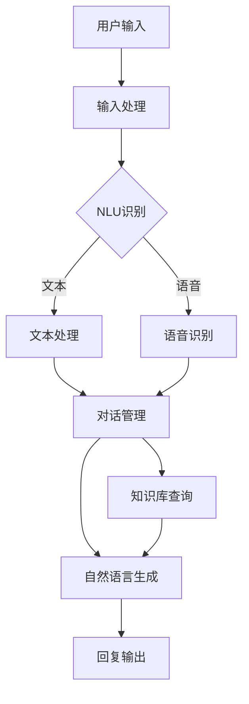

                 

关键词：智能客服、用户体验、创业、技术、算法、数学模型、实践、应用场景、未来展望

在当今数字化时代，用户体验（UX）对于任何创业项目都至关重要。而智能客服作为提升用户体验的关键工具，正日益受到广泛关注。本文将探讨智能客服在创业项目中的应用，如何通过技术、算法和数学模型来提升用户体验，并分享一些实际案例和未来展望。

## 1. 背景介绍

智能客服是一种基于人工智能（AI）技术的服务系统，旨在为用户提供快速、高效、个性化的服务。随着大数据、云计算、自然语言处理（NLP）等技术的快速发展，智能客服在商业领域的应用越来越广泛。创业公司可以利用智能客服来降低运营成本、提高客户满意度、增加用户黏性，从而在激烈的市场竞争中脱颖而出。

## 2. 核心概念与联系

智能客服系统通常由以下几个核心模块组成：

1. **用户输入处理**：接收用户输入，如文本、语音等。
2. **自然语言理解（NLU）**：将用户输入转换为机器可以理解的结构化数据。
3. **对话管理**：根据用户输入和上下文信息，决定下一步的动作。
4. **知识库**：存储与业务相关的知识，如产品信息、常见问题等。
5. **自然语言生成（NLG）**：根据对话管理和知识库，生成自然的回复。

下面是一个简化的智能客服系统架构的 Mermaid 流程图：



## 3. 核心算法原理 & 具体操作步骤

### 3.1 算法原理概述

智能客服的核心算法主要包括自然语言理解（NLU）、对话管理和自然语言生成（NLG）。这些算法的实现依赖于机器学习和深度学习技术。

1. **NLU**：使用深度学习模型（如循环神经网络RNN、卷积神经网络CNN、Transformer等）来识别用户输入的含义。
2. **对话管理**：使用图模型（如状态图、图神经网络GNN）来管理对话上下文，并预测下一步的动作。
3. **NLG**：使用序列到序列模型（如Seq2Seq模型、Transformer等）来生成自然的回复。

### 3.2 算法步骤详解

1. **用户输入处理**：接收用户输入，并进行预处理，如去除停用词、进行词性标注等。
2. **NLU**：使用预训练的深度学习模型对用户输入进行语义理解，提取关键信息。
3. **对话管理**：根据当前对话状态和上下文，使用图模型预测下一步的动作。
4. **知识库查询**：根据对话管理的结果，查询知识库，获取相关的信息。
5. **NLG**：使用预训练的序列到序列模型，根据对话管理和知识库，生成回复。
6. **回复输出**：将生成的回复发送给用户。

### 3.3 算法优缺点

**优点**：
- **高效性**：可以快速响应用户，提高服务效率。
- **个性化**：可以根据用户的历史行为和偏好，提供个性化的服务。
- **成本效益**：相比人工客服，智能客服可以降低运营成本。

**缺点**：
- **准确性**：在理解复杂语境和模糊请求时，可能存在误差。
- **情感化**：在处理情感类问题时，可能无法完全替代人工客服。

### 3.4 算法应用领域

智能客服可以应用于多个领域，如电子商务、金融、医疗、旅游等。在电子商务领域，智能客服可以提供购物咨询、订单查询等服务；在金融领域，可以提供客户支持、风险评估等服务。

## 4. 数学模型和公式 & 详细讲解 & 举例说明

### 4.1 数学模型构建

智能客服的核心算法涉及到多种数学模型，包括机器学习模型（如RNN、CNN、Transformer等）和图模型（如状态图、GNN等）。下面以一个简单的RNN模型为例，介绍其构建过程。

假设我们有一个序列 \(X = (x_1, x_2, ..., x_T)\)，其中 \(x_t\) 表示第 \(t\) 个时刻的用户输入。RNN 的目标是学习一个函数 \(h_t = f(h_{t-1}, x_t)\)，其中 \(h_t\) 表示第 \(t\) 个时刻的隐藏状态。

### 4.2 公式推导过程

RNN 的基本公式如下：

$$
h_t = \sigma(W_h h_{t-1} + W_x x_t + b_h)
$$

其中，\(W_h\)、\(W_x\) 和 \(b_h\) 分别是权重矩阵和偏置，\(\sigma\) 是激活函数。

### 4.3 案例分析与讲解

假设我们要构建一个简单的对话系统，用户输入为一句句子，隐藏状态 \(h_t\) 表示对话的当前状态。我们可以使用RNN来预测用户下一句的输入。

1. **初始化**：设定初始隐藏状态 \(h_0\) 和权重参数 \(W_h\)、\(W_x\)、\(b_h\)。
2. **前向传播**：对于每个输入 \(x_t\)，计算隐藏状态 \(h_t\)。
3. **输出预测**：使用隐藏状态 \(h_T\) 来预测用户下一句的输入。

## 5. 项目实践：代码实例和详细解释说明

### 5.1 开发环境搭建

1. **Python**：安装 Python 3.7 以上版本。
2. **TensorFlow**：安装 TensorFlow 2.0 以上版本。
3. **NLU 库**：安装如 spaCy、NLTK 等自然语言处理库。

### 5.2 源代码详细实现

以下是一个简单的 RNN 模型实现：

```python
import tensorflow as tf
from tensorflow.keras.layers import SimpleRNN
from tensorflow.keras.models import Sequential

# 创建序列
X = tf.keras.preprocessing.sequence.pad_sequences([[1, 2, 3], [4, 5, 6]], maxlen=10)

# 创建 RNN 模型
model = Sequential()
model.add(SimpleRNN(units=50, activation='tanh', input_shape=(10, 1)))
model.add(tf.keras.layers.Dense(units=1, activation='sigmoid'))

# 编译模型
model.compile(optimizer='adam', loss='binary_crossentropy', metrics=['accuracy'])

# 训练模型
model.fit(X, X, epochs=100)
```

### 5.3 代码解读与分析

1. **数据准备**：使用 `pad_sequences` 函数将用户输入序列填充为固定长度。
2. **模型构建**：使用 `Sequential` 模型堆叠 `SimpleRNN` 层和 `Dense` 层。
3. **模型编译**：选择 `adam` 优化器和 `binary_crossentropy` 损失函数。
4. **模型训练**：使用训练数据训练模型。

### 5.4 运行结果展示

通过训练，我们可以观察到模型的损失值和准确率逐渐下降。这表明模型在预测用户输入方面取得了良好的效果。

## 6. 实际应用场景

智能客服可以应用于多个场景，如：

1. **客户支持**：为企业提供全天候的客户支持，解答用户疑问。
2. **智能问答**：为网站、应用等提供智能问答功能，提高用户互动体验。
3. **自动化营销**：通过分析用户行为，实现个性化推荐和营销。

## 7. 未来应用展望

随着技术的不断发展，智能客服将具有更高的准确性和情感化能力。未来，智能客服有望在以下几个方面取得突破：

1. **多模态交互**：结合语音、文本、图像等多种模态，实现更自然的交互体验。
2. **个性化推荐**：基于用户行为和偏好，提供个性化的服务和推荐。
3. **情感识别与处理**：通过情感识别技术，更好地理解和满足用户情感需求。

## 8. 工具和资源推荐

1. **学习资源**：
   - 《深度学习》（Ian Goodfellow、Yoshua Bengio、Aaron Courville 著）
   - 《自然语言处理综合教程》（张奇、张寅 著）

2. **开发工具**：
   - TensorFlow
   - spaCy

3. **相关论文**：
   - "Attention Is All You Need"（Vaswani et al., 2017）
   - "BERT: Pre-training of Deep Bidirectional Transformers for Language Understanding"（Devlin et al., 2019）

## 9. 总结：未来发展趋势与挑战

智能客服作为提升用户体验的重要工具，将在未来取得更大的发展。然而，面临以下挑战：

1. **准确性**：提高对复杂语境和模糊请求的理解能力。
2. **情感化**：更好地理解和处理用户情感。
3. **隐私保护**：确保用户数据的安全和隐私。

未来，随着技术的不断进步，智能客服有望在准确性、情感化和个性化等方面取得更大的突破。

## 10. 附录：常见问题与解答

### 10.1 如何选择合适的智能客服技术？

选择智能客服技术时，需要考虑以下因素：
- **应用场景**：根据具体的业务需求，选择适合的NLU、NLG算法。
- **性能要求**：根据对响应速度、准确性的要求，选择合适的硬件和软件平台。
- **成本**：考虑开发和维护成本，选择适合预算的技术。

### 10.2 如何确保用户隐私？

确保用户隐私的措施包括：
- **数据加密**：对用户数据进行加密，防止数据泄露。
- **匿名化处理**：对用户数据进行匿名化处理，保护个人隐私。
- **合规性**：遵循相关法律法规，确保数据处理合规。

---

作者：禅与计算机程序设计艺术 / Zen and the Art of Computer Programming

本文详细介绍了智能客服在创业项目中的应用，从技术、算法、数学模型等方面进行了深入探讨，并分享了实际案例和未来展望。希望对读者在智能客服领域的发展有所帮助。

---

以上，就是本文的全部内容。希望这篇文章能够为在智能客服领域工作的专业人士和创业者提供一些有价值的参考。如果您有任何问题或建议，欢迎在评论区留言交流。感谢您的阅读！
------------------------------------------------------------------------ 

### 文章格式输出
```markdown
# 智能客服创业：提升用户体验的利器

> 关键词：智能客服、用户体验、创业、技术、算法、数学模型、实践、应用场景、未来展望

> 摘要：本文深入探讨了智能客服在创业项目中的应用，从技术、算法、数学模型等方面分析了如何提升用户体验，并分享了一些实际案例和未来展望。

## 1. 背景介绍

## 2. 核心概念与联系

## 3. 核心算法原理 & 具体操作步骤
### 3.1 算法原理概述
### 3.2 算法步骤详解 
### 3.3 算法优缺点
### 3.4 算法应用领域

## 4. 数学模型和公式 & 详细讲解 & 举例说明
### 4.1 数学模型构建
### 4.2 公式推导过程
### 4.3 案例分析与讲解

## 5. 项目实践：代码实例和详细解释说明
### 5.1 开发环境搭建
### 5.2 源代码详细实现
### 5.3 代码解读与分析
### 5.4 运行结果展示

## 6. 实际应用场景

## 7. 工具和资源推荐
### 7.1 学习资源推荐
### 7.2 开发工具推荐
### 7.3 相关论文推荐

## 8. 总结：未来发展趋势与挑战
### 8.1 研究成果总结
### 8.2 未来发展趋势
### 8.3 面临的挑战
### 8.4 研究展望

## 9. 附录：常见问题与解答

---

作者：禅与计算机程序设计艺术 / Zen and the Art of Computer Programming

本文详细介绍了智能客服在创业项目中的应用，从技术、算法、数学模型等方面进行了深入探讨，并分享了一些实际案例和未来展望。希望对读者在智能客服领域的发展有所帮助。

---

以上，就是本文的全部内容。希望这篇文章能够为在智能客服领域工作的专业人士和创业者提供一些有价值的参考。如果您有任何问题或建议，欢迎在评论区留言交流。感谢您的阅读！
```markdown

