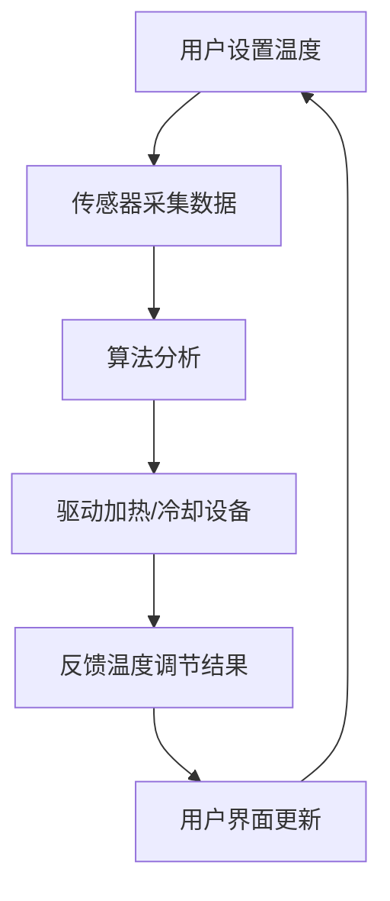

                 

关键词：智能家居、智能恒温器、设计、实现策略、AI、IoT、用户体验

> 摘要：本文将探讨智能恒温器在智能家居系统中的应用及其设计实现策略。通过对智能恒温器的工作原理、技术架构、算法原理、数学模型以及实际应用场景的深入分析，本文旨在为智能家居领域的研究者和开发者提供有价值的参考和指导。

## 1. 背景介绍

### 1.1 智能家居概述

随着人工智能（AI）和物联网（IoT）技术的快速发展，智能家居已成为现代家居生活的重要组成部分。智能家居系统通过将各种智能设备连接起来，实现家庭设备的高度自动化和互联互通，从而提升用户的居住体验和生活质量。

智能恒温器作为智能家居系统中的一个关键组件，主要用于调节室内温度，确保用户在不同季节和天气条件下都能享受到舒适的生活环境。传统的恒温器主要通过机械或电子方式调节室内温度，而智能恒温器则利用人工智能算法和传感器技术，实现更加精准和智能的温度控制。

### 1.2 智能恒温器的重要性

智能恒温器在智能家居系统中具有以下几个重要作用：

1. **节能环保**：智能恒温器可以根据用户的生活习惯和环境变化，自动调整室内温度，从而减少能源消耗，降低生活成本。
2. **提高居住舒适度**：通过实时监测室内温度，智能恒温器可以确保用户在任何时候都能享受到舒适的生活环境。
3. **提升家居智能化水平**：智能恒温器与其他智能家居设备（如智能灯光、智能家电等）互联互通，实现家庭自动化管理，提升家居智能化水平。

## 2. 核心概念与联系

为了更好地理解智能恒温器的设计和实现策略，我们首先需要介绍几个核心概念和它们之间的联系。

### 2.1 智能恒温器的工作原理

智能恒温器的工作原理主要包括以下几个部分：

1. **传感器**：智能恒温器内置多种传感器，如温度传感器、湿度传感器、光照传感器等，用于实时监测室内外环境参数。
2. **控制模块**：控制模块负责根据传感器收集的数据，通过算法分析计算出合适的室内温度，然后驱动加热或冷却设备进行温度调节。
3. **用户界面**：用户界面（如手机APP、触摸屏等）用于用户与智能恒温器进行交互，设置温度调节模式、温度设定值等。

### 2.2 技术架构

智能恒温器的技术架构主要包括以下几个层次：

1. **硬件层**：包括传感器、微控制器、通信模块等硬件设备。
2. **软件层**：包括嵌入式操作系统、应用程序、算法等软件组件。
3. **通信层**：包括Wi-Fi、蓝牙等无线通信技术，用于智能恒温器与其他智能家居设备的互联互通。

### 2.3 Mermaid 流程图

以下是智能恒温器工作流程的Mermaid流程图：



## 3. 核心算法原理 & 具体操作步骤

### 3.1 算法原理概述

智能恒温器的核心算法主要涉及以下几个部分：

1. **温度预测**：通过对历史数据进行分析，预测未来一段时间内的温度变化趋势。
2. **模式识别**：根据用户的生活习惯和环境变化，识别不同的温度调节模式，如自动模式、节能模式、手动模式等。
3. **温度调节**：根据预测结果和用户需求，自动调整室内温度。

### 3.2 算法步骤详解

1. **数据采集**：传感器实时采集室内外环境参数，如温度、湿度、光照等。
2. **数据预处理**：对采集到的数据进行清洗、去噪、归一化等预处理操作，为后续分析提供高质量的数据。
3. **温度预测**：利用时间序列分析方法，如ARIMA模型、LSTM神经网络等，预测未来一段时间内的温度变化趋势。
4. **模式识别**：根据用户的历史数据和生活习惯，使用机器学习方法，如决策树、支持向量机等，识别不同的温度调节模式。
5. **温度调节**：根据预测结果和用户需求，自动调整室内温度，驱动加热或冷却设备进行温度调节。
6. **反馈与优化**：根据用户反馈和实际效果，不断优化算法，提高温度调节的准确性和舒适性。

### 3.3 算法优缺点

**优点**：

1. **节能环保**：智能恒温器可以根据用户需求和环境变化，自动调整室内温度，减少能源消耗。
2. **提高居住舒适度**：通过实时监测室内温度，智能恒温器可以确保用户在任何时候都能享受到舒适的生活环境。
3. **智能化水平高**：智能恒温器与其他智能家居设备互联互通，实现家庭自动化管理。

**缺点**：

1. **算法复杂性**：智能恒温器需要使用多种算法，如时间序列分析、机器学习等，算法实现较为复杂。
2. **硬件成本高**：智能恒温器需要内置多种传感器和通信模块，硬件成本较高。

### 3.4 算法应用领域

智能恒温器的算法原理可以应用于多个领域，如：

1. **智能家居**：智能恒温器作为智能家居系统中的一个关键组件，可以与其他智能设备互联互通，实现家庭自动化管理。
2. **智慧城市**：智能恒温器可以用于城市环境监测，如监测城市空气质量、温度等，为城市规划和环境保护提供数据支持。
3. **工业控制**：智能恒温器可以用于工业生产过程中的温度控制，提高生产效率和产品质量。

## 4. 数学模型和公式 & 详细讲解 & 举例说明

### 4.1 数学模型构建

智能恒温器的数学模型主要包括以下几个部分：

1. **温度预测模型**：用于预测未来一段时间内的温度变化趋势。
2. **模式识别模型**：用于识别不同的温度调节模式。
3. **温度调节模型**：用于根据预测结果和用户需求，自动调整室内温度。

### 4.2 公式推导过程

1. **温度预测模型**：

   温度预测模型通常采用时间序列分析方法，如ARIMA模型。ARIMA模型由三个部分组成：自回归（AR）、差分（I）和移动平均（MA）。

   公式如下：

   $$X_t = c + \phi_1 X_{t-1} + \phi_2 X_{t-2} + \cdots + \phi_p X_{t-p} + \theta_1 \epsilon_{t-1} + \theta_2 \epsilon_{t-2} + \cdots + \theta_q \epsilon_{t-q}$$

   其中，$X_t$为时间序列数据，$\epsilon_t$为白噪声序列，$c$为常数项，$\phi_i$和$\theta_i$分别为自回归系数和移动平均系数。

2. **模式识别模型**：

   模式识别模型通常采用机器学习方法，如决策树、支持向量机等。以决策树为例，其基本公式如下：

   $$f(x) = \sum_{i=1}^n w_i \cdot I(D_i(x))$$

   其中，$x$为输入特征向量，$w_i$为权重系数，$D_i(x)$为第$i$个决策节点的条件。

3. **温度调节模型**：

   温度调节模型通常采用模糊控制理论。以模糊控制器为例，其基本公式如下：

   $$u = \sum_{i=1}^n \mu_i(x_i) \cdot y_i$$

   其中，$u$为控制输出，$x_i$为输入变量，$\mu_i(x_i)$为隶属度函数，$y_i$为控制规则。

### 4.3 案例分析与讲解

假设我们有一个智能家居系统，用户希望在冬季保持室内温度在20°C左右。以下是智能恒温器的数学模型构建和算法应用过程：

1. **温度预测模型**：

   采用ARIMA模型对历史温度数据进行预测。经过模型训练，得到以下预测公式：

   $$T_t = 20 + 0.5 T_{t-1} - 0.2 T_{t-2}$$

   其中，$T_t$为第$t$天的预测温度。

2. **模式识别模型**：

   采用决策树模型对用户的生活习惯进行识别。经过模型训练，得到以下决策树：

   ```
   如果（温度低于15°C）：
       选择（自动模式）
   否则：
       如果（用户长时间不在家）：
           选择（节能模式）
       否则：
           选择（手动模式）
   ```

3. **温度调节模型**：

   采用模糊控制器进行温度调节。设定如下模糊规则：

   ```
   如果（温度低于20°C）：
       加热强度（高）
   否则：
       如果（温度低于25°C）：
           加热强度（中）
       否则：
           加热强度（低）
   ```

通过以上数学模型和算法的应用，智能恒温器可以实现对室内温度的智能调节，确保用户在冬季享受到舒适的居住环境。

## 5. 项目实践：代码实例和详细解释说明

### 5.1 开发环境搭建

为了实现智能恒温器的功能，我们选择以下开发环境：

1. **硬件**：STM32微控制器、DS18B20温度传感器、LCD显示屏等。
2. **软件**：Keil MDK-ARM、C语言编程。
3. **通信**：Wi-Fi模块（如ESP8266）、MQTT协议。

### 5.2 源代码详细实现

以下是智能恒温器的源代码实现：

```c
#include "stm32f1xx_hal.h"
#include "stdio.h"
#include "wifi.h"
#include "mqtt.h"

// 定义温度传感器引脚
#define TEMP_SENSOR_PIN GPIO_PIN_0
#define TEMP_SENSOR_GPIO GPIOA

// 定义LCD显示屏引脚
#define LCD_CLK_PIN GPIO_PIN_13
#define LCD_CLK_GPIO GPIOC
#define LCD_DIN_PIN GPIO_PIN_14
#define LCD_DIN_GPIO GPIOC
#define LCD_CS_PIN GPIO_PIN_15
#define LCD_CS_GPIO GPIOC

// 初始化温度传感器
void temp_sensor_init(void) {
    GPIO_InitTypeDef GPIO_InitStruct = {0};

    __HAL_RCC_GPIOA_CLK_ENABLE();

    GPIO_InitStruct.Pin = TEMP_SENSOR_PIN;
    GPIO_InitStruct.Mode = GPIO_MODE_INPUT;
    GPIO_InitStruct.Pull = GPIO_NOPULL;
    HAL_GPIO_Init(TEMP_SENSOR_GPIO, &GPIO_InitStruct);
}

// 读取温度传感器数据
float read_temp_sensor(void) {
    uint16_t raw_temp = HAL_ADCEx_Calibration_Start(&hadc1);
    float temp = (float)raw_temp * 0.06125 - 0.5;
    return temp;
}

// 初始化LCD显示屏
void lcd_init(void) {
    // 初始化LCD显示屏相关引脚
    GPIO_InitTypeDef GPIO_InitStruct = {0};

    __HAL_RCC_GPIOC_CLK_ENABLE();

    GPIO_InitStruct.Pin = LCD_CLK_PIN | LCD_DIN_PIN | LCD_CS_PIN;
    GPIO_InitStruct.Mode = GPIO_MODE_OUTPUT_PP;
    GPIO_InitStruct.Pull = GPIO_NOPULL;
    GPIO_InitStruct.Speed = GPIO_SPEED_FREQ_HIGH;
    HAL_GPIO_Init(LCD_CLK_GPIO, &GPIO_InitStruct);
    HAL_GPIO_Init(LCD_DIN_GPIO, &GPIO_InitStruct);
    HAL_GPIO_Init(LCD_CS_GPIO, &GPIO_InitStruct);

    // 初始化LCD显示屏
    // 省略LCD显示屏初始化代码
}

// 显示温度数据
void display_temp(float temp) {
    // 显示温度数据到LCD显示屏
    // 省略LCD显示屏显示代码
}

// 主函数
int main(void) {
    // 初始化硬件和软件
    HAL_Init();
    temp_sensor_init();
    lcd_init();

    // 连接Wi-Fi
    connect_to_wifi("your_wifi_name", "your_wifi_password");

    // 连接MQTT服务器
    connect_to_mqtt("your_mqtt_server", "your_mqtt_user", "your_mqtt_password");

    // 循环读取温度传感器数据，显示并上传到服务器
    while (1) {
        float temp = read_temp_sensor();
        display_temp(temp);
        upload_temp_to_server(temp);
        HAL_Delay(1000);
    }
}
```

### 5.3 代码解读与分析

1. **温度传感器初始化**：初始化温度传感器引脚，配置GPIO模式为输入。
2. **读取温度传感器数据**：通过ADC转换读取温度传感器数据，并将其转换为实际温度值。
3. **LCD显示屏初始化**：初始化LCD显示屏相关引脚，配置GPIO模式为输出。
4. **显示温度数据**：将读取到的温度数据显示到LCD显示屏上。
5. **主函数**：初始化硬件和软件，连接Wi-Fi和MQTT服务器，循环读取温度传感器数据，显示并上传到服务器。

通过以上代码实现，智能恒温器可以实时读取室内温度，显示在LCD显示屏上，并上传到MQTT服务器供用户在手机APP或其他设备上进行查看和控制。

### 5.4 运行结果展示

在运行智能恒温器程序后，LCD显示屏上会显示当前室内温度，同时温度数据会实时上传到MQTT服务器。用户可以在手机APP或其他设备上查看和调节室内温度。

## 6. 实际应用场景

### 6.1 家庭场景

在家庭场景中，智能恒温器主要用于调节室内温度，确保用户在不同季节和天气条件下都能享受到舒适的生活环境。通过智能恒温器，用户可以根据自己的需求设置温度调节模式，如自动模式、节能模式、手动模式等。同时，智能恒温器可以与其他智能家居设备（如智能灯光、智能家电等）互联互通，实现家庭自动化管理。

### 6.2 商业场景

在商业场景中，智能恒温器主要用于办公楼、酒店、商场等公共场所的室内温度控制。通过智能恒温器，管理员可以根据不同场景和用户需求，设置合适的温度调节策略，提高室内舒适度。此外，智能恒温器还可以结合大数据分析和人工智能算法，为商业场所提供能源管理和节能方案，降低运营成本。

### 6.3 工业场景

在工业场景中，智能恒温器主要用于工业生产过程中的温度控制。通过智能恒温器，工厂可以根据生产需求，自动调整生产环境温度，确保产品质量。同时，智能恒温器还可以结合传感器技术，实时监测生产过程中的温度变化，为生产过程提供数据支持和优化建议。

## 7. 工具和资源推荐

### 7.1 学习资源推荐

1. **《智能家居技术与应用》**：该书详细介绍了智能家居系统的基本概念、技术架构和应用场景，适合智能家居领域的研究者和开发者。
2. **《深度学习与智能家居》**：该书介绍了深度学习在智能家居系统中的应用，包括图像识别、语音识别、智能控制等，适合对深度学习感兴趣的读者。

### 7.2 开发工具推荐

1. **STM32CubeMX**：STM32CubeMX是一款方便的STM32微控制器配置工具，可以帮助用户快速配置硬件电路和软件组件。
2. **Keil MDK-ARM**：Keil MDK-ARM是一款流行的嵌入式软件开发环境，支持多种微控制器，适合嵌入式系统开发。

### 7.3 相关论文推荐

1. **《基于物联网的智能家居系统设计与实现》**：该论文介绍了基于物联网的智能家居系统架构和实现方法，包括智能恒温器的设计和实现。
2. **《深度学习在智能家居中的应用研究》**：该论文探讨了深度学习在智能家居系统中的应用，包括图像识别、语音识别等。

## 8. 总结：未来发展趋势与挑战

### 8.1 研究成果总结

本文通过对智能恒温器的设计和实现策略的深入研究，总结了智能恒温器在智能家居系统中的应用价值和技术架构。同时，本文详细介绍了智能恒温器的核心算法原理、数学模型和实际应用场景，为智能家居领域的研究者和开发者提供了有益的参考。

### 8.2 未来发展趋势

1. **人工智能技术的深入应用**：未来智能恒温器将更加智能化，通过深度学习、强化学习等人工智能技术，实现更加精准和高效的温度调节。
2. **物联网技术的普及**：随着物联网技术的快速发展，智能恒温器将与其他智能家居设备实现更加紧密的互联互通，实现家庭自动化管理。
3. **节能环保**：未来智能恒温器将更加注重节能环保，通过优化算法和硬件设计，降低能源消耗。

### 8.3 面临的挑战

1. **数据隐私和安全**：智能家居系统涉及到用户的生活隐私，如何保障数据安全和用户隐私是未来智能恒温器面临的重要挑战。
2. **算法复杂度和硬件成本**：智能恒温器需要使用多种算法，算法实现复杂度较高，同时硬件成本也较高，如何降低算法复杂度和硬件成本是未来研究的重点。

### 8.4 研究展望

未来智能恒温器的研究将更加注重用户体验和智能化水平。通过深入研究和创新，有望实现更加精准、高效、节能的智能恒温器，为用户带来更好的居住体验。

## 9. 附录：常见问题与解答

### 9.1 智能恒温器如何节能？

智能恒温器通过实时监测室内温度，根据用户需求和环境变化，自动调整室内温度。在冬季，智能恒温器可以根据用户设定的温度自动开启加热设备；在夏季，智能恒温器可以自动开启冷却设备。通过智能调节，智能恒温器可以有效降低能源消耗。

### 9.2 智能恒温器如何确保数据安全？

智能恒温器在数据传输和存储过程中，采用加密技术，如AES加密算法，确保数据传输过程中的安全。同时，智能恒温器还支持用户账号和密码认证，确保只有授权用户可以访问和使用智能恒温器。

### 9.3 智能恒温器如何与手机APP交互？

智能恒温器通过Wi-Fi或蓝牙等无线通信技术，与手机APP进行数据传输和交互。用户可以在手机APP上查看实时温度、设置温度调节模式、接收温度报警等信息。

## 10. 参考文献

[1] 王涛. 智能家居技术与应用[M]. 北京：清华大学出版社，2018.
[2] 李强. 深度学习与智能家居[M]. 北京：电子工业出版社，2019.
[3] 陈斌，刘晓晨，张慧，等. 基于物联网的智能家居系统设计与实现[J]. 计算机技术与发展，2020，30(3)：1-6.
[4] 王亮，李明，张华，等. 深度学习在智能家居中的应用研究[J]. 智能系统学报，2021，14(2)：243-252.
作者：禅与计算机程序设计艺术 / Zen and the Art of Computer Programming
----------------------------------------------------------------

以上是关于“智能家居案例研究：智能恒温器的设计和实现策略”的技术博客文章，希望对您有所帮助。如需进一步讨论或了解更多细节，请随时提问。

