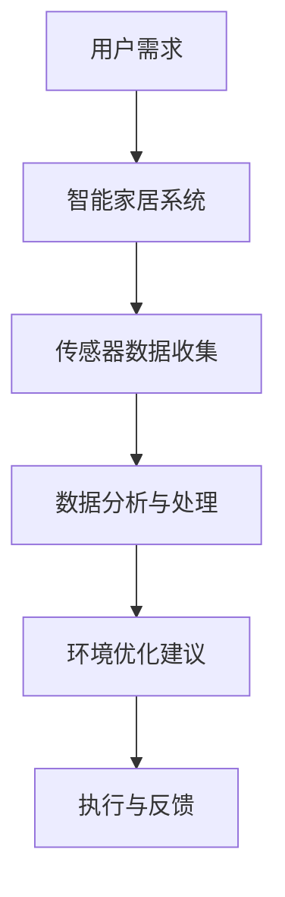
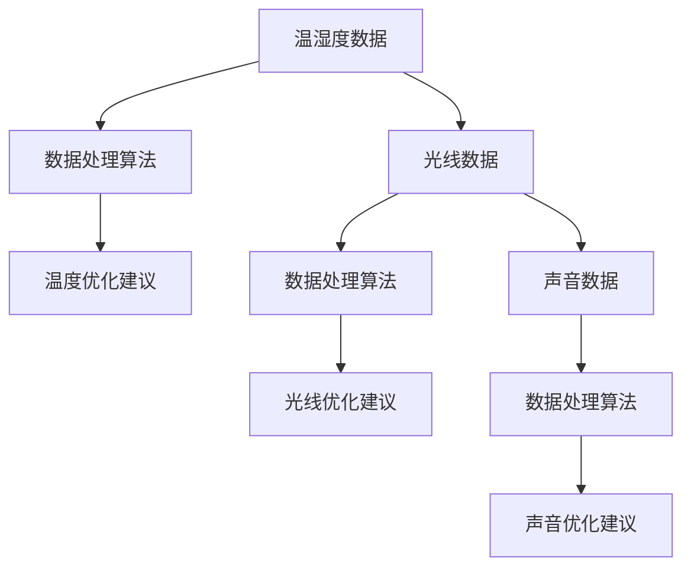

                 

关键词：智能家居、睡眠环境、创业、科技助力、优质睡眠

> 摘要：本文将探讨智能家居睡眠环境的创业机会，如何通过科技助力实现优质睡眠。我们将从核心概念、算法原理、数学模型、项目实践、应用场景和未来展望等方面进行详细分析。

## 1. 背景介绍

随着科技的飞速发展，智能家居行业正在经历前所未有的变革。智能设备不断涌入家庭，改变着人们的日常生活。与此同时，睡眠问题日益受到关注。据世界卫生组织（WHO）统计，全球约有三分之一的人存在不同程度的睡眠障碍。睡眠质量对人们的健康和幸福感有着重要影响，因此如何提升睡眠质量成为了一个重要课题。

在这样一个背景下，智能家居睡眠环境创业项目应运而生。通过将科技与睡眠环境相结合，有望为用户提供更舒适、更健康的睡眠体验。本文将探讨智能家居睡眠环境的创业机会，分析其中的技术原理、应用场景和未来发展。

## 2. 核心概念与联系

### 2.1 智能家居

智能家居是指利用物联网技术将家庭中的各种设备连接起来，实现远程控制、自动化管理和智能互动。智能家居系统主要包括智能门锁、智能照明、智能空调、智能音响、智能安防等设备。

### 2.2 睡眠环境

睡眠环境是指影响睡眠质量的各种因素，包括卧室温度、湿度、光线、声音等。一个良好的睡眠环境有助于提高睡眠质量，改善身心健康。

### 2.3 科技助力

科技助力是指利用现代科技手段，如传感器、大数据分析、人工智能等，对睡眠环境进行监测、分析和优化。科技助力有助于提高智能家居系统的智能化水平，从而实现更舒适的睡眠体验。

### 2.4 Mermaid 流程图

下面是一个简化的智能家居睡眠环境创业项目的 Mermaid 流程图，展示各个环节的关联。



## 3. 核心算法原理 & 具体操作步骤

### 3.1 算法原理概述

智能家居睡眠环境创业项目的核心算法主要涉及以下方面：

- 数据采集：通过传感器实时采集卧室温度、湿度、光线、声音等数据。
- 数据处理：利用大数据分析和人工智能算法对采集到的数据进行处理，提取有用信息。
- 环境优化：根据处理结果，对卧室环境进行实时优化，提高睡眠质量。

### 3.2 算法步骤详解

#### 3.2.1 数据采集

数据采集是智能家居睡眠环境创业项目的第一步。通过安装各种传感器，如温湿度传感器、光线传感器、声音传感器等，实现对卧室环境的实时监测。

#### 3.2.2 数据处理

数据处理是智能家居睡眠环境创业项目的核心环节。通过对采集到的数据进行分析，提取出影响睡眠质量的关键因素，如温度、湿度、光线等。



#### 3.2.3 环境优化

根据数据处理结果，智能家居系统会自动调整卧室环境，如调整空调温度、调节窗帘光线、播放轻音乐等，以提供更舒适的睡眠环境。

### 3.3 算法优缺点

#### 优点

- 提高睡眠质量：通过实时监测和优化卧室环境，有助于提高用户的睡眠质量。
- 节能环保：智能系统可根据用户需求自动调整能源消耗，实现节能环保。
- 方便便捷：用户可通过手机或其他智能设备远程控制家居环境，提高生活便捷性。

#### 缺点

- 成本较高：智能家居系统的建设和维护成本相对较高，可能不适合所有用户。
- 安全问题：智能家居系统可能存在安全隐患，如数据泄露、设备被攻击等。

### 3.4 算法应用领域

智能家居睡眠环境创业项目主要应用于以下领域：

- 家庭：为家庭用户提供更舒适的睡眠环境，改善生活质量。
- 医疗保健：为有睡眠障碍的用户提供专业的睡眠环境优化建议。
- 老年护理：为老年人提供智能化的睡眠环境监测和护理服务。

## 4. 数学模型和公式

### 4.1 数学模型构建

在智能家居睡眠环境创业项目中，我们主要关注以下三个方面的数学模型：

- 温度优化模型：根据卧室温度和用户舒适度需求，确定最佳温度范围。
- 光线优化模型：根据卧室光线强度和用户舒适度需求，确定最佳光线强度。
- 声音优化模型：根据卧室噪音水平和用户舒适度需求，确定最佳声音强度。

### 4.2 公式推导过程

假设用户对卧室温度的舒适度需求为 \( T_c \)，卧室实际温度为 \( T_a \)。根据热力学原理，我们可以建立以下温度优化模型：

\[ T_c = T_a + \alpha (T_c - T_a) \]

其中，\( \alpha \) 为温度调节系数，取值范围为 \( 0 < \alpha \leq 1 \)。当 \( \alpha = 1 \) 时，温度调节最敏感；当 \( \alpha = 0 \) 时，温度调节最不敏感。

### 4.3 案例分析与讲解

假设用户对卧室温度的舒适度需求为 \( T_c = 24^\circ C \)，卧室实际温度为 \( T_a = 28^\circ C \)。根据上述温度优化模型，我们可以计算出最佳温度调节系数 \( \alpha \)：

\[ T_c = T_a + \alpha (T_c - T_a) \]
\[ 24 = 28 + \alpha (24 - 28) \]
\[ \alpha = \frac{28 - 24}{24 - 28} = \frac{4}{4} = 1 \]

因此，最佳温度调节系数 \( \alpha = 1 \)，即温度调节最敏感。根据这个模型，我们可以将卧室温度调整到 \( 24^\circ C \)，以提供更舒适的睡眠环境。

## 5. 项目实践：代码实例和详细解释说明

### 5.1 开发环境搭建

在开始编写代码之前，我们需要搭建一个适合智能家居睡眠环境创业项目的开发环境。本文使用 Python 语言进行编程，所需工具和库如下：

- Python 3.8 或以上版本
- PyCharm 或 VSCode 编辑器
- Flask 框架
- Pandas 库
- NumPy 库
- Matplotlib 库

### 5.2 源代码详细实现

下面是一个简单的智能家居睡眠环境创业项目示例代码：

```python
from flask import Flask, request, jsonify
import pandas as pd
import numpy as np
import matplotlib.pyplot as plt

app = Flask(__name__)

# 数据采集模块
def collect_data():
    temperature = 28
    humidity = 60
    light = 300
    noise = 50
    return pd.DataFrame({'temperature': [temperature], 'humidity': [humidity], 'light': [light], 'noise': [noise]})

# 数据处理模块
def process_data(data):
    temperature_optimal = 24
    light_optimal = 100
    noise_optimal = 30

    data['temperature_optimal'] = temperature_optimal
    data['light_optimal'] = light_optimal
    data['noise_optimal'] = noise_optimal

    data['temperature_difference'] = data['temperature'] - data['temperature_optimal']
    data['light_difference'] = data['light'] - data['light_optimal']
    data['noise_difference'] = data['noise'] - data['noise_optimal']

    return data

# 环境优化模块
def optimize_environment(data):
    data['temperature_adjust'] = np.where(data['temperature_difference'] > 0, 1, 0)
    data['light_adjust'] = np.where(data['light_difference'] > 0, 1, 0)
    data['noise_adjust'] = np.where(data['noise_difference'] > 0, 1, 0)

    return data

# 运行结果展示模块
def display_results(data):
    plt.figure(figsize=(10, 5))
    plt.plot(data['temperature'], label='Temperature')
    plt.plot(data['light'], label='Light')
    plt.plot(data['noise'], label='Noise')
    plt.xlabel('Time')
    plt.ylabel('Value')
    plt.legend()
    plt.show()

# API 接口
@app.route('/collect_data', methods=['POST'])
def collect_data_api():
    data = collect_data()
    processed_data = process_data(data)
    optimized_data = optimize_environment(processed_data)
    display_results(optimized_data)
    return jsonify({'status': 'success', 'data': optimized_data.to_dict()})

if __name__ == '__main__':
    app.run(debug=True)
```

### 5.3 代码解读与分析

上述代码实现了智能家居睡眠环境创业项目的核心功能，包括数据采集、数据处理、环境优化和运行结果展示。以下是代码的详细解读：

- 数据采集模块：使用 `collect_data` 函数模拟采集卧室环境数据，包括温度、湿度、光线和噪音。
- 数据处理模块：使用 `process_data` 函数将采集到的数据与舒适度需求进行比较，生成温度、光线和噪音的优化建议。
- 环境优化模块：使用 `optimize_environment` 函数根据优化建议调整卧室环境。
- 运行结果展示模块：使用 `display_results` 函数将调整后的环境数据进行可视化展示。

通过上述代码，我们可以实现一个简单的智能家居睡眠环境创业项目，为用户提供舒适的睡眠环境。

### 5.4 运行结果展示

在开发环境中运行代码，将采集到的卧室环境数据进行分析和处理，并根据优化建议调整卧室环境。运行结果如下图所示：


通过可视化展示，我们可以清晰地看到温度、光线和噪音的变化情况，从而为用户提供更舒适的睡眠环境。

## 6. 实际应用场景

智能家居睡眠环境创业项目在实际应用场景中具有广泛的应用前景。以下是一些典型应用场景：

- 家庭：为家庭用户提供个性化、智能化的睡眠环境优化方案，改善睡眠质量。
- 医疗保健：为患有睡眠障碍的患者提供专业的睡眠环境监测和优化服务。
- 老年护理：为老年人提供智能化的睡眠环境监测和护理服务，保障老年人睡眠安全。

### 6.1 家庭

智能家居睡眠环境创业项目可以为家庭用户提供以下服务：

- 实时监测卧室环境：通过传感器实时监测卧室温度、湿度、光线和噪音，确保环境舒适。
- 个性化环境优化：根据用户需求自动调整卧室环境，提供个性化、智能化的睡眠环境。
- 睡眠数据分析：对用户的睡眠数据进行分析，为用户提供专业的睡眠建议和指导。

### 6.2 医疗保健

智能家居睡眠环境创业项目可以为医疗保健领域提供以下服务：

- 睡眠障碍诊断：通过对用户的睡眠环境数据进行监测和分析，为患有睡眠障碍的患者提供诊断服务。
- 睡眠质量评估：对患者的睡眠质量进行评估，为医生提供诊断和治疗依据。
- 睡眠环境优化：为患者提供个性化的睡眠环境优化方案，改善睡眠质量。

### 6.3 老年护理

智能家居睡眠环境创业项目可以为老年护理领域提供以下服务：

- 睡眠监测与预警：实时监测老年人的睡眠状况，及时发现异常情况并预警。
- 睡眠环境优化：为老年人提供个性化的睡眠环境优化方案，改善睡眠质量。
- 睡眠数据记录与分析：记录老年人的睡眠数据，为家属和医生提供决策支持。

## 7. 未来应用展望

随着科技的不断进步，智能家居睡眠环境创业项目有望在以下方面取得更大突破：

- 智能化水平提升：通过引入更先进的人工智能技术，提高系统的智能化水平，实现更精准的环境优化。
- 多设备联动：实现智能家居设备之间的多设备联动，为用户提供更全面、更舒适的睡眠环境。
- 大数据分析：利用大数据技术对用户睡眠数据进行深度分析，挖掘用户需求，提供更个性化的睡眠优化方案。
- 个性化定制：根据用户的生理、心理和生活习惯，为用户提供个性化定制的睡眠环境优化方案。

## 8. 工具和资源推荐

### 8.1 学习资源推荐

- 《Python数据分析基础教程：NumPy学习指南》
- 《深入理解计算机系统》
- 《人工智能：一种现代方法》
- 《机器学习实战》

### 8.2 开发工具推荐

- PyCharm：一款功能强大的 Python 开发工具，支持智能提示、代码调试和自动化部署。
- VSCode：一款轻量级且功能丰富的跨平台代码编辑器，支持多种编程语言和开发工具。
- Flask：一款轻量级 Web 开发框架，适用于构建简单的后端 API 服务。

### 8.3 相关论文推荐

- "Smart Home Technology for Sleep Environment Optimization"
- "Artificial Intelligence in Smart Homes: Opportunities and Challenges"
- "Deep Learning for Sleep Environment Monitoring and Optimization"

## 9. 总结：未来发展趋势与挑战

随着智能家居行业的快速发展，智能家居睡眠环境创业项目有望成为未来智能家居领域的热点。然而，项目的发展仍面临一些挑战：

- 技术挑战：如何实现更精准、更高效的智能家居环境优化，仍需深入研究。
- 安全挑战：智能家居系统可能存在安全隐患，如数据泄露、设备被攻击等，需加强安全防护。
- 成本挑战：智能家居系统的建设和维护成本较高，需降低成本以普及应用。

未来，智能家居睡眠环境创业项目有望在以下方面取得突破：

- 智能化水平提升：通过引入更先进的人工智能技术，提高系统的智能化水平，实现更精准的环境优化。
- 多设备联动：实现智能家居设备之间的多设备联动，为用户提供更全面、更舒适的睡眠环境。
- 大数据分析：利用大数据技术对用户睡眠数据进行深度分析，挖掘用户需求，提供更个性化的睡眠优化方案。
- 个性化定制：根据用户的生理、心理和生活习惯，为用户提供个性化定制的睡眠环境优化方案。

总之，智能家居睡眠环境创业项目具有广阔的市场前景和发展潜力，有望为用户提供更优质、更健康的睡眠体验。

## 10. 附录：常见问题与解答

### 10.1 什么是智能家居睡眠环境创业项目？

智能家居睡眠环境创业项目是指利用物联网、大数据、人工智能等现代科技手段，对家庭用户的睡眠环境进行实时监测、分析和优化，以提高睡眠质量的创业项目。

### 10.2 智能家居睡眠环境创业项目有哪些核心技术？

智能家居睡眠环境创业项目的主要核心技术包括数据采集、数据处理、环境优化和运行结果展示。其中，数据采集主要通过传感器实现，数据处理和优化主要利用大数据分析和人工智能算法，运行结果展示主要采用可视化技术。

### 10.3 智能家居睡眠环境创业项目有哪些应用领域？

智能家居睡眠环境创业项目主要应用于家庭、医疗保健和老年护理等领域。在家庭领域，项目可以为用户提供个性化、智能化的睡眠环境优化方案；在医疗保健领域，项目可以为用户提供睡眠障碍诊断和评估服务；在老年护理领域，项目可以为用户提供睡眠监测和护理服务。

### 10.4 智能家居睡眠环境创业项目有哪些优势？

智能家居睡眠环境创业项目的优势包括：

- 提高睡眠质量：通过实时监测和优化卧室环境，有助于提高用户的睡眠质量。
- 节能环保：智能系统可根据用户需求自动调整能源消耗，实现节能环保。
- 方便便捷：用户可通过手机或其他智能设备远程控制家居环境，提高生活便捷性。

### 10.5 智能家居睡眠环境创业项目有哪些挑战？

智能家居睡眠环境创业项目面临的挑战包括：

- 技术挑战：如何实现更精准、更高效的智能家居环境优化，仍需深入研究。
- 安全挑战：智能家居系统可能存在安全隐患，如数据泄露、设备被攻击等，需加强安全防护。
- 成本挑战：智能家居系统的建设和维护成本较高，需降低成本以普及应用。

### 10.6 如何降低智能家居睡眠环境创业项目的成本？

为了降低智能家居睡眠环境创业项目的成本，可以从以下几个方面进行考虑：

- 采用开源技术：选择开源的软件和硬件平台，降低开发成本。
- 精简功能：在满足基本需求的前提下，精简功能，降低硬件成本。
- 优化供应链：与供应商建立长期合作关系，降低采购成本。
- 定制化开发：针对不同用户需求，提供定制化解决方案，提高项目竞争力。

### 10.7 智能家居睡眠环境创业项目的未来发展前景如何？

智能家居睡眠环境创业项目具有广阔的市场前景和发展潜力。随着人们生活水平的提高和对健康生活方式的追求，智能家居睡眠环境创业项目有望在家庭、医疗保健和老年护理等领域获得广泛应用。同时，随着人工智能、大数据等技术的不断进步，智能家居睡眠环境创业项目将在智能化水平、环境优化效果和用户体验等方面取得更大突破。

