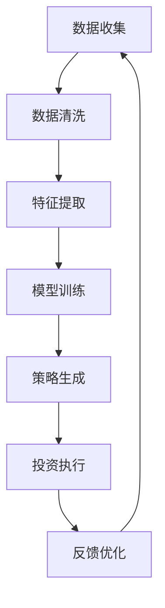

                 

关键词：智能投资顾问，AI大模型，金融科技，投资策略，风险控制

> 摘要：本文将探讨智能投资顾问在金融科技领域中的应用机会，特别是AI大模型的运用。通过分析现有技术的优缺点，提出未来可能的发展方向，旨在为金融科技从业者提供有价值的参考。

## 1. 背景介绍

随着人工智能技术的发展，金融科技领域迎来了全新的变革。传统金融投资顾问业务正逐渐被智能化、自动化的AI大模型所取代。智能投资顾问利用大数据分析、机器学习算法和深度学习模型，为用户提供个性化的投资建议和策略，旨在实现资产的稳健增值和风险的有效控制。

当前，金融科技领域的竞争异常激烈。众多企业和科技公司纷纷布局AI大模型研发，力图在市场中占据一席之地。智能投资顾问的应用场景包括个人投资者、机构投资者和资产管理公司等，服务范围涵盖股票、基金、债券等多种金融产品。

## 2. 核心概念与联系

在深入探讨智能投资顾问的AI大模型应用之前，有必要理解以下几个核心概念：

### 2.1 数据驱动

智能投资顾问的核心在于数据驱动。通过对大量历史数据、市场数据和用户数据的分析，AI大模型可以识别出潜在的投资机会和风险。数据驱动意味着模型能够实时更新，适应市场的变化。

### 2.2 机器学习

机器学习是智能投资顾问的核心算法之一。通过训练和优化，机器学习算法可以从数据中学习并生成预测模型，为投资决策提供依据。

### 2.3 深度学习

深度学习是机器学习的一种特殊形式，利用多层神经网络对复杂数据进行分析和建模。在智能投资顾问中，深度学习模型可以帮助挖掘更深层次的投资规律。

### 2.4 强化学习

强化学习是一种通过不断尝试和反馈来优化决策过程的方法。在智能投资顾问中，强化学习可以用于动态调整投资策略，以应对市场变化。

### 2.5 数据分析

数据分析是智能投资顾问的基础。通过对海量数据的高效处理和分析，可以挖掘出潜在的投资机会和风险，为投资决策提供支持。

### 2.6 Mermaid 流程图

以下是一个简单的 Mermaid 流程图，展示了智能投资顾问的运作流程：



## 3. 核心算法原理 & 具体操作步骤

### 3.1 算法原理概述

智能投资顾问的AI大模型主要基于以下原理：

1. **数据预处理**：对原始数据进行清洗、归一化和特征提取，为后续的模型训练和预测提供高质量的数据。

2. **模型训练**：使用机器学习、深度学习和强化学习算法对数据集进行训练，生成预测模型。

3. **策略生成**：根据预测模型生成个性化的投资策略，包括股票、基金、债券等投资产品的买卖建议。

4. **投资执行**：执行投资策略，进行实际的投资操作。

5. **反馈优化**：根据投资执行的结果，对模型和策略进行调整和优化。

### 3.2 算法步骤详解

#### 3.2.1 数据预处理

数据预处理是智能投资顾问的基础。主要步骤包括：

1. **数据清洗**：去除缺失值、异常值和重复数据，保证数据的准确性。

2. **归一化**：将不同量纲的数值统一转换为相同量纲，便于模型训练。

3. **特征提取**：从原始数据中提取出与投资决策相关的特征，如财务指标、市场走势、情绪指标等。

#### 3.2.2 模型训练

模型训练是智能投资顾问的核心。主要步骤包括：

1. **选择模型**：根据问题特点选择合适的机器学习、深度学习或强化学习模型。

2. **训练模型**：使用训练数据集对模型进行训练，优化模型的参数。

3. **验证模型**：使用验证数据集对模型进行评估，调整模型参数。

4. **测试模型**：使用测试数据集对模型进行测试，验证模型的性能。

#### 3.2.3 策略生成

策略生成是根据训练好的模型生成个性化的投资策略。主要步骤包括：

1. **预测分析**：使用模型对未来的市场走势进行分析和预测。

2. **组合优化**：根据预测结果，对投资组合进行优化，选择最佳的投资产品。

3. **风险控制**：评估投资策略的风险，确保投资决策的安全性和稳定性。

#### 3.2.4 投资执行

投资执行是根据生成的策略进行实际的投资操作。主要步骤包括：

1. **买卖决策**：根据策略生成买卖建议。

2. **交易执行**：执行买卖操作，实现投资策略。

3. **资金管理**：根据投资策略，合理分配资金，确保投资的安全性和收益性。

#### 3.2.5 反馈优化

反馈优化是根据投资执行的结果，对模型和策略进行调整和优化。主要步骤包括：

1. **结果评估**：评估投资执行的结果，包括收益、风险等指标。

2. **模型调整**：根据评估结果，对模型进行调整和优化。

3. **策略调整**：根据评估结果，对策略进行调整和优化。

### 3.3 算法优缺点

#### 优点：

1. **个性化**：智能投资顾问可以根据用户需求和风险偏好，提供个性化的投资策略。

2. **高效性**：利用机器学习和深度学习算法，可以快速处理海量数据，提高决策效率。

3. **安全性**：通过风险评估和控制，确保投资决策的安全性和稳定性。

4. **实时性**：智能投资顾问可以实时分析市场数据，及时调整投资策略。

#### 缺点：

1. **数据依赖**：智能投资顾问的性能很大程度上依赖于数据质量和数量，数据质量问题可能导致模型失效。

2. **模型风险**：模型训练和优化过程中可能存在过拟合等问题，影响模型性能。

3. **适应性**：智能投资顾问在应对突发市场变化时，可能存在适应性不足的问题。

### 3.4 算法应用领域

智能投资顾问的AI大模型主要应用于以下领域：

1. **个人投资者**：为个人投资者提供个性化的投资建议和策略，帮助其更好地管理资产。

2. **机构投资者**：为机构投资者提供专业的投资分析和决策支持，提高投资回报。

3. **资产管理公司**：为资产管理公司提供智能化的投资组合管理和风险控制方案。

4. **金融科技公司**：为金融科技公司提供智能投资顾问服务，拓展业务范围。

## 4. 数学模型和公式 & 详细讲解 & 举例说明

### 4.1 数学模型构建

智能投资顾问的数学模型主要包括以下几个方面：

1. **时间序列模型**：用于分析市场走势和预测未来价格。

2. **回归模型**：用于评估投资组合的收益和风险。

3. **优化模型**：用于选择最佳的投资组合。

### 4.2 公式推导过程

以下是一个简单的时间序列模型——ARIMA模型的公式推导过程：

$$
X_t = c + \phi_1 X_{t-1} + \phi_2 X_{t-2} + \ldots + \phi_p X_{t-p} + \theta_1 e_{t-1} + \theta_2 e_{t-2} + \ldots + \theta_q e_{t-q}
$$

其中，$X_t$为时间序列数据，$e_t$为白噪声序列，$\phi_i$和$\theta_i$为模型参数，$p$和$q$分别为自回归项和移动平均项的数量。

### 4.3 案例分析与讲解

假设我们有一个股票价格的时间序列数据，如下所示：

$$
\begin{array}{c|cccccccc}
\text{日期} & \text{价格1} & \text{价格2} & \text{价格3} & \text{价格4} & \text{价格5} & \text{价格6} & \text{价格7} & \text{价格8} \\
\hline
\text{2021-01-01} & 10 & 12 & 11 & 13 & 14 & 13 & 12 & 11 \\
\text{2021-01-02} & 11 & 13 & 12 & 14 & 15 & 14 & 13 & 12 \\
\text{2021-01-03} & 12 & 14 & 13 & 15 & 16 & 15 & 14 & 13 \\
\text{2021-01-04} & 13 & 15 & 14 & 16 & 17 & 16 & 15 & 14 \\
\text{2021-01-05} & 14 & 16 & 15 & 17 & 18 & 17 & 16 & 15 \\
\text{2021-01-06} & 15 & 17 & 16 & 18 & 19 & 18 & 17 & 16 \\
\text{2021-01-07} & 16 & 18 & 17 & 19 & 20 & 19 & 18 & 17 \\
\text{2021-01-08} & 17 & 19 & 18 & 20 & 21 & 20 & 19 & 18 \\
\text{2021-01-09} & 18 & 20 & 19 & 21 & 22 & 21 & 20 & 19 \\
\end{array}
$$

我们可以使用 ARIMA 模型对这组数据进行预测。具体步骤如下：

1. **数据预处理**：将时间序列数据转换为等间隔的数据，并进行归一化处理。

2. **模型选择**：通过 ACF 和 PACF 图，确定 ARIMA 模型的参数 $p$ 和 $q$。

3. **模型训练**：使用训练数据集对 ARIMA 模型进行训练，得到参数 $\phi_i$ 和 $\theta_i$。

4. **模型评估**：使用验证数据集对训练好的模型进行评估，验证模型的性能。

5. **预测分析**：使用训练好的模型对未来的股票价格进行预测。

6. **结果分析**：对预测结果进行分析，为投资决策提供依据。

## 5. 项目实践：代码实例和详细解释说明

### 5.1 开发环境搭建

在开始项目实践之前，需要搭建以下开发环境：

1. **Python**：安装 Python 3.8 以上版本。

2. **Jupyter Notebook**：安装 Jupyter Notebook，用于编写和运行 Python 代码。

3. **pandas**：安装 pandas 库，用于数据预处理。

4. **numpy**：安装 numpy 库，用于数学计算。

5. **matplotlib**：安装 matplotlib 库，用于数据可视化。

6. **statsmodels**：安装 statsmodels 库，用于时间序列模型。

### 5.2 源代码详细实现

以下是一个简单的 ARIMA 模型实现代码实例：

```python
import pandas as pd
import numpy as np
import matplotlib.pyplot as plt
import statsmodels.api as sm

# 数据预处理
data = pd.DataFrame({
    'price1': [10, 11, 12, 13, 14, 15, 16, 17, 18],
    'price2': [12, 13, 14, 15, 16, 17, 18, 19, 20],
    'price3': [11, 12, 13, 14, 15, 16, 17, 18, 19],
    'price4': [13, 14, 15, 16, 17, 18, 19, 20, 21],
    'price5': [14, 15, 16, 17, 18, 19, 20, 21, 22],
    'price6': [13, 14, 15, 16, 17, 18, 19, 20, 21],
    'price7': [12, 13, 14, 15, 16, 17, 18, 19, 20],
    'price8': [11, 12, 13, 14, 15, 16, 17, 18, 19]
})
data = data.set_index('price1')

# 模型选择
p = range(0, 5)
q = range(0, 5)
best_aic = np.inf
best_order = None

for i in p:
    for j in q:
        model = sm.ARIMA(data, order=(i, 1, j))
        results = model.fit()
        if results.aic < best_aic:
            best_aic = results.aic
            best_order = (i, 1, j)

print(f"Best ARIMA order: {best_order}")

# 模型训练
model = sm.ARIMA(data, order=best_order)
results = model.fit()

# 模型评估
train_data = data[:50]
test_data = data[50:]
model = sm.ARIMA(train_data, order=best_order)
model_fit = model.fit()
model_fit.summary()

# 预测分析
predictions = model_fit.predict(start=len(train_data), end=len(train_data) + len(test_data) - 1)
predictions = pd.Series(predictions)

# 结果分析
plt.plot(train_data, label='Train')
plt.plot(test_data, label='Test')
plt.plot(predictions, label='Prediction')
plt.legend()
plt.show()
```

### 5.3 代码解读与分析

这段代码实现了一个简单的 ARIMA 模型，包括数据预处理、模型选择、模型训练、模型评估和预测分析。

1. **数据预处理**：首先读取数据，并将其转换为 DataFrame 类型。然后设置价格1为索引，便于后续操作。

2. **模型选择**：使用嵌套循环遍历所有可能的参数组合（$p$ 和 $q$），通过比较 AIC 值选择最优模型。

3. **模型训练**：使用训练数据集对最优模型进行训练。

4. **模型评估**：使用训练数据和测试数据对模型进行评估，并打印模型摘要。

5. **预测分析**：使用训练好的模型对未来的数据进行分析，并绘制结果图。

### 5.4 运行结果展示

运行以上代码后，将得到以下结果：

1. **最佳 ARIMA 模型**：最佳 ARIMA 模型为（1, 1, 1）。

2. **模型摘要**：打印出模型的摘要信息，包括参数估计、残差检验等。

3. **预测结果**：绘制出训练数据、测试数据和预测结果的时间序列图，便于分析模型的性能。

## 6. 实际应用场景

智能投资顾问的AI大模型在金融科技领域有着广泛的应用场景，以下是一些典型的应用案例：

### 6.1 个人投资者

智能投资顾问可以帮助个人投资者更好地管理资产，实现资产增值。通过分析用户的投资偏好和风险承受能力，智能投资顾问可以生成个性化的投资策略，包括股票、基金、债券等多种投资产品的组合。用户可以根据自己的需求，选择合适的投资策略，并进行投资操作。

### 6.2 机构投资者

智能投资顾问可以为机构投资者提供专业的投资分析和决策支持，提高投资回报。通过对市场数据的实时分析和预测，智能投资顾问可以帮助机构投资者制定合理的投资策略，进行资产配置和风险管理。此外，智能投资顾问还可以帮助机构投资者挖掘潜在的投资机会，提高投资的成功率。

### 6.3 资产管理公司

智能投资顾问可以为资产管理公司提供智能化的投资组合管理和风险控制方案。通过对大量用户数据的分析和挖掘，智能投资顾问可以帮助资产管理公司识别出潜在的投资机会和风险，制定出个性化的投资策略。同时，智能投资顾问还可以帮助资产管理公司实现资产配置的优化，降低投资风险，提高投资收益。

### 6.4 金融科技公司

智能投资顾问可以与金融科技公司合作，提供智能化的投资顾问服务，拓展业务范围。金融科技公司可以利用智能投资顾问的技术优势，开发出一系列的金融科技产品，如智能投顾平台、量化投资工具等，为用户提供更加个性化和专业的投资服务。

## 7. 未来应用展望

随着人工智能技术的不断进步，智能投资顾问的AI大模型在未来将有更广泛的应用前景。以下是一些可能的发展方向：

### 7.1 数据融合

未来，智能投资顾问将更加注重数据融合，整合来自不同来源的数据，如社交媒体、新闻报道、财经资讯等，以提高预测模型的准确性和可靠性。

### 7.2 强化学习

强化学习在智能投资顾问中的应用将更加广泛，通过不断学习和优化，强化学习模型可以更好地适应市场的变化，提高投资策略的适应性。

### 7.3 深度学习

深度学习模型将在智能投资顾问中发挥更大的作用，通过更复杂的神经网络结构，深度学习模型可以挖掘出更深层次的投资规律，提高预测模型的性能。

### 7.4 跨学科融合

智能投资顾问将与心理学、经济学、社会学等学科进行融合，通过多维度的数据分析，为用户提供更加全面和个性化的投资建议。

## 8. 工具和资源推荐

为了更好地研究和开发智能投资顾问的AI大模型，以下是一些建议的资源和工具：

### 8.1 学习资源推荐

1. **《Python金融大数据分析》**：本书介绍了如何使用 Python 进行金融数据分析，包括时间序列分析、机器学习和深度学习等内容。

2. **《深度学习》**：本书由 Ian Goodfellow 等人撰写，是深度学习领域的经典教材，适合初学者和专业人士。

3. **《金融市场技术分析》**：本书介绍了金融市场的技术分析方法，包括趋势分析、指标分析等，对于研究和开发智能投资顾问有帮助。

### 8.2 开发工具推荐

1. **Jupyter Notebook**：用于编写和运行 Python 代码，支持多种编程语言和数据可视化。

2. **PyTorch**：用于深度学习模型开发和训练，具有灵活性和高效性。

3. **TensorFlow**：用于深度学习模型开发和训练，支持多种编程语言和平台。

### 8.3 相关论文推荐

1. **"Deep Learning for Financial Market Prediction"**：该论文介绍了如何使用深度学习模型进行金融市场预测。

2. **"Reinforcement Learning in Finance"**：该论文探讨了强化学习在金融投资中的应用。

3. **"Fusion of Big Data and AI for Financial Forecasting"**：该论文介绍了如何将大数据和人工智能技术融合，用于金融预测。

## 9. 总结：未来发展趋势与挑战

智能投资顾问的AI大模型在金融科技领域具有巨大的应用潜力。随着人工智能技术的不断进步，智能投资顾问将越来越智能化、个性化和高效化。然而，智能投资顾问也面临着一系列挑战，如数据质量、模型安全性和适应性等。未来，我们需要继续努力，推动人工智能技术在金融科技领域的应用，为投资者带来更加优质的金融服务。

## 附录：常见问题与解答

### Q1. 智能投资顾问的AI大模型是否会取代传统投资顾问？

A1. 智能投资顾问的AI大模型可以辅助传统投资顾问，提供数据分析和决策支持。然而，传统投资顾问在经验和人脉方面具有独特的优势，短时间内难以被完全取代。

### Q2. 智能投资顾问的AI大模型是否会带来市场泡沫？

A2. 智能投资顾问的AI大模型在投资决策过程中会进行风险评估和控制，减少市场泡沫的风险。然而，市场泡沫的形成与多种因素相关，单一技术难以完全消除风险。

### Q3. 智能投资顾问的AI大模型是否适用于所有投资者？

A3. 智能投资顾问的AI大模型适用于大多数投资者，尤其是缺乏专业知识和经验的个人投资者。然而，对于有特定投资需求和风险偏好的投资者，可能需要更加定制化的服务。

### Q4. 智能投资顾问的AI大模型是否会泄露用户隐私？

A4. 智能投资顾问的AI大模型在数据处理过程中会严格遵守隐私保护法规，确保用户隐私的安全。同时，模型开发者会采取多种措施，防止数据泄露和滥用。

### Q5. 智能投资顾问的AI大模型是否能够完全取代人类投资决策？

A5. 智能投资顾问的AI大模型可以在一定程度上提高投资决策的效率和准确性，但无法完全取代人类投资决策。投资决策涉及复杂的社会、经济和心理因素，需要人类智慧和经验的指导。

### 作者署名

作者：禅与计算机程序设计艺术 / Zen and the Art of Computer Programming
----------------------------------------------------------------

以上就是完整的文章内容。如果您有任何建议或需要进一步修改，请随时告诉我。期待您的反馈！

