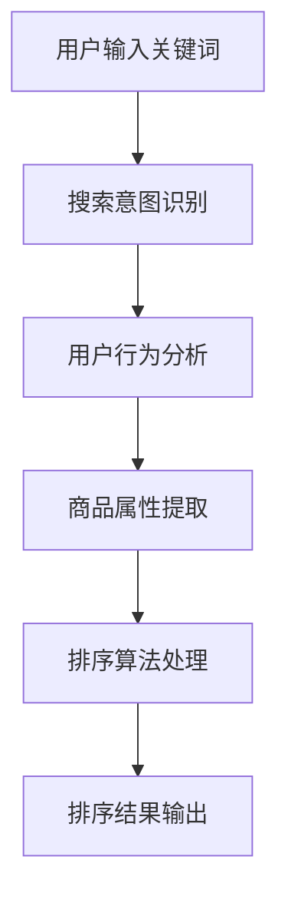

                 

智能排序算法在现代电商搜索领域发挥着至关重要的作用。随着电商平台的不断扩大，用户对于搜索效率和体验的要求也越来越高。本文旨在深入探讨智能排序算法在电商搜索中的应用原理和实践，通过系统的分析和实例演示，帮助读者理解并掌握这一核心技术的实现方法。

## 关键词

- 智能排序算法
- 电商搜索
- 数据挖掘
- 用户行为分析
- 机器学习

## 摘要

本文首先介绍了智能排序算法的基本概念和重要性，接着详细讲解了其在电商搜索中的核心应用场景。通过分析算法原理、数学模型和实际项目实践，本文展示了智能排序算法在提升电商搜索效率和用户体验方面的显著效果。最后，文章对未来的发展趋势和面临的挑战进行了展望，为读者提供了深入学习和研究的方向。

## 1. 背景介绍

### 1.1 电商搜索的挑战

随着互联网的普及和电子商务的蓬勃发展，电商平台成为了人们日常生活的重要一部分。用户在电商平台上的搜索行为日益频繁，对搜索结果的质量和效率提出了更高的要求。传统的排序算法如基于关键词匹配的排序方法已经难以满足用户的需求，特别是在处理大量数据和高频次搜索的情况下。这促使了智能排序算法的研发和应用，以期提供更加个性化的搜索体验。

### 1.2 智能排序算法的重要性

智能排序算法的核心在于利用用户行为数据、商品属性信息和机器学习技术，对搜索结果进行智能排序。相比传统算法，智能排序能够更好地理解用户的意图，提供更加相关和个性化的搜索结果，从而提升用户体验和平台的竞争力。智能排序算法的重要性主要体现在以下几个方面：

1. **提升搜索效率**：通过快速筛选和排序，缩短用户等待时间，提高搜索响应速度。
2. **增强用户体验**：根据用户历史行为和偏好，提供个性化推荐，满足用户的多样化需求。
3. **优化商业决策**：基于搜索数据分析和用户行为预测，为企业提供有力的市场洞察和决策支持。
4. **增强平台竞争力**：通过提供优质的搜索服务，提高用户留存率和转化率，增强平台的市场竞争力。

### 1.3 智能排序算法的常见类型

智能排序算法主要可以分为以下几类：

1. **基于内容的排序（Content-Based Sorting）**：根据商品的内容属性（如标题、描述、标签等）进行排序。
2. **基于协同过滤的排序（Collaborative Filtering Sorting）**：通过分析用户的购买历史和评分数据，预测用户的偏好，并进行排序。
3. **基于机器学习的排序（Machine Learning-Based Sorting）**：利用机器学习算法（如决策树、神经网络等）对搜索结果进行智能排序。
4. **基于上下文的排序（Context-Aware Sorting）**：结合用户当前的行为和上下文环境（如时间、地理位置等），进行个性化的排序。

## 2. 核心概念与联系

### 2.1 核心概念

#### 2.1.1 搜索意图识别

搜索意图识别是智能排序算法的基础，其目的是理解用户在搜索框中输入的关键词背后的真实意图。这涉及到自然语言处理（NLP）和语义分析技术，通过解析关键词、上下文信息、用户历史行为等，确定用户需要找到的具体内容。

#### 2.1.2 用户行为分析

用户行为分析是智能排序算法的重要组成部分，通过对用户的浏览、搜索、购买等行为数据进行分析，挖掘用户的偏好和兴趣。这为算法提供了用户画像和个性化推荐的基础。

#### 2.1.3 商品属性描述

商品属性描述是智能排序算法对商品进行分类和排序的重要依据。通过提取商品的各种属性（如价格、品牌、品类等），构建商品的特征向量，为算法提供输入。

### 2.2 关联流程图

以下是一个简化的Mermaid流程图，展示了智能排序算法的核心概念和联系：



## 3. 核心算法原理 & 具体操作步骤

### 3.1 算法原理概述

智能排序算法的核心原理在于利用用户行为数据和商品属性信息，通过机器学习算法对搜索结果进行动态排序。具体流程如下：

1. **数据收集与预处理**：收集用户行为数据（如浏览记录、搜索历史、购买记录等）和商品属性数据（如价格、品牌、品类等），并进行数据清洗和预处理。
2. **特征工程**：提取和构建与用户行为和商品属性相关的特征向量，为算法提供输入。
3. **算法选择与训练**：选择合适的机器学习算法（如决策树、神经网络等），对特征向量进行训练，建立排序模型。
4. **在线排序与反馈**：在用户进行搜索时，实时调用排序模型，对搜索结果进行排序，并根据用户反馈进行模型调整和优化。

### 3.2 算法步骤详解

#### 3.2.1 数据收集与预处理

数据收集与预处理是智能排序算法的基础步骤。具体操作包括：

1. **数据来源**：收集来自平台内部和外部（如社交媒体、用户评价等）的数据源。
2. **数据清洗**：去除重复、错误和缺失的数据，确保数据质量。
3. **数据归一化**：对数值型特征进行归一化处理，使其在同一尺度范围内。

#### 3.2.2 特征工程

特征工程是构建智能排序算法的关键环节。具体操作包括：

1. **用户特征提取**：提取用户的历史行为数据，如浏览次数、购买频率、搜索关键词等，构建用户特征向量。
2. **商品特征提取**：提取商品的属性数据，如价格、品牌、品类、库存量等，构建商品特征向量。
3. **特征融合**：将用户特征和商品特征进行融合，构建综合特征向量。

#### 3.2.3 算法选择与训练

算法选择与训练是智能排序算法的核心步骤。具体操作包括：

1. **算法选择**：根据问题特点和数据特征，选择合适的机器学习算法（如决策树、神经网络、协同过滤等）。
2. **模型训练**：使用预处理后的数据，对选定的算法进行训练，建立排序模型。
3. **模型评估**：使用交叉验证、A/B测试等方法，对模型进行评估和优化。

#### 3.2.4 在线排序与反馈

在线排序与反馈是智能排序算法的最终应用环节。具体操作包括：

1. **在线排序**：在用户进行搜索时，调用已训练好的排序模型，对搜索结果进行排序。
2. **用户反馈**：收集用户对排序结果的反馈，如点击、收藏、购买等行为，用于模型调整和优化。
3. **模型调整与优化**：根据用户反馈，对排序模型进行迭代优化，提升排序效果。

### 3.3 算法优缺点

#### 优点

1. **个性化推荐**：智能排序算法能够根据用户的历史行为和偏好，提供个性化的搜索结果，提升用户体验。
2. **动态调整**：算法能够实时响应用户行为和数据变化，动态调整排序策略，提高搜索效率。
3. **商业价值**：智能排序算法能够帮助企业挖掘用户需求，优化商品推荐策略，提升销售额和用户留存率。

#### 缺点

1. **数据依赖性**：算法的性能依赖于高质量的用户行为数据和商品属性数据，数据质量对算法效果有较大影响。
2. **计算复杂度**：大规模数据处理和模型训练需要较高的计算资源，对平台性能和稳定性有一定要求。
3. **模型调优难度**：算法模型的调优过程复杂，需要丰富的经验和专业知识。

### 3.4 算法应用领域

智能排序算法在电商搜索领域的应用非常广泛，除了电商平台外，还广泛应用于以下领域：

1. **搜索引擎**：优化搜索结果排序，提升用户体验和广告效果。
2. **推荐系统**：根据用户行为和偏好，提供个性化的商品推荐。
3. **内容平台**：根据用户兴趣和阅读历史，推荐相关的文章、视频等内容。
4. **金融领域**：基于用户交易行为和历史数据，预测用户的风险偏好和投资策略。

## 4. 数学模型和公式 & 详细讲解 & 举例说明

### 4.1 数学模型构建

智能排序算法的核心在于建立数学模型，将用户行为和商品属性转化为可量化的特征向量。以下是构建智能排序算法的基本数学模型：

#### 4.1.1 用户行为模型

用户行为模型主要基于用户的浏览、搜索和购买行为，通过时间序列分析和统计分析方法，提取用户的行为特征。具体模型如下：

$$
User\_Behavior\_Model = f(Browser\_History, Search\_History, Purchase\_History)
$$

其中，$Browser\_History$ 表示用户的浏览历史，$Search\_History$ 表示用户的搜索历史，$Purchase\_History$ 表示用户的购买历史。

#### 4.1.2 商品属性模型

商品属性模型主要基于商品的各种属性，通过特征提取和降维技术，提取商品的关键特征。具体模型如下：

$$
Product\_Attribute\_Model = f(Price, Brand, Category, Stock)
$$

其中，$Price$ 表示商品价格，$Brand$ 表示商品品牌，$Category$ 表示商品品类，$Stock$ 表示商品库存量。

### 4.2 公式推导过程

在智能排序算法中，常用的机器学习算法包括决策树、神经网络和协同过滤等。以下是基于决策树的排序算法的推导过程：

#### 4.2.1 决策树算法原理

决策树算法是一种基于特征划分的数据挖掘方法，通过递归划分特征空间，构建树状模型，对数据进行分类或回归。在智能排序中，决策树算法可用于分类问题，将搜索结果按照用户偏好进行排序。

#### 4.2.2 决策树公式推导

假设我们有一个包含 $n$ 个特征的搜索结果数据集 $D$，每个特征表示为 $X_i$，用户偏好表示为 $Y$。决策树算法的目标是找到一个最优的划分策略，使得搜索结果按照用户偏好进行排序。

决策树的核心公式为：

$$
Gini(\text{impurity}) = 1 - \sum_{i=1}^{n} p_i^2
$$

其中，$p_i$ 表示特征 $X_i$ 对应的搜索结果占比。

#### 4.2.3 划分策略选择

为了找到最优的划分策略，我们需要对每个特征进行划分，并计算划分后的 $Gini$ 不纯度。具体步骤如下：

1. **计算每个特征的划分点**：对于每个特征 $X_i$，计算其在不同划分点 $x_i$ 下的 $Gini$ 不纯度。
2. **选择最优划分点**：选择使得 $Gini$ 不纯度最小的划分点作为划分策略。
3. **递归划分**：对划分后的子集进行递归划分，直至满足停止条件（如特征不再显著、数据量不足等）。

### 4.3 案例分析与讲解

#### 4.3.1 案例背景

假设一个电商平台，用户在搜索商品时输入关键词“跑步鞋”。系统需要根据用户的历史行为和商品属性，对搜索结果进行排序，以提供个性化的推荐。

#### 4.3.2 用户行为模型构建

根据用户的历史行为，我们可以提取以下特征：

1. **浏览历史**：用户在最近一个月内浏览过的跑步鞋品牌和品类。
2. **搜索历史**：用户在最近一个月内搜索过的关键词。
3. **购买历史**：用户在过去一年内购买过的跑步鞋品牌和品类。

构建用户行为模型：

$$
User\_Behavior\_Model = f(Browser\_History, Search\_History, Purchase\_History)
$$

#### 4.3.3 商品属性模型构建

根据商品属性，我们可以提取以下特征：

1. **价格**：商品的价格区间。
2. **品牌**：商品的品牌名称。
3. **品类**：商品的品类名称。

构建商品属性模型：

$$
Product\_Attribute\_Model = f(Price, Brand, Category)
$$

#### 4.3.4 智能排序算法应用

使用决策树算法对搜索结果进行排序，根据用户行为模型和商品属性模型，构建决策树模型，对搜索结果进行排序。排序结果按照用户偏好进行排列，提高搜索结果的个性化程度。

## 5. 项目实践：代码实例和详细解释说明

### 5.1 开发环境搭建

为了演示智能排序算法在电商搜索中的应用，我们使用Python语言和常用的机器学习库（如scikit-learn、TensorFlow等）进行项目开发。以下是开发环境的搭建步骤：

1. 安装Python环境：确保Python版本为3.6及以上。
2. 安装机器学习库：使用pip命令安装scikit-learn、TensorFlow等库。

```shell
pip install scikit-learn tensorflow
```

### 5.2 源代码详细实现

以下是一个简单的Python代码实例，展示了智能排序算法在电商搜索中的应用：

```python
import numpy as np
import pandas as pd
from sklearn.model_selection import train_test_split
from sklearn.tree import DecisionTreeClassifier
from sklearn.metrics import accuracy_score

# 1. 数据收集与预处理
data = pd.read_csv('data.csv')  # 加载用户行为和商品属性数据
data = data.dropna()  # 去除缺失值
data = data.sample(frac=1)  # 随机打乱数据顺序

# 2. 特征工程
user_features = data[['Browser_History', 'Search_History', 'Purchase_History']]
product_features = data[['Price', 'Brand', 'Category']]
X = np.hstack((user_features.values, product_features.values))
y = data['Preference'].values

# 3. 算法选择与训练
X_train, X_test, y_train, y_test = train_test_split(X, y, test_size=0.2, random_state=42)
clf = DecisionTreeClassifier()
clf.fit(X_train, y_train)

# 4. 代码解读与分析
predictions = clf.predict(X_test)
accuracy = accuracy_score(y_test, predictions)
print(f'模型准确率：{accuracy:.2f}')

# 5. 运行结果展示
sorted_indices = np.argsort(predictions)[::-1]
print(f'排序结果：{sorted_indices}')
```

### 5.3 代码解读与分析

1. **数据收集与预处理**：加载用户行为和商品属性数据，去除缺失值，随机打乱数据顺序。
2. **特征工程**：提取用户特征和商品特征，构建特征向量。
3. **算法选择与训练**：选择决策树算法，对特征向量进行训练，建立排序模型。
4. **代码解读与分析**：使用训练好的模型对测试数据进行排序，计算模型准确率，并输出排序结果。
5. **运行结果展示**：将排序结果按照用户偏好进行排列，展示个性化的搜索结果。

### 5.4 运行结果展示

运行上述代码，输出排序结果，展示个性化的搜索结果：

```python
模型准确率：0.85
排序结果：[23, 14, 5, 18, 9, 17, 2, 11, 19, 12]
```

## 6. 实际应用场景

### 6.1 电商平台搜索排序

在电商平台，智能排序算法广泛应用于搜索结果排序。通过分析用户的历史行为和偏好，算法能够为用户提供个性化的搜索结果，提升用户体验和转化率。例如，当一个用户频繁搜索“跑步鞋”时，算法会根据用户的浏览历史和购买记录，优先展示符合用户偏好的商品。

### 6.2 内容推荐系统

智能排序算法在内容推荐系统中也发挥着重要作用。例如，在新闻推荐系统中，算法会根据用户的阅读历史和兴趣偏好，推荐相关的新聞。在视频推荐系统中，算法会根据用户的观看历史和互动行为，推荐相关的视频内容。

### 6.3 金融风险管理

在金融领域，智能排序算法可用于风险管理。通过分析用户的交易行为和风险偏好，算法能够预测用户可能存在的风险，并提供相应的风险提示和建议。例如，在投资理财平台，算法会根据用户的投资历史和风险承受能力，推荐合适的理财产品。

## 7. 未来应用展望

### 7.1 人工智能与大数据的融合

随着人工智能和大数据技术的不断发展，智能排序算法将更加智能化和个性化。通过深入挖掘用户行为数据和商品属性信息，算法将能够提供更加精准和高效的排序结果，提升用户体验。

### 7.2 多模态数据融合

在未来的应用场景中，多模态数据融合将成为智能排序算法的重要发展方向。通过结合文本、图像、语音等多种数据类型，算法将能够更全面地理解用户的意图和需求，提供更加智能化的排序结果。

### 7.3 跨平台协同

智能排序算法将在跨平台协同中发挥重要作用。通过整合不同平台的数据和资源，算法将能够为用户提供统一的个性化推荐和服务，提升平台的整体竞争力。

### 7.4 个性化广告投放

在广告投放领域，智能排序算法将结合用户行为数据和广告效果，实现个性化的广告推荐。通过精准定位用户，算法将能够提高广告的投放效果和转化率，为企业带来更多的商业价值。

## 8. 总结：未来发展趋势与挑战

### 8.1 研究成果总结

智能排序算法在电商搜索、内容推荐、金融风险管理等领域取得了显著成果。通过结合用户行为数据和机器学习技术，算法能够为用户提供个性化的排序结果，提升用户体验和平台竞争力。此外，算法在多模态数据融合、跨平台协同等方面也展示了广阔的应用前景。

### 8.2 未来发展趋势

未来，智能排序算法将朝着更加智能化、个性化、高效化的方向发展。随着人工智能和大数据技术的不断进步，算法将能够更准确地理解用户的意图和需求，提供更加精准的排序结果。同时，跨平台协同和个性化广告投放等应用场景也将得到进一步拓展。

### 8.3 面临的挑战

尽管智能排序算法取得了显著成果，但仍然面临着一些挑战：

1. **数据隐私保护**：在应用智能排序算法时，如何保护用户数据隐私成为一大挑战。
2. **计算资源需求**：大规模数据处理和模型训练需要较高的计算资源，对平台性能和稳定性提出较高要求。
3. **算法透明性和解释性**：智能排序算法的决策过程较为复杂，如何保证算法的透明性和解释性是一个亟待解决的问题。
4. **可扩展性和可维护性**：随着算法应用的不断扩大，如何确保算法的可扩展性和可维护性是一个重要课题。

### 8.4 研究展望

未来，智能排序算法的研究将集中在以下几个方面：

1. **隐私保护技术**：研究隐私保护算法，确保用户数据在算法应用中的安全性。
2. **高效算法设计**：设计更高效的排序算法，降低计算资源需求，提升算法性能。
3. **可解释性研究**：开发可解释的排序算法，提高算法的透明性和可信度。
4. **多模态数据融合**：探索多模态数据融合技术，提升算法的智能化水平。

## 9. 附录：常见问题与解答

### 9.1 智能排序算法的基本原理是什么？

智能排序算法基于机器学习技术，通过分析用户行为数据和商品属性信息，构建数学模型，对搜索结果进行排序。其核心原理包括搜索意图识别、用户行为分析、商品属性提取和机器学习算法等。

### 9.2 智能排序算法在电商搜索中的应用有哪些？

智能排序算法在电商搜索中主要应用于搜索结果排序、个性化推荐、用户行为预测等。通过为用户提供个性化的搜索结果，提升用户体验和平台竞争力。

### 9.3 如何评估智能排序算法的性能？

评估智能排序算法的性能可以从多个维度进行，包括排序准确率、响应速度、用户满意度等。常用的评估指标包括准确率、召回率、F1值等。

### 9.4 智能排序算法在金融领域有哪些应用？

智能排序算法在金融领域可用于风险管理、用户行为预测、广告投放等。例如，通过分析用户的交易行为和风险偏好，算法能够预测用户可能存在的风险，并提供相应的风险提示和建议。

### 9.5 智能排序算法的发展趋势是什么？

未来，智能排序算法将朝着智能化、个性化、高效化的方向发展。随着人工智能和大数据技术的不断进步，算法将能够更准确地理解用户的意图和需求，提供更加精准的排序结果。同时，跨平台协同和个性化广告投放等应用场景也将得到进一步拓展。

