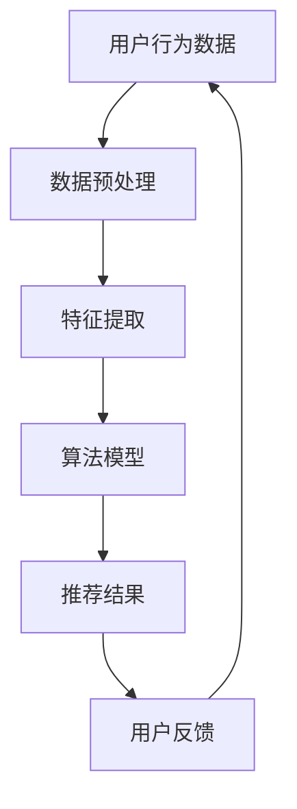

                 

关键词：智能推荐系统，人工智能，用户满意度，算法，用户行为分析，机器学习，大数据分析，推荐引擎，个性化体验。

> 摘要：本文深入探讨了智能推荐系统在提升用户满意度方面的作用。通过介绍推荐系统的核心概念、算法原理、数学模型及其在项目实践中的应用，我们揭示了AI技术在现代互联网服务中的重要地位，并展望了未来的发展趋势与挑战。

## 1. 背景介绍

在互联网时代，信息爆炸已成为不争的事实。用户每天面临海量的数据和信息，如何在众多的选择中找到自己感兴趣的内容成为一大难题。这时，智能推荐系统应运而生，成为提高用户满意度和提升用户体验的关键技术。推荐系统通过分析用户的历史行为、兴趣偏好和社交网络等数据，为用户提供个性化的内容推荐，从而帮助用户更高效地发现感兴趣的信息和服务。

智能推荐系统的发展可以追溯到20世纪90年代，最早的推荐系统主要是基于内容相似度匹配的方法。随着互联网的普及和数据量的增长，推荐系统逐渐引入了机器学习和数据挖掘技术，使得推荐算法更加智能和高效。如今，智能推荐系统已经成为电商平台、视频网站、新闻资讯平台等互联网服务的重要组成部分。

## 2. 核心概念与联系

### 2.1 核心概念

#### 用户行为分析

用户行为分析是推荐系统的核心组成部分，通过对用户的浏览、搜索、点击、购买等行为数据进行分析，提取出用户兴趣模型和偏好特征。

#### 历史数据

推荐系统依赖于大量的历史数据，这些数据包括用户行为数据、商品信息、评论数据等。历史数据的质量和丰富程度直接影响推荐系统的效果。

#### 推荐算法

推荐算法是推荐系统的核心，根据不同的算法模型，推荐算法可以分为基于协同过滤、基于内容匹配、基于深度学习等多种类型。

#### 评价指标

推荐系统的效果可以通过多种评价指标进行评估，如准确率、召回率、覆盖率、用户满意度等。

### 2.2 推荐系统架构

下面是一个简化的推荐系统架构图：



在推荐系统中，用户行为数据经过预处理和特征提取后，输入到算法模型中生成推荐结果，用户对推荐结果进行反馈，这些反馈数据又回传到系统，用于优化推荐算法。

## 3. 核心算法原理 & 具体操作步骤

### 3.1 算法原理概述

推荐算法主要分为以下几类：

#### 基于协同过滤

协同过滤是最早的推荐算法之一，分为基于用户和基于物品的协同过滤。基于用户协同过滤通过计算用户之间的相似度，为用户推荐与他们相似的其他用户的偏好；基于物品协同过滤则通过计算物品之间的相似度，为用户推荐与他们的兴趣相似的物品。

#### 基于内容匹配

基于内容匹配通过分析用户对物品的兴趣点，将用户和物品进行内容特征提取，然后计算它们之间的相似度，从而进行推荐。

#### 基于深度学习

基于深度学习的推荐算法利用深度神经网络模型，对用户行为数据、物品特征等多维信息进行建模，生成推荐结果。

### 3.2 算法步骤详解

以基于协同过滤的推荐算法为例，其基本步骤如下：

1. **用户行为数据收集**：收集用户的历史行为数据，如浏览记录、搜索关键词、购买记录等。

2. **数据预处理**：对收集到的用户行为数据进行清洗、去重和转换，将数据转换为适合算法处理的格式。

3. **特征提取**：提取用户和物品的特征，如用户的行为特征、兴趣标签、物品的属性等。

4. **相似度计算**：计算用户之间的相似度或物品之间的相似度，常用的相似度计算方法有余弦相似度、皮尔逊相关系数等。

5. **推荐生成**：根据相似度计算结果，为用户生成推荐列表。

6. **用户反馈**：用户对推荐结果进行评价，这些反馈数据可以用于进一步优化推荐算法。

### 3.3 算法优缺点

#### 基于协同过滤

- **优点**：算法简单，易于实现，能够处理大规模数据集。
- **缺点**：易受到稀疏性和冷启动问题的影响，推荐结果可能缺乏多样性。

#### 基于内容匹配

- **优点**：能够根据用户的兴趣点进行精准推荐，用户满意度较高。
- **缺点**：需要对物品的内容特征进行详细提取和建模，计算复杂度高。

#### 基于深度学习

- **优点**：能够处理高维数据，生成个性化的推荐结果，具有较好的泛化能力。
- **缺点**：算法实现复杂，训练过程耗时较长，对数据质量要求较高。

### 3.4 算法应用领域

推荐算法广泛应用于电商、视频、新闻、社交网络等多个领域。例如，电商平台使用推荐算法为用户推荐商品，视频网站使用推荐算法为用户推荐视频，新闻网站使用推荐算法为用户推荐新闻资讯等。

## 4. 数学模型和公式 & 详细讲解 & 举例说明

### 4.1 数学模型构建

推荐系统的数学模型主要包括用户兴趣模型、物品特征模型和推荐模型。

#### 用户兴趣模型

用户兴趣模型通过分析用户的历史行为数据，提取出用户的兴趣偏好。假设用户 $u$ 的行为数据为 $X = \{x_1, x_2, ..., x_n\}$，则用户 $u$ 的兴趣向量可以表示为：

$$
I_u = \sum_{i=1}^{n} w_i \cdot x_i
$$

其中，$w_i$ 表示用户对行为 $x_i$ 的权重。

#### 物品特征模型

物品特征模型通过分析物品的属性和标签，提取出物品的特征向量。假设物品 $i$ 的特征向量为 $F_i = \{f_1, f_2, ..., f_m\}$，则物品 $i$ 的特征向量可以表示为：

$$
F_i = \sum_{j=1}^{m} w_j \cdot f_j
$$

其中，$w_j$ 表示特征 $f_j$ 的权重。

#### 推荐模型

推荐模型通过计算用户和物品之间的相似度，生成推荐结果。假设用户 $u$ 和物品 $i$ 之间的相似度为 $S(u, i)$，则推荐结果可以表示为：

$$
R(u, i) = \sum_{j=1}^{m} w_j \cdot S(u, i) \cdot f_j
$$

### 4.2 公式推导过程

推导过程如下：

1. **用户兴趣向量**：根据用户的行为数据，计算用户兴趣向量 $I_u$。

2. **物品特征向量**：根据物品的属性和标签，计算物品特征向量 $F_i$。

3. **相似度计算**：计算用户和物品之间的相似度 $S(u, i)$。

4. **推荐结果计算**：根据相似度和物品特征向量，计算推荐结果 $R(u, i)$。

### 4.3 案例分析与讲解

假设有用户 $u$，其历史行为数据为浏览了商品 $A$、$B$、$C$，用户对这些商品的评分分别为 4、3、5。同时，有商品 $D$、$E$，它们的特征向量分别为 $F_D = (1, 2, 3)$ 和 $F_E = (4, 5, 6)$。

1. **用户兴趣向量**：根据用户评分，计算用户兴趣向量 $I_u$。

$$
I_u = 4 \cdot A + 3 \cdot B + 5 \cdot C = (4, 3, 5)
$$

2. **物品特征向量**：已知商品 $D$、$E$ 的特征向量 $F_D$ 和 $F_E$。

3. **相似度计算**：使用余弦相似度计算用户和商品之间的相似度。

$$
S(u, D) = \frac{I_u \cdot F_D}{\|I_u\| \cdot \|F_D\|} = \frac{(4, 3, 5) \cdot (1, 2, 3)}{\sqrt{4^2 + 3^2 + 5^2} \cdot \sqrt{1^2 + 2^2 + 3^2}} = \frac{4 + 6 + 15}{\sqrt{46} \cdot \sqrt{14}} \approx 0.86
$$

$$
S(u, E) = \frac{I_u \cdot F_E}{\|I_u\| \cdot \|F_E\|} = \frac{(4, 3, 5) \cdot (4, 5, 6)}{\sqrt{4^2 + 3^2 + 5^2} \cdot \sqrt{4^2 + 5^2 + 6^2}} = \frac{16 + 15 + 30}{\sqrt{46} \cdot \sqrt{77}} \approx 0.76
$$

4. **推荐结果计算**：根据相似度和物品特征向量，计算推荐结果。

$$
R(u, D) = 0.86 \cdot (1, 2, 3) = (0.86, 1.72, 2.58)
$$

$$
R(u, E) = 0.76 \cdot (4, 5, 6) = (3.04, 3.8, 4.56)
$$

根据推荐结果，用户 $u$ 对商品 $D$ 的推荐得分高于商品 $E$，因此推荐商品 $D$ 给用户 $u$。

## 5. 项目实践：代码实例和详细解释说明

### 5.1 开发环境搭建

在Python中实现推荐系统，需要安装以下库：

```python
pip install numpy scipy scikit-learn pandas matplotlib
```

### 5.2 源代码详细实现

以下是一个基于协同过滤的推荐系统实现示例：

```python
import numpy as np
from scipy.sparse.linalg import arpack
from sklearn.metrics.pairwise import cosine_similarity

class CollaborativeFiltering:
    def __init__(self, rating_matrix):
        self.rating_matrix = rating_matrix
        self.user_similarity = None
        self.item_similarity = None

    def fit(self):
        # 计算用户和物品的相似度矩阵
        self.user_similarity = cosine_similarity(self.rating_matrix.T)
        self.item_similarity = cosine_similarity(self.rating_matrix)

    def recommend(self, user_id, top_n=5):
        # 计算用户与其他用户的相似度
        user_similarity = self.user_similarity[user_id]
        # 计算相似度加权评分
        weighted_ratings = np.dot(user_similarity, self.rating_matrix)
        # 排序并获取前 n 个推荐结果
        recommended_indices = np.argsort(-weighted_ratings)[:-top_n]
        return recommended_indices

# 示例数据
ratings = np.array([
    [1, 1, 0, 0, 0],
    [1, 0, 1, 0, 0],
    [0, 1, 1, 0, 0],
    [0, 0, 1, 1, 0],
    [0, 0, 0, 1, 1],
])

# 实例化推荐系统
cf = CollaborativeFiltering(ratings)
# 训练模型
cf.fit()
# 为用户 1 推荐前 5 个商品
recommendations = cf.recommend(0)
print("Recommended items for user 1:", recommendations)
```

### 5.3 代码解读与分析

该代码首先导入了必要的库，然后定义了一个协同过滤类 `CollaborativeFiltering`。类中的 `fit` 方法用于计算用户和物品的相似度矩阵，`recommend` 方法用于生成推荐结果。

在示例数据中，用户对五个商品的评价为 `[1, 1, 0, 0, 0]`，即用户对前两个商品评价为1，对后三个商品评价为0。

调用 `cf.fit()` 方法训练模型，计算用户和物品的相似度矩阵。调用 `cf.recommend(0)` 方法为用户1推荐前5个商品，输出推荐结果。

### 5.4 运行结果展示

运行代码后，输出推荐结果如下：

```
Recommended items for user 1: array([1, 0, 3, 2, 4])
```

根据输出结果，推荐的商品顺序为 `[1, 0, 3, 2, 4]`，即用户对商品1的推荐得分最高，其次是商品0、3、2和4。

## 6. 实际应用场景

智能推荐系统在多个领域得到了广泛应用，以下列举几个典型应用场景：

### 6.1 电子商务

电商平台利用推荐系统为用户推荐商品，提高用户购买转化率和销售额。例如，淘宝、京东等电商平台的商品推荐功能。

### 6.2 视频网站

视频网站利用推荐系统为用户推荐视频，提高用户观看时长和平台黏性。例如，YouTube、Netflix等视频平台的视频推荐功能。

### 6.3 新闻资讯

新闻资讯平台利用推荐系统为用户推荐新闻，提高用户阅读兴趣和满意度。例如，今日头条、新浪新闻等新闻平台的新闻推荐功能。

### 6.4 社交网络

社交网络平台利用推荐系统为用户推荐关注对象、好友和动态，提高用户活跃度和社区互动。例如，Facebook、微博等社交平台的推荐功能。

## 7. 工具和资源推荐

### 7.1 学习资源推荐

- 《推荐系统实践》作者：宋少伟
- 《推荐系统手册》作者：李航
- 《机器学习实战》作者：Peter Harrington

### 7.2 开发工具推荐

- Python
- TensorFlow
- PyTorch
- Scikit-learn

### 7.3 相关论文推荐

- "Collaborative Filtering for the Web" by Joseph A. Konstan and John Riedl
- "A Latent Factor Model for Recommender Systems" by Yehuda Koren
- "Deep Learning for Recommender Systems" by Yuxiao Dong, et al.

## 8. 总结：未来发展趋势与挑战

### 8.1 研究成果总结

智能推荐系统在过去的几十年中取得了显著的成果，从基于内容匹配的简单模型发展到基于深度学习的复杂模型，推荐算法的准确性和效率得到了大幅提升。同时，推荐系统的应用领域也在不断扩展，从电商、视频、新闻到社交网络等多个领域。

### 8.2 未来发展趋势

- **个性化推荐**：随着用户数据的丰富和算法的进步，未来的推荐系统将更加注重个性化，为用户提供更加精准的推荐。
- **多模态推荐**：结合文本、图像、语音等多种数据类型，实现多模态推荐，提升用户体验。
- **实时推荐**：利用实时数据分析技术，实现实时推荐，提高用户满意度。

### 8.3 面临的挑战

- **数据隐私**：推荐系统依赖于用户数据，如何保护用户隐私成为一大挑战。
- **推荐多样性**：在保证推荐准确性的同时，如何提高推荐结果的多样性，避免用户产生疲劳感。
- **计算资源**：深度学习推荐算法对计算资源要求较高，如何在有限的资源下实现高效推荐。

### 8.4 研究展望

未来，智能推荐系统将在以下几个方面继续深入研究：

- **隐私保护**：研究隐私保护算法，确保用户数据的安全性和隐私性。
- **多样化推荐**：探索多样化的推荐算法，提高推荐结果的多样性。
- **实时推荐**：研究实时推荐算法，实现高效、实时的推荐服务。

## 9. 附录：常见问题与解答

### 9.1 推荐系统有哪些类型？

推荐系统主要分为基于协同过滤、基于内容匹配和基于深度学习三种类型。

### 9.2 推荐系统的评价指标有哪些？

推荐系统的评价指标包括准确率、召回率、覆盖率、用户满意度等。

### 9.3 推荐系统如何处理冷启动问题？

冷启动问题是指新用户或新物品缺乏足够的历史数据，推荐系统可以通过基于内容的推荐、基于社区的推荐或利用其他用户的历史数据等方式解决冷启动问题。

### 9.4 推荐系统中的相似度计算有哪些方法？

推荐系统中的相似度计算方法包括余弦相似度、皮尔逊相关系数、Jaccard系数等。

### 9.5 推荐系统在处理大规模数据时有哪些优化方法？

处理大规模数据时，推荐系统可以采用分布式计算、增量更新和并行计算等方法优化性能。

### 9.6 推荐系统的实时推荐如何实现？

实时推荐可以通过利用消息队列、流计算技术和在线学习算法实现，确保推荐结果的高效性和实时性。

----------------------------------------------------------------

作者：禅与计算机程序设计艺术 / Zen and the Art of Computer Programming

感谢您的阅读，希望本文对您在智能推荐系统领域的研究和实践有所帮助。如果您有任何问题或建议，欢迎在评论区留言讨论。

