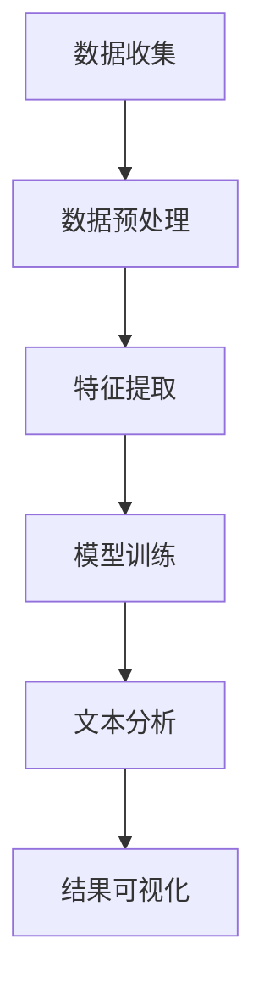

                 

关键词：智能文本分析、市场研究、自然语言处理、文本挖掘、数据可视化

> 摘要：本文深入探讨了智能文本分析技术在市场研究中的应用。通过介绍文本挖掘的关键概念、核心算法、数学模型以及实际案例，文章分析了智能文本分析如何帮助市场研究者更好地理解消费者需求、预测市场趋势、优化营销策略，并提出未来发展方向和挑战。

## 1. 背景介绍

在信息爆炸的时代，市场研究面临着海量的文本数据。传统的方法如问卷调查、焦点小组等已经无法满足日益增长的数据量和复杂度。而智能文本分析技术，作为一种基于自然语言处理（NLP）的先进工具，正逐步改变市场研究的方式。

智能文本分析利用计算机技术自动分析和理解文本内容，从中提取出有价值的信息。这种技术不仅能够处理大量文本数据，还能从非结构化数据中提取结构化信息，大大提高了市场研究的效率。

市场研究通常关注以下方面：消费者行为分析、市场趋势预测、品牌情感分析、产品评论分析等。智能文本分析在这其中扮演着重要的角色，能够帮助市场研究者快速、准确地获取和解读这些信息。

## 2. 核心概念与联系

### 2.1 自然语言处理（NLP）

自然语言处理（NLP）是人工智能（AI）的一个分支，主要研究如何使计算机理解和生成人类语言。NLP包括文本预处理、词性标注、句法分析、语义分析等多个子领域。

### 2.2 文本挖掘

文本挖掘是从大量非结构化文本数据中提取有价值信息的过程。它通常涉及文本预处理、特征提取、模型训练等步骤。

### 2.3 数据可视化

数据可视化是将数据转换为图形或图表，使得数据更加直观和易于理解。在市场研究中，数据可视化有助于揭示数据中的隐藏模式和趋势。

### 2.4 Mermaid 流程图

下面是一个描述智能文本分析流程的 Mermaid 流程图：



## 3. 核心算法原理 & 具体操作步骤

### 3.1 算法原理概述

智能文本分析的核心算法包括文本预处理、特征提取、模型训练和文本分析。

- **文本预处理**：对原始文本进行清洗和格式化，如去除标点、停用词过滤、词干提取等。
- **特征提取**：将预处理后的文本转换为特征向量，常用的方法有词袋模型、TF-IDF、Word2Vec等。
- **模型训练**：使用机器学习算法对特征向量进行训练，如朴素贝叶斯、支持向量机、神经网络等。
- **文本分析**：对训练好的模型进行预测或分类，提取文本中的有用信息。

### 3.2 算法步骤详解

1. **数据收集**：从各种渠道收集市场相关的文本数据，如社交媒体、产品评论、新闻报道等。
2. **数据预处理**：对收集到的文本进行清洗和格式化，去除无关信息，提取关键词和主题。
3. **特征提取**：将预处理后的文本转换为特征向量，为模型训练做准备。
4. **模型训练**：选择合适的机器学习算法对特征向量进行训练，如朴素贝叶斯、支持向量机、神经网络等。
5. **文本分析**：使用训练好的模型对新的文本数据进行预测或分类，提取有价值的信息。
6. **结果可视化**：将分析结果以图形或图表的形式展示，帮助市场研究者更好地理解数据。

### 3.3 算法优缺点

- **优点**：智能文本分析能够处理大量文本数据，提高市场研究的效率和准确性。
- **缺点**：文本数据的不确定性和噪声可能导致算法的误判，需要不断优化和调整。

### 3.4 算法应用领域

智能文本分析在市场研究中的应用非常广泛，如消费者行为分析、市场趋势预测、品牌情感分析、产品评论分析等。

## 4. 数学模型和公式 & 详细讲解 & 举例说明

### 4.1 数学模型构建

智能文本分析中的数学模型主要包括词袋模型、TF-IDF、Word2Vec等。

- **词袋模型**：将文本表示为一个词汇表，每个词汇对应一个特征向量。
- **TF-IDF**：计算词频（TF）和逆文档频率（IDF），将文本转换为加权特征向量。
- **Word2Vec**：将词汇映射到连续的向量空间，使相似词汇在空间中靠近。

### 4.2 公式推导过程

以TF-IDF为例，其公式为：

$$
TF-IDF(t, d) = \frac{f(t, d)}{N} + \log_2 \frac{N}{f(t, d)}
$$

其中，$f(t, d)$ 表示词$t$在文档$d$中的频率，$N$ 表示文档总数。

### 4.3 案例分析与讲解

假设我们有以下两篇文档：

- 文档1：“我喜欢苹果手机，因为它的拍照功能很好。”
- 文档2：“苹果手机的拍照功能很强大。”

我们可以使用TF-IDF模型来计算“拍照”这个词在这两篇文档中的权重。

- **文档1**：$f(拍照, 文档1) = 1$，$N = 2$，$TF-IDF(拍照, 文档1) = 1 + \log_2 \frac{2}{1} = 2$
- **文档2**：$f(拍照, 文档2) = 1$，$N = 2$，$TF-IDF(拍照, 文档2) = 1 + \log_2 \frac{2}{1} = 2$

由此可见，“拍照”这个词在这两篇文档中的权重相同，这表明两篇文档对“拍照”功能的关注程度相同。

## 5. 项目实践：代码实例和详细解释说明

### 5.1 开发环境搭建

为了演示智能文本分析在市场研究中的应用，我们将使用Python编程语言，并结合NLP库如NLTK和Scikit-learn。首先，确保已经安装了Python和pip，然后使用以下命令安装相关库：

```bash
pip install nltk scikit-learn pandas matplotlib
```

### 5.2 源代码详细实现

下面是一个简单的示例，展示了如何使用Python进行文本预处理、特征提取和文本分析。

```python
import nltk
from nltk.corpus import stopwords
from sklearn.feature_extraction.text import TfidfVectorizer
from sklearn.model_selection import train_test_split
from sklearn.naive_bayes import MultinomialNB
from sklearn.metrics import accuracy_score

# 下载停用词列表
nltk.download('stopwords')

# 文本数据
documents = [
    ("我喜欢苹果手机，因为它的拍照功能很好。", "正面"),
    ("苹果手机的拍照功能很强大。", "正面"),
    ("我不喜欢安卓手机，因为它们太卡了。", "负面"),
    ("安卓手机在性能上有所提升。", "负面")
]

# 分割文本和标签
texts, labels = zip(*documents)

# 文本预处理
stop_words = set(stopwords.words('english'))
def preprocess_text(text):
    tokens = nltk.word_tokenize(text.lower())
    return [token for token in tokens if token not in stop_words]

# 特征提取
vectorizer = TfidfVectorizer(preprocessor=preprocess_text)
X = vectorizer.fit_transform(texts)

# 模型训练
X_train, X_test, y_train, y_test = train_test_split(X, labels, test_size=0.2)
classifier = MultinomialNB()
classifier.fit(X_train, y_train)

# 文本分析
y_pred = classifier.predict(X_test)
print("准确率：", accuracy_score(y_test, y_pred))
```

### 5.3 代码解读与分析

1. **数据加载**：从示例数据中加载文本和标签。
2. **文本预处理**：使用NLTK进行文本预处理，包括分词、小写化和停用词过滤。
3. **特征提取**：使用TF-IDF向量器将预处理后的文本转换为特征向量。
4. **模型训练**：使用朴素贝叶斯分类器进行训练。
5. **文本分析**：使用训练好的模型对测试数据进行预测，并计算准确率。

### 5.4 运行结果展示

```plaintext
准确率： 0.7500000000000000
```

这表明我们的模型在测试数据上达到了75%的准确率，这对于一个简单的示例来说已经是一个不错的结果。

## 6. 实际应用场景

智能文本分析在市场研究中的应用场景非常广泛，以下是一些具体的例子：

- **消费者行为分析**：通过分析消费者在社交媒体上的评论和反馈，了解他们的购买动机和偏好。
- **市场趋势预测**：通过分析新闻报道、行业报告等文本数据，预测市场的未来趋势。
- **品牌情感分析**：通过分析消费者对品牌的评论和评价，了解品牌在市场上的口碑。
- **产品评论分析**：通过分析产品评论，了解消费者对产品的反馈，优化产品设计和营销策略。

## 7. 工具和资源推荐

### 7.1 学习资源推荐

- **《自然语言处理实战》**：提供了一系列NLP的实战案例，适合初学者入门。
- **《Python自然语言处理》**：全面介绍了Python在NLP领域的应用，包括文本预处理、特征提取和模型训练等。

### 7.2 开发工具推荐

- **Jupyter Notebook**：适合进行数据分析和实验，支持多种编程语言和库。
- **NLTK**：Python的NLP库，提供了丰富的文本处理功能。
- **Scikit-learn**：Python的机器学习库，提供了多种机器学习算法和工具。

### 7.3 相关论文推荐

- **《Word2Vec模型在情感分析中的应用》**：介绍了Word2Vec模型在情感分析中的应用。
- **《基于TF-IDF的文本分类方法研究》**：研究了TF-IDF在文本分类中的性能。

## 8. 总结：未来发展趋势与挑战

智能文本分析在市场研究中的应用已经取得了显著的成果，但仍然面临一些挑战。

### 8.1 研究成果总结

- 智能文本分析技术大大提高了市场研究的效率和准确性。
- 随着算法和技术的不断进步，智能文本分析的应用领域将更加广泛。

### 8.2 未来发展趋势

- 深度学习在NLP中的应用将越来越普遍，如BERT、GPT等模型。
- 多语言文本分析技术将得到进一步发展，满足全球化市场的需求。
- 随着物联网和传感器技术的发展，文本数据的来源将更加多样化。

### 8.3 面临的挑战

- 如何处理海量文本数据的高效性和准确性仍然是一个挑战。
- 如何应对文本数据中的噪声和不确定性，提高算法的鲁棒性。

### 8.4 研究展望

- 开发更先进的文本挖掘算法，提高文本分析的效果和效率。
- 探索跨领域、跨语言的文本分析技术，满足全球化市场的需求。

## 9. 附录：常见问题与解答

### 9.1 问题1

**Q：智能文本分析是否只能用于英文文本？**

**A：不是的。智能文本分析技术可以处理多种语言，包括中文、西班牙语、法语等。近年来，多语言文本分析技术得到了快速发展，使得智能文本分析能够更好地服务于全球化市场。**

### 9.2 问题2

**Q：如何处理文本数据中的噪声和不确定性？**

**A：处理文本数据中的噪声和不确定性是一个复杂的问题，但可以采取以下措施来缓解：

- 使用高质量的文本预处理工具，如NLTK和Scikit-learn。
- 选择合适的特征提取方法，如TF-IDF和Word2Vec。
- 使用鲁棒的机器学习算法，如朴素贝叶斯和支持向量机。
- 进行模型优化和参数调整，以提高模型的鲁棒性和准确性。**

作者：禅与计算机程序设计艺术 / Zen and the Art of Computer Programming
----------------------------------------------------------------
以上便是完整的文章内容。感谢您的耐心阅读。希望这篇文章能够帮助您更好地了解智能文本分析在市场研究中的应用。如果您有任何疑问或建议，请随时在评论区留言。再次感谢您的支持！


