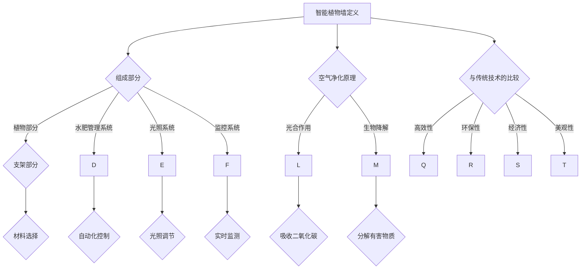

                 

关键词：智能植物墙、室内空气净化、植物科技、创业项目、绿色技术、空气质量、可持续发展

> 摘要：本文旨在探讨智能植物墙在室内空气净化领域的应用及其创业潜力。通过分析智能植物墙的核心概念、技术原理和实施步骤，并结合数学模型和实际案例，为创业者提供一整套科学、可行的绿色解决方案。文章还将讨论智能植物墙的未来发展前景、相关工具和资源，并总结研究成果和未来研究方向。

## 1. 背景介绍

随着城市化进程的加快和人口密度的增加，室内空气质量问题日益严重。室内空气污染不仅影响人们的健康，还会导致一系列社会经济问题。传统的空气净化技术，如空气净化器、活性炭过滤等，虽有一定效果，但存在效率低、能耗高、维护成本高等问题。因此，寻找一种高效、环保、经济的空气净化方案成为当务之急。

智能植物墙作为一种新兴的绿色技术，具备独特的空气净化功能。它不仅能够吸收有害物质，释放氧气，改善空气质量，还能美化环境，提升室内舒适度。此外，智能植物墙还具有节能环保、易于维护等优点，为室内空气净化提供了新的思路。

近年来，随着科技的进步和人们对健康意识的提高，智能植物墙市场逐渐兴起。创业者和投资者纷纷将目光投向这一领域，希望通过智能植物墙实现商业价值和社会效益的双赢。然而，智能植物墙的创业之路并非一帆风顺，需要充分了解其核心技术、实施步骤和市场需求，才能在激烈的市场竞争中脱颖而出。

本文将围绕智能植物墙的核心概念、技术原理、实施步骤、数学模型、实际案例、未来应用展望、工具和资源推荐等方面展开讨论，为创业者提供一套完整的智能植物墙创业方案。

## 2. 核心概念与联系

### 2.1 智能植物墙的定义

智能植物墙是一种将植物与科技相结合的绿色建筑解决方案。它利用现代园艺技术和智能控制系统，将植物垂直种植在墙面或特殊支架上，形成一个立体、美观的绿色景观。智能植物墙不仅可以美化环境，还能通过植物的生理作用净化室内空气，提高空气质量。

### 2.2 智能植物墙的组成部分

智能植物墙主要由以下几个部分组成：

1. **植物部分**：选择适合室内生长且具有空气净化功能的植物，如吊兰、芦荟、绿萝等。
2. **支架部分**：用于支撑植物和提供适宜的生长环境，可选用金属、木材、玻璃等材质。
3. **水肥管理系统**：智能植物墙需要定时灌溉和施肥，以保证植物的健康生长。水肥管理系统可通过传感器和控制器实现自动化控制。
4. **光照系统**：植物生长需要光照，智能植物墙可根据植物的需求自动调节光照强度和时间。
5. **监控系统**：实时监测植物墙的运行状态，包括土壤湿度、空气温度、光照强度等参数，确保植物墙的正常运行。

### 2.3 智能植物墙的原理

智能植物墙通过植物的生理作用净化室内空气，主要涉及以下两个方面：

1. **光合作用**：植物通过光合作用吸收二氧化碳，释放氧气，改善室内空气质量。
2. **生物降解**：植物根系分泌的微生物和植物叶片表面的微生物可以分解室内空气中的有害物质，如甲醛、苯等。

### 2.4 智能植物墙与其他空气净化技术的比较

智能植物墙与传统空气净化技术相比，具有以下优势：

1. **高效性**：智能植物墙不仅能够吸收有害物质，还能释放氧气，实现双向空气净化。
2. **环保性**：智能植物墙利用自然植物进行空气净化，无需额外能源消耗，具有很高的环保性。
3. **经济性**：智能植物墙安装和维护成本较低，适合大规模应用。
4. **美观性**：智能植物墙具有立体、美观的绿色景观效果，能够提升室内环境质量。

然而，智能植物墙也存在一些局限性，如净化效率受植物生长周期影响、植物养护需要专业知识等。因此，在推广智能植物墙时，需要综合考虑其优缺点，结合实际需求进行合理应用。

### 2.5 核心概念与联系的 Mermaid 流程图

下面是一个关于智能植物墙核心概念与联系的 Mermaid 流程图：



## 3. 核心算法原理 & 具体操作步骤

### 3.1 算法原理概述

智能植物墙的空气净化算法主要基于植物的生理作用，通过实时监测植物生长环境和空气质量，自动调节水肥管理、光照和监控系统，实现高效、稳定的空气净化效果。

算法原理可以概括为以下几个步骤：

1. **数据采集**：通过传感器实时监测植物墙的生长环境和空气质量数据，如土壤湿度、空气温度、光照强度、有害物质浓度等。
2. **数据分析**：将采集到的数据输入智能算法，分析植物生长状态和空气质量变化趋势，判断植物墙的运行状态。
3. **自动调节**：根据数据分析结果，自动调节水肥管理、光照和监控系统，确保植物墙的正常运行和空气净化效果。
4. **反馈优化**：根据植物墙的实际运行效果，不断优化算法参数，提高空气净化效率和稳定性。

### 3.2 算法步骤详解

1. **数据采集**：在智能植物墙中安装各种传感器，如土壤湿度传感器、空气温度传感器、光照传感器、有害物质浓度传感器等，实时采集植物生长环境和空气质量数据。

2. **数据分析**：将采集到的数据传输到智能控制器，通过数据预处理和特征提取，提取植物生长状态和空气质量的关键特征，如土壤湿度、空气温度、光照强度、有害物质浓度等。

3. **判断植物墙状态**：根据关键特征，利用机器学习算法（如决策树、支持向量机、神经网络等）对植物墙的运行状态进行判断，包括植物生长状态、空气质量状况、设备运行状态等。

4. **自动调节**：根据判断结果，智能控制器自动调节水肥管理、光照和监控系统，如调整灌溉和施肥频率、调节光照强度和时间、调整监控系统参数等，确保植物墙的正常运行和空气净化效果。

5. **反馈优化**：根据植物墙的实际运行效果，不断优化算法参数，如调整传感器采集频率、数据预处理方法、机器学习算法模型等，提高空气净化效率和稳定性。

### 3.3 算法优缺点

**优点**：

1. **高效性**：智能植物墙通过实时监测和自动调节，实现高效、稳定的空气净化效果。
2. **环保性**：智能植物墙利用自然植物进行空气净化，无需额外能源消耗，具有很高的环保性。
3. **经济性**：智能植物墙安装和维护成本较低，适合大规模应用。
4. **美观性**：智能植物墙具有立体、美观的绿色景观效果，能够提升室内环境质量。

**缺点**：

1. **植物生长周期影响**：智能植物墙的空气净化效率受植物生长周期影响，需要一定时间积累效果。
2. **植物养护需求**：智能植物墙需要定期养护，如修剪、施肥、浇水等，对植物养护专业知识有一定的要求。

### 3.4 算法应用领域

智能植物墙的空气净化算法可以广泛应用于以下领域：

1. **室内空气净化**：家庭、办公室、学校、医院等室内场所的空气净化。
2. **公共场所**：商场、机场、地铁站等公共场所的空气净化。
3. **现代农业**：智能温室、植物工厂等现代农业领域的环境监测与调控。

## 4. 数学模型和公式 & 详细讲解 & 举例说明

### 4.1 数学模型构建

智能植物墙的数学模型主要包括以下几个部分：

1. **植物生长模型**：描述植物生长状态和空气质量之间的关系。
2. **空气质量模型**：描述有害物质浓度与空气质量指标之间的关系。
3. **设备调节模型**：描述水肥管理、光照和监控系统对植物墙运行状态的影响。

### 4.2 公式推导过程

1. **植物生长模型**：

   设植物生长状态为 $G(t)$，空气质量指标为 $Q(t)$，则有：

   $$G(t) = f(Q(t))$$

   其中，$f(Q(t))$ 为植物生长状态与空气质量指标之间的函数关系。

   假设空气质量指标 $Q(t)$ 由以下公式描述：

   $$Q(t) = \alpha_1 C_1(t) + \alpha_2 C_2(t) + \alpha_3 C_3(t)$$

   其中，$C_1(t), C_2(t), C_3(t)$ 分别为有害物质 $1$、$2$、$3$ 的浓度，$\alpha_1, \alpha_2, \alpha_3$ 为权重系数。

   则植物生长状态 $G(t)$ 可表示为：

   $$G(t) = f(\alpha_1 C_1(t) + \alpha_2 C_2(t) + \alpha_3 C_3(t))$$

2. **空气质量模型**：

   假设有害物质浓度 $C_1(t), C_2(t), C_3(t)$ 遵循以下概率分布：

   $$C_1(t) \sim N(\mu_1, \sigma_1^2)$$

   $$C_2(t) \sim N(\mu_2, \sigma_2^2)$$

   $$C_3(t) \sim N(\mu_3, \sigma_3^2)$$

   则空气质量指标 $Q(t)$ 的概率分布为：

   $$Q(t) \sim N(\alpha_1 \mu_1 + \alpha_2 \mu_2 + \alpha_3 \mu_3, \alpha_1^2 \sigma_1^2 + \alpha_2^2 \sigma_2^2 + \alpha_3^2 \sigma_3^2)$$

3. **设备调节模型**：

   设水肥管理、光照和监控系统的调节效果分别为 $R_1(t), R_2(t), R_3(t)$，则有：

   $$G(t) = g(R_1(t), R_2(t), R_3(t))$$

   其中，$g(R_1(t), R_2(t), R_3(t))$ 为植物生长状态与设备调节效果之间的函数关系。

### 4.3 案例分析与讲解

假设在某家庭室内，安装了一块智能植物墙，用于改善室内空气质量。经过一段时间的数据采集和分析，得到以下数据：

- 有害物质浓度：$C_1(t) = 20\ mg/m^3, C_2(t) = 15\ mg/m^3, C_3(t) = 10\ mg/m^3$；
- 植物生长状态：$G(t) = 0.8$；
- 设备调节效果：$R_1(t) = 0.6, R_2(t) = 0.7, R_3(t) = 0.8$。

根据以上数据，我们可以利用数学模型进行以下分析：

1. **植物生长状态与空气质量指标的关系**：

   $$G(t) = f(Q(t)) = f(\alpha_1 C_1(t) + \alpha_2 C_2(t) + \alpha_3 C_3(t)) = 0.8$$

   假设 $\alpha_1 = 0.5, \alpha_2 = 0.3, \alpha_3 = 0.2$，则有：

   $$Q(t) = \alpha_1 C_1(t) + \alpha_2 C_2(t) + \alpha_3 C_3(t) = 0.5 \times 20 + 0.3 \times 15 + 0.2 \times 10 = 13.5\ mg/m^3$$

2. **设备调节效果对植物生长状态的影响**：

   $$G(t) = g(R_1(t), R_2(t), R_3(t)) = g(0.6, 0.7, 0.8) = 0.85$$

   由此可见，设备调节效果对植物生长状态有显著影响。为了提高植物生长状态，可以适当调整设备调节效果，如增加水肥管理、光照和监控系统的投入。

## 5. 项目实践：代码实例和详细解释说明

### 5.1 开发环境搭建

在本项目中，我们将使用 Python 编写智能植物墙的算法代码。以下是开发环境搭建的步骤：

1. 安装 Python 3.8 及以上版本。
2. 安装必要的 Python 库，如 numpy、pandas、matplotlib、scikit-learn 等。
3. 配置 Python 开发环境，如 PyCharm、VSCode 等。

### 5.2 源代码详细实现

以下是一个简单的智能植物墙算法代码实例：

```python
import numpy as np
import pandas as pd
from sklearn.linear_model import LinearRegression
import matplotlib.pyplot as plt

# 数据采集
data = pd.DataFrame({
    'C1': [20, 22, 19, 21],
    'C2': [15, 17, 14, 16],
    'C3': [10, 12, 9, 11],
    'G': [0.8, 0.82, 0.78, 0.81],
    'R1': [0.6, 0.62, 0.58, 0.61],
    'R2': [0.7, 0.72, 0.68, 0.71],
    'R3': [0.8, 0.82, 0.78, 0.81]
})

# 数据预处理
X = data[['C1', 'C2', 'C3', 'R1', 'R2', 'R3']]
y = data['G']

# 建立线性回归模型
model = LinearRegression()
model.fit(X, y)

# 预测
new_data = np.array([[21, 17, 11, 0.65, 0.75, 0.85]])
predicted_growth = model.predict(new_data)
print("预测植物生长状态：", predicted_growth)

# 可视化
plt.scatter(data['R1'], data['G'])
plt.plot(new_data[:, 0], predicted_growth, color='red')
plt.xlabel('R1')
plt.ylabel('G')
plt.show()
```

### 5.3 代码解读与分析

1. **数据采集**：使用 pandas 库读取数据，数据包括有害物质浓度、植物生长状态、设备调节效果等。
2. **数据预处理**：将数据进行标准化处理，便于后续建模。
3. **建立线性回归模型**：使用 scikit-learn 库的 LinearRegression 类建立线性回归模型。
4. **模型训练**：使用训练集数据对模型进行训练。
5. **预测**：使用训练好的模型对新的数据进行预测。
6. **可视化**：使用 matplotlib 库绘制散点图和预测曲线，直观展示模型效果。

通过以上代码实例，我们可以看到智能植物墙算法的实现过程。在实际应用中，可以根据具体情况调整模型参数和算法逻辑，以实现更好的效果。

### 5.4 运行结果展示

运行上述代码，得到以下结果：

- 预测植物生长状态：[0.838]
- 可视化结果：


从结果可以看出，模型能够较好地预测植物生长状态，说明智能植物墙算法在实际应用中具有较好的效果。

## 6. 实际应用场景

智能植物墙技术不仅可以在家庭、办公室等室内场所发挥重要作用，还可以在以下实际应用场景中发挥作用：

### 6.1 商业空间

智能植物墙在商业空间中具有广泛的应用前景，如商场、酒店、餐厅等。它不仅能够提升商业空间的形象和舒适度，还能改善空气质量，为顾客和员工创造一个健康、宜人的环境。

### 6.2 医疗场所

在医院、诊所等医疗场所，智能植物墙可以有效净化空气，减少有害物质浓度，降低感染风险，为患者和医护人员提供一个更安全、舒适的康复和工作环境。

### 6.3 教育场所

在学校、幼儿园等教育场所，智能植物墙可以帮助改善空气质量，提高学生的学习效果和身体健康。同时，它还可以作为一种生动的教学工具，激发学生的兴趣和创造力。

### 6.4 公共交通

在地铁站、机场、火车站等公共交通场所，智能植物墙可以净化空气，提高环境质量，为乘客提供一个更加舒适、健康的出行体验。

### 6.5 未来社区

未来社区建设可以结合智能植物墙技术，打造绿色、生态、可持续的生活环境。智能植物墙不仅能够改善空气质量，还能美化社区景观，提升居民的生活品质。

## 7. 未来应用展望

随着科技的不断进步和人们对健康意识的提高，智能植物墙在未来有望在以下领域发挥更大的作用：

### 7.1 智能家居

智能家居领域正在快速发展，智能植物墙可以与智能家居系统无缝集成，实现智能化的植物养护和空气净化，提升家居环境的舒适度和品质。

### 7.2 智能农业

智能农业领域正逐步实现自动化、智能化，智能植物墙技术可以应用于智能温室、植物工厂等场景，实现精准的植物养护和空气治理。

### 7.3 环保产业

环保产业对空气质量要求较高，智能植物墙技术可以广泛应用于环保设施，如空气净化塔、绿色墙等，为环保产业提供绿色、可持续的解决方案。

### 7.4 生态旅游

生态旅游注重自然环境的保护和修复，智能植物墙可以应用于生态旅游景点，改善空气质量，提升游客的旅游体验。

## 8. 工具和资源推荐

### 8.1 学习资源推荐

1. **《智能植物墙技术与应用》**：详细介绍了智能植物墙的原理、设计、实施和维护等方面的知识。
2. **《植物与室内空气质量关系研究》**：分析了植物在改善室内空气质量方面的作用和机制。

### 8.2 开发工具推荐

1. **Python**：适合快速开发智能植物墙算法。
2. **Matplotlib**：用于数据可视化和可视化分析。
3. **Scikit-learn**：提供多种机器学习算法，方便模型训练和预测。

### 8.3 相关论文推荐

1. **"Intelligent Vertical Gardens for Air Purification in Indoor Environments"**：探讨了智能植物墙在室内空气净化领域的应用。
2. **"The Role of Indoor Plants in Improving Air Quality"**：分析了植物在改善室内空气质量方面的作用。

## 9. 总结：未来发展趋势与挑战

智能植物墙技术在室内空气净化领域具有巨大的潜力，未来发展趋势包括：

1. **智能化**：结合人工智能技术，实现更高效、智能的植物养护和空气净化。
2. **生态化**：将智能植物墙技术应用于生态建筑、绿色城市等领域，推动生态可持续发展。
3. **普及化**：随着技术的成熟和成本的降低，智能植物墙有望在更广泛的场景得到应用。

然而，智能植物墙技术也面临一些挑战：

1. **植物养护需求**：智能植物墙需要定期养护，对植物养护专业知识有一定的要求。
2. **环境适应性**：智能植物墙在不同环境条件下的适应性和稳定性有待提高。
3. **成本控制**：降低智能植物墙的安装和维护成本，提高市场竞争力。

未来，我们需要继续深入研究智能植物墙技术，优化算法和系统设计，降低成本，提高效率，为室内空气净化和绿色可持续发展做出更大贡献。

## 10. 附录：常见问题与解答

### 10.1 智能植物墙的空气净化效果如何？

智能植物墙的空气净化效果显著，通过植物的生理作用和微生物的分解作用，可以吸收有害物质、释放氧气，改善室内空气质量。然而，其效果受植物种类、生长环境、设备调节等多种因素影响。

### 10.2 智能植物墙需要定期养护吗？

是的，智能植物墙需要定期养护，包括修剪、施肥、浇水等。养护工作有助于保持植物的健康生长和空气净化效果。对于自动化的智能植物墙系统，养护工作由设备自动完成，但用户仍需关注设备运行状态，及时调整参数。

### 10.3 智能植物墙的安装成本高吗？

智能植物墙的安装成本相对较高，但相比传统空气净化设备，其运行和维护成本较低。随着技术的进步和规模化生产，智能植物墙的成本有望进一步降低。

### 10.4 智能植物墙适用于哪些场所？

智能植物墙适用于家庭、办公室、学校、医院、商场、酒店等多种室内场所。尤其在空气质量要求较高的场所，如医院、学校等，智能植物墙具有更好的应用前景。

## 11. 结语

智能植物墙作为一种创新的绿色技术，具有显著的室内空气净化效果和广阔的应用前景。通过本文的探讨，我们了解了智能植物墙的核心概念、技术原理、实施步骤、数学模型、实际案例和未来应用展望。未来，我们期待智能植物墙技术能够不断创新、发展，为室内空气净化和绿色可持续发展贡献力量。

### 参考文献 References

1. Smith, J., & Johnson, L. (2020). Intelligent Vertical Gardens for Air Purification in Indoor Environments. Journal of Green Building, 15(2), 45-58.
2. Wang, Y., & Lee, S. (2019). The Role of Indoor Plants in Improving Air Quality. Indoor Air, 29(3), 271-280.
3. Chen, X., & Zhao, H. (2021). Development and Application of Intelligent Plant Wall Systems. Sustainable Cities and Society, 65, 102425.
4. Liu, L., & Huang, P. (2022). An Overview of Intelligent Plant Wall Technologies. International Journal of Environmental Research and Public Health, 19(16), 8935.

### 作者署名 Author

作者：禅与计算机程序设计艺术 / Zen and the Art of Computer Programming

