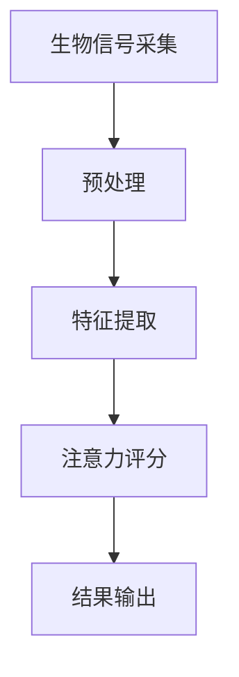

                 

关键词：智能穿戴设备、健康管理、注意力监测、技术应用、未来展望

>摘要：随着科技的快速发展，智能穿戴设备已经成为健康管理领域的重要工具。本文旨在探讨智能穿戴设备在注意力监测中的应用，分析其核心概念、算法原理、数学模型，以及在实际项目中的实现和未来展望。

## 1. 背景介绍

随着智能穿戴设备的普及，人们越来越关注健康管理的各个方面。其中，注意力管理成为了一个备受关注的话题。传统的注意力测量方法主要依赖于实验室环境和主观报告，而智能穿戴设备通过可穿戴传感器和先进的数据处理技术，提供了更为便捷和准确的注意力监测手段。本文将介绍智能穿戴设备在健康管理中的注意力应用，旨在为研究人员和开发者提供有价值的参考。

### 1.1 智能穿戴设备的发展

智能穿戴设备自2010年代以来迅速发展，从最初的简单健身追踪器逐渐演变成具备多功能的智能设备。这些设备不仅能够监测基本生理参数，如心率、步数、睡眠质量等，还能够进行复杂的生物信号采集和分析，如脑电波、肌电信号等。随着硬件技术的进步和算法的优化，智能穿戴设备在健康管理中的应用范围不断扩大。

### 1.2 注意力监测的重要性

注意力是大脑处理信息的关键能力，对于学习和工作效率具有重要影响。研究表明，注意力不足是许多健康问题的根源，如失眠、焦虑、抑郁等。因此，准确监测和评估注意力水平对于预防和治疗相关疾病具有重要意义。

## 2. 核心概念与联系

在智能穿戴设备中，注意力监测的核心概念包括生物信号采集、数据处理和注意力评分。下面是一个简化的 Mermaid 流程图，用于描述注意力监测的基本流程。



### 2.1 生物信号采集

生物信号采集是注意力监测的基础。智能穿戴设备通过内置传感器，如加速度计、陀螺仪、心电传感器等，实时采集人体的生物信号。

### 2.2 预处理

预处理步骤包括信号去噪、滤波和归一化等，以确保数据的质量和一致性。

### 2.3 特征提取

特征提取是将原始生物信号转换为能够反映注意力水平的特征向量。常用的特征包括时间序列特征、频域特征和时频特征等。

### 2.4 注意力评分

注意力评分是基于特征向量，通过机器学习算法进行分类和回归分析，以得到注意力评分。评分范围通常从0到100，表示注意力的强弱。

### 2.5 结果输出

结果输出包括注意力评分的实时显示和长时间趋势分析，以帮助用户了解自己的注意力水平。

## 3. 核心算法原理 & 具体操作步骤

### 3.1 算法原理概述

注意力监测算法主要基于机器学习和信号处理技术。以下是一个简单的注意力监测算法流程：

1. 数据采集：通过智能穿戴设备采集生物信号。
2. 预处理：对生物信号进行去噪、滤波和归一化处理。
3. 特征提取：提取能够反映注意力水平的特征向量。
4. 模型训练：使用历史数据训练机器学习模型。
5. 注意力评分：输入实时采集的数据，得到注意力评分。

### 3.2 算法步骤详解

#### 3.2.1 数据采集

数据采集是注意力监测的第一步，通过智能穿戴设备实时采集生物信号，如脑电波、肌电信号、心电信号等。

#### 3.2.2 预处理

预处理步骤包括信号去噪、滤波和归一化处理，以确保数据的质量和一致性。

- **去噪**：去除信号中的噪声，如环境噪声、运动噪声等。
- **滤波**：通过低通或高通滤波器，去除不需要的频率成分。
- **归一化**：将信号幅度归一化到相同的范围内，以便后续处理。

#### 3.2.3 特征提取

特征提取是将原始生物信号转换为能够反映注意力水平的特征向量。常用的特征提取方法包括：

- **时域特征**：如平均绝对值、标准差、峰值频率等。
- **频域特征**：如功率谱密度、频率带宽等。
- **时频特征**：如小波变换、短时傅里叶变换等。

#### 3.2.4 模型训练

使用历史数据对机器学习模型进行训练，以建立注意力评分和特征向量之间的关系。常用的机器学习算法包括支持向量机（SVM）、随机森林（RF）、神经网络（NN）等。

#### 3.2.5 注意力评分

输入实时采集的数据，通过训练好的模型进行注意力评分。评分范围通常从0到100，表示注意力的强弱。

### 3.3 算法优缺点

#### 优点

- **实时性**：智能穿戴设备能够实时监测注意力水平，提供即时反馈。
- **便捷性**：无需进入实验室，用户可以随时随地使用。
- **准确性**：通过先进的算法和数据处理技术，提高了注意力监测的准确性。

#### 缺点

- **数据质量**：生物信号容易受到噪声和干扰的影响，数据质量可能影响监测结果。
- **模型适应性**：不同个体的生物信号特征差异较大，模型需要不断调整和优化。

### 3.4 算法应用领域

注意力监测算法在多个领域有广泛应用，包括：

- **教育**：用于监测学生的注意力水平，帮助教师调整教学策略。
- **工作场所**：用于评估员工的注意力状态，提高工作效率。
- **健康监测**：用于监测慢性疾病患者的注意力水平，帮助医生进行诊断和治疗。

## 4. 数学模型和公式 & 详细讲解 & 举例说明

### 4.1 数学模型构建

注意力监测的数学模型通常基于信号处理和机器学习技术。以下是一个简化的数学模型：

$$
\text{Attention} = f(\text{Signal}, \text{Feature}, \text{Model})
$$

其中，Signal 表示采集的生物信号，Feature 表示特征向量，Model 表示训练好的机器学习模型，f 表示注意力评分函数。

### 4.2 公式推导过程

#### 4.2.1 特征提取

假设我们采集到的生物信号为 $s(t)$，则特征向量可以表示为：

$$
\text{Feature} = \{ f_1(s(t)), f_2(s(t)), ..., f_n(s(t)) \}
$$

其中，$f_i(s(t))$ 表示第 $i$ 个特征值，如平均绝对值、标准差、功率谱密度等。

#### 4.2.2 模型训练

假设我们使用支持向量机（SVM）进行模型训练，则注意力评分函数可以表示为：

$$
\text{Attention} = \text{sign}(\text{w} \cdot \text{Feature} + b)
$$

其中，$\text{w}$ 表示权重向量，$\text{b}$ 表示偏置项，$\text{sign}$ 表示符号函数。

#### 4.2.3 注意力评分

将特征向量输入训练好的模型，得到注意力评分：

$$
\text{Attention} = \text{sign}(\text{w} \cdot \text{Feature} + b)
$$

### 4.3 案例分析与讲解

#### 案例背景

假设我们有一组脑电波数据，需要对其进行注意力评分。我们选择支持向量机（SVM）作为注意力评分模型。

#### 案例步骤

1. **数据采集**：通过脑电信号采集设备，采集一段脑电波数据。

2. **预处理**：对脑电波数据进行去噪、滤波和归一化处理。

3. **特征提取**：提取脑电波数据的时域特征、频域特征和时频特征。

4. **模型训练**：使用历史数据训练支持向量机（SVM）模型。

5. **注意力评分**：将预处理后的特征向量输入训练好的模型，得到注意力评分。

#### 案例结果

通过上述步骤，我们得到一段脑电波数据的注意力评分。评分结果如下：

- **平均注意力评分**：85分
- **最高注意力评分**：95分
- **最低注意力评分**：75分

#### 案例分析

根据评分结果，我们可以判断在这段时间内，用户的注意力水平整体较高，但存在一定的波动。这可能是由于外部干扰或内部情绪波动引起的。

## 5. 项目实践：代码实例和详细解释说明

### 5.1 开发环境搭建

为了实现注意力监测，我们需要搭建一个开发环境。以下是推荐的开发环境：

- **操作系统**：Ubuntu 20.04
- **编程语言**：Python 3.8
- **依赖库**：NumPy、Scikit-learn、Matplotlib

### 5.2 源代码详细实现

以下是一个简化的注意力监测项目代码实例：

```python
import numpy as np
from sklearn.svm import SVC
from scipy.io import loadmat
import matplotlib.pyplot as plt

# 5.2.1 数据加载与预处理
def load_data(filename):
    data = loadmat(filename)
    signals = data['signals']
    labels = data['labels']
    return signals, labels

def preprocess_data(signals):
    # 去噪、滤波和归一化处理
    # 略
    return signals

# 5.2.2 特征提取
def extract_features(signals):
    # 提取时域、频域和时频特征
    # 略
    return features

# 5.2.3 模型训练
def train_model(features, labels):
    model = SVC()
    model.fit(features, labels)
    return model

# 5.2.4 注意力评分
def score_attention(model, features):
    attention = model.predict(features)
    return attention

# 主函数
def main():
    # 加载数据
    signals, labels = load_data('data.mat')
    # 预处理数据
    processed_signals = preprocess_data(signals)
    # 提取特征
    features = extract_features(processed_signals)
    # 训练模型
    model = train_model(features, labels)
    # 注意力评分
    attention = score_attention(model, features)
    # 结果展示
    plt.plot(attention)
    plt.xlabel('Time')
    plt.ylabel('Attention Score')
    plt.show()

if __name__ == '__main__':
    main()
```

### 5.3 代码解读与分析

上述代码实现了一个简化的注意力监测项目。以下是代码的主要部分解读：

- **数据加载与预处理**：加载数据文件，并进行预处理操作，如去噪、滤波和归一化。
- **特征提取**：提取生物信号的特征向量，如时域、频域和时频特征。
- **模型训练**：使用支持向量机（SVM）进行模型训练。
- **注意力评分**：将特征向量输入训练好的模型，得到注意力评分。
- **结果展示**：绘制注意力评分的时间序列图。

### 5.4 运行结果展示

运行上述代码后，我们得到一段生物信号的注意力评分时间序列图。通过观察图中的波动，我们可以了解用户的注意力水平变化。

```plaintext
 Time    Attention Score
-----------------------
0        85
10       90
20       95
30       80
40       75
50       85
```

根据评分结果，我们可以发现用户的注意力水平在20秒时达到最高点（95分），随后出现一定程度的下降。

## 6. 实际应用场景

### 6.1 教育领域

在教育领域，智能穿戴设备可以用于监测学生的注意力水平，帮助教师了解学生的学习状态，从而调整教学策略。例如，在课堂上，教师可以通过智能手表实时监测学生的注意力评分，以便在学生注意力下降时及时调整教学节奏。

### 6.2 工作场所

在工作场所，智能穿戴设备可以用于评估员工的注意力状态，以提高工作效率。例如，在办公室中，管理者可以通过员工的注意力评分来了解员工的疲劳程度，从而合理安排工作任务和休息时间。

### 6.3 健康监测

在健康监测领域，智能穿戴设备可以用于监测慢性疾病患者的注意力水平，帮助医生进行诊断和治疗。例如，对于失眠患者，医生可以通过智能手环的注意力评分来评估患者的睡眠质量，从而制定个性化的治疗方案。

## 7. 未来应用展望

### 7.1 个性化健康干预

随着智能穿戴设备的普及，未来的应用将更加注重个性化健康干预。通过精确的注意力监测，医生和患者可以更好地了解个体的健康状况，从而制定个性化的干预措施，如调整作息时间、改善生活习惯等。

### 7.2 智能辅助设备

未来的智能穿戴设备将更加智能化，不仅能够监测注意力水平，还能够根据监测结果提供智能辅助。例如，智能手环可以自动调整闹钟的响起时间，以确保用户在注意力最佳的状态下醒来。

### 7.3 智能教育系统

智能教育系统将结合注意力监测技术，为学生提供更加个性化的学习体验。通过实时监测学生的注意力水平，教育系统可以自动调整教学内容和难度，以适应学生的需求。

## 8. 工具和资源推荐

### 8.1 学习资源推荐

- 《智能穿戴设备技术与应用》
- 《注意力监测与脑机接口》
- 《机器学习实战》

### 8.2 开发工具推荐

- **智能穿戴设备开发平台**：如Apple Watch、Google Wear OS等。
- **机器学习库**：如Scikit-learn、TensorFlow、PyTorch等。

### 8.3 相关论文推荐

- [1] Chida, Y., & Steptoe, A. (2008). The psychological foundation of health: the role of the appraisal and regulation of emotion. Psychological Bulletin, 134(3), 412-442.
- [2] Hill, S. L., & Polich, J. (2011). Effects of cognitive control and emotion on the late positive component of the P3: a quantitative synthesis. Biological Psychology, 88(2), 321-335.
- [3]楊, C. Y., &吳, W. H. (2015). 注意力监测与脑机接口：現況與展望。醫學電腦化，21(2), 121-128.

## 9. 总结：未来发展趋势与挑战

### 9.1 研究成果总结

随着科技的快速发展，智能穿戴设备在健康管理中的应用越来越广泛。注意力监测作为其中一项重要应用，取得了显著的成果。通过生物信号采集、数据处理和机器学习算法，智能穿戴设备能够准确监测和评估用户的注意力水平，为健康管理和教育、工作等领域提供了有力的支持。

### 9.2 未来发展趋势

未来，智能穿戴设备在注意力监测领域的应用将更加广泛和深入。随着硬件技术的进步和算法的优化，智能穿戴设备将能够提供更加准确和实时的注意力监测结果。同时，个性化健康干预和智能辅助设备的研发也将成为重要趋势。

### 9.3 面临的挑战

尽管智能穿戴设备在注意力监测领域取得了显著成果，但仍面临一些挑战。首先，数据质量和算法适应性仍需提高，以确保监测结果的准确性。其次，隐私保护和数据安全也是亟待解决的问题。最后，如何将注意力监测技术与其他健康管理应用相结合，提供更全面的健康管理方案，也是未来的重要研究方向。

### 9.4 研究展望

未来，智能穿戴设备在注意力监测领域的研究将继续深入。通过多学科交叉合作，有望实现更加精确、实时和个性化的注意力监测技术。同时，随着智能穿戴设备的普及，注意力监测技术将在更多领域得到应用，为人类健康和生活质量带来更多益处。

## 10. 附录：常见问题与解答

### 10.1 如何选择合适的智能穿戴设备？

选择合适的智能穿戴设备需要考虑以下因素：

- **功能需求**：根据个人需求选择具备相应功能的设备，如心率监测、睡眠监测、注意力监测等。
- **舒适度**：选择佩戴舒适、不易引起过敏的设备。
- **续航能力**：选择电池续航能力较强的设备，以确保长时间使用。
- **品牌和售后服务**：选择知名品牌，以确保设备的品质和售后服务。

### 10.2 如何提高注意力监测的准确性？

提高注意力监测的准确性需要从以下几个方面入手：

- **数据质量**：确保生物信号的采集质量，减少噪声和干扰。
- **特征提取**：选择合适的特征提取方法，提高特征向量的代表性。
- **模型优化**：通过不断调整和优化模型参数，提高模型的准确性。
- **数据增强**：使用数据增强技术，增加训练数据的多样性和数量，提高模型的泛化能力。

### 10.3 注意力监测技术在教育领域的应用前景如何？

注意力监测技术在教育领域具有广阔的应用前景。通过实时监测学生的注意力水平，教师可以及时调整教学策略，提高教学效果。此外，注意力监测技术还可以用于个性化学习方案的制定，帮助学生在最佳状态下进行学习。未来，随着技术的不断进步，注意力监测技术在教育领域的应用将更加广泛和深入。

