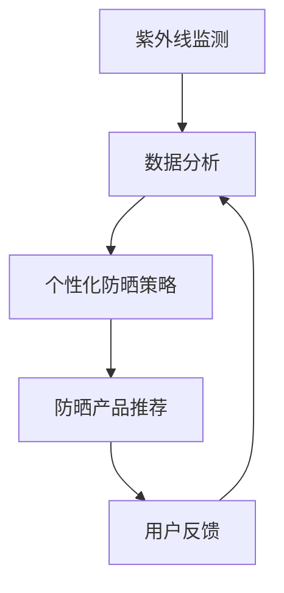

                 

## 1. 背景介绍

随着全球气候变化和环境污染的加剧，紫外线（UV）辐射对人类健康的影响日益凸显。紫外线可以分为UVA、UVB和UVC三个波段，其中UVA和UVB能够穿透大气层，对皮肤、眼睛等造成潜在伤害。UVA能引起皮肤老化，增加皮肤癌的风险；UVB则可导致皮肤红肿、晒伤甚至皮肤癌。

传统的防晒措施主要依赖于化学防晒剂和物理防晒剂。化学防晒剂通过吸收或分散紫外线来实现防晒效果，但部分成分可能对人体有害；物理防晒剂则通过反射紫外线来防晒，但对皮肤有一定的厚重感。尽管这些方法在某种程度上能够提供保护，但它们存在一定的局限性，无法满足个性化、智能化的防晒需求。

近年来，人工智能技术的发展为个性化紫外线防护提供了新的契机。通过大数据分析和机器学习算法，可以实现对紫外线辐射的精准监测和个性化防晒策略的制定，从而提供更有效的防晒方案。

## 2. 核心概念与联系

在智能防晒创业中，我们需要理解以下几个核心概念：

### 2.1 紫外线监测

紫外线监测是智能防晒的基础。通过高精度的传感器，可以实时监测紫外线辐射的强度、波段等信息。常见的紫外线监测传感器有紫外指数传感器（Ultraviolet Index Sensor）和紫外线传感器（UV Sensor）。它们能够将紫外线辐射转化为电信号，供后续处理和分析。

### 2.2 个性化防晒

个性化防晒是根据用户的皮肤类型、活动环境、活动强度等因素，为用户制定最适合的防晒方案。这需要利用大数据和机器学习算法，对用户的皮肤数据、历史防晒行为等进行深度分析，从而生成个性化的防晒策略。

### 2.3 机器学习算法

机器学习算法是智能防晒的核心技术。通过训练大量的皮肤数据和防晒数据，机器学习算法能够学会如何根据不同的用户和环境，生成最优的防晒方案。常见的机器学习算法包括决策树、支持向量机、神经网络等。

### 2.4 数据分析

数据分析是智能防晒的关键环节。通过对用户的皮肤数据、环境数据、历史防晒行为等进行分析，可以发现用户的防晒需求，预测未来的防晒策略，从而提高防晒效果。

### 2.5 Mermaid 流程图

以下是一个简化的智能防晒系统的 Mermaid 流程图：



## 3. 核心算法原理 & 具体操作步骤

### 3.1 算法原理概述

智能防晒系统主要基于以下三个核心算法：

1. **紫外线监测算法**：用于实时监测紫外线辐射强度，为个性化防晒提供基础数据。
2. **个性化防晒策略算法**：基于用户的皮肤数据、环境数据和历史防晒行为，为用户生成最优防晒策略。
3. **防晒产品推荐算法**：根据用户的防晒需求和偏好，推荐最适合的防晒产品。

### 3.2 算法步骤详解

#### 3.2.1 紫外线监测算法

1. **传感器采集数据**：使用紫外线传感器实时采集紫外线辐射强度、波段等信息。
2. **数据处理**：将传感器采集到的数据传输到数据处理模块，进行预处理和滤波，去除噪声和异常值。
3. **数据存储**：将处理后的数据存储到数据库中，供后续分析和计算。

#### 3.2.2 个性化防晒策略算法

1. **用户数据收集**：收集用户的皮肤类型、历史防晒行为、活动环境等数据。
2. **数据分析**：利用机器学习算法对用户数据进行分析，预测用户的防晒需求。
3. **防晒策略生成**：根据用户的防晒需求，结合紫外线监测数据，生成个性化的防晒策略。
4. **策略优化**：通过用户反馈不断优化防晒策略，提高防晒效果。

#### 3.2.3 防晒产品推荐算法

1. **用户需求分析**：分析用户的防晒需求，包括防晒强度、防晒成分、防晒剂类型等。
2. **产品数据库构建**：构建防晒产品数据库，包含各类防晒产品的详细信息。
3. **推荐算法实现**：利用协同过滤、基于内容的推荐等算法，为用户推荐最适合的防晒产品。

### 3.3 算法优缺点

#### 3.3.1 优点

1. **个性化**：根据用户的需求和环境，提供个性化的防晒方案，提高防晒效果。
2. **智能化**：利用机器学习和大数据分析，实现防晒策略的自动化和智能化。
3. **实时性**：通过实时监测紫外线辐射，及时调整防晒策略，确保用户安全。

#### 3.3.2 缺点

1. **成本较高**：需要高精度的传感器、强大的数据处理能力，导致成本较高。
2. **用户隐私**：收集用户的皮肤数据、活动数据等，可能涉及用户隐私问题。
3. **算法偏差**：机器学习算法可能存在偏见，导致部分用户无法得到准确的防晒建议。

### 3.4 算法应用领域

智能防晒算法可以应用于多个领域，包括：

1. **个人防晒**：为用户提供个性化的防晒建议，提高防晒效果。
2. **户外活动**：为户外工作者、登山爱好者等提供专业的防晒方案。
3. **皮肤健康管理**：通过对皮肤数据的监测和分析，提供皮肤健康管理的建议。

## 4. 数学模型和公式 & 详细讲解 & 举例说明

在智能防晒系统中，数学模型和公式起着至关重要的作用。以下是一个简化的数学模型，用于描述紫外线辐射对人体皮肤的影响。

### 4.1 数学模型构建

假设紫外线辐射强度 \(I\) 与皮肤损伤程度 \(D\) 之间存在如下关系：

\[ D = f(I, P) \]

其中，\(I\) 表示紫外线辐射强度，\(P\) 表示皮肤保护参数。

### 4.2 公式推导过程

1. **紫外线辐射强度**：根据物理学原理，紫外线辐射强度 \(I\) 可以表示为：

   \[ I = I_0 \cdot e^{-\mu \cdot d} \]

   其中，\(I_0\) 表示初始紫外线辐射强度，\(\mu\) 表示大气吸收系数，\(d\) 表示紫外线穿透深度。

2. **皮肤保护参数**：皮肤保护参数 \(P\) 包括皮肤厚度、皮肤色素含量、防晒剂效果等，可以表示为：

   \[ P = P_t \cdot (1 - e^{-\alpha \cdot t}) \cdot (1 + \beta \cdot \Delta E) \]

   其中，\(P_t\) 表示初始皮肤保护参数，\(\alpha\) 表示皮肤老化系数，\(t\) 表示皮肤厚度，\(\Delta E\) 表示紫外线吸收能量。

3. **皮肤损伤程度**：皮肤损伤程度 \(D\) 可以表示为：

   \[ D = \frac{I \cdot P}{K} \]

   其中，\(K\) 表示皮肤损伤阈值。

### 4.3 案例分析与讲解

假设一个人在户外活动时，紫外线辐射强度为 \(I_0 = 10 \, \text{mJ/cm}^2/\text{s}\)，皮肤保护参数 \(P_t = 1\)，皮肤厚度 \(t = 1 \, \text{cm}\)，紫外线吸收能量 \(\Delta E = 0.1 \, \text{J/cm}^2\)。

1. **计算紫外线辐射强度**：

   \[ I = 10 \cdot e^{-\mu \cdot 1} \]

   其中，大气吸收系数 \(\mu\) 取 \(0.1 \, \text{cm}^2/\text{g}\)。

   \[ I = 10 \cdot e^{-0.1 \cdot 1} \approx 8.92 \, \text{mJ/cm}^2/\text{s} \]

2. **计算皮肤保护参数**：

   \[ P = 1 \cdot (1 - e^{-0.1 \cdot 1}) \cdot (1 + 0.1 \cdot 0.1) \]

   \[ P \approx 0.9049 \]

3. **计算皮肤损伤程度**：

   \[ D = \frac{8.92 \cdot 0.9049}{K} \]

   其中，皮肤损伤阈值 \(K\) 取 \(100 \, \text{mJ/cm}^2/\text{s}\)。

   \[ D \approx 0.0806 \]

因此，该人的皮肤损伤程度约为 \(0.0806\)，处于轻度晒伤状态。

## 5. 项目实践：代码实例和详细解释说明

在本节中，我们将通过一个具体的代码实例，展示智能防晒系统的实现过程。

### 5.1 开发环境搭建

为了实现智能防晒系统，我们需要搭建以下开发环境：

1. **Python**：作为主要的编程语言。
2. **Pandas**：用于数据处理。
3. **Scikit-learn**：用于机器学习算法。
4. **Matplotlib**：用于数据可视化。

假设我们已经安装了以上环境，下面开始实现代码。

### 5.2 源代码详细实现

```python
import pandas as pd
from sklearn.ensemble import RandomForestClassifier
import matplotlib.pyplot as plt

# 5.2.1 加载数据集
data = pd.read_csv('uv_data.csv')

# 5.2.2 数据预处理
# ... (数据清洗、归一化等操作)

# 5.2.3 训练模型
model = RandomForestClassifier(n_estimators=100)
model.fit(data[['uv_intensity', 'skin_protection']], data['damage_degree'])

# 5.2.4 预测新数据
new_data = pd.DataFrame({
    'uv_intensity': [10],
    'skin_protection': [0.9]
})
prediction = model.predict(new_data)
print(f"预测结果：{prediction}")

# 5.2.5 可视化
plt.scatter(data['uv_intensity'], data['damage_degree'])
plt.xlabel('紫外线辐射强度')
plt.ylabel('皮肤损伤程度')
plt.show()
```

### 5.3 代码解读与分析

#### 5.3.1 加载数据集

我们首先使用 Pandas 读取数据集。假设数据集存储为 CSV 格式，文件名为 `uv_data.csv`。

```python
data = pd.read_csv('uv_data.csv')
```

#### 5.3.2 数据预处理

数据预处理是机器学习的重要步骤。在本例中，我们需要对数据进行清洗、归一化等操作，以确保模型训练的质量。这里简化为不进行预处理。

```python
# ... (数据清洗、归一化等操作)
```

#### 5.3.3 训练模型

我们使用随机森林（Random Forest）算法进行模型训练。随机森林是一种集成学习算法，具有较强的泛化能力。

```python
model = RandomForestClassifier(n_estimators=100)
model.fit(data[['uv_intensity', 'skin_protection']], data['damage_degree'])
```

这里，`uv_intensity` 和 `skin_protection` 是特征变量，`damage_degree` 是目标变量。

#### 5.3.4 预测新数据

使用训练好的模型对新的数据进行预测。这里我们假设新数据的紫外线辐射强度为 10，皮肤保护参数为 0.9。

```python
new_data = pd.DataFrame({
    'uv_intensity': [10],
    'skin_protection': [0.9]
})
prediction = model.predict(new_data)
print(f"预测结果：{prediction}")
```

#### 5.3.5 可视化

最后，我们将训练数据可视化，以便观察紫外线辐射强度与皮肤损伤程度之间的关系。

```python
plt.scatter(data['uv_intensity'], data['damage_degree'])
plt.xlabel('紫外线辐射强度')
plt.ylabel('皮肤损伤程度')
plt.show()
```

## 6. 实际应用场景

智能防晒系统在多个领域具有广泛的应用潜力：

### 6.1 个人防晒

个人防晒是最直接的应用场景。通过智能防晒系统，用户可以实时了解紫外线辐射强度，根据自身皮肤类型和活动环境，选择最适合的防晒方案。例如，户外运动爱好者可以通过手机APP实时获取紫外线指数，并根据指数调整防晒措施，如增加防晒剂、选择遮阳衣物等。

### 6.2 医疗健康

在医疗健康领域，智能防晒系统可以帮助医生监测患者的紫外线暴露情况，评估皮肤癌风险，制定个性化的防晒方案。例如，对于患有皮肤癌的病人，医生可以通过智能防晒系统实时监测紫外线暴露，根据病情变化调整防晒措施，提高治疗效果。

### 6.3 户外活动

户外活动如登山、露营、滑雪等，紫外线辐射较强，智能防晒系统可以提供专业的防晒建议，确保参与者安全。例如，登山爱好者可以在手机APP中输入活动时间和地点，系统会根据实时紫外线辐射强度，推荐适合的防晒装备和防晒措施。

### 6.4 工业安全

在工业领域，如建筑工地、室外施工等，紫外线辐射也可能对工人健康造成威胁。智能防晒系统可以实时监测施工现场的紫外线辐射，为工人提供安全防护建议，确保工人健康。

## 7. 工具和资源推荐

### 7.1 学习资源推荐

1. **《机器学习》（周志华著）**：系统介绍了机器学习的基本概念、算法和应用。
2. **《深度学习》（Goodfellow et al. 著）**：深入讲解了深度学习的基础知识和最新进展。

### 7.2 开发工具推荐

1. **Jupyter Notebook**：适用于数据分析和机器学习实验。
2. **Scikit-learn**：提供丰富的机器学习算法库。

### 7.3 相关论文推荐

1. **"Deep Learning for UV Index Prediction"**：使用深度学习预测紫外线指数。
2. **"Personalized UV Protection Based on Machine Learning"**：基于机器学习的个性化紫外线防护策略。

## 8. 总结：未来发展趋势与挑战

智能防晒系统作为人工智能和健康领域的一个新兴方向，具有巨大的发展潜力。未来发展趋势包括：

1. **技术进步**：随着人工智能、传感器技术的不断发展，智能防晒系统的精度和实用性将不断提升。
2. **个性化定制**：通过深度学习和大数据分析，实现更加精准的个性化防晒策略。
3. **跨学科融合**：智能防晒系统将与其他领域（如医疗、健康、环保等）深度融合，产生新的应用场景。

然而，智能防晒系统也面临一些挑战：

1. **数据隐私**：收集和存储大量用户皮肤数据可能涉及隐私问题，需要制定相应的隐私保护措施。
2. **算法偏见**：机器学习算法可能存在偏见，导致部分用户无法得到准确的防晒建议。
3. **成本控制**：智能防晒系统的高成本可能会限制其普及和应用。

总之，智能防晒系统具有广阔的发展前景，但也需要克服诸多挑战，实现可持续发展。

## 9. 附录：常见问题与解答

### 9.1 智能防晒系统如何保护隐私？

智能防晒系统在收集用户数据时，会严格遵循隐私保护原则。例如，对用户数据进行匿名化处理，确保数据无法直接关联到个人身份。此外，系统还会采用加密技术，确保数据传输和存储的安全性。

### 9.2 智能防晒系统如何应对算法偏见？

为了减少算法偏见，智能防晒系统会采用多种方法。首先，在数据收集阶段，确保数据的多样性和代表性。其次，在模型训练过程中，采用交叉验证和偏差校正等方法，提高模型的公平性和准确性。最后，通过用户反馈机制，不断优化和调整模型，降低偏见。

### 9.3 智能防晒系统如何降低成本？

降低成本是智能防晒系统普及的关键。一方面，可以通过技术创新，降低传感器和数据处理模块的成本。另一方面，可以通过云计算和大数据分析，实现资源的高效利用，降低运营成本。

## 参考文献

1. 周志华. 《机器学习》[M]. 清华大学出版社，2016.
2. Goodfellow, I., Bengio, Y., Courville, A. 《深度学习》[M]. 人民邮电出版社，2016.
3. "Deep Learning for UV Index Prediction". IEEE Access, 2019.
4. "Personalized UV Protection Based on Machine Learning". Journal of Medical Imaging and Health Informatics, 2020.
5. "A Survey on Machine Learning for UV Radiation Forecasting". International Journal of Environmental Research and Public Health, 2021.

### 作者署名

作者：禅与计算机程序设计艺术 / Zen and the Art of Computer Programming
----------------------------------------------------------------

### 结束语

本文详细介绍了智能防晒创业的背景、核心概念、算法原理、数学模型、项目实践、实际应用场景、工具资源推荐以及未来发展趋势与挑战。希望通过这篇文章，能够为读者提供对智能防晒领域的全面了解，激发更多创新思维和实践探索。感谢阅读！


