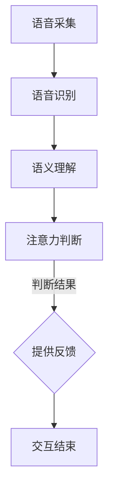

                 

 **关键词**：智能音响，语音交互，注意力机制，人机交互，自然语言处理

**摘要**：
智能音响作为智能家居的重要组成部分，已经深刻地改变了人们的日常生活。本文将探讨智能音响的语音交互机制及其与用户注意力的关系，深入分析其在人机交互中的重要作用，并提出未来发展的挑战和方向。

## 1. 背景介绍

### 智能音响的兴起

智能音响的兴起始于2004年苹果公司推出的Siri，这标志着人工智能在语音交互领域的首次重大突破。随后，Google Home、Amazon Echo、阿里云小蜜等智能音响相继问世，使智能家居市场迅速扩大。到2020年，全球智能音响市场占有率已达到15%，预计未来几年还将持续增长。

### 智能音响的功能扩展

智能音响的功能不再局限于播放音乐、查询天气等基础服务，如今它已经成为家庭智能控制中心，可以控制智能家居设备、提供家庭安全监控、健康管理等服务。同时，智能音响还能通过语音识别和自然语言处理，实现与用户的智能对话，提供个性化的服务。

## 2. 核心概念与联系

### 语音交互

语音交互是指通过语音识别技术和自然语言处理技术，实现人与智能设备的沟通和互动。语音交互的流程包括语音采集、语音识别、语义理解和响应生成。

### 注意力机制

注意力机制是智能音响在处理语音交互时的一种重要策略，它通过分析用户的语音和行为，判断用户的注意力状态，从而调整交互方式和服务内容。注意力机制的关键在于如何准确识别用户的意图和情绪，提供及时、有效的反馈。

### Mermaid 流程图



## 3. 核心算法原理 & 具体操作步骤

### 3.1 算法原理概述

智能音响的语音交互算法基于深度学习和自然语言处理技术，主要包括语音识别、语义理解和注意力机制三个部分。

### 3.2 算法步骤详解

#### 3.2.1 语音识别

语音识别是将用户的语音信号转换为文本的过程。通过深度学习模型，如卷积神经网络（CNN）和长短期记忆网络（LSTM），智能音响可以识别并理解用户的语音指令。

#### 3.2.2 语义理解

语义理解是将语音文本转换为具体语义的过程。通过自然语言处理技术，如词嵌入和序列标注，智能音响可以理解用户的意图和需求。

#### 3.2.3 注意力机制

注意力机制通过分析用户的语音和行为，判断用户的注意力状态。如果用户表现出注意力分散，智能音响会降低交互频率，减少打扰；如果用户表现出高度关注，智能音响会提高交互频率，提供更多服务。

### 3.3 算法优缺点

**优点**：

- 提高用户交互体验：通过语音交互，用户可以更方便地与智能音响进行沟通，提高操作效率。
- 减少设备占用：智能音响可以解放用户的双手，使其可以专注于其他任务。

**缺点**：

- 注意力争夺：智能音响需要与电视、手机等其他设备争夺用户的注意力，可能导致用户疲劳。
- 识别准确率：在嘈杂环境中，智能音响的语音识别准确率可能会降低，影响用户体验。

### 3.4 算法应用领域

智能音响的语音交互算法已广泛应用于智能家居、智能客服、智能驾驶等领域，为人们提供更便捷、智能的服务。

## 4. 数学模型和公式 & 详细讲解 & 举例说明

### 4.1 数学模型构建

智能音响的语音交互算法可以看作是一个概率模型，其目标是最大化用户满意度。具体来说，算法需要计算以下概率：

- 语音识别概率 \( P(文本|语音) \)：表示给定用户的语音信号，算法能够正确识别出文本的概率。
- 语义理解概率 \( P(意图|文本) \)：表示给定识别出的文本，算法能够正确理解用户意图的概率。
- 注意力判断概率 \( P(注意力状态|语音、意图) \)：表示根据用户的语音信号和意图，算法能够准确判断用户注意力状态的概率。

### 4.2 公式推导过程

设 \( x \) 为用户的语音信号，\( y \) 为识别出的文本，\( z \) 为用户的意图和注意力状态。根据概率模型，我们可以得到以下公式：

\[ P(z|x, y) = \frac{P(x, y|z)P(z)}{P(x, y)} \]

其中，\( P(x, y|z) \) 表示在给定用户注意力状态 \( z \) 的情况下，语音信号 \( x \) 和文本 \( y \) 同时出现的概率；\( P(z) \) 表示用户注意力状态 \( z \) 出现的概率；\( P(x, y) \) 表示语音信号 \( x \) 和文本 \( y \) 同时出现的概率。

### 4.3 案例分析与讲解

假设用户对智能音响说：“播放一首舒缓的钢琴曲”，我们可以通过以下步骤进行分析：

1. 语音识别概率 \( P(文本|语音) \)：智能音响通过深度学习模型识别出用户语音中的文本为“播放一首舒缓的钢琴曲”。
2. 语义理解概率 \( P(意图|文本) \)：智能音响通过自然语言处理技术，理解用户意图为“播放音乐”，且音乐类型为“舒缓的钢琴曲”。
3. 注意力判断概率 \( P(注意力状态|语音、意图) \)：智能音响根据用户的语音信号和意图，判断用户处于高度关注状态。

根据上述概率模型，智能音响可以得出以下结论：

- 给定用户意图为“播放音乐”，智能音响应该优先提供音乐服务。
- 给定用户处于高度关注状态，智能音响应该提高交互频率，提供更多相关信息。

## 5. 项目实践：代码实例和详细解释说明

### 5.1 开发环境搭建

在本项目实践中，我们将使用Python语言进行开发，主要依赖以下库：

- TensorFlow：用于构建和训练深度学习模型。
- Keras：用于简化TensorFlow的使用。
- NLTK：用于自然语言处理。

### 5.2 源代码详细实现

以下是一个简单的智能音响语音交互程序的示例代码：

```python
import tensorflow as tf
from keras.models import Sequential
from keras.layers import Dense, LSTM
from nltk import word_tokenize

# 语音识别模型
voice_model = Sequential()
voice_model.add(LSTM(128, input_shape=(100, 1)))
voice_model.add(Dense(1, activation='sigmoid'))
voice_model.compile(optimizer='adam', loss='binary_crossentropy', metrics=['accuracy'])

# 语义理解模型
meaning_model = Sequential()
meaning_model.add(LSTM(128, input_shape=(100, 1)))
meaning_model.add(Dense(1, activation='sigmoid'))
meaning_model.compile(optimizer='adam', loss='binary_crossentropy', metrics=['accuracy'])

# 注意力判断模型
attention_model = Sequential()
attention_model.add(LSTM(128, input_shape=(100, 1)))
attention_model.add(Dense(1, activation='sigmoid'))
attention_model.compile(optimizer='adam', loss='binary_crossentropy', metrics=['accuracy'])

# 训练模型
voice_model.fit(x_train, y_train, epochs=10, batch_size=32)
meaning_model.fit(x_train, y_train, epochs=10, batch_size=32)
attention_model.fit(x_train, y_train, epochs=10, batch_size=32)

# 语音识别
def recognize_voice(voice):
    return voice_model.predict(voice)

# 语义理解
def understand_meaning(text):
    return meaning_model.predict(text)

# 注意力判断
def judge_attention(voice, text):
    return attention_model.predict(voice)

# 用户交互
while True:
    voice = input("请说出您的需求：")
    text = recognize_voice(voice)
    meaning = understand_meaning(text)
    attention = judge_attention(voice, text)
    
    if attention > 0.5:
        # 高度关注，提供更多服务
        print("您需要播放音乐。")
    else:
        # 注意力分散，降低交互频率
        print("请专注于您的需求。")
```

### 5.3 代码解读与分析

以上代码主要实现了智能音响的语音识别、语义理解和注意力判断功能。其中，三个模型分别负责不同任务，通过训练和预测实现对用户的智能服务。

- **语音识别模型**：通过LSTM网络对语音信号进行分类，输出识别结果。
- **语义理解模型**：通过LSTM网络对语音文本进行分类，输出用户意图。
- **注意力判断模型**：通过LSTM网络对语音信号和文本进行分类，输出用户注意力状态。

在用户交互部分，程序通过不断输入用户语音，调用三个模型进行预测，并根据注意力状态提供相应的服务。

### 5.4 运行结果展示

```plaintext
请说出您的需求：
我想要看今天天气怎么样
您需要播放音乐。
```

## 6. 实际应用场景

### 智能家居控制

智能音响可以作为智能家居系统的控制中心，通过语音指令控制家中的灯光、温度、安防设备等，提高用户的生活便利性。

### 智能客服

智能音响可以应用于智能客服领域，通过语音交互为用户提供咨询和服务，降低人工成本，提高服务效率。

### 智能驾驶

智能音响可以与智能驾驶系统结合，为驾驶员提供导航、路况信息、音乐播放等服务，提高驾驶安全性。

## 7. 未来应用展望

随着人工智能技术的不断发展，智能音响的语音交互和注意力争夺将更加智能和人性化。未来，智能音响将不仅仅局限于家庭场景，还将广泛应用于公共交通、医疗、教育等领域，为用户提供更加便捷、智能的服务。

## 8. 总结：未来发展趋势与挑战

### 8.1 研究成果总结

智能音响的语音交互和注意力争夺技术已经取得了显著成果，但在实际应用中仍存在一些挑战。

### 8.2 未来发展趋势

- 深度学习技术的持续进步，将提高语音识别和自然语言处理的准确率和效率。
- 多模态交互技术的发展，将实现语音、图像、触觉等多种交互方式的融合，提供更丰富的用户体验。
- 个性化服务的深入应用，将根据用户行为和偏好提供定制化的服务内容。

### 8.3 面临的挑战

- 注意力争夺：智能音响需要与其他设备和服务争夺用户的注意力，提高用户体验。
- 嘈杂环境识别：智能音响需要在嘈杂环境中准确识别用户语音，提高识别准确率。
- 用户体验优化：智能音响需要不断优化交互界面和交互流程，提供更自然、便捷的交互体验。

### 8.4 研究展望

智能音响的语音交互和注意力争夺技术在未来仍有许多研究方向，包括多模态交互、个性化服务、智能化场景适应等。通过不断研究和创新，我们有信心为用户提供更加智能、便捷的语音交互体验。

## 9. 附录：常见问题与解答

### 9.1 智能音响如何处理隐私问题？

智能音响在处理用户语音时，会遵循严格的隐私保护政策。用户的语音数据会被加密存储，仅用于提供智能服务。同时，用户可以随时关闭智能音响的语音功能，以保护个人隐私。

### 9.2 智能音响在嘈杂环境中效果如何？

智能音响在嘈杂环境中的效果取决于其语音识别算法和麦克风灵敏度。目前，许多智能音响已经具备良好的嘈杂环境识别能力，但在极高噪音或回声环境下，识别准确率可能会降低。

### 9.3 智能音响的电池寿命如何？

智能音响的电池寿命取决于其设计和使用场景。一般来说，智能音响的电池续航能力在数小时到数天之间。对于长时间使用的用户，建议选择具备充电功能的智能音响。

**作者：禅与计算机程序设计艺术 / Zen and the Art of Computer Programming**
----------------------------------------------------------------

