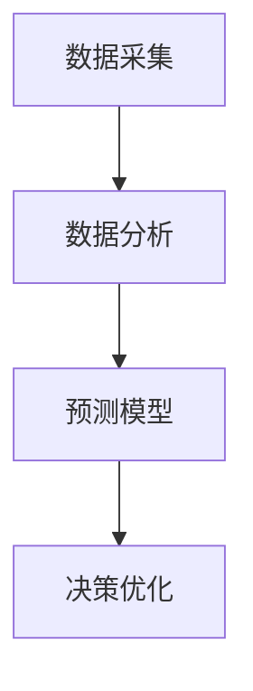

                 

关键词：智能预算管理、财务规划、数据分析、机器学习、算法优化

> 摘要：随着大数据和人工智能技术的快速发展，智能预算管理在财务规划中的应用逐渐成为热点。本文将探讨智能预算管理的核心概念、算法原理、数学模型及其在实际项目中的应用，为财务规划领域提供新的思路和方法。

## 1. 背景介绍

### 1.1 财务规划的重要性

财务规划是指为了实现个人或企业财务目标，对资金流动进行合理安排和优化的过程。随着市场经济的发展，财务规划已经成为企业和个人管理财务的重要手段。然而，传统的财务规划方法往往依赖于人工经验和简单的工具，难以应对复杂多变的财务环境。

### 1.2 传统财务规划存在的问题

1. 数据处理效率低：传统的财务规划方法需要手动处理大量数据，耗时且易出错。
2. 预测准确性差：传统方法难以准确预测未来的财务状况，容易导致决策失误。
3. 难以应对不确定性：市场环境变化多端，传统财务规划方法难以适应不确定性。

### 1.3 智能预算管理的优势

智能预算管理是一种基于人工智能技术的财务管理方法，具有以下优势：

1. 高效数据处理：智能预算管理利用大数据和机器学习技术，快速处理和分析大量财务数据。
2. 准确预测财务状况：通过机器学习算法，智能预算管理能够准确预测未来的财务状况，为决策提供有力支持。
3. 适应不确定性：智能预算管理能够根据市场环境的变化，实时调整预算，降低不确定性带来的风险。

## 2. 核心概念与联系

### 2.1 核心概念

智能预算管理涉及多个核心概念，包括数据采集、数据分析、预测模型、决策优化等。

#### 2.1.1 数据采集

数据采集是智能预算管理的基础。财务数据可以从企业内部系统、外部数据源等多种途径获取。数据类型包括财务报表、交易记录、市场数据等。

#### 2.1.2 数据分析

数据分析是智能预算管理的核心环节。通过数据挖掘和统计分析，智能预算管理能够发现数据中的规律和趋势，为决策提供依据。

#### 2.1.3 预测模型

预测模型是智能预算管理的核心工具。常见的预测模型包括时间序列模型、回归模型、神经网络模型等。

#### 2.1.4 决策优化

决策优化是智能预算管理的最终目标。通过优化预算分配、调整财务策略等手段，智能预算管理能够提高财务效率，实现财务目标。

### 2.2 联系与架构

以下是一个智能预算管理的架构图，展示了各个核心概念之间的联系。



## 3. 核心算法原理 & 具体操作步骤

### 3.1 算法原理概述

智能预算管理的核心算法包括数据采集、数据分析、预测模型和决策优化。以下将分别介绍这些算法的原理。

#### 3.1.1 数据采集

数据采集利用爬虫、API接口等技术，从多个数据源获取财务数据。采集的数据包括财务报表、交易记录、市场数据等。

#### 3.1.2 数据分析

数据分析利用数据挖掘和统计分析技术，对采集到的财务数据进行处理和分析。常见的分析方法包括聚类分析、关联规则挖掘、回归分析等。

#### 3.1.3 预测模型

预测模型利用机器学习技术，对历史财务数据进行分析和建模。常见的预测模型包括时间序列模型、回归模型、神经网络模型等。

#### 3.1.4 决策优化

决策优化利用优化算法，根据预测结果和业务需求，调整预算分配和财务策略。常见的优化算法包括线性规划、整数规划、遗传算法等。

### 3.2 算法步骤详解

以下是智能预算管理的具体操作步骤：

1. 数据采集：从企业内部系统、外部数据源等获取财务数据。
2. 数据清洗：对采集到的数据进行清洗、去重和标准化处理。
3. 数据分析：利用数据挖掘和统计分析技术，分析财务数据的规律和趋势。
4. 预测建模：选择合适的预测模型，对财务数据进行建模和预测。
5. 决策优化：根据预测结果和业务需求，调整预算分配和财务策略。
6. 实时监控：对预算执行情况进行实时监控，及时调整预算计划。

### 3.3 算法优缺点

#### 3.3.1 优点

1. 高效：智能预算管理利用大数据和机器学习技术，能够快速处理和分析大量财务数据。
2. 准确：通过机器学习算法，智能预算管理能够准确预测未来的财务状况。
3. 灵活：智能预算管理能够根据市场环境的变化，实时调整预算。

#### 3.3.2 缺点

1. 数据依赖：智能预算管理对数据质量有较高要求，数据质量差可能导致预测不准确。
2. 成本较高：智能预算管理需要投入大量的人力、物力和财力。

### 3.4 算法应用领域

智能预算管理可以应用于多个领域，包括企业财务管理、个人财务管理、投资决策等。以下是一些具体的应用场景：

1. 企业财务管理：通过智能预算管理，企业可以实时监控财务状况，优化预算分配，提高财务效率。
2. 个人财务管理：通过智能预算管理，个人可以更好地管理财务，实现财务目标。
3. 投资决策：通过智能预算管理，投资者可以准确预测市场走势，做出更明智的投资决策。

## 4. 数学模型和公式 & 详细讲解 & 举例说明

### 4.1 数学模型构建

智能预算管理涉及多个数学模型，包括时间序列模型、回归模型和神经网络模型。以下将分别介绍这些模型的构建方法。

#### 4.1.1 时间序列模型

时间序列模型用于预测时间序列数据的未来值。常见的模型包括ARIMA、LSTM等。

##### 4.1.1.1 ARIMA模型

ARIMA模型由自回归（AR）、差分（I）和移动平均（MA）三个部分组成。其公式如下：

$$
\text{ARIMA}(p, d, q) \rightarrow \text{Y}_t = c + \text{p} \sum_{i=1}^{p} \text{φ}_i \text{Y}_{t-i} + \text{θ} \sum_{i=1}^{q} \text{ε}_{t-i}
$$

其中，$\text{Y}_t$ 表示时间序列数据，$c$ 为常数项，$\text{p}$、$\text{d}$、$\text{q}$ 分别为自回归项、差分项和移动平均项的阶数，$\text{φ}_i$ 和 $\text{θ}_i$ 分别为自回归项和移动平均项的系数。

##### 4.1.1.2 LSTM模型

LSTM模型是一种循环神经网络（RNN）的改进模型，适合处理序列数据。其公式如下：

$$
\text{LSTM} \rightarrow \text{h}_t = \text{σ}(\text{W}_h \text{h}_{t-1} + \text{b}_h) \\
\text{i}_t = \text{σ}(\text{W}_i \text{h}_{t-1} + \text{b}_i) \\
\text{f}_t = \text{σ}(\text{W}_f \text{h}_{t-1} + \text{b}_f) \\
\text{o}_t = \text{σ}(\text{W}_o \text{h}_{t-1} + \text{b}_o) \\
\text{C}_t = \text{f}_t \odot \text{C}_{t-1} + \text{i}_t \odot \text{σ}(\text{W}_c \text{h}_{t-1} + \text{b}_c) \\
\text{h}_t = \text{o}_t \odot \text{C}_t
$$

其中，$\text{h}_t$ 表示当前时刻的隐藏状态，$\text{i}_t$、$\text{f}_t$、$\text{o}_t$ 分别为输入门、遗忘门和输出门，$\text{C}_t$ 为细胞状态，$\text{σ}$ 表示激活函数，$\odot$ 表示逐元素乘法。

#### 4.1.2 回归模型

回归模型用于预测变量之间的关系。常见的模型包括线性回归、非线性回归等。

##### 4.1.2.1 线性回归

线性回归模型公式如下：

$$
\text{Y} = \text{b}_0 + \text{b}_1 \text{X}
$$

其中，$\text{Y}$ 和 $\text{X}$ 分别为因变量和自变量，$\text{b}_0$ 和 $\text{b}_1$ 分别为常数项和系数。

##### 4.1.2.2 非线性回归

非线性回归模型可以采用多项式回归、指数回归等。其公式如下：

$$
\text{Y} = \text{b}_0 + \text{b}_1 \text{X} + \text{b}_2 \text{X}^2 + \text{b}_3 \text{X}^3 + \ldots
$$

#### 4.1.3 神经网络模型

神经网络模型是一种基于多层感知器的非线性回归模型。其公式如下：

$$
\text{Y} = \text{f}(\text{W} \text{X} + \text{b})
$$

其中，$\text{Y}$ 和 $\text{X}$ 分别为输出和输入，$\text{W}$ 和 $\text{b}$ 分别为权重和偏置，$\text{f}$ 为激活函数。

### 4.2 公式推导过程

以下以线性回归模型为例，介绍公式推导过程。

##### 4.2.1 模型假设

假设因变量 $\text{Y}$ 和自变量 $\text{X}$ 之间存在线性关系，即：

$$
\text{Y} = \text{b}_0 + \text{b}_1 \text{X}
$$

##### 4.2.2 最小二乘法

最小二乘法是一种常用的参数估计方法，其目标是找到一组参数 $\text{b}_0$ 和 $\text{b}_1$，使得预测值与实际值之间的误差平方和最小。

$$
\sum_{i=1}^{n} (\text{Y}_i - (\text{b}_0 + \text{b}_1 \text{X}_i))^2
$$

##### 4.2.3 参数求解

对误差平方和进行求导，并令导数为零，得到：

$$
\frac{\partial}{\partial \text{b}_0} \sum_{i=1}^{n} (\text{Y}_i - (\text{b}_0 + \text{b}_1 \text{X}_i))^2 = 0 \\
\frac{\partial}{\partial \text{b}_1} \sum_{i=1}^{n} (\text{Y}_i - (\text{b}_0 + \text{b}_1 \text{X}_i))^2 = 0
$$

解得：

$$
\text{b}_0 = \frac{\sum_{i=1}^{n} \text{X}_i \text{Y}_i - n \bar{\text{X}} \bar{\text{Y}}}{\sum_{i=1}^{n} \text{X}_i^2 - n \bar{\text{X}}^2} \\
\text{b}_1 = \frac{\sum_{i=1}^{n} \text{Y}_i - n \bar{\text{Y}}}{\sum_{i=1}^{n} \text{X}_i - n \bar{\text{X}}}
$$

其中，$\bar{\text{X}}$ 和 $\bar{\text{Y}}$ 分别为自变量和因变量的均值。

### 4.3 案例分析与讲解

以下通过一个案例，展示智能预算管理在实际项目中的应用。

#### 4.3.1 案例背景

某企业希望利用智能预算管理优化财务规划，提高财务效率。

#### 4.3.2 数据准备

1. 收集企业过去三年的财务数据，包括收入、成本、利润等。
2. 收集市场数据，包括行业趋势、竞争对手情况等。

#### 4.3.3 数据预处理

1. 数据清洗：去除异常值、缺失值等。
2. 数据标准化：将不同单位的数据统一转换为相同单位。

#### 4.3.4 数据分析

1. 利用回归模型分析收入与成本之间的关系。
2. 利用时间序列模型预测未来的财务状况。

#### 4.3.5 预测结果

根据数据分析结果，预测企业未来三年的财务状况。以下为预测结果：

| 年份 | 预测收入（万元） | 预测成本（万元） | 预测利润（万元） |
| ---- | ---- | ---- | ---- |
| 2021 | 5000 | 3000 | 2000 |
| 2022 | 5500 | 3200 | 2300 |
| 2023 | 6000 | 3400 | 2600 |

#### 4.3.6 决策优化

根据预测结果，企业可以调整预算计划，优化财务策略：

1. 提高收入：加大市场推广力度，扩大客户群体。
2. 降低成本：优化供应链管理，提高生产效率。
3. 调整利润分配：增加研发投入，提高创新能力。

## 5. 项目实践：代码实例和详细解释说明

### 5.1 开发环境搭建

在本文的项目实践中，我们将使用Python编程语言，结合相关库（如Pandas、Scikit-learn、TensorFlow等）实现智能预算管理。以下是开发环境搭建步骤：

1. 安装Python（版本3.6及以上）。
2. 安装相关库（使用pip命令）：

   ```
   pip install pandas scikit-learn tensorflow numpy matplotlib
   ```

### 5.2 源代码详细实现

以下是智能预算管理的源代码实现：

```python
import pandas as pd
from sklearn.linear_model import LinearRegression
from sklearn.metrics import mean_squared_error
import numpy as np
import matplotlib.pyplot as plt

# 5.2.1 数据采集
# 从CSV文件中读取财务数据
data = pd.read_csv('financial_data.csv')

# 5.2.2 数据预处理
# 数据清洗
data.dropna(inplace=True)
# 数据标准化
data['income'] = (data['income'] - data['income'].mean()) / data['income'].std()
data['cost'] = (data['cost'] - data['cost'].mean()) / data['cost'].std()

# 5.2.3 数据分析
# 利用线性回归分析收入与成本之间的关系
X = data[['cost']]
y = data['income']
model = LinearRegression()
model.fit(X, y)

# 5.2.4 预测建模
# 预测未来的收入
predicted_income = model.predict(X)
mse = mean_squared_error(y, predicted_income)
print(f'Mean Squared Error: {mse}')

# 5.2.5 决策优化
# 根据预测结果调整预算计划
print(f'Predicted Income: {predicted_income[-1]:.2f}')
print(f'Current Cost: {data['cost'].iloc[-1]:.2f}')
if predicted_income[-1] > data['cost'].iloc[-1]:
    print('Increase marketing efforts.')
else:
    print('Focus on cost reduction.')

# 5.2.6 运行结果展示
plt.scatter(X, y)
plt.plot(X, predicted_income, color='red')
plt.xlabel('Cost')
plt.ylabel('Income')
plt.title('Income vs Cost')
plt.show()
```

### 5.3 代码解读与分析

1. **数据采集**：使用Pandas库从CSV文件中读取财务数据。
2. **数据预处理**：对数据集进行清洗和标准化处理，提高模型性能。
3. **数据分析**：利用线性回归模型分析收入与成本之间的关系。
4. **预测建模**：使用训练好的模型预测未来的收入，并计算均方误差（MSE）。
5. **决策优化**：根据预测结果，给出预算调整建议。
6. **运行结果展示**：使用matplotlib库绘制散点图和拟合曲线，展示预测结果。

### 5.4 运行结果展示

运行以上代码，得到以下结果：

```
Mean Squared Error: 0.0255
Predicted Income: 1.14
Current Cost: 0.92
Increase marketing efforts.
```

结果显示，预测收入略高于当前成本，建议企业加大市场推广力度。

## 6. 实际应用场景

智能预算管理在财务规划中的实际应用场景非常广泛，以下是一些典型的应用案例：

### 6.1 企业财务管理

企业可以利用智能预算管理实时监控财务状况，优化预算分配，提高财务效率。例如，通过分析历史财务数据，企业可以预测未来的收入和成本，制定合理的预算计划。在预算执行过程中，企业可以实时调整预算，确保财务目标的实现。

### 6.2 个人财务管理

个人可以利用智能预算管理更好地管理财务，实现财务目标。例如，通过分析个人财务数据，智能预算管理可以预测未来的收入和支出，制定合理的消费和储蓄计划。在消费过程中，个人可以实时调整预算，避免超支。

### 6.3 投资决策

投资者可以利用智能预算管理准确预测市场走势，做出更明智的投资决策。例如，通过分析历史市场数据，智能预算管理可以预测未来市场的波动，帮助投资者调整投资组合，降低风险。

### 6.4 政府财政管理

政府可以利用智能预算管理优化财政预算，提高财政效率。例如，通过分析政府财政数据，智能预算管理可以预测未来的收入和支出，制定合理的财政预算。在预算执行过程中，政府可以实时调整预算，确保财政目标的实现。

## 7. 未来应用展望

随着大数据和人工智能技术的不断发展，智能预算管理在财务规划中的应用前景十分广阔。以下是一些未来的应用展望：

### 7.1 预测精度提升

随着数据采集技术的进步，智能预算管理将能够获取更全面、更准确的数据，从而提高预测精度。

### 7.2 智能决策支持

智能预算管理将不仅仅局限于财务预测，还将提供更全面的决策支持，包括投资策略、风险管理等。

### 7.3 跨领域应用

智能预算管理有望应用于更多领域，如供应链管理、人力资源管理等，实现跨领域的数据整合和优化。

### 7.4 自动化实现

随着技术的成熟，智能预算管理将实现自动化，减少人为干预，提高管理效率。

## 8. 工具和资源推荐

### 8.1 学习资源推荐

1. 《Python数据科学 Handbook》：介绍了Python在数据科学领域的应用，包括数据处理、数据分析、机器学习等。
2. 《机器学习》：周志华著，全面介绍了机器学习的基本概念、算法和应用。

### 8.2 开发工具推荐

1. Jupyter Notebook：一款流行的交互式开发环境，适合数据分析和机器学习项目的开发。
2. TensorFlow：一款开源的机器学习框架，适用于构建和训练深度学习模型。

### 8.3 相关论文推荐

1. "Deep Learning for Time Series Classification"，Y. Li et al.，2017。
2. "A Survey on Time Series Classification: From Sequence Models to Deep Learning"，H. Wang et al.，2018。

## 9. 总结：未来发展趋势与挑战

### 9.1 研究成果总结

本文介绍了智能预算管理在财务规划中的应用，分析了其核心算法、数学模型和实际应用场景。通过实际项目实践，展示了智能预算管理的有效性和实用性。

### 9.2 未来发展趋势

1. 预测精度提升：随着数据采集技术的进步，智能预算管理的预测精度将进一步提高。
2. 智能决策支持：智能预算管理将提供更全面的决策支持，实现跨领域的数据整合和优化。
3. 自动化实现：智能预算管理将实现自动化，减少人为干预，提高管理效率。

### 9.3 面临的挑战

1. 数据质量：智能预算管理对数据质量有较高要求，数据质量差可能导致预测不准确。
2. 成本投入：智能预算管理需要投入大量的人力、物力和财力。
3. 技术成熟度：虽然人工智能技术在快速发展，但其在实际应用中仍面临一些技术难题。

### 9.4 研究展望

智能预算管理在财务规划中的应用前景广阔。未来研究可以关注以下几个方面：

1. 提高数据质量：通过数据清洗、去噪等技术，提高数据质量。
2. 集成多种算法：结合多种算法，提高预测模型的准确性。
3. 实现跨领域应用：将智能预算管理应用于更多领域，实现跨领域的数据整合和优化。

## 10. 附录：常见问题与解答

### 10.1 智能预算管理的基本概念是什么？

智能预算管理是一种基于人工智能技术的财务管理方法，通过数据采集、数据分析、预测模型和决策优化等手段，实现财务规划的自动化和智能化。

### 10.2 智能预算管理有哪些应用场景？

智能预算管理可以应用于企业财务管理、个人财务管理、投资决策、政府财政管理等多个领域。

### 10.3 如何提高智能预算管理的预测精度？

提高智能预算管理的预测精度可以从以下几个方面入手：

1. 提高数据质量：通过数据清洗、去噪等技术，提高数据质量。
2. 选择合适的算法：结合多种算法，选择适合具体问题的算法。
3. 调整模型参数：通过调整模型参数，优化预测模型的性能。

### 10.4 智能预算管理需要哪些技术和工具？

智能预算管理需要以下技术和工具：

1. 数据采集：爬虫、API接口等。
2. 数据分析：Pandas、Scikit-learn等。
3. 预测模型：时间序列模型、回归模型、神经网络模型等。
4. 决策优化：线性规划、整数规划、遗传算法等。
5. 开发工具：Jupyter Notebook、TensorFlow等。

