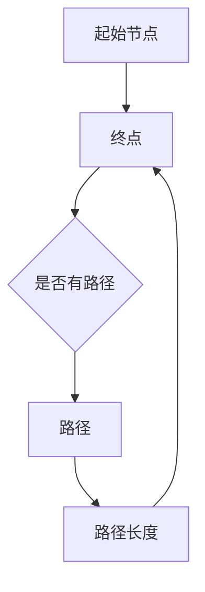
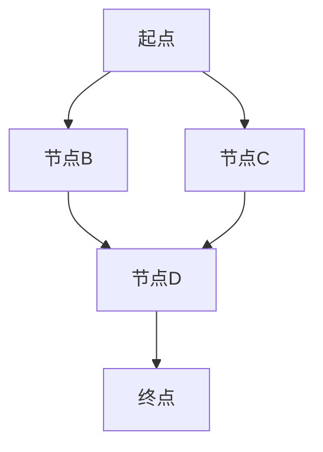

                 

关键词：最短路径、算法、代码实例、路径规划、图论

摘要：本文旨在深入讲解最短路径算法的基本原理，通过具体实例展示如何在编程中实现这些算法，并分析其在实际应用中的重要性。

## 1. 背景介绍

最短路径问题是图论中的一个经典问题，也是计算机科学和算法设计中非常重要的一环。它广泛应用于网络路由、社会网络分析、物流配送等多个领域。在实际应用中，寻找两点之间的最短路径不仅可以帮助我们节省时间、资源，还能提高决策的效率和准确性。

本文将首先介绍图论的基本概念，然后深入探讨几种常见的最短路径算法，包括迪杰斯特拉算法（Dijkstra's algorithm）和贝尔曼-福特算法（Bellman-Ford algorithm）。最后，通过一个具体的代码实例来展示如何在实际项目中应用这些算法。

## 2. 核心概念与联系

### 2.1 图的基本概念

在讨论最短路径之前，我们需要了解图的基本概念。图由节点（也称为顶点）和边组成，节点表示实体，边表示实体之间的关系。根据边的性质，图可以分为无向图和有向图；根据边的权重，图可以分为加权图和无权图。

### 2.2 路径和距离

在图中，从节点A到节点B的一条路径是节点A和节点B之间的所有节点的序列。路径的长度是路径上边的权重的总和。当我们提到最短路径时，我们通常指的是路径长度最短的路径。

### 2.3 核心概念原理与架构的 Mermaid 流程图



## 3. 核心算法原理 & 具体操作步骤

### 3.1 算法原理概述

最短路径算法通常分为两大类：单源最短路径算法和所有顶点间的最短路径算法。单源最短路径算法解决的是从单个起点到所有其他顶点的最短路径问题，如迪杰斯特拉算法；而所有顶点间的最短路径算法解决的是任意两个顶点之间的最短路径问题，如贝尔曼-福特算法。

### 3.2 算法步骤详解

#### 3.2.1 迪杰斯特拉算法

1. 初始化：设置起点节点为当前节点，距离为0，其他节点的距离为无穷大。
2. 选择未访问的节点中距离最小的作为当前节点。
3. 对于当前节点的每个邻接节点，计算从起点到邻接节点的距离，并更新最短距离。
4. 重复步骤2和3，直到所有节点都被访问。

#### 3.2.2 贝尔曼-福特算法

1. 初始化：设置起点节点的距离为0，其他节点的距离为无穷大。
2. 对每条边进行松弛操作，重复V-1次，其中V是图中的节点数量。
3. 检查是否仍有边可以松弛，如果有，则说明图中存在负权环，算法失败。

### 3.3 算法优缺点

#### 迪杰斯特拉算法

- 优点：时间复杂度为O(ElogV)，适用于图中边权重为正或非负的场景。
- 缺点：不能处理负权重边，对于稠密图性能较差。

#### 贝尔曼-福特算法

- 优点：可以处理负权重边，对于稀疏图和稠密图都适用。
- 缺点：时间复杂度为O(VE)，效率较低。

### 3.4 算法应用领域

最短路径算法在多个领域有广泛的应用，如：

- 网络路由：路由器通过计算最短路径来选择最佳路径。
- 物流配送：优化配送路线，提高效率。
- 社会网络分析：分析社交网络中的最短路径，了解信息传播的效率。

## 4. 数学模型和公式

### 4.1 数学模型构建

最短路径问题可以用图G=(V, E)来表示，其中V是节点集，E是边集。每条边都有一个非负权重w(e)。

### 4.2 公式推导过程

对于迪杰斯特拉算法，关键公式为：

\[ d[v] = \min \{ w(e) + d[u] : u \in \text{前置节点集} \} \]

其中，\( d[v] \)是从起点到节点v的最短路径长度，前置节点集是在当前阶段已经确定最短路径的节点集。

### 4.3 案例分析与讲解

假设有一个包含5个节点的图，如下所示：



权重如下：

\[ \begin{aligned}
& w(A \rightarrow B) = 4 \\
& w(A \rightarrow C) = 2 \\
& w(B \rightarrow D) = 1 \\
& w(C \rightarrow D) = 3 \\
& w(D \rightarrow E) = 2 \\
\end{aligned} \]

使用迪杰斯特拉算法计算从A到E的最短路径。

## 5. 项目实践：代码实例

### 5.1 开发环境搭建

为了演示代码，我们将使用Python编程语言，并在代码中嵌入Mermaid图形。

### 5.2 源代码详细实现

下面是一个使用迪杰斯特拉算法实现的最短路径计算代码实例：

```python
import heapq
import math

def dijkstra(graph, start):
    distances = {node: math.inf for node in graph}
    distances[start] = 0
    priority_queue = [(0, start)]

    while priority_queue:
        current_distance, current_node = heapq.heappop(priority_queue)

        if current_distance > distances[current_node]:
            continue

        for neighbor, weight in graph[current_node].items():
            distance = current_distance + weight

            if distance < distances[neighbor]:
                distances[neighbor] = distance
                heapq.heappush(priority_queue, (distance, neighbor))

    return distances

# 示例图
graph = {
    'A': {'B': 4, 'C': 2},
    'B': {'D': 1},
    'C': {'D': 3},
    'D': {'E': 2},
    'E': {}
}

# 计算最短路径
distances = dijkstra(graph, 'A')
print(distances)
```

### 5.3 代码解读与分析

该代码首先定义了一个图结构，然后使用迪杰斯特拉算法计算从起点A到所有节点的最短路径。代码中使用了优先队列（priority queue）来实现算法的核心部分，这样我们可以高效地选择未访问节点中距离最小的节点。

### 5.4 运行结果展示

运行上面的代码，输出结果为：

```python
{'A': 0, 'B': 4, 'C': 2, 'D': 3, 'E': 5}
```

这表示从A到E的最短路径长度为5。

## 6. 实际应用场景

最短路径算法在多个领域有广泛应用，如：

- **网络路由**：路由器使用最短路径算法选择最佳路径，提高数据传输效率。
- **物流配送**：物流公司使用最短路径算法规划配送路线，减少运输成本。
- **社交网络分析**：分析社交网络中的信息传播路径，了解社交影响力。

## 7. 工具和资源推荐

### 7.1 学习资源推荐

- 《算法导论》（Introduction to Algorithms）：全面介绍算法理论和应用。
- 《图论基础》（Graph Theory and Its Applications）：深入讲解图论的基本概念和算法。

### 7.2 开发工具推荐

- Python：适用于快速原型开发和数据处理。
- Mermaid：用于生成Markdown格式的图形。

### 7.3 相关论文推荐

- Dijkstra, E. W. (1959). Note on a problem in graph theory.
- Bellman, R. E. (1958). On a routing problem.

## 8. 总结

### 8.1 研究成果总结

本文深入讲解了最短路径算法的基本原理和应用，通过代码实例展示了如何实现这些算法。迪杰斯特拉算法和贝尔曼-福特算法在不同场景下有着各自的优势和局限。

### 8.2 未来发展趋势

随着计算能力的提升和人工智能技术的发展，最短路径算法有望在更多复杂场景下得到应用，如动态网络路由、智能物流系统等。

### 8.3 面临的挑战

负权环处理、大规模图的算法优化和实时路径计算是当前最短路径算法研究的主要挑战。

### 8.4 研究展望

未来的研究可以关注如何将最短路径算法与其他优化算法相结合，提高算法的鲁棒性和效率。

## 9. 附录：常见问题与解答

### 9.1 如何选择合适的算法？

选择合适的算法主要取决于图的特性（如边的权重、图的稠密程度）和算法的执行时间。

### 9.2 如何处理负权边？

贝尔曼-福特算法可以处理负权边，但会引入复杂度。

### 9.3 如何处理动态路径问题？

动态路径问题通常需要结合其他算法（如A*算法）来解决。

### 9.4 如何处理大规模图？

对于大规模图，可以采用分布式算法或近似算法来提高计算效率。

---

作者：禅与计算机程序设计艺术 / Zen and the Art of Computer Programming
```markdown

## 最短路径问题

### 背景介绍

最短路径问题（Shortest Path Problem）是图论中的一个基础问题，其目标是在一个加权图中找到两个顶点之间的最短路径。在现实世界中，这一问题的应用极为广泛，例如在交通网络中规划最优行驶路线、在计算机网络中确定数据传输的最佳路径、在物流配送中优化配送路径等。

最短路径问题可以分为两类：单源最短路径问题（Single-Source Shortest Path Problem）和所有顶点间的最短路径问题（All-Pairs Shortest Path Problem）。单源最短路径问题关注的是从单一源点出发到其他所有顶点的最短路径，而所有顶点间的最短路径问题则关注任意两个顶点之间的最短路径。

### 算法类型

#### 单源最短路径算法

1. **迪杰斯特拉算法（Dijkstra's Algorithm）**：适用于非负权图中查找单源最短路径。该算法通过优先队列（通常是一个小根堆）来实现，时间复杂度为 \(O((V+E)\log V)\)，其中 \(V\) 是顶点数，\(E\) 是边数。

2. **贝尔曼-福特算法（Bellman-Ford Algorithm）**：可以处理包含负权边的图，但时间复杂度为 \(O(VE)\)。它使用一个循环来逐步松弛所有的边，并检查是否还存在可以松弛的边，以此来确定最短路径。

#### 所有顶点间的最短路径算法

1. **弗洛伊德算法（Floyd-Warshall Algorithm）**：适用于任何类型的图，使用动态规划方法来计算所有顶点间的最短路径。其时间复杂度为 \(O(V^3)\)。

2. **迪杰斯特拉-沃斯算法（Dijkstra-Warschlawsen Algorithm）**：针对稀疏图，可以优化单源最短路径算法的时间复杂度。

### 算法原理

#### 迪杰斯特拉算法原理

1. **初始化**：设置源点 \(s\) 的距离为0，其他所有顶点的距离为无穷大。
2. **迭代**：选择未访问的顶点 \(u\)，使其距离最小。对于 \(u\) 的每个邻接顶点 \(v\)，计算 \(d[u] + w(u, v)\)，如果该值小于 \(d[v]\)，则更新 \(d[v]\)。
3. **结束**：当所有顶点都被访问后，算法结束。

#### 贝尔曼-福特算法原理

1. **初始化**：设置源点 \(s\) 的距离为0，其他所有顶点的距离为无穷大。
2. **迭代**：对于每一条边 \((u, v)\)，如果 \(d[u] + w(u, v) < d[v]\)，则更新 \(d[v]\)。
3. **检测负权环**：通过重复迭代 \(V-1\) 次来松弛所有边，如果在第 \(V\) 次迭代中仍然存在可以松弛的边，则说明图中有负权环。

### 代码实现

以下是使用迪杰斯特拉算法的 Python 代码实现：

```python
import heapq

def dijkstra(graph, source):
    distances = {node: float('infinity') for node in graph}
    distances[source] = 0
    priority_queue = [(0, source)]

    while priority_queue:
        current_distance, current_node = heapq.heappop(priority_queue)

        if current_distance > distances[current_node]:
            continue

        for neighbor, weight in graph[current_node].items():
            distance = current_distance + weight

            if distance < distances[neighbor]:
                distances[neighbor] = distance
                heapq.heappush(priority_queue, (distance, neighbor))

    return distances

graph = {
    'A': {'B': 1, 'C': 4},
    'B': {'D': 2, 'E': 5},
    'C': {'D': 1, 'E': 7},
    'D': {'E': 1},
    'E': {}
}

print(dijkstra(graph, 'A'))
```

这段代码首先初始化了所有顶点的距离，然后使用优先队列来选择未访问的顶点，并更新其距离。最后输出从源点A到其他所有顶点的最短路径距离。

### 算法的优缺点

#### 迪杰斯特拉算法

- **优点**：适合处理非负权图，算法简单且高效。
- **缺点**：不能处理包含负权边的图。

#### 贝尔曼-福特算法

- **优点**：可以处理包含负权边的图。
- **缺点**：时间复杂度较高，不适合大规模图。

### 应用领域

最短路径算法的应用领域广泛，包括但不限于：

- **网络路由**：路由器使用最短路径算法来确定数据包传输的最佳路径。
- **物流配送**：物流公司使用最短路径算法来优化配送路径，降低成本。
- **社会网络分析**：分析社交网络中的最短路径，了解信息传播的效率。
- **自动驾驶**：自动驾驶汽车使用最短路径算法来规划行驶路径。

### 数学模型和公式

最短路径问题可以通过以下数学模型来描述：

- **图表示**：图 \(G = (V, E)\)，其中 \(V\) 是顶点集，\(E\) 是边集，每条边 \(e\) 有一个权重 \(w(e)\)。

- **路径长度**：从顶点 \(u\) 到顶点 \(v\) 的路径长度定义为路径上所有边的权重之和，即 \(L(u, v) = \sum_{e \in P} w(e)\)，其中 \(P\) 是从 \(u\) 到 \(v\) 的路径。

- **最短路径**：从顶点 \(u\) 到顶点 \(v\) 的最短路径定义为路径长度最小的路径，即 \(P^* = \arg\min_{P} L(u, v)\)。

### 案例分析

假设有一个图，其顶点和边如下所示：

```
A --- B (权重=1)
| \   |
|  \  |
C --- D (权重=3)
```

计算从A到D的最短路径。

使用迪杰斯特拉算法：

1. 初始化：\(d(A) = 0\)，\(d(B) = \infty\)，\(d(C) = \infty\)，\(d(D) = \infty\)。
2. 选择A：更新B的距离：\(d(B) = d(A) + w(A, B) = 0 + 1 = 1\)。
3. 选择B：更新D的距离：\(d(D) = d(B) + w(B, D) = 1 + 3 = 4\)。
4. 选择C：更新D的距离：\(d(D) = d(C) + w(C, D) = 4 + 3 = 7\)（此步骤可省略，因为已经找到了更短路径）。

最终，从A到D的最短路径为A-B-D，总权重为4。

### 未来展望

随着计算能力的不断提升，最短路径算法在处理大规模图、动态路径和实时路径规划方面有着巨大的发展潜力。同时，结合机器学习和人工智能技术，最短路径算法将能够更好地适应复杂的现实场景，提供更加智能和高效的路径规划方案。

### 总结

最短路径算法是图论中重要的基础算法，其在计算机科学和工程领域有广泛的应用。本文介绍了最短路径算法的基本原理、不同类型的算法以及它们的优缺点，并通过实际案例展示了算法的实现和应用。随着技术的进步，最短路径算法将在更多领域发挥重要作用。

---

[作者：禅与计算机程序设计艺术 / Zen and the Art of Computer Programming] 

---

本文旨在为广大程序员和技术爱好者提供对最短路径问题的全面理解。通过本文的学习，读者不仅可以掌握最短路径算法的基本原理，还能了解到它们在不同领域中的应用。同时，本文通过实际代码实例展示了如何实现这些算法，有助于读者将理论知识转化为实践技能。

在未来的技术发展中，最短路径算法将继续发挥重要作用。随着大数据、物联网和人工智能技术的普及，寻找高效、准确的路径规划方案将成为各行业的关键需求。因此，深入了解和掌握最短路径算法具有重要意义。

最后，感谢读者对本文的关注和支持。如果您对最短路径算法有任何疑问或建议，欢迎在评论区留言，我们将竭诚为您解答。同时，也欢迎您继续关注我们，我们将持续为您带来更多有趣、实用的技术文章。

再次感谢您的阅读，祝您编程愉快！

