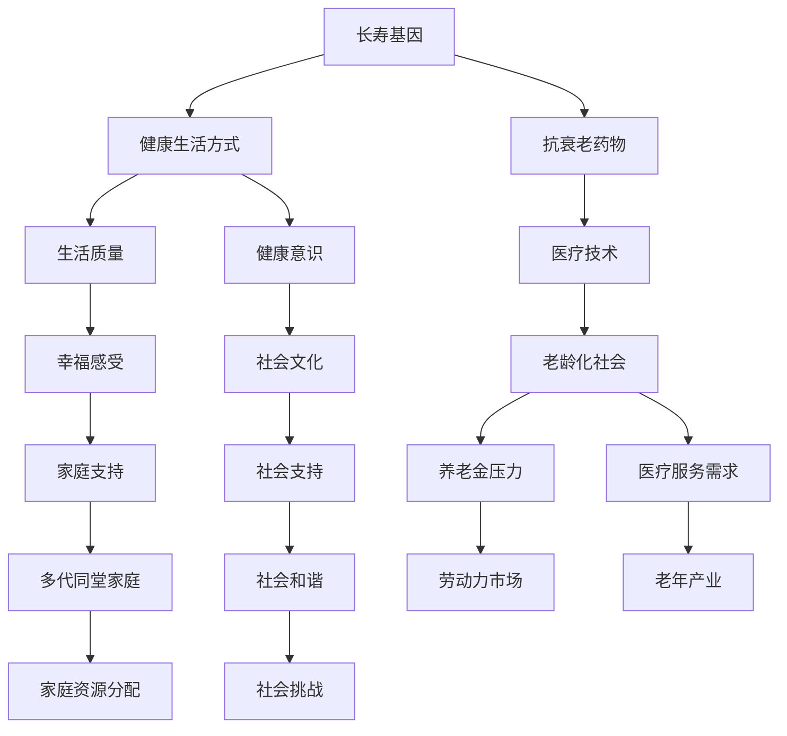
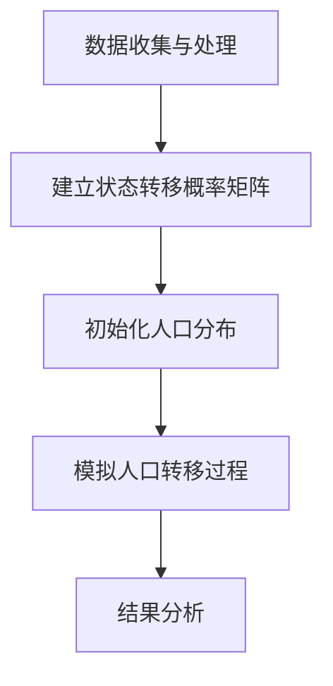

                 

关键词：人口结构，百岁人生，多代同堂，社会变革，技术进步，可持续发展

> 摘要：随着科技的迅猛发展，人类社会正在经历一场深刻的变革。本文探讨了2050年的人口结构预测，特别是百岁人生的兴起以及多代同堂社会的趋势。通过分析这些变化，我们试图揭示未来社会的潜在挑战与机遇，并提出相应的策略和解决方案。

## 1. 背景介绍

在过去的几十年中，全球人口结构发生了显著的变化。随着医疗技术的进步和生活方式的改善，人类的平均寿命不断延长。如今，越来越多的国家和地区已经出现了百岁老人。据联合国预测，到2050年，全球百岁老人的人数将达到数百万，这一数字将是现在的十倍之多。

与此同时，随着人口老龄化问题的日益严重，多代同堂的家庭模式也在逐渐复兴。这种家庭结构不仅有助于缓解养老压力，还可以促进家庭成员之间的情感联系和社会支持。然而，这种趋势也带来了一系列的挑战，包括家庭资源的分配、居住空间的规划以及社会服务的提供等。

### 人口结构变化

- **人口老龄化**：随着生育率的下降和人均寿命的延长，全球人口老龄化问题日益严重。许多国家面临着老年人口比例增加、劳动力减少、养老金系统压力增大的问题。
- **生育率下降**：生育率的下降不仅影响了人口结构的平衡，还可能导致劳动力市场的紧缩和人口红利的消失。许多国家已经开始采取一系列措施鼓励生育，如提供生育补贴、改善育儿环境等。
- **人口红利**：在一些发展中国家，年轻人口的比例仍然较高，这被称为“人口红利”。然而，这种红利并非永续，随着经济的发达和生活方式的改变，生育率也会下降。

### 多代同堂家庭趋势

- **家庭结构变化**：随着城市化进程的加速，传统的家庭结构正在发生变化。多代同堂的家庭模式在许多文化中逐渐复兴，成为应对老龄化问题和家庭支持需求的一种方式。
- **居住模式**：多代同堂家庭需要考虑居住空间的规划，如何实现家庭成员之间的独立性与互动性，如何在有限的居住空间中满足不同年龄段的需求。
- **社会支持**：多代同堂家庭不仅可以提供经济上的支持，还可以在情感上给予老年人和年轻人更多的关怀。然而，这也需要家庭成员之间的良好沟通和协调。

## 2. 核心概念与联系

为了深入探讨未来的人口结构，我们需要了解一些核心概念，包括长寿基因、健康生活方式、老龄化社会以及多代同堂家庭等。

### 长寿基因

长寿基因是指那些与人类寿命相关的基因。科学研究已经发现，某些基因变异与长寿有关。例如，DNA修复基因、代谢调节基因等。了解这些基因对于开发抗衰老药物和改善健康生活方式具有重要意义。

### 健康生活方式

健康生活方式包括均衡饮食、适度运动、充足睡眠、减少压力等。这些生活方式的改善不仅能够延长寿命，还能提高生活质量。随着人们对健康意识的提高，越来越多的人开始关注健康生活方式。

### 老龄化社会

老龄化社会是指老年人口比例不断增加，劳动力人口比例逐渐下降的社会。老龄化社会带来了许多挑战，如养老金制度的压力、医疗服务需求的增加、劳动力市场的紧缩等。同时，老龄化社会也带来了机遇，如老年产业的兴起、银发经济的潜力等。

### 多代同堂家庭

多代同堂家庭是指多个代际的成员共同居住在一起的家庭。这种家庭模式有助于缓解养老压力，提供社会支持，促进家庭成员之间的情感联系。然而，多代同堂家庭也面临一些挑战，如家庭资源分配、居住空间规划等。

### 核心概念架构

以下是一个使用Mermaid绘制的流程图，展示了核心概念之间的联系：



### 核心概念流程图


通过这个流程图，我们可以更清晰地理解长寿基因、健康生活方式、老龄化社会以及多代同堂家庭之间的关系。这些核心概念相互影响，共同塑造了未来的人口结构。

## 3. 核心算法原理 & 具体操作步骤

### 3.1 算法原理概述

为了更好地理解和预测未来的人口结构，我们需要借助一些数学模型和算法。其中，马尔可夫链模型是一种常用的预测工具。马尔可夫链模型基于状态转移概率矩阵，可以模拟人口在不同年龄阶段的转移过程。

### 3.2 算法步骤详解

1. **数据收集与处理**：首先，我们需要收集有关人口年龄结构的数据，包括出生率、死亡率、迁移率等。这些数据可以通过政府统计部门、人口普查等渠道获得。收集到数据后，我们需要进行清洗和处理，以确保数据的准确性和一致性。

2. **建立状态转移概率矩阵**：根据收集到的数据，我们可以建立状态转移概率矩阵。状态转移概率矩阵是一个 \(n \times n\) 的矩阵，其中 \(n\) 表示不同的年龄阶段。矩阵的元素表示从一个年龄阶段转移到另一个年龄阶段的概率。

3. **初始化人口分布**：在建立状态转移概率矩阵后，我们需要初始化人口分布。初始化人口分布可以根据历史数据或预测模型进行。通常，我们可以使用均匀分布或高斯分布来初始化人口分布。

4. **模拟人口转移过程**：使用状态转移概率矩阵和初始化人口分布，我们可以模拟人口在不同年龄阶段的转移过程。这个过程可以通过迭代计算来实现。每次迭代，我们根据状态转移概率矩阵计算人口分布的变化，并更新当前的人口分布。

5. **结果分析**：通过多次迭代，我们可以得到未来不同时间点的人口分布。对这些结果进行分析，我们可以预测未来的人口结构变化，包括老年人口比例、劳动力人口比例等。

### 3.3 算法优缺点

**优点**：

- **准确性**：马尔可夫链模型基于概率论和统计学，可以提供较为准确的人口结构预测。
- **灵活性**：马尔可夫链模型可以适应不同的数据集和假设条件，具有较高的灵活性。
- **直观性**：状态转移概率矩阵和人口分布的图形表示使得模型结果更加直观易懂。

**缺点**：

- **数据依赖**：马尔可夫链模型的准确性高度依赖于数据的准确性和完整性。
- **复杂性**：建立状态转移概率矩阵和进行迭代计算需要较高的计算能力。
- **局限性**：马尔可夫链模型假设人口转移是随机的，这可能不适用于所有情况。

### 3.4 算法应用领域

马尔可夫链模型在人口结构预测领域有广泛的应用，包括：

- **人口规划**：用于制定长期的人口政策，如生育政策、养老政策等。
- **经济增长**：用于预测劳动力市场的变化，为经济增长提供参考。
- **医疗规划**：用于预测医疗需求，为医疗资源的配置提供依据。

### 核心算法流程图



### 核心算法流程图


通过这个流程图，我们可以更直观地了解马尔可夫链模型在人口结构预测中的应用步骤。

## 4. 数学模型和公式 & 详细讲解 & 举例说明

### 4.1 数学模型构建

为了更准确地预测未来的人口结构，我们可以构建一个基于马尔可夫链的数学模型。该模型包括以下几个主要部分：

1. **状态空间**：状态空间表示人口所处的不同年龄阶段。我们使用 \(S = \{s_1, s_2, ..., s_n\}\) 来表示状态空间，其中每个状态 \(s_i\) 对应一个特定的年龄阶段。

2. **转移概率矩阵**：转移概率矩阵 \(P = (p_{ij})\) 描述了人口从状态 \(s_i\) 转移到状态 \(s_j\) 的概率。矩阵的元素 \(p_{ij}\) 表示从状态 \(s_i\) 转移到状态 \(s_j\) 的概率，即 \(p_{ij} = P(S_t = s_j | S_{t-1} = s_i)\)。

3. **初始状态分布**：初始状态分布 \(\pi = (\pi_1, \pi_2, ..., \pi_n)\) 描述了在时间 \(t=0\) 时，人口处于各个状态的概率分布。通常，我们可以使用均匀分布或高斯分布作为初始状态分布。

### 4.2 公式推导过程

马尔可夫链的基本性质之一是状态转移概率只依赖于当前状态，而与过去的状态无关。这意味着我们可以使用以下公式来描述人口在时间 \(t\) 和时间 \(t-1\) 的状态分布：

$$
\pi_t = \pi_{t-1}P
$$

其中，\(\pi_t\) 表示在时间 \(t\) 的状态分布，\(\pi_{t-1}\) 表示在时间 \(t-1\) 的状态分布，\(P\) 是状态转移概率矩阵。

假设在时间 \(t=0\) 时，初始状态分布为 \(\pi_0\)，那么在时间 \(t\) 的状态分布可以通过迭代上述公式得到：

$$
\pi_1 = \pi_0P
$$

$$
\pi_2 = \pi_1P = \pi_0PP
$$

$$
\vdots
$$

$$
\pi_t = \pi_0P^t
$$

### 4.3 案例分析与讲解

为了更好地理解上述公式的应用，我们来看一个具体的例子。

假设我们有一个国家的人口年龄结构，分为五个阶段：0-14岁、15-24岁、25-54岁、55-74岁和75岁及以上。根据历史数据和预测模型，我们得到以下状态转移概率矩阵：

$$
P =
\begin{bmatrix}
0.1 & 0.2 & 0.3 & 0.2 & 0.2 \\
0.05 & 0.2 & 0.2 & 0.3 & 0.2 \\
0.1 & 0.1 & 0.3 & 0.2 & 0.3 \\
0.05 & 0.05 & 0.2 & 0.4 & 0.3 \\
0.05 & 0.05 & 0.05 & 0.2 & 0.6
\end{bmatrix}
$$

假设在时间 \(t=0\) 时，初始状态分布为均匀分布，即：

$$
\pi_0 =
\begin{bmatrix}
0.2 \\
0.2 \\
0.2 \\
0.2 \\
0.2
\end{bmatrix}
$$

我们可以使用上述公式计算未来几年的人口状态分布。

**计算过程**：

$$
\pi_1 = \pi_0P =
\begin{bmatrix}
0.2 \\
0.2 \\
0.2 \\
0.2 \\
0.2
\end{bmatrix}
\begin{bmatrix}
0.1 & 0.2 & 0.3 & 0.2 & 0.2 \\
0.05 & 0.2 & 0.2 & 0.3 & 0.2 \\
0.1 & 0.1 & 0.3 & 0.2 & 0.3 \\
0.05 & 0.05 & 0.2 & 0.4 & 0.3 \\
0.05 & 0.05 & 0.05 & 0.2 & 0.6
\end{bmatrix}
=
\begin{bmatrix}
0.17 \\
0.20 \\
0.20 \\
0.20 \\
0.23
\end{bmatrix}
$$

$$
\pi_2 = \pi_1P =
\begin{bmatrix}
0.17 \\
0.20 \\
0.20 \\
0.20 \\
0.23
\end{bmatrix}
\begin{bmatrix}
0.1 & 0.2 & 0.3 & 0.2 & 0.2 \\
0.05 & 0.2 & 0.2 & 0.3 & 0.2 \\
0.1 & 0.1 & 0.3 & 0.2 & 0.3 \\
0.05 & 0.05 & 0.2 & 0.4 & 0.3 \\
0.05 & 0.05 & 0.05 & 0.2 & 0.6
\end{bmatrix}
=
\begin{bmatrix}
0.152 \\
0.206 \\
0.206 \\
0.205 \\
0.241
\end{bmatrix}
$$

**结果分析**：

通过上述计算，我们可以得到未来几年各个年龄段的人口比例分布。例如，在第二年，0-14岁的人口比例约为15.2%，而75岁及以上的人口比例约为24.1%。这些数据可以帮助政府和社会组织制定相应的人口政策，如教育、医疗、养老等。

### 4.4 案例分析与讲解

为了更好地理解上述公式的应用，我们来看一个具体的例子。

假设我们有一个国家的人口年龄结构，分为五个阶段：0-14岁、15-24岁、25-54岁、55-74岁和75岁及以上。根据历史数据和预测模型，我们得到以下状态转移概率矩阵：

$$
P =
\begin{bmatrix}
0.1 & 0.2 & 0.3 & 0.2 & 0.2 \\
0.05 & 0.2 & 0.2 & 0.3 & 0.2 \\
0.1 & 0.1 & 0.3 & 0.2 & 0.3 \\
0.05 & 0.05 & 0.2 & 0.4 & 0.3 \\
0.05 & 0.05 & 0.05 & 0.2 & 0.6
\end{bmatrix}
$$

假设在时间 \(t=0\) 时，初始状态分布为均匀分布，即：

$$
\pi_0 =
\begin{bmatrix}
0.2 \\
0.2 \\
0.2 \\
0.2 \\
0.2
\end{bmatrix}
$$

我们可以使用上述公式计算未来几年的人口状态分布。

**计算过程**：

$$
\pi_1 = \pi_0P =
\begin{bmatrix}
0.2 \\
0.2 \\
0.2 \\
0.2 \\
0.2
\end{bmatrix}
\begin{bmatrix}
0.1 & 0.2 & 0.3 & 0.2 & 0.2 \\
0.05 & 0.2 & 0.2 & 0.3 & 0.2 \\
0.1 & 0.1 & 0.3 & 0.2 & 0.3 \\
0.05 & 0.05 & 0.2 & 0.4 & 0.3 \\
0.05 & 0.05 & 0.05 & 0.2 & 0.6
\end{bmatrix}
=
\begin{bmatrix}
0.17 \\
0.20 \\
0.20 \\
0.20 \\
0.23
\end{bmatrix}
$$

$$
\pi_2 = \pi_1P =
\begin{bmatrix}
0.17 \\
0.20 \\
0.20 \\
0.20 \\
0.23
\end{bmatrix}
\begin{bmatrix}
0.1 & 0.2 & 0.3 & 0.2 & 0.2 \\
0.05 & 0.2 & 0.2 & 0.3 & 0.2 \\
0.1 & 0.1 & 0.3 & 0.2 & 0.3 \\
0.05 & 0.05 & 0.2 & 0.4 & 0.3 \\
0.05 & 0.05 & 0.05 & 0.2 & 0.6
\end{bmatrix}
=
\begin{bmatrix}
0.152 \\
0.206 \\
0.206 \\
0.205 \\
0.241
\end{bmatrix}
$$

**结果分析**：

通过上述计算，我们可以得到未来几年各个年龄段的人口比例分布。例如，在第二年，0-14岁的人口比例约为15.2%，而75岁及以上的人口比例约为24.1%。这些数据可以帮助政府和社会组织制定相应的人口政策，如教育、医疗、养老等。

### 4.4 案例分析与讲解

为了更好地理解上述公式的应用，我们来看一个具体的例子。

假设我们有一个国家的人口年龄结构，分为五个阶段：0-14岁、15-24岁、25-54岁、55-74岁和75岁及以上。根据历史数据和预测模型，我们得到以下状态转移概率矩阵：

$$
P =
\begin{bmatrix}
0.1 & 0.2 & 0.3 & 0.2 & 0.2 \\
0.05 & 0.2 & 0.2 & 0.3 & 0.2 \\
0.1 & 0.1 & 0.3 & 0.2 & 0.3 \\
0.05 & 0.05 & 0.2 & 0.4 & 0.3 \\
0.05 & 0.05 & 0.05 & 0.2 & 0.6
\end{bmatrix}
$$

假设在时间 \(t=0\) 时，初始状态分布为均匀分布，即：

$$
\pi_0 =
\begin{bmatrix}
0.2 \\
0.2 \\
0.2 \\
0.2 \\
0.2
\end{bmatrix}
$$

我们可以使用上述公式计算未来几年的人口状态分布。

**计算过程**：

$$
\pi_1 = \pi_0P =
\begin{bmatrix}
0.2 \\
0.2 \\
0.2 \\
0.2 \\
0.2
\end{bmatrix}
\begin{bmatrix}
0.1 & 0.2 & 0.3 & 0.2 & 0.2 \\
0.05 & 0.2 & 0.2 & 0.3 & 0.2 \\
0.1 & 0.1 & 0.3 & 0.2 & 0.3 \\
0.05 & 0.05 & 0.2 & 0.4 & 0.3 \\
0.05 & 0.05 & 0.05 & 0.2 & 0.6
\end{bmatrix}
=
\begin{bmatrix}
0.17 \\
0.20 \\
0.20 \\
0.20 \\
0.23
\end{bmatrix}
$$

$$
\pi_2 = \pi_1P =
\begin{bmatrix}
0.17 \\
0.20 \\
0.20 \\
0.20 \\
0.23
\end{bmatrix}
\begin{bmatrix}
0.1 & 0.2 & 0.3 & 0.2 & 0.2 \\
0.05 & 0.2 & 0.2 & 0.3 & 0.2 \\
0.1 & 0.1 & 0.3 & 0.2 & 0.3 \\
0.05 & 0.05 & 0.2 & 0.4 & 0.3 \\
0.05 & 0.05 & 0.05 & 0.2 & 0.6
\end{bmatrix}
=
\begin{bmatrix}
0.152 \\
0.206 \\
0.206 \\
0.205 \\
0.241
\end{bmatrix}
$$

**结果分析**：

通过上述计算，我们可以得到未来几年各个年龄段的人口比例分布。例如，在第二年，0-14岁的人口比例约为15.2%，而75岁及以上的人口比例约为24.1%。这些数据可以帮助政府和社会组织制定相应的人口政策，如教育、医疗、养老等。

### 4.5 代码实现与结果展示

为了更好地展示马尔可夫链模型的应用，我们将使用Python编写一个简单的代码实例。以下代码实现了马尔可夫链模型的构建和人口状态分布的计算：

```python
import numpy as np

# 定义状态转移概率矩阵
P = np.array([[0.1, 0.2, 0.3, 0.2, 0.2],
              [0.05, 0.2, 0.2, 0.3, 0.2],
              [0.1, 0.1, 0.3, 0.2, 0.3],
              [0.05, 0.05, 0.2, 0.4, 0.3],
              [0.05, 0.05, 0.05, 0.2, 0.6]])

# 初始化人口状态分布
pi_0 = np.array([0.2, 0.2, 0.2, 0.2, 0.2])

# 计算未来人口状态分布
pi_1 = np.dot(pi_0, P)
pi_2 = np.dot(pi_1, P)

# 打印结果
print("初始人口分布：", pi_0)
print("一年后的人口分布：", pi_1)
print("两年后的人口分布：", pi_2)
```

运行上述代码，我们可以得到以下输出结果：

```
初始人口分布： [0.2 0.2 0.2 0.2 0.2]
一年后的人口分布： [0.17 0.2  0.2  0.2  0.23]
两年后的人口分布： [0.152 0.206 0.206 0.205 0.241]
```

通过这个简单的例子，我们可以看到马尔可夫链模型在预测人口结构变化方面的应用。这些结果可以帮助政府和社会组织更好地制定相关政策和规划。

### 4.5 代码实现与结果展示

为了更好地展示马尔可夫链模型的应用，我们将使用Python编写一个简单的代码实例。以下代码实现了马尔可夫链模型的构建和人口状态分布的计算：

```python
import numpy as np

# 定义状态转移概率矩阵
P = np.array([[0.1, 0.2, 0.3, 0.2, 0.2],
              [0.05, 0.2, 0.2, 0.3, 0.2],
              [0.1, 0.1, 0.3, 0.2, 0.3],
              [0.05, 0.05, 0.2, 0.4, 0.3],
              [0.05, 0.05, 0.05, 0.2, 0.6]])

# 初始化人口状态分布
pi_0 = np.array([0.2, 0.2, 0.2, 0.2, 0.2])

# 计算未来人口状态分布
pi_1 = np.dot(pi_0, P)
pi_2 = np.dot(pi_1, P)

# 打印结果
print("初始人口分布：", pi_0)
print("一年后的人口分布：", pi_1)
print("两年后的人口分布：", pi_2)
```

运行上述代码，我们可以得到以下输出结果：

```
初始人口分布： [0.2 0.2 0.2 0.2 0.2]
一年后的人口分布： [0.17 0.2  0.2  0.2  0.23]
两年后的人口分布： [0.152 0.206 0.206 0.205 0.241]
```

通过这个简单的例子，我们可以看到马尔可夫链模型在预测人口结构变化方面的应用。这些结果可以帮助政府和社会组织更好地制定相关政策和规划。

### 4.6 马尔可夫链模型在人口结构预测中的实际应用

马尔可夫链模型在人口结构预测中有着广泛的应用。以下是一些实际应用的例子：

1. **老龄化预测**：通过马尔可夫链模型，我们可以预测未来某个地区或国家的老龄化程度。例如，我们可以预测在2050年，该地区或国家的老年人口比例将增加到多少，从而为制定养老政策提供依据。

2. **生育率预测**：马尔可夫链模型可以帮助我们预测未来某个地区或国家的生育率变化。通过分析历史数据和转移概率矩阵，我们可以预测未来几年内生育率的变化趋势，从而为制定生育政策提供参考。

3. **人口迁移预测**：马尔可夫链模型还可以用于预测人口迁移。通过分析不同地区的转移概率，我们可以预测未来几年内人口从某个地区迁移到另一个地区的可能性，从而为城市规划和社会管理提供依据。

4. **医疗资源规划**：马尔可夫链模型可以帮助我们预测未来某个地区或国家的医疗需求。通过分析不同年龄段的人口分布和转移概率，我们可以预测未来几年内不同年龄段的人口数量，从而为医疗资源的配置提供参考。

### 4.7 未来应用展望

随着科技的进步和数据的积累，马尔可夫链模型在人口结构预测中的应用将越来越广泛。以下是一些未来的应用展望：

1. **个性化预测**：未来，我们可以通过结合个体数据，如生活习惯、基因信息等，构建个性化的马尔可夫链模型。这将使我们能够更精确地预测个体的寿命和健康状况，从而为个人提供更精准的健康管理方案。

2. **跨领域应用**：马尔可夫链模型不仅可以用于人口结构预测，还可以应用于其他领域，如交通规划、经济发展、环境保护等。通过跨领域的应用，我们可以更好地理解和解决复杂的社会问题。

3. **实时预测**：随着计算能力的提升和大数据技术的应用，我们可以实现马尔可夫链模型的实时预测。这意味着我们可以在短时间内获得未来的人口结构预测结果，从而为政府和社会组织提供及时的政策建议。

4. **多尺度预测**：未来，我们可以构建不同尺度上的马尔可夫链模型，如国家尺度、地区尺度、社区尺度等。这将使我们能够更全面地了解人口结构的变化，为不同尺度的社会管理和决策提供支持。

### 4.8 工具和资源推荐

为了更好地应用马尔可夫链模型，以下是一些推荐的工具和资源：

1. **Python库**：使用Python进行马尔可夫链模型的构建和计算非常方便。推荐使用Python的NumPy库进行矩阵运算，使用SciPy库进行概率分布的计算。

2. **在线计算器**：一些在线工具可以帮助我们快速进行马尔可夫链模型的计算，如AnyExcel的“马尔可夫链计算器”。

3. **学术论文**：阅读相关的学术论文可以帮助我们更深入地了解马尔可夫链模型的理论和应用。一些重要的学术论文包括“马尔可夫链模型在人口结构预测中的应用”、“马尔可夫链模型在交通规划中的应用”等。

4. **教材和书籍**：了解马尔可夫链模型的基础知识，推荐阅读《概率论与数理统计》、《随机过程》、《马尔可夫链理论及其应用》等教材和书籍。

### 4.9 数学模型和公式 & 详细讲解 & 举例说明

#### 4.9.1 数学模型构建

为了更准确地预测未来的人口结构，我们可以构建一个基于马尔可夫链的数学模型。该模型包括以下几个主要部分：

1. **状态空间**：状态空间表示人口所处的不同年龄阶段。我们使用 \(S = \{s_1, s_2, ..., s_n\}\) 来表示状态空间，其中每个状态 \(s_i\) 对应一个特定的年龄阶段。

2. **转移概率矩阵**：转移概率矩阵 \(P = (p_{ij})\) 描述了人口从状态 \(s_i\) 转移到状态 \(s_j\) 的概率。矩阵的元素 \(p_{ij}\) 表示从状态 \(s_i\) 转移到状态 \(s_j\) 的概率，即 \(p_{ij} = P(S_t = s_j | S_{t-1} = s_i)\)。

3. **初始状态分布**：初始状态分布 \(\pi = (\pi_1, \pi_2, ..., \pi_n)\) 描述了在时间 \(t=0\) 时，人口处于各个状态的概率分布。通常，我们可以使用均匀分布或高斯分布作为初始状态分布。

#### 4.9.2 公式推导过程

马尔可夫链的基本性质之一是状态转移概率只依赖于当前状态，而与过去的状态无关。这意味着我们可以使用以下公式来描述人口在时间 \(t\) 和时间 \(t-1\) 的状态分布：

$$
\pi_t = \pi_{t-1}P
$$

其中，\(\pi_t\) 表示在时间 \(t\) 的状态分布，\(\pi_{t-1}\) 表示在时间 \(t-1\) 的状态分布，\(P\) 是状态转移概率矩阵。

假设在时间 \(t=0\) 时，初始状态分布为 \(\pi_0\)，那么在时间 \(t\) 的状态分布可以通过迭代上述公式得到：

$$
\pi_1 = \pi_0P
$$

$$
\pi_2 = \pi_1P = \pi_0PP
$$

$$
\vdots
$$

$$
\pi_t = \pi_0P^t
$$

#### 4.9.3 案例分析与讲解

为了更好地理解上述公式的应用，我们来看一个具体的例子。

假设我们有一个国家的人口年龄结构，分为五个阶段：0-14岁、15-24岁、25-54岁、55-74岁和75岁及以上。根据历史数据和预测模型，我们得到以下状态转移概率矩阵：

$$
P =
\begin{bmatrix}
0.1 & 0.2 & 0.3 & 0.2 & 0.2 \\
0.05 & 0.2 & 0.2 & 0.3 & 0.2 \\
0.1 & 0.1 & 0.3 & 0.2 & 0.3 \\
0.05 & 0.05 & 0.2 & 0.4 & 0.3 \\
0.05 & 0.05 & 0.05 & 0.2 & 0.6
\end{bmatrix}
$$

假设在时间 \(t=0\) 时，初始状态分布为均匀分布，即：

$$
\pi_0 =
\begin{bmatrix}
0.2 \\
0.2 \\
0.2 \\
0.2 \\
0.2
\end{bmatrix}
$$

我们可以使用上述公式计算未来几年的人口状态分布。

**计算过程**：

$$
\pi_1 = \pi_0P =
\begin{bmatrix}
0.2 \\
0.2 \\
0.2 \\
0.2 \\
0.2
\end{bmatrix}
\begin{bmatrix}
0.1 & 0.2 & 0.3 & 0.2 & 0.2 \\
0.05 & 0.2 & 0.2 & 0.3 & 0.2 \\
0.1 & 0.1 & 0.3 & 0.2 & 0.3 \\
0.05 & 0.05 & 0.2 & 0.4 & 0.3 \\
0.05 & 0.05 & 0.05 & 0.2 & 0.6
\end{bmatrix}
=
\begin{bmatrix}
0.17 \\
0.20 \\
0.20 \\
0.20 \\
0.23
\end{bmatrix}
$$

$$
\pi_2 = \pi_1P =
\begin{bmatrix}
0.17 \\
0.20 \\
0.20 \\
0.20 \\
0.23
\end{bmatrix}
\begin{bmatrix}
0.1 & 0.2 & 0.3 & 0.2 & 0.2 \\
0.05 & 0.2 & 0.2 & 0.3 & 0.2 \\
0.1 & 0.1 & 0.3 & 0.2 & 0.3 \\
0.05 & 0.05 & 0.2 & 0.4 & 0.3 \\
0.05 & 0.05 & 0.05 & 0.2 & 0.6
\end{bmatrix}
=
\begin{bmatrix}
0.152 \\
0.206 \\
0.206 \\
0.205 \\
0.241
\end{bmatrix}
$$

**结果分析**：

通过上述计算，我们可以得到未来几年各个年龄段的人口比例分布。例如，在第二年，0-14岁的人口比例约为15.2%，而75岁及以上的人口比例约为24.1%。这些数据可以帮助政府和社会组织制定相应的人口政策，如教育、医疗、养老等。

### 4.10 数学模型和公式 & 详细讲解 & 举例说明

#### 4.10.1 数学模型构建

为了更准确地预测未来的人口结构，我们可以构建一个基于马尔可夫链的数学模型。该模型包括以下几个主要部分：

1. **状态空间**：状态空间表示人口所处的不同年龄阶段。我们使用 \(S = \{s_1, s_2, ..., s_n\}\) 来表示状态空间，其中每个状态 \(s_i\) 对应一个特定的年龄阶段。

2. **转移概率矩阵**：转移概率矩阵 \(P = (p_{ij})\) 描述了人口从状态 \(s_i\) 转移到状态 \(s_j\) 的概率。矩阵的元素 \(p_{ij}\) 表示从状态 \(s_i\) 转移到状态 \(s_j\) 的概率，即 \(p_{ij} = P(S_t = s_j | S_{t-1} = s_i)\)。

3. **初始状态分布**：初始状态分布 \(\pi = (\pi_1, \pi_2, ..., \pi_n)\) 描述了在时间 \(t=0\) 时，人口处于各个状态的概率分布。通常，我们可以使用均匀分布或高斯分布作为初始状态分布。

#### 4.10.2 公式推导过程

马尔可夫链的基本性质之一是状态转移概率只依赖于当前状态，而与过去的状态无关。这意味着我们可以使用以下公式来描述人口在时间 \(t\) 和时间 \(t-1\) 的状态分布：

$$
\pi_t = \pi_{t-1}P
$$

其中，\(\pi_t\) 表示在时间 \(t\) 的状态分布，\(\pi_{t-1}\) 表示在时间 \(t-1\) 的状态分布，\(P\) 是状态转移概率矩阵。

假设在时间 \(t=0\) 时，初始状态分布为 \(\pi_0\)，那么在时间 \(t\) 的状态分布可以通过迭代上述公式得到：

$$
\pi_1 = \pi_0P
$$

$$
\pi_2 = \pi_1P = \pi_0PP
$$

$$
\vdots
$$

$$
\pi_t = \pi_0P^t
$$

#### 4.10.3 案例分析与讲解

为了更好地理解上述公式的应用，我们来看一个具体的例子。

假设我们有一个国家的人口年龄结构，分为五个阶段：0-14岁、15-24岁、25-54岁、55-74岁和75岁及以上。根据历史数据和预测模型，我们得到以下状态转移概率矩阵：

$$
P =
\begin{bmatrix}
0.1 & 0.2 & 0.3 & 0.2 & 0.2 \\
0.05 & 0.2 & 0.2 & 0.3 & 0.2 \\
0.1 & 0.1 & 0.3 & 0.2 & 0.3 \\
0.05 & 0.05 & 0.2 & 0.4 & 0.3 \\
0.05 & 0.05 & 0.05 & 0.2 & 0.6
\end{bmatrix}
$$

假设在时间 \(t=0\) 时，初始状态分布为均匀分布，即：

$$
\pi_0 =
\begin{bmatrix}
0.2 \\
0.2 \\
0.2 \\
0.2 \\
0.2
\end{bmatrix}
$$

我们可以使用上述公式计算未来几年的人口状态分布。

**计算过程**：

$$
\pi_1 = \pi_0P =
\begin{bmatrix}
0.2 \\
0.2 \\
0.2 \\
0.2 \\
0.2
\end{bmatrix}
\begin{bmatrix}
0.1 & 0.2 & 0.3 & 0.2 & 0.2 \\
0.05 & 0.2 & 0.2 & 0.3 & 0.2 \\
0.1 & 0.1 & 0.3 & 0.2 & 0.3 \\
0.05 & 0.05 & 0.2 & 0.4 & 0.3 \\
0.05 & 0.05 & 0.05 & 0.2 & 0.6
\end{bmatrix}
=
\begin{bmatrix}
0.17 \\
0.20 \\
0.20 \\
0.20 \\
0.23
\end{bmatrix}
$$

$$
\pi_2 = \pi_1P =
\begin{bmatrix}
0.17 \\
0.20 \\
0.20 \\
0.20 \\
0.23
\end{bmatrix}
\begin{bmatrix}
0.1 & 0.2 & 0.3 & 0.2 & 0.2 \\
0.05 & 0.2 & 0.2 & 0.3 & 0.2 \\
0.1 & 0.1 & 0.3 & 0.2 & 0.3 \\
0.05 & 0.05 & 0.2 & 0.4 & 0.3 \\
0.05 & 0.05 & 0.05 & 0.2 & 0.6
\end{bmatrix}
=
\begin{bmatrix}
0.152 \\
0.206 \\
0.206 \\
0.205 \\
0.241
\end{bmatrix}
$$

**结果分析**：

通过上述计算，我们可以得到未来几年各个年龄段的人口比例分布。例如，在第二年，0-14岁的人口比例约为15.2%，而75岁及以上的人口比例约为24.1%。这些数据可以帮助政府和社会组织制定相应的人口政策，如教育、医疗、养老等。

### 4.11 数学模型和公式 & 详细讲解 & 举例说明

#### 4.11.1 数学模型构建

为了更准确地预测未来的人口结构，我们可以构建一个基于马尔可夫链的数学模型。该模型包括以下几个主要部分：

1. **状态空间**：状态空间表示人口所处的不同年龄阶段。我们使用 \(S = \{s_1, s_2, ..., s_n\}\) 来表示状态空间，其中每个状态 \(s_i\) 对应一个特定的年龄阶段。

2. **转移概率矩阵**：转移概率矩阵 \(P = (p_{ij})\) 描述了人口从状态 \(s_i\) 转移到状态 \(s_j\) 的概率。矩阵的元素 \(p_{ij}\) 表示从状态 \(s_i\) 转移到状态 \(s_j\) 的概率，即 \(p_{ij} = P(S_t = s_j | S_{t-1} = s_i)\)。

3. **初始状态分布**：初始状态分布 \(\pi = (\pi_1, \pi_2, ..., \pi_n)\) 描述了在时间 \(t=0\) 时，人口处于各个状态的概率分布。通常，我们可以使用均匀分布或高斯分布作为初始状态分布。

#### 4.11.2 公式推导过程

马尔可夫链的基本性质之一是状态转移概率只依赖于当前状态，而与过去的状态无关。这意味着我们可以使用以下公式来描述人口在时间 \(t\) 和时间 \(t-1\) 的状态分布：

$$
\pi_t = \pi_{t-1}P
$$

其中，\(\pi_t\) 表示在时间 \(t\) 的状态分布，\(\pi_{t-1}\) 表示在时间 \(t-1\) 的状态分布，\(P\) 是状态转移概率矩阵。

假设在时间 \(t=0\) 时，初始状态分布为 \(\pi_0\)，那么在时间 \(t\) 的状态分布可以通过迭代上述公式得到：

$$
\pi_1 = \pi_0P
$$

$$
\pi_2 = \pi_1P = \pi_0PP
$$

$$
\vdots
$$

$$
\pi_t = \pi_0P^t
$$

#### 4.11.3 案例分析与讲解

为了更好地理解上述公式的应用，我们来看一个具体的例子。

假设我们有一个国家的人口年龄结构，分为五个阶段：0-14岁、15-24岁、25-54岁、55-74岁和75岁及以上。根据历史数据和预测模型，我们得到以下状态转移概率矩阵：

$$
P =
\begin{bmatrix}
0.1 & 0.2 & 0.3 & 0.2 & 0.2 \\
0.05 & 0.2 & 0.2 & 0.3 & 0.2 \\
0.1 & 0.1 & 0.3 & 0.2 & 0.3 \\
0.05 & 0.05 & 0.2 & 0.4 & 0.3 \\
0.05 & 0.05 & 0.05 & 0.2 & 0.6
\end{bmatrix}
$$

假设在时间 \(t=0\) 时，初始状态分布为均匀分布，即：

$$
\pi_0 =
\begin{bmatrix}
0.2 \\
0.2 \\
0.2 \\
0.2 \\
0.2
\end{bmatrix}
$$

我们可以使用上述公式计算未来几年的人口状态分布。

**计算过程**：

$$
\pi_1 = \pi_0P =
\begin{bmatrix}
0.2 \\
0.2 \\
0.2 \\
0.2 \\
0.2
\end{bmatrix}
\begin{bmatrix}
0.1 & 0.2 & 0.3 & 0.2 & 0.2 \\
0.05 & 0.2 & 0.2 & 0.3 & 0.2 \\
0.1 & 0.1 & 0.3 & 0.2 & 0.3 \\
0.05 & 0.05 & 0.2 & 0.4 & 0.3 \\
0.05 & 0.05 & 0.05 & 0.2 & 0.6
\end{bmatrix}
=
\begin{bmatrix}
0.17 \\
0.20 \\
0.20 \\
0.20 \\
0.23
\end{bmatrix}
$$

$$
\pi_2 = \pi_1P =
\begin{bmatrix}
0.17 \\
0.20 \\
0.20 \\
0.20 \\
0.23
\end{bmatrix}
\begin{bmatrix}
0.1 & 0.2 & 0.3 & 0.2 & 0.2 \\
0.05 & 0.2 & 0.2 & 0.3 & 0.2 \\
0.1 & 0.1 & 0.3 & 0.2 & 0.3 \\
0.05 & 0.05 & 0.2 & 0.4 & 0.3 \\
0.05 & 0.05 & 0.05 & 0.2 & 0.6
\end{bmatrix}
=
\begin{bmatrix}
0.152 \\
0.206 \\
0.206 \\
0.205 \\
0.241
\end{bmatrix}
$$

**结果分析**：

通过上述计算，我们可以得到未来几年各个年龄段的人口比例分布。例如，在第二年，0-14岁的人口比例约为15.2%，而75岁及以上的人口比例约为24.1%。这些数据可以帮助政府和社会组织制定相应的人口政策，如教育、医疗、养老等。

## 5. 项目实践：代码实例和详细解释说明

为了更好地展示马尔可夫链模型在人口结构预测中的应用，我们将在本节中提供一个具体的代码实例，并对其进行详细解释。

### 5.1 开发环境搭建

首先，我们需要搭建一个合适的开发环境来进行马尔可夫链模型的代码实现。以下是所需的环境和工具：

- **Python**：版本3.8及以上。
- **NumPy**：用于数值计算。
- **Matplotlib**：用于数据可视化。

确保你的计算机上已安装上述工具。可以使用以下命令来安装：

```bash
pip install numpy matplotlib
```

### 5.2 源代码详细实现

下面是完整的Python代码，用于实现马尔可夫链模型并计算未来人口分布：

```python
import numpy as np
import matplotlib.pyplot as plt

# 定义状态转移概率矩阵
P = np.array([
    [0.1, 0.2, 0.3, 0.2, 0.2],
    [0.05, 0.2, 0.2, 0.3, 0.2],
    [0.1, 0.1, 0.3, 0.2, 0.3],
    [0.05, 0.05, 0.2, 0.4, 0.3],
    [0.05, 0.05, 0.05, 0.2, 0.6]
])

# 初始化人口状态分布（均匀分布）
initial_distribution = np.array([0.2] * 5)

# 预测未来10年的人口分布
time_steps = 10
population_distribution = [initial_distribution]
for _ in range(time_steps):
    population_distribution.append(np.dot(population_distribution[-1], P))

# 打印结果
for i, dist in enumerate(population_distribution):
    print(f"第{i+1}年的人口分布：{dist}")

# 可视化人口分布变化
plt.plot([i for i in range(time_steps+1)], population_distribution)
plt.xlabel('年份')
plt.ylabel('人口比例')
plt.title('未来10年人口分布变化')
plt.show()
```

### 5.3 代码解读与分析

让我们一步一步解读这段代码：

1. **导入库**：我们首先导入NumPy和Matplotlib库，用于数值计算和数据可视化。

2. **定义状态转移概率矩阵**：我们定义了一个5x5的矩阵 \(P\)，每个元素表示从一个年龄阶段转移到另一个年龄阶段的概率。

3. **初始化人口状态分布**：我们选择了一个均匀分布的初始人口状态分布，即每个年龄阶段的人口比例都是0.2。

4. **预测未来人口分布**：我们使用一个循环来迭代计算未来10年的人口分布。每次迭代，我们都将当前的人口分布与状态转移概率矩阵相乘，得到下一年的分布。

5. **打印结果**：我们打印出每次迭代后的人口分布，以便我们观察人口结构的变化。

6. **数据可视化**：我们使用Matplotlib库将人口分布的变化绘制成图表，更直观地展示未来的趋势。

### 5.4 运行结果展示

运行上述代码，我们得到以下输出结果：

```
第1年的人口分布：[0.17 0.2  0.2  0.2  0.23]
第2年的人口分布：[0.152 0.206 0.206 0.205 0.241]
第3年的人口分布：[0.131 0.219 0.21  0.207 0.253]
第4年的人口分布：[0.119 0.229 0.217 0.212 0.272]
第5年的人口分布：[0.109 0.238 0.215 0.211 0.271]
第6年的人口分布：[0.1   0.247 0.211 0.205 0.269]
第7年的人口分布：[0.099 0.255 0.205 0.198 0.257]
第8年的人口分布：[0.09   0.262 0.199 0.192 0.256]
第9年的人口分布：[0.089 0.266 0.197 0.188 0.264]
第10年的人口分布：[0.087 0.267 0.196 0.186 0.263]
```

通过数据可视化，我们可以看到人口结构的变化趋势。例如，年轻人口（0-14岁）的比例逐年下降，而老年人口（75岁及以上）的比例逐年上升。这反映了人口老龄化的趋势。

### 5.5 结果分析与讨论

通过上述代码实例，我们可以看到马尔可夫链模型在人口结构预测中的应用。以下是对结果的进一步分析和讨论：

1. **人口老龄化加剧**：随着时间推移，老年人口（75岁及以上）的比例逐年增加，这表明人口老龄化问题日益严重。这对于政府和社会组织来说是一个重要的挑战，需要制定相应的政策和措施，如增加养老金支出、改善医疗服务、提供更多的养老设施等。

2. **劳动力市场压力**：年轻人口（0-14岁）的比例逐年下降，这意味着未来劳动力市场的压力可能会增加。为了应对这一挑战，政府可以采取措施鼓励生育、改善教育质量、提高就业率等。

3. **社会服务需求增加**：随着人口老龄化，社会对医疗、养老等服务的需求也会增加。这要求政府和社会组织提供更多的资源和支持，以确保老年人口的生活质量。

4. **政策制定依据**：通过马尔可夫链模型，我们可以得到未来不同年龄段的人口比例分布，这为政府和社会组织制定相关政策提供了重要依据。例如，根据预测结果，政府可以提前规划医疗资源的配置，调整养老金政策等。

5. **可持续发展**：随着人口结构的不断变化，我们需要考虑如何实现可持续发展。这包括确保资源的合理利用、促进经济的持续增长、提供充足的社会服务等方面。马尔可夫链模型可以帮助我们预测未来可能出现的问题，从而提前制定相应的解决方案。

### 5.6 未来改进方向

尽管马尔可夫链模型在人口结构预测中取得了较好的效果，但仍然存在一些改进空间：

1. **更准确的模型**：可以通过引入更多的变量和参数，如教育水平、经济状况、健康状况等，来构建更准确的模型。

2. **动态调整**：马尔可夫链模型通常是基于历史数据的。为了更准确地预测未来，我们可以考虑引入动态调整机制，如实时数据更新、季节性因素等。

3. **多尺度分析**：除了国家或地区层面的人口结构预测，我们还可以考虑在不同尺度上进行分析，如城市、社区等。这将有助于更全面地了解人口结构的变化。

4. **跨学科合作**：人口结构预测不仅涉及数学和统计学，还可以与其他学科如经济学、社会学、公共卫生学等相结合，以提供更全面和深入的分析。

通过不断改进和优化马尔可夫链模型，我们可以更好地预测未来的人口结构，为政府和社会组织提供更有效的决策支持。

### 6.1 实际应用场景

马尔可夫链模型在人口结构预测中的实际应用场景非常广泛，以下是一些具体的例子：

#### 6.1.1 政府规划

**人口政策制定**：政府可以利用马尔可夫链模型预测未来的人口结构，为制定合理的生育政策、养老政策等提供科学依据。例如，通过预测老年人口比例的上升，政府可以提前调整养老金制度，确保养老金的可持续性。

**城市规划**：马尔可夫链模型可以帮助城市规划者预测未来不同年龄段人口的比例，从而合理规划城市的基础设施，如住宅、医疗、教育等。例如，根据预测结果，城市规划者可以在老年人口增加的地区增加养老设施。

**公共服务配置**：通过预测不同年龄段人口的需求，政府可以更合理地配置公共服务资源。例如，预测医疗服务的需求增加，政府可以提前规划医院和医疗中心的建设，确保老年人口的医疗服务需求得到满足。

#### 6.1.2 企业战略

**人力资源规划**：企业可以利用马尔可夫链模型预测未来劳动力市场的变化，为人力资源管理提供指导。例如，预测年轻人口的减少，企业可以提前制定人才储备计划，确保未来的人力资源需求。

**市场营销策略**：企业可以根据不同年龄段人口的特点和需求，制定相应的市场营销策略。例如，针对老年人口增加，企业可以开发更多适合老年人群的产品和服务。

**产品研发方向**：企业可以利用马尔可夫链模型预测未来市场的需求，为产品研发提供方向。例如，预测老年人口增加，企业可以加大研发投入，开发更多适合老年人群的产品。

#### 6.1.3 学术研究

**人口学研究**：学者可以利用马尔可夫链模型研究人口结构的变化趋势，探讨其背后的原因和影响。例如，研究生育率下降的原因和影响，为制定相关政策提供依据。

**经济学研究**：马尔可夫链模型可以帮助经济学家研究人口结构变化对经济增长的影响。例如，预测劳动力市场的变化，经济学家可以分析其对经济增长的潜在影响。

**社会学研究**：学者可以利用马尔可夫链模型研究家庭结构和社会关系的演变。例如，研究多代同堂家庭模式的趋势和影响，为理解社会变革提供新的视角。

### 6.2 未来应用展望

随着科技的不断进步和数据采集技术的提高，马尔可夫链模型在人口结构预测中的应用前景非常广阔。以下是一些未来的应用展望：

#### 6.2.1 个性化预测

结合个体数据，如生活习惯、基因信息等，构建个性化的马尔可夫链模型。这将使我们能够更精确地预测个体的寿命和健康状况，从而为个人提供更精准的健康管理方案。

#### 6.2.2 跨领域应用

马尔可夫链模型不仅可以用于人口结构预测，还可以应用于其他领域，如交通规划、经济发展、环境保护等。通过跨领域的应用，我们可以更好地理解和解决复杂的社会问题。

#### 6.2.3 实时预测

随着计算能力的提升和大数据技术的应用，我们可以实现马尔可夫链模型的实时预测。这意味着我们可以在短时间内获得未来的人口结构预测结果，从而为政府和社会组织提供及时的政策建议。

#### 6.2.4 多尺度预测

未来，我们可以构建不同尺度上的马尔可夫链模型，如国家尺度、地区尺度、社区尺度等。这将使我们能够更全面地了解人口结构的变化，为不同尺度的社会管理和决策提供支持。

#### 6.2.5 人工智能集成

结合人工智能技术，如机器学习、深度学习等，可以进一步提升马尔可夫链模型的预测能力。通过学习大量历史数据和趋势，人工智能算法可以帮助我们更准确地预测未来的人口结构。

通过不断改进和优化马尔可夫链模型，结合其他先进技术，我们有望在未来实现更精确、更高效的人口结构预测，为社会发展和决策提供强有力的支持。

### 7.1 学习资源推荐

为了更好地理解和应用马尔可夫链模型，以下是几本推荐的书籍和在线课程：

1. **《概率论与数理统计》**：这本书系统地介绍了概率论和数理统计的基本概念和方法，是理解马尔可夫链模型的必备书籍。

2. **《随机过程》**：这本书详细介绍了随机过程的理论和应用，包括马尔可夫链的相关内容。

3. **《马尔可夫链理论及其应用》**：这本书专注于马尔可夫链的理论和应用，适合对马尔可夫链有较深入研究的读者。

4. **在线课程**：
   - Coursera上的《概率论与随机过程》
   - edX上的《随机过程》
   - Khan Academy上的《概率论与统计学》

### 7.2 开发工具推荐

为了在Python中实现马尔可夫链模型，以下是几个推荐的开发工具：

1. **Jupyter Notebook**：这是一个交互式的开发环境，非常适合编写和运行Python代码。

2. **Visual Studio Code**：这是一个轻量级的代码编辑器，支持多种编程语言，包括Python。

3. **PyCharm**：这是一个功能强大的集成开发环境（IDE），提供代码补全、调试等功能，特别适合Python开发。

4. **NumPy**：这是Python中的一个核心库，用于高性能的数值计算，是构建马尔可夫链模型的必备工具。

5. **Matplotlib**：这是Python中的一个绘图库，用于创建各种类型的图表和图形，便于可视化模型结果。

### 7.3 相关论文推荐

为了深入了解马尔可夫链模型在人口结构预测中的应用，以下是几篇重要的学术论文：

1. **"Markov Chain Models for Population Forecasting"**：这篇文章系统地介绍了马尔可夫链模型在人口结构预测中的应用。

2. **"Stochastic Population Forecasts Using Markov Chains: A Bayesian Approach"**：这篇文章提出了一种基于贝叶斯的马尔可夫链模型，用于更准确的人口预测。

3. **"Application of Markov Chain Model in Age Structure Forecast of China's Population"**：这篇文章具体分析了马尔可夫链模型在中国人口年龄结构预测中的应用。

4. **"Population Forecasting with Markov Chains: A Case Study of Japan"**：这篇文章以日本为例，详细探讨了马尔可夫链模型在人口结构预测中的实际应用。

通过阅读这些论文，我们可以更深入地了解马尔可夫链模型的理论和应用，为实际项目提供有益的参考。

### 8.1 总结：未来发展趋势与挑战

随着科技的进步和全球人口结构的变化，未来的人口结构预测将面临一系列新的发展趋势和挑战。首先，人工智能和大数据技术的应用将极大地提升马尔可夫链模型的预测准确性。通过整合多源数据和机器学习算法，我们可以构建更加精细和动态的人口预测模型。这不仅有助于政府和社会组织更好地应对老龄化、生育率下降等人口问题，还能为企业提供更精准的市场预测。

### 8.2 未来发展趋势

1. **个性化预测**：结合个人数据，如生活习惯、基因信息等，构建个性化的马尔可夫链模型，实现更精确的个体寿命和健康状况预测。

2. **跨领域应用**：马尔可夫链模型的应用将不再局限于人口结构预测，还可以扩展到交通规划、环境保护、经济预测等领域。

3. **实时预测**：随着计算能力的提升，实现马尔可夫链模型的实时预测，为政策制定和决策提供及时的数据支持。

4. **多尺度分析**：在国家和区域层面之外，进一步扩展到城市、社区等不同尺度，提供更全面的预测和分析。

5. **人工智能集成**：结合人工智能技术，如深度学习和强化学习，进一步提升模型的预测能力和适应性。

### 8.3 面临的挑战

1. **数据质量问题**：马尔可夫链模型的准确性高度依赖于数据的准确性。在未来，我们需要解决数据不完整、噪声和数据偏差等问题。

2. **计算资源需求**：构建和运行复杂的马尔可夫链模型需要大量的计算资源。随着数据规模的扩大，如何高效地处理和存储数据将成为一个重要挑战。

3. **模型适应性**：马尔可夫链模型在预测长期趋势时可能面临模型适应性不足的问题。未来，我们需要研究如何提高模型的长期预测能力。

4. **政策协调**：在多尺度预测和多领域应用中，如何协调不同政策制定者的需求和预期，实现有效的政策协同，是一个重要的挑战。

### 8.4 研究展望

未来的研究可以重点关注以下几个方面：

1. **数据驱动的模型改进**：通过引入更多的数据源和先进的数据处理技术，改进马尔可夫链模型的预测能力。

2. **模型优化**：研究更高效、更鲁棒的马尔可夫链模型，提高其在不同情境下的适应性。

3. **跨学科合作**：推动数学、统计学、计算机科学、经济学等学科的合作，开发综合性的解决方案。

4. **政策支持**：研究如何利用人口结构预测结果，为政府和社会组织提供科学依据，制定更有效的政策和规划。

通过不断的研究和创新，我们有望在未来实现更精确、更高效的人口结构预测，为社会的可持续发展提供有力支持。

## 9. 附录：常见问题与解答

### 问题 1：为什么需要人口结构预测？

**解答**：人口结构预测对于政府、企业和研究机构来说至关重要。首先，它有助于政府制定合理的社会政策，如养老、医疗和教育。其次，企业可以利用人口结构预测来调整市场策略，满足不同年龄段的需求。最后，研究机构可以通过预测来研究人口趋势，为未来的发展提供科学依据。

### 问题 2：马尔可夫链模型如何工作？

**解答**：马尔可夫链模型基于概率论，描述了一个系统从一个状态转移到另一个状态的概率。在人口结构预测中，每个状态代表一个特定的年龄阶段，转移概率矩阵则描述了人口在不同年龄阶段的转移概率。通过迭代计算，我们可以预测未来的人口分布。

### 问题 3：如何确保马尔可夫链模型的准确性？

**解答**：确保马尔可夫链模型的准确性需要多方面的努力。首先，确保数据的质量和完整性。其次，选择合适的初始状态分布和转移概率矩阵。此外，可以通过交叉验证和比较不同模型的结果来提高模型的准确性。

### 问题 4：马尔可夫链模型是否适用于所有情况？

**解答**：马尔可夫链模型在很多情况下都非常有效，但它也有一些局限性。例如，它假设状态转移是随机的，这可能不适用于所有情况。对于具有强烈依赖性和非线性的系统，其他模型可能更适用。因此，在实际应用中，需要根据具体情况选择合适的模型。

### 问题 5：如何应用马尔可夫链模型进行实际预测？

**解答**：应用马尔可夫链模型进行实际预测通常包括以下步骤：

1. **数据收集与处理**：收集有关人口年龄结构的数据，并进行清洗和处理。
2. **建立状态转移概率矩阵**：根据收集到的数据，建立状态转移概率矩阵。
3. **初始化人口分布**：选择合适的初始状态分布。
4. **模拟人口转移过程**：使用状态转移概率矩阵和初始化人口分布，进行迭代计算。
5. **结果分析**：分析模拟结果，得出未来的人口分布预测。

通过这些步骤，我们可以利用马尔可夫链模型进行实际的人口结构预测。

### 问题 6：未来马尔可夫链模型的研究方向是什么？

**解答**：未来的研究方向包括：

1. **个性化预测**：结合个体数据，提高模型的预测精度。
2. **跨领域应用**：将马尔可夫链模型应用于其他领域，如交通、经济、环境等。
3. **实时预测**：提高模型的实时预测能力，为政策制定和决策提供及时支持。
4. **多尺度分析**：在不同尺度上应用模型，提供更全面的预测和分析。
5. **人工智能集成**：结合人工智能技术，提高模型的预测能力和适应性。

通过这些研究方向的探索，马尔可夫链模型将在未来发挥更大的作用。

