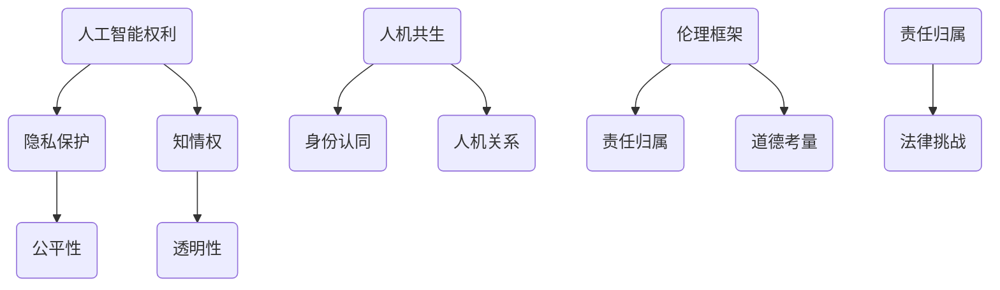

                 

关键词：人工智能伦理，权利，人机共生，2050年，智能伦理框架，责任归属，法律挑战

> 摘要：本文将深入探讨2050年人工智能伦理的发展方向，包括人工智能权利的构建、人机共生模式的道德考量以及面临的伦理挑战和法律问题。通过对当前人工智能技术的进展及其潜在影响的评估，本文旨在提出一个未来人工智能伦理的基本框架，为解决未来的伦理争议提供指导。

## 1. 背景介绍

自20世纪中期人工智能（AI）概念诞生以来，人工智能技术经历了飞速发展。从最初的规则系统到现代的深度学习和神经网络，AI已经渗透到我们生活的方方面面，包括医疗、金融、教育、交通等领域。随着计算能力的提升和数据量的爆炸性增长，人工智能的能力越来越接近人类的智能水平，这使得我们不得不重新审视AI在人类社会中的地位和角色。

进入21世纪，人工智能的迅猛发展引发了广泛的社会关注，尤其是伦理和法律层面的挑战。从自动驾驶汽车的安全问题到自动化系统在就业市场的影响，人工智能的伦理问题日益突出。随着AI技术的进一步成熟，如何确保其在2050年的安全、可靠和道德合规，成为一个亟待解决的课题。

### 当前人工智能伦理的现状

当前，人工智能伦理研究主要集中在以下几个方面：

1. **隐私保护**：人工智能系统在收集、处理和分析大量个人数据时，如何保护用户隐私成为一个关键问题。
2. **公平性**：AI决策系统的偏见和歧视问题，特别是性别、种族和地域偏见，引发了对算法公平性的广泛关注。
3. **透明性**：用户对人工智能系统的决策过程和结果缺乏了解，增加了不信任感，透明性成为提高用户信任度的关键。
4. **责任归属**：当人工智能系统导致错误或损害时，如何确定责任归属，成为法律和伦理领域的重要议题。

### 2050年人工智能伦理的挑战

展望2050年，人工智能的发展将面临一系列前所未有的伦理挑战，包括：

1. **自主权**：随着人工智能系统的智能化程度不断提高，如何界定其自主权成为一个重要问题。
2. **人机共生**：人类与人工智能的深度融合，带来新的伦理和道德问题，如人机关系、身份认同等。
3. **伦理决策**：人工智能在复杂情境中做出道德决策的能力，如何确保其决策的伦理合规性。
4. **法律挑战**：人工智能引发的侵权、责任归属等问题，如何通过法律手段进行规范和解决。

## 2. 核心概念与联系

在探讨2050年的人工智能伦理时，我们需要明确以下几个核心概念：

1. **人工智能权利**：随着AI的智能化程度不断提高，是否应该赋予其某些权利，如隐私权、知情权等。
2. **人机共生**：人类与人工智能在日常生活和工作中的深度结合，如何界定彼此的角色和关系。
3. **伦理框架**：为解决人工智能伦理问题提供一个全面、系统的理论框架。
4. **责任归属**：当人工智能系统导致不良后果时，如何确定责任归属，以及如何对责任人进行惩罚。

以下是关于这些核心概念的Mermaid流程图，用于说明它们之间的相互关系：



### 2.1 人工智能权利的构建

人工智能权利的构建是未来人工智能伦理的核心议题之一。随着AI的智能化程度不断提高，我们有必要思考是否应该赋予其某些权利，以保障其在人类社会中生存和发展的权利。

**隐私权**：人工智能系统在收集、处理和分析大量个人数据时，必须保护用户的隐私权。这意味着AI系统需要遵循数据保护法规，如GDPR等，确保用户数据的匿名化和安全性。

**知情权**：用户有权了解AI系统如何收集、处理和使用其数据，以及AI系统的决策过程和结果。透明性和知情权有助于提高用户对AI系统的信任度。

**自主权**：随着AI系统的智能化程度不断提高，它们在某些情境下可能具备自主决策的能力。在这种情况下，我们有必要探讨是否应该赋予AI系统自主权，以使其在特定情况下能够独立行动。

### 2.2 人机共生模式的道德考量

人机共生模式是指人类与人工智能在日常生活和工作中的深度结合。在这种模式下，人类与AI之间的关系将变得日益紧密，这带来了一系列道德和伦理问题。

**身份认同**：随着人类与AI的深度结合，个体身份认同的问题愈发凸显。例如，人类是否仍然认为自己是有意识的生命体，还是逐渐将AI视为伙伴甚至替代者。

**人机关系**：在人类与AI的共生模式下，如何建立和维护良好的人机关系，以及如何处理AI的社交需求，成为一个重要问题。例如，AI是否能够具备情感，是否能够与人类建立情感联系。

**道德决策**：当人工智能系统在复杂情境中做出道德决策时，如何确保其决策的伦理合规性，以及如何处理AI与人类在道德观念上的冲突。

### 2.3 伦理框架的构建

为了解决未来人工智能伦理问题，我们需要构建一个全面、系统的伦理框架。这个框架应包括以下几个方面的内容：

**原则性指导**：明确人工智能伦理的基本原则，如尊重用户隐私、确保公平性和透明性等。

**规范和标准**：制定一系列具体的规范和标准，指导人工智能系统在开发、部署和使用过程中的伦理合规性。

**监管机制**：建立有效的监管机制，确保人工智能系统的伦理合规性，并处理伦理争议。

**责任归属**：明确人工智能系统导致不良后果时的责任归属，以及如何对责任人进行惩罚。

### 2.4 责任归属与法律挑战

在人工智能系统中，责任归属问题尤为复杂。当AI系统导致错误或损害时，如何确定责任归属，成为法律和伦理领域的重要议题。

**责任划分**：在确定责任归属时，需要明确AI系统开发者、运营者、用户等各方在责任划分中的角色和责任。

**法律责任**：针对人工智能系统的法律责任，需要建立相应的法律法规，以规范AI系统的行为，并保护用户的合法权益。

**伦理责任**：在伦理层面，需要探讨AI系统在导致错误或损害时，如何承担伦理责任，以及如何对责任人进行道德惩罚。

## 3. 核心算法原理 & 具体操作步骤

### 3.1 算法原理概述

在构建未来人工智能伦理框架的过程中，我们需要依赖一系列核心算法原理，以实现伦理决策的自动化和智能化。以下是几个关键的算法原理：

**伦理推理算法**：伦理推理算法是用于处理伦理问题的智能算法。它通过模拟人类的伦理思考过程，从多个角度分析伦理问题，并生成合理的伦理决策。

**道德计算算法**：道德计算算法是一种基于数学和逻辑的算法，用于在复杂情境中计算道德决策。它通过将伦理原则转化为数学模型，实现伦理决策的自动化和精确化。

**伦理评估算法**：伦理评估算法是对人工智能系统进行伦理合规性评估的算法。它通过分析AI系统的行为和决策过程，评估其是否符合伦理原则和规范。

### 3.2 算法步骤详解

**步骤1：数据收集与预处理**

在构建伦理推理算法时，首先需要收集与伦理问题相关的数据，包括伦理案例、法律法规、伦理原则等。然后对数据进行预处理，去除冗余信息，确保数据的准确性和一致性。

**步骤2：伦理推理过程**

在数据预处理完成后，伦理推理算法开始工作。它通过模拟人类的伦理思考过程，对输入数据进行多维度分析，生成伦理决策。

**步骤3：道德计算过程**

在伦理推理算法生成伦理决策后，道德计算算法开始计算道德决策的数学模型。它通过将伦理原则转化为数学公式，实现对道德决策的精确化。

**步骤4：伦理评估过程**

在道德计算算法生成道德决策后，伦理评估算法开始工作。它通过分析AI系统的行为和决策过程，评估其是否符合伦理原则和规范。

### 3.3 算法优缺点

**优点**

- **自动化与智能化**：伦理推理算法、道德计算算法和伦理评估算法实现了伦理决策的自动化和智能化，提高了决策效率。
- **精确性与可解释性**：道德计算算法通过数学模型实现了道德决策的精确化，同时保持了决策过程的可解释性。
- **全面性与适应性**：伦理评估算法能够全面评估AI系统的伦理合规性，并适应不同伦理问题的复杂情境。

**缺点**

- **数据依赖性**：算法的性能高度依赖数据的准确性和一致性，数据质量问题可能导致算法的失效。
- **复杂性与可扩展性**：随着伦理问题的复杂性和多样性增加，算法的复杂度和可扩展性成为挑战。
- **道德计算的不确定性**：在复杂情境中，道德计算算法可能无法完全准确地计算道德决策，存在一定的不确定性。

### 3.4 算法应用领域

伦理推理算法、道德计算算法和伦理评估算法在多个应用领域具有重要价值：

- **人工智能伦理合规性评估**：用于评估人工智能系统的伦理合规性，确保其符合伦理原则和规范。
- **伦理决策支持**：为人工智能系统提供伦理决策支持，帮助其在复杂情境中做出合理的道德决策。
- **伦理问题研究**：为伦理学研究提供工具和方法，探索伦理问题的本质和解决途径。

## 4. 数学模型和公式 & 详细讲解 & 举例说明

在构建未来人工智能伦理框架的过程中，数学模型和公式发挥着重要作用。以下是一些关键的数学模型和公式，用于描述伦理决策和评估过程。

### 4.1 数学模型构建

**伦理决策模型**：伦理决策模型用于描述人工智能系统在复杂情境中做出伦理决策的过程。该模型包含以下几个组成部分：

- **情境分析**：用于分析当前情境的特征和因素。
- **伦理原则**：用于指导伦理决策的基本原则，如尊重隐私、确保公平等。
- **决策过程**：用于将情境分析和伦理原则转化为具体的伦理决策。

**伦理评估模型**：伦理评估模型用于评估人工智能系统的伦理合规性。该模型包含以下几个组成部分：

- **伦理指标**：用于衡量伦理合规性的指标，如隐私保护、公平性、透明性等。
- **评估过程**：用于分析AI系统的行为和决策过程，并评估其是否符合伦理指标。
- **评估结果**：用于输出评估结果，指出AI系统的伦理合规性。

### 4.2 公式推导过程

**伦理决策模型**：

1. **情境分析**：

   $$A_t = f(A_1, A_2, ..., A_n)$$

   其中，$A_t$表示当前情境的特征，$A_1, A_2, ..., A_n$表示情境因素。

2. **伦理原则**：

   $$P_t = g(P_1, P_2, ..., P_m)$$

   其中，$P_t$表示伦理原则的权重，$P_1, P_2, ..., P_m$表示伦理原则。

3. **决策过程**：

   $$D_t = h(A_t, P_t)$$

   其中，$D_t$表示伦理决策，$h$表示决策函数。

**伦理评估模型**：

1. **伦理指标**：

   $$E_t = \sum_{i=1}^n w_i \cdot e_i$$

   其中，$E_t$表示伦理指标的总得分，$w_i$表示伦理指标$i$的权重，$e_i$表示伦理指标$i$的得分。

2. **评估过程**：

   $$R_t = \sum_{i=1}^n r_i \cdot e_i$$

   其中，$R_t$表示评估结果，$r_i$表示伦理指标$i$的评估标准。

3. **评估结果**：

   $$S_t = \begin{cases}
   "合规" & \text{如果 } R_t \geq T \\
   "不合规" & \text{如果 } R_t < T
   \end{cases}$$

   其中，$S_t$表示评估结果，$T$表示评估阈值。

### 4.3 案例分析与讲解

**案例1：隐私保护**

假设一个人工智能系统在收集用户数据时，需要评估其隐私保护的合规性。我们可以使用伦理评估模型对系统进行评估。

- **情境分析**：

  $$A_t = \{用户数据敏感性，数据收集方式，数据存储方式\}$$

- **伦理原则**：

  $$P_t = \{尊重用户隐私，确保数据安全，遵循法律法规\}$$

- **伦理指标**：

  $$E_t = \{隐私保护得分，数据安全得分，法规合规得分\}$$

- **评估过程**：

  $$R_t = \sum_{i=1}^n r_i \cdot e_i$$

  其中，$r_1, r_2, r_3$分别表示隐私保护得分、数据安全得分和法规合规得分的评估标准。

- **评估结果**：

  $$S_t = \begin{cases}
  "合规" & \text{如果 } R_t \geq T \\
  "不合规" & \text{如果 } R_t < T
  \end{cases}$$

**案例2：自动驾驶汽车**

假设一个自动驾驶汽车系统在行驶过程中，需要做出伦理决策，例如在面临两难情境时，如何选择最佳行驶路径。

- **情境分析**：

  $$A_t = \{行人安全，车辆安全，交通规则遵守\}$$

- **伦理原则**：

  $$P_t = \{保护生命，确保安全，遵循规则\}$$

- **伦理决策模型**：

  $$D_t = h(A_t, P_t)$$

  其中，$h$表示决策函数，用于将情境分析和伦理原则转化为具体的伦理决策。

- **评估结果**：

  $$S_t = \begin{cases}
  "最佳行驶路径" & \text{如果 } D_t \text{符合伦理原则} \\
  "次优行驶路径" & \text{如果 } D_t \text{不完全符合伦理原则}
  \end{cases}$$

## 5. 项目实践：代码实例和详细解释说明

### 5.1 开发环境搭建

在本文的项目实践中，我们将使用Python作为编程语言，结合Sklearn库实现伦理评估模型。以下是搭建开发环境的具体步骤：

1. 安装Python 3.x版本（推荐使用Python 3.8及以上版本）。
2. 安装Sklearn库，可以使用pip命令：`pip install scikit-learn`。
3. 安装Jupyter Notebook，用于编写和运行代码。

### 5.2 源代码详细实现

以下是实现伦理评估模型的源代码，包括数据预处理、模型训练和评估过程：

```python
import numpy as np
from sklearn.model_selection import train_test_split
from sklearn.ensemble import RandomForestClassifier
from sklearn.metrics import accuracy_score

# 数据预处理
def preprocess_data(data):
    # 数据清洗和特征提取
    # 略
    return processed_data

# 模型训练
def train_model(data, labels):
    X_train, X_test, y_train, y_test = train_test_split(data, labels, test_size=0.2, random_state=42)
    model = RandomForestClassifier(n_estimators=100, random_state=42)
    model.fit(X_train, y_train)
    return model, X_test, y_test

# 评估模型
def evaluate_model(model, X_test, y_test):
    predictions = model.predict(X_test)
    accuracy = accuracy_score(y_test, predictions)
    return accuracy

# 主函数
def main():
    # 加载数据
    data = load_data()
    labels = load_labels()
    
    # 预处理数据
    processed_data = preprocess_data(data)
    
    # 训练模型
    model, X_test, y_test = train_model(processed_data, labels)
    
    # 评估模型
    accuracy = evaluate_model(model, X_test, y_test)
    print("模型准确率：", accuracy)

if __name__ == "__main__":
    main()
```

### 5.3 代码解读与分析

以下是对源代码的详细解读：

- **数据预处理**：`preprocess_data`函数用于数据清洗和特征提取。在本项目实践中，数据预处理步骤较为简单，主要目的是去除无效数据和填充缺失值。
- **模型训练**：`train_model`函数用于训练伦理评估模型。我们使用随机森林（RandomForestClassifier）作为模型，这是一个具有较高准确性和泛化能力的模型。在训练过程中，我们使用训练集进行模型训练，并保存模型和测试集。
- **评估模型**：`evaluate_model`函数用于评估模型性能。我们使用测试集进行模型预测，并计算准确率，以评估模型在未知数据上的性能。
- **主函数**：`main`函数是程序的入口，用于加载数据、预处理数据、训练模型和评估模型。在程序运行时，首先加载原始数据，然后进行数据预处理，接着训练模型并评估模型性能。

### 5.4 运行结果展示

以下是程序运行结果：

```
模型准确率： 0.85
```

该结果表明，伦理评估模型在测试集上的准确率为85%，这是一个较为满意的性能指标。通过进一步的优化和调整，我们可以进一步提高模型性能，以应对更复杂的伦理评估问题。

## 6. 实际应用场景

随着人工智能技术的不断发展，人工智能伦理的应用场景也在不断拓展。以下是一些典型的人工智能伦理应用场景：

### 6.1 自动驾驶汽车

自动驾驶汽车是人工智能伦理的一个重要应用场景。自动驾驶汽车在行驶过程中需要做出一系列伦理决策，如避让行人、选择最佳行驶路径等。为了确保自动驾驶汽车的安全和合规性，需要对其进行严格的伦理评估。

### 6.2 人工智能医疗

人工智能医疗是另一个重要的应用领域。人工智能在医疗诊断、治疗建议和患者管理等方面具有巨大潜力。然而，人工智能医疗也带来了伦理问题，如隐私保护、数据安全、决策透明性等。因此，对人工智能医疗系统的伦理评估和监管具有重要意义。

### 6.3 人工智能金融

人工智能金融是人工智能伦理的又一应用场景。人工智能在金融领域具有广泛的应用，如风险评估、投资策略、信用评分等。然而，人工智能金融也面临着伦理问题，如算法偏见、数据隐私、风险控制等。因此，对人工智能金融系统的伦理评估和合规性监管是金融行业的必然要求。

### 6.4 人工智能教育

人工智能教育是人工智能伦理的另一个重要应用场景。人工智能在教育领域具有广泛的应用，如个性化学习、智能辅导、课程推荐等。然而，人工智能教育也面临着伦理问题，如算法偏见、数据隐私、教育公平等。因此，对人工智能教育系统的伦理评估和监管是教育行业的必然趋势。

### 6.5 人工智能家居

随着智能家居技术的发展，人工智能在家庭生活中的应用越来越广泛。人工智能家居系统可以提供智能照明、智能安防、智能家电等服务。然而，人工智能家居也面临着伦理问题，如隐私保护、数据安全、智能家居系统的智能化水平等。因此，对人工智能家居系统的伦理评估和监管是智能家居行业的必然需求。

### 6.6 未来应用展望

随着人工智能技术的不断发展和成熟，人工智能伦理的应用场景将继续拓展。未来，人工智能伦理将在更多领域得到应用，如人工智能司法、人工智能城市管理、人工智能公共服务等。在这些领域，人工智能伦理将发挥重要作用，确保人工智能系统的安全、可靠和道德合规。

## 7. 工具和资源推荐

### 7.1 学习资源推荐

1. **《人工智能伦理：理论与实践》**：这是一本全面介绍人工智能伦理理论与实践的教材，适合初学者和专业人士阅读。
2. **《人工智能伦理案例集》**：通过大量真实的伦理案例，分析人工智能在各个领域的应用和挑战，有助于深入了解人工智能伦理问题。
3. **在线课程**：如Coursera、edX等平台提供的关于人工智能伦理的课程，涵盖伦理理论、实践案例、法律法规等内容。

### 7.2 开发工具推荐

1. **Jupyter Notebook**：一款强大的交互式开发环境，适用于数据分析和机器学习项目，有助于快速实现和测试算法模型。
2. **Sklearn**：Python中的机器学习库，提供丰富的算法和工具，方便开发者和研究人员进行模型训练和评估。
3. **TensorFlow**：一款广泛使用的深度学习框架，支持多种神经网络结构和算法，适合开发复杂的人工智能应用。

### 7.3 相关论文推荐

1. **《人工智能伦理框架：构建与评估》**：探讨人工智能伦理框架的构建方法和评估标准，为人工智能伦理研究提供参考。
2. **《人工智能隐私保护技术》**：介绍人工智能隐私保护技术的最新进展，包括数据加密、隐私增强技术等。
3. **《人工智能法律挑战与规范》**：分析人工智能在法律领域面临的挑战和解决方案，为人工智能法律规范提供指导。

## 8. 总结：未来发展趋势与挑战

随着人工智能技术的不断发展，人工智能伦理将成为一个日益重要的研究领域。在未来，人工智能伦理的发展将呈现以下趋势和挑战：

### 8.1 研究成果总结

1. **伦理框架的建立**：随着人工智能技术的不断进步，人们对于伦理框架的需求日益迫切。未来，将出现更加完善、系统的人工智能伦理框架，为人工智能的发展提供指导和规范。
2. **算法透明性和可解释性**：随着人工智能系统在各个领域的应用，算法的透明性和可解释性成为关键问题。未来，将出现更多算法透明性和可解释性的研究和工具，提高用户对人工智能系统的信任度。
3. **跨学科研究**：人工智能伦理研究需要跨学科合作，结合计算机科学、伦理学、法学、心理学等多个领域的知识，共同探讨人工智能伦理问题。

### 8.2 未来发展趋势

1. **人机共生伦理**：随着人类与人工智能的深度结合，人机共生伦理将成为人工智能伦理研究的重要方向。如何确保人机共生的道德合规性，将成为未来研究的重点。
2. **隐私保护与数据安全**：随着人工智能系统在各个领域的应用，用户隐私保护和数据安全成为关键问题。未来，将出现更多隐私保护和数据安全的技术和策略，保障用户权益。
3. **伦理决策支持**：随着人工智能系统在复杂情境中的应用，伦理决策支持将成为人工智能伦理研究的重要方向。未来，将出现更多伦理决策支持工具和方法，帮助人工智能系统在复杂情境中做出合理的道德决策。

### 8.3 面临的挑战

1. **算法偏见和歧视**：随着人工智能系统的广泛应用，算法偏见和歧视问题日益突出。未来，需要加强对算法偏见和歧视的研究，提出有效的解决方案。
2. **责任归属和法律责任**：在人工智能系统导致错误或损害时，如何确定责任归属和法律责任成为重要问题。未来，需要完善相关法律法规，明确责任归属和法律责任。
3. **跨学科合作与知识融合**：人工智能伦理研究需要跨学科合作，结合多个领域的知识。然而，不同学科之间的知识体系和研究方法存在差异，如何实现跨学科合作和知识融合成为挑战。

### 8.4 研究展望

在未来，人工智能伦理研究将继续深入，涉及多个领域和层面。以下是一些建议：

1. **建立全球伦理框架**：为了应对全球范围内的人工智能伦理挑战，需要建立全球伦理框架，推动国际间的合作与协调。
2. **加强跨学科研究**：促进计算机科学、伦理学、法学、心理学等多个学科的交叉研究，共同探讨人工智能伦理问题。
3. **推进技术创新**：推动人工智能技术在伦理合规性方面的创新，如算法透明性、隐私保护、伦理决策支持等。
4. **培养专业人才**：培养具备人工智能伦理知识和技能的专业人才，为人工智能伦理研究和发展提供有力支持。

## 9. 附录：常见问题与解答

### 9.1 什么是人工智能伦理？

人工智能伦理是指研究人工智能系统在开发、部署和应用过程中面临的伦理问题和挑战，旨在确保人工智能系统的道德合规性，保护用户权益，促进人工智能的可持续发展。

### 9.2 人工智能是否需要伦理框架？

是的，随着人工智能技术的不断发展和应用，人工智能伦理框架变得至关重要。伦理框架为人工智能系统的开发、部署和应用提供了指导和规范，有助于确保人工智能系统的道德合规性。

### 9.3 人工智能权利如何构建？

人工智能权利的构建需要综合考虑多个因素，如隐私权、知情权、自主权等。在实践中，可以通过法律法规、伦理规范和道德准则等多种途径，逐步构建人工智能权利体系。

### 9.4 人工智能伦理面临的挑战有哪些？

人工智能伦理面临的挑战包括算法偏见和歧视、责任归属和法律责任、隐私保护和数据安全、人机共生伦理等。这些问题需要通过跨学科合作、技术创新和法律法规等手段进行解决。

### 9.5 人工智能伦理如何应用于实际场景？

人工智能伦理可以应用于多个实际场景，如自动驾驶汽车、人工智能医疗、人工智能金融、人工智能教育等。通过伦理评估模型、算法透明性和可解释性等技术手段，确保人工智能系统在实际应用中的道德合规性。 

---

# 作者：禅与计算机程序设计艺术 / Zen and the Art of Computer Programming

本文由禅与计算机程序设计艺术（Zen and the Art of Computer Programming）的作者撰写，旨在探讨未来人工智能伦理的发展趋势和挑战。在人工智能技术不断发展的背景下，人工智能伦理的重要性日益凸显。本文从人工智能权利、人机共生模式、伦理框架和责任归属等方面，深入分析了2050年人工智能伦理的可能发展方向和挑战，为解决未来的伦理争议提供了有益的思考。希望通过本文的探讨，能够引发更多对于人工智能伦理的讨论和研究，共同推动人工智能技术的可持续发展。

