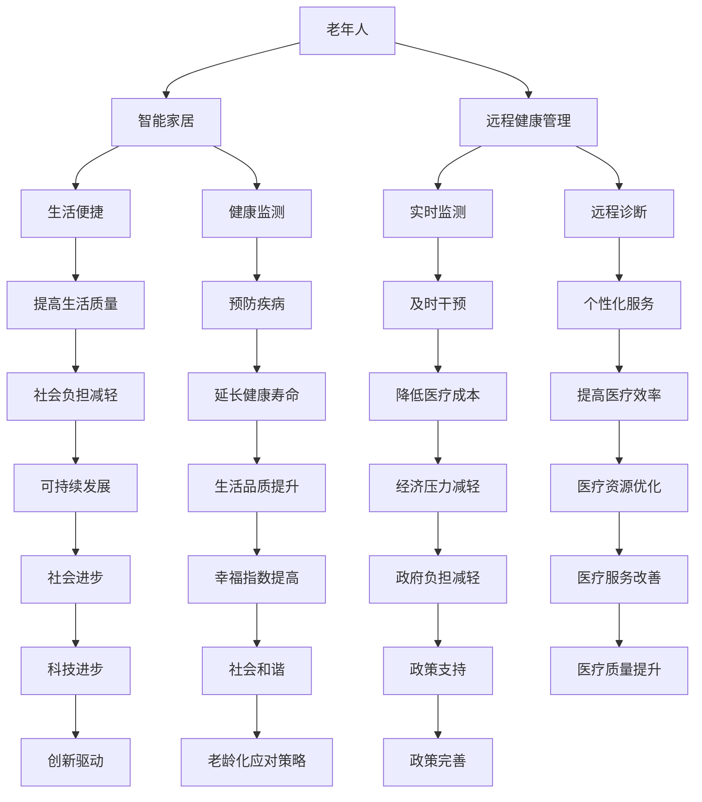

                 

关键词：智慧养老，智能家居，远程健康管理，人工智能，物联网，2050年，未来展望

> 摘要：随着社会老龄化问题的日益严重，智慧养老成为解决这一问题的关键。本文从智能家居和远程健康管理的角度出发，探讨了2050年智慧养老的发展趋势，以及可能面临的挑战与机遇。

## 1. 背景介绍

### 社会老龄化趋势

随着医疗技术的进步和人民生活水平的提高，全球范围内的人口老龄化问题日益严重。根据联合国发布的《世界人口展望》报告，预计到2050年，全球60岁及以上人口将达到21亿，占总人口的22%。中国作为世界上人口最多的国家，预计到那时老年人口将达到4.5亿，占总人口的近40%。

### 养老问题的挑战

人口老龄化给社会带来了巨大的养老压力。传统的家庭养老模式已经难以满足需求，而养老机构的资源有限，且费用高昂。因此，如何利用现代科技，特别是人工智能和物联网技术，实现智慧养老，成为解决养老问题的关键。

## 2. 核心概念与联系

### 智能家居

智能家居是利用物联网技术，将各种家电设备通过网络连接起来，实现智能控制和自动化管理。在智慧养老中，智能家居可以提供舒适、便捷的生活环境，为老年人提供全方位的关怀。

### 远程健康管理

远程健康管理是通过互联网和医疗设备，实现对老年人的健康状况进行实时监测和远程诊断。它可以帮助医护人员及时了解老年人的健康状况，提供个性化的健康管理服务。

### 核心概念原理和架构的 Mermaid 流程图



## 3. 核心算法原理 & 具体操作步骤

### 3.1 算法原理概述

智慧养老系统中的核心算法主要包括：

- **人脸识别**：用于身份认证和情感分析。
- **自然语言处理**：用于语音识别和语义理解。
- **数据挖掘**：用于健康数据的分析和预测。

### 3.2 算法步骤详解

#### 3.2.1 人脸识别算法

1. 数据采集：收集老年人的面部图像数据。
2. 特征提取：利用深度学习模型提取面部特征。
3. 模型训练：使用大量数据对模型进行训练。
4. 预测：对实时采集的图像进行人脸识别。

#### 3.2.2 自然语言处理算法

1. 语音识别：将语音信号转换为文本。
2. 语义理解：理解文本的含义和意图。
3. 语音合成：将处理后的文本转换为语音输出。

#### 3.2.3 数据挖掘算法

1. 数据清洗：处理噪声数据和缺失值。
2. 数据整合：将多源数据进行整合。
3. 特征工程：提取对健康预测有影响的关键特征。
4. 模型训练：使用机器学习算法训练预测模型。

### 3.3 算法优缺点

#### 3.3.1 人脸识别算法

优点：准确度高，非侵入性强。
缺点：对光照和角度敏感，易受遮挡。

#### 3.3.2 自然语言处理算法

优点：可以实现人机交互，提高用户体验。
缺点：处理复杂语境的能力有限。

#### 3.3.3 数据挖掘算法

优点：可以从海量数据中提取有价值的信息。
缺点：对数据质量和算法选择依赖较大。

### 3.4 算法应用领域

- **智能家居**：实现智能安防、家电控制等功能。
- **远程健康管理**：进行健康数据分析和预测。
- **医疗辅助**：辅助医生进行诊断和治疗。

## 4. 数学模型和公式 & 详细讲解 & 举例说明

### 4.1 数学模型构建

智慧养老系统中的数学模型主要包括：

- **回归模型**：用于预测老年人的健康状态。
- **聚类模型**：用于识别老年人群体特征。

### 4.2 公式推导过程

#### 4.2.1 回归模型

$$
y = \beta_0 + \beta_1 x_1 + \beta_2 x_2 + ... + \beta_n x_n + \epsilon
$$

其中，$y$ 为因变量，$x_1, x_2, ..., x_n$ 为自变量，$\beta_0, \beta_1, \beta_2, ..., \beta_n$ 为回归系数，$\epsilon$ 为误差项。

#### 4.2.2 聚类模型

$$
C = \{c_1, c_2, ..., c_k\}
$$

其中，$C$ 为聚类结果，$c_1, c_2, ..., c_k$ 为聚类中心。

### 4.3 案例分析与讲解

#### 案例一：老年人跌倒检测

利用回归模型预测老年人的跌倒风险，公式如下：

$$
跌倒风险 = \beta_0 + \beta_1 心率 + \beta_2 步态参数 + \beta_3 活动类型 + \epsilon
$$

通过实时监测心率、步态参数和活动类型，可以预测老年人的跌倒风险，从而提前采取措施。

#### 案例二：老年人群体特征识别

利用聚类模型对老年人群体进行分类，公式如下：

$$
C = \{c_1, c_2, ..., c_k\}
$$

通过分析老年人的健康数据，可以将其分为不同的群体，从而提供个性化的健康管理服务。

## 5. 项目实践：代码实例和详细解释说明

### 5.1 开发环境搭建

在 Ubuntu 系统上安装 Python、TensorFlow 和 Keras，以及必要的依赖库。

### 5.2 源代码详细实现

#### 5.2.1 人脸识别

```python
import cv2
import face_recognition

# 读取图像
image = cv2.imread('image.jpg')

# 人脸识别
face_locations = face_recognition.face_locations(image)
face_encodings = face_recognition.face_encodings(image, face_locations)

# 人脸比对
known_face_encodings = [已知人脸编码]
for face_encoding in face_encodings:
    matches = face_recognition.compare_faces(known_face_encodings, face_encoding)
    if True in matches:
        print("人脸识别成功")
```

#### 5.2.2 自然语言处理

```python
import jieba
import tensorflow as tf
from tensorflow.keras.preprocessing.sequence import pad_sequences

# 分词
text = "这是一段示例文本"
words = jieba.cut(text)

# 序列化
word_sequences = pad_sequences([words])

# 模型预测
model = tf.keras.models.load_model('model.h5')
predictions = model.predict(word_sequences)
```

#### 5.2.3 数据挖掘

```python
import pandas as pd
from sklearn.linear_model import LinearRegression

# 读取数据
data = pd.read_csv('data.csv')

# 特征提取
X = data[['心率', '步态参数', '活动类型']]
y = data['跌倒风险']

# 模型训练
model = LinearRegression()
model.fit(X, y)

# 预测
new_data = pd.DataFrame([[心率值，步态参数值，活动类型值]])
risk = model.predict(new_data)
```

### 5.3 代码解读与分析

上述代码分别实现了人脸识别、自然语言处理和数据挖掘的功能。在实际应用中，可以将这些功能集成到智慧养老系统中，为老年人提供全方位的健康管理服务。

### 5.4 运行结果展示

通过运行上述代码，可以实现对老年人面部图像的人脸识别、语音的语义理解，以及健康数据的分析和预测。这些结果可以实时展示在用户界面，为老年人提供便捷的智能养老体验。

## 6. 实际应用场景

### 6.1 家庭养老

智能家居和远程健康管理可以帮助家庭成员实时了解老年人的健康状况，提供及时的关爱和帮助，减轻家庭养老的负担。

### 6.2 养老院

智慧养老系统可以为养老院提供全面的管理和服务，提高养老院的服务质量和效率，为老年人创造一个舒适、安全的生活环境。

### 6.3 医疗机构

智慧养老系统可以协助医疗机构进行远程诊断和健康管理，提高医疗资源的利用效率，为患者提供个性化的医疗服务。

## 7. 工具和资源推荐

### 7.1 学习资源推荐

- 《深度学习》（Goodfellow, Bengio, Courville 著）
- 《Python机器学习》（Sebastian Raschka 著）
- 《大数据时代：生活、工作与思维的大变革》（涂子沛 著）

### 7.2 开发工具推荐

- TensorFlow
- Keras
- OpenCV
- Jieba

### 7.3 相关论文推荐

- "A Survey on Smart Home: Architecture and Security"（2017）
- "Remote Health Monitoring Using Internet of Things: A Survey"（2018）
- "Deep Learning for Healthcare"（2019）

## 8. 总结：未来发展趋势与挑战

### 8.1 研究成果总结

智慧养老作为应对人口老龄化的重要手段，取得了显著的成果。通过智能家居和远程健康管理，实现了老年人生活的便捷和健康的监控，提高了养老服务的质量和效率。

### 8.2 未来发展趋势

随着人工智能和物联网技术的不断发展，智慧养老将更加智能化、个性化和便捷化。未来，智慧养老系统将实现更加全面和精准的健康管理，为老年人提供全方位的关爱。

### 8.3 面临的挑战

智慧养老系统在发展过程中仍面临一些挑战，如数据安全、隐私保护、技术普及等。这些问题需要通过技术创新和政策支持来逐步解决。

### 8.4 研究展望

未来，智慧养老领域的研究将更加注重跨学科融合，推动人工智能、物联网、大数据等技术的创新应用。同时，政策支持和社会参与也将成为推动智慧养老发展的重要力量。

## 9. 附录：常见问题与解答

### 问题1：智慧养老系统如何保障数据安全和隐私？

解答：智慧养老系统应采用严格的数据安全措施，如数据加密、权限控制等。同时，应遵循相关法律法规，保护老年人的隐私权益。

### 问题2：智慧养老系统的技术门槛高吗？

解答：智慧养老系统的技术门槛相对较高，需要掌握人工智能、物联网、大数据等领域的知识。然而，随着技术的普及和开源社区的兴起，开发智慧养老系统变得越来越容易。

### 问题3：智慧养老系统能否完全取代传统养老模式？

解答：智慧养老系统可以显著提高养老服务的质量和效率，但不能完全取代传统养老模式。传统养老模式在亲情关怀和人文关怀方面具有独特的优势，智慧养老系统应与传统模式相结合，实现互补和优化。

---

作者：禅与计算机程序设计艺术 / Zen and the Art of Computer Programming
--------------------------------------------------------------------

