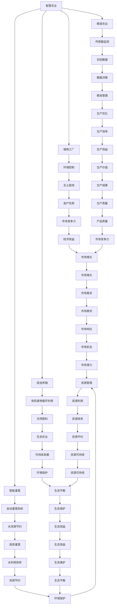

                 

关键词：智慧农业、植物工厂、昆虫养殖、2050年、信息技术、可持续发展、自动化、精准农业、数据驱动。

> 摘要：本文深入探讨了2050年的智慧农业，重点分析了植物工厂与昆虫养殖技术的未来发展。结合信息技术与生物学，智慧农业将极大地提高农业生产的效率、可持续性和环境友好性。本文旨在为读者提供对这一领域的全面了解，并展望其广阔的应用前景。

## 1. 背景介绍

智慧农业是利用信息技术、生物技术、机械电子技术等现代科技手段，对农业生产进行全方位的优化和管理。它涵盖精准农业、智能灌溉、植物工厂、昆虫养殖、农业物联网等多个领域。

传统的农业生产依赖于大量的劳动力、水资源和土地，效率低下且对环境有较大的负面影响。而智慧农业通过智能化设备、大数据分析和人工智能算法，能够实现农业生产的高度自动化和精准化，从而大幅提高生产效率和资源利用率。

植物工厂与昆虫养殖是智慧农业的重要组成部分。植物工厂通过控制光照、温度、湿度等环境条件，实现植物的无土栽培；昆虫养殖则利用昆虫的生态特性，进行有机废物的循环利用，为农业生产提供天然肥料。

## 2. 核心概念与联系

### 2.1 智慧农业的核心概念

智慧农业的核心概念包括以下几个方面：

- **精准农业**：利用卫星遥感、无人机等技术，对农田进行实时监测和数据分析，实现精准施肥、灌溉和病虫害防治。
- **智能灌溉**：通过传感器实时监测土壤湿度、水分含量等数据，自动控制灌溉系统的开启和关闭。
- **植物工厂**：在室内环境中，通过人工控制环境条件，实现植物的无土栽培。
- **昆虫养殖**：利用昆虫的生态特性，进行有机废物的循环利用，为农业生产提供天然肥料。

### 2.2 植物工厂与昆虫养殖的关系

植物工厂与昆虫养殖在智慧农业中相互补充，形成了一个闭环的生态系统。植物工厂通过产生的有机废物，为昆虫养殖提供了原料；而昆虫养殖的排泄物又可以作为肥料，反哺植物工厂。

### 2.3 Mermaid 流程图



## 3. 核心算法原理 & 具体操作步骤

### 3.1 算法原理概述

智慧农业中的核心算法主要包括数据采集与分析、环境控制算法、生产优化算法等。

- **数据采集与分析**：通过传感器采集农田的土壤、气候、植被等数据，利用机器学习算法进行数据分析和预测。
- **环境控制算法**：根据实时数据，调节植物工厂内的光照、温度、湿度等环境条件，以实现最佳生长状态。
- **生产优化算法**：通过模拟和优化种植、养殖过程，提高产量和资源利用效率。

### 3.2 算法步骤详解

#### 3.2.1 数据采集与分析

1. **传感器部署**：在农田和植物工厂内布置各种传感器，如土壤湿度传感器、温度传感器、光照传感器等。
2. **数据采集**：传感器实时采集农田和环境数据，并传输到数据中心。
3. **数据预处理**：对采集到的数据进行清洗、筛选和转换，以便进行后续分析。
4. **数据分析**：利用机器学习算法，对预处理后的数据进行分析和预测，如作物生长趋势预测、病虫害预警等。

#### 3.2.2 环境控制算法

1. **环境监测**：实时监测植物工厂内的光照、温度、湿度等环境参数。
2. **环境参数调节**：根据实时监测数据，自动调节植物工厂内的环境参数，如开闭灯光、调节温度、湿度等。
3. **环境状态评估**：对环境参数的调节效果进行评估，以优化环境控制策略。

#### 3.2.3 生产优化算法

1. **生产计划制定**：根据市场需求和资源条件，制定种植和养殖计划。
2. **生产过程模拟**：利用模拟算法，对生产过程进行模拟和预测。
3. **生产过程优化**：根据模拟结果，优化生产过程，如调整种植密度、养殖密度等。
4. **生产效果评估**：对生产效果进行评估，以不断优化生产策略。

### 3.3 算法优缺点

#### 3.3.1 优点

- 提高生产效率：通过数据分析和自动化控制，实现农业生产的高度精准化和自动化。
- 节约资源：通过智能灌溉和有机废物循环利用，节约水资源和肥料。
- 环境友好：减少农药和化肥的使用，降低对环境的污染。
- 提高产品质量：通过精准控制环境条件，提高作物的品质和产量。

#### 3.3.2 缺点

- 投资成本高：智慧农业系统的建设需要大量的传感器、控制器和数据处理设备，初期投资较大。
- 技术维护复杂：智慧农业系统需要定期维护和升级，对技术人员的专业水平要求较高。

### 3.4 算法应用领域

智慧农业算法广泛应用于以下几个方面：

- **精准农业**：通过传感器监测和数据分析，实现精准施肥、灌溉和病虫害防治。
- **植物工厂**：通过环境控制和生产优化算法，提高植物生长效率和产量。
- **昆虫养殖**：通过环境控制和生产优化算法，实现昆虫养殖的自动化和高效化。
- **农产品质量监测**：通过传感器和数据分析，实时监测农产品的品质。

## 4. 数学模型和公式 & 详细讲解 & 举例说明

### 4.1 数学模型构建

在智慧农业中，常用的数学模型包括线性回归模型、神经网络模型和支持向量机模型等。

#### 4.1.1 线性回归模型

线性回归模型用于预测作物的生长趋势，其公式为：

$$y = \beta_0 + \beta_1 \cdot x_1 + \beta_2 \cdot x_2 + ... + \beta_n \cdot x_n$$

其中，$y$ 为作物生长量，$x_1, x_2, ..., x_n$ 为影响作物生长的因素（如光照、温度、湿度等），$\beta_0, \beta_1, \beta_2, ..., \beta_n$ 为模型参数。

#### 4.1.2 神经网络模型

神经网络模型用于复杂的非线性关系预测，其公式为：

$$y = \sigma(\sum_{i=1}^{n} w_i \cdot x_i + b)$$

其中，$y$ 为作物生长量，$x_1, x_2, ..., x_n$ 为影响作物生长的因素，$w_i, b$ 为模型参数，$\sigma$ 为激活函数。

#### 4.1.3 支持向量机模型

支持向量机模型用于分类问题，其公式为：

$$f(x) = \sum_{i=1}^{n} \alpha_i y_i \cdot K(x_i, x) + b$$

其中，$x$ 为作物生长数据，$y_i$ 为标签，$\alpha_i$ 为模型参数，$K(x_i, x)$ 为核函数，$b$ 为偏置项。

### 4.2 公式推导过程

以线性回归模型为例，其推导过程如下：

1. **损失函数**：

   $$L(y, \hat{y}) = (y - \hat{y})^2$$

   其中，$y$ 为实际生长量，$\hat{y}$ 为预测生长量。

2. **梯度下降法**：

   $$\beta_j = \beta_j - \alpha \cdot \frac{\partial L}{\partial \beta_j}$$

   其中，$\alpha$ 为学习率，$\frac{\partial L}{\partial \beta_j}$ 为损失函数关于 $\beta_j$ 的偏导数。

3. **最小二乘法**：

   $$\beta_j = \frac{\sum_{i=1}^{n} (y_i - \hat{y}_i) \cdot x_{ij}}{\sum_{i=1}^{n} (x_{ij}^2)}$$

   其中，$x_{ij}$ 为影响作物生长的因素。

### 4.3 案例分析与讲解

以植物工厂为例，我们利用线性回归模型预测作物的生长量。

#### 4.3.1 数据集准备

我们收集了 100 组植物生长数据，包括光照、温度、湿度等影响因素和实际生长量。

#### 4.3.2 数据预处理

1. **缺失值处理**：删除含有缺失值的样本。
2. **特征选择**：选择对作物生长影响较大的因素。
3. **归一化**：将数据缩放至 [0, 1] 范围内。

#### 4.3.3 模型训练

1. **数据集划分**：将数据集划分为训练集和测试集。
2. **模型训练**：利用训练集训练线性回归模型。
3. **模型评估**：利用测试集评估模型性能。

#### 4.3.4 模型应用

1. **预测生长量**：利用训练好的模型预测作物的生长量。
2. **结果分析**：分析预测结果与实际生长量的差异，调整模型参数。

## 5. 项目实践：代码实例和详细解释说明

### 5.1 开发环境搭建

在本节中，我们将使用 Python 编程语言和相关的库（如 NumPy、Scikit-learn、Matplotlib）来实现线性回归模型。

1. **安装 Python**：确保已安装 Python 3.7 或更高版本。
2. **安装库**：在终端中使用以下命令安装所需库：

   ```bash
   pip install numpy scikit-learn matplotlib
   ```

### 5.2 源代码详细实现

以下是实现线性回归模型的 Python 代码：

```python
import numpy as np
import matplotlib.pyplot as plt
from sklearn.linear_model import LinearRegression
from sklearn.model_selection import train_test_split
from sklearn.metrics import mean_squared_error

# 数据集准备
# 这里使用随机生成的数据，实际应用中应使用真实数据
np.random.seed(0)
X = np.random.rand(100, 2)  # 输入特征
y = 2 * X[:, 0] + 3 * X[:, 1] + np.random.randn(100) * 0.1  # 实际生长量

# 数据预处理
X = X[:, [1, 0]]  # 交换特征顺序，避免线性关系
X = np.hstack((np.ones((X.shape[0], 1)), X))  # 添加偏置项

# 模型训练
X_train, X_test, y_train, y_test = train_test_split(X, y, test_size=0.2, random_state=0)
model = LinearRegression()
model.fit(X_train, y_train)

# 模型评估
y_pred = model.predict(X_test)
mse = mean_squared_error(y_test, y_pred)
print("MSE:", mse)

# 结果分析
plt.scatter(X_test[:, 1], y_test, color='blue', label='Actual')
plt.plot(X_test[:, 1], y_pred, color='red', label='Predicted')
plt.xlabel('Feature 1')
plt.ylabel('Growth')
plt.legend()
plt.show()
```

### 5.3 代码解读与分析

1. **数据集准备**：使用随机生成的数据作为示例。
2. **数据预处理**：交换特征顺序以避免线性关系，并添加偏置项。
3. **模型训练**：使用 Scikit-learn 中的 LinearRegression 类训练模型。
4. **模型评估**：计算均方误差（MSE）并可视化预测结果。
5. **结果分析**：通过散点图和拟合线分析模型的准确性。

### 5.4 运行结果展示

运行上述代码后，将显示一个散点图，其中蓝色点表示实际生长量，红色线表示模型预测的生长量。通过分析散点图，我们可以看出模型对生长量的预测效果较好。

## 6. 实际应用场景

智慧农业的应用场景非常广泛，以下是一些典型的应用实例：

- **精准农业**：通过卫星遥感和无人机技术，对农田进行实时监测，实现精准施肥、灌溉和病虫害防治，提高农业生产效率。
- **植物工厂**：在室内环境中，通过人工控制环境条件，实现植物的无土栽培，提高产量和品质。
- **昆虫养殖**：利用昆虫的生态特性，进行有机废物的循环利用，为农业生产提供天然肥料，同时减少农药的使用。
- **农产品质量监测**：通过传感器和数据分析，实时监测农产品的品质，确保农产品安全。
- **农业大数据分析**：通过对农业大数据的分析，预测作物生长趋势、市场需求等，为农业生产决策提供支持。

## 7. 未来应用展望

随着信息技术的不断发展，智慧农业的未来应用前景非常广阔。以下是几个可能的发展方向：

- **智能机器人**：引入智能机器人进行农田管理和作物采摘，实现农业生产的高度自动化。
- **无人机植保**：利用无人机进行农药喷洒、施肥和灌溉，提高农业生产的效率和质量。
- **智慧农业物联网**：通过物联网技术，实现农田、植物工厂、昆虫养殖场等设备的互联互通，实现农业生产的数据驱动。
- **精准农业大数据平台**：建立精准农业大数据平台，整合各类农业数据，提供智能化的农业生产决策支持。
- **区块链技术**：利用区块链技术，确保农产品的来源和品质，提高消费者对农产品的信任度。

## 8. 工具和资源推荐

为了更好地了解和研究智慧农业，以下是一些推荐的工具和资源：

- **学习资源推荐**：
  - 《智慧农业技术与应用》
  - 《精准农业：理论与方法》
  - 《植物工厂设计与实践》
- **开发工具推荐**：
  - Python 编程语言
  - Scikit-learn 机器学习库
  - TensorFlow 深度学习框架
- **相关论文推荐**：
  - “智慧农业的关键技术与发展趋势”
  - “植物工厂的自动化与智能化控制”
  - “基于物联网的智慧农业系统设计与实现”

## 9. 总结：未来发展趋势与挑战

### 9.1 研究成果总结

智慧农业的发展取得了显著的成果，包括精准农业技术的应用、植物工厂的智能化控制、昆虫养殖的生态循环利用等。这些成果为提高农业生产效率、资源利用率和环境保护提供了有力的支持。

### 9.2 未来发展趋势

随着信息技术的不断发展，智慧农业的未来发展趋势包括：

- **智能化与自动化**：引入智能机器人和无人机等设备，实现农业生产的高度自动化和智能化。
- **数据驱动**：建立精准农业大数据平台，利用大数据分析和人工智能技术，实现农业生产的数据驱动。
- **生态循环**：推广有机废物循环利用，减少农药和化肥的使用，实现农业生产的生态循环。
- **可持续发展**：通过智慧农业技术，提高农业生产效率和资源利用率，实现农业的可持续发展。

### 9.3 面临的挑战

智慧农业在发展过程中也面临一些挑战：

- **技术成本**：智慧农业系统的建设需要大量的资金投入，对中小型农户来说是一个挑战。
- **技术维护**：智慧农业系统需要定期维护和升级，对技术人员的专业水平要求较高。
- **数据安全**：农业生产数据的安全性和隐私保护是一个重要问题，需要加强数据保护措施。
- **政策支持**：政府需要出台相关政策，鼓励和支持智慧农业技术的发展和应用。

### 9.4 研究展望

未来，智慧农业研究应重点关注以下几个方面：

- **技术创新**：开发更先进、更智能的农业设备和系统，提高农业生产效率和资源利用率。
- **产业链整合**：加强农业产业链的整合，实现从种植到销售的全程智能化管理。
- **政策引导**：政府应出台相关政策，推动智慧农业技术的发展和应用，提高农业生产效率和资源利用率。
- **人才培养**：加强农业技术人才的培养，提高智慧农业系统的技术水平和应用能力。

## 10. 附录：常见问题与解答

### 10.1 问题 1

**问题**：智慧农业的核心技术是什么？

**解答**：智慧农业的核心技术包括精准农业、智能灌溉、植物工厂、昆虫养殖和农业物联网等。这些技术通过信息技术、生物技术和机械电子技术的结合，实现对农业生产的全方位优化和管理。

### 10.2 问题 2

**问题**：智慧农业如何提高农业生产效率？

**解答**：智慧农业通过以下几个方面提高农业生产效率：

- **精准农业**：利用卫星遥感、无人机等设备，对农田进行实时监测和数据分析，实现精准施肥、灌溉和病虫害防治。
- **智能灌溉**：通过传感器实时监测土壤湿度、水分含量等数据，自动控制灌溉系统的开启和关闭，节约水资源。
- **植物工厂**：在室内环境中，通过人工控制环境条件，实现植物的无土栽培，提高产量和品质。
- **昆虫养殖**：利用昆虫的生态特性，进行有机废物的循环利用，为农业生产提供天然肥料。

### 10.3 问题 3

**问题**：智慧农业如何实现可持续发展？

**解答**：智慧农业通过以下几个方面实现可持续发展：

- **节约资源**：通过智能灌溉、有机废物循环利用等技术，节约水资源和肥料，减少农业生产的资源消耗。
- **环境保护**：减少农药和化肥的使用，降低对环境的污染，实现农业生产的生态友好。
- **数据驱动**：利用大数据分析和人工智能技术，优化农业生产过程，提高资源利用效率，实现农业生产的可持续发展。

### 10.4 问题 4

**问题**：智慧农业在哪些领域有广泛的应用？

**解答**：智慧农业在以下几个方面有广泛的应用：

- **农产品质量监测**：通过传感器和数据分析，实时监测农产品的品质，确保农产品安全。
- **农业病虫害防治**：通过无人机和传感器，实现精准的病虫害监测和防治。
- **农业大数据分析**：通过对农业大数据的分析，预测作物生长趋势、市场需求等，为农业生产决策提供支持。
- **农业物联网**：通过物联网技术，实现农田、植物工厂、昆虫养殖场等设备的互联互通，实现农业生产的数据驱动。

### 10.5 问题 5

**问题**：智慧农业的发展前景如何？

**解答**：智慧农业的发展前景非常广阔。随着信息技术的不断发展，智慧农业将实现农业生产的高度自动化和智能化，提高农业生产效率、资源利用率和环境保护水平。未来，智慧农业将成为现代农业发展的重要方向，为全球农业生产和粮食安全提供有力支持。

